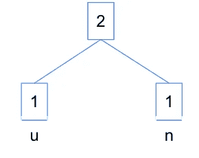
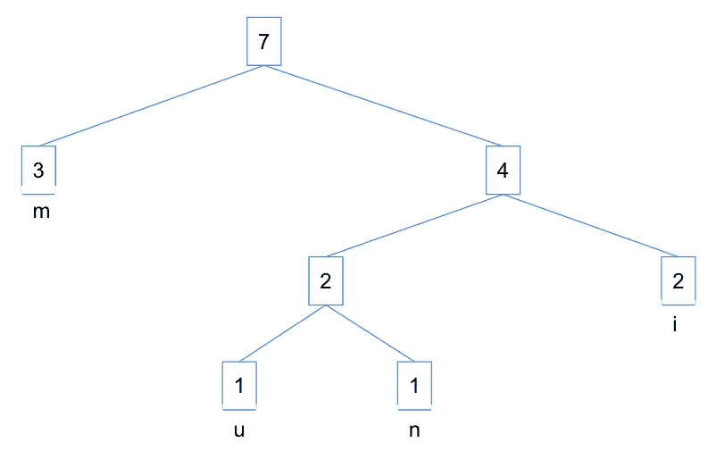
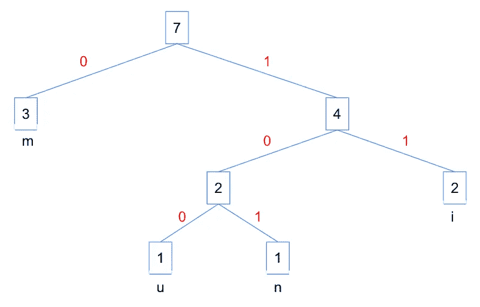

# 算法解释#7:霍夫曼编码

> 原文：<https://towardsdatascience.com/algorithms-explained-7-huffman-coding-1be107beb546>

## 一种文本压缩算法的解释及其在 Python 中的实现

在本算法讲解系列的前几篇文章中，我们经历了六种不同类型的算法( [#1:递归](/algorithms-explained-1-recursion-f101500f9316)、 [#2:排序](/algorithms-explained-2-sorting-18d0875528fb)、 [#3:搜索](/algorithms-explained-3-searching-84604e465838)、 [#4:贪婪算法](/algorithms-explained-4-greedy-algorithms-f60792046d40)、 [#5:动态规划](/algorithms-explained-5-dynamic-programming-e5472a4ce464)、 [#6:树遍历](/algorithms-explained-6-tree-traversal-1a006ba00672))。在本文中，我们将深入研究一个用于文本压缩的贪婪算法的实际用例——霍夫曼编码。

# 什么是霍夫曼编码？

霍夫曼编码是一种经常使用的技术，用于在不丢失信息的情况下将文本压缩到较小的大小。信息被编码为二进制字符串(1 和 0 的比特)，目标是用尽可能少的比特明确地传输信息。

这种贪婪算法通过评估字符的频率并使用按频率排序的二叉树，找到了将每个字符编码为二进制字符串的最佳方式。出现频率较高的字符被编码为较短位的字符串，而出现频率较低的字符被编码为较长位的字符串。

# 霍夫曼编码是如何工作的？

该算法通过使用优先级队列 *Q* 以自下而上的方式构建树 *T* 来工作，该优先级队列选择两个最不频繁的对象并将它们合并在一起，进而创建一个新对象，其频率是两个合并对象的频率之和。重复这个过程，直到输入文本中的所有单词都被编码。

# 用 Python 实现霍夫曼编码

考虑下面这个词——“最小”。

## I .创建一个树数据类

第一步包括编写一个数据类来存储树的数据。我选择使用数据类而不是常规类，因为在 Python 3 中，默认情况下数据类有各种“dunder”方法。例如，生成的`repr`(打印表示)字符串将包含类名，以及每个字段的名称和值，使用户更容易理解打印的树实例。

数据类本身相对简单。它包含两个参数，`left`表示左节点(str)，而`right`表示右节点(str)。当构建树时，我们需要访问子节点，所以在这个数据类中，有一个函数`children()`简单地返回`left`和`right`节点。

```
from dataclasses import dataclass[@dataclass](http://twitter.com/dataclass)
class Tree:
   left: str
   right: str def children(self):
      return self.left, self.right
```

## 二。构建树

接下来，我们将构建一个包含输入文本中按频率排序的所有字符的树。为此，我们将查看字符频率，并将这些字符存储在按频率排序的优先级队列 *Q* 中。

接下来，我们开始构建一棵树，由此我们将来自 *Q* 的具有最小频率的字符指定为根节点的左子节点，并将来自 *Q* 的具有第二最小频率的字符指定为根节点的右子节点。然后，我们将根节点的值指定为两个子节点的频率之和。

回到我们的词(“最小”)，按频率排序的唯一字符数是:`{'m': 3, 'i': 2, 'n': 1, 'u': 1}`。因此，第一次迭代将构建一个深度为 1 的树，由计数为 1 的“u”作为左子节点，计数为 1 的“n”作为右子节点，sum (2)作为根节点。



从第一次迭代构建的树

我们重复同样的过程，直到所有的字符都被编码，我们最终得到一个最大深度为 3 的树，如下图所示。



由单词“最小值”构造的树

下面是用 Python 编写的`HuffmanCodingTree`类中的`_build_tree()`函数的代码片段，它从输入文本构建了一棵树。与上述过程类似，该函数执行以下操作:

1.  统计输入文本中独特字符的频率，并将其存储为名为`char_counts`的字典。
2.  按频率降序排列`char_counts`，并将其存储为优先级队列 *Q* 。
3.  循环通过 *Q* 弹出频率最低的两个字符，并将其指定为左右节点，然后将两个子节点的频率相加，并将该值指定为父节点。
4.  将父节点作为包含树和父节点值的元组附加到 *Q.*

该函数返回构建树的*树*。对于我们输入的文本“最小值”，返回的结果将是:`Tree(left=Tree(left='m', right=Tree(left=Tree(left='u', right='n'), right='i'))`。

```
def _build_tree(self):
   # Get count of unique characters in chars
   char_counts = dict(Counter(self.chars))
   # Initiate priority queue Q of unique characters
   # and sort by descending order of frequencies
   Q = sorted(char_counts.items(), key=lambda x: x[1], reverse=True)

   while len(Q) > 1:
      # Get minimum value of Q to be assigned as left node
      node_l, freq_l = Q.pop()
      # Get next minimum value of Q to be assigned as right node
      node_r, freq_r = Q.pop()
      # Build tree with left and right nodes
      parent_node = Tree(left=node_l, right=node_r)
      # Sum frequencies of both returned values and assign to tree
      parent_node_freq = freq_l + freq_r
      # Add parent node to tree
      Q.append((parent_node, parent_node_freq))
      Q = sorted(Q, key=lambda x: x[1], reverse=True) return Q[0][0]
```

## 三。将霍夫曼编码分配给树

构建树之后，最后一步是分配编码。该算法将 0 赋给左边缘，1 赋给右边缘，因此我们将编写一个名为`_assign_huffman_coding()`的函数来完成这个任务，该函数有两个参数:`node`和`encoding`。

该函数将递归调用自身，直到树中的所有节点都被编码。因此，第一步是定义基本情况，其中输入是单个节点。然后，我们将递归调用该函数来构建左右分支，直到它到达基本情况(只剩下一个节点)。该函数返回一个字典，将节点作为键，将编码作为值。

```
def _assign_huffman_coding(self, node, encoding=''):
   # Case when node is a single node
   if type(node) == str:
      return {node: encoding}
   huffman_dict = {}
   (node_l, node_r) = node.children()
   # Recursively build left branch 
   huffman_dict.update(self._assign_huffman_coding(node=node_l, encoding=encoding + '0'))
   # Recursively build right branch 
   huffman_dict.update(self._assign_huffman_coding(node=node_r, encoding=encoding + '1'))

   return huffman_dict
```

# 结果

对于单词“minimum ”,产生的编码树如下所示。编码由边缘的红色文本表示。



单词“最小值”的霍夫曼树

要提取每个唯一字符的压缩代码，只需沿着从根节点到叶节点的边。例如，“m”的编码是`0`,“u”的编码是`100`。下表显示了单词“minimum”中每个独特字符的频率、编码和大小:

```
--------------------------------------------------
|  Character | Frequency |  Encoding |    Size   |
--------------------------------------------------
|      m     |     3     |     0     | 3 x 1 = 3 |
--------------------------------------------------
|      i     |     2     |    11     | 2 x 2 = 4 |
--------------------------------------------------
|      u     |     1     |    100    | 1 x 3 = 3 |
--------------------------------------------------
|      n     |     1     |    101    | 1 x 3 = 3 |
--------------------------------------------------
| 4x8=32bits |   7 bits  |           |  13 bits  |
--------------------------------------------------
```

每个字符的大小是 8 位，所以在没有压缩的情况下，单词“minimum”的大小将是 7 个字符 x 8 位= 56 位。利用霍夫曼编码算法，我们能够将字的大小减少到 32 位(4 个字符×每个字符 8 位)+ 7 位(频率之和)+ 13 位(频率之和×每个字符的深度)= 52 位。我们设法将单词“minimum”的大小减少了 4 位——想象一下这对于一个段落或一个文档会是什么样子！

## 结论

Huffman 编码算法用于文本压缩，它是一个有趣而实用的例子，用来说明以前在这个算法解释系列中涉及的概念，从贪婪算法到树遍历。实现霍夫曼编码算法有三个步骤:I)创建一个*树*数据类，II)从输入文本构建一个树，III)给树分配霍夫曼编码。

要查看完整代码，请点击[此处](https://github.com/claudian37/DS_Portfolio/blob/master/huffman_code/huffman_code_script.py)。更多文章参见本算法讲解系列: [#1:递归](/algorithms-explained-1-recursion-f101500f9316)、 [#2:排序](/algorithms-explained-2-sorting-18d0875528fb)、 [#3:搜索](/algorithms-explained-3-searching-84604e465838)、 [#4:贪婪算法](/algorithms-explained-4-greedy-algorithms-f60792046d40)、 [#5:动态规划](/algorithms-explained-5-dynamic-programming-e5472a4ce464)、 [#6:树遍历](/algorithms-explained-6-tree-traversal-1a006ba00672)。