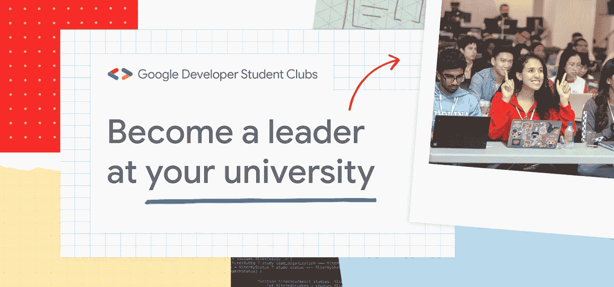
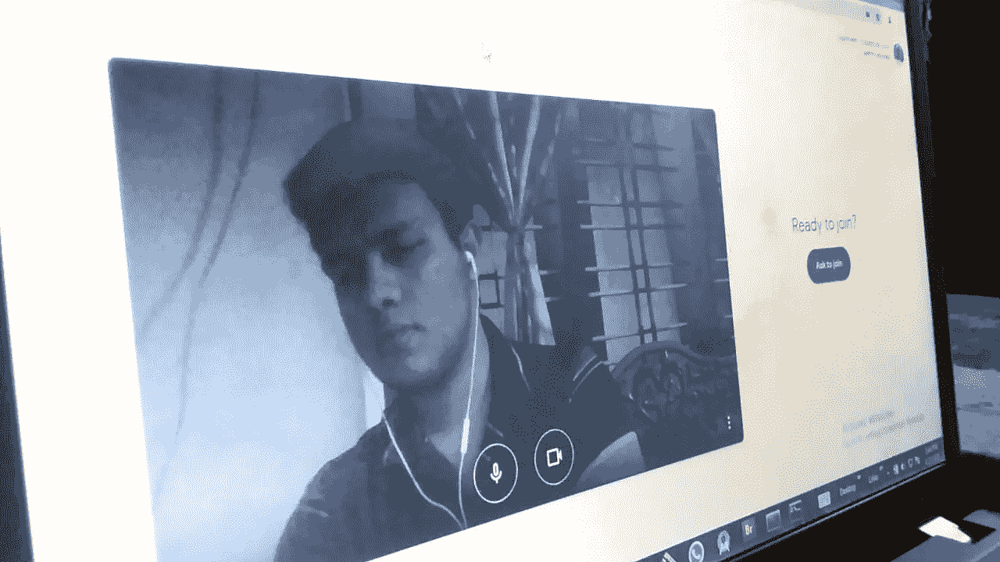
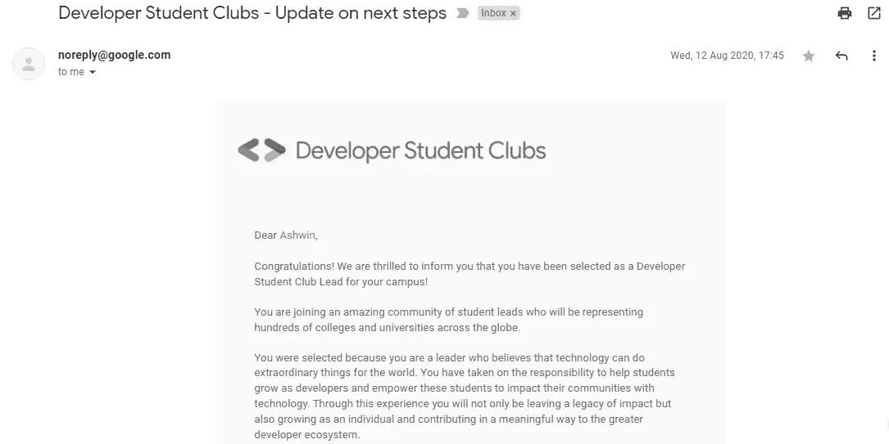
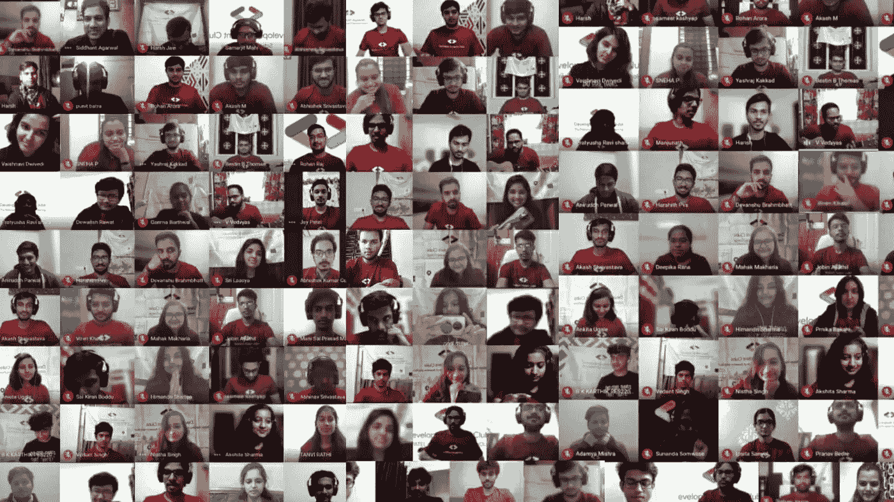
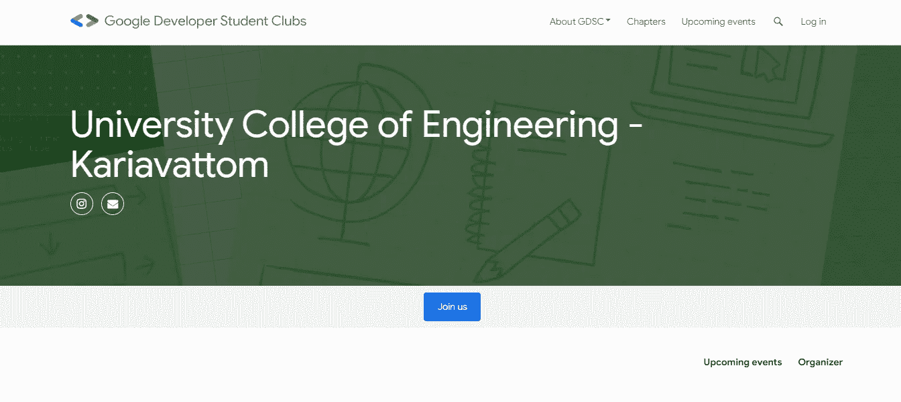
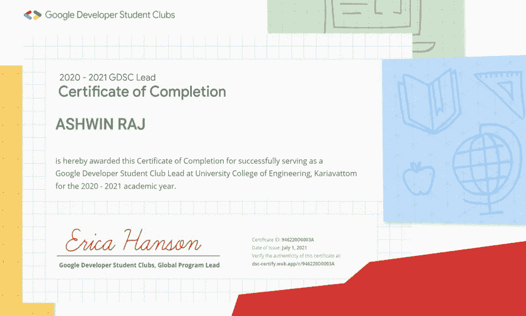
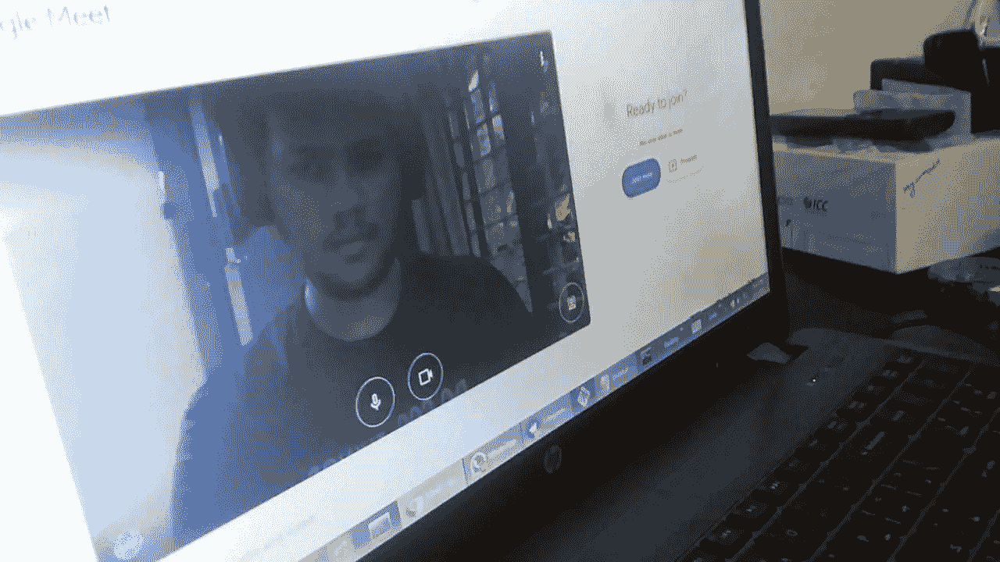

# 关于谷歌开发者学生俱乐部的一切——从申请到毕业

> 原文：<https://towardsdatascience.com/all-about-google-developer-students-club-from-application-to-graduation-bee35f411b05>

图片来自作者:GDSC——申请、选择、规划、毕业

## 从 DSC 领导的角度看开发者学生俱乐部

Google 每年都会从全球的大学中挑选学生来领导他们校园里的开发者社区，帮助学生弥合理论和实践之间的差距。这些学生是领导者，致力于帮助他们的同伴在对等的环境中学习、成长和联系。

作为该计划的一部分，这些被称为领导者的学生与他们的大学合作，在他们的校园里建立一个学生俱乐部，并与当地的合作伙伴合作，在谷歌的帮助下，为下一个 10 亿用户建立解决方案。我是在特里凡得琅的 DevFest'19 期间知道这个项目的。

这篇文章重点介绍了我在大学建立并领导一个开发者学生俱乐部的个人经历。如果你觉得这很有帮助，那就考虑鼓掌，这样灵媒就知道你在享受你所读的东西。此外，请随时通过 LinkedIn、脸书或 Instagram 与我联系。

# 打造完美应用程序

谷歌通过 Advocu 平台接受研究生和本科生的申请。印度地区的申请通常在三月的最后一周开放，通常会持续两到三周。

申请是在滚动的基础上进行评估的，所以建议尽快申请。这可以大大提高你被面试选中的几率。就我而言，我是在申请开始的前三天内申请的。你也可以通过填写这张[表格](https://docs.google.com/forms/d/e/1FAIpQLScCBTqwitma94TB5Hdm9ipy_gTDK2ftNYX84OprAfScVJ_Olg/viewform)来表达你的兴趣。

通常，作为申请的一部分，你会被要求提交你的个人资料，一些论文问题的答案，以及一段 90 秒的视频。在申请的时候，确保你严格遵循关于你的答案的性质和长度的指导方针。申请 GDSC 大学不需要你的简历。

> *瞄准月球发射。想想 10 倍。不是 10% ~* 肯·诺顿

将近两周后，我收到一封电子邮件，邀请我去采访一位谷歌开发专家。谷歌为你提供了从可用的时间段中选择面试的首选日期和时间的灵活性。尽早预订您喜欢的时间段，因为时间段预订是实时发生的。

一旦你预定了一个时段，你就会收到一个 30 分钟面试的日历邀请。我与 Summit Kakkar 先生的面谈安排在 4 月 30 日。

# 采访谷歌代表

面试，尤其是在线面试，可能会有压力。我面试的那天早上充满了焦虑，因为我事先不知道会发生什么。我的大学从来没有 GDSC 俱乐部，这是我第一次面试

为了镇定我的神经，我在面试开始前 10 分钟登录了会议。中午 12 点整，我的面试官加入了电话会议，但由于他的笔记本电脑需要充电，不得不推迟半个小时。我们在中午 12:20 左右联系上了，采访以友好的介绍开始。

图片来自作者:GDSC 采访前几分钟

气氛感觉很轻松，面试很顺利。面试官很想了解我的领导能力，以及我帮助同事成长的计划。只有几个技术性问题，这让面试更像是一场对话。我觉得面试总体来说很顺利。

# 选拔和入职

在接下来的三个月里，我在 GDSC 的申请没有任何进展(延迟是因为新冠肺炎疫情病毒的爆发)，但是我确保和团队保持联系，因为我有很高的期望。

到了 8 月的第二周，谷歌终于开始发送选拔邮件，8 月 12 日，我收到了一封电子邮件，通知我已被我所在的学院选为领袖，并将加入一批来自世界各地 1000 多所大学和学院的出色学生领袖。

图片来自作者:GDSC 精选邮件

所有销售线索必须在收到选择电子邮件的 7 天内提交一份接受表，以确认他们参与该计划。一旦他们接受，他们将获得各种专属平台和资源，包括社区领导平台、活动平台、官方全球 Slack 和全球 GDSC 邮件列表等。

由于全球疫情，DSC 峰会被取消，线索收到了一箱谷歌商品，如 t 恤，咖啡杯，耳机，营销材料和许多其他谷歌品牌的物品。

两周后，谷歌为所有新选择的潜在客户举办了一个三小时的专门入职会议。在这次会议中，我们被介绍给 GDSC 的社区项目经理，并简要介绍了我们的职责。

本次会议由来自世界各地的多位嘉宾主讲，我们还听取了即将毕业的领导讲述他们的经历。在我们的任期内，我们总共与四位 CPM 合作。就这样，简单的部分结束了，真正的工作才刚刚开始。终于到了我系好安全带的时候了。

# 核心团队选择和活动策划

任何成功的俱乐部都需要志趣相投的个人的协调、合作和协作，而这正是你的核心团队发挥关键作用的地方。这些人是您的同事，他们将在您作为领队的整个旅程中协助您组织和规划活动和其他活动。

图片来自作者:GDSC 每周同步-圣诞庆典

谷歌建议拥有一个由 5 名成员组成的核心团队，但是你可以招募你认为需要的人数。一个理想的核心团队由来自不同院系和学术水平的学生组成。我从 8 名成员开始，最终团队发展到 11 人。领导制定成员资格标准。

当我开始从零开始创建俱乐部时，我的重点是让那些擅长影响校园中被动人群的人开始参与技术活动。如果你已经在你的大学里有一个专门的俱乐部，你可以选择具有良好技术技能和知识的人。

每位领导还必须从他们的学院中选择一名指导教师，理想情况下，应该是你的系主任或你的工作人员指导教师。这些教师顾问将帮助和指导你在你的大学顺利举办活动，并将接受一些培训。

谷歌不承认任何俱乐部的联合领导，尽管你仍然可以在团队中包括一个(领导特权将只提供给官方选择的领导)。此外，你可以自由邀请高年级学生加入你的核心团队。然而，需要注意的是，俱乐部的所有核心团队成员必须在同一所大学学习。

领导每周与 CPM 进行一次同步电话会议，有时每两周一次，讨论项目的未来。在这些通话中，销售线索可以与项目经理互动，消除他们的疑虑。就我们而言，过去我们每周二从晚上 8 点开始开一个小时的会。

为了成功完成该计划，谷歌要求领导每 90 天至少安排一次活动。这些活动提供了一个讨论谷歌以外的技术的机会，目的是在不贬低包括谷歌在内的任何公司的情况下促进跨技术学习。

在我任职期间，在一个专门团队的支持下，我成功地组织了超过 18 次在线活动，指导了近 2，000 名学生(尽管我来自一所学生不足 300 人的大学。)在各种技术领域，如云计算、应用程序开发和机器学习。

要成功组织一次活动，让相关领域的专业人士参与进来至关重要。我们的活动主要由亚马逊和 GitHub 等大型跨国公司的嘉宾主讲。语言限制不是问题，用当地语言举办活动完全可以接受。

图片来自作者:GDSC 活动平台

谷歌开发人员为每个俱乐部提供了一个专属的活动平台，用于注册活动和收集学生的反馈。虽然领导者可以选择为他们的俱乐部创建一个个性化的网站，但只有在 DSC events 平台中记录的活动才会被计入由 Google Developers 团队评估的领导者毕业要求的实现情况。

除了活动平台，销售线索还可以利用社区销售线索平台，这是一个只有通过邀请才能访问的专属平台。它使销售线索能够在计划活动时交换和使用资源，包括资料、时间表和其他活动工具。

为了支持他们的营销工作，销售线索会收到一个虚拟计划套件，其中包含大量针对不同社交媒体平台优化的数字模板和视觉资产。组织者被允许使用品牌标志和设计，只要他们遵守品牌指南。

# 活动协作和解决方案挑战

与其他团体、俱乐部和组织合作是为 DSC 活动争取更多演讲者、场地和赞助的好方法。在选择合作伙伴时，谷歌非常通融。但是，领导应避免利用 GDSC 谋利。组织者只应向参与者收取活动运营成本的费用。

我第一次作为领导者与特里凡得琅工程学院合作，组织了为期 4 天的 Android 学习 Jams 活动。我们的合作伙伴关系使我们两个俱乐部能够将他们的影响扩大到更广泛的受众，不仅是在四次学习堵塞期间，而且在随后的许多项目中。

在我任职期间，我们与 125 个以上的 GDSCs 合作组织了为期一周的系列研讨会、活动等。仅在头几天，旗舰活动就吸引了超过 13，000+的注册和超过 50，000+的浏览量。这种合作帮助我们获得了大型赞助商和参与者。

在 DSC WoW 之后，我们与该国的 30 个其他俱乐部合作组织了为期一个月的网络学习集会，名为 30 天的网络开发。

在任期的最后一个季度，GDSC 领导有机会参加技能提升培训计划，该计划为领导及其核心团队成员提供专门的软硬技能培训。培训每周进行一次，通常是在引导期的最后一个季度。

GDSC 还通过解决方案挑战为学生提供了另一个绝佳的机会，这是一个由谷歌开发团队主办的为下一个 10 亿用户打造的竞赛。这个机会只提供给谷歌开发者学生俱乐部的会员。最近，DSC 解决方案挑战赛的目标是利用谷歌技术解决 17 个联合国可持续发展目标(SDG)中的一个或多个。

比赛的获胜者将获得各种奖励，如现金奖励、证书等。此外，谷歌工程师为他们提供指导机会，帮助他们开发解决方案。

# 推荐、毕业和 GDSC 会议后的机会

在选择新线索的申请打开之前，当前线索被给予推荐代码，该代码可以与希望在其大学申请领导 GDSC 的有抱负的学生共享。这些代码在公开申请发布前一周提供给当前负责人，并且可以与任何机构的学生共享，无论他们的资格如何。

请记住，有推荐人并不能确保你会被选中或进入面试名单，但它确实会在每年提交的大量申请中为你的申请提供一些额外的考虑。

图片来自作者:GDSC 结业证书

经过几个月的努力工作，当我从这个项目毕业时，终于到了我们将衣钵传递给下一批领导的时候了。就我而言，我们的任期于 6 月 1 日结束，也就是我加入后的近 10 个月。我们用一个虚拟毕业日计划来庆祝，在这个计划中，所有符合毕业标准的领导都会收到他们的证书和相应的权利。

由于该项目是在网上进行的，谷歌提出为所有线索支付零食的费用。毕业日包括一个网络会议，一个令人惊叹的魔术表演，接着是聊天室的见面和问候。

几周后，谷歌向所有符合条件的领导及其核心团队成员分发了毕业 schwag 工具包。GDSCs 为学生提供了无限的机会，我坚信我们作为学生获得的经验是令人难以置信的充实。作为社区的一部分，我们的活动不仅帮助了我们，也帮助了我们大学内外的本地开发者社区。

图片来自作者:GDSC 毕业日 2021

在我的领导任期结束后，我成为了微软学习项目的学生大使和 IEDC 的首席执行官，并在雀巢和小米完成了实习。我相信我在谷歌开发者学生俱乐部的经历为我提供了一个坚实的基础，帮助我在这些高要求的角色中脱颖而出。

就这样，我以为我和 GDSC 的旅程结束了。但是没有？在我任期结束后的 2021 年，我有机会在德国亚琛工业大学指导 GDSC。目前，在 2022 年，我在我自己的学院指导俱乐部，由我的一名 GDSC 大学新生领导。

话虽如此，是时候总结一下了。我希望这篇文章能帮助你在加入一个最受欢迎的社区时有一个良好的开端。如果你有任何问题，或者如果你认为我犯了一个错误，请随时通过 [LinkedIn](https://www.linkedin.com/in/thisisashwinraj/) 、 [Instagram](https://www.instagram.com/thisisashwinraj/) 或 [mail](http://rajashwin733@gmail.com) 与我联系。下次见，快乐学习。