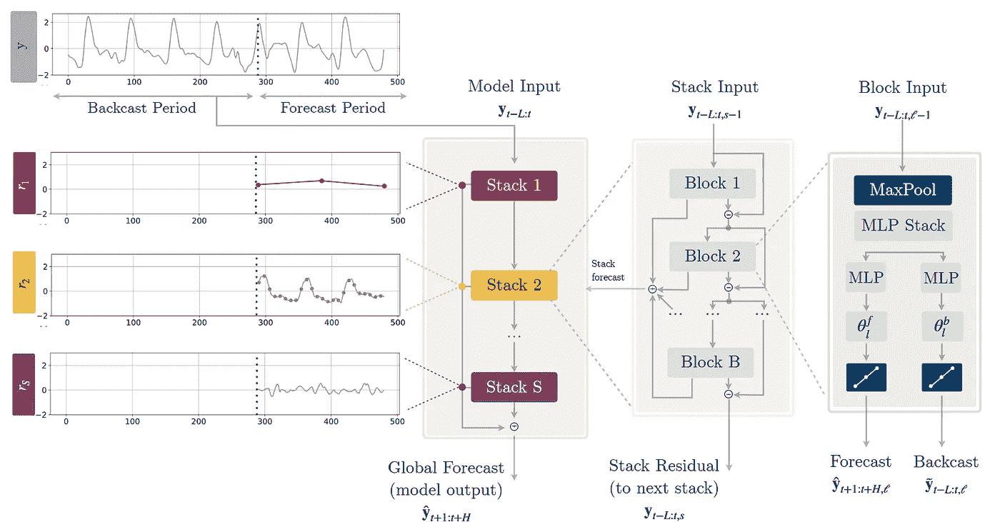
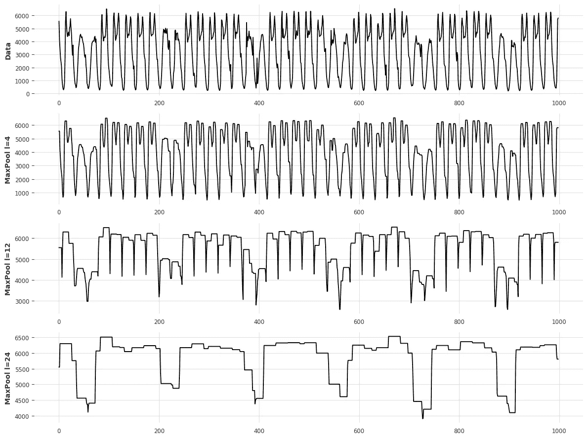
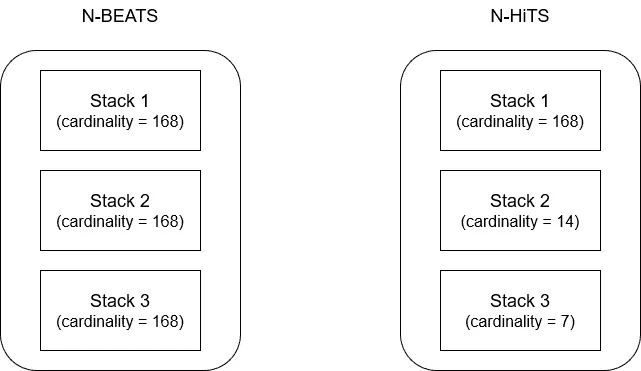
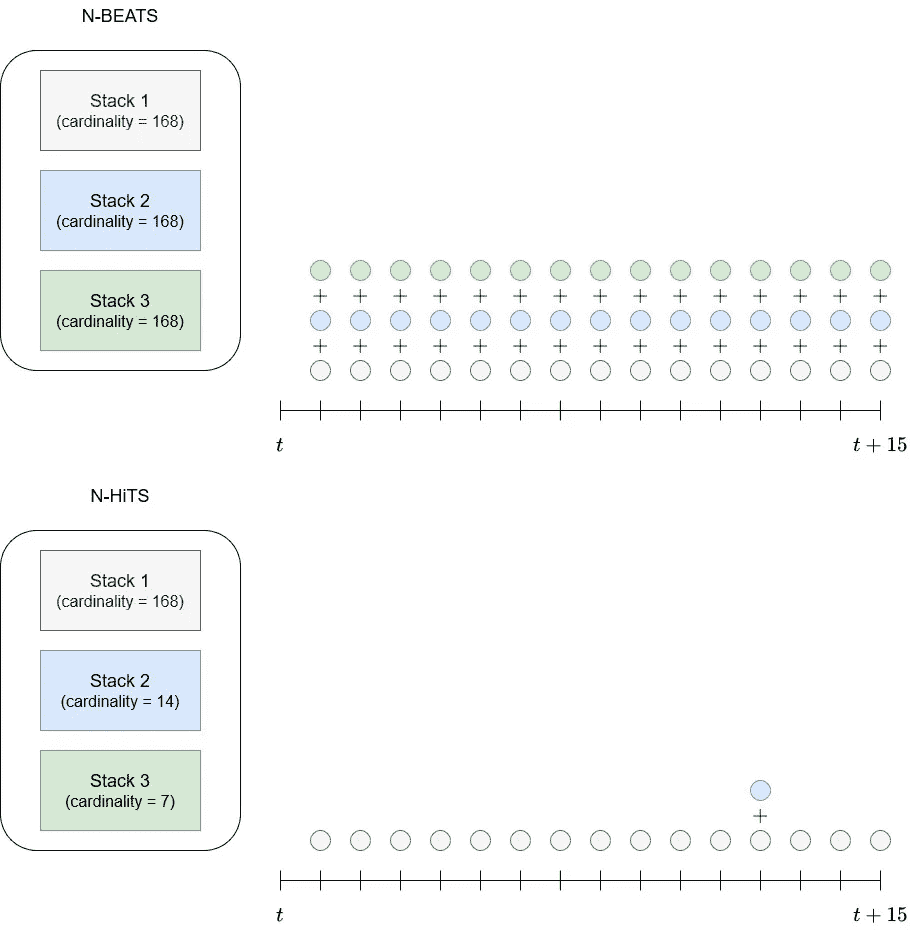
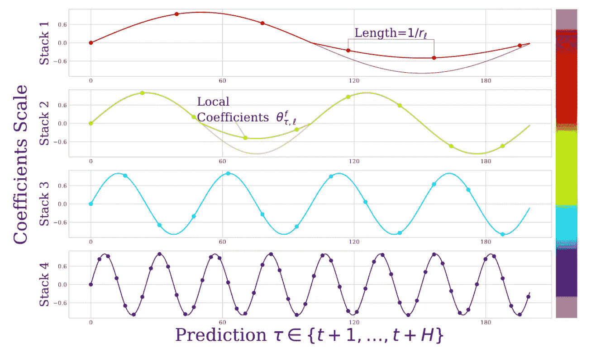
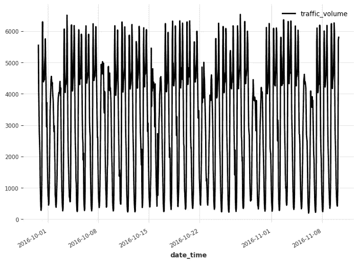
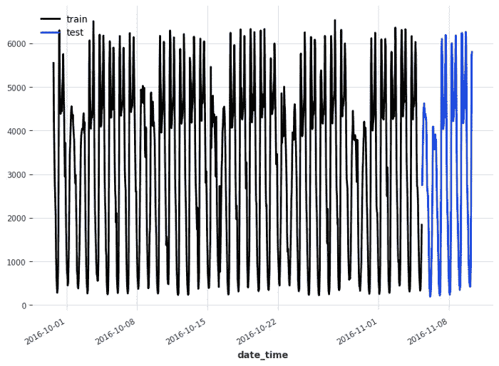
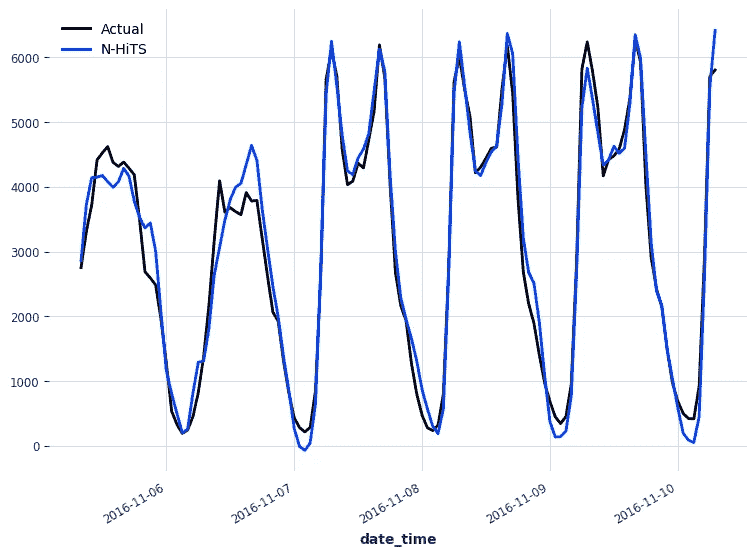
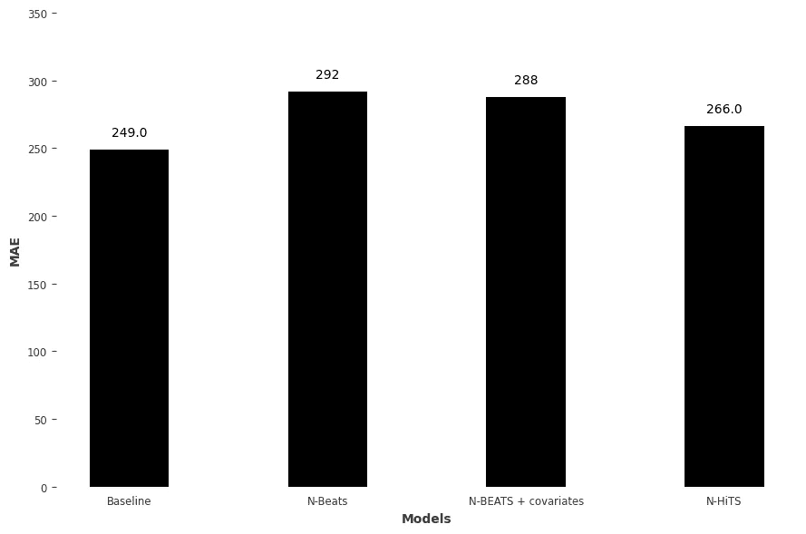

# 所有关于 N-HiTS:时间序列预测的最新突破

> 原文：<https://towardsdatascience.com/all-about-n-hits-the-latest-breakthrough-in-time-series-forecasting-a8ddcb27b0d5>

## 从理论到实践，了解时间序列预测的最新技术 N-HiTS，并使用 Python 将其应用到实际项目中


毛罗·吉利在 [Unsplash](https://unsplash.com?utm_source=medium&utm_medium=referral) 上拍摄的照片

在[之前的一篇文章](https://www.datasciencewithmarco.com/blog/the-easiest-way-to-forecast-time-series-using-n-beats)中，我们探索了 N-BEATS:一种依靠基础扩展概念来预测时间序列的深度学习模型。

在发布时，即 2020 年，N-BEATS 使用不依赖于时间序列特定组件的纯深度学习架构实现了最先进的结果。

截至 2022 年 1 月，已经提出了增强 N-BEATS 的新模型: [N-HiTS](https://arxiv.org/pdf/2201.12886.pdf) 。这个由 Challu 和 Olivares 等人提出的新模型改进了输入的处理和输出的构造，导致更好的精度和更低的计算成本。

在本文中，我们首先详细探索 N-HiTS 的内部工作原理，以了解这种新方法如何改进 N-BEATS。然后，我们使用 Python 在预测项目中实际应用 N-HiTS。

我强烈建议您在处理这个问题之前阅读我关于 N-BEATS 的文章，因为 N-HiTS 是 N-BEATS 的一个发展，并且两个模型之间有许多相同的概念。

同样，我将使用更多的直觉和更少的等式来解释 N-HiTS 的架构。当然，更多的细节，我建议你看一下[原文](https://arxiv.org/pdf/2201.12886.pdf)。

> **用 Python 中我的** [**免费时间序列小抄**](https://www.datasciencewithmarco.com/pl/2147608294) **学习最新的时间序列分析技术！获得统计和深度学习技术的实现，全部在 Python 和 TensorFlow 中！**

我们开始吧！

# 探索 N 次点击

N-HiTS 代表**N**T21**欧洲 **i** 国际**时间**S**系列预测。

简而言之，N-HiTS 是 [N-BEATS](https://www.datasciencewithmarco.com/blog/the-easiest-way-to-forecast-time-series-using-n-beats) 模型的扩展，提高了预测的准确性，降低了计算成本。这是通过模型以不同的速率对时间序列进行采样来实现的。这样，模型可以学习系列中的短期和长期效果。然后，在生成预测时，它将结合不同时间尺度的预测，同时考虑长期和短期影响。这叫做*分层插值*。

让我们更深入地研究这个架构，详细了解这个模型是如何工作的。

## N-HiTS 的体系结构

下面是 N-HiTS 的架构。



N-HiTS 的架构。还是那句话，模型是由栈和块组成的，就像 N 拍一样。图片由 C. Challu、K. Olivares、B. Oreshkin、F. Garza、M. Mergenthaler-Canseco 和 A. Dubrawski 拍摄，来自 [N-HiTS:用于时间序列预测的神经分层插值](https://arxiv.org/pdf/2201.12886.pdf)

从上图中，我们注意到该模型与 N-BEATS 非常相似:该模型同时进行预测和反预测，它由堆栈和块组成，最终预测是每个堆栈的部分预测之和，一个堆栈中的每个块之间存在残差连接。

然而，有一些关键的修改允许 N-HiTS 持续优于 N-BEATS。

## 多速率信号采样

在数据块级别，我们注意到增加了一个 MaxPool 层。这就是模型实现多速率采样的方式。

回想一下 *maxpooling* 只是取给定的一组值中的最大值。每个堆栈都有自己的内核大小，内核大小的长度决定了采样速率。

较大的内核大小意味着堆栈关注时间序列中的长期影响。或者，小的内核尺寸强调系列中的短期效应。下图显示了这一点。



说明了 MaxPool 层内核大小的影响。请注意，较大的内核大小如何通过更积极的子采样来强调系列中的长期特征。图片由作者提供。

看上面的图片，我们可以看到改变内核大小是如何影响堆栈的输入信号的。由于内核较小，该系列几乎没有变化，并且包含短期变化。然而，随着内核大小的增加，我们可以看到该系列变得更加平滑，并且强调了长期变化。

因此，最大池层允许每个堆栈专注于特定的信号规模，无论是短期还是长期。这也是 N-HiTS 在长期预测方面表现更好的原因，因为在系列中有一个专门学习和预测长期影响的堆栈。

此外，由于大的核大小更积极地对序列进行重新采样，它减少了可学习参数的数量，从而使模型更轻便，训练更快。

## 回归

一旦输入信号通过最大池层，该模块使用全连接网络来执行回归，并输出预测和反向预测。

backcast 表示块捕获的信息。因此，我们从输入信号中移除反向传播，并通过剩余连接将结果信号传递给下一个模块。这样，任何未被某个块捕获的信息都可以被下一个块建模。

## 分级插值

顾名思义，N-HiTS 使用分层插值来产生其预测。这用于降低预测的基数。让我们把这个翻译成日常用语。

请记住，基数只是一组给定数字中元素的数量。例如，[6，7，8，9]的基数是 4，因为集合中有四个元素。

因此，在大多数预测模型中，预测的基数等于预测范围的长度。换句话说，预测的数量等于我们希望预测的未来时间步长的数量。例如，如果我们想要未来 24 小时的每小时预测，那么模型必须输出 24 个预测。

当然，所有这些都是有意义的，但当视野变得很长时，就会出现问题。如果我们想要的不是未来 24 小时的每小时预测，而是未来 7 天的每小时预测，那该怎么办？在这种情况下，模型的输出基数为 168 (24 * 7)。

如果您回忆一下 N-BEATS 模型，最终预测是每个堆栈的所有部分预测的组合。因此，每个堆栈生成 168 个预测，这在计算上是昂贵的。

为了解决这个问题，N-HiTS 使用分层插值，其中每个堆栈都有一个他们称之为*的表现力比率*。这就是单位时间内预测的次数。反过来，这与每个堆栈专门以不同的速率处理序列的事实有关，因为 MaxPool 层对序列进行子采样。

例如，一个堆栈每小时学习一次短期效应，但下一个堆栈每 12 小时对序列进行二次采样，下一个堆栈每 24 小时进行一次。因此，由于每个堆栈都有自己的规模，因此每个堆栈的基数都不同。下图对此进行了说明。



假设对下周的每小时预测。我们可以看到 N-HiTS 具有较低的基数，因为每个堆栈都有自己的规模。堆栈 1 查看每小时的数据，堆栈 2 查看每 12 小时的数据，堆栈 3 查看每 24 小时的数据。图片由作者提供。

在上图中，我们假设一个场景，其中我们有每小时的数据，我们希望对下周进行每小时的预测(未来 168 次预测)。在 N 拍的情况下，每个堆栈进行 168 次部分预测，并且必须对每个进行求和以生成最终预测。

但是，在 N 次命中的情况下，由于 MaxPool 层的原因，每个堆栈以不同的比例查看数据。因此，堆栈 1 查看每小时的数据，因此必须进行 168 次预测。例如，Stack 2 每隔 12 小时查看一次数据，因此只需进行 14 次预测(因为 12 适合 168 的 14 倍)。然后，Stack 3 每隔 24 小时查看一次数据，因此它只需进行 7 次预测(因为 24 适合 168 中的 7 次)。

因此，我们看到堆栈 1 比堆栈 2 具有更高的表现率，堆栈 2 比堆栈 3 具有更高的表现率。

我们可以在下图中看到这种行为。



N-BEATS 和 N-HiTS 如何预测？在顶部，我们看到每个 N 拍堆栈在每个时间步长输出一个预测，必须对其求和才能生成最终预测。在底部，N-HiTS 输出的预测要少得多，因为每个堆栈都以自己的频率工作。图片由作者提供。

从上面的图片中，我们清楚地看到 N-BEATS 的每个堆栈在每个时间步都输出一个预测，并且每个堆栈都必须求和才能生成最终预测。

另一方面，N-HiTS 具有工作在不同频率的堆栈。因此，堆栈 1 在每个时间步长进行预测，但是堆栈 2 仅每 12 小时进行一次预测，而堆栈 3 每 24 小时进行一次预测，因此降低了计算成本。

将不同时间尺度的预测相结合的事实定义了分级插值。

如果不清楚的话，这里有一个取自原始文章的图，它也说明了分层插值。



N-HiTS 中的层次插值。我们可以看到每个堆栈输出不同数量的预测，因为它们每个都在自己的规模(或频率)上专门化。C. Challu、K. Olivares、B. Oreshkin、F. Garza、M. Mergenthaler-Canseco 和 A. Dubrawski 的图像来自 [N-HiTS:用于时间序列预测的神经分层插值](https://arxiv.org/pdf/2201.12886.pdf)

同样，在上图中，我们看到 N-HiTS 中的每个堆栈输出不同数量的预测，因为每个堆栈工作在不同的频率。Stack 1 着眼于长期效应，因此它的预测在时间上更有间隔。另一方面，Stack 4 关注短期影响，并输出时间上更接近的更精细的预测。

## 摘要中的 n 次点击

简而言之，N-HiTS 通过一个 MaxPool 层扩展了 N-BEATS 架构，允许每个堆栈以不同的比例查看系列。一个堆栈可以专注于长期效果，另一个专注于短期效果。通过在称为分层插值的过程中组合每个叠加的预测来获得最终预测。这使得模型更轻便，对于预测长时间范围更准确。

既然我们已经详细探讨了 N-HiTS 的内部工作原理，那么让我们将它应用到一个预测项目中。

# N 次命中预测

我们现在准备在预测项目中应用 N-HiTS 模型。在这里，我们将预测每小时 94 号州际公路西行交通量。注意，我们只使用了 UCI 机器学习知识库上的[完整数据集](https://archive.ics.uci.edu/ml/datasets/Metro+Interstate+Traffic+Volume)的一个样本，该样本由明尼苏达州交通部好心提供。

这与我们在 N-BEATS 的[文章中使用的数据集相同。我们将使用相同的基线和相同的训练/测试分割，来评估 N-HiTS 相对于 N-BEATS 和基线模型的性能。](https://www.datasciencewithmarco.com/blog/the-easiest-way-to-forecast-time-series-using-n-beats)

为了完整起见，我们在这里包括了所有的步骤，但是如果你最近读了我的关于 N-BEATS 的文章，可以直接跳到应用 N-HiTS。

同样，我们使用 Darts，所有代码都在 Python 中，你可以在 [GitHub](https://github.com/marcopeix/time-series-analysis/blob/master/NHiTS.ipynb) 上获取完整的源代码以及数据集。

我们走吧！

## 读取数据

当然，每个项目都从导入必要的库开始。

```
import pandas as pd
import numpy as np
import datetime
import matplotlib.pyplot as plt

from darts import TimeSeries

import warnings
warnings.filterwarnings('ignore')
```

然后，我们实际上读取我们的数据，并将其存储在数据帧中。

```
df = pd.read_csv('data/daily_traffic.csv')
```

由于我们使用的是 dart，我们将从 DataFrame 转到 TimeSeries 对象，这是 dart 中的基本对象。Darts 中的每个模型都必须有一个 TimeSeries 对象作为输入，它还输出一个 TimeSeries 对象。

```
series = TimeSeries.from_dataframe(df, time_col='date_time')
```

现在，我们可以使用`plot`方法轻松地可视化我们的数据。

```
series.plot()
```



每小时 94 号州际公路西行交通量。我们已经可以看到每日的季节性和每周的季节性。图片由作者提供。

看上面的图，我们已经发现我们有两个季节周期:每周和每天。很明显，白天路上的车比晚上多，工作日的车比周末多。

这实际上可以用飞镖来验证。它带有一个`check_seasonality`函数，可以告诉我们一个季节周期是否具有统计意义。

在这种情况下，因为我们有每小时的数据，所以每日季节性的周期为 24(一天中的 24 小时)，每周季节性的周期为 168(一周中的 24*7 小时)。

所以，让我们确保这两个季节都很重要。

```
from darts.utils.statistics import check_seasonality

is_daily_seasonal, daily_period = check_seasonality(series, m=24, max_lag=400, alpha=0.05)
is_weekly_seasonal, weekly_period = check_seasonality(series, m=168, max_lag=400, alpha=0.05)

print(f'Daily seasonality: {is_daily_seasonal} - period = {daily_period}')
print(f'Weekly seasonality: {is_weekly_seasonal} - period = {weekly_period}')
```

上面的代码块将打印出两个季节周期都是重要的，稍后我们将如何对该信息进行编码以将其输入到我们的模型中。

## 拆分数据

预测项目中的一个自然步骤，将我们的数据分成训练集和测试集。在这种情况下，我们为测试集保留最近五天的数据，并将其余数据用于训练。

```
train, test = series[:-120], series[-120:]

train.plot(label='train')
test.plot(label='test')
```



训练/测试分割了我们的数据。最后五天用于测试集。图片由作者提供。

## 基线模型

在使用 N-BEATS 之前，最好先有一个基线模型。这是一个简单的模型，作为确定更复杂的模型是否更好的基准。

基线模型通常依赖于简单的统计或简单的启发式。在这种情况下，一种简单的预测方法是简单地重复上一个季节。在这里，由于我们有两个季节性周期，我们将使用每周季节性，以考虑周末的交通量较低。

```
from darts.models.forecasting.baselines import NaiveSeasonal

naive_seasonal = NaiveSeasonal(K=168)
naive_seasonal.fit(train)

pred_naive = naive_seasonal.predict(120)
```

在上面的代码块中，我们简单地获取了训练集中最后一周的数据，并在将来重复它。当然，由于我们的预测范围只有五天而不是七天，我们在第五天截断了预测。

下面，我们可以看到来自基线模型的预测。

```
test.plot(label='test')
pred_naive.plot(label='Baseline')
```


来自基线模型的预测。图片由作者提供。

然后，我们使用平均绝对误差(MAE)来评估基线的性能。

```
from darts.metrics import mae

naive_mae = mae(test, pred_naive)

print(naive_mae)
```

这给了我们 249 的 MAE，因此这是我们试图使用 N-HiTS 来打破的分数。

## 应用 N 次点击

我们现在准备将 N-HiTS 应用到我们的项目中。

Darts 使我们能够非常轻松地使用 N-BEATS 和 N-Hits 等最先进的模型，因此我们从导入模型和数据缩放器开始。当使用深度学习时，在 0 和 1 之间缩放数据总是一个好主意，因为它使训练更快。

```
from darts.models import NHiTSModel
from darts.dataprocessing.transformers import Scaler
```

然后，我们在 0 和 1 之间调整我们的数据。请注意，我们只在训练集上安装了缩放器，以避免将测试集的信息提供给模型。

```
train_scaler = Scaler()
scaled_train = train_scaler.fit_transform(train)
```

现在，我们准备初始化 N-HiTS 模型。这里，我们提供了整整一周的数据(168 个时间步长)，并训练模型预测未来五天(120 个时间步长)，因为这是我们测试集的长度。

```
nhits = NHiTSModel(
    input_chunk_length=168, 
    output_chunk_length=120,
    random_state=42)
```

然后，我们简单地在缩放的训练集上拟合模型。

```
nhits.fit(
    scaled_train,
    epochs=50)
```

在这里，我们真的可以看到 N-HiTS 的训练速度比 N-BEATS 快得多。另外，飞镖给我们展示了模型的尺寸。在 N-HiTS 的情况下，我们的模型重 8.5 MB，而 N-BEATS 重 58.6 MB。几乎轻了 7 倍！

我们清楚地看到了更低的计算成本，但是该模型在预测方面的表现如何呢？

然后，我们使用`predict`方法生成预测。请注意，预测将在 0 和 1 之间，因为我们适合缩放的训练集，所以我们需要反转转换。

```
scaled_pred_nhits = nhits.predict(n=120)
pred_nhits = train_scaler.inverse_transform(scaled_pred_nhits)
```

我们可以在下图中看到 N-HiTS 的预测。

```
test.plot(label='Actual')
pred_nhits.plot(label='N-HiTS')
```



来自 N 次点击的预测。图片由作者提供。

然后，我们简单地打印出 MAE。

```
mae_nhits = mae(test, pred_nhits)

print(mae_nhits)
```

这打印了 266 的 MAE。同样，我们没有超过基线，但这是对 N-BEATS 的一个显著改进，如下所示。



每个预测模型的性能。我们看到 N-HiTS 优于 N-BEATS，但它的表现却不如基线。图片由作者提供。

同样，结果令人失望，因为基线仍然优于 N-HiTS。但是，请记住，我们正在处理一个小而简单的数据集。我只取了一个[完整数据集](https://archive.ics.uci.edu/ml/datasets/Metro+Interstate+Traffic+Volume)的样本，这个样本可能特别具有重复性，这解释了为什么基线如此之好。

尽管如此，您现在知道 N-HiTS 如何工作，以及如何在预测项目中应用它！

# 结论

N-HiTS 是时间序列预测模型的最新发展，它的表现一直优于 N-BEATS。

N-HiTS 在 N-BEATS 的基础上构建，在每个块上添加一个 MaxPool 层。这将对系列进行子采样，并允许每个堆栈根据内核大小关注短期或长期效果。然后，使用分层插值来组合每个堆栈的部分预测。

这导致 N-HiTS 是一个更轻的模型，在长时间范围内具有更准确的预测。

我希望你喜欢这本书，并且你学到了新的东西！

干杯🍺