# 关于 Python 的全部内容——100 多个代码片段、技巧、概念和重要模块

> 原文：<https://towardsdatascience.com/all-about-python-100-code-snippets-tricks-concepts-and-important-modules-9a9fda489b6b>


由 [Pablo Heimplatz](https://unsplash.com/@pabloheimplatz?utm_source=medium&utm_medium=referral) 在 [Unsplash](https://unsplash.com?utm_source=medium&utm_medium=referral) 上拍摄的照片

Python 是目前最流行的语言。它在从网站建设到人工智能的所有领域都被大量使用。

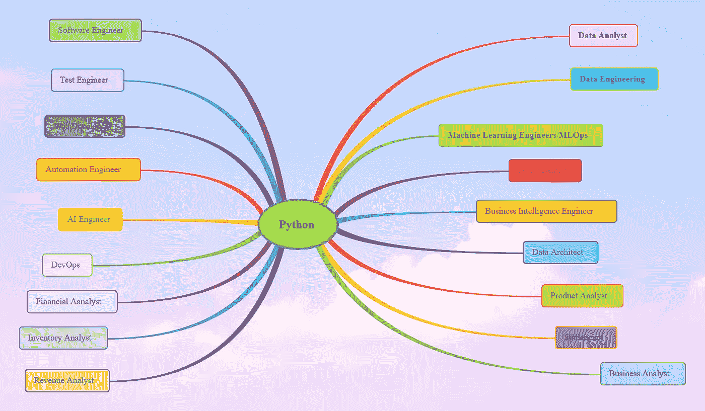

作者图片

一些在日常工作中使用 python 的人是数据分析师、数据科学家、数据工程师、机器学习工程师、web 开发人员等。在这篇文章中，我分享了一些 python 中的代码片段、概念和重要模块，我觉得它们非常有用，希望对你有用。其中大部分是我从 python 文档、stackoverflow 和 kaggle 中找到的。如果你想了解数据结构和算法，那就练习 leetcode 或 hackerrank 类型的问题。

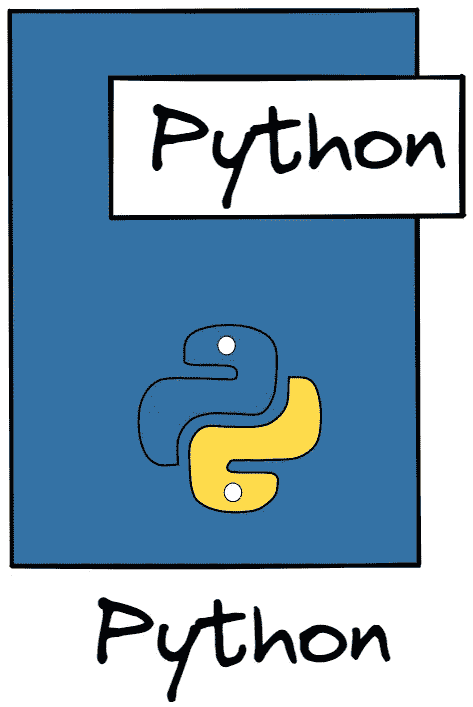

来自 excalidraw 库的图像

我使用了以下工具

*   ***carbon.now.sh*** 为代码片段。
*   ***excalidraw*** 为图纸
*   ***Gitmind*** 为流程图。

我们开始吧。

## 1.将两个列表转换成字典:

图片由作者使用 carbon.now.sh

```
{‘CLIPPERS’: 3, ‘GSW’: 1, ‘LAKERS’: 2}
```

## 2.使用 ZIP 和 ZIP(*)

图片由作者使用 carbon.now.sh

```
[(‘car’, 10), (‘truck’, 20), (‘bus’, 30)]
(‘car’, ‘truck’, ‘bus’)
(10, 20, 30)
```

## 3.平铺列表:

图片由作者使用 carbon.now.sh

```
[1, 2, 3, 3, 7, 8, 9, 12, 17]
```

## 4.使用 Pickle 保存和加载机器学习模型:

图片由作者使用 carbon.now.sh

此外，查看这篇 Kaggle 文章，了解更多信息

## 5.融化功能。

Pandas melt()函数用于将数据帧的格式从宽改为长。

图片由作者使用 carbon.now.sh

df:

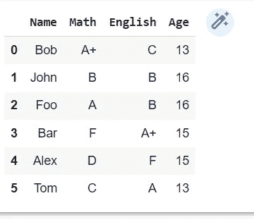

df1:

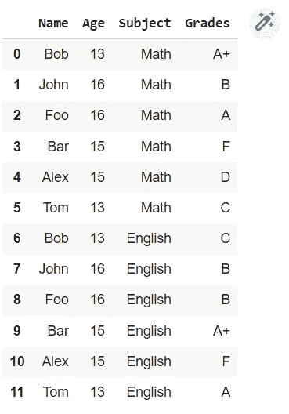

另一个例子:

图片由作者使用 carbon.now.sh

有关更多信息，请检查此[堆栈溢出](https://stackoverflow.com/questions/68961796/how-do-i-melt-a-pandas-dataframe)。

## 6.Faker:

Faker 是一个为你生成虚假数据的 Python 包。无论您需要引导您的数据库、创建好看的 XML 文档、填充您的持久性以对其进行压力测试，还是匿名化来自生产服务的数据，Faker 都适合您。

图片由作者使用 carbon.now.sh

```
Jeremy Craig
1302 Brittany Estate
Lake Diamondburgh, HI 31774
Level president life time follow indicate size should. Consumer ability this perform write. Oil wait left tough product.
Need out per third most job special. Good gas star build blood.
```

## 7.串并分割:

在给定的分隔符/分隔符周围拆分字符串。

图片由作者使用 carbon.now.sh

**输出:**

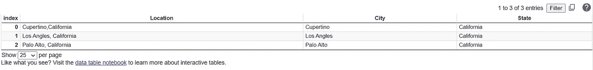

## 8.大小写-大写和小写

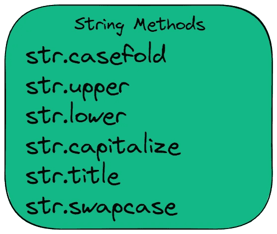

图片由作者使用 excalidraw 制作

图片由作者使用 carbon.now.sh

```
warriors is the best team
WARRIORS IS THE BEST TEAM
wARRIORS IS THE BEST TEAM
```

## 9.魔法命令:

*   运行命令%lsmagic 查看所有可用的魔术命令。

```
Available line magics:
%alias %alias_magic %autocall %automagic %autosave %bookmark %cat %cd %clear %colors %config %connect_info %cp %debug %dhist %dirs %doctest_mode %ed %edit %env %gui %hist %history %killbgscripts %ldir %less %lf %lk %ll %load %load_ext %loadpy %logoff %logon %logstart %logstate %logstop %ls %lsmagic %lx %macro %magic %man %matplotlib %mkdir %more %mv %notebook %page %pastebin %pdb %pdef %pdoc %pfile %pinfo %pinfo2 %pip %popd %pprint %precision %profile %prun %psearch %psource %pushd %pwd %pycat %pylab %qtconsole %quickref %recall %rehashx %reload_ext %rep %rerun %reset %reset_selective %rm %rmdir %run %save %sc %set_env %shell %store %sx %system %tb %tensorflow_version %time %timeit %unalias %unload_ext %who %who_ls %whos %xdel %xmodeAvailable cell magics:
%%! %%HTML %%SVG %%bash %%bigquery %%capture %%debug %%file %%html %%javascript %%js %%latex %%perl %%prun %%pypy %%python %%python2 %%python3 %%ruby %%script %%sh %%shell %%svg %%sx %%system %%time %%timeit %%writefileAutomagic is ON, % prefix IS NOT needed for line magics.
```

## 10.反转字符串:

图片由作者使用 carbon.now.sh

图片由作者使用 carbon.now.sh

## 11.Colab:可以用表格格式显示数据框:

图片由作者使用 carbon.now.sh

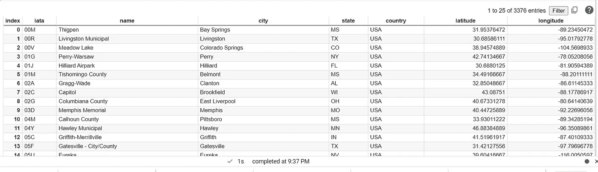

## 12.交换变量:

在 python 中，你不需要临时变量。

图片由作者使用 carbon.now.sh

## 13.合并词典:

图片由作者使用 carbon.now.sh

```
{‘apple’: 2, ‘banana’: 3, ‘orange’: 2}
```

## 14.打印表情符号

图片由作者使用 carbon.now.sh

你可以在这个链接中查看表情符号[的完整列表，或者你可以谷歌一下。使用 CLDR 简称。](https://unicode.org/emoji/charts/full-emoji-list.html)

## 15.TQDM:进度条

`tqdm`源自阿拉伯语单词 *taqaddum* (تقدّم)，意为“进步”，是西班牙语中“我如此爱你”的缩写( *te quiero demasiado* )。立即让你的循环显示一个智能进度条——只需用包装任何 iterable，你就完成了。`trange(N)`也可以作为`tqdm(range(N))`的便捷快捷方式。

图片由作者使用 carbon.now.sh

查看他们的 GitHub 库以获得更多信息。

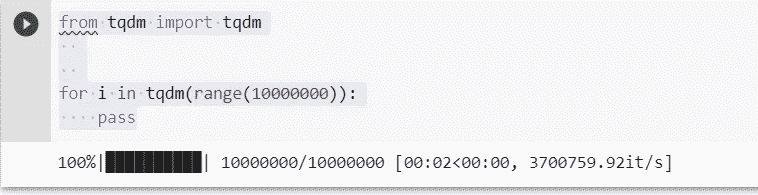

## 16.打开列表:

图片由作者使用 carbon.now.sh

**输出:**

```
1 2 3[1, 2, 3, 4] 5 61 [2, 3, 4, 5] 6
```

## 17.删除句子中的标点符号:

图片由作者使用 carbon.now.sh

使用字符串模块。你可以像上面那样去掉标点符号。

```
!”#$%&’()*+,-./:;<=>?@[\]^_`{|}~The wellknown story I told at the conferences about hypocondria in Boston New York Philadelphiaand Richmond went as follows
```

## 18.找出两个列表中的共同元素:

图片由作者使用 carbon.now.sh

输出:

```
[‘g’, ‘f’, ‘e’, ‘h’]
```

## 19.向列表追加值:(追加或连接)

图片由作者使用 carbon.now.sh

**输出:**

```
[‘apple’, ‘oranges’, ‘bananas’, ‘grapes’]
```

## 20.从列表中删除子列表:

图片由作者使用 carbon.now.sh

**输出:**

```
[10, 20, 60]
```

## 21.使用负索引[-1]或[~0]:

图片由作者使用 carbon.now.sh

```
60 
50 
60 
50
```

要理解切片符号，请查看这个精彩的 [stackoverflow 线程。](https://stackoverflow.com/questions/509211/understanding-slice-notation)

## 22.切片分配:

切片赋值是操纵列表的另一种方式。查看此[堆栈溢出以了解更多信息。](https://stackoverflow.com/questions/10623302/how-does-assignment-work-with-list-slices)

图片由作者使用 carbon.now.sh

**输出:**

```
[10, 21, 31, 40, 50, 60, 70, 80, 90]
[10, 40, 50, 60, 70, 80, 90]
[10, 10, 20, 30, 40, 50, 60, 70, 80, 90]
```

## 23.变量名:

*   变量名必须以字母或下划线开头。
*   变量名不能以数字开头。
*   变量名不能以符号开头。
*   变量可以包含字符、数字和下划线。
*   变量名区分大小写
*   变量不能包含 python 关键字的名称。

图片由作者使用 carbon.now.sh

## 24.可变与不可变:

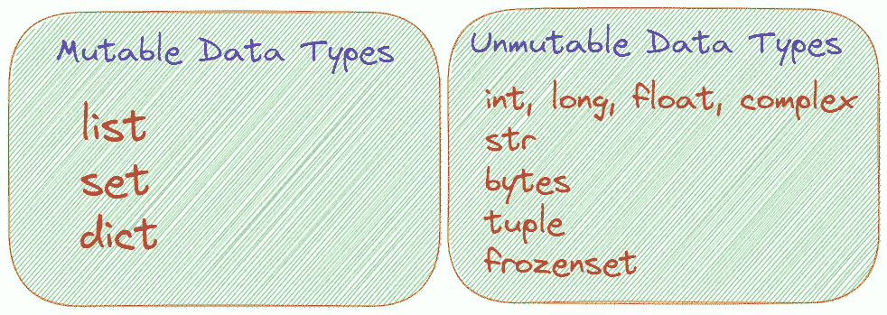

图片由作者使用 excalidraw 制作

## 25.内置函数:

为了检查 python 中的内置函数，我们可以使用 dir()

图片由作者使用 carbon.now.sh

要了解任何函数的功能，我们可以使用内置函数帮助。

图片由作者使用 carbon.now.sh

这同样适用于模块。

例如，你使用熊猫，找出熊猫中可用的功能，然后帮助。

```
import pandas as pd
dir(pd)
help(pd.util)
```

## 26.评论:

*   #单行注释。
*   y = a + b #计算内联注释的总和。
*   """这是在功能模块、类等文档中使用的多行注释" " "
*   docstring 是一个多行注释，用于记录模块、类、函数和方法。它必须是它所描述的组件的第一个语句。

## 27.突破 vs 继续 vs 回传 Vs 传球:

*   **Break** 语句——控制流立即退出循环。
*   **Continuos**-该语句跳到下一次迭代，并且不执行当前迭代中 Continuos 之后的命令。
*   **Return** :该语句退出函数，不执行其后的代码。
*   **Pass**:Pass 语句**为空语句**。当传递被执行时，什么都不会发生。它导致无操作(NOP)。这对于尚未编写的代码来说是一个有用的占位符。

图片由作者使用 carbon.now.sh

**输出:**

```
0 1 2 3 4 Break
```

**继续:**

图片由作者使用 carbon.now.sh

**输出:**

```
0 1 2 3 4 Continue 5 Continue 6 7 8 9 Continue
```

**返回:**

图片由作者使用 carbon.now.sh

**输出:**

```
1
2
3
2
4
3
```

**过关:**

图片由作者使用 carbon.now.sh

## 28.列举:

如果您想要循环遍历索引，并且拥有元素以及元素的索引，则使用枚举函数。

图片由作者使用 carbon.now.sh

**输出:**

```
0 : sanjose 1 : cupertino 2 : sunnyvale 3 : fremont
```

请检查此[堆栈溢出讨论](https://stackoverflow.com/questions/522563/accessing-the-index-in-for-loops)。

## 29.弹出、移除和反转:

Pop:移除并返回索引处的项目。如果没有参数，它将移除并返回列表的最后一个元素。

```
l1 = [10,20,30,40,50,60,70,80]
pop(2)
returns 30
```

移除:移除指定值的第一个匹配项。如果找不到提供的值，将引发 ValueError。

```
l1 = [10,20,30,40,50,60,70,80]
l1.remove(30)
l1
[10, 20, 40, 50, 60, 70, 80]
```

反转:反转列表。

```
l1 = [10,20,30,40,50,60,70,80]
l1.reverse()
print(l1)
[80, 70, 60, 50, 40, 30, 20, 10]
```

## 30.检查列表是否为空:

使用 len(list)== 0 或不列出。

图片由作者使用 carbon.now.sh

## 31.检查列表中是否存在该元素:

只需在如下列表中使用。

图片由作者使用 carbon.now.sh

## 32.所有和任何:

*   使用 all()确定 iterable 中的所有值是否都计算为 True。
*   any()确定 iterable 中的一个或多个值的计算结果是否为 True。

图片由作者使用 carbon.now.sh

## 33.要查找列表中 n 个最大和 n 个最小的数字:

图片由作者使用 carbon.now.sh

要找到最大的 n 项和最小的 n 项，请使用 heapq。

```
[800, 500, 320, 200]
[10, 25, 40, 59]
```

## 34.检查文件是否存在:

图片由作者使用 carbon.now.sh

输出；

```
True
```

## 35.检查文件是否为空:

图片由作者使用 carbon.now.sh

**输出:**

```
True
```

## 36.复制文件和目录:

图片由作者使用 carbon.now.sh

## 37.os.path:

*   检查当前目录。
*   检查父目录。
*   检查路径是否是目录。
*   检查路径是否是文件。
*   检查路径是否是装载点。

图片由作者使用 carbon.now.sh

## 38.Python 的生成器和迭代器的区别:

*   `iterator`:其类有一个`__next__`方法和一个做`return self`的`__iter__`方法的任何对象。
*   每个生成器都是迭代器，但不是反过来。生成器是通过调用一个函数构建的，这个函数有一个或多个`yield`表达式，并且是一个满足`iterator`定义的对象。

请查看这个关于迭代器和生成器区别的 [stackoverflow 问题](https://stackoverflow.com/questions/2776829/difference-between-pythons-generators-and-iterators)。

## **39。具有任意数量参数和任意数量关键字参数的函数:**

图片由作者使用 carbon.now.sh

图片由作者使用 carbon.now.sh

输出:

```
200 400 500 700
apple : 1 orange : 2 grapes : 2
```

## 40.λ函数:

*   Lambda 创建一个包含单个表达式的函数。
*   写 lambda 函数不用用 return。
*   返回:(冒号)后面的值。
*   Lambda 也可以接受参数。
*   Lambdas 用于短函数。

图片由作者使用 carbon.now.sh

查看此 [stackoverflow 问题](https://stackoverflow.com/questions/890128/how-are-lambdas-useful/890188#890188)以了解有关 Lambda 的更多详细信息。

## 41.地图功能:

*   Map 采用一个函数和一组项目。它创建一个新的空集合，对原始集合中的每个项目运行函数，并将每个返回值插入到新集合中。它返回新的集合。

图片由作者使用 carbon.now.sh

## 42.过滤功能:

过滤器接受一个函数和一个集合。它返回函数返回 True 的每个项目的集合。

图片由作者使用 carbon.now.sh

## 43.Python 装饰器:

查看我关于 [python decorator](https://medium.com/better-programming/a-deep-dive-into-python-decorators-e95291a77cfb) 的详细帖子。

*   装饰器是在 Python 2.4 中引入的。Python 装饰器函数是一个修改另一个函数并返回一个函数的函数。
*   它接受一个函数作为它的参数。它返回一个闭包。Python 中的闭包只是一个由另一个函数返回的函数。
*   装饰函数中有一个包装函数。
*   它向现有函数添加了一些额外的功能，而不改变现有函数的代码。这是装修工可以做到的。
*   装饰器允许你在函数前后执行代码；他们装饰而不修改功能本身。
*   在 Python 中，装饰器以`@` 符号开始，后面是装饰器函数的名称。装饰者减慢函数调用。

## 44.f 弦:

*   f 字符串在 3.6 版本中引入。

图片由作者使用 carbon.now.sh

查看这个[博客，了解更多的字符串格式。](https://miguendes.me/73-examples-to-help-you-master-pythons-f-strings)

## 45.字符串模块:

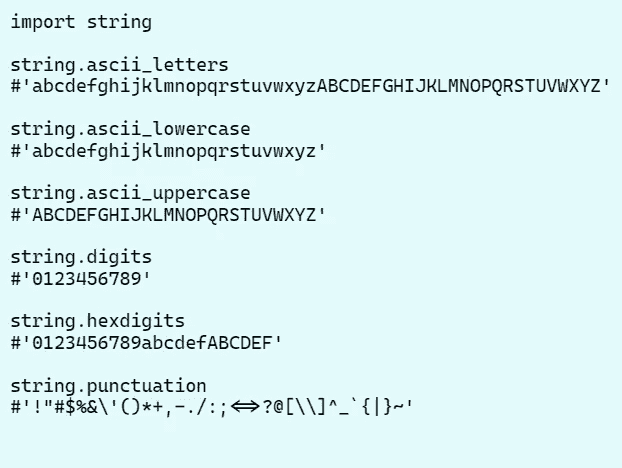

图片由作者使用 excalidraw 制作

## 46.Timeit —测量小代码片段的执行时间:

这个模块提供了一种简单的方法来计时小部分的 Python 代码。它既有命令行界面，也有可调用界面。

图片由作者使用 carbon.now.sh

## 47.模块与封装:

*   模块是可以导入的单个 Python 文件。
*   一个包由多个 Python 文件(或模块)组成，甚至可以包括用 C 或 C++编写的库。它不是一个文件，而是一个完整的文件夹结构。

看看这个[关于模块和封装差异的栈溢出问题](https://stackoverflow.com/questions/47193079/module-vs-package)。

## 48.复制和深层复制:

默认赋值“=”将原始列表的引用赋给新名称。也就是说，原始名称和新名称都指向同一个列表对象。

图片由作者使用 carbon.now.sh

所以这样做

图片由作者使用 carbon.now.sh

## 49.收藏-计数:

图片由作者使用 carbon.now.sh

## 50.有序字典:

Python 字典中键的顺序是任意的。这将导致混乱，当你不断添加关键，也在调试中。例如常规词典

图片由作者使用 carbon.now.sh

使用 orderedDict frm 集合。

## 51.JSON 文件:

*   使用 json 包下载 json 文件，读取 json 文件

写

图片由作者使用 carbon.now.sh

阅读和打印

图片由作者使用 carbon.now.sh

## 52.过滤单行代码中的列表:

图片由作者使用 carbon.now.sh

## 53.随机种子-为什么它很重要:

要查看更多关于随机的信息，请参考[堆栈溢出问题。](https://carbon.now.sh/ehlEiYi1WpOi3K42dWlY)Python 中的 random()函数用于生成伪随机数。它为一些称为种子值的值生成数字。Python 中的 random.seed()函数用于初始化随机数。默认情况下，随机数生成器使用当前系统时间。如果你使用相同的种子值两次，你得到相同的输出意味着随机数两次。

如果不使用 see，每次执行的输出都是不同的。

图片由作者使用 carbon.now.sh

当使用种子时，你可以一次又一次地得到同样的结果。

图片由作者使用 carbon.now.sh

## 54.读写文本文件:

图片由作者使用 carbon.now.sh

## 55.读取和写入 CSV 文件:

图片由作者使用 carbon.now.sh

## 56.颠倒字典:

图片由作者使用 carbon.now.sh

## 57.合并两个词典:

请检查这个[堆栈溢出。](https://stackoverflow.com/questions/38987/how-do-i-merge-two-dictionaries-in-a-single-expression-take-union-of-dictionari)

图片由作者使用 carbon.now.sh

## 58.对词典进行排序:

图片由作者使用 carbon.now.sh

```
{‘apple’: 1,
 ‘bananas’: 3,
 ‘grapes’: 4,
 ‘oranges’: 2,
 ‘strawberries’: 5,
 ‘watermelon’: 6}
```

## 59.将字符串转换为单词:

图片由作者使用 carbon.now.sh

## 60.列表 1 和列表 2 的区别:

图片由作者使用 carbon.now.sh

## 61.将多个 CSV 文件加载到数据帧中:

使用 glob

图片由作者使用 carbon.now.sh

## 62.解压缩文件:

有 python 模块可以解压文件

*   目标文件
*   zipfile
*   gzipfile

**zipfile**

图片由作者使用 carbon.now.sh

目标文件:

图片由作者使用 carbon.now.sh

gzip

图片由作者使用 carbon.now.sh

## 63.dict.get(key) Vs dict[key]哪个更好:

请检查这个[堆栈溢出一个](https://stackoverflow.com/questions/11041405/why-dict-getkey-instead-of-dictkey?rq=1)。

*   如果键不在，dict[key]将会产生一个错误。
*   如果您使用 *dict.get()* 并且没有找到一个键，代码将返回 *None* (或者一个自定义值，如果您指定了一个)。

图片由作者使用 carbon.now.sh

## 64.==和之间的差是:

*   如果两个变量指向同一个对象(在内存中),`is`将返回`True`
*   `==`如果变量所指的对象相等。

看看这个 [stackoverflow](https://stackoverflow.com/questions/132988/is-there-a-difference-between-and-is) 的。

图片由作者使用 carbon.now.sh

## 65.将字典转换为元组列表:

图片由作者使用 carbon.now.sh

## 66.将字典键转换为列表:

图片由作者使用 carbon.now.sh

## 67.找出列表中元素的索引:

*使用枚举

图片由作者使用 carbon.now.sh

## 68.使用 Numpy 和 itertools 拼合列表:

有许多方法可以做到这一点。也可以使用 numpy 或 itertools。

图片由作者使用 carbon.now.sh

## 69.删除前导和尾随空格:

图片由作者使用 carbon.now.sh

## 70.两个日期之间的天数和月数差异:

图片由作者使用 carbon.now.sh

几个月后？

图片由作者使用 carbon.now.sh

## 71.检查日期是工作日还是周末:

图片由作者使用 carbon.now.sh

## 72.操作系统模块:


图片由作者使用 excalidraw 制作

## 73.处理异常-使用 Try、except 和 finally:

图片由作者使用 carbon.now.sh

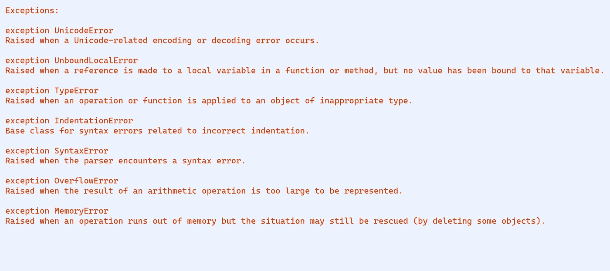

图片由作者使用 excalidraw 制作

## 74.找出 python 对象的内存:

*   使用 sys.sizegetinfo()

图片由作者使用 carbon.now.sh

## 75.使用正则表达式从文本中提取电子邮件 ID:

图片由作者使用 carbon.now.sh

## 76.常规导入与从模块导入与*:

*   常规进口-进口熊猫作为 pd
*   Python 风格指南建议将每个导入放在一行中。

```
import pandas,numpy,sys
```

不建议这样做。

```
import pandas as pd
import numpy as np
import sys
```

以上推荐。

*   从模块导入:有时你只想导入一部分导入。Python 允许使用

```
from tensorflow import keras
from tensorflow.keras import layers
from keras.models import sequential
```

例如，如果您只导入了 tensorflow，那么要使用 keras，您必须导入 tensorflow.keras。

*   从模块导入*:不允许或不建议使用通配符(*)导入。原因是它会导致名称空间共谋。简言之，不要使用通配符导入。下面是不允许的。

```
from tensorflow import * 
```

*   你也可以使用本地导入来代替本地导入。但是最好使用 glocal import。

## 77.类型提示:

在其他语言中，您需要在使用之前定义数据类型。在 python 中，你不需要定义数据类型。python 3.5 引入了类型提示。请查看[文档](https://www.python.org/dev/peps/pep-0484/)了解更多信息。

图片由作者使用 carbon.now.sh

## 78.使用 del 删除变量:

图片由作者使用 carbon.now.sh

也可以看看这个 [stackoverflow](https://stackoverflow.com/questions/8237647/clear-variable-in-python) 的讨论。

## 79.当你试图改变一个不可变的对象时会发生什么:

图片由作者使用 carbon.now.sh

请查看 [stackoverflow](https://stackoverflow.com/questions/10966884/what-happens-to-a-immutable-object-in-python-when-its-value-is-changed#:~:text=When%20you%20add%20to%20a,the%20old%20one%20is%20deleted.) 对此的讨论。

## 80.三重引号:

图片由作者使用 carbon.now.sh

*   你可以用三重引号
*   你也可以在引号前使用像\这样的反斜杠，或者使用双引号。

请查看 [stackoverflow](https://stackoverflow.com/questions/56011/single-quotes-vs-double-quotes-in-python) 讨论。

## 81.urllib:

*   **urllib.request**

图片由作者使用 carbon.now.sh

也检查一下

*   ***urllib.parse***
*   ***urllib.error***
*   ***urllib . robot parser***

查看 [python 文档](https://docs.python.org/3/library/urllib.request.html)。

## 82.链图-集合:

根据文档——提供了一个`[ChainMap](https://docs.python.org/3/library/collections.html#collections.ChainMap)`类来快速链接多个映射，因此它们可以被视为一个单元。这通常比创建一个新字典并运行多个`[update()](https://docs.python.org/3/library/stdtypes.html#dict.update)`调用要快得多。

图片由作者使用 carbon.now.sh

## 83.全局变量与非局部变量:

*   **场景 1**——使用全局变量:尝试在函数中使用全局变量，你会得到下面的错误。

图片由作者使用 carbon.now.sh

要修复此错误，请在函数-global glb_var 中将该变量声明为全局变量

图片由作者使用 carbon.now.sh

*   **场景 2** :使用非 nonlocalvariablese。不要更改全局变量值。

图片由作者使用 carbon.now.sh

## 84.海象运营商:

根据 python 文档——有了新的语法`:=`,将值赋给变量作为更大表达式的一部分。它被亲切地称为“海象操作员”，因为它与海象的眼睛和长牙相似。python 3.8 中引入了 Walrus 操作符。

图片由作者使用 carbon.now.sh

另一个例子

图片由作者使用 carbon.now.sh

查看[文档](https://docs.python.org/3/whatsnew/3.8.html)。

## 85.Python 3.10 中更好的错误消息:

例如在以前的版本中

图片由作者使用 carbon.now.sh

在 Python 3.10 版本中

图片由作者使用 carbon.now.sh

还有很多更好的错误消息，如下所示

```
SyntaxError: multiple exception types must be parenthesized
SyntaxError: expression expected after dictionary key and ':'
SyntaxError: ':' expected after dictionary key
SyntaxError: invalid syntax. Perhaps you forgot a comma?
SyntaxError: did you forget parentheses around the comprehension target?
SyntaxError: expected ':'
IndentationError: expected an indented block after 'if' statement in line 2
AttributeError: module 'collections' has no attribute 'namedtoplo'. Did you mean: namedtuple?
```

图片由作者使用 carbon.now.sh

## 86.Python 3.10 中新的 match-case 语句:

以下示例来自 python 文档。

图片由作者使用 carbon.now.sh

另一个例子

请查看[文档](https://www.python.org/dev/peps/pep-0636/)了解更多信息。

## 87.对于编码和解码，您可以使用加密技术:

图片由作者使用 carbon.now.sh

请查看[加密](https://cryptography.io/en/latest/)文档。

## 88.Why if __name__ == "__main__ ":

*   if __name__ == "__main__ "条件下的代码将仅在 python 脚本作为独立脚本执行时执行。
*   如果您在另一个脚本或模块中导入了上述模块，则不会执行 if __name__ == "__main__ ":下的代码。

请查看这个 [stackoverflow 问题](https://stackoverflow.com/questions/419163/what-does-if-name-main-do)的详细回答。

## 89.为什么我们在 python 类中需要 self:

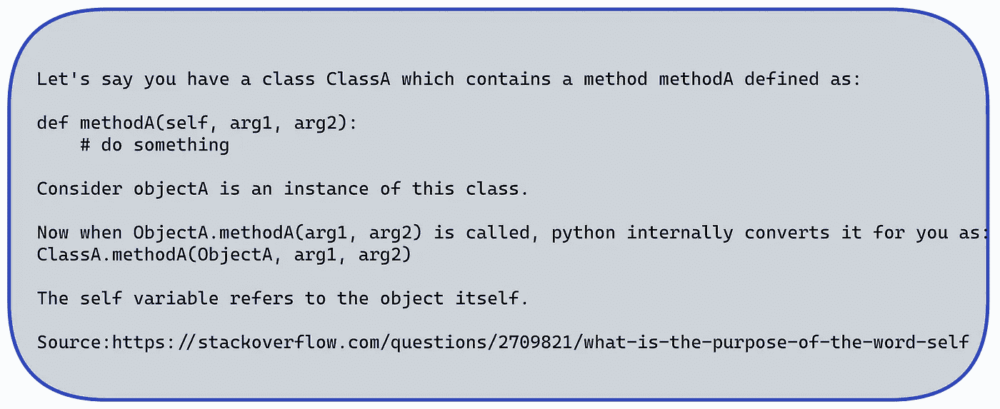

图片由作者使用 excalidraw 制作

```
Please refer to this [stackoverflow discussion](https://stackoverflow.com/questions/2709821/what-is-the-purpose-of-the-word-self).
```

## 90.为什么我们需要 python 类中的 init:

在 [stackoverflow](https://stackoverflow.com/questions/625083/what-do-init-and-self-do-in-python) 中还有一个关于我们为什么需要 init 的大讨论。看看这个。根据文档，__init__ 方法是面向对象方法中 C++构造函数的 Python 等价物。每次从类中创建对象时，都会调用 __init__ 函数。__init__ 方法让类初始化对象的属性，没有其他用途。它只在类内使用。

## 91.系统模块:

*   sys 模块提供系统特定的参数和功能。更多信息请查看[文档](https://docs.python.org/3/library/sys.html)。
*   我们可以在下面看到一些 sys 方法

图片由作者使用 carbon.now.sh

如何使用 sys 模块列出一个目录中的所有[文件？](https://stackoverflow.com/questions/3207219/how-do-i-list-all-files-of-a-directory)

## 9 2.Python 分析:

根据 python 文档——`cProfile`和`profile`提供了 Python 程序的*确定性剖析*。*概要文件*是一组统计数据，描述了程序的各个部分执行的频率和时间。这些统计数据可以通过`[pstats](https://docs.python.org/3/library/profile.html#module-pstats)`模块格式化成报告。很简单。只需导入 cprofile 并开始使用它。

图片由作者使用 carbon.now.sh

## 93.将表格数据从 PDF 读入 dataframe，并保存为 CSV 或 JSON 格式:

*   Tabula-py 是一个将 PDF 表格转换成 pandas 数据框架工具。tabula-py 是 [tabula-java](https://github.com/tabulapdf/tabula-java) 的一个包装器，在你的机器上需要 java。tabula-py 还能让你把 PDF 格式的表格转换成 CSV/TSV 文件。

图片由作者使用 carbon.now.sh

请查看本 [colab 笔记本](https://colab.research.google.com/github/chezou/tabula-py/blob/master/examples/tabula_example.ipynb#scrollTo=7wA5RL3SluSV)了解完整实施。

## 94.使用 PyMuPDF 从 PDF 文件中提取图像:

图片由作者使用 carbon.now.sh

查看他们的 [github 库](https://github.com/pymupdf/PyMuPDF)以获取更多信息。

## 95.合并 PDF 文件:

您可以使用 PyPDF2 或 PyPDF4。代码片段是针对 PyPDF2 的。

图片由作者使用 carbon.now.sh

查看 [stackoverflow](https://stackoverflow.com/questions/3444645/merge-pdf-files) 了解更多信息。

## 96.如何获取列表中元素的索引:

图片由作者使用 carbon.now.sh

更多信息请参考。

## 97.向现有字典添加关键字:

图片由作者使用 carbon.now.sh

请查看关于向字典添加键的这个 [stackoverflow 讨论](https://stackoverflow.com/questions/1024847/how-can-i-add-new-keys-to-a-dictionary-in-python)。

## 98.追加和扩展的区别:

图片由作者使用 carbon.now.sh

*   将它的参数作为单个元素添加到列表的末尾。列表本身的长度将增加一。
*   `extend`遍历其参数，将每个元素添加到列表中，扩展列表。无论 iterable 参数中有多少元素，列表的长度都会增加。
*   请查看此[堆栈溢出讨论](https://stackoverflow.com/questions/252703/what-is-the-difference-between-pythons-list-methods-append-and-extend)了解更多信息。

## 99.如何在 python 脚本中设置时间延迟:

*   使用时间模块和 time.sleep

图片由作者使用 carbon.now.sh

## 100.将字符串转换为日期:

*   有许多方法可以做到这一点。

图片由作者使用 carbon.now.sh

## 101.数据预处理库:

数据科学家、数据分析师和所有数据专业人员经常使用的重要数据预处理库有

*   **熊猫**
*   **数字价格**

## 102.数据可视化库:

以下是一些重要的数据可视化库

*   **Matplotlib**
*   **Seaborn**
*   **阴谋地**
*   **散景**
*   **牛郎星**

## 103.Web 抓取 Python 模块:

一些重要的 web 抓取库是

*   **刺儿头**
*   **美汤**
*   **硒**
*   **请求**
*   **Urllib**

## 104.机器和深度学习库:

一些流行的机器学习和深度学习库是。

*   **Sci-Kit 学习**
*   **Keras**
*   **张量流**
*   **Pytorch**
*   **Mxnet**

## 105: Python Excel 库:

*   **xlwings**
*   **XLsxwriter**
*   **xlrd**
*   **pyexcel**

查看[链接了解更多](https://www.excelpython.org/)信息。

例如使用 xlwings 在 excel 中查看数据帧。

图片由作者使用 carbon.now.sh

## 106.常用文档字符串:

*   **reStructuredText** (剩余)格式:

图片由作者使用 carbon.now.sh

*   谷歌格式:例如

图片由作者使用 carbon.now.sh

*   Numpy 格式:

图片由作者使用 carbon.now.sh

## 107.可迭代 vs 迭代器 vs 迭代:

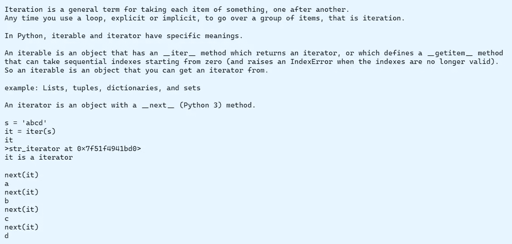

图片由作者使用 excalidraw 制作

## 108.删除字符串中的空格:

使用剥离()、替换()和拆分()

图片由作者使用 carbon.now.sh

## 109.查找目录中的所有文本文件或目录中的任何文件类型:

图片由作者使用 carbon.now.sh

请查看[堆栈溢出](https://stackoverflow.com/questions/3964681/find-all-files-in-a-directory-with-extension-txt-in-python)了解更多信息。

## 110.PIP 与 Conda:

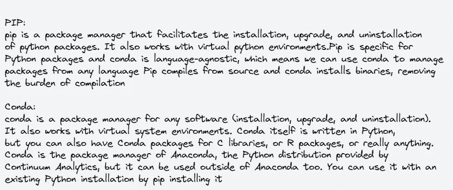

图片由作者使用 excalidraw 制作

请检查这一个为更多关于康达的信息[。](https://conda-forge.org/blog/)

## 111.删除文本中的敏感信息，如姓名、电子邮件、电话号码等:

*   使用 **scrubadub** 隐藏敏感信息，如电话号码、姓名、信用卡详情等。

图片由作者使用 carbon.now.sh

查看[文档](https://scrubadub.readthedocs.io/en/stable/)了解更多信息。

## 112.使用 Modin 的更快的熊猫数据帧:

*   在 pandas 中，当你进行任何计算时，你一次只能使用一个内核。使用 Modin，您可以使用机器上的所有 CPU 内核。请查看他们关于安装和入门指南的[文档](https://modin.readthedocs.io/en/stable/getting_started/quickstart.html)。

```
**import** **modin.pandas** **as** **pd**
df = pd.read_csv("my_dataset.csv")
```

## 113.使用 Mercury 将 python 笔记本转换为 web 应用程序:

```
pip install mljar-mercurymercury watch my_notebook.ipynb
```

`watch`命令将监控您笔记本的更改，并自动将它们重新加载到 Mercury web 应用程序中。查看他们的 github 库以获取更多信息。

## 114.Apache Spark-Pyspark- Pandas API:

熊猫 API 在去年 10 月发布的 Spark 3.2 版本中可用。PySpark 用户可以通过调用`**DataFrame.to_spark()**`来访问完整的 PySpark APIs。熊猫星火数据帧和星火数据帧实际上是可以互换的。

## 结论:

希望这篇文章对你有用。python 现在再次变得非常流行，已经被应用到了各个领域。这篇文章的主要目的是作为你的参考。例如，如果您想知道如何合并两个 PDF 文件，那么来查看指向 python 模块 PyPDF2/PyPDF4 的代码片段，然后深入了解 github 库。请随时在 [linkedin](https://www.linkedin.com/in/esenthil/) 与我联系。谢谢！

## 参考资料:

1.  【https://docs.python.org/3/whatsnew/3.10.html 号
2.  【https://docs.python.org/3/whatsnew/3.9.html 
3.  [https://docs.python.org/3/whatsnew/3.8.html](https://docs.python.org/3/whatsnew/3.8.html)
4.  [https://www.kaggle.com/](https://www.kaggle.com/)
5.  [https://stackoverflow.com/](https://stackoverflow.com/)
6.  [https://farid.one/kaggle-solutions/](https://farid.one/kaggle-solutions/)