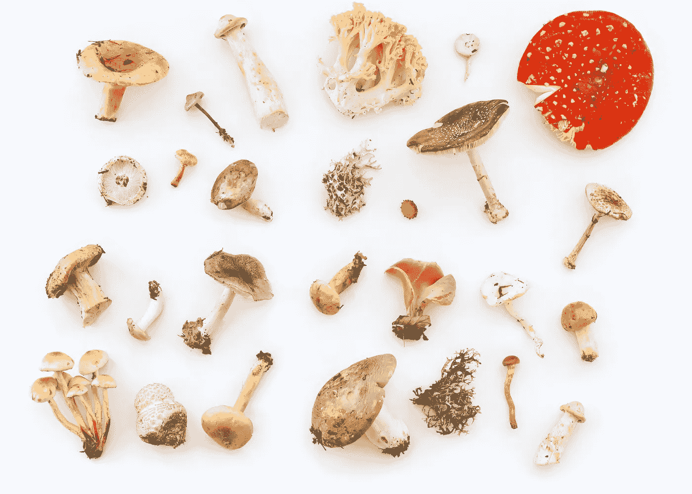
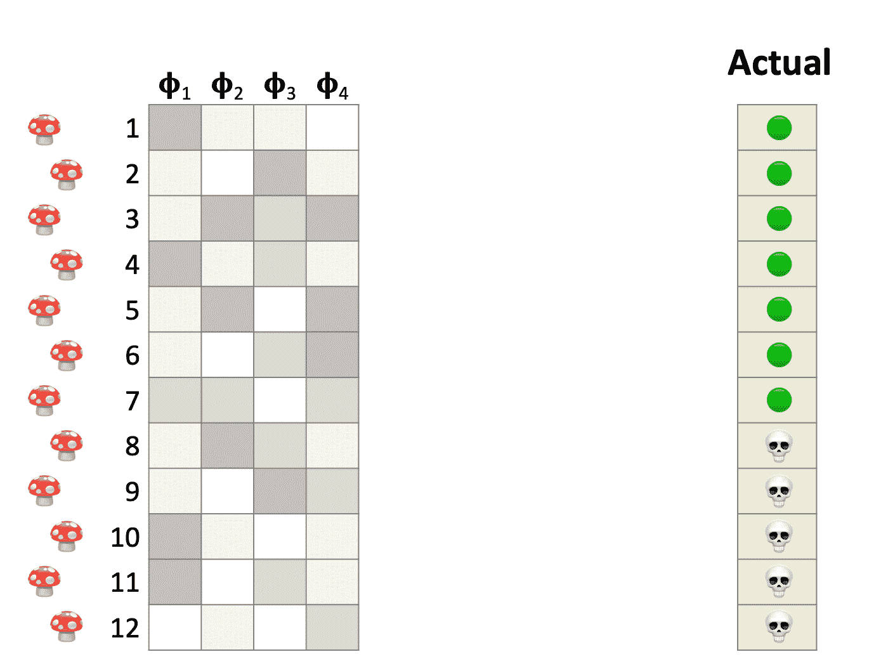
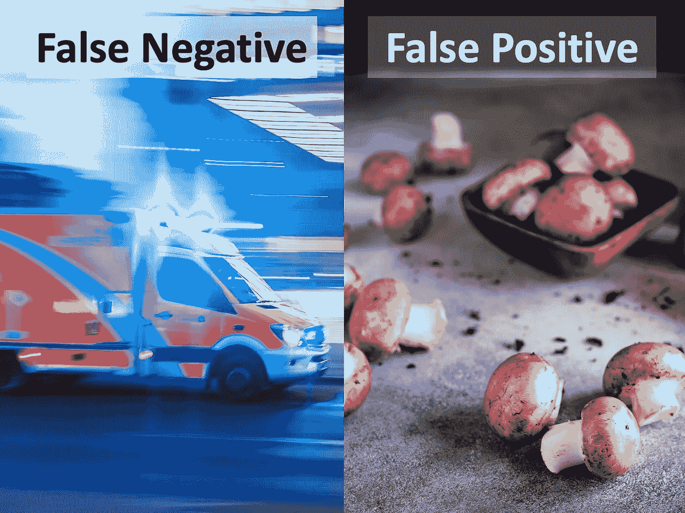
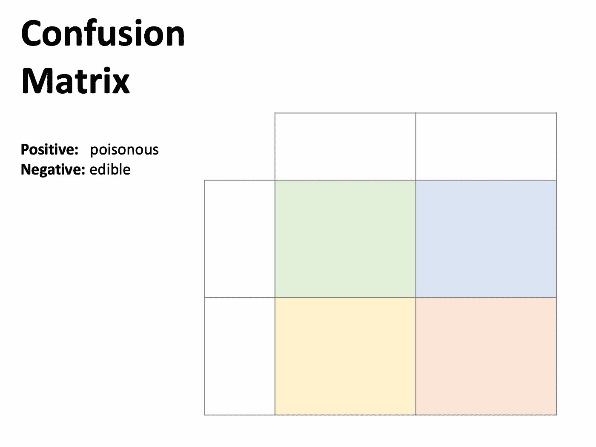
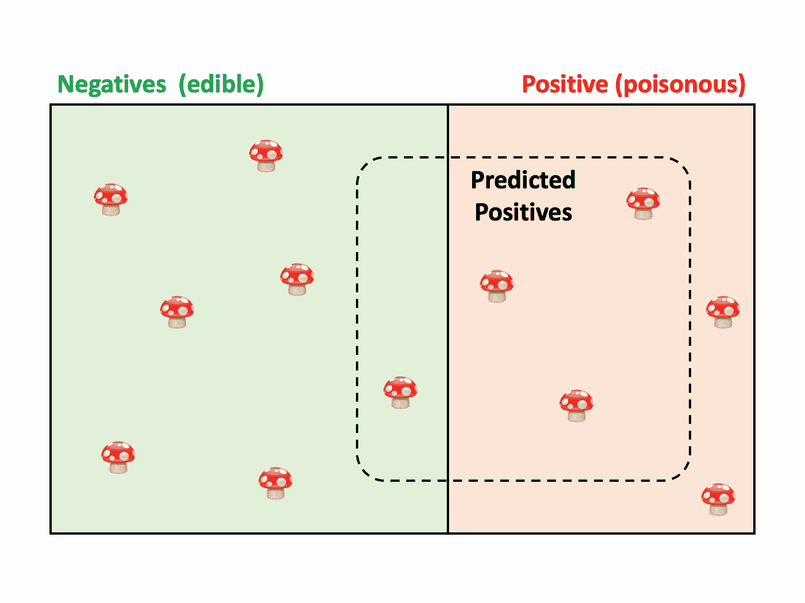
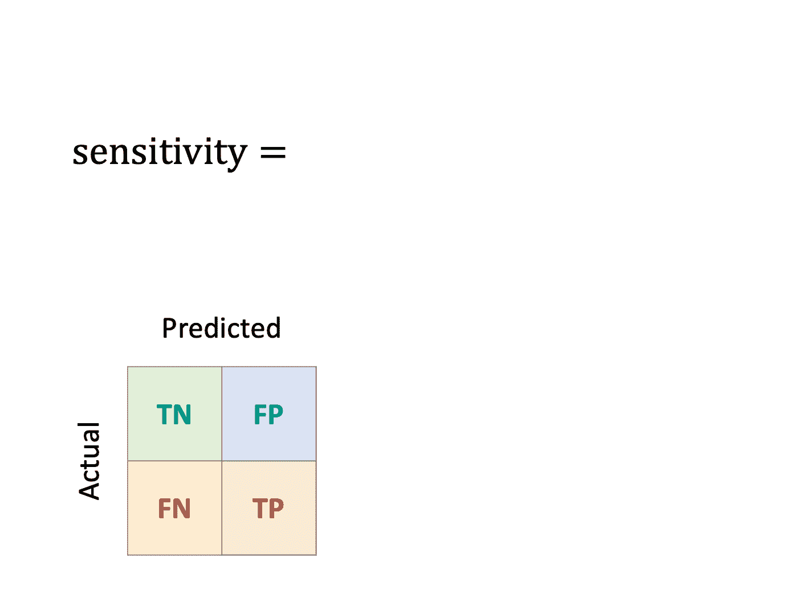
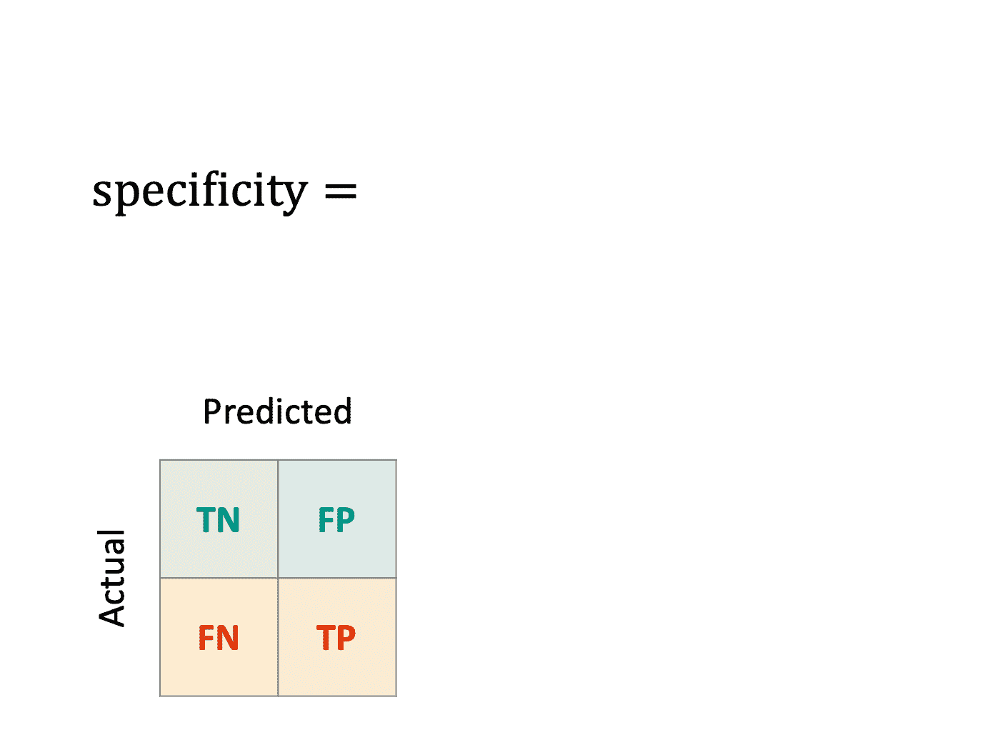
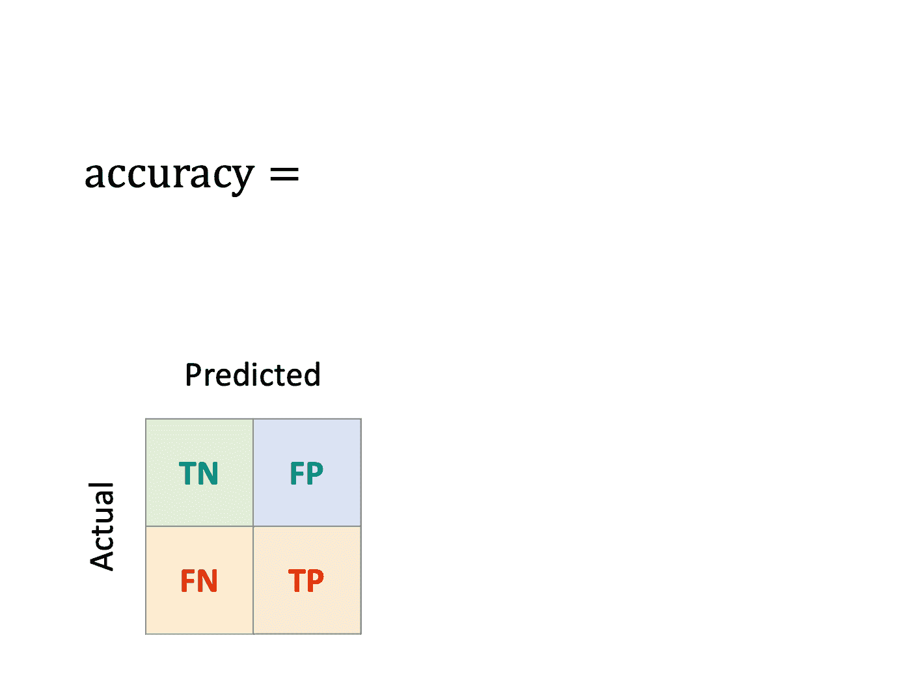
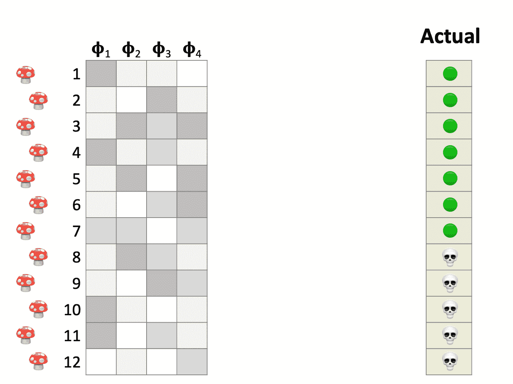

# 所有的蘑菇都可以食用，但有些只能吃一次

> 原文：<https://towardsdatascience.com/all-mushrooms-are-edible-but-some-only-once-aed96aa3b9cf>

## 混淆矩阵和分类度量的可视化介绍。

Igor Yemelianov 在 [Unsplash](https://unsplash.com/?utm_source=unsplash&utm_medium=referral&utm_content=creditCopyText) 上拍摄的照片。

## 问题是

前段时间，一位生物学教授告诉我*“所有的蘑菇都可以吃，但有些只能吃一次。”*抛开科学家的黑色幽默不谈，蘑菇是一个很好的例子来说明**分类问题**的复杂性，并介绍在这种情况下通常应用的**性能指标**。

情况是这样的:众所周知，一些蘑菇品种是美味佳肴，而另一些是有毒的，甚至可能导致死亡。作为专家数据科学家，训练一个**机器学习模型**自动识别毒蘑菇岂不是很棒？最后只是一个**二元分类**问题:*有毒*(阳性情况)还是*可食用*(阴性情况)。

我们首先需要的是一个带标签的数据集。在 [Unsplash](https://unsplash.com/?utm_source=unsplash&utm_medium=referral&utm_content=creditCopyText) 上 [Kalineri](https://unsplash.com/@kalineri?utm_source=unsplash&utm_medium=referral&utm_content=creditCopyText) 拍摄的照片。

首先，我们需要一个**标记的数据集**，它包含足够多的蘑菇，我们已经知道它们的正确分类。雇佣一个专家真菌学家在这个项目阶段肯定会派上用场。

下一步是将数据集分成**训练**和**测试集**。合理的划分应该是 70%的培训和 30%的测试。不过其他的划分也可以，取决于可用的观测数量和每类的比例。

训练一个模特并不容易。在这种情况下，**输入变量**是每种蘑菇的特征，而输出或**目标变量**是期望分类为*有毒*或*可食用*。在这一点上，必须强调模型必须只在训练集上进行训练，并在测试集上进行评估。由于设计和装配模型不在本文讨论范围内，所以我们跳过这一部分，假设… *瞧！模型准备好了。*

还需要一个单独的测试集。Andrew Ridley 在 [Unsplash](https://unsplash.com/?utm_source=unsplash&utm_medium=referral&utm_content=creditCopyText) 上拍摄的照片。

现在我们进入激动人心的部分。模型有多好？为了回答这个问题，我们用它来预测测试集中的蘑菇是否有毒。虽然我们已经知道了答案，但这个模型以前从未见过。因此，通过比较**预测的**和**实际的**值，我们可以测量**分类性能**和**一般化**的能力。

二元分类有四种可能的结果。图片作者。

## 测试模型和测量性能

这里我们有一个由 12 个蘑菇组成的**测试集**。它们相应的特征在左边，最右边一栏表示它们是有毒的还是可以食用的。接下来，我们用我们的模型进行预测。比较中间的预测值和右边的实际值，我们发现该模型正确地对一些实例进行了分类，而在另一些实例中出现了错误。

当模型准确地将一个毒蘑菇分类(阳性情况)时，称为一个**真阳性**。同样，正确识别一个食用菌(阴性)是**真阴性**。

那些是正确的答案，然后有一些错误。当模型将一种食用菌标记为有毒时，就会出现**假阳性**。相反，假阴性的 T21 是有毒的，被误认为是可食用的。这些也分别被称为**类型 I** 和**类型 II** 错误。

然而，并非所有的错误都是一样的。严重性取决于手头问题的具体细节。例如，在我们的情况下，假阴性比假阳性更糟糕。为什么？

由 [camilo jimenez](https://unsplash.com/@camstejim?utm_source=unsplash&utm_medium=referral&utm_content=creditCopyText) 和 [Christine Siracusa](https://unsplash.com/@christine_siracusa?utm_source=unsplash&utm_medium=referral&utm_content=creditCopyText) 在 [Unsplash](https://unsplash.com/?utm_source=unsplash&utm_medium=referral&utm_content=creditCopyText) 拍摄的照片。

一个**假阴性**意味着一个毒蘑菇被错误地识别为可食用。这是一个严重的健康危害，因为它可能会产生有害甚至致命的后果。相反，一个**假阳性、**或者将一种可食用蘑菇归类为有毒，除了丢弃完好的食物并扔进垃圾桶之外，没有任何实际影响。

## 混乱矩阵

这些结果可以显示在具有特定布局的表格中，称为混淆矩阵。水平的**行**表示**观察到的**类，而**列**显示**预测的**类。在二元分类问题中，它们相交于四个单元格，这四个单元格概括了每一种可能的结果。

正确的分类显示在对角线上，而错误显示在外面。这允许找到模型*混淆*两个类的地方(因此得名)。要知道这个矩阵在很多文档和软件包中可能会出现**转置**的情况，也就是行中的预测，列中的实际值。这两种变体在文献中都很常见。

混乱矩阵。图片作者。

## 另一种方法:维恩图

我们可以用文氏图来说明这些结果。**实际类别**出现在背景的矩形区域。接下来，我们用虚线包围**预测阳性**。该区域内的个体是模型识别为有毒的个体。最好的情况是这个区域与红色区域完全重叠，因为这意味着模型对每个蘑菇都进行了正确的分类。不幸的是，在这个例子中没有发生这种情况。

文氏图。图片作者。

虽然混淆矩阵和文氏图是可视化模型性能的好工具，但是将性能综合成一个单一的数值是很棒的。因为分类是一个多方面的问题，所以有许多度量标准，每一个都侧重于一个特定的方面。让我们仔细看看其中的一些。

拯救度量。在 [Unsplash](https://unsplash.com/?utm_source=unsplash&utm_medium=referral&utm_content=creditCopyText) 上由 [Miikka Luotio](https://unsplash.com/@mluotio83?utm_source=unsplash&utm_medium=referral&utm_content=creditCopyText) 拍摄的照片。

# 敏感度、回忆率或真阳性率(TPR)

> 该模型能多好地检测毒蘑菇？

换句话说，**灵敏度**是真阳性除以观察阳性的比率。

**Sensitivity** 是当训练模型的首要任务是捕捉尽可能多的正面信息(我们的例子)时的选择指标。

敏感。图片作者。

## 特异性或真阴性率(TNR)

> 该模型能多好地检测可食用蘑菇？

同样，**特异性**是真阴性除以实际阴性的比率。

**当不希望出现假阳性时，特异性**是一个合适的选择，就好像我们希望密切监控有多少食用蘑菇被扔掉。

特异性。图片作者。

# 精确度或阳性预测值(PPV)

> 被预测有毒的蘑菇中有多少是真的有毒？

虽然灵敏度和特异性集中于**观察到的类别**，但是一些度量标准测量预测的性能。例如， **precision** 是真阳性与预测阳性的比率。

**Precision** 是一个应该被监控的指标，如果你希望对预测的积极结果有信心的话。

精准。图片作者。

# 准确(性)

> 正确分类的比例是多少？

一个独特的度量标准，同时衡量真正的积极和消极应该是有用的。不幸的是，**精度**在**不平衡等级**的问题中提供了误导性的结果。

如果您需要在单个值中综合分类器的整体性能，请查看诸如**平衡准确度**、 **F1 得分**或**曲线下面积(AUC)** 等指标。

准确性。图片作者。

## 天真模型:多数法则

我们已经不遗余力地构建了一个模型，但是我们如何确保它是值得的呢？这些预测有价值吗？使用模型比没有模型好吗？

要回答这个问题，我们必须确认模型提供了足够的信息来证明它的存在。型号选择是一项非常复杂的任务，需要一个专门的岗位；然而，让我们粗略地看一下这个主题，并简要地介绍一下**天真模型**的概念:一个不复杂的模型，它在不利用任何输入数据的情况下提供预测。

对于一个简单的分类模型，一个合理的选择是**多数原则**。它忽略输入变量，并将每个个体标记为训练集中最频繁观察到的类(在我们的示例中为负或*可食用*)。这个模型构建起来并不昂贵，而且应该是正确的。具体来说，这个模型的准确率，也称为**无信息率**，是训练集中多数类的比例。

每个模型都必须超过这个基准才是**显著的。**否则，运营 it 毫无意义，我们应该要么坚持卓越的天真模式，要么回到设计桌上重新思考我们的方法。

基于多数原则的天真模型。图片作者。

在 [Unsplash](https://unsplash.com/?utm_source=unsplash&utm_medium=referral&utm_content=creditCopyText) 上由[亚历山大·巴甫洛夫](https://unsplash.com/@alexstav?utm_source=unsplash&utm_medium=referral&utm_content=creditCopyText)拍摄

## 结论

**二元分类**是每个数据科学家都应该掌握的一项常用技术，因为它是许多商业和科学问题的核心。当**多类分类**扩展和概括这些概念时，很好地掌握这个基础也是至关重要的。您的*数据科学工具箱*中的工具越多，您就能更好地应对新的挑战性问题。

我希望这篇文章对你有用…小心蘑菇！

## **延伸阅读**

*   统计分类。[维基百科](https://en.wikipedia.org/wiki/Statistical_classification)。
*   混乱矩阵。[维基百科](https://en.wikipedia.org/wiki/Confusion_matrix)。
*   ROC 曲线(高级)。[维基百科](https://en.wikipedia.org/wiki/Receiver_operating_characteristic)。
*   真菌学。[维基百科](https://en.wikipedia.org/wiki/Mycology)。