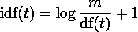
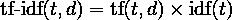
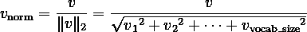
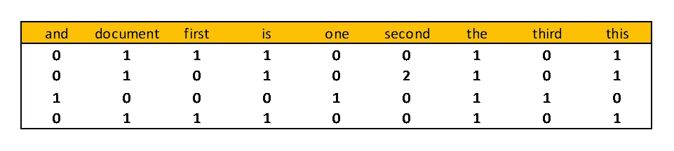
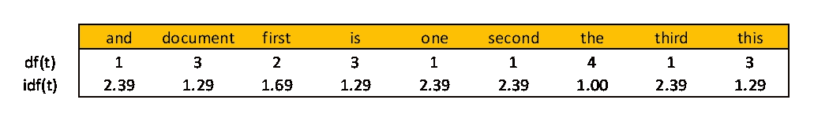
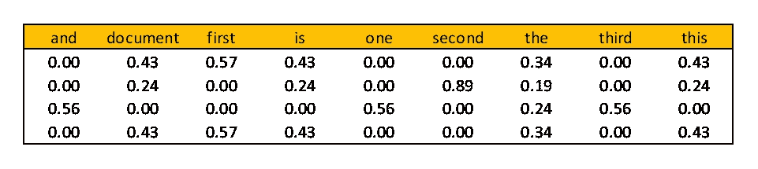
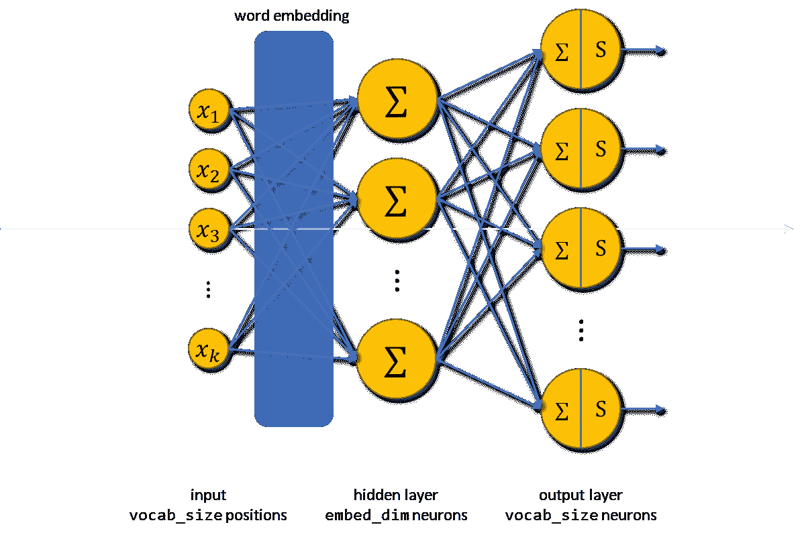
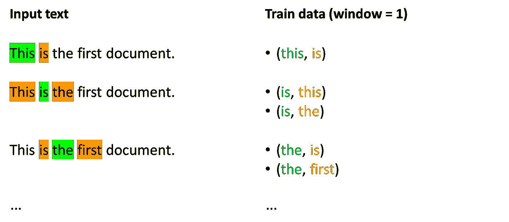
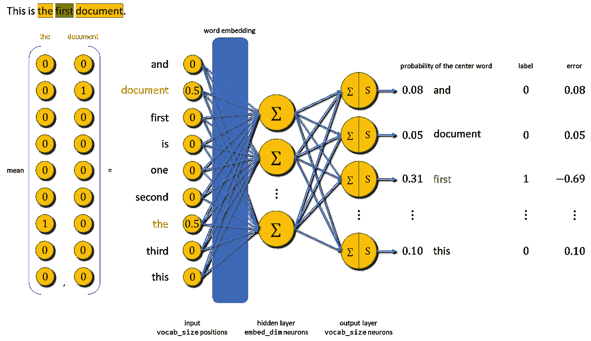
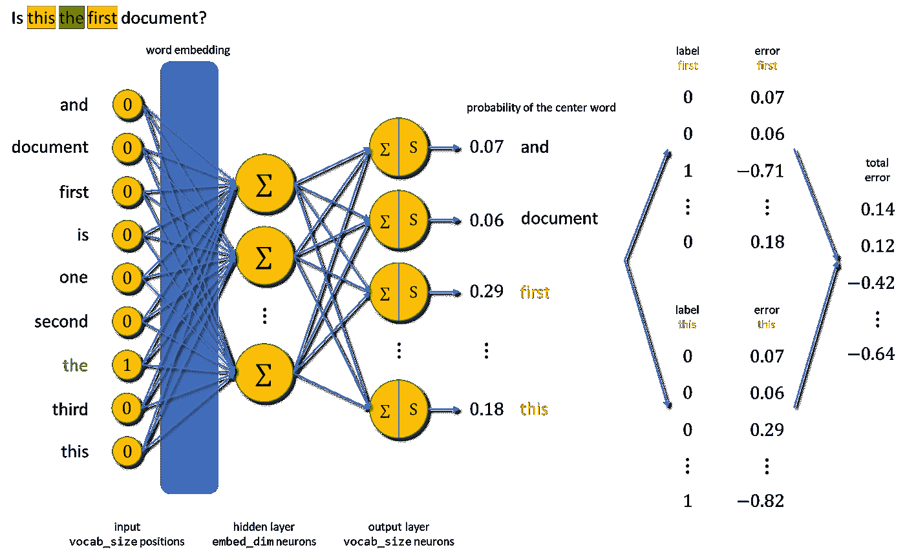

# 关于单词包和 Word2Vec —文本特征提取，您需要知道的一切

> 原文：<https://towardsdatascience.com/all-you-need-to-know-about-bag-of-words-and-word2vec-text-feature-extraction-e386d9ed84aa>

## 数据科学

## Word2Vec 为什么更好，为什么不够好


由[塔玛拉·比利斯](https://unsplash.com/@tamarabellis?utm_source=medium&utm_medium=referral)在 [Unsplash](https://unsplash.com?utm_source=medium&utm_medium=referral) 上拍摄，由[作者](http://dwiuzila.medium.com/membership)编辑

W 虽然图像数据可以直接用于深度学习模型(RGB 值作为输入)，但文本数据却不是这样。深度学习模型只对数字起作用，而不是像文本一样的符号序列。所以，你需要一种方法从文本中提取有意义的数字特征向量。这被称为**特征提取**。

从现在开始，我们将通过**文档**来调用单个文本观察，通过**语料库**来调用文档集合。

```
**Table of Contents****·** [**Bag of Words**](#38a3)
  ∘ [The Basics](#0e83)
  ∘ [Example on Data](#c38c)
  ∘ [Advantages & Limitations](#f0dd)**·** [**Word2Vec**](#263a)
  ∘ [The Basics](#6400)
  ∘ [Creating Train Data](#b396)
  ∘ [Continuous Bag of Words & Skip-Gram](#2c27)
  ∘ [Advantages & Limitations](#b3bc)**·** [**Summary**](#b0f4)
```

# 一袋单词

## 基础知识

要创建的最直观的特性之一是每个单词在文档中出现的次数。所以，你需要做的是:

1.  **对每个文档进行标记化**,并给每个标记一个整数 id。标记分隔符可以是空格和标点符号。
2.  **统计**令牌在每个文档中的出现次数。

记号出现的次数称为**词频** (tf)。尽管简单，术语频率不一定是最好的语料库表示。根据 [**Zipf 定律**](https://en.wikipedia.org/wiki/Zipf%27s_law) ，像“the”、“a”、“to”这样的常用词几乎总是文档中出现频率最高的术语/标记。如果你将频率这个词直接输入到分类器中，那些非常频繁的记号将会掩盖那些更罕见但更有趣的记号的频率。

为了解决这个问题，一种最流行的“标准化”术语频率的方法是用文档频率 (idf)的**倒数对每个标记进行加权，其计算公式如下**



其中`m`是语料库中的文档总数，df( *t* )是语料库中包含标记 *t* 的文档数。加权 tf 称为 tf-idf，由下式给出



对于语料库中文档 *d* 的令牌 *t* 。 [**欧几里德范数**](https://en.wikipedia.org/wiki/Norm_(mathematics)) 然后归一化所得到的 tf-idf 向量，即，



对于任何 tf-idf 矢量 *v* 。

## 数据示例

作为一个具体的例子，假设您有以下语料库。

```
corpus = [
    'This is the first document.',
    'This is the second second document.',
    'And the third one.',
    'Is this the first document?',
]
```

然后，`m` = 4。经过标记化，语料库中共有 9 个标记:“和”、“文档”、“第一”、“是”、“一”、“第二”、“the”、“第三”、“this”。因此，术语频率可以表示为大小为 4×9 的矩阵:



词频|图片作者[作者](http://dwiuzila.medium.com/membership)

df( *t* )然后可以通过计算每个令牌的非零值的数量，根据术语频率来计算，idf( *t* )使用上面的公式来计算:



文档频率和文档频率的倒数|图片作者[作者](http://dwiuzila.medium.com/membership)

tf-idf( *t* ， *d* )通过将上面的 tf 矩阵乘以每个令牌的 idf 来获得。


tf-idf |图片作者[作者](http://dwiuzila.medium.com/membership)

对于每个文档，tf-idf 的欧几里德范数分别显示如下。

```
2.97, 5.36, 4.25, 2.97
```

然后，通过将原始 tf-idf 除以每个文档的适当欧几里德范数来计算归一化的 tf-idf。您可以获得标准化的 tf-idf，如下所示。



归一化的 tf-idf |图片由[作者](http://dwiuzila.medium.com/membership)

这些是输入模型的最终特征。

## 优势和局限性

因为每个单词都由一个标量表示，所以文本的单词包表示是非常轻量级的，并且容易理解。然而，它至少有两个明显的缺点:

1.  特征维度线性依赖于唯一标记的数量(姑且称之为`vocab_size`)，当你有一个大的语料库时，这是一个坏消息。您可以丢弃一些最少出现的标记以节省空间，但这样您就从数据中丢弃了一些潜在有用的信息。
2.  如果您查看上面关于数据的示例中的第一个和最后一个文档，您会发现它们是不同的文档，但是具有相同的特征向量。这是因为单词包没有保留标记之间的关系。

为了解决限制 2，您可以添加 **n-grams** 作为新特性，它捕获 *n 个*连续的标记(以及它们之间的关系)。然而，这又导致了限制 1，您需要为额外的功能节省额外的空间。

# Word2Vec

## 基础知识

Word2Vec 同时解决了单词包表示的两个限制:

1.  不是每个文档都有一个长度等于`vocab_size`的特征向量，现在每个标记都变成了一个长度由您决定的数字(通常为 100–1000，姑且称之为`embed_dim`)的向量。
2.  Word2Vec 通过考虑邻近的标记来对标记的**上下文**进行矢量化，而不是对标记本身进行矢量化。

结果是一个`vocab_size × embed_dim`矩阵。那么，Word2Vec 是如何学习一个令牌的上下文的呢？

> 注意:在继续之前，最好知道什么是密集神经网络和激活函数。这里有一个故事。

</5-most-well-known-cnn-architectures-visualized-af76f1f0065e>  

Word2Vec 采用了具有单个隐藏层的 [**密集神经网络**](/5-most-well-known-cnn-architectures-visualized-af76f1f0065e#c7c5) 的使用，该隐藏层没有激活函数，在给定另一个独热码编码令牌的情况下预测一个独热码编码令牌。

输入层有`vocab_size`个神经元，隐藏层有`embed_dim`个神经元，输出层也有`vocab_size`个神经元。输出图层通过 softmax 激活函数传递，该函数将问题视为多类。

下面是网络的架构，其中*xᵢ*∑{ 0，1}对令牌进行一热编码后，∑表示上一层输出的加权和，s 表示 softmax。



Word2Vec 训练的密集神经网络架构|图片由[作者](http://dwiuzila.medium.com/membership)

与来自输入层的隐藏层相关联的权重矩阵被称为**字嵌入**，并且具有维度`vocab_size × embed_dim`。当您在 NLP 任务中使用它时，它充当一个查找表，将单词转换为向量(因此得名)。在训练 Word2Vec 的最后，你把除了嵌入这个词以外的东西都扔掉了。

> 你有神经网络模型。现在，火车数据怎么样？

## 创建列车数据

创建数据来训练神经网络包括将每个单词分配为中心单词**和其相邻单词**作为上下文单词。相邻单词的数量由窗口(超参数)定义。

具体来说，让我们回到之前的例子。我们将使用 window = 1(中心单词左右各一个上下文单词)。生成列车数据的过程如下所示。



创建列车数据|图片作者[作者](http://dwiuzila.medium.com/membership)

绿色单词是中心单词，橙色单词是上下文单词。一次一个单词，你正在创建**(中心，上下文)**对。对语料库中的每个文档重复这个步骤。

Word2Vec 的想法是，相似的中心词将出现在相似的上下文中，您可以通过使用**(中心，上下文)**对重复训练您的模型来了解这种关系。

## 连续的单词包和跳格

Word2Vec 有两种方法学习令牌的上下文。两者的区别在于输入数据和使用的标签。

**1。连续单词包(CBOW)**

给定上下文单词，CBOW 将取其独热编码的平均值，并预测中心单词的独热编码。下图解释了这一过程。



CBOW 如何学习|图片作者[作者](http://dwiuzila.medium.com/membership)

**2。跳过程序(SG)**

给定一个中心单词，SG 将对其进行一次性编码，并在输出时最大化上下文单词的概率。为每个上下文单词计算误差，然后求和。下面是训练过程。



SG 如何学习|图片作者[作者](http://dwiuzila.medium.com/membership)

由于 softmax 用于计算输出层中所有单词的概率分布(可能是数百万或更多)，因此训练过程在计算上非常昂贵。

为了解决这个问题，您可以将问题重新表述为一组独立的二进制分类任务，并使用 [**负采样**](http://mccormickml.com/2017/01/11/word2vec-tutorial-part-2-negative-sampling/) 。新的目标是对于任何给定的**(单词，上下文)**对，预测**单词**是否在**中心**单词的**上下文**窗口中。

负采样只更新正确的类和少数任意(一个超参数)不正确的类。我们之所以能够做到这一点，是因为在大量的训练数据中，我们会多次看到同一个单词作为目标类。

## 优势和局限性

SG 可以很好地处理少量的训练数据，并且可以很好地表示不常用的单词或短语。但这是以增加计算成本为代价的。

CBOW 的训练速度比 SG 快几倍，对常用词的准确率略高。如果训练时间是一个大问题，并且您有足够大的数据来克服预测不常用词的问题，CBOW 可能是一个更可行的选择。

由于输入层和输出层之间只有线性关系(在 softmax 之前)，Word2Vec 产生的特征向量可以是线性相关的。比如 **vec(国王)**–**vec(男人)+ vec(女人)≈ vec(女王)**，这种对于我们这种小糊状人脑来说是有道理的。

然而，Word2Vec 仍然有一些限制，其中四个是:

1.  Word2Vec 依赖于关于单词的本地信息，即单词的上下文仅依赖于其邻居。
2.  单词嵌入是训练神经网络的副产品，因此特征向量之间的线性关系是一个黑盒(某种)。
3.  Word2Vec 无法理解词汇外(OOV)单词，即不存在于训练数据中的单词。您可以分配一个用于所有 OOV 单词的 UNK 令牌，或者您可以使用对 OOV 单词稳定的其他模型。
4.  通过给每个单词分配不同的向量，Word2Vec 忽略单词的<https://en.wikipedia.org/wiki/Morphology_(linguistics>)**。比如*吃*、*吃*、吃*吃*被 Word2Vec 认为是独立不同的词，但它们来自同一个词根:*吃*。这个信息可能有用。**

**在下一个故事中，我们将提出并解释理论上可以解决这些限制的嵌入模型。敬请期待！**

# **摘要**

**感谢到达终点！**

****

**由 [Markus Spiske](https://unsplash.com/@markusspiske?utm_source=medium&utm_medium=referral) 在 [Unsplash](https://unsplash.com?utm_source=medium&utm_medium=referral) 上拍摄的照片**

**在这个故事中，向您介绍了两种可以从文本数据中提取特征的方法:**

1.  ****单词包**标记每个文档并统计每个标记的出现次数。**
2.  ****Word2Vec** 使用具有单个隐藏层的密集神经网络来从一个热编码的单词中学习单词嵌入。**

**虽然单词包很简单，但它没有捕捉到标记之间的关系，并且对于大型语料库来说，所获得的特征维数变得非常大。Word2Vec 通过使用**(中心，上下文)**单词对解决了这个问题，并允许我们定制特征向量的长度。**

**然而，Word2Vec 并不完美。它不能理解 OOV 的文字，忽略了文字的形态学。**

****

**🔥你好！如果你喜欢这个故事，想支持我这个作家，可以考虑 [***成为会员***](https://dwiuzila.medium.com/membership) *。每月只需 5 美元，你就可以无限制地阅读媒体上的所有报道。如果你注册使用我的链接，我会赚一小笔佣金。***

**🔖*想了解更多关于经典机器学习模型的工作原理，以及它们如何优化参数？或者 MLOps 大型项目的例子？有史以来最优秀的文章呢？继续阅读:***

**

[艾伯斯·乌兹拉](https://dwiuzila.medium.com/?source=post_page-----e386d9ed84aa--------------------------------)** 

## **从零开始的机器学习**

**[View list](https://dwiuzila.medium.com/list/machine-learning-from-scratch-b35db8650093?source=post_page-----e386d9ed84aa--------------------------------)****8 stories****************

[艾伯斯乌兹拉](https://dwiuzila.medium.com/?source=post_page-----e386d9ed84aa--------------------------------)** 

## **高级优化方法**

**[View list](https://dwiuzila.medium.com/list/advanced-optimization-methods-26e264a361e4?source=post_page-----e386d9ed84aa--------------------------------)****7 stories****************

[艾伯斯乌兹拉](https://dwiuzila.medium.com/?source=post_page-----e386d9ed84aa--------------------------------)** 

## **MLOps 大型项目**

**[View list](https://dwiuzila.medium.com/list/mlops-megaproject-6a3bf86e45e4?source=post_page-----e386d9ed84aa--------------------------------)****6 stories****************

[艾伯斯乌兹拉](https://dwiuzila.medium.com/?source=post_page-----e386d9ed84aa--------------------------------)** 

## **我最好的故事**

**[View list](https://dwiuzila.medium.com/list/my-best-stories-d8243ae80aa0?source=post_page-----e386d9ed84aa--------------------------------)****24 stories****************

[艾伯斯·乌兹拉](https://dwiuzila.medium.com/?source=post_page-----e386d9ed84aa--------------------------------)** 

## **R 中的数据科学**

**[View list](https://dwiuzila.medium.com/list/data-science-in-r-0a8179814b50?source=post_page-----e386d9ed84aa--------------------------------)****7 stories**************

**[1]托马斯·米科洛夫、程凯、格雷戈·科拉多、杰弗里·迪恩(2013): *向量空间中单词表征的有效估计*。[https://arxiv.org/abs/1301.3781v3](https://arxiv.org/abs/1301.3781v3)**

**[2]拉迪姆·řehůřek(2022):*教程:面向学习的课程*。[Gensim 上的 Word2Vec 模型](https://radimrehurek.com/gensim/auto_examples/tutorials/run_word2vec.html#sphx-glr-auto-examples-tutorials-run-word2vec-py)**

**[3]悟空·莫汉达斯(2021): *嵌入——用 ML 制作*。[https://madewithml.com](https://madewithml.com/courses/foundations/embeddings/)**

**[4] Eric Kim (2019): *揭秘 Skip-Gram 语言建模中的神经网络*。[https://aegis 4048 . github . io](https://aegis4048.github.io/demystifying_neural_network_in_skip_gram_language_modeling)**