# 关于梯度提升算法，您只需知道第 1 部分。回归

> 原文：<https://towardsdatascience.com/all-you-need-to-know-about-gradient-boosting-algorithm-part-1-regression-2520a34a502>

## 用例子、数学和代码解释算法

卢卡·布拉沃在 [Unsplash](https://unsplash.com?utm_source=medium&utm_medium=referral) 上的照片

梯度推进是表格数据集最流行的机器学习算法之一。它功能强大，足以找到模型目标和要素之间的任何非线性关系，并且具有强大的可用性，可以处理要素上的缺失值、异常值和高基数分类值，而无需任何特殊处理。虽然您可以使用一些流行的库(如 [XGBoost](https://xgboost.readthedocs.io/en/stable/) 或 [LightGBM](https://lightgbm.readthedocs.io/en/latest/) )来构建准系统梯度增强树，而无需了解算法的任何细节，但是当您开始调整超参数、定制损失函数等时，您仍然想知道它是如何工作的。，以获得更好的模型质量。

本文旨在为您提供关于该算法的所有细节，特别是它的回归算法，包括从头开始的数学和 Python 代码。如果你对分类算法更感兴趣，请看 [Part 2](https://medium.com/p/d3ed8f56541e) 。

# 算法与实例

梯度增强是集成方法的一种变体，在这种方法中，您可以创建多个弱模型并将它们组合在一起，以获得更好的整体性能。

在本节中，我们使用下面的样本一步一步地构建梯度推进回归树，该样本在`*x*` 和`*y*`之间具有非线性关系，以直观地理解它是如何工作的(下面的所有图片都是作者创建的)。

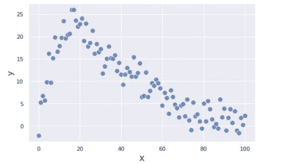

回归问题的示例

第一步是对目标`*y*`做出非常天真的预测。我们将初始预测`*F₀*`作为`*y*` *:* 的整体平均值

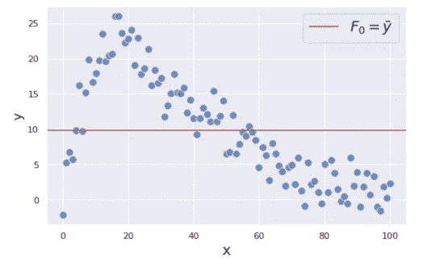

初始预测:F0 =平均值(y)

你可能会觉得用平均值来预测很傻，但是不要担心。当我们添加更多的弱模型时，我们将改进我们的预测。

为了改进我们的预测，我们将重点关注第一步的残差(即预测误差)，因为这是我们希望最小化以获得更好预测的内容。残差`*r₁*`在下图中显示为蓝色垂直线。

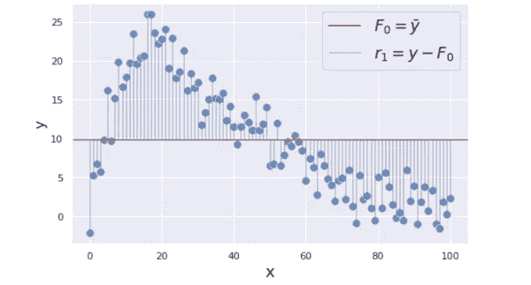

为了最小化这些残差，我们正在建立一个回归树模型，以`*x*`为特征，残差`*r₁ = y − mean(y)*` 为目标。背后的原因是，如果我们可以通过建立附加的弱模型找到`*x*`和`*r₁*`之间的一些模式，我们就可以利用它来减少残差。

为了简化演示，我们正在构建非常简单的树，每个树只有一个分支和两个终端节点，称为“stump”。请注意，梯度推进树通常有一个稍微深一点的树，比如有 8 到 32 个终端节点的树。

这里我们创建第一棵树，用两个不同的值`*γ₁ = {6.0, −5.9}*`预测残差(我们用`*γ*` (gamma)来表示预测)。

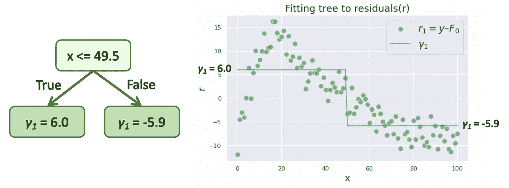

该预测`*γ₁*`被添加到我们的初始预测`*F₀*`中，以减少残差。事实上，梯度推进算法并不是简单地将`*γ*`加到`*F*`上，因为它使模型过度适应训练数据。相反，`*γ*`按比例缩小**学习率** `*ν*`，范围在 0 和 1 之间，然后加到`*F*`。

在这个例子中，我们使用了一个相对较大的学习率`*ν = 0.9*`来使优化过程更容易理解，但是它通常应该是一个小得多的值，例如 0.1。

更新后，我们的组合预测`*F₁*`变为:

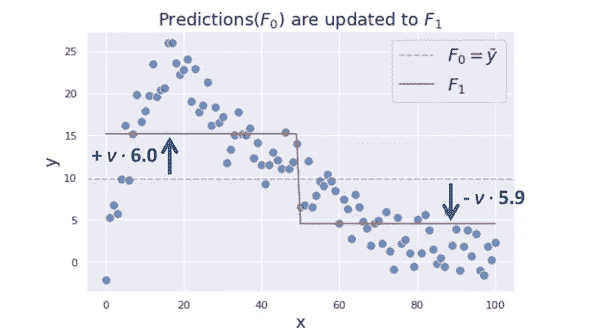

现在，更新的残差`*r₂*`看起来像这样:

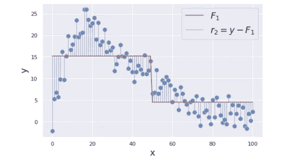

下一步，我们将使用相同的`*x*`作为特征，更新的残差`*r₂*`作为目标，再次创建回归树。下面是创建的树:

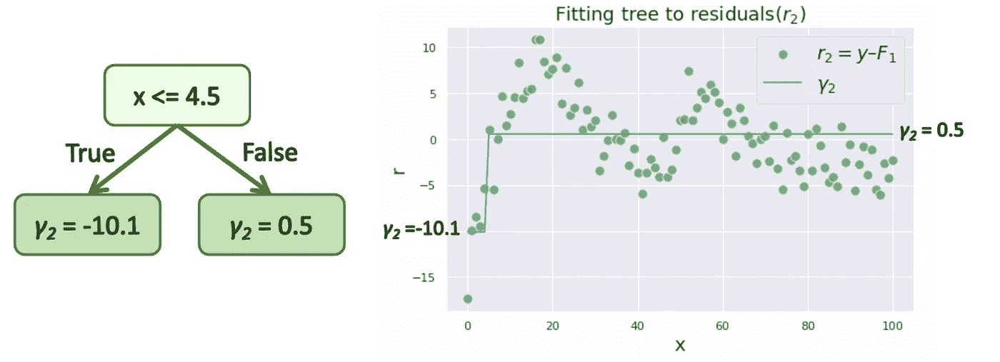

然后，我们用新的树预测`*γ₂*`更新我们先前的组合预测`*F₁*`。

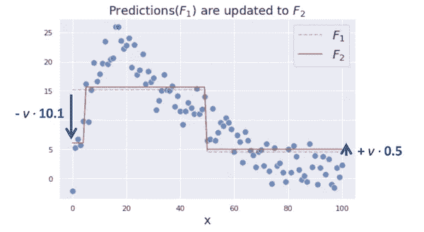

我们重复这些步骤，直到模型预测停止改进。下图显示了从 0 到 6 次迭代的优化过程。

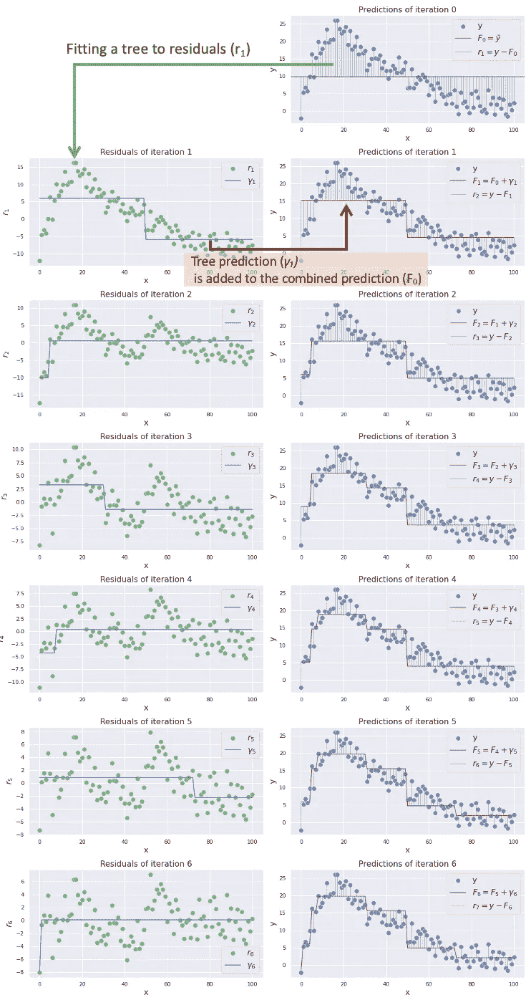

您可以看到，随着我们向组合模型*中添加更多的树，组合预测`*F𝑚*` *越来越接近我们的目标* `y`。这就是梯度增强如何通过组合多个弱模型来预测复杂目标。*

# 数学

在这一节中，我们将深入算法的数学细节。这是数学公式中的整个算法。

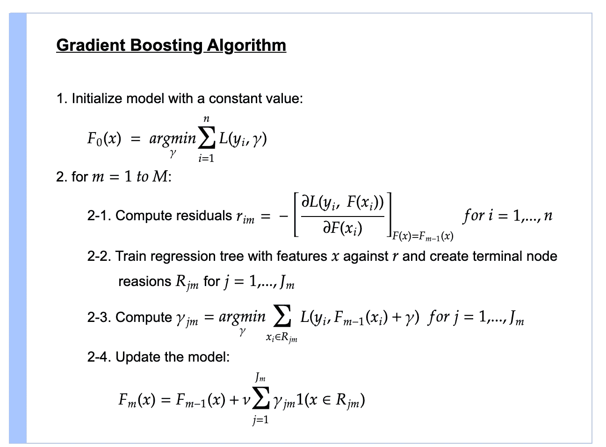

来源:改编自[维基百科](https://en.wikipedia.org/wiki/Gradient_boosting)和[弗里德曼的论文](https://jerryfriedman.su.domains/ftp/trebst.pdf)

让我们一行一行地解开这个谜团。

## 第一步

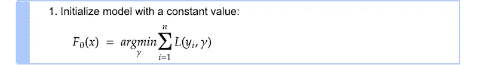

第一步是创建一个初始常数值预测`*F₀*`。`*L*`是损失函数，在我们的回归案例中是平方损失。

`*argmin*` 的意思是我们在寻找最小化`*ΣL(y*ᵢ*,γ)*`的值`*γ*` 。让我们通过使用实际损失函数来计算值`*γ*`。为了找到最小化`*ΣL*`的`*γ*` ，我们对`*γ*`求`*ΣL*`的导数。

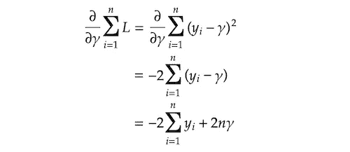

我们发现`*γ*` 使得`*∂ΣL/∂γ*`等于 0。

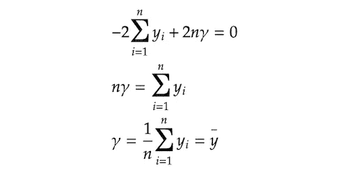

原来最小化`*ΣL*`的值`*γ*`就是`*y*`的平均值。这就是为什么我们在上一节中使用`*y*`平均值进行初始预测`*F₀*`。

## 第二步

从 2–1 到 2–4 的整个步骤 2 过程重复`*M*`次。`*M*`表示我们正在创建的树的数量，小的`*m*`表示每棵树的索引。

## 第 2 步–1

我们计算残差`*rᵢ𝑚*`的方法是对损失函数相对于之前的预测`*F𝑚-₁*`求导，然后乘以 1。正如您在下标索引中看到的，计算每个单个样本`*i*`的`*rᵢ𝑚*`。你们中的一些人可能想知道为什么我们称之为`*rᵢ𝑚*`残差。该值实际上是**负梯度**，为我们提供方向(+/)和幅度方面的指导，使损失函数最小化。你很快就会明白为什么我们称之为残差。顺便说一下，这种使用梯度来最小化模型损失的技术非常类似于通常用于优化神经网络的 g [梯度下降](https://en.wikipedia.org/wiki/Gradient_descent)技术。(其实两者略有不同。如果你有兴趣，请看看[这篇文章](https://explained.ai/gradient-boosting/descent.html)详述的那个话题。)

让我们在这里计算残差。方程中的`*F𝑚-₁*`表示上一步的预测。在第一次迭代中，它是`*F₀*`。我们正在求解残差方程`*rᵢ𝑚*`。

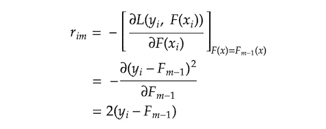

我们可以去掉 2，因为它只是一个常数。剩下我们`*rᵢ𝑚 = yᵢ − F𝑚-₁*`。你现在可能明白为什么我们称之为残差了。这也给了我们有趣的见解，即负梯度为我们提供了方向和大小，使损失最小化，实际上只是残差。

## 步骤 2–2

`*j*`表示树中的末端节点(即叶子)`*m*`表示树索引，大写`*J*`表示叶子总数。

## 第 2-3 步

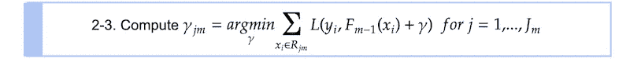

我们正在寻找使每个终端节点`*j*`上的损失函数最小化的`*γⱼ𝑚*`。`*Σxᵢ∈Rⱼ𝑚 L*`表示我们正在合计属于终端节点`*Rⱼ𝑚*`的所有样本`*xᵢ*`的损失。让我们把损失函数代入方程。

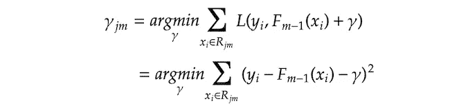

然后，我们找到使σ(*)的导数等于零的`*γⱼ𝑚*`。

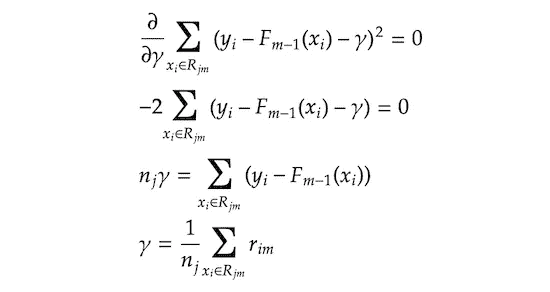

请注意，`*nⱼ*`表示终端节点`*j*`的样本数。这意味着最小化损失函数的最优`*γⱼ𝑚*`是终端节点`*Rⱼ𝑚*`中残差`*rᵢ𝑚*`的平均值。换句话说，`*γⱼ𝑚*`是回归树的常规预测值，其是每个终端节点中目标值(在我们的情况下，残差)的平均值。

## 第 2-4 步

在最后一步，我们正在更新组合模型`*F𝑚*`的预测。`*γⱼ𝑚1(x ∈ Rⱼ𝑚)*`意味着如果给定的`*x*`落在终端节点`*Rⱼ𝑚*`中，我们选择值`*γⱼm*`。由于所有的终端节点都是排他的，任何给定的单个`*x*`只落入一个终端节点，相应的`*γⱼ𝑚*`被添加到先前的预测`*F𝑚-₁*`中，并进行更新预测`*F𝑚*`。

如前所述，`*ν*`是范围在 0 和 1 之间的学习率，其控制附加树预测`*γ*`对组合预测`*F𝑚*`的贡献程度。较小的学习率降低了额外的树预测的效果，但是它基本上也降低了模型过度适应训练数据的机会。

现在我们已经完成了所有步骤。为了获得最佳的模型性能，我们希望迭代第 2 步`*M*`次，这意味着向组合模型添加`*M*`树。实际上，您可能经常想要添加超过 100 棵树来获得最佳的模型性能。

你们中的一些人可能会觉得所有这些数学都是不必要的复杂，因为前面的部分以一种简单得多的方式展示了基本的思想，而没有那些复杂的东西。其背后的原因是梯度推进被设计成能够处理任何损失函数，只要它是可微的，并且我们所回顾的数学是具有这种灵活性的梯度推进算法的一般化形式。这使得公式有点复杂，但这是算法的美妙之处，因为它在处理各种类型的问题时具有巨大的灵活性和便利性。例如，如果您的问题需要绝对损失而不是平方损失，您可以只替换损失函数，整个算法就像上面定义的那样工作。事实上，流行的梯度增强实现如 [XGBoost](https://xgboost.readthedocs.io/en/stable/) 或 [LightGBM](https://lightgbm.readthedocs.io/en/latest/) 有各种各样的损失函数，因此您可以选择适合您问题的任何损失函数(参见 [XGBoost](https://xgboost.readthedocs.io/en/stable/parameter.html#learning-task-parameters) 或 [LightGBM](https://lightgbm.readthedocs.io/en/latest/Parameters.html#objective) 中提供的各种损失函数)。

# 密码

在这一节中，我们将把刚刚复习过的数学知识转化为可行的 python 代码，以帮助我们进一步理解算法。代码主要来自 Matt Bowers 的实现，所以所有的荣誉都归于他的工作。我们使用 scikit-learn 的`DecisionTreeRegressor`来构建树，这有助于我们只关注梯度推进算法本身，而不是树算法。我们正在模仿 scikit-learn 风格的实现，其中您使用`fit`方法训练模型，并使用`predict`方法进行预测。

请注意，所有经过训练的树都存储在`self.trees`列表对象中，当我们使用`predict`方法进行预测时，会检索到这些树。

接下来，我们将通过查看他们在我们数据上的 RMSE 来检查我们的`CustomGradientBoostingRegressor`是否与 scikit-learn 的`GradientBoostingRegressor`表现相同。

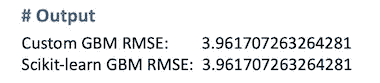

正如您在上面的输出中所看到的，两种型号都有完全相同的 RMSE。

# 结论

我们在这篇文章中回顾的算法只是梯度推进算法的一个选项，它专用于平方损失的回归问题。如果您也对分类算法感兴趣，请查看第 2 部分。

  

如果您想了解该算法的更多细节，还有一些其他的好资源:

*   **StatQuest，Gradient Boost**[**Part 1**](https://www.youtube.com/watch?v=3CC4N4z3GJc&t=1s)**和** [**Part 2**](https://www.youtube.com/watch?v=2xudPOBz-vs)
    这是一个 YouTube 视频，以初学者友好的方式解释了 GB 回归算法，具有很好的视觉效果。
*   **特伦斯·帕尔和杰瑞米·霍华德，** [**如何解释渐变助推**](https://explained.ai/gradient-boosting/index.html)本文还重点介绍了 GB 回归。它解释了平方损失和绝对损失之间的算法差异。
*   **杰罗姆弗里德曼，** [**贪婪函数逼近:一个梯度推进机**](https://statweb.stanford.edu/~jhf/ftp/trebst.pdf)这是弗里德曼的论文原文。虽然有点难以理解，但它确实展示了算法的灵活性，他展示了一个通用算法，可以处理任何类型的具有可微损失函数的问题。

你也可以在 Google Colab 链接或者下面的 Github 链接中查看完整的 Python 代码。

  

# 参考

*   杰罗姆·弗里德曼，[贪婪函数逼近:一个梯度推进机](https://statweb.stanford.edu/~jhf/ftp/trebst.pdf)
*   特伦斯·帕尔和杰瑞米·霍华德，[如何解释梯度推进](https://explained.ai/gradient-boosting/index.html)
*   Matt Bowers，[如何从零开始建立一个梯度推进机](https://blog.mattbowers.dev/gradient-boosting-machine-from-scratch)
*   维基百科，[渐变提升](https://en.wikipedia.org/wiki/Gradient_boosting)