# 关于梯度提升算法，您只需知道第 2 部分。分类

> 原文：<https://towardsdatascience.com/all-you-need-to-know-about-gradient-boosting-algorithm-part-2-classification-d3ed8f56541e>

## 用例子、数学和代码解释算法

作者图片

在第 1 部分文章的[中，我们详细学习了梯度推进回归算法。正如我们在那篇文章中所评论的，只要损失函数是可微的，算法就足够灵活来处理任何损失函数。这意味着，如果我们只是用处理分类问题的损失函数替换用于回归的损失函数，特别是均方损失，我们就可以在不改变算法本身的情况下执行分类。尽管基本算法是相同的，但我们仍然想知道一些不同之处。在这篇文章中，我们将深入分类算法的所有细节。](https://medium.com/p/2520a34a502)

# 算法与实例

梯度推进是集成方法的一种变体，其中您创建多个弱模型(它们通常是决策树)并组合它们以获得整体上更好的性能。在本节中，我们将使用非常简单的示例数据构建一个梯度推进分类模型，以便直观地理解其工作原理。

下图是样本数据。它有二进制类`*y*` (0 和 1)和两个特性`*x₁*`和`*x₂*`。

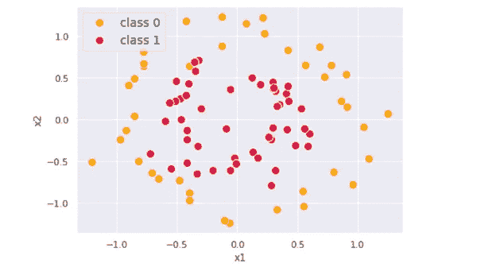

分类问题示例(图片由作者提供)

我们的目标是建立一个梯度推进模型来分类这两个类。第一步是对所有数据点的第 1 类概率进行统一预测(我们称之为`*p*`)。统一预测的最合理值可能是第 1 类的比例，这只是一个`*y*`的平均值。

这是数据和初始预测的 3D 表示。这时预测的只是一个在`*y*`轴上一直有统一值`*p = mean(y)*`的平面。

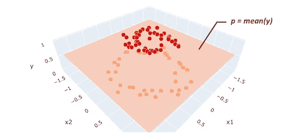

预测平面(图片由作者提供)

在我们的数据中，`*y*`的均值是 0.56。因为它大于 0.5，所以所有事物都被分类到具有该初始预测的类 1 中。你们中的一些人可能会觉得这个统一值预测没有意义，但是不要担心。当我们添加更多的弱模型时，我们将改进我们的预测。

为了提高我们的预测质量，我们可能希望关注初始预测的残差(即预测误差)，因为这是我们希望最小化的。残差定义为`*rᵢ = yᵢ − p*` ( `*i*`代表每个数据点的索引)。在下图中，残差显示为棕色线，即从每个数据点到预测平面的垂直线。

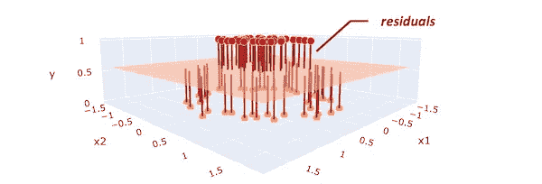

残差(图片由作者提供)

为了最小化这些残差，我们正在建立一个回归树模型，以`*x₁*`和`*x₂*`为特征，以残差`*r*` 为目标。如果我们可以构建一个树，找到`*x*`和`*r*`之间的一些模式，我们就可以通过利用那些找到的模式来减少初始预测`*p*`的残差。

为了简化演示，我们正在构建非常简单的树，每个树只有一个分支和两个终端节点，称为“stump”。请注意，梯度推进树通常有一个稍微深一点的树，比如有 8 到 32 个终端节点的树。

在这里，我们创建第一棵树，用两个不同的值`*r = {0.1, -0.6}*`预测残差。

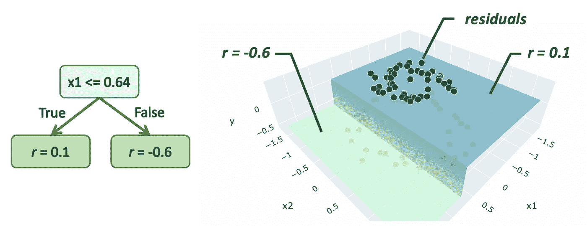

创建的树(作者图片)

如果你已经阅读了关于回归算法的文章[，你现在可能会认为我们想要将这些预测值添加到我们的初始预测`*p*`中，以减少其残差，但是分类的情况略有不同。我们添加到初始预测中的值(我们称之为`*γ*` gamma)在以下公式中计算:](/all-you-need-to-know-about-gradient-boosting-algorithm-part-1-regression-2520a34a502)

`*Σxᵢ∈Rⱼ*`意味着我们正在聚合属于终端节点`*Rⱼ*`的所有样本`*xᵢ*`上的 sigma `*Σ*`中的值。`*j*`代表每个终端节点的索引。您可能会注意到，分数的分子是终端节点`*j*`中残差的总和。我们将在下一节讨论给出这个公式的所有计算，但现在让我们只使用它来计算`*γ*` 。下面是`*γ₁*`和`*γ₂*`的计算值。

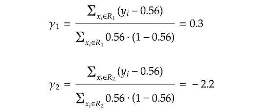

这个`*γ*` 并不是简单的加在我们最初预测的`*p*` *上。*相反，我们将`*p*`转换成对数概率(我们将把这个对数概率转换值称为`*F(x)*`)，然后加上`*γ*`。对于那些不熟悉对数优势的人，其定义如下。你可能在逻辑回归中见过它。

对数概率

预测更新的另一个调整是，在添加到对数几率转换预测`*F(x)*`之前，通过**学习率** `*ν*`缩小`*γ*`，学习率范围在 0 和 1 之间。这有助于模型不过度拟合训练数据。

在这个例子中，我们使用了一个相对较大的学习率`*ν = 0.9*`来使优化过程更容易理解，但它通常应该是小得多的值，如 0.1。

通过用实际值替换上式右侧的变量，我们得到了更新的预测值`*F₁(x)*`。

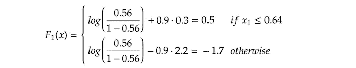

如果我们将 log-odds `*F(x)*`转换回预测概率`*p(x)*`(我们将在下一节介绍如何转换)，它看起来像下面的一个楼梯状物体。

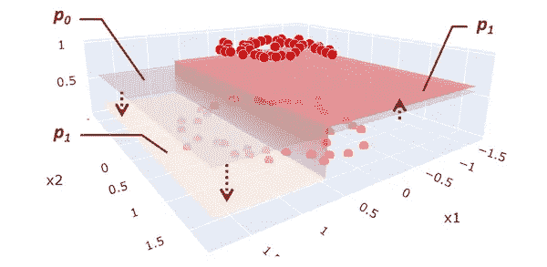

更新的预测平面(图片由作者提供)

紫色平面是初始预测`*p₀*` 和它被更新为红色和黄色平面`*p₁*`。

现在，更新后的残差`*r*`看起来像这样:

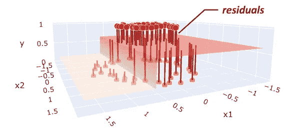

更新的残差(图片由作者提供)

在下一步中，我们使用相同的`*x₁*`和`*x₂*`作为特征，使用更新的残差`*r*`作为目标，再次创建回归树。下面是创建的树:

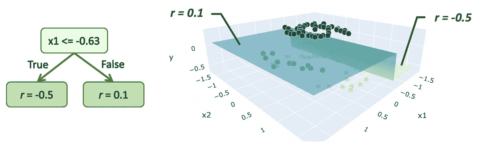

创建的树(作者图片)

我们应用相同的公式来计算`*γ*`。计算的`*γ*`和更新的预测`*F₂(x)*`如下。

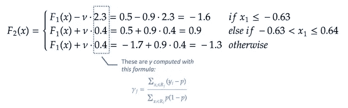

同样，如果我们将对数赔率`*F₂(x)*`转换回预测概率`*p₂(x)*`，它看起来像下面这样。

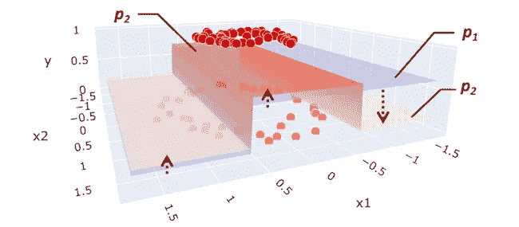

更新的预测平面(图片由作者提供)

我们重复这些步骤，直到模型预测停止改进。下图显示了从 0 到 4 次迭代的优化过程。

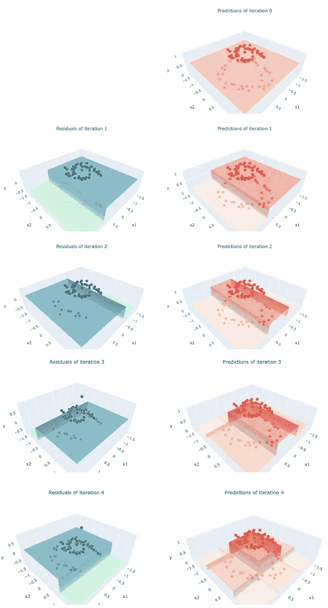

通过迭代进行预测更新(图片由作者提供)

你可以看到组合预测`*p(x)*`(红色和黄色平面)越来越接近我们的目标`*y*`，因为我们在组合模型*中添加了更多的树。这就是梯度增强如何通过组合多个弱模型来预测复杂目标。*

下图总结了算法的全过程。

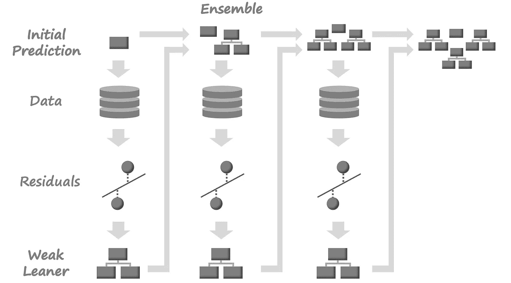

算法的过程(图片由作者提供)

# 数学

在本节中，我们将通过查看数学细节来学习一个更一般化的算法。这是数学公式中的整个算法。

来源:改编自[维基百科](https://en.wikipedia.org/wiki/Gradient_boosting)和[弗里德曼的论文](https://jerryfriedman.su.domains/ftp/trebst.pdf)

让我们一行一行地仔细看看。

## 第一步

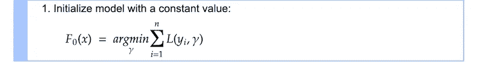

第一步是创建初始常数预测值`*F₀*`。`*L*`是损失函数，我们使用[对数损失](https://scikit-learn.org/stable/modules/generated/sklearn.metrics.log_loss.html)(或者更一般地称为[交叉熵损失](https://en.wikipedia.org/wiki/Cross_entropy))来表示。

原木损失

`*yᵢ*`是我们的分类目标，它不是 0 就是 1。`*p*`是 1 类的预测概率。您可能会看到`*L*`根据目标类别`*yᵢ*`采用不同的值。

由于`*−log(x)*`是`*x*`的递减函数，预测越好(即`*yᵢ=1*`增加`*p*`，我们的损失就越小。

`*argmin*` 是指我们在寻找使`*ΣL(y*ᵢ*,γ)*`最小的值`*γ*` *(gamma)* 。虽然假设`*γ*`是预测概率`*p*`更简单，但我们假设`*γ*`是**对数几率**为，这使得接下来的所有计算更容易。对于那些忘记我们在上一节中回顾的对数优势定义的人，它被定义为`*log(odds) = log(p/(1-p))*`。

为了能够根据对数优势解决`*argmin*`问题，我们将损失函数转换成对数优势函数。

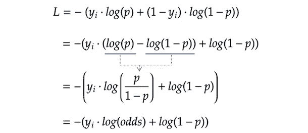

现在，我们可能想用对数概率表示的东西来代替上面等式中的`*p*`。通过转换前面所示的对数优势表达式，`*p*`可以用对数优势表示:

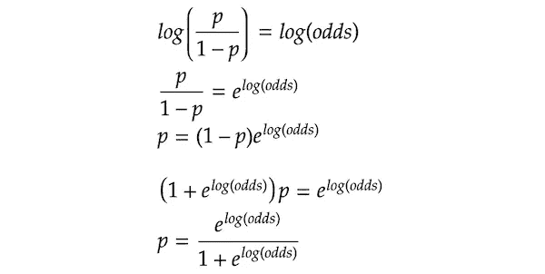

然后，我们用这个值代替前面的`*L*`方程中的`*p*`，并简单地应用它。

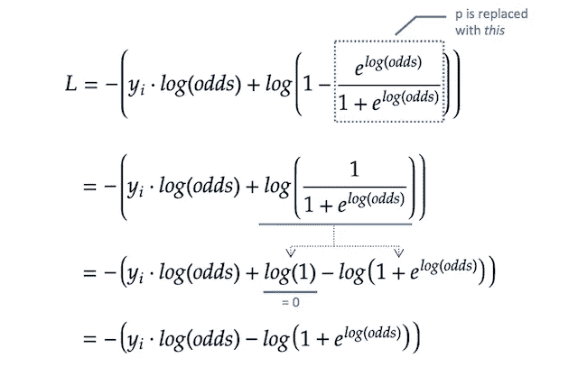

现在我们正在寻找最小化`*ΣL*`的`*γ*` (请记住我们假设它是对数概率)。我们对`*ΣL*`的对数几率求导。

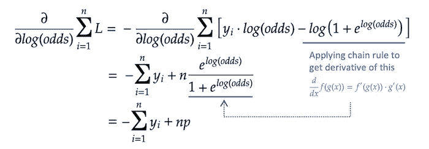

在上面的等式中，我们用`*p*`替换了包含对数优势的分数，以简化等式。接下来，我们设置`*∂ΣL/∂log(odds)*`等于 0，并求解`*p*`。

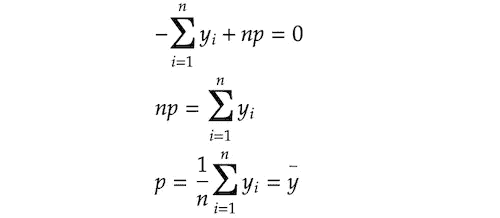

在这个二元分类问题中，`*y*`不是 0 就是 1。所以，`*y*`的均值其实就是 1 类的比例。你现在可能明白为什么我们在最初的预测中使用了`*p = mean(y)*`。

由于`*γ*`是对数概率而不是概率`*p*`，我们将其转换成对数概率。

## 第二步

从 2–1 到 2–4 的整个步骤 2 过程重复`*M*`次。`*M*`表示我们正在创建的树的数量，小的`*m*`表示每棵树的索引。

## 第 2 步–1

我们计算残差`*rᵢ𝑚*`的方法是对损失函数相对于之前的预测`*F𝑚-₁*`求导，然后乘以 1。正如您在下标索引中看到的，针对每个单个样本`*i*`计算`*rᵢ𝑚*`。你们中的一些人可能想知道为什么我们称之为`*rᵢ𝑚*`残差。该值实际上是**负梯度**，为我们提供方向(+/)和幅度，使损失函数最小化。你很快就会明白为什么我们称之为残差。顺便说一下，这种使用梯度来最小化模型损失的技术非常类似于通常用于优化神经网络的梯度下降技术。(其实两者略有不同。如果你有兴趣，请看看[这篇文章](https://explained.ai/gradient-boosting/descent.html)详述了那个话题。)

让我们在这里计算残差。方程中的`*F𝑚-₁*`表示上一步的预测。在第一次迭代中，它是`*F₀*`。和上一步一样，我们对`*L*`的对数比进行求导，而不是 p，因为我们的预测`*F𝑚*`是对数比。下面我们使用在上一步中得到的用对数几率表示的`*L*`。

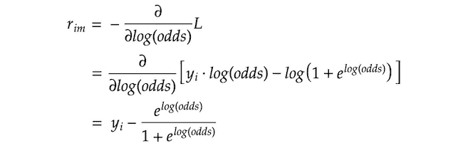

在上一步中，我们也得到了这个等式:

所以，我们可以用`*p*`代替`*rᵢ𝑚*`方程中的第二项。

你现在可能明白为什么我们称之为`*r*`残差了。这也给了我们有趣的见解，即负梯度为我们提供了方向和大小，使损失最小化，实际上只是残差。

## 步骤 2–2

`*j*`表示树中的末端节点(即叶子)`*m*`表示树索引，大写`*J*`表示叶子总数。

## 第 2-3 步

我们正在寻找使每个终端节点`*j*`上的损失函数最小化的`*γⱼ𝑚*`。`*Σxᵢ∈Rⱼ𝑚 L*`表示我们正在合计属于终端节点`*Rⱼ𝑚*`的所有`*xᵢ*`的损失。让我们把损失函数代入方程。

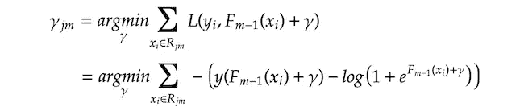

为`*γⱼ𝑚*`解这个方程将会非常困难。为了更容易解决，我们使用二阶泰勒多项式[来近似`*L*`。泰勒多项式是一种将任何函数近似为具有无限/有限项数的多项式的方法。虽然我们在这里不研究它的细节，但是如果你感兴趣的话，你可以看看](https://en.wikipedia.org/wiki/Taylor_series)[这篇教程](https://activecalculus.org/single/sec-8-5-taylor.html)，它很好地解释了这个想法。

下面是使用二阶泰勒多项式的`*L*`的近似值:

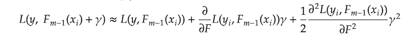

我们用这个近似值代替等式`*γⱼ𝑚*`中的`*L*`，然后找到使σ(*)的导数等于零的`*γⱼ𝑚*`的值。

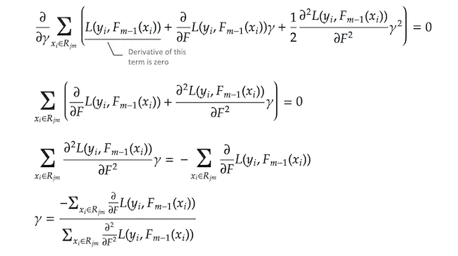

正如我们在上一步中已经计算出的`*∂L/∂F*`,如下所示:

我们用这个代替`*γ*` 等式中的`*∂L/∂F*`。

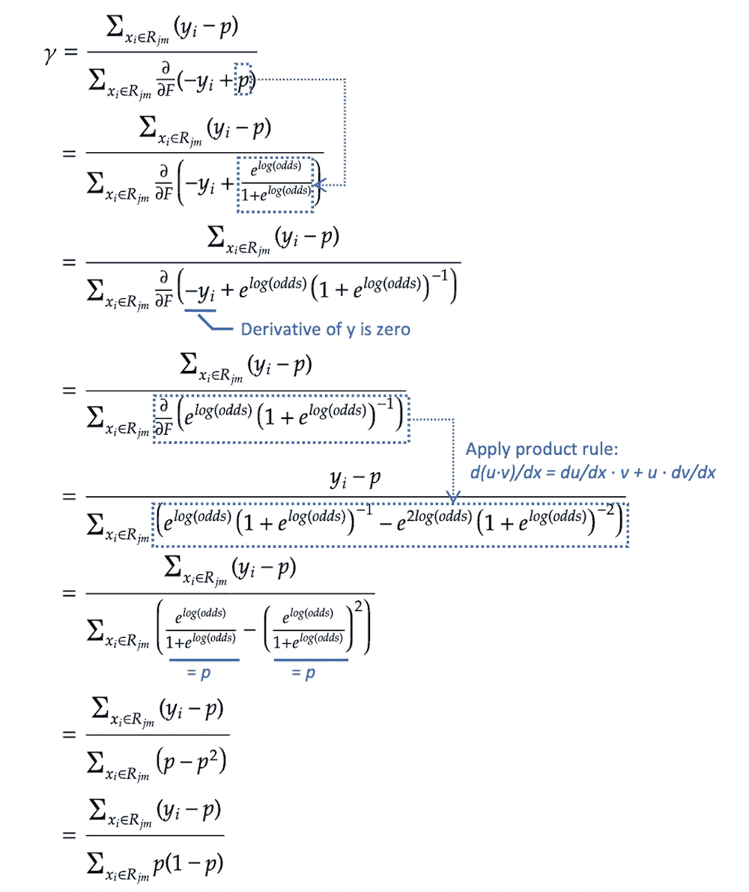

最后，我们得到了上一节中使用的`*γⱼ𝑚*`值的简化公式。

## 第 2-4 步

在最后一步，我们正在更新组合模型`*F𝑚*`的预测。`*γⱼ𝑚1(x ∈ Rⱼ𝑚)*`意味着如果给定的`*x*`落在终端节点`*Rⱼ𝑚*`中，我们选择值`*γⱼm*`。由于所有的终端节点都是排他的，任何给定的单个`*x*`只落入一个终端节点，相应的`*γⱼ𝑚*`被添加到先前的预测`*F𝑚-₁*`中，然后进行更新的预测`*F𝑚*`。

如前所述，`*ν*`是范围在 0 和 1 之间的学习率，其控制附加树预测`*γ*`对组合预测`*F𝑚*`的贡献程度。较小的学习率降低了额外的树预测的效果，但是它基本上也降低了模型过度适应训练数据的机会。

现在我们已经完成了所有步骤。为了获得最佳的模型性能，我们希望迭代第 2 步`*M*`次，这意味着向组合模型添加`*M*`树。实际上，您可能经常想要添加超过 100 棵树来获得最佳的模型性能。

如果你读了我关于回归算法的文章，你可能会觉得分类算法的数学计算比回归复杂得多。虽然`*argmin*`和对数损失函数的导数计算复杂，但本节开头所示的基本数学算法完全相同。这实际上是梯度推进算法的优雅之处，因为完全相同的算法适用于任何损失函数，只要它是可微分的。事实上，流行的梯度增强实现如 [XGBoost](https://xgboost.readthedocs.io/en/stable/) 或 [LightGBM](https://lightgbm.readthedocs.io/en/latest/) 有各种各样的损失函数，因此您可以选择适合您问题的任何损失函数(参见 [XGBoost](https://xgboost.readthedocs.io/en/stable/parameter.html#learning-task-parameters) 或 [LightGBM](https://lightgbm.readthedocs.io/en/latest/Parameters.html#objective) 中提供的各种损失函数)。

# 密码

在这一节中，我们将把刚刚复习过的数学知识转化为可行的 python 代码，以帮助我们进一步理解算法。我们使用 scikit-learn 的`DecisionTreeRegressor`来构建树，这有助于我们只关注梯度推进算法本身，而不是树算法。我们正在模仿 scikit-learn 风格的实现，其中您使用`fit`方法训练模型，并使用`predict`方法进行预测。

在

请注意，所有经过训练的树都存储在`self.trees`列表对象中，当我们使用`predict_proba`方法进行预测时，会检索到这些树。

接下来，我们检查我们的`CustomGradientBoostingClassifier`是否与 scikit-learn 的`GradientBoostingClassifier`表现相同，方法是查看它们在我们数据上的日志损失。

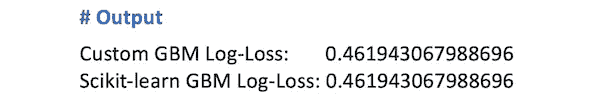

正如您在上面的输出中看到的，两个模型有完全相同的日志损失。

# 推荐资源

在这篇博文中，我们回顾了梯度推进分类算法的所有细节。如果您也对回归算法感兴趣，请查看第 1 部分的文章。

 [## 关于梯度提升算法，您只需知道第 1 部分。回归

### 用例子、数学和代码解释算法

towardsdatascience.com](/all-you-need-to-know-about-gradient-boosting-algorithm-part-1-regression-2520a34a502) 

如果您想了解该算法的更多细节，还有一些其他的好资源:

*   **StatQuest，Gradient boosting**[**Part 3**](https://www.youtube.com/watch?v=jxuNLH5dXCs)**和** [**Part 4**](https://www.youtube.com/watch?v=StWY5QWMXCw)
    这些是 YouTube 上的视频，以初学者友好的方式解释了具有很好视觉效果的梯度提升分类算法。
*   **特伦斯·帕尔和杰瑞米·霍华德，** [**如何解释梯度推进**](https://explained.ai/gradient-boosting/index.html)虽然本文的重点是梯度推进回归而不是分类，但它很好地解释了算法的每个细节。
*   **杰罗姆弗里德曼，** [**贪婪函数逼近:一个梯度推进机**](https://statweb.stanford.edu/~jhf/ftp/trebst.pdf)这是弗里德曼的论文原文。虽然有点难以理解，但它确实展示了算法的灵活性，他展示了一种通用算法，可以处理任何类型的具有可微损失函数的问题。

你也可以在 Google Colab 链接或者下面的 Github 链接中查看完整的 Python 代码。

 [## 谷歌联合实验室

### 梯度推进算法——第二部分。分类](https://colab.research.google.com/drive/13p46IFhg3h6BIdjxUcfXPco13jIOCV6I?usp=sharing)  [## 梯度增强算法-在 tomo nori-masui/梯度增强下分类

github.com](https://github.com/tomonori-masui/gradient-boosting/blob/main/gradient_boosting_classification.ipynb) 

# 参考

*   杰罗姆·弗里德曼，[贪婪函数逼近:一个梯度推进机](https://statweb.stanford.edu/~jhf/ftp/trebst.pdf)
*   特伦斯·帕尔和杰瑞米·霍华德，[如何解释梯度推进](https://explained.ai/gradient-boosting/index.html)
*   Matt Bowers，[如何从零开始建立一个梯度推进机](https://blog.mattbowers.dev/gradient-boosting-machine-from-scratch)
*   维基百科，[渐变提升](https://en.wikipedia.org/wiki/Gradient_boosting)