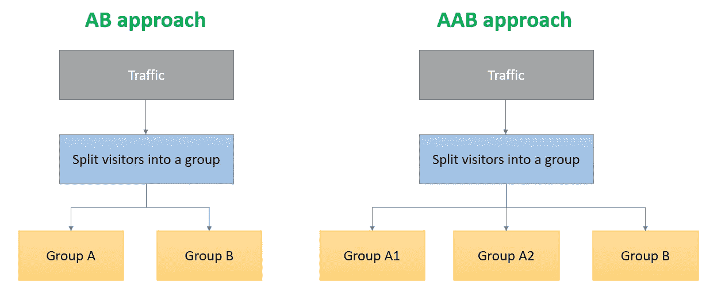
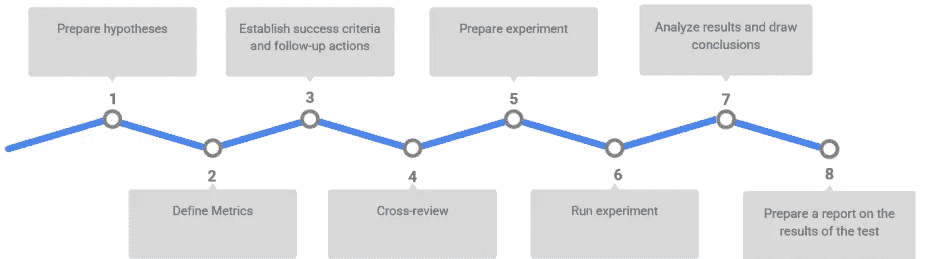
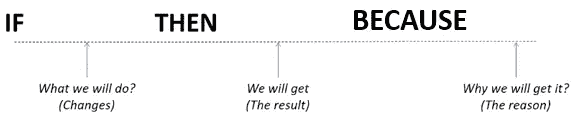
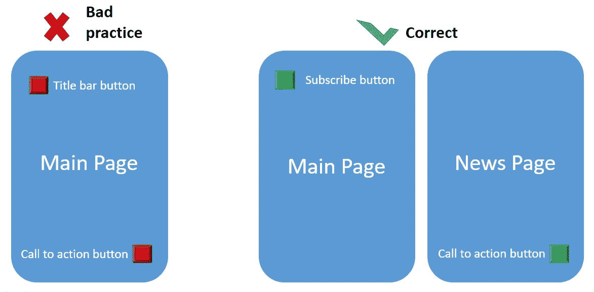

# 关于 AB 测试你应该知道的

> 原文：<https://towardsdatascience.com/all-you-should-know-about-ab-testing-599724c34773>

## 正确运行 AB 测试的所有步骤。

在快速变化的数据世界中，AB 测试是一种工具，它帮助产品团队测试假设，并做出数据驱动的决策，而不是直觉。

Joyce McCown 在 [Unsplash](https://unsplash.com?utm_source=medium&utm_medium=referral) 上的照片

先说 AB 测试的定义。

**我们可以**测试每一个变化**:**

*   **登陆页面设计，**
*   **行动号召按钮的颜色和位置，**
*   **登记表，**
*   **邮件营销，**
*   **网站广告文字，**
*   **等等。**

**任何 AB 测试的**目标**都是找到哪种解决方案能够为期望的目标行动提供最佳对话。例如，它可能是——在这种情况下，将有更多的用户关注该链接，在网站或应用程序中注册，订阅时事通讯，并填写反馈表。在更复杂的测试中，我们可以研究长期指标，例如，平均发票的变化或产品变化对利润的影响。**

## ****我们为什么需要 AAB 测试？****

**测试最好用对照样本进行，以免怀疑结果的可靠性。我们将测试选项的受众分成三组(A1、A2 和 B)，而不是像往常一样分成两组(A 和 B)。对于 A1 和 A2，我们将展示一个版本，而对于 B，我们将展示另一个版本。这种方法将揭示外部因素是否影响了测试结果，以及在度量标准的收集中是否存在错误。**

****

**交通分组方法(图片由作者提供)**

***示例:
我们想在我们的网站上测试新的新闻稿形式。与此同时，市场部开展了一场大横幅大折扣的销售活动。所以，我们会有很多网站访问者想现在购买，但他们对时事通讯一点也不感兴趣，所以他们会歪曲实验结果。***

**上面的方法将显示 AB 测试的参与者是否均匀地分布在各组中，以及广告活动是否影响其结果。如果 A1 组和 A2 组的转化率没有差异，我们可以信任数据并相信外部因素不会影响结果。**

## **任何 AB 测试的主要步骤:**

****

**AB 测试管道(图片由作者提供)**

*   ****准备假设****

**假设将有助于确定实验的目标，选择度量标准，并解释结果。下面是我们可以使用的模式:**

****

**假设的模式(作者图片)**

***举例:***

*****如果*** *在*用户注册*后*会出现通迅订阅建议**

*****那么*** *用户会订阅的更频繁，未来会更投入(比如，有 here 留存率)。***

*****因为*** *一条关于时事通讯的消息不仅会促使他们订阅，还会促使他们更频繁地回到网站。***

*   ****定义指标****

**AB 检验度量是一个用来估计假设是否被证实的指标。在上面的例子中，它们是——订阅率和回报率。**

**重要的是要考虑实验可能影响的所有指标。否则，选择一个将改进一个度量标准，但同时使产品整体恶化的选项是有风险的。**

*   ****建立成功标准和后续行动****

**成功标准是一个预期的结果，可以用来决定测试是否成功。**

***例如:***

**我们对新注册用户的订阅有 7%的转化率。我们添加了一个弹出窗口，显示不同订阅的信息，预计订阅的转化率将增加到 12%。12%是成功的标准。**

**如果带有小部件的版本的订阅量增加，那么假设已经得到证实——实验是成功的，这种变化可以成为所有用户的午餐。**

**如果指标会下降，那么就需要制定其他解决方案。**

**如果指标保持在同一水平或变化在统计上不显著，则可能有不同的进一步行动选项，例如:**

*   **改变测试条件；**
*   **选择另一个功能；**
*   **测试不同的观众群。**

**不同结果的行动计划在实验**准备**阶段确定。否则，之后，诸如“下一步做什么？我们为什么要做 AB 测试？”**

*   ****交叉审查****

**准备大型重要实验时要做交叉评审。同事们会帮助评估所有有争议的观点。他们将检查假设是如何制定的，是否所有可能受实验影响的指标都被考虑在内，以及计划根据结果做出的决策有多正确。同事在复习时提出的每一个多变的问题都可以帮助你在考试中避免错误。**

*   ****准备实验****

**在此阶段，将创建一个包含要测试的更改的版本，并定义以下参数:**

1.  **对照和实验样品**
2.  **最小样本量**
3.  **估计结果统计显著性的指标**
4.  **测试需要多长时间？**

****对照**和**实验样品**是将参与测试的用户。您既可以检查所有用户，也可以检查由特定指标(位置、性别、年龄等)联合起来的组。**

****统计显著性的指标**是对照和实验样本的度量之间的差异，在该差异下，这不太可能是随机结果。**

****测试持续时间** —实验运行的天数。该指标取决于总样本量和当前流量。公式:每天样本/流量=天数。**

*   ****运行实验****

**启动时要做的主要事情是检查 AB 测试是否正确运行。例如，正在测试的一个按钮工作正常，测试的用户是随机选择的。如果在运行之后版本 A 和 B 的转换中出现了很大的差异，或者相反，则根本没有差异—这是有问题的信号。**

**如果测试工作正常，那么在测试结束前不要试图分析结果，也不要在测试过程中改变测试设置。第一天，赢家可能是一个选项，第二天——又是另一个。你需要等到测试结束才能得到可靠的结果，否则我们可能会面临偷窥的问题。这里有一篇很好的论文解释一下——[链接](http://library.usc.edu.ph/ACM/KKD%202017/pdfs/p1517.pdf)。**

*   ****分析结果并得出结论****

**我们应该将收到的度量数据与之前设置的成功标准进行比较。然后，我们可以对实验结果做出结论，并参考测试开始前制定的行动计划。**

*   ****准备一份关于测试结果的报告****

**与同事分享 AB 测试的结果将有助于他们理解用户行为，即使乍一看，假设与他们的任务无关。**

**存储报告以便公司的所有员工都可以轻松找到它们是有意义的。这将有助于节省团队的时间和资源，并避免重复的 AB 测试。**

## **H0 假说、p 值和 ab 群**

****(H0)** 是样本 A 和样本 b 的均值之间没有差异的默认假设。因此，在可以证明相反情况之前，零假设为真。**

****P 值**是 H0 被拒绝的最低显著性水平。**

**用户需要被随机地**分成**A 组和 B 组，例如，偶数和奇数用户 id。但最主要的是根据你的标准检查样本的同质性:性别、年龄、地点等。**

## **样本量**

**在我们处理 A/B 测试的结果之前，我们需要确保测试达到了统计显著性。这是你获得 95%或更高的置信度的点。许多测试工具已经具有内置的统计显著性，所以当测试准备好进行解释时，我们会立即得到通知。还有，网上有很多计算器，比如，[计算器 _1](https://www.evanmiller.org/ab-testing/sample-size.html) ，[计算器 _2](https://www.optimizely.com/sample-size-calculator/?conversion=3&effect=20&significance=95) ，或者[计算器 _3](https://www.abtasty.com/sample-size-calculator/) 。**

## ****还有哪些错误值得害怕？****

*   ****历史效应:**外界发生的一些事情对你的测试结果产生了负面影响。**
*   ****工具效应**:测试软件的一个 bug 扭曲了测试结果。**

## ****为什么 AB 考不正好 50/50 通过？****

**有时在 AB 测试期间，您可能会注意到每个变量上的流量并不相同。这并不意味着测试有问题，只是随机样本工作…偶然。通过你网站的流量越多，这个数字就越接近 50/50 的比例。**

## **我如何以及何时可以解释分割测试结果？**

**测试的早期阶段并不是开始解释结果的最佳时机。我们应该等到测试**达到统计显著性**再回到原来的假设。当测试最终证实或否定它时，我们就可以开始下结论了。当回顾一个测试时，通过将你的结果与特定的变化联系起来，试着保持公正。确保所做的更改和结果之间有明确的联系，并且没有受到任何第三方(任何外部)力量的影响。**

## ****并行 ab 测试****

**我们可以平行进行两项测试，但样本不能混在一起。否则，一个变化可能会影响第二个变化的感知。**

****

**并行 ab 测试示例(图片由作者提供)**

**通过为不同版本的接口用不同的标签标记事件，可以在前端配置并行测试。你可以使用特殊的工具来简化这个过程，比如谷歌优化。**

## **使用 AB 测试时？**

**通常，AB 测试失败是因为目标不明确，所以我们不知道我们在测试什么。我们可以用 AB 测试来测试，比如说理论，给新闻页面添加一个图片会增加流量吗？如果您更改标题以强调报价的临时性质，会发生什么情况？上述所有变化都很容易量化。当目标模糊时，人们会在 AB 测试中遇到麻烦:例如，如果我们想比较两个完全不同的设计和不同的选项。虽然这样做是可能的，但是如果没有明确的赢家，那么就有可能搞错或者曲解了点击量增加的原因。**

## **什么可以取代 A/B 测试？**

****可用性测试**。该方法检查界面的用户友好程度。**

**研究不需要开发人员参与，就像 A/B 测试一样。我们需要在布局层面创建一个新的界面，构建一个交互原型，观察用户如何与之交互。然后找出可能的问题并找到解决方案。**

****假门试验。**当开发一个特性比较困难且耗时时，可以用这种方法来检查用户是否需要。**

**为了做到这一点，在界面上添加了一个按钮，在这个按钮后面没有任何东西——一个假门——并跟踪有百分之多少的用户会按下它。在假门后面通常会放一条信息，说明该部分正在开发中。我们还可以添加一个调查链接，从而为未来的产品收集更多的数据。**

**向有限的受众发布新产品。如果有足够的时间，我们可以针对一个城市、地区或其他选定的部分用户推出产品，而不是进行测试。当产品是本地的，并且你想测试商业模式的大变化或者尝试一个全新的产品时，这种方法是合适的。**

## **经典与贝叶斯方法**

****在 frequentist** **方法中，**概率是事件发生的频率。我们用这种方法来检验统计假设，结果我们会得到一个 p 值。这种计算比较繁琐，我们需要满足许多条件，以便考虑到这种方法的所有特点。**

****在贝叶斯方法中，**概率是确定的程度(主观概率)，在结果中，我们得到每个选项的成功概率。它对初始数据的要求较低，这意味着我们不必检查分布，我们需要更少量的数据，但这样做的代价是贝叶斯计算的复杂性。**

**最后，无论你选择哪种方法，都要记住 A/B 测试的潜力。这是一种几乎通用的探查受众的方式，任何形式都会给你带来很多有用的数据。**

## **结论**

**A/B 测试是一个很好的工具，但是它不能帮助我们得到“哪种变体更好？”这个问题的明确答案，只能让你在寻找最优解的路上减少不确定性。在 AB 测试准备的所有阶段，每个细节都很重要，每个不准确之处都会耗费资源，并会对结果的可靠性产生负面影响。**