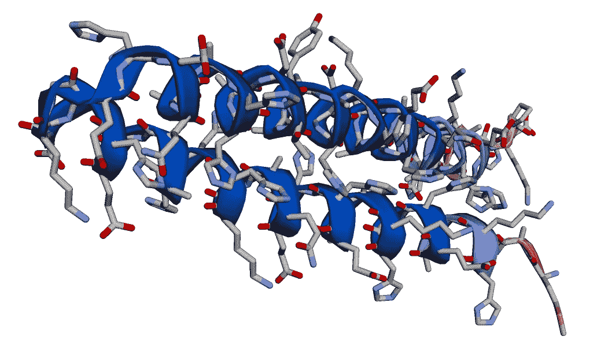
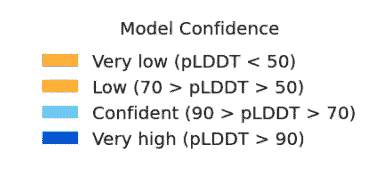
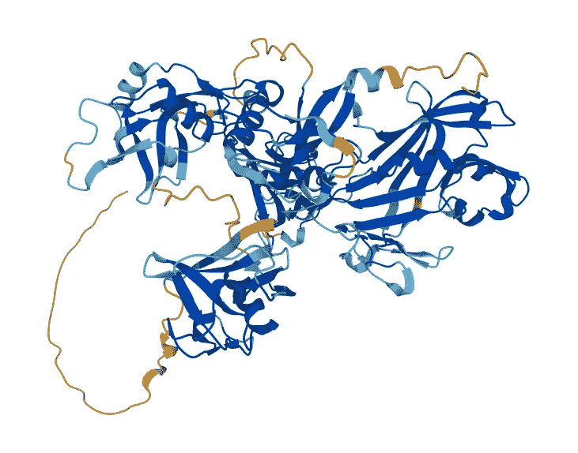
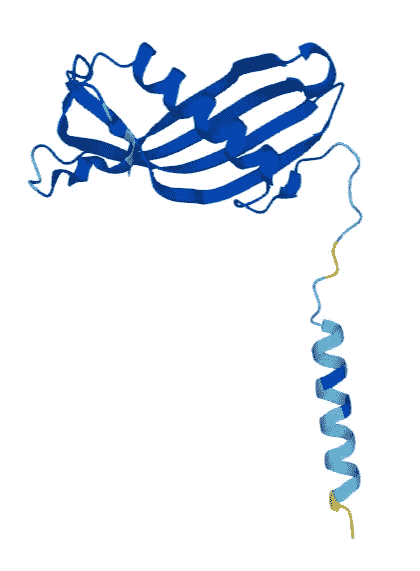
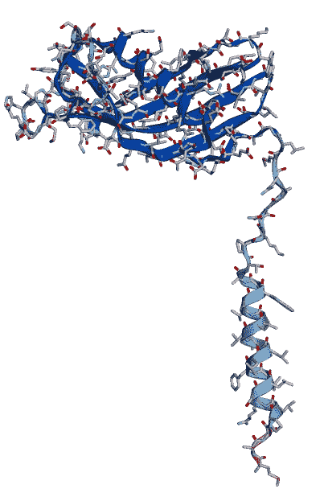
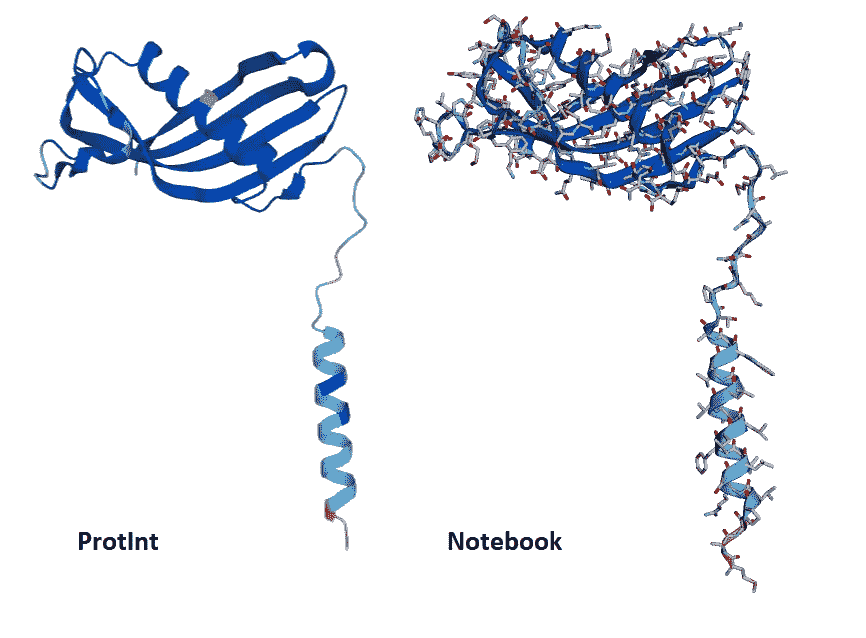
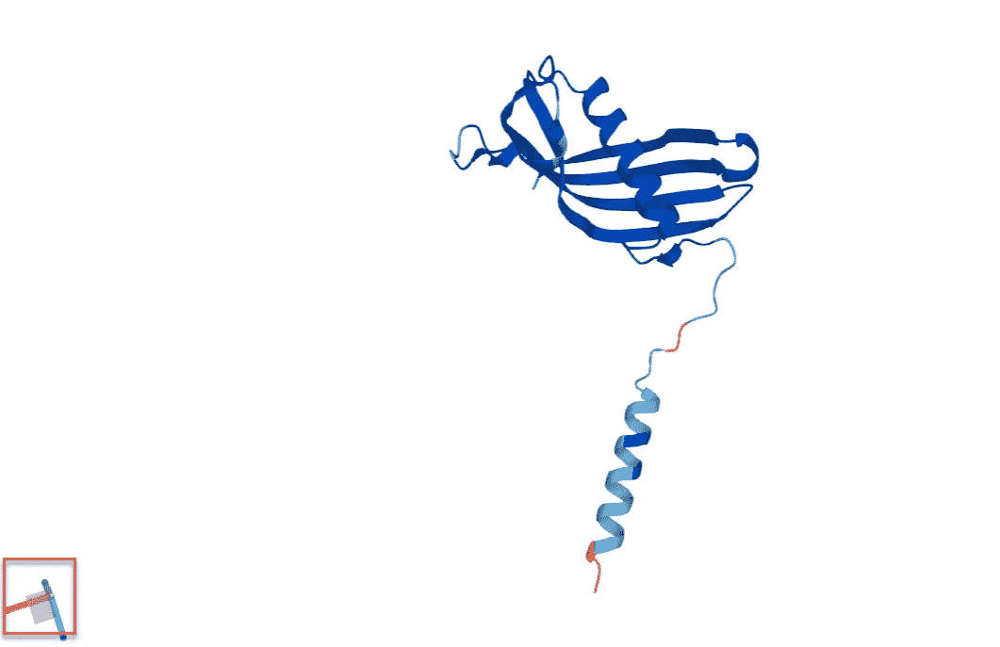
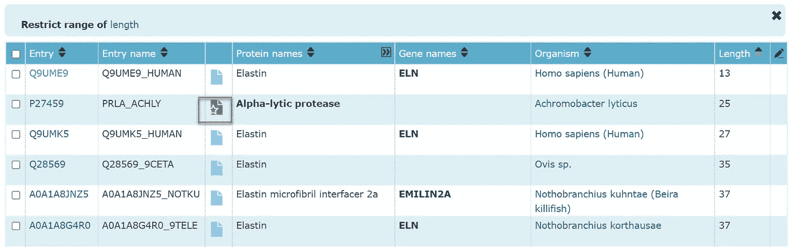

# 每个人的 AlphaFold

> 原文：<https://towardsdatascience.com/alphafold-for-everybody-c73d40d4b56d>


丹尼尔·利维斯·佩鲁西在 [Unsplash](https://unsplash.com?utm_source=medium&utm_medium=referral) 上的照片

# 每个人的 AlphaFold

## 一个新的谷歌云博客展示了如何使用 Vertex AI 来运行 DeepMind 开创性的 Alphafold 蛋白质结构预测系统

2021 年初我花了几个月的时间面试数据科学的候选人。在每次面试中，我都要求候选人说出 2020 年以来两项主要的人工智能成就。这是我一直在寻找的两个标题:

1.  [**GPT-3**](https://openai.com/blog/openai-api/)**——**由 OpenAI 于 2020 年 6 月限量公测发布

2.**[**alpha fold**](https://deepmind.com/blog/article/alphafold-a-solution-to-a-50-year-old-grand-challenge-in-biology)—由 DeepMind 于 2020 年 12 月公布[ [正式论文](https://www.nature.com/articles/s41586-021-03819-2)**

**随着时间的推移，我开始觉得问这个问题有点像一个骗局。我很乐意询问 GPT-3，因为我已经用它做了一些实验，包括[生成 git 命令](https://youtu.be/MoLfVG-8Z5A)、[在伦敦地铁导航](https://youtu.be/790PiTSqi4Y)，以及[回答电影琐事问题](https://youtu.be/ECeRjLkT01U)。然而，当谈到 Alphafold 时，我真的不知道我在说什么。我没有任何生命科学背景来帮助我理解为什么 AlphaFold 很重要，我对 AlphaFold 也没有任何实践经验。**

## **通过 Vertex AI 实际操作 AlphaFold**

**自从这些面试以来，我一直想弥补我在 AlphaFold 方面缺乏实践经验的不足，所以我很高兴地得知，我的一位同事为 Shweta Maniar 的[谷歌云博客帖子](https://cloud.google.com/blog/products/ai-machine-learning/running-alphafold-on-vertexai)做出了贡献，该帖子描述了一种使用 [Vertex AI](https://cloud.google.com/vertex-ai) 运行 AlphaFold 的简单方法。**

**在这篇文章中，我描述了我在谷歌云的顶点人工智能环境中，在笔记本电脑上建立简化版 AlphaFold 的经历。我将描述我是如何进行设置的，并提供一些资源进行进一步的探索。**

**请注意:**

*   **我是谷歌员工，但本文内容为本人观点，不代表谷歌官方立场。**
*   **我不是生命科学家，所以请原谅任何有问题的术语。**

## **呈现你的第一个三维蛋白质结构预测**

**[博客](https://cloud.google.com/blog/products/ai-machine-learning/running-alphafold-on-vertexai)清晰地解释了端到端的过程，从开始使用谷歌云到运行笔记本获得蛋白质结构预测。预算至少一个小时来设置环境并完成一次运行。一旦你遵循了博客中的说明，你将在 Vertex AI 中拥有一个笔记本，它使用 AlphaFold 的简化版本来预测与氨基酸序列对应的三维蛋白质结构。**

**开箱即用，当您运行笔记本电脑时，它会根据以下氨基酸序列进行预测:**

```
MAAHKGAEHHHKAAEHHEQAAKHHHAAAEHHEKGEHEQAAHHADTAYAHHKHAEEHAAQAAKHDAEHHAPKPH
```

**笔记本完成后，它会向您展示 AlphaFold 对与输入氨基酸序列相对应的三维蛋白质结构的预测:**

****

**AlphaFold 对笔记本中初始氨基酸序列的蛋白质结构预测**

**渲染中的颜色表明了模特的自信:**

****

## **使用“金发女孩”示例练习 AlphaFold**

**为了更好地了解该设置可以做什么，我决定看看我是否可以从笔记本中获得与成熟的 AlphaFold 提供的预测相匹配的预测。也就是说，给定一个氨基酸序列和 AlphaFold 为该序列预测的三维蛋白质结构，我会从 Vertex AI 笔记本使用的 AlphaFold 的简化版本中获得匹配的蛋白质结构吗？**

**现在，如果你的科学更多的是在“数据”方面，而不是“生活”方面，你可能想知道如何做这样的实验。好消息是网上有令人难以置信的、可获得的资源，特别是 www.uniprot.org 的[。用它自己的话说:](http://www.uniprot.org)**

***通用蛋白质资源(UniProt)是蛋白质序列和注释数据的综合资源***

**我们可以使用[www.uniprot.org](http://www.uniprot.org)找到一个氨基酸/蛋白质结构组合，我们可以用它作为我们的基线。**

**对于我们的基线，我们想要一个“金发女孩”的例子:**

*   ****不太简单** —笔记本要求输入字符串中至少有 16 个氨基酸，所以[这个例子](https://www.uniprot.org/uniprot/Q9UME9)不会起作用，因为它只有 13 个氨基酸:**

```
GACLGKACGRKRK
```

*   ****不太复杂** —我们想获得一个“眼球”感，看看我们笔记本的预测与 UniProt 中的 AlphaFold 预测有多接近。这意味着我们不想要一个如此复杂的结构，以至于非生命科学家都无法理解。例如[这只](https://www.uniprot.org/uniprot/P58215)，它的氨基酸序列中有 750 个条目，其三维结构如下，太复杂了，不能作为一个好的基线:**

****

**对于非专业人士来说太复杂了(【https://www.uniprot.org/uniprot/P58215】T4**

*   ****恰到好处** : [这个例子](https://www.uniprot.org/uniprot/P21460)有一个合理的氨基酸序列，长到可以在笔记本上工作:**

```
MASPLRSLLFLLAVLAVAWAATPKQGPRMLGAPEEADANEEGVRRALDFAVSEYNKGSND
AYHSRAIQVVRARKQLVAGVNYFLDVEMGRTTCTKSQTNLTDCPFHDQPHLMRKALCSFQ
IYSVPWKGTHSLTKFSCKNA 
```

**ProtInt 条目中的 3d 蛋白质结构的呈现非常简单，应该可以直观地将其与笔记本创建的预测进行比较:**

****

**金发女孩的例子([https://www.uniprot.org/uniprot/P21460](https://www.uniprot.org/uniprot/P21460))**

**要运行这个实验，我们所要做的就是将笔记本中 sequence_1 变量的值更新为本例的氨基酸序列。要获得该序列，在 [UniProt 条目](https://www.uniprot.org/uniprot/P21460)中，向下滚动并点击 FASTA 按钮:**

****

**该序列将出现在一个新的选项卡中:**

```
MASPLRSLLFLLAVLAVAWAATPKQGPRMLGAPEEADANEEGVRRALDFAVSEYNKGSND
AYHSRAIQVVRARKQLVAGVNYFLDVEMGRTTCTKSQTNLTDCPFHDQPHLMRKALCSFQ
IYSVPWKGTHSLTKFSCKNA
```

**只需删除换行符，您就有了需要分配给笔记本中 sequence_1 的字符串:**

```
*# Input sequences (type: str)*
sequence_1 **= "**MASPLRSLLFLLAVLAVAWAATPKQGPRMLGAPEEADANEEGVRRALDFAVSEYNKGSNDAYHSRAIQVVRARKQLVAGVNYFLDVEMGRTTCTKSQTNLTDCPFHDQPHLMRKALCSFQIYSVPWKGTHSLTKFSCKNA"
```

**使用 sequence_1 的新值重新运行笔记本，您将从 AlphaFold 的简化版本中获得蛋白质结构预测:**

****

**笔记本的蛋白质结构预测为来自[https://www.uniprot.org/uniprot/P2146](https://www.uniprot.org/uniprot/P21460)的氨基酸序列**

**将 ProtInt 的蛋白质结构与笔记本生成的结构并排比较，在非专业人士看来，它们非常相似:**

****

**蛋白质结构预测的并排比较**

## **关于使用 UniProt 的一些附加提示**

**作为一名非专业人士，我面临的一个挑战是确定 3d 效果图的方向，这样我就可以对它们进行比较。UniProt 通过包含一个小部件来帮助您，该小部件可以在您旋转三维结构时显示 x-y-z 轴的位置，如左下方突出显示的:**

****

**显示蛋白质结构渲染中 x-y-z 轴方向的小部件**

**当您旋转图像时，小部件会向您显示轴的位置。**

**如果您想在 ProtInt 中显示的蛋白质结构和笔记本中的预测之间进行更多的比较，该怎么办？ProtInt 中的许多条目不包含蛋白质结构，那么如何找到包含它们的例子呢？**

**以下是在 ProtInt 中搜索“弹性蛋白”的结果，按顺序显示了长度最短的条目。具有蛋白质结构渲染的示例在第三列中有一个金色文档，如下所示:**

****

**蛋白质搜索结果显示一个具有蛋白质结构渲染的条目**

**下面是[高亮条目](https://www.uniprot.org/uniprot/P27459)的蛋白质结构渲染图:**

****

## **结论**

**通过关注这个[谷歌云博客](https://cloud.google.com/blog/products/ai-machine-learning/running-alphafold-on-vertexai)，即使是非专业人士也可以很容易地利用 Vertex AI 笔记本来练习简化版的 AlphaFold。使用这种装置，你可以得到氨基酸序列，并预测它们的蛋白质结构。使用 [UniProt](http://www.uniprot.org) ，你可以得到更多的尝试序列的想法。由于这种设置，我们真的为每个人提供了 AlphaFold。**

**下面是本文描述的实验的视频摘要:【https://youtu.be/y90-mZGL6AQ**

## **引文**

****uni prot**:uni prot 联盟
**uni prot:2021 年通用蛋白质知识库**
[核酸研究 49:D1 (2021)](https://academic.oup.com/nar/advance-article/doi/10.1093/nar/gkaa1100/6006196)**

****AlphaFold** : *利用深度学习进行高精度蛋白质结构预测***

**约翰·跳线、理查德·伊文思、亚历山大·普里策尔、蒂姆·格林、迈克尔·菲格诺夫、凯瑟琳·图亚苏武纳库尔、奥拉夫·龙内贝格、拉斯·贝茨、奥古斯丁·伊迪克、亚历克斯·布里德格兰、克莱门斯·迈耶、西蒙·科尔、安娜·波塔彭科、安德鲁·巴拉德、安德鲁·考伊、贝尔纳迪诺·罗梅拉-帕雷德斯、斯坦尼斯拉夫·尼科洛夫、里舒布·贾恩、乔纳斯·阿德勒、特雷弗·贝克、斯蒂·彼得森、戴维·雷曼、马丁·施泰纳格、米查林娜·帕霍尔斯卡、戴维·西尔弗**

**在[2020 年 11 月 30 日—12 月 4 日](https://predictioncenter.org/casp14/doc/CASP14_Abstracts.pdf)蛋白质结构预测技术的第十四次重要评估(摘要书)**