# AlphaGo:人工智能如何掌握围棋

> 原文：<https://towardsdatascience.com/alphago-how-ai-mastered-the-game-of-go-b1355937c98d>

## 应用强化学习

## AlphaGO 背后的机器学习架构解释了

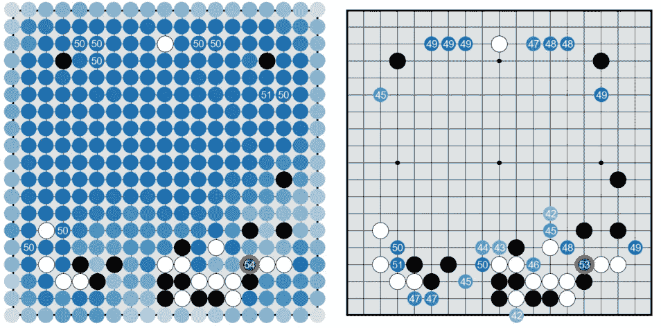

图片由 David Silver 等人提供，AlphaGo 论文[1]

2016 年，AlphaGo 击败了世界上最好的围棋选手。然后，这似乎是不可能的；现在，它作为机器学习历史上的一个关键里程碑而被铭记。

## 围棋游戏与机器学习

游戏，无论是棋盘游戏还是视频游戏，都是测试、评估和改进机器学习模型的完美平台。游戏通常有一个非常清晰的评分系统，因此提供了一个清晰有效的方法来量化和衡量进展。

在过去，其他棋盘游戏标志着科技史上的重要里程碑。当深蓝在 1997 年击败国际象棋世界冠军加里·卡斯帕罗夫时，这被视为计算世界的一项不可思议的成就。当时，许多人认为这还需要几十年，有些人认为这永远不会发生。

这个模型的成功要归功于人类的输入(由其他国际象棋大师)和原始的计算能力。它能够预见未来的许多行动，击败人类。一些人批评深蓝的方法，比如加来道雄，在他 2008 年的书《不可能的物理学》中说，这个事件是“原始计算机能力的胜利，但是这个实验没有教会我们任何关于智力的东西”。他补充道，“我过去认为国际象棋需要*思维*”。他将机器对人类的胜利归功于深蓝可以在未来计算移动位置，而不需要*创造力*或*智能*。

围棋比国际象棋复杂得多。在国际象棋中的任何给定位置，预期的合法走法是 35 步左右，在围棋中是 250 步。事实上，围棋棋盘中可能的布局比宇宙中的原子还要多。未来的计算走法不是一个可行的策略，因此要解决围棋游戏，真正的*思维*、*创造力*和*智力*是必需的。

这就是为什么在围棋比赛中击败世界上最好的人类是机器学习世界的一个如此重要的里程碑，在这篇文章中，我想讲述谷歌的 DeepMind 是如何掌握这场比赛并击败历史上一些最好的选手的。

## 围棋的规则

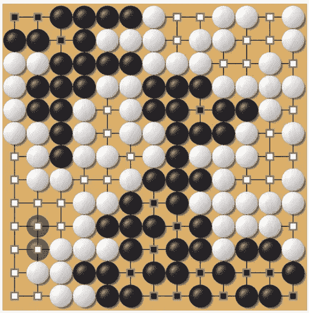

作者提供的图片(已捕捉到褪色的黑色部分)

在我进入大联盟之前，先简单介绍一下围棋。围棋很简单。每个玩家在棋盘上放置一个棋子，一次一个。目标是用你的作品包围空白的空间。你通过包围空白区域来赢得分数。如果你包围了对手的棋子，这些会被捕获(见上图左下方褪色的黑色棋子)。游戏结束时，控制最多空间的玩家获胜。在上面的最后一个位置，白棋控制了更多的空位，所以白棋获胜。

我试着玩在线围棋，结果很糟糕。好消息是，你不需要理解围棋或擅长围棋，就能理解 AlphaGo 背后的机器学习。

## 强化学习，基础

> Deep Mind 的联合创始人兼首席执行官戴密斯·哈萨比斯说:“即使你把世界上所有的计算机都拿来运行一百万年，也不足以计算出(围棋比赛中)所有可能的变化。”。

强化学习是机器学习中通过玩来学习的模型类别。这些模型的学习方式有点像人类，它们通过多次迭代来玩游戏，随着输赢不断改进。我还有一篇文章更详细地解释了强化学习是如何工作的。你可以[在这里](/reinforcement-learning-an-introduction-a8783f9ea993)查看。

简单回顾一下，强化学习的核心可以通过以下定义来理解:

**代理**是正在玩游戏的算法。

**环境**是游戏进行的平台，对于围棋来说是棋盘。

**状态**是环境中所有棋子的当前位置。

**动作**是代理在环境的给定状态下可能采取的动作。

**值**表示在给定状态或动作/状态对的情况下赢得游戏的可能性。

**策略**是代理根据下一个状态的预测值选择下一个动作的方法(根据价值函数，你总是选择你认为最好的动作吗？你应该不时地探索以学习新的东西吗？).

RL 算法的目标是学习最优值函数，这将允许它在任何给定的状态下确定将导致它赢得游戏的最高可能性的动作。

## 用深度神经网络和树搜索掌握围棋

> 大卫·西尔弗、阿贾·黄、克里斯·j·马迪森、阿瑟·古兹、洛朗·西夫尔、乔治·范登德里斯切、朱利安·施利特维泽、约安尼斯·安东诺格鲁、韦达·帕内尔·谢尔瓦姆、马克·兰托特、桑德·迪耶曼、·格雷韦、约翰·纳姆、纳尔·卡尔希布伦纳、伊利亚·苏茨基弗、蒂莫西·利利拉普、马德琳·利奇、科拉伊·卡武克库奥卢、托雷·格雷佩尔&戴密斯·哈萨比斯。*发表于 2016 年《自然》杂志。*

在这里我将介绍 AlphaGo 的架构。在阅读本节的同时，请随意参考上面的定义。

AlphaGo 由两种类型的神经网络组成，*策略*网络和*值*网络。

## 政策网络

**BLUF:** 策略网络的目标是确定给定状态下下一个动作的概率。政策网络的培训分为两个步骤。首先，通过在专业游戏数据上的监督学习(SL 策略网络)来训练策略网络。然后，该模型的权重被用作使用强化学习训练的策略网络(RL 策略网络)的初始化。

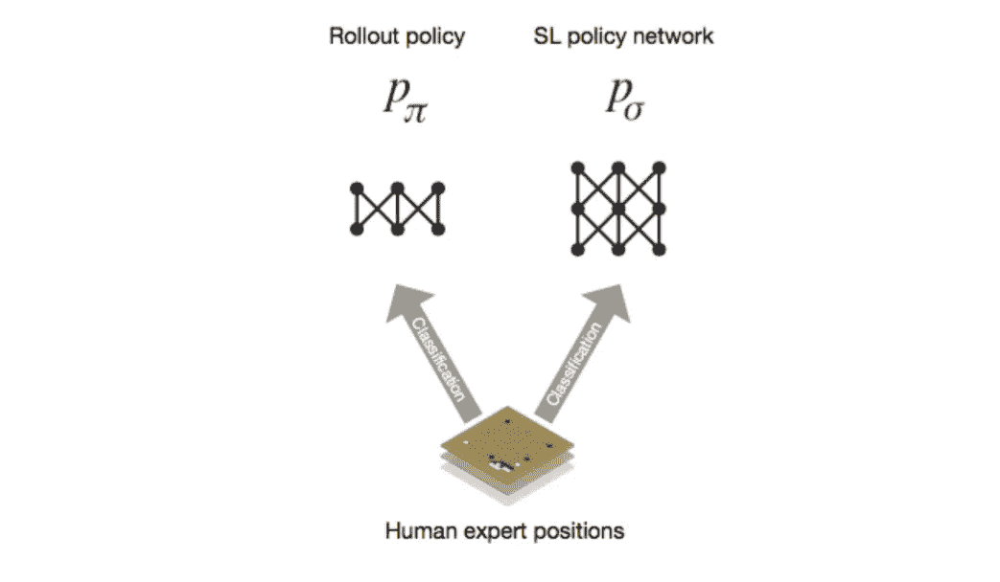

图片由 David Silver 等人提供，AlphaGo 论文[1]

**监督学习(SL)策略网络:**策略网络的输入是*状态*。如上所述，状态代表各部分的位置。板子是 19x19。为了改善输入，他们使用 48 个特征地图对其进行扩展，使输入形成 19x19x48 的形状。这些特征图帮助算法捕捉棋盘的位置，这可以通过突出棋子周围的空白空间、棋子的聚集等来实现。这种扩展有助于算法学习。

SL 策略网络是一个监督学习分类模型(到目前为止，没有强化学习)。它是使用职业玩家游戏来训练的。策略网络然后被给予任务来预测在给定状态 *p(a|s)* 之后下一个最可能的*动作*。策略网络是一个卷积神经网络(CNN)，它输出下一个动作应该是什么的一系列概率(19x19 输出)。

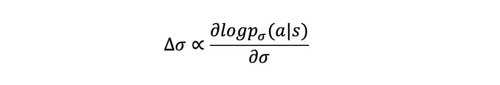

作者图片

策略网络 *(p)* 的权重 *(σ)* 可以与上面所示的项成比例地更新。这基本上是监督学习分类设置中的交叉熵损失。这里，我们正在更新权重，以便在给定状态 *(s)* 的情况下，最大化人员移动 *(a)* 的可能性。

**推广政策**是一个小得多的网络，以同样的方式训练。它是一个线性层，并且在较少的数据上进行训练。计算未来位置要快得多，因此在以后执行树搜索时会很有用。

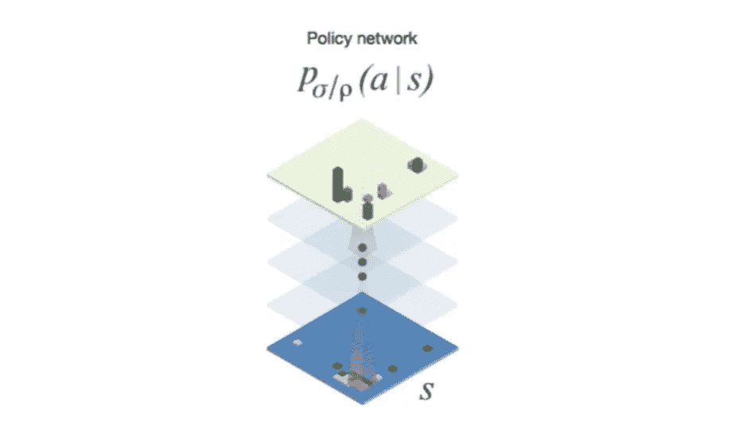

图片由 David Silver 等人提供，AlphaGo 论文[1]

RL 策略网络:到目前为止，策略网络都是监督学习模型，它们所做的只是使用职业选手的训练数据来模仿他们。这些模型仍然没有学会自己玩游戏。为此，通过强化学习来改进 SL 策略网络。

RL 策略网络用 SL 策略网络的权重初始化。然后通过自我游戏来训练它，你把这些模型放在一起，让它们互相游戏。在游戏结束时，模型采取赢的模型的行动的概率应该增加，而输的模型的行动则相反。通过让模型自己玩，我们现在正在教模型赢得游戏，而不仅仅是模仿大师。

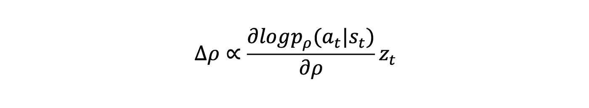

作者图片

权重的更新功能类似于 SL 策略网络的更新功能。然而这一次，我们等到游戏结束时才执行更新。 *z* 是基于游戏结果的奖励。如果代理赢了，那么 *z* 就等于+1，如果它输了就等于-1。通过这种方式，我们可以让模型更喜欢它赢的时候玩的棋，而不太可能去玩它输的时候玩的棋。

## 价值网络

**BLUF:** 价值网络预测给定状态下代理人赢得游戏的概率。有了一个完美的价值网络，你可以通过选择导致最高价值状态的行动来确定每个位置的最佳移动。实际上，作者使用树搜索方法来确定下一个最佳行动，仍然使用这个近似值函数。

为了训练价值网络，3000 万个游戏由自我游戏产生(让 SL 策略网络自我游戏)。然后，价值网络被训练为来自这些游戏中的每一个的随机状态的回归，以确定该位置是赢还是输。这又是一个监督学习任务，尽管这次是一个回归任务。

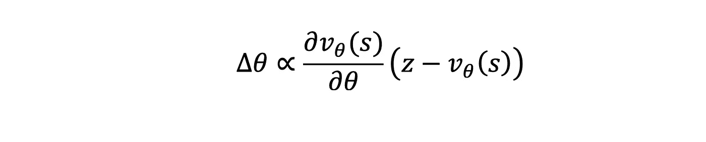

作者图片

价值函数的梯度更新如上所示。右侧的比例项是结果 *z* 和值函数 *v(s)* 的输出的函数。如果当给定一个状态时，价值函数正确地预测代理将获胜，则比例项保持为正。然而，如果价值函数预测代理将失败，但最终获胜，则比例项为负，我们以相反的方向更新梯度。这个比例项的大小随着价值函数对赢得游戏的可能性的预测的错误程度而增加。这基本上是监督回归任务中的 L2 损失。

## 树形搜索

为了确定下一个最佳移动，执行树搜索。

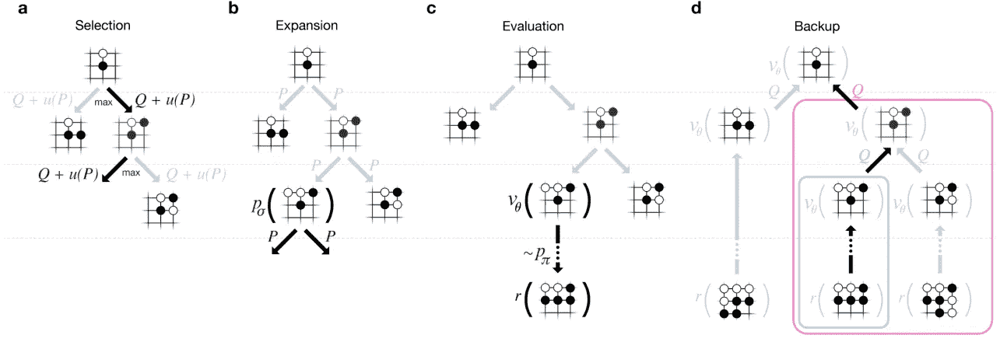

图片由 David Silver 等人提供，AlphaGo 论文[1]

树搜索从给定状态 *s* 开始。基于 *Q* 和 *u(P)选择一个动作。*

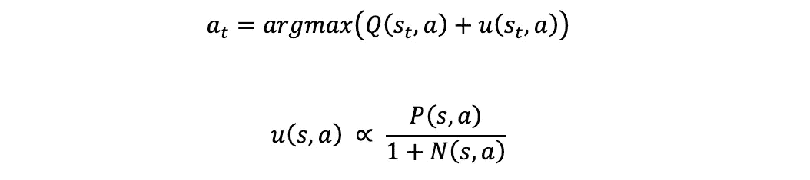

作者图片

*Q* 是*动作值函数*，决定一个动作而不是一个状态的值。

*u(s|a)* 是树搜索算法的输出，其中输出与先验成比例(上面等式中的分子，先验取自 SL 策略网络)。 *u(s|a)* 也与给定一个动作下对树上叶子的访问次数 *(N(s，a))* 成反比。在开始时，该算法探索新的移动，并且不太信任 *Q* 值函数(取 argmax 的 *u* 部分，因为 *N(s，a)* 会很小)，但是在搜索算法多次收敛于同一叶子之后，它开始更多地依赖于 *Q，*允许它更深入地探索已经被经常访问的有希望的分支。

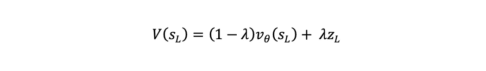

作者图片

为了计算 *Q* (动作值函数)，他们首先使用 *V* 评估每片叶子，这是结果状态的值函数 *(v)* 、和展示结果 *(z)* 之间的加权平均值。展示结果是应用展示策略网络并从叶状态开始进行游戏时游戏的结果(赢或输)。因为首次展示策略网络很小，所以评估很快，因此它可以用作树搜索的一部分，以便对每个叶子多次执行整个游戏，并在选择最终动作时考虑这些结果。最后，要从叶子评价 *V* 得到 *Q* ，你只需将 V 除以那个边的访问次数。

## 结果和进一步研究

AlphaGo 模型实际上是一系列模型，每一个新的迭代都比前一个有所改进。发表了两篇论文，第一篇是 2016 年的《用深度神经网络和树搜索掌握围棋博弈》(我经历过的那篇)，第二篇是 2017 年的《掌握没有人类知识的围棋博弈》。第二篇论文介绍了 AlphaGo Zero，它没有使用先验知识(没有专业棋手训练数据)，只是简单地依赖于 RL 策略网络、价值网络和树搜索。该模型完全基于强化学习，并推广到其他棋盘游戏，如国际象棋，它能够击败国际象棋中最好的引擎 stockfish。

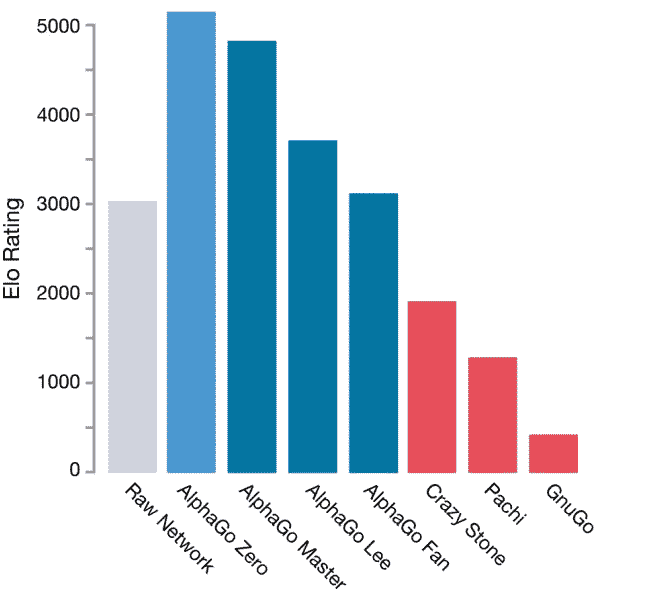

David Silver 等人的 AlphaGo Zero Paper [2]

AlphaGo Lee 是 2016 年以 4 比 1 击败 Lee Sedol 的模型，是围棋历史上最强的选手之一。AlphaGo Master 随后以 60 比 0 的比分击败了一系列世界象棋冠军。最后，AlphaGo Zero 是一个更好的迭代，没有使用专业的训练数据(见上面的 Elo 评级)。

## 结论

在这篇文章中，我描述了 AlphaGo 的架构，这是一个击败了有史以来一些顶级围棋选手的机器学习模型。我首先经历了强化学习的一些基础，然后我分解了模型的架构。

现在你可能会奇怪，为什么要花这么大的力气去解决一个棋盘游戏呢？毕竟，这对任何人都没有帮助。研究是为了从整体上加深我们的知识，而像围棋这样的游戏可以让我们非常容易地量化进展。我们在这些棋盘游戏上取得的进展可以用来解决更大的挑战。DeepMind 致力于节省能源、识别疾病和加速全球科学发展的模型。这种研究至关重要，因为它加深了我们对人工智能的知识和理解，在未来，它很可能成为许多改变生活的技术的催化剂。

## 支持我

希望这对你有所帮助，如果你喜欢，可以 [**跟我来！**](https://medium.com/@diegounzuetaruedas)

您也可以使用我的推荐链接成为 [**中级会员**](https://diegounzuetaruedas.medium.com/membership) ，并访问我的所有文章及更多:[https://diegounzuetaruedas.medium.com/membership](https://diegounzuetaruedas.medium.com/membership)

## 你可能喜欢的其他文章

 [## 强化学习:导论

### 强化学习的基础介绍，所有你需要知道的开始

towardsdatascience.com](/reinforcement-learning-an-introduction-a8783f9ea993)  [## 用人工智能产生艺术

### 一个支持语音的艺术生成工具

towardsdatascience.com](/using-ai-to-generate-art-22e030497f73) 

## 参考

[1]大卫·西尔弗、阿雅·黄、克里斯·j·马迪森、阿瑟·盖兹、劳伦特·西弗、乔治·范·登·德里斯切、朱利安·施利特维泽、约安尼斯·安东诺格鲁、韦达·潘妮尔·谢尔瓦姆、马克·兰托特、桑德·迪耶曼、张秀坤·格雷韦、约翰·纳姆、纳尔·卡尔施布伦纳、伊利亚·苏茨基弗、蒂莫西·利利拉普、马德琳·利奇、科雷·卡武克库奥卢、托雷·格雷佩尔和戴密斯·哈萨比斯，《用深度神经网络和树搜索掌握围棋博弈》，自然，2016 年。可用:[https://www.nature.com/articles/nature16961](https://www.nature.com/articles/nature16961)

[2] David Silver、Julian Schrittwieser、、Ioannis Antonoglou、Aja Huang、Arthur Guez、Thomas Hubert、Lucas Baker、Matthew Lai、Adrian Bolton、Yutian Chen、Timothy Lillicrap、Fan Hui、Laurent Sifre、George van den Driessche、Graepel & amp；amp；amp；amp；amp；amp；amp；amp；amp；amp；amp；amp；可用:[https://www.nature.com/articles/nature24270](https://www.nature.com/articles/nature24270)