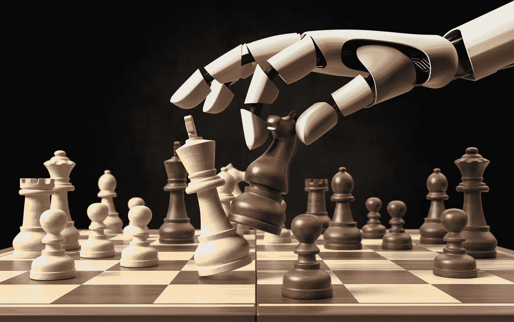
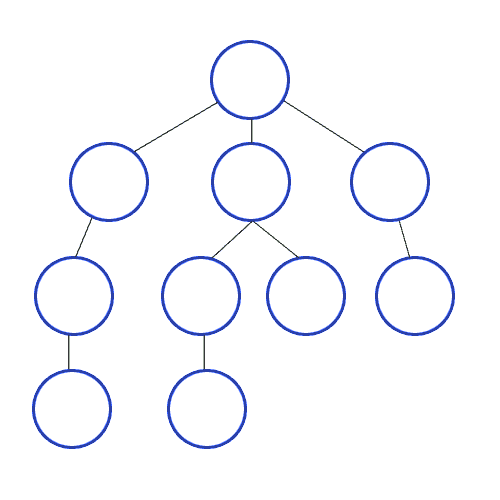
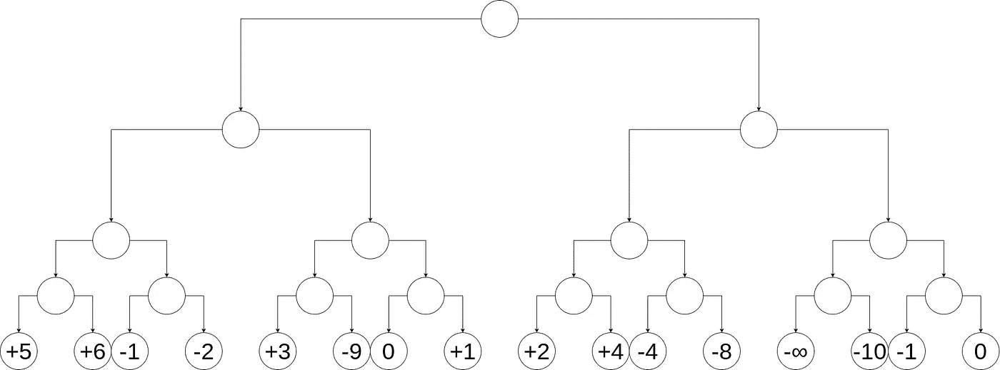
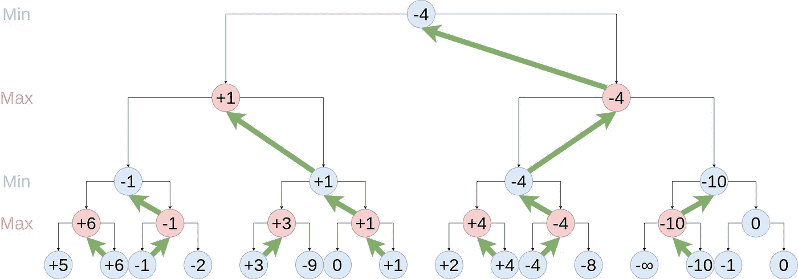
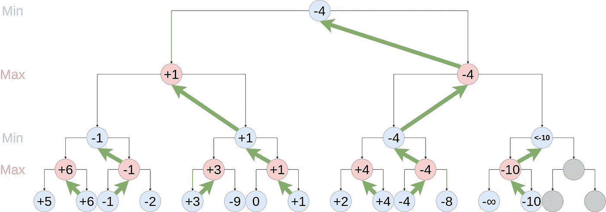
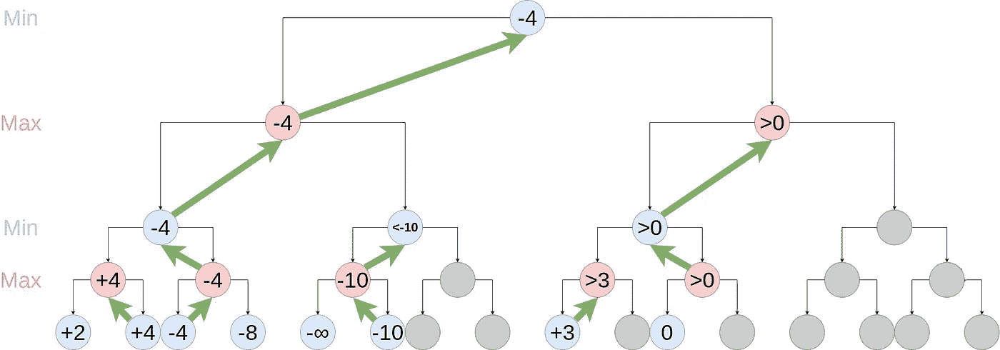
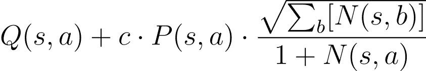
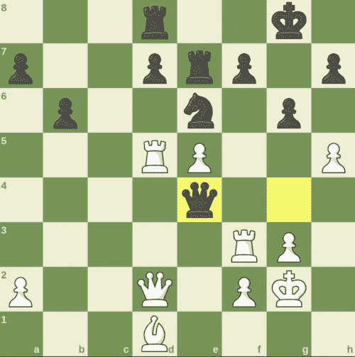
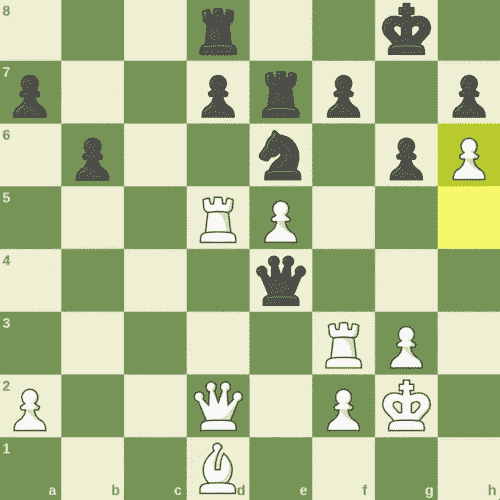
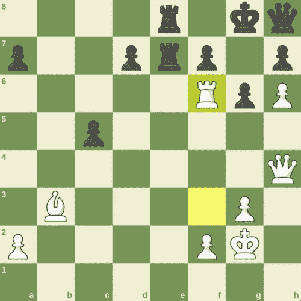

# AlphaZero 国际象棋:它是如何工作的，是什么让它与众不同，它能告诉我们什么

> 原文：<https://towardsdatascience.com/alphazero-chess-how-it-works-what-sets-it-apart-and-what-it-can-tell-us-4ab3d2d08867>

## 深入探讨 21 世纪计算机象棋中最具革命性的现象

由福托梅克。来源:Istockphoto

# 介绍

对于那些对国际象棋感兴趣的人，或者那些一直在关注人工智能最新发展的人来说，“AlphaZero”这个名字会立刻被认出来；它战胜了当时世界领先的国际象棋引擎 Stockfish，彻底改变了计算机和人类下棋的方式。

然而，如果你不是国际象棋爱好者，或者错过了几年前的新闻，你可能会想知道 AlphaZero 到底是什么，是什么让它值得写一整篇博文。为了你，我会解释的。

简而言之，AlphaZero 是一个游戏程序，通过自我游戏和神经网络强化学习的结合(稍后会有更多介绍)，它能够学习玩国际象棋等游戏，并从头开始──也就是说，在只被灌输了这些游戏的规则之后。事实上，AlphaZero 的一个较新的衍生产品叫做 [MuZero](https://arxiv.org/abs/1911.08265) ，它不仅限于国际象棋等棋盘游戏，还可以学习玩雅达利系列的一系列简单视频游戏。AlphaZero 和 MuZero 都是由谷歌母公司 Alphabet Inc .的子公司 DeepMind 设计的。

雅达利经典吃豆人是穆泽罗学会玩的游戏之一。来源:截图，中途游戏。

好的，所以我们手上有一个被称为[普通游戏玩](http://www.ggp.org/docs/BeginnersGuide.html) (GGP)人工智能的东西。我们以前见过这些；例如，斯坦福大学已经举办了十多年的[年度 GGP 竞赛](http://ggp.stanford.edu/)，像 2016 年的[伍德斯托克](http://www.cril.univ-artois.fr/woodstock/)这样的参赛作品表现尤为出色。那么是什么让 AlphaZero 如此特别呢？它非常擅长它所做的。事实上，它好到连 AlphaZero 负责学习的游戏专业人员，甚至是专门为玩其中一种游戏而开发的最先进的专用计算机程序，都比不上它的表现。是百事通，全*全*的高手。作为对 AlphaZero 的 GGP 能力的一个案例研究，我将专注于国际象棋，我自己也是一名狂热的国际象棋选手。

这篇博文背后的前提是，作为一名[大师级棋手](https://www.chess.com/member/maxkho2)，我准备从基于象棋的角度提供一些人工智能领域的外部见解。为此，我将首先详细介绍传统引擎和 AlphaZero 的工作方式，然后解释这两种引擎的播放风格可以告诉我们什么，并探索这对更广泛的人工智能领域的影响。

**在国际象棋方面，截至 2022 年，较新的引擎被普遍认为已经超越了 AlphaZero 的打法实力；然而，在当时，它的性能是前所未有的，尽管围绕 AlphaZero 运行的改进硬件存在一些争议。*

# **传统发动机**

自从 20 世纪 70 年代计算机国际象棋领域出现以来，直到 AlphaZero 的诞生，几乎所有国际象棋引擎的基本架构都几乎相同。

在每一步棋中，对博弈树进行深度优先搜索(DFS ),直到指定的深度:也就是说，计算从当前位置开始的选定数量的每一步棋的合法序列。由于没有遗漏合法的移动，这类搜索算法被称为*强力搜索*。

一个在短游戏树上表演的 DFS 动画。来源:维基共享资源。

然后，树的终端节点(或每个计算序列中的最后一步棋)被分配一个数值，粗略地说，该数值表示该节点的位置对白棋(拿白棋的玩家)有多有利；这个值被称为*静态* *评估*。它是使用由一群强大的国际象棋选手制定的许多启发法计算出来的，旨在代表人类在评估任何给定位置时考虑的因素。这些试探法包括明显的指标，如材料计数(双方棋子的原始总值)和棋子方格表读数(棋子方格表详细说明了棋子有多好，一般来说，每个棋子在 64 个方格中的每一个上)，但也包括更微妙的考虑，如国王安全和棋子结构。截至 2022 年领先的国际象棋引擎 Stockfish 14*使用的试探法的完整列表，可以在这里找到。

微型博弈树终端节点的静态评估。来源:作者。

因此，称为最小最大算法的东西从终端节点一直运行到博弈树的根，其代表当前位置:对于每个先前没有被评估的节点，如果轮到白棋在该节点移动，则评估被计算为该节点的子节点的评估集的最大值(或对该节点所代表的移动的回复);并且如果轮到黑棋在该节点移动，则它被计算为该集合的最小*。这确保了评估过程需要双方在启发式估计中的最佳发挥，并输出对当前位置的粗略评估。*

**

*极大极小算法在先前图像的博弈树上运行。在这种情况下，由于引擎显示为黑色，因此该评估在引擎转动时被最小化。对该职位的评估是-4。来源:作者。*

*最后，应用称为α-β修剪的修剪算法。该算法工作如下:两个值α和β存储在每个节点上，它们分别代表任何祖先节点的白色和黑色的最差可能评估。直观地说，这些值代表阈值，超过该阈值，由于比一些先前评估的移动更差，节点不能对祖先之一有任何影响。因此，由于白棋考虑让黑棋走与白棋已经计算好的棋步一样多或更多的棋步是没有价值的，反之亦然，阿尔法大于或等于贝塔的节点被跳过，或者*被修剪*。这个聪明的技巧节省了大量的计算能力，而不影响准确性。*

**

*阿尔法贝塔剪枝算法适用于游戏树从早期。来源:作者。*

*注意，在上图中，31 个节点中只有 3 个被修剪。这是因为很多次优的走法，比如黑棋的第一步棋(+1)，是在最优走法之前评估的，比如黑棋的第一步棋(-4)。如果我们改变评估移动的顺序，以便更频繁地首先评估更有希望的移动，我们可以大大增加修剪的节点数量:*

**

*来源:作者。*

*因此，传统引擎的最后一个核心组件是另一组试探法，它决定了计算移动的顺序。这一类的一个常见的启发是捕捉的优先级，例如，因为捕捉是将对手的棋子从棋盘上拿走从而削弱他们力量的唯一直接方式。*

*可以对这个简单的模型进行大量的添加和改进，例如各种附加的修剪算法、开放书、残局表库等等。然而，这是计算机第一次击败业余选手，最佳最多产的大师和大师，并最终在 1997 年著名的[深蓝 vs 卡斯帕罗夫比赛](https://en.chessbase.com/post/25-years-ago-deep-blue-beats-kasparov)中一劳永逸地取代人类成为最佳下棋实体的中坚力量。经过一些修改，它继续被用于当今最强大的国际象棋引擎。*

*结合本节中描述的所有内容，我们可以为传统引擎的外观生成一些 Python 代码。请注意代码如何将所有概述的步骤合并到一个简化的流程中:*

*   **Stockfish 14 以一种叫做 NNUE 的方法，将一个简单的神经网络整合到其静态评估函数中，从而偏离了传统架构；然而，试探法仍然被用于向神经网络提供由一组位置和它们各自的试探法评估组成的训练数据。**

# *阿尔法零*

*因此，在最后一节中，我们看到了国际象棋引擎在本质上几十年来几乎是一样的，只是在很大程度上有所改进，尽管这些改进很重要，但不是种类。这一切都在 2018 年发生了变化，当时 DeepMind 公布了 AlphaZero 的内部工作原理，此前 alpha zero 在对抗当时最强的引擎时表现出色，震惊了国际象棋界。2018 年论文发表后不久，一个名为 [LeelaChessZero](https://lczero.org/) 的开源 AlphaZero 克隆项目启动，该引擎迅速上升到计算机象棋的巅峰[，成为 2019 年全球最强引擎](https://chess24.com/en/watch/live-tournaments/tcec-season-15-superfinal-2019)。*

*那么与传统引擎相比，AlphaZero 和 LeelaChessZero 到底有什么不同呢？让我们深入探究一下 [AlphaZero 的大脑](https://arxiv.org/abs/1712.01815)来寻找答案。*

*首先，卷积神经网络(在视觉分类任务中表现特别好的一类神经网络)被初始化，以返回两个随机生成的输出:v(s)，它稍后将估计玩家从位置 s 开始的获胜概率，以及 **p(s)** ，它稍后将估计从位置 s 开始的每个合法移动的前景如何。该网络随后将被训练以接收位置 s 并从中预测 v(s)和 **p(s)** 。称这个初始化的神经网络为 *nnet0* 。*

*虽然 nnet0 并不出色，但我们仍然可以使用它来构建一个游戏代理，目的是使用来自该代理所玩游戏的数据来训练另一个神经网络 *nnet1* ，并使用该网络来构建一个更好的游戏代理。最终的策略是重复这个过程足够多次，使我们最终的神经网络收集到足够的数据，使我们最终的游戏代理高度胜任。*

*AlphaZero 使用的游戏代理设计是基于一种版本的[蒙特卡罗树搜索](https://web.archive.org/web/20180623055344/http://mcts.ai/about/index.html)，它不像 DFS 那样尽可能深入地探索每个可能的分支，而是探索少量分支，直到游戏结束。MCTS 背后的基本前提是，它不需要探索像 DFS 一样多的分支，额外的计算能力可以被重定向到其他地方。*

*在 AlphaZero 的案例中，它使用的 MCTS 的确切版本如下:*

*   *在每一步*的*中，都会运行大量的*模拟*。把模拟想象成一个迷你游戏，代理人和自己对弈，看哪一步会产生最有利的结果。*
*   *每个模拟都需要执行以下算法，直到遇到任何先前模拟都没有访问过的第一个位置:*
*   *在当前位置的所有合法移动中，选择*最有效的一个*。最有成效的一步棋被评估为在*探索*和*利用*之间达到完美平衡的一步棋:也就是说，一步棋有足够好的记录值得探索(利用)，但另一方面还没有被探索太多以产生有用的信息(探索)。更严格地说，最有成效的行动 *a* 是最大化以下表达式的行动，称为*置信上限*:*

**

**Q(s，a)* 是移动 *a* 在所有探索它的模拟中的平均评价(稍后有更多细节),并表示开发分数，或估计移动 *a* 的客观良好程度。 *c* 是一个超参数常数，代表勘探相对于开采的优先程度。 *P(s，a)* 表示一步 *a* 有多有希望，或者值得探索的程度(同样，稍后会有更多细节)。最后， *N(s，a)* 是从位置 *s* 开始移动 *a* 的次数。注意，随着 *N(s，a)* 变大，等式中的最后一项变小，因此已经被访问太多次的移动将减少该项的值；因此，人们可以认为它代表了探索分数。*

*   *玩选定的移动并再次运行算法，直到游戏结束，在这种情况下，如果玩家赢得游戏，模拟的移动 *a* 的评估被记录为 1，如果玩家没有赢得游戏，则被记录为-1，并且剥削分数 *Q(s，a)* 被重新计算，或者，如上所述，遇到任何先前模拟都没有访问过的位置 *r* 。在这种情况下，将用于模拟的 *r* 的评估记录为*v(r)*，并将 *P(r)* 设置为****P(r)***──这就是我们的 *P(s，a)* 的来源，因为我们仅在当前位置被访问过的情况下运行该算法，所以 *P(s)* 将已经被访问过**
*   **一旦预先选定的模拟次数( [AlphaZero 使用 1600](https://jonathan-laurent.github.io/AlphaZero.jl/dev/reference/params/#:~:text=AlphaGo%20Zero%20Parameters,Go%20lasts%20about%20200%20turns.) )已经完成，我们现在就有了一个分布，称为*策略*，表示位置 *s* 的每个合法移动已经被访问了多少次。回想一下，在每个模拟中只有最有希望的移动被访问，所以策略是代理认为每个移动有多有希望的直接反映。因此，我们可以用它来选择我们在游戏中的下一步。**

**唷，那可真够难的。好吧，幸运的是，从现在开始，事情会变得简单一点。不过，在我开始之前，让我们为上述版本的游戏代理编写一些 Python 代码:**

**现在我们已经建立了我们的游戏代理，我们希望让它自己玩很多次(AlphaZero 使用 25，000 次)，这样我们就可以使用游戏中的数据，并将其输入到我们新的神经网络中。很简单，对吧？没那么快。如果我们总是玩最有希望的棋，代理人会一遍又一遍地重复玩同一个游戏或非常相似的游戏，这不会给我们提供多少数据。因此，一个更好的解决方案是随机选择由政策向量加权的合法举措──这些举措越有希望，就越有可能被采用。**

**好吧，但是新的神经网络需要什么数据呢？好吧，回想一下，神经网络的目的是输出一个给定位置的获胜概率，以及每个合法移动有多大希望的分布。前者可以根据自我博弈的结果进行训练，后者可以根据政策向量进行训练，政策向量应该能够准确地反映出这些举措的前景。因此，每场游戏中的每一步棋都会产生一个训练示例，其中包含作为输入的棋步之前的位置和游戏的最终结果以及作为输出的棋步策略。**

**注意，我们的第一个神经网络将具有完全随机的输出，而我们的第二个神经网络将输出完全随机的策略估计器，因为它已经被训练了随机策略。然而，从我们的第三个神经网络开始，所有的输出应该是有意义的，并且应该随着每一代的更新而变得更加精确。**

**但是如果他们没有呢？为了防止这种情况，我们启动了训练过程中最令人兴奋的部分──让旧的神经网络和新的神经网络相互对抗！我们让他们玩一定数量的游戏(AlphaZero 使用 400)，如果新网络的胜率高于预先选择的阈值(AlphaZero 使用 55%)，我们就使用新网络来构建我们新的玩游戏代理，并继续训练过程；否则，我们使用旧网络。**

**我们将整个过程重复设定的次数(AlphaZero 使用 200)，瞧！这里我们有一台前所未见的革命性的象棋机器。我的意思是，你仍然需要令人难以置信的硬件和数小时的培训时间来启动，但不幸的是，我不能帮助你。**

# **含义**

**好了，现在我们知道了 AlphaZero 出现之前的情况，以及 AlphaZero 是如何改变它的。至少在理论上是这样。那么实际上呢？在我深入研究一些具体的例子之前，让我们先想想我们可能会期望什么。**

**我们现在知道，AlphaZero 选择棋步的核心是基于哪一步棋产生最高的估计最终获胜概率，这与传统引擎相反，传统引擎选择的棋步是一个最有利的位置，一个固定的量。因此，我们可能会看到，与传统引擎不同，AlphaZero 更喜欢不会产生最有利的短期头寸，但会增加游戏结束时获胜概率的举动。**

**此外，我们知道传统引擎的评估功能是基于相当简单的试探法，而 AlphaZero 的评估功能是高度复杂的神经网络在数百万场游戏中积累的经验的产物。因此，有人可能会怀疑 AlphaZero 更有可能识别抽象概念，比如那些由 [moremovers](https://en.wikipedia.org/wiki/Grotesque_(chess)#Moremover) 的解所包含的概念。**

**最后，可以说我们可以做出的最直接(也可以说是最令人兴奋)的预测是，由于 AlphaZero 不利用任何人类知识，不像传统引擎(不仅使用人类构建的试探法，还使用开卷机，有时还使用残局桌面)，我们可以期待它提出人类以前不知道的全新想法。人们可能会对游戏的开场阶段抱有特别高的期望，这几乎完全被依赖于人写的开场书的传统引擎所绕过。**

**那么这些预测是如何累积起来的呢？我将用 AlphaZero 玩的一个真实游戏中的例子来演示性地回答这个问题。**

****

**在 AlphaZero 和 Stockfish 8 之间移动 41 步。来源:作者。**

**在这个位置，从表面上看，白方的 h 卒给黑方的 g 卒施加压力，破坏了黑方国王周围的防御。然而，AlphaZero 决定将它的 h 兵推进一格，放弃了对黑方防御的压力，也扼杀了白方进攻的希望。**

****

**位置在 42 之后。h6。来源:作者。**

**为什么会这样？它的意图在 8 步后暴露了:通过一系列的动作，它几乎迫使黑方皇后一路退回到 h8，之后它巧妙地用一辆车关闭了航路，从而将它锁在了游戏之外。**

****

**位置在 49 之后。Rf6。来源:作者。**

**突然之间，h 兵推动背后的原因似乎很清楚:黑皇后很想去 g7，然后去 f8，但 h 兵阻止它这样做。**

**Stockfish 8 是一个传统的引擎，也是当时世界上最强的引擎，它低估了这个想法:从远处看，它认为这个位置是有利的，因为黑棋有更多更好的棋子。另一方面，AlphaZero 能够看得更远，明白在游戏的剩余时间里黑皇后就像不存在一样。**

**在一个人的国王面前把侧翼兵一直推到棋盘上是一个从未被大师们认真对待过的想法；然而，自从 AlphaZero 展示了概念验证之后，这个想法就经常出现在人类的最高层，尤其是被五次世界冠军芒努斯·卡尔森所利用。**

**虽然这只是一个例子，但 AlphaZero 在与 Stockfish 8 的比赛中始终表现出卓越的长期理解，并引入了许多顶级大师迄今为止从未使用过的想法。**

**至于抽象概念，结果是好坏参半。一方面，如上所述的策略清楚地表明了比以前看到的更高水平的抽象理解:例如，在上面的场景中，如果不认识到棋子被永久锁定在游戏之外的抽象概念，就不可能正确地评估位置。另一方面，AlphaZero 和它的克隆体 LeelaChessZero 仍然在与已经被人类解决的谜题作斗争，并且有一些位置对于即使是弱小的人类玩家来说也是微不足道的，他们都错误地评估了这些位置。**

**那么，从这项以国际象棋为中心的研究中，我们能从总体上对人工智能得出什么结论？我们已经看到，通过使用神经网络，可以训练机器掌握过去只属于人类的概念，例如非常长期的规划。我们还看到，基于神经网络的架构比竞争对手的架构更好，而人类也比它们更好:在我们的情况下，这是创造力和长期思维。由此，我们可以假设神经网络可能会在人类仍然比机器有一些优势的领域开辟新天地，即使机器在所述领域总体上比人更有能力。因此，也许像国际象棋这样更多由机器主导的领域应该被神经网络重新审视。然而，尽管如此，我们也看到，尽管神经网络令人印象深刻，但在一些更普遍的智能方面，如抽象思维方面，它们仍然与人类相去甚远。**

**因此，我的结论将是:人工智能显然正以令人难以置信的速度前进；然而，在它充分发挥潜力之前，我们还有很长的路要走。**