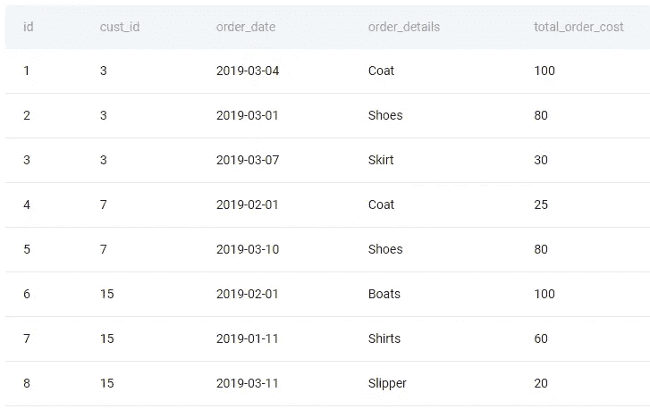
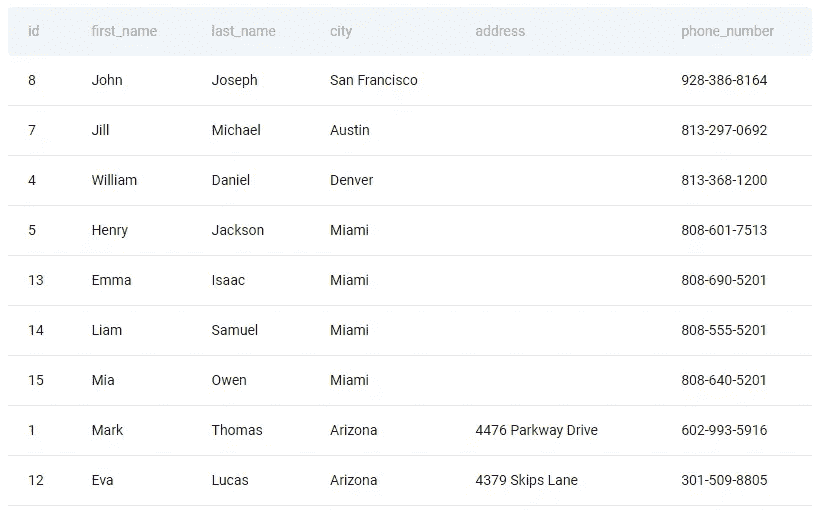
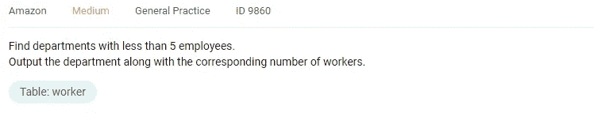
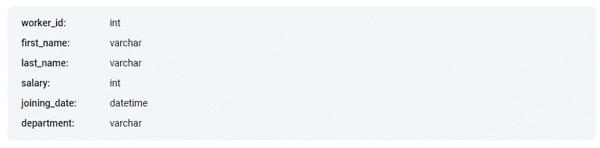
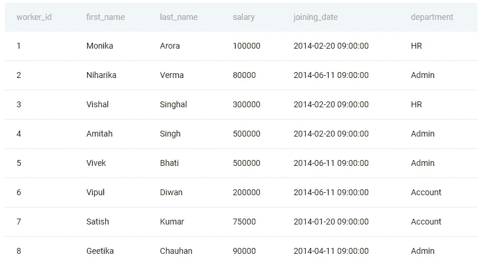
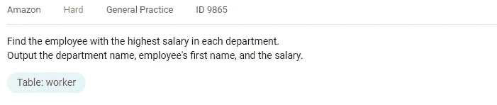
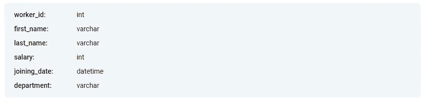
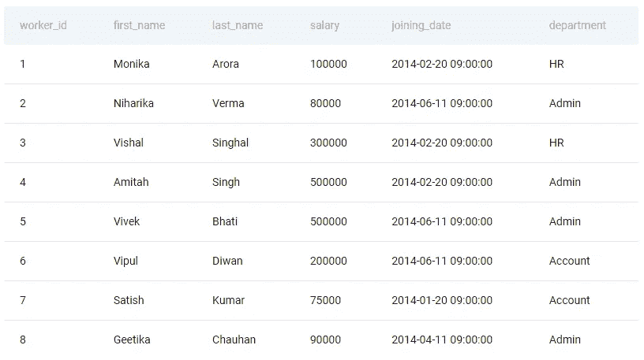

# 亚马逊业务分析师面试问题

> 原文：<https://towardsdatascience.com/amazon-business-analyst-interview-questions-bcb57f7768c3>

## *提高你编写 SQL 查询的技能，最大化你在亚马逊获得业务分析师工作的机会*


作者在 [Canva](https://canva.com/) 上创建的图片

亚马逊每天运送超过一百万个包裹。即使是物流和商业运作效率的微小提高也能节省数百万美元。业务分析师可以分析硬数据，获得洞察力，并将他们的发现传达给公司的决策者。

在本文中，我们将讨论业务分析师如何融入亚马逊的组织结构。了解他们未来的责任可以帮助有抱负的商业分析师获得工作，并推进他们在亚马逊的[职业生涯。](https://www.stratascratch.com/blog/amazon-data-scientist-position-guide/?utm_source=blog&utm_medium=click&utm_campaign=tds)

# 亚马逊业务分析师的职责

亚马逊的业务分析师利用数据来获得关于业务运营、物流、客户行为和习惯的见解，并利用它们来增加利润。有两种方法可以做到这一点:削减不必要的成本，增加收入。

和今天的其他科技企业一样，亚马逊收集了大量的用户数据。商业分析师通过寻找增加用户支出的方法来增加收入。另一方面，查看数据是发现和消除组织内低效率的最安全的方法之一。

这个角色的面试反映了商业分析师在亚马逊的职责。候选人必须表现出很强的商业知识和处理数据的能力。编写 SQL 查询是业务分析师的日常任务之一。

潜在的业务分析师必须回答从业务案例到实际 SQL 挑战的各种问题。SQL 问题通常涉及业务流程，消除低效并增加收入。

分析数据只是业务分析师工作的一部分。他们的主要职责之一是与公司的决策者交流见解。

# 亚马逊的面试官在寻找什么？

业务分析师在 SQL 方面做了很多工作，所以面试官希望他们对这种语言非常精通。与其他数据科学专业不同，业务分析师通常只需要 Python 的基础知识。这也有助于很好地理解 Excel。

专注于任务和检测数据模式的能力也能帮助你在工作中取得成功。这样的技能是很难衡量的，所以面试官通常会在回答问题的过程中观察应聘者。

有抱负的商业分析师也需要展现出深厚的商业知识。分析和汇总数据的能力很重要，但如果不能在业务环境中获得洞察力并做出正确的结论，这还不够。为了在这些面试中理解非技术性问题，请阅读一篇关于[业务分析师面试问题](https://www.stratascratch.com/blog/business-analyst-interview-questions/?utm_source=blog&utm_medium=click&utm_campaign=tds)的一般性文章。

亚马逊的文化专注于改善客户体验，让他们的网站成为网上购物最便捷的选择。同样关注改善客户体验可以帮助你在亚马逊找到一份工作。

# 解决亚马逊业务分析师面试问题的框架

**1。理解问题**

应对 SQL 挑战的最佳方式是仔细阅读描述。尤其是问题有很多概念和条件的情况下。新问题一开始可能会令人困惑。多读几遍，以保持正确的方向。

有些问题是明确而具体的。其他的则很宽泛，可以有不同的解释。当问题在任何方面都不清楚时，最好直接要求面试官具体说明。

问题通常会引入“唯一用户”之类的概念或“计算每月销售额差异”之类的操作。有些问题对这些概念和任务有具体的定义，而有些则没有。

通常，任务描述还会指定在返回数据之前如何安排数据，如何格式化输出，或者类似的事情。

**2。分析数据**

查看可用数据是解决 SQL 问题的第二重要步骤。如果幸运的话，可用数据将包含在一个表中，但情况并非总是如此。

有些问题有多个表，每个表可以有十几列。开发一种系统的方法来轻松理解可用的数据是很重要的。

第一步是查看问题描述中提到的值，并确定哪些表和列包含这些值。

查看每一列的数据类型会有所帮助。它可以帮助您决定是否需要对值进行转换或格式化。日期值经常是这种情况，它需要格式化或转换成文本值。

此外，数据中每个值的唯一性和限制也很重要。所以看实际数据是值得的。

**3。规划你的方法**

一旦你理解了问题和可用的数据，就该为找到解决方案制定合理的步骤了。

写下你的计划可以帮助你专注于解决挑战。你可以从最直接的方法开始，最终你可能会对最初的想法有所改进。在编写查询时，写下的逻辑步骤很容易遵循。

养成计划你的方法的习惯是非常有益的。这是一个在面试中展示你想法的机会。想出多种方法来处理一个问题可以证明你的 SQL 技能和作为数据科学家的总体敏锐度。

这些步骤应该描述从初始数据到最终答案你将执行什么操作(赋值、乘法、除法、格式化)。

您不必为每个步骤编写特定的代码，但是您可以编写伪代码，或者在编写实际代码时引用您将使用的 SQL 特性。

**4。编写代码**

将您的逻辑大纲转换成有效的 SQL 查询。从最基本的查询开始，逐渐增加复杂性。

例如，如果需要筛选某一列中的值，首先选择该列中的所有值。逐步添加过滤、格式化规则、聚合等条件。

添加这些复杂要素时，请检查查询的输出。这样，您将知道什么在起作用，以及额外的代码是否有预期的效果。您还可以检测代码中的问题，并轻松地修复它们。

# 亚马逊商业分析师面试问题#1:
找出没有订单的客户数量


作者在 [Canva](https://canva.com/) 上创建的图像

业务分析师的日常任务之一是了解客户行为。在这个角色中，您可能需要分析没有下订单的用户的行为。也许你需要理解他们为什么不下订单。或者亚马逊员工如何鼓励用户订购更多。

分析用户行为是亚马逊成功的秘诀之一。因此，我们从这个 SQL 挑战开始列出潜在的面试问题。


## 理解问题

这个问题看起来很简单，很清楚候选人需要做什么。在 StrataScratch 平台上标记为‘中等’难度。

在这个 Amazon business analyst 采访问题中，我们必须处理两个表——一个包含订单信息，另一个包含客户信息。

似乎合乎逻辑的是，为了找到答案，我们将不得不交叉检查两个表以得到答案。

事不宜迟，我们开始吧。

## 分析数据

如前所述，我们可以从两个表中提取所有必要的信息。首先，让我们看看**订单**表:


如果我们看一下实际的表格，现有的数据可能更容易理解:



让我们看一下每一栏:

*   **id** 列包含一个唯一的整数值来标识每个订单。
*   **cust_id** 列包含一个整数值，用于标识下订单的客户。由于问题要求查找没有订单的客户，我们将不得不查找不在该列中的用户。
    在现实生活中，一个客户可以下多个订单。 **cust_id** 值描述了许多订单与一个客户的关系，因此它们不一定是唯一的。
*   这个问题没有提到订单的时间顺序，所以可以安全地忽略 **order_date** 列中的值。
*   此外，该问题没有要求我们查找客户订购了什么，因此可以忽略 **order_details** 列。
*   我们不必计算每个用户的订单量。也不需要跟踪 **total_order_cost** 列中的值。

**客户**表是拼图的另一个重要部分:


现在我们已经知道了列和列中包含的值的类型，让我们来看看表本身:



让我们看一下每一栏:

*   **id** 列包含一个唯一的整数值来标识每个客户。每行只描述一个客户，所以 **id** 的值是唯一的。

本质上，我们有一个所有用户的列表，不管他们是否下了订单。我们必须用**订单**表中的 **cust_id** 列交叉检查这个列表。

*   该问题没有要求我们通过用户的全名来识别用户。因此，我们可以忽略**名**、**姓**列中的值。
*   客户的位置不是兴趣点，所以我们可以忽略**城市**和**地址**列中的值。
*   我们也不需要包含在 **phone_number** 列中的用户联系信息。

首先，我们需要识别重要的列。在这种情况下，这将是**客户**表中的 **id** 列和**订单**表中的 **cust_id** 列。

常见的错误是从**订单**表中选择 **id** 列。我们需要 **cust_id** 列，因为在这个表中， **id** 列标识订单，而不是客户。

从数据中可以明显看出，每一笔订单都与一个客户相关联。有时一个客户有多个订单，但是没有一个订单没有 **cust_id** 值，该值标识谁下了订单。

## 规划你的方法

**1。合并两个表格中的数据**

在这种情况下，显而易见的选择是使用联接来合并两个表中的数据。我们只需要选择正确的连接类型。

为了执行连接，我们需要定义共享维度——客户的身份。在**订单**表中，客户标识符位于 **cust_id** 列。在**客户**表中，这些值存储在 **id** 列中。

该问题要求我们找出满足特定标准的客户数量。第一张表是**订单**，第二张是**客户**。我们使用 RIGHT OUTER JOIN 来确保第二个表中第一个表中没有的客户 id 不会被删除。

两个表之间的共享维度是客户的身份。在**客户**表中，这些值存储在 **id** 列中。在**订单**表中，它们存储在 **cust_id** 列中。

**2。过滤记录以查找没有订单的用户**

接下来，您需要找到特定客户 id 没有**订单**的情况。换句话说，在任何订单的 **cust_id** 列中都找不到该客户的 **id** 。

我们执行一个连接，但是不能保证**客户**表的 **id** 列中的每个值都会出现在**订单**表的 **cust_id** 列中。在没有匹配的情况下， **cust_id** 列将为空。

在这一阶段，我们有了包含相应订单数据的所有客户的列表。我们可以使用 WHERE 语句只保留没有订单的用户。

**3。获取过滤结果中的行数**

一旦我们有了所有没有 **cust_id** 值的记录，我们就差不多找到了答案。

最后一步是使用 **COUNT()** 聚合函数来获得被过滤的行数。这是没有订单的客户数量。

**4。输出结果并重命名列**

使用**作为**关键字给输出列一个更具描述性的标签是一个很好的实践。

## 写代码

1.  合并两个表中的数据

```
SELECT *
FROM orders o
RIGHT OUTER JOIN customers c ON o.cust_id = c.id
```

2.筛选记录以查找没有订单的用户

```
SELECT *
FROM orders o
RIGHT OUTER JOIN customers c ON o.cust_id = c.id
WHERE o.cust_id IS NULL
```

3.获取筛选结果中的行数

```
SELECT COUNT(*)
FROM orders o
RIGHT OUTER JOIN customers c ON o.cust_id = c.id
WHERE o.cust_id IS NULL
```

4.输出结果并重命名该列。

```
SELECT COUNT(*) AS n_customers_without_orders
FROM orders o
RIGHT OUTER JOIN customers c ON o.cust_id = c.id
WHERE o.cust_id IS NULL
```

有经验的 SQL 开发人员有时会更改表的顺序，使用左连接而不是右外连接。

如果你准备好迎接挑战，尝试使用左连接来解决这个亚马逊商业分析师面试问题。

# 亚马逊商业分析师面试问题#2:寻找员工少于 5 人的部门


作者在 [Canva](https://canva.com/) 上创建的图像

业务分析师有时需要检测组织中的结构性低效。由于这个原因，亚马逊面试官可能会要求他们解决这个问题，候选人需要找到有一定数量工人的部门。



## 理解问题

要回答这个亚马逊业务分析师面试问题，候选人必须找到每个部门的工人数量，然后过滤列表以满足标准。

最终输出只包含两列——部门和相应的员工人数。

## 分析数据

解决这个问题所需的所有信息都包含在一个**工人**表中。这是桌子的模型:



我们有六列不同类型的值。除了注意值的类型之外，查看表中的实际数据也很有帮助:



让我们检查每一列中的值:

*   **worker_id** 列包含一个唯一的整数值来标识每个雇员。我们将使用这些值来计算每个部门的员工人数。
*   我们不应该使用 **first_name** 和 **last_name** 列中的值来标识每个用户。可能有同名的雇员，所以最好使用唯一的 **worker_id** 值来标识他们。因此，可以忽略这些值。
*   这个问题没有问我们关于补偿的问题。因此**薪资**列可以忽略。
*   候选人不必按时间顺序跟踪每个员工的加入日期。我们不需要处理 **joining_date** 列中的值。
*   最后，**部门**列包含每个员工的工作地点信息。该问题要求我们返回部门信息以及雇员人数。

**工人**表中最重要的列是**工人 id** 和**部门**。我们必须得到每个部门的雇员人数。获得雇员数量的最安全的方法是计算每个部门的唯一值。

## 规划你的方法

**1。选择要使用的数据**

我们需要编写一条语句来从 **workers** 表中选择**部门**和 **worker_id** 列。这将为我们提供员工名单及其工作地点。

我们没有把员工人数单列出来。我们需要用其他方法找到工人总数。

**2。合计每个部门的员工人数**

我们可以通过对 **worker_id** 值使用 **count()** 聚合函数来获得工人的数量。我们需要使用 GROUP BY 语句来输出每个部门的员工总数。

默认情况下， **count()** 聚合函数给列一个通用的 **count** 标签。我们可以使用**作为**关键字来给列一个描述性的名称。

在这个阶段，我们应该只有唯一的**部门**值和每个值的员工数量。

**3。过滤出员工人数超过 5 人的部门**

我们不能使用 WHERE 语句来过滤聚合函数的结果。SQL 开发人员使用 HAVING()子句丢弃不符合标准的组(部门)。在这种情况下，条件是每个部门必须有 5 名以上的员工。

## 写代码

1.  选择要处理的数据

```
SELECT 
    department,
    worker_id
FROM worker
```

2.合计每个部门的员工人数

```
SELECT department,
       count(worker_id) AS num_of_workers
FROM worker
GROUP BY department
```

3.筛选出拥有超过 5 名员工的部门

```
SELECT department,
       count(worker_id) AS num_of_workers
FROM worker
GROUP BY department
HAVING count(worker_id) < 5
```

# 亚马逊商业分析师面试问题 3:薪水最高的员工


作者在 [Canva](https://canva.com/) 上创建的图像

要解决这个“中等”难度的问题，考生必须分析 **worker** 表中的数据。它包含像工人的工资和他们的部门的信息。



## 理解问题

这项任务相当简单——我们有关于工人、他们的工资和他们所属部门的信息。我们需要为每个部门找到收入最高的人。问题描述还指定需要返回哪些值。

你必须决定如何解决在同一个部门工作的多名员工分享最高工资的边缘情况。最有可能的是，你应该回复他们所有人的信息，但是你可能想和面试官澄清这一点。

## 分析数据

潜在的业务分析师需要编写 SQL 查询来处理 **workers** 表中的数据。这是问题 2 中的表格。但是，在这种情况下，我们将使用不同的值来获得最终答案:



让我们再次看看可用数据的具体例子:



让我们看一下表格中的列:

*   对于这个亚马逊业务分析师面试问题，我们不需要跟踪 **worker_id** 列中的值。我们只需在**first _ name**列中找到工资和产值最高的行。
*   我们的最终输出包括我们确定的每个部门中工资最高的个人的 **first_name** 值。因此，我们需要从该列中选择值。
*   我们根本不需要处理**姓氏**的值。因此，可以忽略该列。
*   要解决这个问题，候选人需要找到每个部门薪资最高的员工。因此，我们需要根据员工的工作地点定义不同的员工群体，并为每个群体找到最高的**工资**。
*   每个员工加入的时间并不重要，因此可以忽略**加入日期**列。
*   我们必须在每个部门找到最高的薪水。因此，我们必须在**部门**列中寻找具有相同值的多个工人，并输出工资最高的一个。

为了回答这个亚马逊商业分析师的采访问题，我们需要使用**薪水**和**部门**列。最后，输出还需要包括工人各自的**名字**值。

## 规划你的方法

**1。找出每个部门员工的最高工资**

在查看了现有的数据之后，很明显有许多员工被分配到仅仅几个部门。我们需要根据员工工作的部门对他们进行分类，并找出每组中收入最高的人。

为此，我们最有可能使用 MAX()聚合函数以及 GROUP BY 语句将它们放在不同的组中。

**2。组合主表和临时表中的数据**

为了访问所有列中的值，我们需要创建一个包含最高收入者的临时表。然后，我们必须将它与主表连接起来，以访问两个表中的所有值。

我们可以执行一个内部连接来剔除那些不是收入最高的员工的记录。为此，我们需要使用 on 语句指定共享维度。内部联接将完成剩下的工作。

**3。输出三列中的值**

我们将临时表与主表连接起来的主要原因是为了能够访问主表的所有列。

该问题要求我们找出每个部门中工资最高的人，并在他们的**工资**、**部门**和**名字**列中输出值。

**编写代码**

1.  找出每个部门员工的最高工资

```
SELECT 
      max(salary) AS TotalSalary,
      department 
FROM worker 
GROUP BY department
```

2.合并两个表中的数据

```
SELECT *
FROM
  (SELECT max(salary) AS TotalSalary,
          department
   FROM worker
   GROUP BY department) AS TempNew
INNER JOIN worker t ON TempNew.department = t.department
AND TempNew.TotalSalary = t.salary
```

3.输出三列中的值

```
SELECT t.department,
       t.first_name,
       t.salary
FROM
  (SELECT max(salary) AS TotalSalary,
          department
   FROM worker
   GROUP BY department) AS TempNew
INNER JOIN worker t ON TempNew.department = t.department
AND TempNew.TotalSalary = t.salary
```

# 摘要

业务分析师的角色是独特的，因为它需要技术和业务专长，两者同等重要。为了得到一份工作，候选人经常会面临 SQL 挑战。他们编写 SQL 查询的能力将影响他们成功的机会。

在这篇文章中，我们讨论了亚马逊业务分析师职位的三个面试问题。您可以在 StrataScratch 上探索其他 SQL 问题，在这个平台上，任何级别的数据科学家都可以练习和提高他们的 SQL 技能。

*最初发表于*[*【https://www.stratascratch.com】*](https://www.stratascratch.com/blog/amazon-business-analyst-interview-questions/?utm_source=blog&utm_medium=click&utm_campaign=tds)*。*