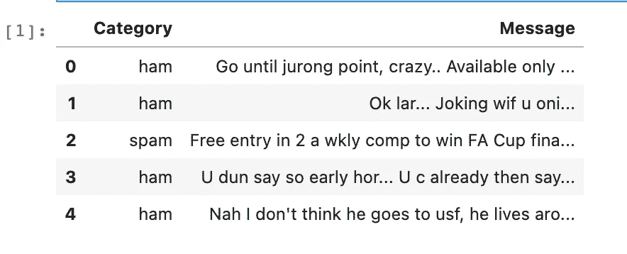
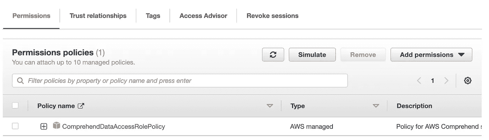
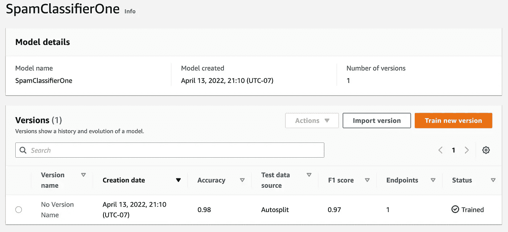
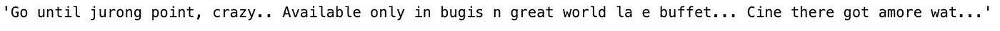
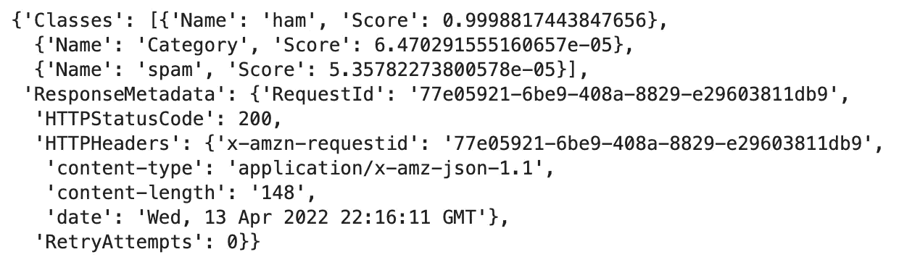

# 亚马逊理解自定义分类

> 原文：<https://towardsdatascience.com/amazon-comprehend-custom-classification-d91d68d169cc>

## 利用 AutoML 定制数据集

图片来自[苏伦兰议员](https://unsplash.com/@sure_mp)的 [Unsplash](https://unsplash.com/photos/IhWYiwSxm8g)

[亚马逊理解](https://docs.aws.amazon.com/managedservices/latest/userguide/comprehend.html)是庞大的 AWS AI/ML 堆栈的一部分。这是 AWS 提供的首要自然语言处理(NLP)服务，它提供了很大的灵活性。在过去，我解释了如何使用理解 API 来自动化[情感分析和实体识别](/sentiment-analysis-entity-extraction-with-aws-comprehend-618a7bec60b8)。

然而，对于大多数用例，您会有一个特定的数据集**来训练您的模型。对于一个**自定义分类**的例子，我们可以使用 intensive 的 AutoML 功能，并用我们自己的数据集对它们进行**微调。在本文中，我们将采用一个示例[垃圾邮件数据集](https://www.kaggle.com/datasets/team-ai/spam-text-message-classification)，并使用 intensive API 来启动一个自定义分类训练任务。利用这一点，我们可以从我们训练过的理解模型中**创建**一个**端点**，它可以执行**实时推理**。****

**注意**:对于刚接触 AWS 的人来说，如果你想继续学习，请确保在下面的 [**链接**](https://aws.amazon.com/console/) 中注册账户。培训和部署过程中会产生费用，尤其是在您的终端保持运行的情况下。本文还假设您对 AWS 和使用一个 [AWS SDK](https://aws.amazon.com/tools/) 有基本的了解。

## 设置

首先，我们将从以下 Kaggle [链接](https://www.kaggle.com/datasets/team-ai/spam-text-message-classification)中提取样本数据集。您可以在任何环境中使用这个数据集，我将使用一个经典的 [SageMaker 笔记本实例](https://docs.aws.amazon.com/sagemaker/latest/dg/nbi.html) (ml.c5.xlarge)来获得进一步的计算能力。您也可以在本地的 Anaconda 环境中工作，或者使用任何您喜欢的环境。

首先，我们下载数据集，并使用 [Pandas](https://pandas.pydata.org/) 获得一些初步信息。对于训练数据，我们可以有两种类型的分类问题:[多类](https://docs.aws.amazon.com/comprehend/latest/dg/prep-classifier-data-multi-class.html)和[多标签](https://docs.aws.amazon.com/comprehend/latest/dg/prep-classifier-data-multi-label.html)模式。对于这个例子，我们有一个多类类型的问题，因为我们有两个类:垃圾邮件和火腿。

读取数据集

垃圾邮件数据集(作者截图)

为了使用 understand，我们将使用 [Boto3 Python SDK](https://boto3.amazonaws.com/v1/documentation/api/latest/reference/services/comprehend.html#comprehend) ，你也可以使用 AWS SDKs 支持的任何语言。

我们需要注意的一些日常工作是**上传**数据集到 **S3** 并且确保**理解**有**权限**到 S3 进行模型训练。首先，我们创建一个 S3 存储桶，确保它有一个唯一的名称，然后我们可以将数据集上传到这个存储桶。

创建存储桶并上传文件

接下来转到 IAM，确保为 Comprehend 创建一个附加了**comprehension dataaccessrolepicy**的角色。

IAM 角色理解(作者截图)

请确保掌握该角色的 arn，因为稍后您将需要为模型培训提供它。

## 模特培训

对于模型训练，我们首先需要创建一个**文档分类器**，它将为训练指定我们的训练数据位置。这将提交并启动一个培训作业。

创建文档分类器

随着培训作业启动，我们可以监控其状态，直到它成功完成。

跟踪培训状态

我们还可以在控制台中监控并看到该培训作业成功执行。此步骤可能需要 30-60 分钟，具体取决于数据集的大小、类/标注的数量以及其他因素。

培训工作(作者截图)

在这里，我们还可以看到跟踪的不同指标，如准确性和 F1 得分。使用这个经过训练的文档分类器，我们可以获取作业 arn，然后使用它直接部署到**实时端点**或进行**批量推理**。在这个例子中，我们将查看一个实时端点，但是可以在下面的链接中查看关于[异步批处理作业](https://docs.aws.amazon.com/comprehend/latest/dg/how-class-run.html)的文档。

## 端点创建和调用

为了创建端点，我们可以继续使用理解 API。我们将首先获取经过训练的文档分类器 arn，并将其输入到一个 [create_endpoint](https://boto3.amazonaws.com/v1/documentation/api/latest/reference/services/comprehend.html#Comprehend.Client.create_endpoint) 调用中，我们可以对其进行监控，直到创建端点。这一步大约需要 10-15 分钟。

端点创建

这里需要注意的一个因素是参数**杀菌单位**，这是您可以调节**生产量**的旋钮。每个推理单元代表每秒 100 个字符的吞吐量，所以请确保选择一个足以满足您的用例的值。一旦端点处于状态，我们就可以获取一个样本数据点，并将其提供给端点进行推断。

来自数据集的样本数据点(作者截图)

使用 [classify_document](https://boto3.amazonaws.com/v1/documentation/api/latest/reference/services/comprehend.html#Comprehend.Client.classify_document) 调用，我们可以输入这个样本点进行推断。

端点调用

推论(作者截图)

如果不想让端点启动并运行，请确保使用以下调用删除端点。

删除端点

## 其他资源和结论

<https://github.com/RamVegiraju/aws-comprehend-custom-classifier>  

整篇文章的代码请访问上面的链接。关于 Amazon understand 的更多示例/资源，请查看如何在没有任何代码的情况下直接在 [AWS 控制台](https://docs.aws.amazon.com/comprehend/latest/dg/custom-sync.html)上重复整个过程。为了进一步理解代码示例，请查看这个 [AWS 示例库](https://github.com/aws-samples/amazon-comprehend-examples)。

我希望这篇文章很好地介绍了 AWS 提供的核心 AI/ML 服务之一。在以后的文章中，我们将探索如何将这个服务与 AWS ML 堆栈中的其他服务集成在一起。

*如果你喜欢这篇文章，请在*[*LinkedIn*](https://www.linkedin.com/in/ram-vegiraju-81272b162/)*上与我联系，并订阅我的媒体* [*简讯*](https://ram-vegiraju.medium.com/subscribe) *。如果你是新手，使用我的* [*会员推荐*](https://ram-vegiraju.medium.com/membership) *报名。*