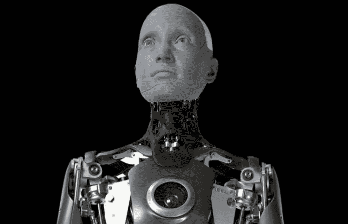

# Ameca 证明超现实机器人不会太久

> 原文：<https://towardsdatascience.com/ameca-is-proof-hyper-realistic-robots-wont-be-long-916241e1d344>

# Ameca 证明超现实机器人不会太久

## 它的表现力会让你起鸡皮疙瘩。

Ameca — [工程艺术有限公司](https://www.engineeredarts.co.uk/es/robot/ameca/)

阿梅卡不是最聪明的。它不是最有帮助或最有技巧的。它不能进行引人入胜的对话，甚至不能移动。尽管看起来毫不相干，但这个英俊的机器人最近在网上疯传——因为它看起来像你和我。

关于人工智能和机器人的对话通常围绕着智能、灵巧、语言和其他容易识别的人类特征。我们经常忘记研究外貌的分支(有时被称为[人类机器人学](https://en.wikipedia.org/wiki/Anthrobotics))。建造模仿人类表情、手势和面部情绪的机器人是其核心任务之一。

大多数人工智能研究都专注于构建超级智能的无实体代理(想想 GPT-3、AlphaZero 和机器学习术语下的任何其他虚拟模型)。智能是人类独特性的缩影——大概也是灌输给机器人的最有用的特征。然而，人工智能系统并不是孤立存在的。无论我们是否意识到，人工智能已经根植于我们生活的各个方面，最终，我们可能会面对一个现实，即我们与这些人工智能控制的物理机器人进行交互。

考虑我们是否希望这些机器人看起来像我们，这是人工智能未来的一个根本问题。提高机器人与人交流、联系和互动的能力，对于缩小它们与我们之间的差距至关重要。

在 [CES 2022](https://www.ces.tech/) 中展示的 Ameca 是一个由英国公司 [Engineered Arts](https://www.engineeredarts.co.uk/es/inicio/) 制造的人形超现实机器人，它于 2021 年末诞生，并随着这个[视频](https://www.youtube.com/watch?v=IPukuYb9xWw&ab_channel=EngineeredArts)而走红:

Ameca 的“觉醒”——工程艺术频道( [Youtube](https://www.youtube.com/watch?v=IPukuYb9xWw&ab_channel=EngineeredArts)

Ameca 睁开眼睛，惊讶地眨着眼睛，朝各个方向看，寻找它醒来的来源，这种方式非常有关联——当有人突然叫醒我们时，我们正是这样做的。机器人看着它的手臂检查和测试它，就好像它刚刚变得有生命一样。敬畏、好奇和惊奇是复杂的人类情感，我们看到 Ameca 表现得很好。感觉很熟悉。

尽管如此，它显然不是人类:灰色半透明的皮肤，机器人的四肢，由金属和塑料制成……工程艺术运营总监摩根·罗[告诉 CNET](https://www.cnet.com/news/you-have-to-distance-yourself-from-it-being-a-human-ameca-engineered-arts/) 他们故意让阿梅卡不像人类，这样它就不会那么可怕。该公司还有另一系列机器人([梅斯麦](https://www.engineeredarts.co.uk/es/robot/mesmer/))，它们被设计成尽可能的人形。那些正好落在恐怖的山谷里，这使它们变得异常可怕。

阿梅卡不仅仅像人类。它感觉很友好——你会让你的孩子玩它。

也许关键不是让机器人 100%像人，而是让它们在某些方面(如面部动作)非常像人，同时保持其他特征是人工的(如肤色)。Ameca 准确地实现了平衡的最佳点，使其成为与卓越的非语言交流互动的完美之选。像这样的机器人可以担任客户支持职位，或者帮助自闭症儿童，还有许多其他用途。

不过，Ameca 现在属于一个陈列柜，这可能是我们如此喜欢它的一个很好的部分原因。如果这些人在街上闲逛，我会有不同的想法。梅斯麦版本会更糟。想象一下，晚上 10 点，在家里一条黑暗偏僻的街道上，你会遇到这样的人。Ameca 是我们现在拥有的最好的产品，但它还远远没有准备好进行大规模生产。

然而，从长远来看，这些机器人可能会成为跨越人类不接受的深渊的桥梁。[我之前曾说过](/the-unavoidable-reason-why-ai-should-be-more-human-50e06ae21ee0)我们应该让人工智能和机器人更像我们。如果我们最终不得不与机器人生活在一起，我们最好让它们不仅让我们的大脑感到愉快，也让我们的眼睛感到愉快。

但是我们先不要担心这个。我们离这些情景还很远。阿梅卡看起来像人类，但却极其愚蠢。与 AlphaZero 或 GPT-3 不同，它不是为了显示智力而建造的——无论是狭义的还是广义的。它的语言功能非常有限，这与几年前成为第一个拥有合法公民身份的人形机器人索菲亚形成了鲜明对比。而且它不能动。你不会发现 Ameca 像波士顿动力的 [Atlas](https://www.youtube.com/watch?v=tF4DML7FIWk&ab_channel=BostonDynamics) 一样跳来跳去。

如果我们将 Ameca 的外观与 GPT-3 的语言能力、AlphaZero 的学习过程、Atlas 的身体控制以及自动驾驶汽车的视觉意识结合起来，那么我们将更接近索尼的 *I，机器人*。正是在所有这些人工智能和机器人技术的交汇点上，我们将发现未来的机器人。类似人类的面部表情和手势；平滑无界的运动；顶尖的语言能力，以及许多其他我们还没有接近实现的特性，甚至不是独立的例子。

Ameca 离实现目标还很远，工程艺术的道路也不是没有障碍的。

一个潜在的问题是众所周知的拟人化偏见。人们倾向于将完整的人性归于展示了足够多人类特征的机器人。例如，如果我们发现机器人的面部表情和我们的完全一样，人们会认为它也有产生这些表情的精神状态。语言模型也是一样。一篇写得好的、连贯的、有说服力的文章可以让读者推测出文字背后的意图。

艾的散文没有意图，阿梅卡的微笑背后也没有心理状态。

我们的大脑从我们的期望中产生预测。如果我们做出与现实相差甚远的假设，假设一块有着弯曲的嘴唇和闪亮的眼睛的金属有情感和感觉，这可能会产生重要的后果。我们最终可能会将关键任务，如照顾孩子或与孩子玩耍，委托给机器人(这是一个极端的例子，但不会发生什么)。

关于人形机器人的未来，最重要的政策是大力教育人们什么能做，什么不能做。这不足以消除不必要的后果，但这是我们这些从事先锋人工智能教育的人应该做的最起码的事情。

不过，现在，我们可以欣赏 Ameca 的怪癖，并在社交媒体上与他人分享视频。

*如果你喜欢这篇文章，可以考虑订阅我的免费周报* [***明日之心***](https://mindsoftomorrow.ck.page/) *！每周都有关于人工智能和技术的新闻、研究和见解！*

*您也可以直接支持我的工作，使用我的推荐链接* [***这里***](https://albertoromgar.medium.com/membership) *成为中级会员，获得无限权限！:)*