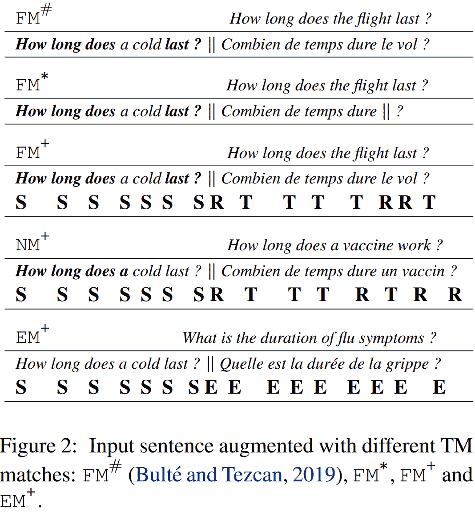
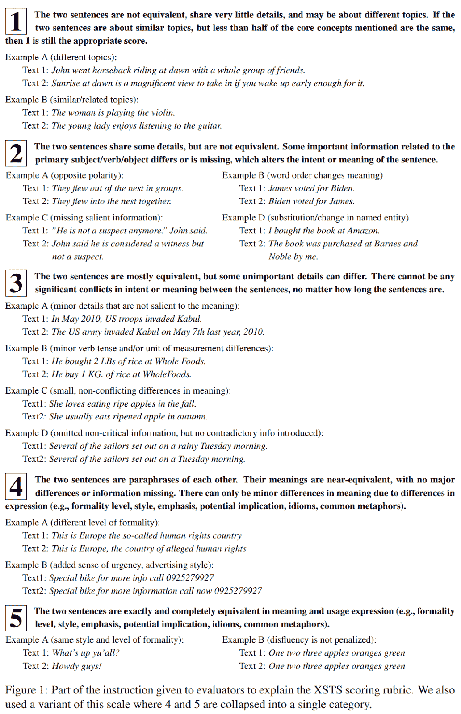

# AMTA 2022 亮点

> 原文：<https://towardsdatascience.com/amta-2022-highlights-4802372b53ed>

## 面向用户和研究人员的机器翻译技术现状

佛罗里达州奥兰多——照片由 [Unsplash](https://unsplash.com?utm_source=medium&utm_medium=referral) 上的[科迪董事会](https://unsplash.com/@codypboard?utm_source=medium&utm_medium=referral)拍摄

每两年，机器翻译(MT)社区在国际机器翻译协会(IAMT)北美分会 AMTA 会议上会面并交流该领域的最新进展。对于参与机器翻译的人来说，这总是一个非常有趣的事件，在这里，研究人员、用户、行业甚至政府组织都可以发表研究论文或展示他们的工作。2022 年版的 AMTA 于 9 月在佛罗里达州的奥兰多举行。

在这篇文章中，我强调并总结了我认为最有创意和最有趣的论文。我从用户([见会议记录](https://amtaweb.org/wp-content/uploads/2022/09/2022.amta-upg.pdf))和研究([见会议记录](https://amtaweb.org/wp-content/uploads/2022/09/2022.amta-research.pdf))轨道中挑选论文。

## 选择最佳机器翻译模型——人类评价的方法论

*作者斯捷潘·科罗塔耶夫(effect ff)和安德烈·里亚布契科夫(effect ff)*

本文中的关键假设是，如果两个或多个相同长度的翻译文本是从不同但**相同的**源文档翻译而来的，那么它们在后期编辑时应该花费大致相同的精力。

在以下情况下，两份文件被视为“同类”:

*   它们属于相同的领域和类型。
*   它们具有相似的复杂性和/或可读性分数，这些分数是用一些选定的度量标准计算出来的。
*   它们在专业术语的密度上很接近。
*   它们应该只有很少的重叠专业术语。

他们将后期编辑的“努力”定义为:

*   花费的时间
*   编辑距离
*   已更改段的百分比

然后，如果我们翻译了同类文档，并且其中一个翻译需要较少的后期编辑工作，我们可以得出结论，该翻译是由更好的机器翻译系统生成的。

这是非常直观的，作者证明了他们的假设在英语到俄语的翻译任务中是正确的。

他们也承认自己工作的局限性，例如，“花费的时间”从来不是一个非常可靠的衡量标准，因为后期编辑自己负责衡量。

## 你所需要的是来源！基于源的神经机器翻译质量评估研究

*乔恩·坎布拉·几内亚(Welocalize)和玛拉·努恩齐亚蒂尼(Welocalize)*

这是会议用户追踪的另一个原创作品。它提出了一种不同的方法来评估 QE 山的质量(QE ),即自动评估翻译质量的过程，而不使用任何人工翻译。你可以说这是一个无人监督的评估任务。这是一个研究得非常透彻的问题，但所提出的方法的独创性在于，它可以在翻译完成之前执行 QE！

事实上，这种方法仅利用源文本进行翻译，并利用训练数据来训练机器翻译系统。这里的假设是，如果我们知道机器翻译系统使用的训练数据，我们应该能够猜测它将翻译给定的源文本有多好。

在实践中，该论文表明，这种方法与最先进的 QE 度量标准相关联，如[彗星-QE](https://github.com/Unbabel/COMET) 。当然，标准的 QE 度量仍然更加准确，但是所提出的方法具有几个优点，使得它在各种情况下都是有用的。例如，它可以用来评估翻译一个给定的源文本的难度，甚至在编辑开始之前就优先考虑和更好地计划后期编辑，等等。

这项工作的主要限制之一是，我们实际上需要知道机器翻译系统的训练数据。它不适用于黑盒 MT 系统。

## 用相似的翻译提升神经机器翻译

*作者徐(希斯特兰，利姆西)，约瑟夫克雷戈(希斯特兰)，让塞内拉特(希斯特兰)*

神经机器翻译需要大量的训练数据，即人类在目标领域和语言对中创建的翻译。对于大多数用例，我们没有足够的训练数据来训练目标领域中精确的机器翻译系统。

缓解训练数据缺乏的一种方法是利用“翻译记忆”:以前由人类在相同领域和语言对中产生的翻译。然后，在翻译一个句子时，我们可以检查内存中是否已经有这个句子的翻译。这是最理想的情况，但大多数时候我们翻译的新文本并不在记忆中。在这种情况下，我们可以利用“模糊匹配”模糊匹配被定义为与翻译记忆库中的另一个句子相似的新句子。

尽管模糊匹配可能与我们要翻译的实际句子有很大的不同，但本文提出了几种利用模糊匹配来提高翻译质量的方法。他们展示了如何向神经模型提供模糊匹配的源端和目标端的信息。这在下表中针对英语到法语的翻译进行了说明:

图 2 的截图由*徐(Systran，LIMSI)、Josep Crego (Systran)和 Jean Senellart (Systran)* 拍摄。

他们提出了 3 种利用模糊匹配的方法。FM+方法是提供最佳结果的方法。它保持整个模糊匹配不变，但增加了标签:

*   **S** 为源词；
*   **R** 为不相关的目标词；
*   以及用于相关目标单词的 **T** 。

我发现 FM*表现出奇的低。与我在 NAACL 2019 论文中提出的有一些相似之处:[神经机器翻译的部分翻译的无监督提取](https://www.aclweb.org/anthology/N19-1384)。在我的工作中，我称之为“部分翻译”,而不是“模糊匹配”,我屏蔽(或丢弃)了未翻译的标记。这里，Systran 用标记“∨”来屏蔽它们。我不知道他们为什么选择这个标记，这个标记也被用来分隔源句子和目标句子。我预计模型会对该标记是宣布目标句子还是屏蔽不相关的文本感到困惑。

FM+的表现看起来让人印象深刻，即使只拿 BLEU 评价过。这项工作的一部分是开源的:[https://github.com/SYSTRAN/fuzzy-match.](https://github.com/SYSTRAN/fuzzy-match.)

## 神经机器翻译中数据过滤方法的比较

*作者:弗雷德·贝恩(Transperfect)，西莉亚·索勒·乌格特(Transperfect)，维克特·斯特里比泽(Transperfect)，安娜·扎雷茨卡娅(Transperfect)*

在噪声数据上训练的机器翻译系统可能表现不佳。过滤训练数据以去除最嘈杂的句子对几乎总是必要的。本文对不同的现有滤波方法进行了评估，这些方法可识别由 [Khayrallah 和 Koehn (2018)](https://aclanthology.org/W18-2709/) 定义的噪声类型:

*   [MUSE](https://arxiv.org/pdf/1710.04087) :从源句子和目标句子的 MUSE 单词嵌入中计算句子嵌入，然后用余弦相似度对句子对评分。
*   [Marian Scorer](https://aclanthology.org/P18-4020/) :用神经机器翻译模型给句子对打分。
*   [XLM-R](https://arxiv.org/abs/1911.02116) :计算源句子和目标句子的多语言句子嵌入，然后用余弦相似度对句子对评分。
*   [LASER](https://arxiv.org/abs/1704.04154) :获取 LASER 给出的多语言句子嵌入，然后对句子对进行余弦相似度评分。
*   [彗星](https://aclanthology.org/2020.emnlp-main.213/):使用 wmt-20-qe-da 模型进行质量估计，对句子对进行评分。

他们发现玛丽安记分员是过滤句子的最佳工具。这对我来说并不奇怪，因为这个计分器是唯一一个利用根据他们自己的数据训练的模型的工具。尽管如此，这篇论文非常有说服力，这要归功于一份远高于机器翻译研究标准的评估:

*   他们使用不同的自动度量标准:BLEU、TER 和 chrF。
*   由于使用了 SacreBLEU，计算出的分数可以在将来的工作中引用。
*   他们进行了统计显著性测试。
*   他们用 MQM 框架进行了人体评估。

按照我在我的 [ACL 2021 论文](https://aclanthology.org/2021.acl-long.566.pdf)中提出的量表，他们的评估将得到最高 4 分的元评估分数。

## 在神经机器翻译中，对词汇外单词进行字节对编码有多有效？

*作者:阿里·阿拉比(阿姆斯特丹大学)，克里斯托夫·蒙兹(阿姆斯特丹大学)，弗拉德·尼库莱(阿姆斯特丹大学)*

本文介绍了一项逾期的研究，关于 BPE 如何缓解翻译训练数据中不存在的单词的困难(OOV)。

从技术上讲，当使用 BPE 时，不存在 OOV，因为单词被分解成更小的 BPE 记号，这些记号都在 MT 模型词汇表中。尽管如此，形成 OOV 单词的 BPE 记号的序列在训练数据中仍然不可见。

在各种有趣的发现中，我首先认为，由于使用了 BPE，某些类型的 OOV 词翻译得更好，尤其是命名实体。对于其他类型的 OOV，BPE 也有帮助，但不显著。此外，在他们试图更好地理解 BPE 是如何帮助的过程中，作者证明了 OOV 单词的翻译质量与他们获得的转化者的注意力密切相关。

本文强调了 BLEU 在评估翻译质量方面的另一个弱点。正如 [Guillou 等人(2018)在 WMT18](https://aclanthology.org/W18-64.pdf) 所展示的，BLEU 对局部误差几乎不敏感。因此，当一个 OOV 单词没有被正确翻译并且对翻译的剩余部分没有任何影响时，它将仅对 BLEU 分数有非常小的影响。代替 BLEU，作者推荐人工评估来准确地评估 OOV 单词的翻译。

## 跨语言对机器翻译的一致人工评估

*作者:(META AI)，Cynthia Gao (META AI)，Janice Lam (META AI)，Francisco Guzman (META AI)，Mona Diab (META AI)，Philipp Koehn (META AI，约翰·霍普金斯大学)*

我强调这篇论文是因为它提出了一个非常全面和简单的人类评估框架。它设计得如此之好，以至于它可以包含在一个页面中，并带有示例，如下所示:

图 1 截图作者:(META AI)，辛西娅·高(META AI)，贾尼斯·林(Janice Lam)(META AI)，弗朗西斯科·古兹曼(META AI)，莫娜·迪亚卜(META AI)，菲利普·科恩(META AI，约翰·霍普金斯大学)。

更具体地说，用该框架获得的评分(表示为 XSTS)集中在获得对 MT 系统排序有意义的分数上。该框架已经在大量的语言对上进行了评估。

## 结论

我只把最原创/最有趣的论文突出给我看。我鼓励你们仔细看看会议的[进程](https://amtaweb.org/amta-2022-proceedings-for-the-main-conference-and-workshops/)。还要注意的是，有几个专门讨论非常特殊的机器翻译主题的研讨会，我在本文中根本没有涉及到。

如果你想支持这项工作，[跟我上媒](https://medium.com/@bnjmn_marie)。