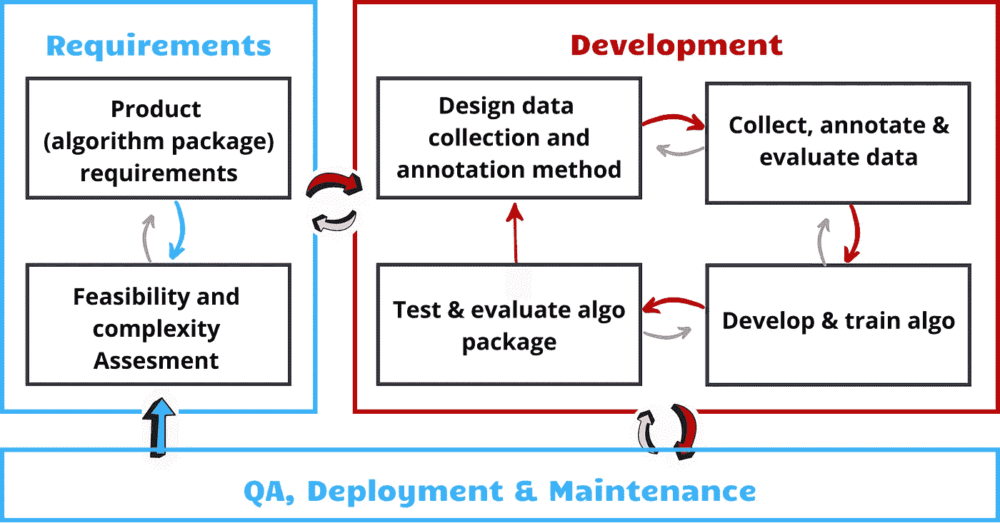
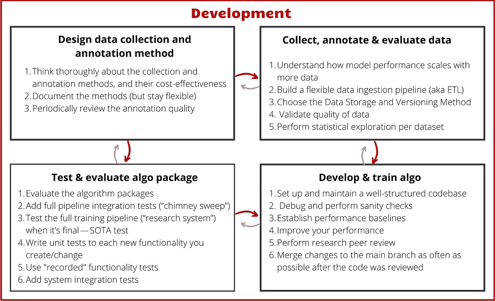
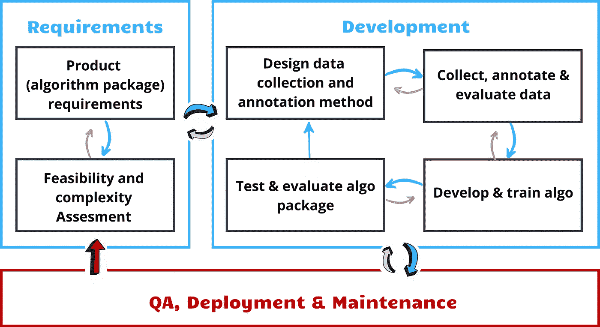

# 人工智能项目的敏捷框架——开发、质量保证、部署和维护

> 原文：<https://towardsdatascience.com/an-agile-framework-for-ai-projects-development-cbe115ba86a2>

多年来，软件开发社区已经达成了广泛的共识，即软件应该以**迭代生命周期**进行开发——根据用户反馈对产品进行持续的改进。

今天，许多人工智能团队在采用迭代生命周期之前，面临着与传统软件团队相似的困难。虽然**人工智能并没有改变构建符合产品市场的优秀产品的本质**，但它确实有细微差别和复杂性，使得应用现有的方法很困难。这一系列文章的目标是提出一个**迭代生命周期框架，它适应于以人工智能为中心的软件**。

**这篇文章是独立的，不需要阅读系列**中的前几篇文章。在之前的帖子中，我们已经讨论了(1) [这个框架](/an-agile-framework-for-ai-projects-6b5a1bb41ce4?source=friends_link&sk=97ada921887f416c88eb1f79b6660be8)的动机，并提供了一个概述，为很好地执行它奠定了基础；(2) [框架的需求阶段](/an-agile-framework-for-ai-projects-requirements-2d40d6a4fd4c?source=friends_link&sk=7c805106528ac05041e87bec2595c12c)。在这篇文章中，我们将讨论框架的开发和部署阶段。

# **发展**

作者图片

在这个阶段，我们通常有四个子阶段。这四个步骤应该以交替的方式执行，在它们之间来回循环**。**

请注意，本系列的目的是通过几个核心示例来指定流程中的步骤——即“什么”(例如评估算法设计的可行性)。我们将不描述“如何”(例如，为算法执行有效 POC 的原理)。

以下是这一阶段的总结:

作者图片

# 1.设计数据收集和注释方法

# 1.1.彻底考虑收集和注释方法，以及它们的成本效益

请记住:

*   **通常，这些方法有几种可能的变体，并且这些变体在成本效益谱上有所不同**。有些注释会更快，但对于算法开发来说可能不太有效或不太灵活(例如，代表性数据较少、类的粒度较小、注释粗糙、所需的 QC[质量控制]量)，而其他一些会更慢但更有效。
*   **想清楚这些取舍，做出明智的决定。**
*   很多时候，为注释者开发更好的工具可以使最有效的注释方法也最快。

# 1.2.记录方法(但要灵活应对变化)

*   该文档最好由注释团队创建，并由算法开发人员审查。
*   该文档有几个目的:验证每个人都真正在方法上保持一致，培训收集者\注释者，创建可靠性和一致性，以及能够在几个月后轻松地恢复注释。

# 1.3.定期检查注释质量

*   要求注释者首先注释一个小的子集，并在让他们完成工作之前监控它。
*   请注释者标记所有用当前方法难以标记的样本，并定期检查这些样本以改进方法(有时添加一些注释会有助于过滤掉有问题的案例)。

# 2.数据收集、注释和评估

# 2.1.了解模型性能如何随更多数据而扩展

在收集更多数据之前-测量并绘制模型性能，作为您研究的基线模型的数据集大小增加的函数。**根据结果迭代确定获取更多数据的成本效益**。

# 2.2.构建灵活的数据接收管道(也称为 ETL)

这将允许您像乐高一样改变不同类型的预处理，并检查它们对模型的影响。

# **2.3。选择数据存储和版本控制方法**

存储和版本控制有许多不同的方法和实现方式——从理解概念和它们之间的区别开始。

**下面的方法只是示例，了解您项目的需求**(例如，可能版本控制对您来说根本不是一个需求，因为数据不会改变)**使用这些示例作为参考，并根据您的需求设计相关的方法**。

在早期阶段的项目会使用更基本的方法，这是很自然的，同时，欠冲会导致重现性问题，甚至数据丢失，修复这些问题的成本很高。

1.  **数据存储在一个目录\桶中。**

*   优点:实现简单。
*   风险:无法(\难以)恢复以前版本的数据以实现可再现性，缺乏结构增加了因误用而造成损坏的风险，根据元数据进行查询的速度很慢。

2.**通过训练时的快照进行版本控制**(即将使用的数据和注释复制到实验工件目录中)

*   优点:实施简单，有利于再现性。
*   风险:大型数据集不可扩展，存在快照丢失的风险，因为工件目录丢失。

3.**专用数据库**:

a.存储在桶中的大量文件具有唯一的 id。

b.存储在受版本控制的数据库中的元数据和注释指向重文件。

c.用于训练集\验证集的数据 id 是单独跟踪的(例如，使用 git)。

d.对于中型数据集，一切都可以使用简单的机制来实现，比如 git。

e.对于非常复杂的数据集，考虑使用专用机制，如 DVC。

*   优点:支持版本控制，支持通过元数据进行高效查询，结构显著降低了误用和数据丢失的风险。
*   风险:更难实现和维护。

4.货架解决方案的**:**

*   **风险:你依赖于外部框架。**

# ****2.4。验证数据质量****

**收集期间和之后\注释—持续确保数据是根据商定的方法收集和注释的。如果有任何差异，决定如何处理它们。**

# **2.5.对每个数据集执行统计探索**

**使用聚合和统计(整体和每个类)来更好地了解您的数据，量化代表性，识别异常值，并识别数据覆盖范围问题。**

# **3.算法开发和培训**

# **3.1.建立和维护一个结构良好的代码库**

**a.代码库应该结构良好，包括:**

*   ****模块化组件**用于数据处理、模型定义、模型训练、模型评估和实验管理。**
*   **这种模块化的设计方式将使您能够在研究和生产中最大程度地重用相同的组件。这将使您能够避免生产缺陷。**
*   **避免研究中的“手动”步骤——你的代码库应该简化并记录(通过代码)你研究的所有步骤。缺乏重现性的最常见原因之一是不记得手动执行的步骤的细节。**

****b .流线实验再现性** -**

*   **播种**
*   **快照:代码版本、数据版本和分割、脚本、超参数、配置、种子值、实验结果、实验工件等。**

# **3.2.调试并执行健全性检查**

**参考 Andrej Karphaty 的博客文章[中的第 2 和第 3 部分:神经网络训练的诀窍。](http://karpathy.github.io/2019/04/25/recipe/)**

# **3.3.建立性能基线**

**针对您的问题建立性能基线。基线对于建立预期性能的下限(简单的模型基线)很有用，这通常与部署的需求相差不远。**

1.  **找到一个非常相似的问题的 SOTA 模型(如果有的话，并且容易适应)并重现结果。如果不可用——构建一个相对简单的模型，它不需要任何在代码库中没有简化的复杂方法。**
2.  **在您的数据集上进行训练，并执行简单的超参数调整—这是您的基线。**

# **3.4.将您的绩效提高到期望的要求**

1.  ****了解您的噪声**，了解哪些结果具有统计学意义(例如，多次训练基线并估计方差)。**
2.  ****执行受控研究**(包括新的研究方向和对现有模型的简单超参数扫描)——在导数方法中:一次只改变一件事，并测量该方向的“部分”导数。合并所有已经证明偏导数有所改善的方向，并考虑放弃其他方向。**
3.  ****尽可能实际**——**把每一个新的 SOTA 当做你的新基线**，并且(可能的话)回到这一节的开头(测量噪音，用新的 SOTA 作为偏导数的参考)。**
4.  ****尽可能多地评估和比较“下游”指标的实验(例如，影响用户感受的整个算法包的指标)。**很多时候,“模型”指标的改进不会影响下游指标，意识到这一点很重要。**

# **3.5.执行研究同行评审**

*   **让至少和你一样有经验的人(最好比你更有经验)——真正回顾你所做的研究工作(比如问最难的问题)。**
*   **为了成本效益，在长时间运行的昂贵的实验过程中——在运行之前，让别人检查你的实验(包括代码)。**
*   **用简洁的方式记录你的实验、扫描和结果，以及你从中获得洞察力的主要图表。**

# **3.6.在审查完代码后，尽可能多地将变更合并到主分支中**

# **4.测试和评估**

**人工智能系统往往有许多高度复杂的移动部件，随着你(和其他人)给算法包增加更多的复杂性，这些部件不断变化和发展。为了确保有效性和可扩展性，必须确保:**

1.  ****通过评估**:我们新的 algo 包的性能确实比当前部署的版本更好(或者至少不会更差)。**
2.  ****通过测试**:**

*   **您的代码没有被破坏——这将提高开发速度。**
*   **定期确保培训结果可以用最新版本的代码库重现。**

****在以下阶段进行评估和测试很重要**:**

1.  **在您的研究过程中不断地，以确保您真正地提高性能(评估)并保持开发速度(测试)。**
2.  **在合并到共享开发分支之前。**
3.  **在合并到生产分支之前(即，在部署到生产之前)。**

# **4.1.评估算法包**

**执行可靠的比较，这将使您能够决定我们是否应该在生产中部署新版本的算法包(单个组件\模型中的任何微小变化也被视为包的新版本)。**

*   **在将新版本的算法部署到产品中之前，以及在对共享分支进行任何重大更改之前，这种比较将作为一个**强制步骤**来执行。**
*   ****用于评估的推理应该通过“生产管道”**——生产中用于推理的同一管道。**
*   **这将是一个新算法和当前最先进的算法之间的比较，以了解性能是否确实有所改善。**
*   **依赖性的变化(例如内部词典、基本事实)会导致较差的算法包被认为是较好的，反之亦然。**一个苹果对苹果的比较意味着在完全相同的依赖关系上比较两个算法包**——相同的内部词汇，基础事实，等等。**

# **4.2.添加完整的管道集成测试(“烟囱清扫”)**

**最常见的错误不仅会导致性能问题，还会“破坏”管道。发生这种情况是因为格式(例如形状、类型等。)将会改变，管道中跟随它的下一个组件将会崩溃。**

**这实际上太容易实现了，对开发速度的影响是严重的。团队成员无休止地将破碎的组件合并到共享的分支中，团队中的每个人都在无休止地修复其他人的 bug。同样常见的是，3 个人同时独立地修复同一个 bug。**

**你应该渴望对你的每一个主要“用户故事”(例如，每一个 SOTA)进行全面的集成测试。在许多情况下——SOTA 测试非常慢(有时会运行几天),因此它们不能在每个到主分支的合并中运行。全管道集成测试必须足够快，以便在每次合并时运行，因为每次运行它对你的开发速度至关重要。**

# **4.3.最终测试整个培训管道(“研究系统”)— SOTA 测试**

**测试完整的培训管道(从原始数据到培训再到评估),并断言最新版本的代码达到了 SOTA。**这些测试应该每晚/每周运行一次，因为它们需要几个小时到几天的时间。****

**自动化这一点至关重要，因为最终同一个代码库支持多个项目，每个项目都有其下游的 SOTA。很有可能一个人在一个项目上工作——会降低另一个项目的下游度量，因为为您执行的每个变更手动测试每个项目是不可行的。**

# **4.4.为您创建/更改的每个新功能编写单元测试**

**单元测试是一种确定从更大的代码库中隔离出来的单个行为(即单元)的正确性的方法(使用[依赖注入](https://stackoverflow.com/questions/130794/what-is-dependency-injection)或其他需要时的隔离机制)。这些测试应该在每次提交时运行**，因此应该很快(每秒数百次)。拥有一个大范围的单元测试能够在开发过程中快速发现错误，并将它们定位到一个特定的行为(即单元)，这极大地加速了调试。****

**上面描述的端到端测试和集成测试，对于缺乏单元测试覆盖来说，是一个相对较好的补充。然而，它们要慢得多(因此它们不能在开发过程中持续使用)并且更少本地化(因此它们需要调试时间来调查源代码)。另一个免费的备用方案是“记录的功能测试”(如下)。**

# **4.5.使用“记录的”功能测试**

**你应该有一个在几个重要例子上运行的快速功能测试，这样你就可以快速运行(<7 minutes) to increase confidence that you haven’t broken any functionality during development. These tests should be created for any important high-level functionality (e.g. production pipeline inference). Be careful of creating too many of these as they are relatively hard to maintain.**

# **4.6\. Add system integration tests**

**The algorithm package performance can be degraded by a change in its external dependencies (e.g. a DB/service the algorithm is querying). There are two types of dependencies in that aspect — dependencies that are allowed to affect the algorithm performance (e.g. internal lexicons. Should be validated that they only improve the performance through monitoring [described in a later section]), and dependencies that are not allowed to change the performance at all (The second type should be verified using integration tests whenever a new version of the dependency is deployed, which will compare the actual outputs to the expected [recorded] outputs and assert the output doesn’t change at all.**

# ****QA，**部署和维护)**

****

**作者图片**

# **1.在用户体验时评估算法包**

**执行可靠的比较，这将使您能够决定我们是否应该在生产中部署新版本的算法包。**

*   **在将新版本的算法部署到生产中之前，这种比较将作为一个必不可少的步骤。**
*   **比较将被管理和执行，理想地，算法开发者不参与测试的定义，作为盲的和客观的测试。**
*   **这将是一个新算法与当前最先进算法之间的比较，以了解性能是否确实有所提高(在这种情况下，我们应该部署新算法)。**

# **2.为部署设置一些自动流程**

**当团队成长时，很难相信每个人都知道/记得/遵循流程——对许多人来说，这是不自然的，手动流程可能很慢/容易出错。而且规模很大，很难管理。**

**最好在这个过程中加入一些自动化机制来保证质量。**

# **3.保持将模型回滚到以前版本的能力**

# **4.监控生产中的算法包**

**所需的监控类型:**

*   **停机时间和错误—建议通过警报进行监控。**
*   **计算性能没有下降。**
*   **在标准数据集上定期评估在生产中部署的算法包的性能。降低的算法性能可能由各种原因引起，例如:数据分布的变化、新的错误、算法包依赖性的变化。**
*   **数据分布与预期相比的变化(被降低的算法性能所掩盖，但是直接监控可以更好地定位问题的来源)**

****

**信用:[凯利·西克玛](https://unsplash.com/@kellysikkema)——【https://unsplash.com/photos/JRVxgAkzIsM **

**这个帖子系列是与[伊丹·巴苏克](https://medium.com/u/1c7ec28c4b50?source=post_page-----6b5a1bb41ce4----------------------)合著的。**

**我将很高兴听到你的想法和经验。**