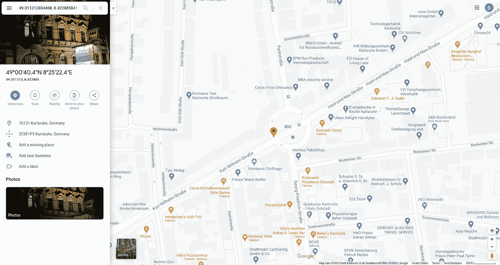
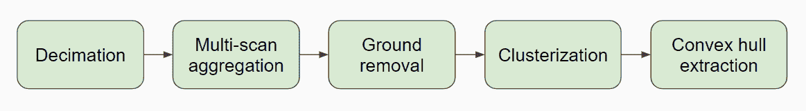
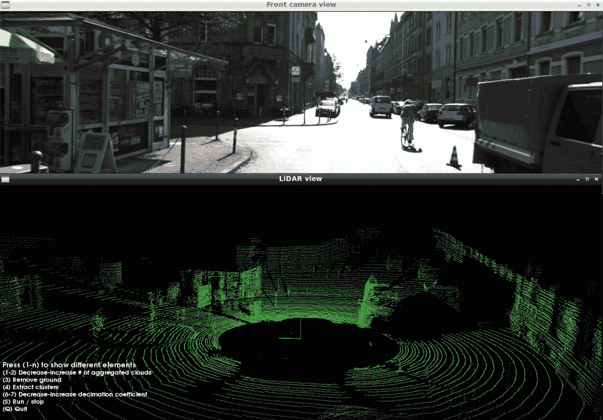
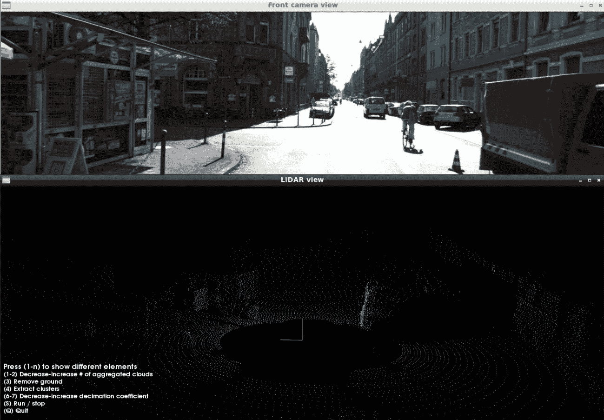
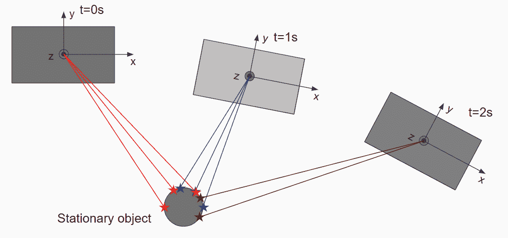
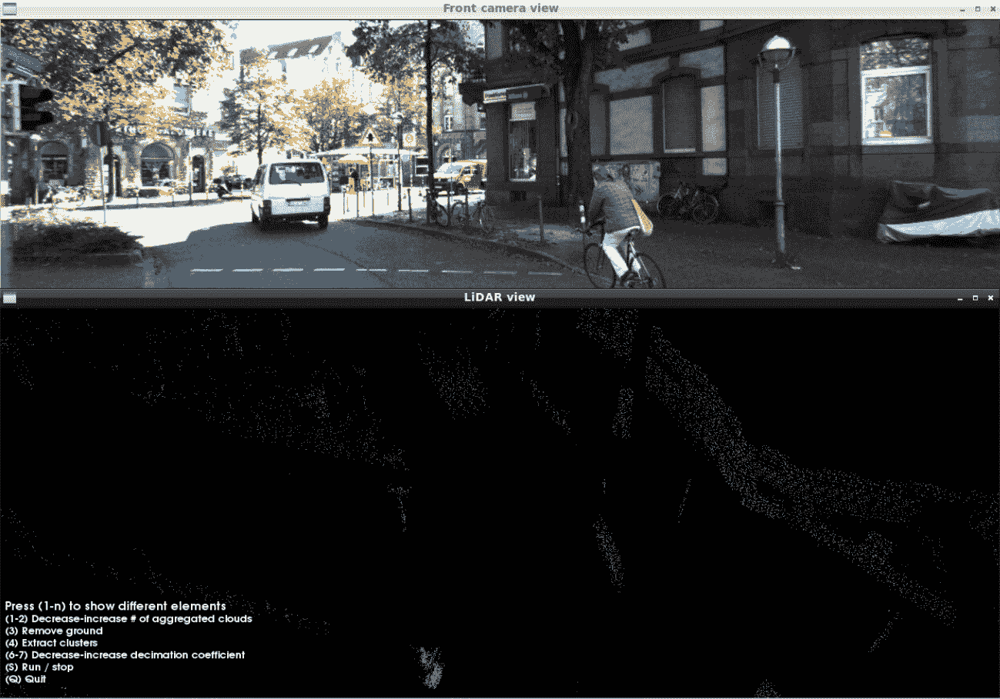
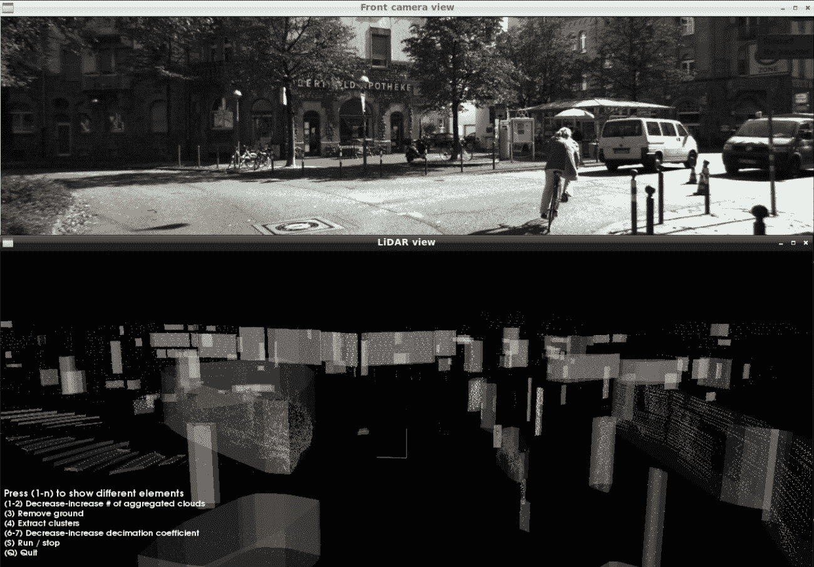
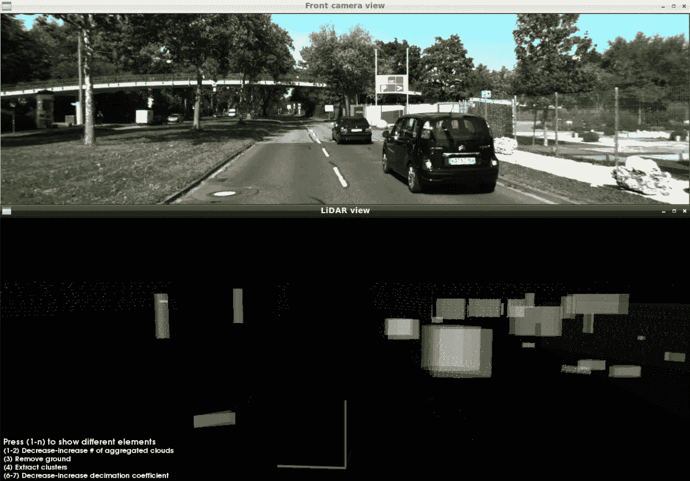

# 基于 PCL 的自动驾驶激光雷达感知栈的算法实现

> 原文：<https://towardsdatascience.com/an-algorithmic-implementation-of-an-autonomous-driving-lidar-perception-stack-with-pcl-4d5928bcebc7>

# 基于 PCL 的自动驾驶激光雷达感知栈的算法实现

## 基于激光雷达感知的 C++管道示例

由 [Unsplash](https://unsplash.com?utm_source=medium&utm_medium=referral) 上的 [CHUTTERSNAP](https://unsplash.com/@chuttersnap?utm_source=medium&utm_medium=referral) 拍摄

# 介绍

自动驾驶是一个相对较新且非常迷人的现代技术领域。自 2004 年 DARPA Grand Challenge 期间公开展示并在 2007 年的城市挑战赛期间转向更具挑战性的城市环境以来，自动驾驶一直受到业界和学术界的追捧。这些应用一直在个人自动驾驶汽车、自动出租车车队、卡车运输、送货等等之间徘徊，但技术仍未出现。自动驾驶陷入幻灭低谷的原因之一是软件驱动栈的感知组件是一个非常复杂的问题。虽然大多数团队采用基于激光雷达的感知，但特斯拉和 Wayve 仍试图建立摄像头优先的感知。依赖激光雷达的解决方案也可以分为两类:处理点云的传统计算机视觉算法和基于深度学习的方法。神经网络承诺以高平均精度解决感知问题，然而，如果我们想在最坏的情况下证明合理的精度，这是不够的。在汽车行业，当软件必须满足 ASIL D 级可靠性时，最好有一个独立的传统非 ML 感知堆栈在车辆上运行，并提供与汽车标准的高度一致性。在本文中，我们将看看在 PCL(一个开源的点云库)的帮助下实现的广告栈。

首先，我们将坚持系统级的测试驱动开发(TDD ),以确保我们的整个代码在第一次现场部署发生之前得到彻底的测试。为此，我们需要一个数据集来运行我们的代码。卡尔斯鲁厄理工学院和芝加哥丰田理工学院的经典 2012 数据集 Kitti 非常适合这个目的。这是第一批大规模高质量数据集之一，旨在作为自动驾驶领域计算机视觉算法的基准。Kitti 具有包括检测在内的几个子数据集，但我们对跟踪子数据集更感兴趣，因为我们将利用数据的时间属性以及 GNSS 定位数据。

谷歌地图定位的凯蒂跟踪序列 0000

Kitti 跟踪由 21 个同步的 PNG 图像序列、威力登激光雷达扫描和来自 RT3003 GPS-IMU 模块的 NMEA 记录组成。数据集的一个重要特征是传感器之间的彻底相互校准，包括矩阵“Tr_imu_velo ”,它是从 GPS-IMU 坐标到威力登激光雷达坐标的转换。

感知管道的架构如下。

点云感觉形态的感知管道。图片由作者提供。

让我们分别讨论每个组件，并深入研究它们的 C++实现。

# 点云抽取

为什么我们可能需要抽取来自深度传感器(可能是一个或几个激光雷达)的点云？自动驾驶软件最重要的要求是满足实时操作约束。第一个要求是处理流水线跟上激光雷达扫描采样的速率。在实际情况下，扫描速率可能从每秒 10 次扫描到每秒 25 次扫描不等，这导致任何处理阶段的最大延迟从 100 毫秒到 40 毫秒不等。如果对于任何可能的输入点云，任何阶段(例如集群化)滞后超过 100 毫秒(对于每秒 10 次扫描的速率)，将会发生丢帧，或者流水线的总延迟将开始任意增长。这里的一个解决方案是丢弃激光雷达点，而不是丢弃整个帧。这将逐渐降低准确性指标(召回率和精确度)，并保持管道实时运行。第二个要求是系统的整体延迟或反应时间。同样，总延迟应限制在至少 100 或 200 毫秒，500 毫秒甚至 1 秒左右的反应时间对于自动驾驶来说是不可接受的。因此，通过首先应用抽取来处理少量的激光雷达点来开始算法设计是有意义的。

抽取的标准选项有:

1.  规则的
2.  (伪)随机
3.  体素网格

常规缩减采样速度很快，但可能会导致点云上出现锯齿图案。随机或伪随机下采样也很快，但可能会导致小对象不可预测地完全消失。像 PCL 的 pcl::VoxelGrid <>类这样的体素网格过滤是智能和自适应的，但需要额外的计算和内存。一如既往，选择一种方法而不是另一种方法是一种设计选择。

原始点云。请注意，此处显示的 RGB 图像仅用于清除。RGB 数据不用于激光雷达管线。图片由作者提供。

抽取的点云。图片由作者提供。

# 多扫描聚合

多扫描聚合是在自我车辆相对于地面移动时将若干历史激光雷达扫描配准到公共坐标系的过程。公共坐标系可以是本地导航框架(也称为 ego-master 坐标)或当前激光雷达传感器坐标。我们将以后者为例。这个阶段理论上是可选的，但在实践中非常重要。问题是下一阶段的聚类取决于激光雷达点的密度，如果密度不足，过度聚类的影响可能会发挥作用。过度集群化意味着任何对象(汽车、公共汽车、建筑墙壁等)都可能被分割成几个部分。就其本身而言，对于检测障碍物来说，这可能不是问题，但是，对于感知-跟踪-过度集群化的下游模块来说，这是一个巨大的挑战。跟踪器可能不准确地关联物体的碎片，并产生将由预测模块在与自我车辆路径交叉的方向上外推的轨迹，这又使得自我车辆突然刹车。我们绝对不希望集群化中的小错误在下游组件中造成大量错误。

几次连续扫描(5 到 10 次)的聚合成比例地增加了落在每个物体上的激光雷达点的密度，并有助于精确的聚类。自我车辆运动的一个很好的特点是，汽车能够从不同的角度观察同一物体，并且激光雷达扫描模式覆盖物体的不同部分。

自我载体(灰色方框)从不同的角度观察同一个物体。图片由作者提供。

让我们看看执行聚合的代码。第一阶段是用历史点云以及随后的扫描仪姿态之间的姿态变换来保持约束长度的队列。请注意，我们如何使用从 RT3003 GPS-IMU 模块获得的平移速度[Vx，Vy]和旋转速度 Wz 来构建姿态变换。

在第二阶段，我们从时间上向后的最近扫描开始遍历队列，将扫描到扫描的转换累积到集合转换中，并将集合转换应用于每个历史帧。通过这种方法，我们使计算成本为 O(N*D ),其中 N 是点数，D 是历史的深度(扫描次数)。

在聚集之后，如果移动的物体看起来有点模糊，那么点云会变得模糊。这是一个挫折，可以在集群化阶段进一步处理。在这个阶段，我们需要的是一个更密集的点云，从多个帧中积累信息。

5 帧聚合点云。为了便于观察，地面被移开了。图片由作者提供。

# 地面移除

感知堆栈的目的是提供有关动态对象和静态障碍物的信息。汽车应该在道路上行驶，通常路面不被认为是障碍。因此，我们可以移除从路面反射的所有激光雷达点。为了做到这一点，我们首先将地面检测为平面或曲面，并移除表面周围约 10 厘米或以下的所有点。有几种方法可以检测点云上的地面:

1.  用 Ransac 探测一架飞机
2.  用霍夫变换检测平面
3.  具有填色的非平面表面检测

让我们借助 Eigen 和 PCL 库更深入地了解 Ransac 的 C++实现。

首先，我们来定义一下我们的候选平面。我们将使用基点加法向量的形式。

然后，我们定义一个辅助函数，它允许我们在点云转换到平面坐标后，在 Z 坐标上找到满足条件的所有点的索引。条件是由 lambda 函数给出的，因为我们希望这个帮助器尽可能通用。请按照代码中的注释来了解实现的细节。

最后，主要的 Ransac 实现如下所示。第一步是根据 Z 坐标对点进行粗略过滤。此外，我们需要再次抽取点，因为我们不需要聚合云中的所有点来验证候选平面。这些操作可以一次完成。

接下来，我们开始迭代。借助 C++标准库的 std::mt19937 伪随机生成器，每次迭代采样 3 个随机点。对于每个三元组，我们计算平面并确保其法线向上。然后我们使用同一个帮助函数 find _ inlier _ indices 来计算内联器的数量。迭代结束后，我们剩下的是最佳平面候选，我们最终使用它来复制点云中索引不在列表中的所有点。请注意 std::unordered_set <>的使用。它允许执行索引的常数时间 O(1)搜索，而不是我们对 std::vector <>的线性 O(N)搜索。

让我们看看地面消除的结果。

在移除地面之前。图片由作者提供。

移除地面后。图片由作者提供。

去除了背景之后，我们准备对剩余的点进行聚类，并通过凸包提取来压缩对象元数据。这两个阶段值得他们自己的文章。我将在即将到来的第二部分中介绍它们的实现。同时下面是聚类的最终结果——凸包提取。

使用凸包可视化的最终聚类对象。图片由作者提供。

凸包绝对是任何追踪器都渴望接受的元数据类型。它们在 RAM 使用方面更紧凑，并且比定向边界框更精确地表示对象的边界。这是另一个可视化，取自 Kitti 序列 0003。

来自 KITTI 追踪序列 0003 的集群化点云。图片由作者提供。

# 结论

我相信，自动驾驶将是人类在生活质量和整体生产力方面的一次飞跃。它将最终使“自动”-“移动”真正成为一个最终自动化的移动设备。自动驾驶需要最高水平的软件工程，我希望许多刚开始职业生涯的工程师在阅读这篇文章后会受到鼓励，以完善他们的技能。

参考资料:

[1] [作者在 Github 上的项目源代码](https://github.com/Obs01ete/lidar_course/tree/master/src)(星星不胜感激)

[2] [基蒂跟踪页面](http://www.cvlibs.net/datasets/kitti/eval_tracking.php)

[3] [PCL 点云处理库](https://pointclouds.org/)