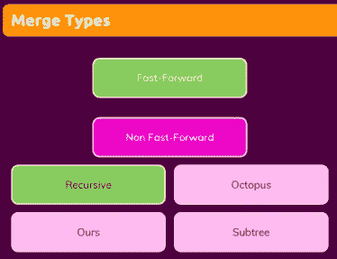
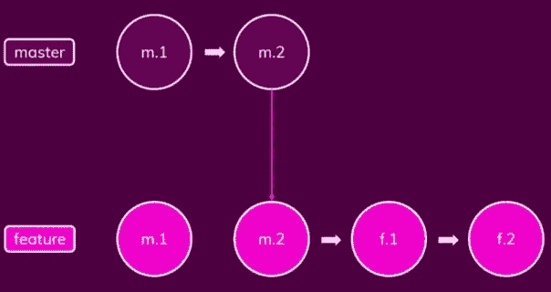
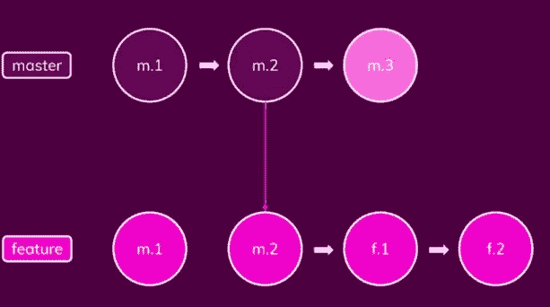
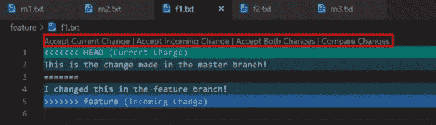

# 理解 GIT 的简单方法

> 原文：<https://towardsdatascience.com/an-easy-way-to-understand-git-80717c4b98e9>

## 中间 git 命令及其含义解释

和许多程序员一样，我一直在使用 GIT 对我的工作库进行版本控制，我想回顾一下最常用的命令及其逻辑，以便有更深入的理解。这是我在一些在线教程和课程后收集的，我想和你分享一下！


图片来自 unsplash.com

1.  创建新分支

*   `git branch new_branch_name
    git checkout new_branch_name`(或`git switch new_branch_name`)或
*   `git checkout -b new_branch_name` 或
*   `git switch -c new_branch_name`

2.用旧的提交创建一个新的分支，从那里继续工作

```
git log  (to check the commit id)
git checkout id (to pass related commit)
git checkout -b new_branch_name commit_id (create a new branch with that commit) 
```

3.舞台机制

您已经暂存了一些文件(在您的跟踪区域中)，并且您在这些文件中有一些未暂存的更改，您想要删除这些更改。

*   `git restore filename`或
*   `git checkout filename`删除特定文件中的修改

和

*   `git restore .`或者
*   `git checkout .`删除这种情况下的所有修改。

您有未暂存的文件，并且您想从添加这些文件的地方返回

*   `git clean -dn (to check which files you are going to delete)
    git clean -df (to delete these files)`

您想取消转移一些已经转移的文件，告诉 git 不要跟踪它们

*   `git restore --staged filename`或`git reset filename`

检查哪些文件在您的暂存区域中

*   `git ls-files`

4.删除提交

*   `git reset HEAD~n`或
    `git reset --SOFT HEAD~n`返回 n 次提交(删除 n 次提交)，不删除变更
*   `git reset --HARD HEAD~n`通过从您的工作存储库中删除变更来删除 n 个提交。

5.隐藏机制

您已经进行了一些更改，但是没有提交，因为它还没有准备好提交。你想要改变你的分支，但是你不希望这些阶段性的改变进入你刚刚传递到的分支。您必须将这些更改保存在内存中，以免丢失，不会带到另一个分支，并且能够在需要时保留它们。

*   `git stash`把它们保存在记忆中，让它们暂时消失
*   `git stash apply`收回更改
*   `git stash apply n`仅获取隐藏存储器中 id n 的变化
*   `git stash pop`取回更改并将其从存储存储器中删除(n 参数也适用，如在 apply 中)
*   `git stash list`查看你的收藏区有什么
*   `git stash clear`删除你所有隐藏的记忆
*   `git stash drop n`删除 id 为 n 的 stash(你可以用上面提到的“git stash list”命令检查 id！！)

6.带来丢失的数据

您希望恢复已删除的提交或分支:

*   `git reflog`查看过去 30 天内发生的所有事件及其哈希 id。因此，与 git log 命令相比，这里我们不仅可以看到提交历史，还可以看到我们执行的每个步骤，如切换分支、转移、存储、删除提交或分支等。
*   `git reset --hard hash_id`恢复已删除的提交
*   `git checkout hash_id
    git checkout -b new_branch_name`恢复已删除的分支

7.合并类型

合并操作主要有两种类型:**快进**和**非快进**，分别有 1 和 4 种不同的应用方式。在本教程中，对于非快进类别，我只提快进合并和递归合并。



合并类型—按作者排序的图像

*快进:*在您为您的新特性创建了一个新的分支(姑且称之为特性分支)之后，您提交到这个分支，同时，主分支中没有任何改变。在这种情况下，合并过程非常容易应用，没有任何冲突，我们称这种情况为快进合并。



快进合并结构—按作者排序的图像

快进并没有添加任何额外的提交来提到这个合并操作，它只是把提交从新分支放到主分支。

为了应用这种合并，

*   `git checkout master
    git merge new_branch`

现在，当您在主分支中检查您的提交历史时，您将看到来自特性分支的提交也被列出。

*递归非快进:*在你为你的新特性创建了一个新的分支(姑且称之为特性分支)之后，你向这个分支提交，同时，一些新的提交也在主分支中进行。在这种情况下，我们讨论的是非快进合并。当这两个分支合并时，提交按日期排序。与快进合并相反，在非快进情况下，进行合并操作的提交，并作为主分支的最后一次提交添加。

应用非快速前进合并的命令与快速前进合并相同，很明显快速前进合并是不可能的，并且会导致非快速前进合并。



递归非快进结构—作者图片

在一个非快速向前的合并中，可能有一些**冲突**需要修复，因为在两个分支中都有一些变化。如果您在特征分支中更改了一个文件，同时在主分支中也更改了该文件，您必须决定接受哪个更改(或两个都接受)来解决冲突并完成合并。另一方面，如果在这两个分支中只更改了不同的文件，则在合并期间不会有冲突。

要修复合并，我建议您使用 Visual Studio 代码接口，因为它可以让您看到差异并更容易地决定做什么:



Visual Studio 合并冲突—按作者排序的图像

8.重置基础机制

我提到过，在非快进合并中，由于在两个分支中进行了不同的提交，所以提交是按日期对齐的。例如，在上图中，不能确定 master 中的提交顺序是 m1 → m2 → m3 → f1 → f2 还是 m1 → m2 → f1 → f2 → m3 还是 m1→m2→f1→m3→m3→F2。

如果您希望按照主分支提交→功能分支提交的顺序排列这些提交，您可以使用 rebase 机制用主分支的最新版本来更改功能分支的基础，并在这个新基础之后添加功能分支提交。该过程还允许您应用快速合并，因为在这种重新组织的情况下，我们将所有在 master 中进行的提交放在 feature 分支中，这意味着当我们合并它们时，master 中没有任何变化。


重置基础和快进合并结构—作者图片

要应用于 rebase，请执行以下操作:

```
git checkout feature
git rebase master (rebase feature branch using the master branch)
git checkout master
git merge feature (merge the master branch with feature branch via fast forward) 
```

9.樱桃采摘

有时，您可能希望挑选一些提交添加到主分支，而不是特性分支中的每个提交。在这种情况下，cherry-pick 命令就是您要找的命令！

```
git checkout feature
git log (check the ids of commits you wanna apply to the master)
git checkout master
git cherry-pick commit_id
```

Cherry-pick 操作只在您的主分支上添加 1 个提交，作为您挑选的提交的 zip 版本。

本教程是关于重要的 git 命令及其逻辑的。不要忘记 Git 是用来控制你本地计算机上的工作流的，如果你想在云上运行这个库，并在这些本地云库之间进行通信，你必须在 [Github](https://github.com/) 上开一个账户。Git 和 GitHub 之间的一些基本命令如下:

*   `git remote add origin URL`将 GitHub 云存储库连接到您的本地工作存储库
*   `git push origin master`将文件从本地存储库加载到云中，如果不是第一次推送，则更新更改(合并)!

**基础词汇:**

*   *Staging* 表示用下面的命令
    `git add filename (or) git add .`将变更添加到 git 跟踪区
*   *提交*意味着使用下面的命令
    `git commit -m "commit message"`将阶段性变更保存为项目的更新版本
*   *分支*表示从主目录创建的附加工作目录。主要目标是在不影响主存储库的情况下，在额外的分支上开发新特性，并在特性被测试并准备好实时使用时，通过将您的分支与您的主分支合并来添加这些新特性*。*
*   *主分支*意味着默认的主分支附带了工作存储库的 git 初始化。Main 是一些人喜欢使用的另一个常用名称，您可以使用`git branch -M branch_name`命令更改您的主分支名称

感谢您对本教程的兴趣，我希望它是有帮助的！在学习了 Git 命令及其用法之后，我建议您看一看 [GitHub](https://github.com/) 命令，以便更好地控制您在云和本地存储库之间的版本控制。熟悉 GitHub 总是一个好主意，因为在协作中，云存储库是最常见的方式，而不是本地方式。💥