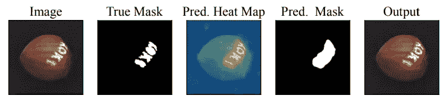
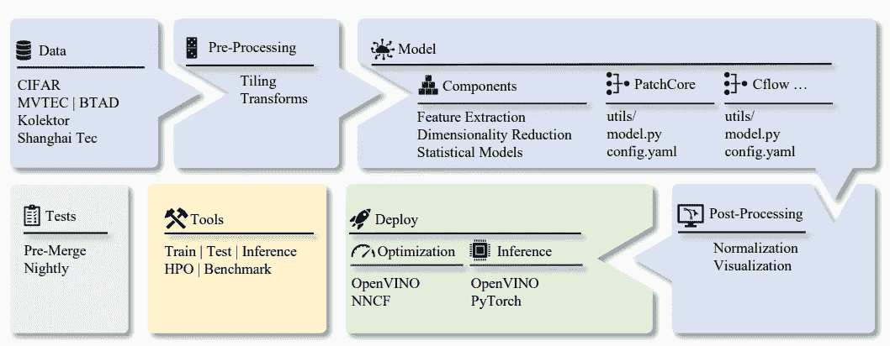
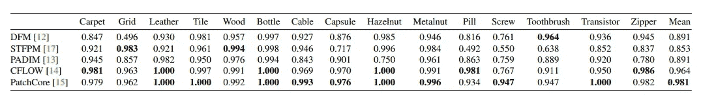
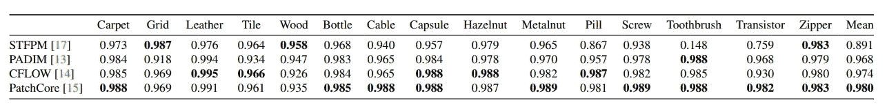

# 一种有效的图像异常检测方法

> 原文：<https://towardsdatascience.com/an-effective-approach-for-image-anomaly-detection-7b1d08a9935b>

## 利用来自英特尔 OpenVinoToolkit 的 Anomalib 来基准测试、开发和部署基于深度学习的图像异常检测

图片来源: [Pixabay](https://pixabay.com/photos/nuts-black-acorn-oak-animal-food-60812/) ( [Pixabay 许可](https://pixabay.com/service/license/):免费商业使用)

检测图像异常甚至比检测结构化数据集或来自[时间序列数据](/effective-approaches-for-time-series-anomaly-detection-9485b40077f1)的异常更加困难。这部分是因为在结构化数据集中，视觉特征比数值特征更难捕捉。这就是深度学习(DL)技术的用武之地，因为深度学习模型可以对图像等非结构化数据进行自动特征提取。

为了方便执行图像异常检测任务，英特尔 OpenVino 推出了 **Anomalib** ，这是一个 DL 框架，提供了最先进的异常检测算法，用于公共和私有数据集的基准测试。该框架提供了最近文献中描述的异常检测算法的许多现成可用的实现，以及加速定制 DL 模型的开发和实现的工具集合。该框架重点关注**无监督的基于图像的异常检测**，其目标是识别图像中的异常值或数据集中图像内的异常像素区域。这个框架被开发者([https://openvinotoolkit.github.io/anomalib/](https://openvinotoolkit.github.io/anomalib/))很好地维护着，并且不断地用新的算法和训练/推理插件进行更新。

# 工业应用领域

现在，如果您想知道为什么 Anomalib 会对您有用，那么我将从我的经验中提到这个框架可以产生巨大影响的以下工业应用领域:

*   **制造过程质量检测**:金属螺母、齿轮、容器、密封件等小零件和设备的缺陷检测。该库可以检测不同于正常样品的异常和有缺陷的图案。
*   **从医学图像中检测医学状况**:从放射医学图像中检测和定位肿瘤、出血、胸部感染等医学状况是另一个大规模使用案例，在这种情况下，该框架将非常有用

# 为什么是 Anomalib？

如果你想知道为什么 anomalib 用于无监督图像异常检测，我会列出以下主要原因:

1.  很难捕捉和注释大量的异常图像数据。这就是为什么无人监管的异常检测是当务之急。
2.  传统的计算机视觉算法是无效的，因为正常样本和异常样本之间的差异可能非常小。然而，可能存在多种类型的变化，因此很难预先预测所有类型的图像异常。因此，基于 DL 的方法可以自动学习正常和异常特征之间的差异。
3.  您可以使用 Anomalib 在全球和局部范围内进行检测和定位。因此，您不仅可以识别不同类型的异常，还可以突出显示局部像素级异常区域
4.  为您自己的用例编写您自己的异常检测器的简单抽象。
5.  支持高速用例的实时推理过程！

anomalib 可视化工具产生的示例性输出(来源: [ArXiv Anomalib 论文](https://arxiv.org/abs/2202.08341)

# 理论——:-(

是的，我知道太多的理论会令人厌烦。但重要的是要知道 Anomalib 是如何工作的！我保证我不会抛出太多的技术信息和花哨的术语来使这篇文章变得非常专业。相反，我将介绍这个框架的高层次直观理解和机制。详细了解请阅读关于 Anomalib 的研究文献原文——*Anomalib:Akcay 等人的异常检测深度学习库*:【https://arxiv.org/abs/2202.08341】T4

## 架构图

anomalib 框架架构图(来源: [ArXiv Anomalib 论文](https://arxiv.org/abs/2202.08341))

上图总结了 anomalib 库从开发到部署的整个端到端流程。

## 支持的型号

Anomalib 为无监督异常检测和定位方法提供了以下[判别和生成方法](https://developers.google.com/machine-learning/gan/generative):

*   **PaDiM:一个用于异常检测和定位的补丁分布建模框架**—[https://arxiv.org/pdf/2011.08785.pdf](https://arxiv.org/pdf/2011.08785.pdf)
*   **patch core**——[https://arxiv.org/pdf/2106.08265.pdf](https://arxiv.org/pdf/2106.08265.pdf)
*   **STFPM:用于无监督异常检测的学生-教师特征金字塔匹配**——[https://arxiv.org/pdf/2103.04257.pdf](https://arxiv.org/pdf/2103.04257.pdf)
*   **FastFlow:通过 https://arxiv.org/abs/2111.07677**T22D 归一化流的无监督异常检测和定位
*   从一类嵌入中通过反蒸馏进行异常检测—[https://arxiv.org/pdf/2201.10703v2.pdf](https://arxiv.org/pdf/2201.10703v2.pdf)
*   还有更多！—[https://openvinotoolkit . github . io/anomalib/reference _ guide/algorithms/index . html # available-models](https://openvinotoolkit.github.io/anomalib/reference_guide/algorithms/index.html#available-models)

## 培训用数据

该框架还为越来越多的公共基准数据集提供了数据集适配器，这些数据集来自广泛用于文献中的图像和视频领域。

*   **图像**。Anomalib 支持 CIFAR-10 进行快速原型制作，支持 MVTec、BTAD 和 Kolektor 进行真实世界的缺陷检测应用。
*   **视频**。该库支持视频数据集，如 ShanghaiTec [10]。目前，视频数据集仅在帧级基础上受支持，因为现有的 anomalib 模型针对图像域进行了优化。作者计划在未来版本中支持视频异常检测模型来解决这个问题。
*   **自定义**。除了前面提到的公共数据集，anomalib 还为用户提供了一个数据集接口，以实现定制数据集，在其上可以训练新的和现有的 anomalib 模型。

关于这些数据集的参考、引用和许可，我建议你阅读全文—[https://arxiv.org/pdf/2202.08341.pdf](https://arxiv.org/pdf/2202.08341.pdf)

## 超越基准

这篇论文的作者([https://arxiv.org/pdf/2202.08341.pdf](https://arxiv.org/pdf/2202.08341.pdf))报告了他们在图像级和像素级得分上的表现，这似乎令人印象深刻！

使用 Anomalib 的 MVTec 数据集类别的图像级 AUROC 分数(来源: [ArXiv Anomalib 论文](https://arxiv.org/abs/2202.08341)

使用 Anomalib 的 MVTec 数据集类别的像素级 AUROC 分数(来源: [ArXiv Anomalib 论文](https://arxiv.org/abs/2202.08341))

对于任何工业应用来说，结果看起来都非常惊人！

# 代码示例在哪里？？？

不要担心！在我自己运行了几个用例之后，我确保提供了代码示例！然而，我将在另一篇文章中解释代码的完整工作方式。但是完整的工作代码已经可以在我的 GitHub repo 上找到:[https://GitHub . com/adib 0073/unsupervised-anomaly-detection/blob/main/unsupervised-anomaly-detection . ipynb](https://github.com/adib0073/unsupervised-anomaly-detection/blob/main/unsupervised-anomaly-detection.ipynb)。该算法超级快，非常容易运行和复制的结果！

# **图像异常检测为可解释的人工智能**

你有兴趣了解更多关于图像分类和分割模型的可解释人工智能吗？然后，Anomalib 中提出的方法可能是解释建立在图像数据集上的模型的非常有用的方法。如果你有兴趣了解更多关于可解释 AI 的知识，我推荐阅读这本书: [**【应用机器学习可解释技术】**](https://amzn.to/3cY4c2h) 并探索 [GitHub 知识库](https://github.com/PacktPublishing/Applied-Machine-Learning-Explainability-Techniques)以获得实际操作的代码示例。

 [## 应用机器学习可解释技术:使 ML 模型可解释和可信…

### 应用机器学习可解释技术:使 ML 模型可解释和可信赖的实践…

www.amazon.com](https://www.amazon.com/Applied-Machine-Learning-Explainability-Techniques/dp/1803246154?_encoding=UTF8&pd_rd_w=Wr6SJ&content-id=amzn1.sym.716a1ed9-074f-4780-9325-0019fece3c64&pf_rd_p=716a1ed9-074f-4780-9325-0019fece3c64&pf_rd_r=6P2PM599T97MRG7NZD9J&pd_rd_wg=m4qUW&pd_rd_r=6e349d93-5ba0-4bfe-9055-905c0153fe58&linkCode=li3&tag=adib0073-20&linkId=35506e1847de5c011fc57aa66c2b1d8e&language=en_US&ref_=as_li_ss_il) 

# 摘要

在本文中，我们讨论了 **Anomalib** ，这是一个用于培训、基准测试、部署和开发基于深度学习的无监督异常检测模型的综合框架。Anomalib 提供了一组工具，允许对任何图像数据集上的不同无监督异常检测模型进行快速和可重复的比较。开源框架可在:[https://github.com/openvinotoolkit/anomalib](https://github.com/openvinotoolkit/anomalib)获得，完整文档可在:[https://openvinotoolkit.github.io/anomalib/](https://openvinotoolkit.github.io/anomalib/)获得。希望你喜欢这篇文章！在 [Medium](https://adib0073.medium.com/membership) 和 [LinkedIn](https://www.linkedin.com/in/aditya-bhattacharya-b59155b6/) 上关注我，了解更多关于计算机视觉、可解释的人工智能和机器学习的信息。

 [## 应用机器学习可解释技术:使 ML 模型可解释和可信…

### 应用机器学习可解释技术:使 ML 模型可解释和可信赖的实践…

www.amazon.com](https://www.amazon.com/Applied-Machine-Learning-Explainability-Techniques/dp/1803246154?_encoding=UTF8&pd_rd_w=Wr6SJ&content-id=amzn1.sym.716a1ed9-074f-4780-9325-0019fece3c64&pf_rd_p=716a1ed9-074f-4780-9325-0019fece3c64&pf_rd_r=6P2PM599T97MRG7NZD9J&pd_rd_wg=m4qUW&pd_rd_r=6e349d93-5ba0-4bfe-9055-905c0153fe58&linkCode=li3&tag=adib0073-20&linkId=35506e1847de5c011fc57aa66c2b1d8e&language=en_US&ref_=as_li_ss_il) 

# 参考

*   阿卡伊，s .，阿梅隆，d .，瓦伊迪亚，a .，拉克什马南，b .，阿胡贾，n .，根茨，U. (2022)。Anomalib:用于异常检测的深度学习库。doi:10.48550/ARXIV
*   [https://github.com/adib0073/unsupervised-anomaly-detection](https://github.com/adib0073/unsupervised-anomaly-detection)
*   [https://blog . ml6 . eu/a-practical-guide-to-anomali b-using-b2af 78147934](https://blog.ml6.eu/a-practical-guide-to-anomaly-detection-using-anomalib-b2af78147934)
*   【https://openvinotoolkit.github.io/anomalib/ 
*   [https://pypi.org/project/anomalib/](https://pypi.org/project/anomalib/)
*   [https://www . ka ggle . com/code/ipythonx/mvtec-ad-anomaly-detection-with-anomali b-library/notebook](https://www.kaggle.com/code/ipythonx/mvtec-ad-anomaly-detection-with-anomalib-library/notebook)
*   [https://www.mvtec.com/company/research/datasets/mvtec-ad](https://www.mvtec.com/company/research/datasets/mvtec-ad)