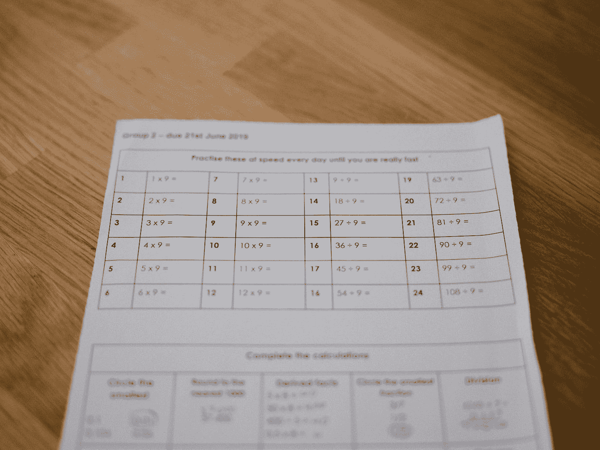
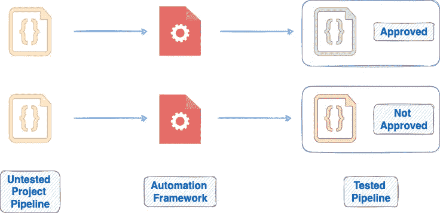
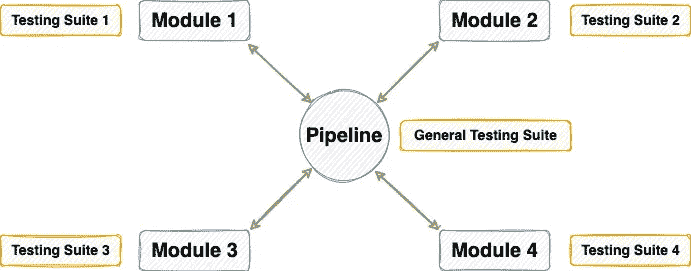

# 使用 Pytest 测试数据科学管道的简明指南

> 原文：<https://towardsdatascience.com/an-elegant-guide-to-testing-your-data-science-pipeline-using-pytest-4859b0c32591>

## 数据科学项目 Pytest 综合指南



安妮·斯普拉特在 [Unsplash](https://unsplash.com?utm_source=medium&utm_medium=referral) 上的照片

# 动机

今天的数据科学团队面临的最大障碍之一是将他们的数据驱动管道从 jupyter 笔记本过渡到可执行、可再现和有组织的文件，包括函数和类。

对于我们大多数人来说，在数据科学项目的生命周期中，在 jupyter 笔记本上工作是一项有趣而愉快的任务。

然而，构建一个没有错误的、经过充分测试的、可靠的、在生产中不会中断的数据管道却不是这样。

例如，设想这样一种情况，您在数据管道中编写了一个函数，将两个数相除:

在 jupyter 笔记本中工作时，作为程序员，您知道应该在方法中放入什么，以及期望输出什么。

想想在这个简单的划分中到底会有什么地方出错，你在没有测试的情况下把这个方法推向生产**，**，你猜怎么着？

分母为零时管道崩溃！

因此，为了减少数据管道中的错误，并确保函数按照预期的方式工作，在将代码投入生产之前，根据不同的示例输入(或数据情况)对它们进行测试是非常重要的一步。

换句话说，这里的目标是为管道创建一个可靠的自动化框架。

首先，自动化框架被定义为一种有组织的方法来编写测试用例，执行它们，并报告自动化测试的结果。



测试框架概述(图片由作者提供)

通常，您应该始终测试数据科学项目中的函数，因为它:

*   确保代码端到端按预期运行，从而提高可靠性。
*   帮助您检测不同方法可能失败的边缘情况。
*   允许其他团队成员在测试的帮助下理解您的代码——降低代码复杂性。
*   在不干扰其他功能的情况下，帮助用优化/改进版本交换现有代码。
*   支持生成关于代码的可操作见解，如运行时、预期输入/输出等。

谢天谢地，Python 提供了少数开源库，如 [unittest](https://docs.python.org/3/library/unittest.html) 、 [nose](https://nose.readthedocs.io/en/latest/) 、[behavior](https://behave.readthedocs.io/en/stable/)等。，但在 Python 开发者社区中脱颖而出的是 [**Pytest**](https://docs.pytest.org/en/7.1.x/) 。

因此，在本文中，我将详细介绍如何利用 Pytest 为您的数据科学项目构建测试套件。

我们开始吧🚀！

# Pytest 入门

作为一个快速介绍，Pytest 是一个测试框架，用于编写测试代码，在 Python 中的编码管道上执行它们，并生成相应的测试报告。

在我看来，Pytest 最大的优点是它与数据管道集成的直观和简单的过程。

测试已经是一项数据科学家们不太感兴趣的工作了。

在这方面，Pytest 真正使编写测试套件的任务变得简单而有趣，这反过来极大地有助于确定数据科学项目的可靠性。

要安装 Pytest，请执行以下命令:

接下来，您应该导入 Pytest 来利用它的核心测试功能。

这样，您就可以编写测试用例并执行它们了。

# 将 Pytest 投入使用

我们已经在`project.py`中编写了`divide_two_numbers()`方法。

接下来，让我们为测试创建一个单独的文件(`test_file.py`)。

```
project
├── project.py
└── test_file.py
```

对于我们上面定义的方法(`divide_two_numbers()`)，我们来写一个测试函数。

这将根据不同的输入检查该方法返回的输出的数据类型。

要执行这个测试功能，打开当前工作目录中的命令行并运行命令`pytest`:

正如所料，该方法在第二次断言时失败，分母为零，这允许您更正函数。

所有这些都很好，但现在你应该有两个问题:

1.  在上面的`pytest`命令中，我们从未指定测试文件的名称。然而，在结果中，我们只看到了对`test_file.py`的提及。Pytest 是如何推断出`test_file.py`是我们列出所有测试用例的特定文件的？
2.  接下来，pytest 是如何找到它需要执行的方法的？换句话说，pytest 是如何将`divide_two_numbers()`与`test_divide_two_numbers_method()`区分开来，并指出测试用例是在后一种方法中列出的？

答案在于 Pytest 中的“测试搜索”(也称为“测试发现”)技术。

# Pytest 中的测试搜索

Pytest 实现了以下测试发现方法来查找测试函数、文件和 Python 类:

1.  如果在 Pytest 执行期间没有指定目录(或文件), Pytest 将从当前目录开始发现，并递归到子目录中。
2.  在每个目录中，它在文件名中搜索一个模式:`test_*.py`或`*_test.py`。这就是为什么在上面的测试中，`project.py`文件没有被选中。
3.  从模式匹配的文件中，它收集:

*   一个 Python 类的所有`"test”`前缀方法**在**之外。例如，从下面的方法中，只有`test_method1()`会被收集，而`method2_test()`不会。

*   所有`"test"`前缀的方法**在**内，一个`"Test”`前缀的 Python 类没有`__init__()`方法。

例如，在上面的代码块中，从`Test_Class1`开始，只有`test_method1()`会被收集，因为它以关键字`"test"`为前缀。

此外，不会从`Test_Class2`收集任何方法，因为它有`__init__()`方法。

最后，不会从`Class3_Test`收集任何方法，因为类名没有以关键字`"Test"`为前缀。

## 自定义测试搜索

虽然 Pytest 的默认测试发现机制直观明了，但是在某些情况下，您可能需要定制测试搜索模式。

为此，您可以在项目根目录中声明的配置文件(`pytest.ini`)中配置不同的命名约定。

> Pytest 还支持对文件扩展名`.ini`的替代，你可以在这里阅读[。](https://docs.pytest.org/en/7.1.x/reference/customize.html#config-file-formats)

该目录现在的结构如下:

```
project
├── project.py
├── test_file.py
└── pytest.ini
```

我们在配置文件中设置了三个变量来定制搜索模式。这些是`python_files`、`python_classes`和`python_functions`。这里有一个例子:

使用这种搜索模式，Pytest 将在以`"check_"`为前缀的文件中搜索测试函数。

此外，测试函数也应该以`"check_"`为前缀。

最后，测试类(如果有的话)应该以关键字`"_Check"`结尾，以便考虑进行测试。

现在，如果我们运行`pytest`命令，我们会得到以下输出:

Pytest 未识别出任何测试，因为新定义的测试搜索模式与目录中的任何方法和文件都不匹配。

要纠正这一点，您应该将`**test**_file.py`重命名为`**check**_file.py`，将`**test**_divide_two_numbers_method()`重命名为`**check**_divide_two_numbers_method()`。

```
project
├── project.py
├── check_file.py
└── pytest.ini
```

遵循测试搜索模式后，我们重新运行该命令并获得以下输出:

在这里，我删除了被零除测试用例。

要获得详细的测试输出，请在运行`pytest`命令时使用`-v`选项。

# 标记测试

假设您的管道中有各种模块，它们一起工作来完成一个共同的目标。



具有多个模块的代码管道(图片由作者提供)

当然，每个模块也可能有自己的测试套件。

假设您对一个特定的模块(比如说模块 1)做了一些修改，您希望在提交修改之前对其进行测试。

在这种情况下，运行整个测试套件将是多余和耗时的，因为您没有对管道的其他模块进行任何更改。

此外，其他模块可能已经在之前的测试运行中彻底测试过。

这就是 Pytest 中的测试标记派上用场的地方。

顾名思义，标记允许您将测试组织成不同的类别。

在测试时，您可以使用这些标记通过 Pytest 运行特定的测试——避免不必要的计算和运行时使用。

从技术上讲，您可以使用`@pytest.mark.{marker-name}`装饰器来标记一个测试。

## 实现标记

在上面的划分示例中，让我们定义四种不同的测试方法，如下从`check_function1()`到`check_function4()`:

要标记测试函数，您应该导入标记，如上所示。

接下来，我们用`mark.non_zero_input` decorator 标记前三个方法，用`mark.zero_input` decorator 标记最后一个方法。

当您定义一个自定义标记时(就像我们上面所做的)，在配置文件中指定它是一个好的实践(`pytest.ini`)。

它有两个主要好处:

1.  它避免了 Pytest 可能抛出的任何不必要的警告。
2.  如果有人想了解您的管道及其测试套件，在配置文件中声明自定义标记可以帮助他们了解他们的角色，这将有助于他们毫无麻烦地使用您的代码。

您可以在配置文件中声明自定义标记，如下所示:

接下来，假设您只想运行那些对应于`non_zero_input`标记的测试函数。

您可以使用命令:`pytest -m {marker-name}`来做到这一点。下面演示了这一点:

在上面的测试输出中，我们注意到 Pytest 忽略了`check_function4()`进行测试，只采用了在`non_zero_input`标记下定义的前三个方法。

## 关于 Pytest 中的标记要知道的事情

除了我们上面讨论的关于 Pytest 标记的概述之外，还有一些关于它们的事情你应该知道。

## → #1 一个功能可以有多个标记

在 Pytest 中，测试函数不一定属于单个标记。相反，您可以将多个标记定义为单个函数的装饰者，如下所示:

## → #2 您可以为整个班级定义一个标记

对于编写模块化代码，Python 中的类通常是测试代码管道的首选，因为一个类通常有多个方法。

要为类中定义的函数声明一个标记，可以为整个类指定一个标记，Pytest 将其扩展到类中的每个方法。

但是，如果希望不同的方法属于不同的标记，也可以为类中的每个方法单独声明标记。

## →# 3 py test 中的一些预定义标记

除了上面讨论的自定义标记，Pytest 还提供了一些标记，涵盖了开发人员在测试过程中可能需要的一般功能。

*   `**mark.skip**`:顾名思义，在一个方法上声明这个标记，是为了在测试过程中有意跳过它。例如，考虑下面的测试:

现在，如果您执行`pytest`命令，我们会得到以下输出:

在上面的输出中，我们注意到一个**跳过了**测试，以及在为方法定义`skip`装饰器时指定的原因。

*   `**mark.xfail**`:Pytest 提供的另一个有用的固有装饰器是`xfail`(简称 *expected-failure* )。

假设您意识到一个特定的测试函数没有被正确编码。因此，您预期它在某些情况下会失败。

使用`xfail`标记，您可以在您的测试套件中将测试功能标记为预期的失败。

现在，如果您执行`pytest`命令，我们会得到以下输出:

在上面的输出中，我们注意到一个 **XFAIL** 测试，以及在为该方法定义`xfail`装饰器时指定的原因。

您可以使用以下命令在 Pytest 中找到预定义标记的完整列表:

# 书写固定装置

编写模块化代码是开发大型项目的关键步骤。良好的开发实践表明:

> 如果你写同样的代码两次，你就做错了！

这同样适用于设计测试套件。

Pytest 中的 Fixtures 类似于项目中的通用函数，可以在管道中的任何地方使用。

唯一的区别是函数应该显式导入，而 fixtures 则不需要。

Fixtures 不仅减少了您编写的代码量，还使您的测试套件简明易懂。

## 创建夹具

通常，在 Pytest 中，您应该在一个独立于测试用例的文件中声明您的 fixtures。

出于演示目的，让我们创建一个文件`conftest.py`。

```
project
├── project.py
├── test_file.py
├── conftest.py
└── pytest.ini
```

在`fixture`装饰器的帮助下，夹具被声明如下:

在这个例子中，我们的目标是针对相同的输入测试加法和减法模块。

一种简单的方法是在两个函数中定义测试输入。

然而，使用 fixtures，您可以将测试输入作为参数传递给测试方法。

测试函数**收到的参数应该与夹具名称`test_inputs`相同**。

此外，如果你注意到，我们从来没有进口设备。

> 永远记住，您在 fixtures 文件中创建的任何 fixture 都可以被当前目录和每个子目录中的每个测试函数递归地访问。

现在，如果我们执行`pytest`命令，我们会得到以下输出:

总而言之，在`pytest.fixture`装饰器的帮助下，我们在一个单独的文件中定义了一个夹具。

当 fixture 的名称作为任何测试方法中的参数传递时，Pytest 获取 fixture 返回的对象。

## 固定装置的范围

在上面夹具的定义中，我们在装饰器中传递了`scope`参数。

从本质上讲，设备的主要目的是分发信息。

在 fixture 声明的上下文中，Scope 定义了当被测试函数调用时，fixture 应该多长时间返回一次对象的新副本。

例如，在上面的例子中，`scope=’function’`表示 fixture 将为每个函数创建一个新的输入列表副本。

换句话说，fixtures 是在测试第一次请求时创建的，并根据它们的`scope`销毁，T1 可以取以下五个值之一:

*   `scope = 'function'`:这是 fixture 的默认范围，每个测试功能创建一个新的副本。
*   `scope = 'class’`:夹具的单个副本可用于一个类中的所有测试方法。
*   `scope = 'module'`:每个模块调用一次夹具。
*   `scope = 'package'`:夹具的作用范围在包级别。
*   `scope = 'session'`:测试套件的每次运行只创建一次 fixture。

# 结论

至此，我们结束了关于使用 Pytest 开发测试套件的介绍性博客。恭喜你！

我希望这篇文章让您详细了解了为什么测试是必不可少的，以及如何利用 Pytest 来测试您的数据科学项目。

还有几件事，比如参数化，生成测试报告等。我很快会在另一篇博客中发表:)

**感谢阅读！**

[🧑‍💻**成为数据科学专家！获取包含 450 多个熊猫、NumPy 和 SQL 问题的免费数据科学掌握工具包。**](https://subscribepage.io/450q)

✉️ [**注册我的电子邮件列表**](https://medium.com/subscribe/@avi_chawla) 不要错过另一篇关于数据科学指南、技巧和提示、机器学习、SQL、Python 等的文章。Medium 会将我的下一篇文章直接发送到你的收件箱。

我喜欢写基本的数据科学概念、工具、技巧和诀窍。你可以在 LinkedIn 上和我联系。