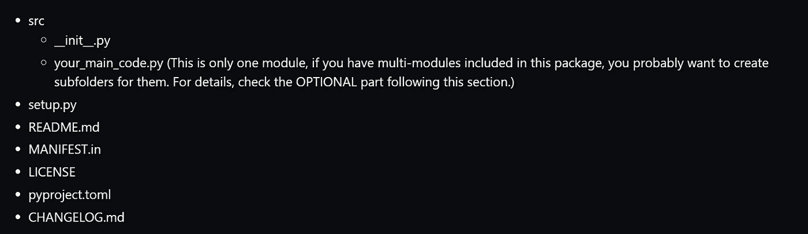
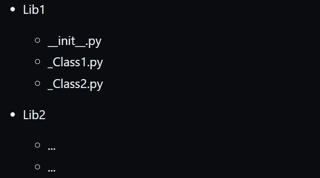

# 用于发布 Python 包的 GitHub 库

> 原文：<https://towardsdatascience.com/an-end-to-end-guide-to-publish-your-python-package-bdb56639662c>

## 这是一个端到端的演示，旨在促进共享开源软件或内部工作的过程


照片由[西格蒙德](https://unsplash.com/@sigmund?utm_source=unsplash&utm_medium=referral&utm_content=creditCopyText)在 [Unsplash](https://unsplash.com/s/photos/upload?utm_source=unsplash&utm_medium=referral&utm_content=creditCopyText) 拍摄

这是一个共享代码的端到端演示。该项目旨在帮助您理解如何在 PyPI 上正确地对外发布您的 python 模块/包，并在内部与您的同事分享您的工作。我还为你准备了 GitHub 回购，让你的生活更轻松。

更多详情可以直接去这个回购: [GitHub 回购](https://github.com/jinhangjiang/Your-First-Python-Package-on-PyPI)

# 第一步

分别去下面两个网站注册自己的账号。

*   PyPI 测试:[https://test.pypi.org/](https://test.pypi.org/)
*   PyPI:[https://pypi.org/](https://pypi.org/)

注意:如果您不想公开发布您的软件包，可以跳过这一部分。此外，我强烈建议首先在测试网站上尝试您的包，以避免上传过程中的错误。因为你在 PyPI 上对你的包所做的任何改变都是不可恢复的，上传错误可能会导致你的包补丁出现故障。你要避免这种情况！！

# 第二步

选项 1:将这个库[分支到您自己的 GitHub 帐户，并在您的本地。您可以在 GitHub 上进行大部分的修改，但是您需要通过 cmd 发布您的包，并且这些文件在本地可用。](https://github.com/jinhangjiang/Your-First-Python-Package-on-PyPI)

选项 2:手动创建必要的文件。这里是您需要的核心文件列表:



作者图片

我知道这很难接受。但是请原谅我。您只需要对其中一些进行必要的修改，其余的将保持默认设置。

# 可选—多个模块

假设您有多个类，它们的函数在不同的文件中创建。您希望使文件夹(或子文件夹)遵循以下约定:



作者图片

在每个文件夹中，更新“__init__”。py”通过这样做:

在主文件夹中，更新“__init__”。py”通过这样做:

然后，用户将能够像这样正确地导入您的库:

如果你想从主(前一个)文件夹中导入一些东西，你应该这样做:

请考虑在您的“__init__”中添加一个列表。py ”,以便用户可以检查哪些功能可用:

# 第三步

在 cmd 中安装以下 python 包:

# 第四步

按照您想要的任何顺序进行以下更改:

1.  用自己的 python 包替换 src 文件夹中的 your_main_code.py，并保留“__init__”。如果你只是发布一个模块。
2.  对 setup.py 进行更改，说明包含在该文件中。
3.  挑选你自己的执照。打开许可证文件，单击“编辑”，单击“选择许可证模板”，然后选择满足您需求的许可证。如果你不知道哪个许可证适合你，你可以使用麻省理工学院的许可证，这是最常见的选择之一。或者，你可以用这个链接来挑选一个:[https://choosealicense.com/](https://choosealicense.com/)
4.  更新 CHANGELOG.md 以反映版本信息
5.  可选:创建一个“test.py”并将该文件放在 tests 文件夹中。或者，如果您确信您的模块一切正常，您可以删除整个文件夹。
6.  删除这个“README.md”文件中的所有内容，并用您的软件包的详细描述更新该文件。

# 第五步

对于步骤 5，您有多种选择来执行其余步骤。这里有两个例子:

1.  在 cmd -命令提示符下执行此操作

*   在您的本地中，打开 cmd，导航到您的软件包所在的目录，然后键入以下内容:

2.在 Jupyter 笔记本终端中完成:

# 第六步

在这一步中，我们将使用 cmd/terminal 中的以下代码来构建您的包:

运行代码后，您将在当前目录中看到以下两个文件夹:

*   建设
*   距离

在 dist 文件夹下，你会看到一个名为“TheNameofYourPackage-the versionofyourpackage . tar . gz”的‘tar’文件。到目前为止，如果您不需要公开发布您的代码；相反，如果您只是想与您的朋友或同事共享您的代码，您可以只与他们共享这个文件。他们只需执行“pip 安装”即可使用您的代码:

# 可选—在 PyPI 上测试您的包

现在，您将要向 PyPI 发布您的包。在你公开它之前，你可能想做的另外一件事是测试一旦人们下载了它们，你的包是否会像预期的那样工作。您可以做的是创建一个名为“test”的文件夹，并创建一个 test.py，其中包含您的包的一些示例实现。然后，**在你的 cmd/终端中输入“pytest”。如果一切正常，它将自动运行 test.py 并通过测试。**否则，它会引发错误，您应该在进入下一步之前相应地修复错误。

还有一件事你可能想试着测试一下你的包的架构是否适合。在 cmd/terminal 中，键入以下代码:

您应该会看到类似这样的内容:

```
Checking distribution dist/TheNameofYourPackage-TheVersionofYourPackage-1.0.0-py3-none-any.whl: PassedChecking distribution dist/TheNameofYourPackage-TheVersionofYourPackage.tar.gz: Passed
```

# 第七步

将您的包上传到 TestPyPI:

然后，您会在 TestPyPI 上看到一个指向您的包的测试版本的链接。看看吧！如果有任何打字错误或不兼容的错误，在把你的包上传到真正的 PyPI 之前修复它们。

现在，这是最激动人心的时刻，将您的包上传到 PyPI，帮助我们社区中成千上万的人:

至此，您的软件包应该已经正式上线，可以由任何人在任何时间、任何地点进行“pip 安装”。重大时刻！我仍然记得当我看到我的第一个包裹时的感觉。我告诉自己，这就是我编码的原因！

***恭喜恭喜！！！***

# 一些提示

*   每当你想更新你的软件包时，你应该删除“build”和“dist”文件夹，修改你的代码，编辑“CHANGLOG.txt”文件，并修改“setup.py”中的版本号。并重复步骤 5–7。
*   您可以在更新后通过以下方式升级您的软件包: *pip 安装您的软件包名称—升级*
*   你总能在 PyPi 上找到你的包裹:[*http://pypi.org/project/YOURPACKAGENAME/*](http://pypi.org/project/YOURPACKAGENAME/)
*   不要随意发布包。尽管对你能发表什么或不能发表什么没有硬性限制，但要确保你上传的东西实际上是有意义的，并且有人会从你的工作中受益。