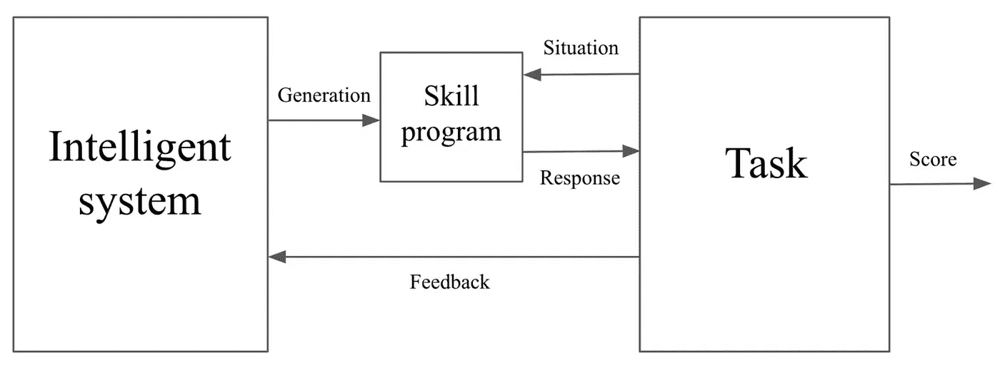

# 智力的方程式

> 原文：<https://towardsdatascience.com/an-equation-for-intelligence-f522055675fd>

从 [unsplash](https://unsplash.com/photos/OgvqXGL7XO4)

## 出自弗朗索瓦·乔莱:《论智力的尺度》

纵观历史，智力的衡量标准已经发生了巨大的变化，以适应不断变化的思想和对不同人群和动物的态度。近几十年来，智能的可能性正在向机器延伸。

许多人试图用语言来阐明智力的标准:这里有滑动的空间，智力的应用必须由一个外部因素来评估，而不是仅仅由被测量者来证明。其他人做出了令人信服的哲学主张，即智力以及代理、自由意志、人格等下游标签不是人类首先要强加的(参见冈克尔，*《机器问题*)。更进一步，一些哲学家断言投射在机器和其他人的地位上的存在主义焦虑是一个虚假的形象:一个掩盖内部冲突和紧张的面具(参见齐泽克，*绝对反冲*和*性和失败的绝对*)。

尽管如此，许多人还是希望有一个客观的智力衡量标准。在具有里程碑意义的论文[《论智能的度量》](https://arxiv.org/pdf/1911.01547.pdf)中，Francois Chollet 可能推进了这项事业:Chollet 提出了一个系统智能的表达式。他在论文中提供了许多其他有趣的观点，但这篇文章的目标是提供一个(相对)简短，(相对)平易近人，(相对)简化的等式所代表的内容的概述。请阅读这篇文章，更深入地了解这里的动态。

## 智力的属性

*   *聪明在于适应性和概括性而不是技能本身*。仅仅为了下棋而构建的程序是不智能的，但是能够有效地学习下棋的通用代理可以被认为是智能的。
*   *智力的测量必须控制先验，并量化概括/适应性的强度*。从强先验(初始信息)开始的模型比从弱先验开始的模型更容易学习任务，但这并不意味着它更聪明。智能必须被语境化——它不仅必须理解系统的当前状态，还必须理解它来自哪里。
*   *AI 将军必须以人类智能为基准*。它本质上是最低限度的人类中心主义。没有“通用的”智力标准。但这并不意味着我们不能测量智力:我们只需要理解参考点。同样，在物理学中，我们可以测量速度，即使它在相对参考系中运行。

## 形式化组件

出自[《论智力的衡量》](https://arxiv.org/pdf/1911.01547.pdf)

一个*智能系统*负责生成*技能程序*——这些是‘静态’决策程序，接受来自*任务*的*情况*(输入信息)并发出相应的*响应*。响应的适当性用于确定任务*分数*并向智能系统提供*反馈*。反馈用于改进进一步技能程序的生成。

考虑深度学习:技能程序是神经网络的前馈通道，是一系列静态的计算矩阵运算。情况是输入的数据；响应就是输出。反馈是损失，它被发送回智能系统——在这种情况下，是反向传播。这里，反向传播是用来创建适应性程序的“智能”算法。

但也有其他配置:一些神经架构搜索系统使用控制器神经网络来提出候选神经网络架构；在这种情况下，控制器神经网络就是智能系统。或者，一些语言模型可以编写函数脚本；语言模型是智能系统(技能程序是文字生成的字符串输出)。

但重要的是要理解，这是一个通用框架，用于形式化智能系统如何与环境交互，以解决环境中的任务并从中学习。它可以应用于经典的机器学习、人类和动物心理学，甚至是我们尚未探索的未来形式的协同学习。

## 一个智力方程式，用语言来说

引用自 Chollet 的话:“系统的智能是对其在任务范围内的技能获取效率的度量，涉及先验、经验和概括难度。”

详细说明:如果一个系统是智能的，它能够…

*   获取技能(在不熟悉的领域学习新问题)
*   有效地(最佳利用资源，例如零/一/少量拍摄)
*   在任务范围内(不是一组受限的域)
*   关于先验(系统开始时有多少信息)
*   经验(系统通过培训获得了多少信息)
*   和推广难度。(任务的“难度”)

让我们开始构建我们的正式方程式！

## 原子

我们将从定义关键变量开始，首先呈现 Chollet 的符号，然后是描述。这是一个沉重的符号负担，但为了理解最终的结果，它值得熟悉。

一个*任务*。

一个*课程*——在训练过程中智能系统和任务之间的一系列交互。

*足够技能阈值* —系统被认为具有“足够技能”的某项任务的掌握程度 *T* 。学习如何骑自行车有一个足够低的技能门槛；学习如何进行脑外科手术有一个更高的。

在 T 达到足够技能水平的*值——系统在一项任务中获得足够技能的“令人印象深刻”或“重要”程度。执行 CPR 具有相对较低的足够技能水平，但是在拯救人类生命的背景下具有高价值。*

来自智能系统的课程空间，为一项任务生成足够技能的解决方案。在其他方面，一个系统在与信息(即课程)交互方面可以采取的所有可能的途径，以允许它最终达到或超过给定任务的足够技能阈值。

给定课程发生的概率；即智能系统将被呈现给*的概率，即*环境/任务对信息的特定顺序和选择。

*系统解*——达到技能阈值的任务 *T* 的最短解。

给定一门课程的 *T* 最短最优培训时间解。也就是说，在给定一系列呈现给模型的数据的情况下，任务的最优解决方案，而系统解决方案是任务整体的最优解决方案。这两种解决方案可能不一样。

字符串的算法复杂度。通用图灵机上输出字符串的最短程序的长度。点击查看更多关于 Kolmogorov 复杂度[的内容。](https://en.wikipedia.org/wiki/Kolmogorov_complexity)

一个字符串 *s2* 拥有的相对复杂度约为 *s1* 。给定 *s2* ，产生 *s1* 的通用图灵机上最短程序的长度。这表面上是程序间相似性的度量。

## 分子

我们将开始把原子组装成更复杂的组件。方程式很快就要出来了——坚持住！

*以系统为中心的泛化难度*。由最短训练时间解决方案解释的系统解决方案的算法复杂性的比例。这代表了从训练经验中归纳出解决一项任务中以前没有的部分是多么困难。如果训练集和真实任务有天壤之别，那么泛化难度就非常大；如果它们是相同的，那么一般化是微不足道的。换句话说:“训练制度的解决方案和任务的‘真实’解决方案有多相似？”在损失最小化的狭义背景下——“培训损失情景的全局解决方案离真实损失情景的全局解决方案有多远？”

*开发者意识到的泛化困难*。由训练解*和*系统初始状态解释的系统解的算法复杂度的比例。与以系统为中心的开发人员不确定性相同，除了智能系统的初始状态也被考虑在内:这允许我们考虑先验知识——系统在学习开始时可能已经具有哪些信息或优势。如果系统的初始状态与最优训练解非常相似，那么开发者意识到的泛化难度相当低。

*智能系统的先验*。由初始系统状态解释的最短解决方案(在技能阈值θ的任务 *T* 的)的算法复杂度的比例。如果最优解与初始系统状态非常不同，那么分子(和整个表达式)将被最小化。另一方面，如果最优解与初始系统状态非常相似，那么分子(和整体表达式)将最大化。

*步骤 t 的经验*。在步骤 *t* 由智能系统接收的相关信息和新信息的数量。计算为{最优解和智能系统的当前状态之间的相似性}和{最优解和智能系统的当前状态以及在步骤 *t* 遇到的新数据之间的相似性}之间的差。如果新数据补充了现有状态，使其更接近最优解，则第二项将最小化，整体表达式将最大化。

*课程经历*。智能系统在课程中接收的相关信息的度量；时间 *t* 时所有时间步的经验的简单总结。

## 智力方程式

我们将只看 Chollet 的*充分情况*方程(相对于最优情况方程)。智能是相对于智能系统(is)、足够技能阈值(θ-*T*)和任务范围来定义的。

让我们把这个等式分解成几个组成部分。

这是*关于问题*的总系统暴露信息:先验(系统初始化时它已经拥有的任何信息)加上经验(它在学习/适应过程中获得的任何信息)。

因此，下面的内心表达…

…在导致智能系统获得足够技能水平的所有可能的课程中，取该路径的情境化难度的加权平均值(按每个课程的概率加权， *P_C* )。难度计算为概括难度除以总系统信息暴露:如果概括难度非常高，但总信息暴露非常低，则课程路径具有高情境化难度:它必须用更少的资源克服更高的障碍以获得足够的技能。

总的来说，上面的表达式测量了在给定任务 *T* 中获得足够技能的总难度。

这是在 T 中达到足够技能等级的*主观值。回想一下，第二项表示足够技能阈值，第一项表示获得这种足够技能水平的值。将它们相乘可以让我们理解在给定的任务中达到足够的技能水平作为一个产品是多么有价值(字面意思！)这两个维度。*

现在，我们将在任务 *T* 中达到足够技能水平的主观值乘以总难度和范围内所有任务的平均值，以获得整体系统智能。

以这种方式，高智能系统高效地为高概括难度的任务生成高技能的解决方案，即，具有相对较低的信息量(先验、经验或两者)。**智力，这样表述，就是经验转化为技能的转化率*。***

## 智能形式化的性质

在这里，我们将注意到一些相关的观察和 Chollet 的特殊智能方程形式化的含义。

*   智力与范围相关，即被评估的任务的广度。
*   技能是模型输出的一个属性，而不是模型本身的一个内在属性。
*   智能必须包括学习和适应。
*   智力不能仅仅在最高的抽象层次上进行插值。
*   智能与课程优化(即学习过程)无关。
*   计算依赖于智能的合成程序，但不依赖于程序本身是如何合成的。

## 对研究的影响

*   智能可以作为一个优化问题来处理，就像 ImageNet 上的 top- *k* accuracy 在 2010 年代作为计算机视觉的一个刺激优化程序一样。参见[抽象推理文集挑战](https://github.com/fchollet/ARC)。
*   关注更广泛的能力和适应性，而不是狭隘的技能。
*   激发对程序合成的兴趣，而不仅仅是程序输出(图灵式模型不可知论)。允许我们适应更高层次的抽象。

感谢阅读！

而且，如果你对最新的文章感兴趣，可以考虑[订阅](https://andre-ye.medium.com/subscribe)。如果你想支持我的写作，通过我的[推荐链接](https://andre-ye.medium.com/membership)加入 Medium 是一个很好的方式。干杯！