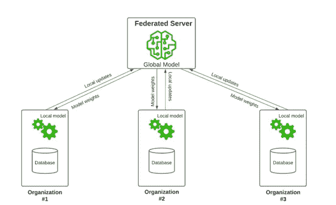

# 隐私保护联邦学习的探索(附代码)

> 原文：<https://towardsdatascience.com/an-exploration-of-a-privacy-preserving-federated-learning-system-7944fb284061>

## 为了更好地理解解决一些机器学习问题的思路

杰森·登特在 [Unsplash](https://unsplash.com?utm_source=medium&utm_medium=referral) 上拍摄的照片

**机器学习虽然是一项非常强大的技术，但似乎也知道一些缺点。例如，对数据的巨大需求和对神经网络的可能攻击，将在后面讨论，有望用一些隐私保护的联邦学习来回答。**

## 题目是什么意思？

首先，我们快速讨论一下什么是联邦学习。今天，机器学习被任何想要更深入地理解他们的数据集并对一些分类/回归任务建模的人广泛使用。然而，要实现可能的最佳模型，需要大量数据，而这些数据可能很难集中在一个地方。因此，如果拥有自己的数据切片的多个用户可以将所有东西组合起来模拟一个大数据集，然后获得一个非常好的模型，会怎么样？这是联邦学习的主要思想。

现在，如果这些用户不想分享他们自己的数据，但仍然希望使用每个人的数据聚合来建立一个不错的机器学习模型，该怎么办？例如，一个用户可能是一家医院，癌症检测模型所需的数据不能按原样发送，因为患者显然会不同意。即使是非匿名化的数据也可能存在隐私风险。

一种想法是不发送准确的数据，而是添加一些噪声，这样接收者就不会获得真实的数据。然而，如果我们添加太多的噪声，我们的数据可能会变得无关紧要，学习算法可能找不到任何有用的东西。联合学习系统不是直接共享数据，而是每个用户可以使用自己的数据计算的梯度或权重。

> 如果你对权重或梯度的概念感到不舒服，这里有一个神经网络世界的快速介绍。

我们现在有一个多用户的系统，在将模型发送给其他人之前，用户可以单独更新他们的模型。有一个中央服务器，它首先发送模型的初始参数，然后接收每个用户的结果。此时，服务器可以通过对所有接收到的梯度求和，将不同的模型组合成一个模型，并用平均的新值更新权重。

图片来自[https://sparkd.ai/archives/4444](https://sparkd.ai/archives/4444)，联合学习原理

## 这样够隐私吗？

第一部分介绍了保护每个用户对数据的访问的解决方案。然而，敌对的机器学习领域知道一些攻击(白盒，黑盒)，当用户发送其更新的权重时，这些攻击再次引发问题。事实上，简而言之，向世界展示我们的模型也展示了我们的数据，并且由于服务器和每个其他参与者都知道架构，发送我们的权重允许他们尝试白盒攻击来检索我们的数据。

为了解决这个新问题，我们现在可以转向密码学，更确切地说，转向同态加密。事实上，这种加密不仅将我们的纯文本(或权重)转换为密码文本，还允许对其进行一些基本计算。因此，服务器仍然可以将所有接收到的权重聚集到主模型的一个全局更新中，而无需访问这些值。服务器完成的聚合结果将被初始发送者读取。

同态加密需要一些数学知识才能完全理解，所以让我们试着抓住要点。考虑一个函数 *f(x) = 2x。*该函数保留加法，使得 *f(x+y) = f(x) + f(y)* ，但不保留乘法。我们希望我们的加密方案是完全同态的，因此它必须至少保持加法和乘法。

存在各种同态加密方案，但是我们稍后将在我们的实现中使用 CKKS [1]，因为它允许使用浮点数，并且权重通常被描述为在 0 和 1 之间。我们还想将总数除以参与人数 *n* ，或者乘以 *1/n* 。首先，加密使用公钥和私钥。评估密钥也用于评估对密文的操作。明文和密文空间被定义在多项式环上，允许一些重要的操作性质。

为了允许多个用户对系统和模型进行训练，我们需要使用先前加密方案的多方同态加密版本。

总之，使用当前我们的解决方案，数据仅由所有者使用，并且模型权重总是被加密，因此服务器的扫视或窃取是不可能的，并且我们的数据是保密的。

## 真的管用吗？

嗯，根据[这篇论文](https://arxiv.org/pdf/2009.00349.pdf)【2】，是的。最终的模型获得了接近几种常见问题的公共方法的精确度。

事实上，我们遵循并行随机梯度下降(SGD)算法[3]。这相当于批量更大的单节点 SGD。它不应该与“模型平均”混淆，后者一次使用多个模型进行预测。在这里，我们只用一个模型完成了训练阶段。

但是，我们应该注意，联合学习容易受到中毒攻击。事实上，如果网络中的一个节点受到损害，并由于错误或可能的攻击而决定发送错误的结果，最终的模型将产生不好的结果。一个简单的防御措施是删除“异常值”权重更新，并可能禁止负责节点参与剩余的学习阶段。这个对手节点可以通过对输入权重的组合进行反复试验来找到，因为权重是加密的，并且只有一些或所有权重的聚合是可能的。然而，这种技术显然不是完美的，因为坏的梯度可能仍然适合界外边界，或者大多数节点可能是恶意的，导致梯度的错误的假定平均值。

[本文](https://www.ndss-symposium.org/wp-content/uploads/ndss2021_6C-2_24434_paper.pdf) [4]通过首先在服务器上引导信任，提出了一种拜占庭健壮的联邦学习系统。这是通过服务器收集参与者的每个数据集的一部分并维护其自己的模型来完成的，就像其他节点训练它们的权重一样。对于每次迭代，服务器然后基于节点变化与服务器变化的相似性，为每个节点分配“信任分数”。然而，遗憾的是，访问用于比较的权重将意味着它们不再被加密，因此这个解决方案不适用于我们的情况。此外，服务器训练的本地模型需要我们不想共享的数据。因此，我们需要确保每个节点都是认真的，不会以我们自己的方式妥协。

并行化的 SGD 及其聚合是与经典机器学习的唯一真正区别，因为项目的其余部分是关于加密数据的传输。我们可能会经历更长的训练时间，因为我们正在使用的非对称加密非常慢，但作为回报，我们使用的数据比我们自己可以拥有的多得多(假设其他节点正在带来相关数量的数据)。

## 怎么才能实现呢？

> [这里有一份 Golang 的概念证明，你可能会想要。](https://github.com/Arnouux/FederatedLearning) Golang 允许您简单地将 Github 存储库作为库导入，然后随心所欲地自由使用这些功能。

整个系统是密码学、机器学习和分布式系统的混合体。我们将需要一些代表用户的节点(和聚集值的服务器),能够通过 TCP 或 UDP 发送和接收消息。请注意，UDP 的消息大小限制约为 65000 字节，加密的消息可能会比这个大。如果通过 TCP 和安全通道发送，消息会更安全。目前，它们以*加密块*包的形式发送，或者当服务器响应时，以*结果*包的形式发送。

该项目的加密部分将通过使用 Golang 库 *lattigo* 来重用早先发现的方案(CKKS)。它允许我们的节点简单地加密和解密多项式中定义的权重。

最后，神经网络不太重要，因为该系统可以连接到我们最喜欢的 Python 机器学习库，该库只需要解密的权重来建立模型并对其运行反向传播步骤，然后将其重新传输到 Go 程序，该程序将重新连接到网络并加密权重。我们主要需要一个好的权重表示，允许节点在其上处理它们的梯度。

当然，在学习阶段开始之前，所有节点都必须检查它们的数据是否与其他节点的数据相匹配，再加上所决定的模型架构的输入层，否则它们将无法训练它们的模型。当使用分别由参与者和服务器发送的*加入*和*参数*数据包时，我们可以观察到这个准备阶段。

有了这样一个系统，我们现在可以启动一个服务器和多个其他节点，这些节点将加入到服务器中进行联合学习过程。一旦服务器决定了超参数加上初始权重，它就将其发送给所有参与者。他们每个人都必须遵循梯度下降步骤并计算新的权重。这些重量在通过网络之前必须被加密，因此没有人能够读取它们并推断出所使用的数据。服务器接收所有不同的权重，并在处理它们的平均值之前聚合这些值，为我们提供一个具有轻微训练过的权重的模型。此时，我们已经完成了机器学习算法的一个步骤，我们可以尽可能多地重复它，直到我们获得我们希望的模型。

[1] [J. Hee Cheon，A. Kim1，M. Kim 和 Y. Song。近似数算术的同态加密。2016.](https://eprint.iacr.org/2016/421.pdf)

[2]s . Sav、A. Pyrgelis、J . r . Troncoso-帕斯托里萨、D. Froelicher、J . P . boss UAT、J. Sa Sousa 和 J . P . Hubaux。海神号:保护隐私的联邦神经网络学习。2021.

[3] [M. Zinkevich，M. Weimer，L. Li 和 A. Smola。并行随机梯度下降。2010.](https://papers.nips.cc/paper/2010/file/abea47ba24142ed16b7d8fbf2c740e0d-Paper.pdf)

[4] [X .曹，m .方，j .刘，n .龚振强。FLTrust:通过信任引导的拜占庭健壮联邦学习。2021.](https://www.ndss-symposium.org/wp-content/uploads/ndss2021_6C-2_24434_paper.pdf)

> *感谢阅读！*
> 
> 我希望你喜欢探索联合学习，如果你有任何问题和/或建议，请在评论中告诉我。