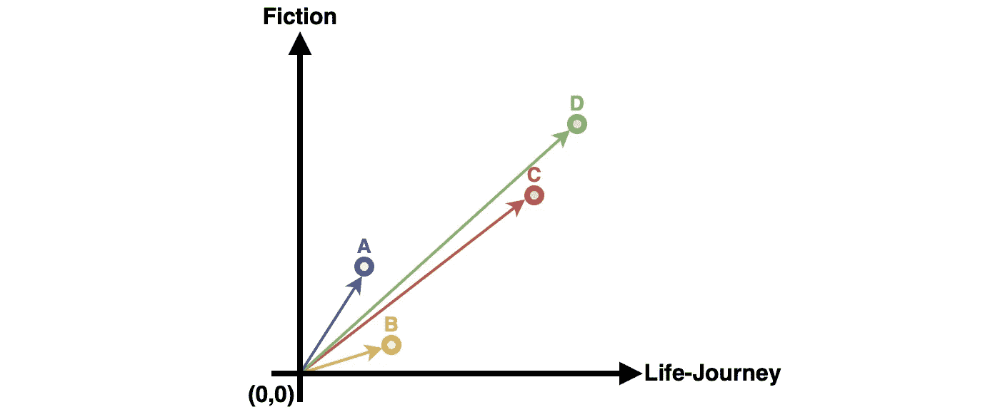
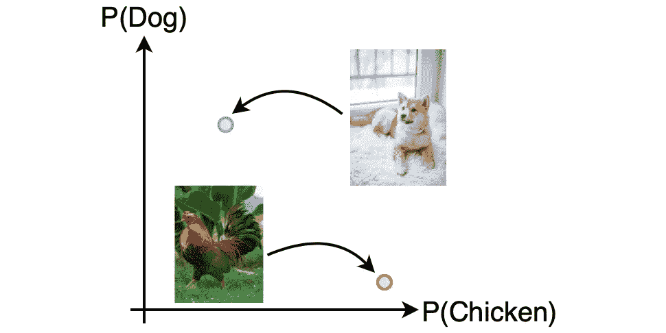
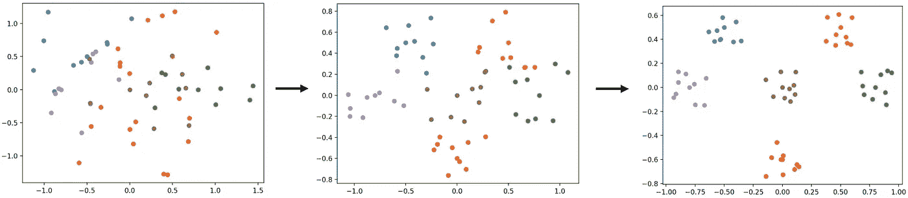
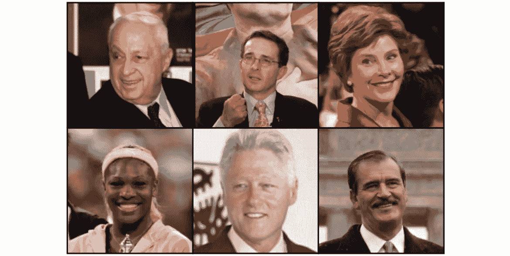
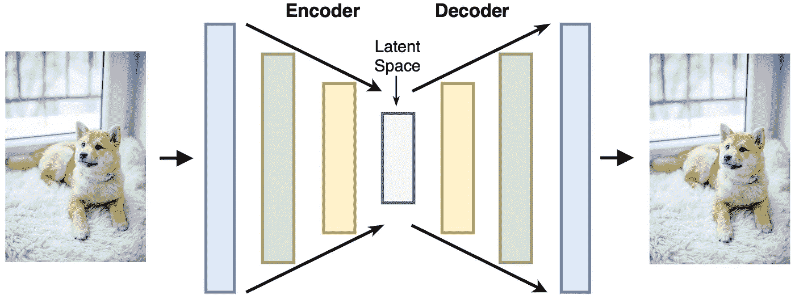
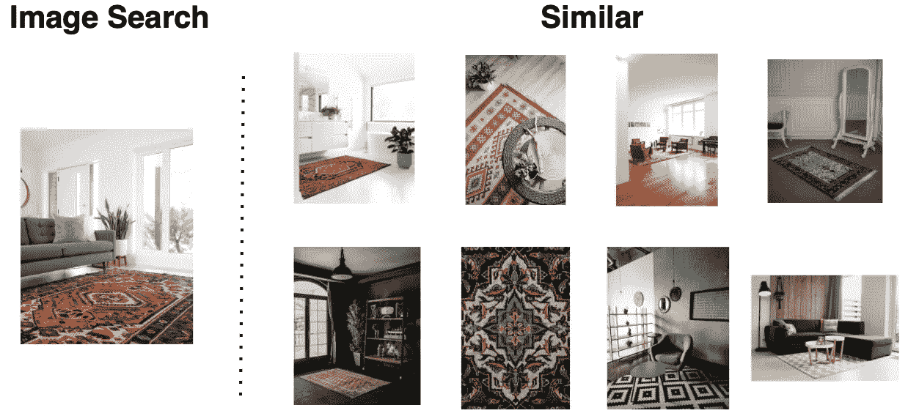

# 图像嵌入和潜在空间

> 原文：<https://towardsdatascience.com/an-extensive-introduction-to-image-embedding-and-auto-encoders-0-6-5c5d9a18fcaa>

## [对潜在空间的广泛介绍](https://towardsdatascience.com/tagged/image-autoencoder)

## 图像嵌入和潜在空间的理论和实践介绍。

由[克里斯·劳顿](https://unsplash.com/@chrislawton?utm_source=medium&utm_medium=referral)在 [Unsplash](https://unsplash.com?utm_source=medium&utm_medium=referral) 上拍摄

他们说一幅图像胜过千言万语。看看上面的图片，想象一下它告诉我们的关于树叶、树叶的颜色以及它们的生活的故事。让计算机为我们讲述其中的一些故事会很有趣，但计算机能告诉我们图像中有树叶吗？他们的颜色？还是说秋天要来了？这些对人类来说很容易，因为我们只需要看图像。但这对计算机来说更具挑战性，因为它们看到的都是数字，这对人类来说也很难理解。

好的方面是我们可以帮助计算机理解。计算机可以把图像变成更容易理解的东西。它可以将图像转换成变量，告诉它图像中物体的纹理、颜色和形状。有了这些，计算机就可以开始告诉我们图像中的故事。为了讲述这些故事，图像必须首先被*嵌入*到计算机中，然后通过*将*嵌入*潜在空间*中而转换成变量。我们将后者称为*潜在空间嵌入*以区分两者。

本书旨在从理论和实践上介绍图像嵌入、潜在空间嵌入以及不同应用所使用的技术。这本书从基础开始，向现代方法发展，所有都有例子和代码支持，使它更容易理解。

该系列包括 8 章，每一章将在以下章节中介绍。关注我，以便在我发布新章节或帖子时收到电子邮件。

1.  [嵌入、聚类和相似性介绍](/introduction-to-embedding-clustering-and-similarity-11dd80b00061)
2.  [图像嵌入和精度介绍](/introduction-to-image-embedding-and-accuracy-53473e8965f)
3.  图像潜在空间嵌入简介
4.  潜在空间中的聚类
5.  *实用:*人脸检测中的潜在空间
6.  自动编码器简介
7.  使潜在空间适应相似性
8.  *实用:*潜在空间中的产品推荐

## [第 1 章:嵌入、聚类和相似性介绍](/introduction-to-embedding-clustering-and-similarity-11dd80b00061)

在坐标系中用数字表示的知识。

第一章解释了什么是嵌入，以及如何用它来表示变量中的真实世界。每个变量都是一个问题，因为它向世界寻求知识；挑战在于提出正确的问题。问正确的问题可以影响计算机理解变量的难易程度，以及我们是否可以在应用程序中成功使用变量。

计算机很难理解嵌入的图像，这就是为什么我们现在还不去看它们。相反，我们将着眼于这些问题的简单表示，以及如何使用正确的问题来嵌入这些内容。目标是在深入研究图像之前理解嵌入的潜在机制。

## [第二章:图像嵌入和精度介绍](/introduction-to-image-embedding-and-accuracy-53473e8965f)

将图像转换成数字的过程是机器学习所必需的。由[杰斯·贝利](https://unsplash.com/photos/gL2jT6xHYOY)在 [Unsplash](https://unsplash.com?utm_source=medium&utm_medium=referral) 拍摄的图书照片

现在是时候将嵌入的概念从第 1 章扩展到图像嵌入了。在许多使用机器学习的应用中，图像是一种流行的选择。图像由小方块组成，每个小方块显示一种颜色。这些颜色放在一起就形成了整个图像。所有的颜色都可以用一个数字来表示，并被视为一个变量。

第二章尝试使用第一章中教授的方法制作一个可以识别图像中动物的应用程序。引入精确度是为了衡量这些方法识别正确动物的能力。结果表明，第一章的方法不足以实现可靠的应用，而潜在空间嵌入可以帮助我们提高精度。

## 第三章:图像潜在空间嵌入简介

通过询问图像看起来更像一只狗还是一只鸡来转换图像，并绘制在一个坐标系中。 [Valeria Boltneva](https://www.pexels.com/@valeriya/) 在 [Pexel](https://www.pexels.com/photo/brown-and-white-short-coated-puppy-1805164/) 上拍摄的狗狗照片。由 [Erik Karits](https://www.pexels.com/@erik-karits-2093459/) 在 [Pexel](https://www.pexels.com/photo/red-and-black-rooster-on-green-grass-3820303/) 上拍摄的小鸡照片。

第三章利用第二章的优点和缺点，开始探索潜在的空间嵌入。

使用第一章中关于图像的方法具有挑战性，因为相同的颜色不一定会产生相同的对象；一只狗和一只鸡都可以是棕色的，但不一样。转换可以使用标准的潜在空间嵌入器来减轻这些挑战，例如[主成分分析](https://www.sartorius.com/en/knowledge/science-snippets/what-is-principal-component-analysis-pca-and-how-it-is-used-507186)(PCA)[线性判别分析](/linear-discriminant-analysis-explained-f88be6c1e00b) (LDA)和[神经网络分类器](/machine-learning-for-beginners-an-introduction-to-neural-networks-d49f22d238f9)。PCA 和 LDA 帮助我们将 2D 的图像可视化，但是对于使图像更容易理解没有什么帮助。另一方面，神经网络分类器对计算机理解图像的能力有很大的贡献。

神经网络分类器是不完善的，在实际应用中有其自身的挑战。对神经网络进行简单的调整来应对这些挑战。没有调整是没有后果的；在第 3 章的结尾，讨论了权衡以及何时使用什么。

## 第四章:潜在空间中的聚类

目标是明确区分不同肤色的人群。

第四章解释了如何进行改进的潜在空间嵌入以更好地区分新动物。

第 3 章中提到的一些挑战是由如何训练神经网络分类器来学习一组定义的类(例如，动物)之间的差异引起的。在了解差异之后，我们可以通过询问神经网络如何得出结论来减轻这些挑战。它可能会根据动物的颜色、皮毛、腿的位置、牙齿等特征做出决定。自动编码器背后的想法是使用这些功能来伪装未来引入的新动物。

但是为什么一定要先学会识别动物，再问用什么特征呢？为什么不从一开始就学习最好的特性来区分它们呢？第 4 章介绍了结合这些想法的现代方法，以更有效地分离相似但不同的实例，如人脸。

## 第五章:实践:潜在空间中的人脸检测

著名人物的图像，作为您的系统可能想要识别的人的例子。来源:[野外贴标签的脸](http://vis-www.cs.umass.edu/lfw/)。

现在是时候在实践中使用我们的新知识了。第一个实际案例是我们建立一个系统来识别你的哪个朋友在一张照片里。我们将看到专注于分类的潜在空间嵌入如何创建一个可扩展的系统，在这个系统中，你可以轻松地添加新朋友，而不必担心将陌生人识别为你的朋友。

## 第 6 章:自动编码器简介

在用编码器将图像变换到潜在空间之后，自动编码器通过训练神经网络用解码器重建输入图像来自动创建潜在空间嵌入。来自 [Pexel](https://www.pexels.com/photo/brown-and-white-short-coated-puppy-1805164/) 的瓦莱里娅·博尔特涅娃的狗狗照片

到目前为止，重点一直是如何通过用图像和标签(例如，动物或人脸)训练神经网络来进行潜在空间嵌入。但是，有没有可能让过程更简单，创造一个没有标签的潜在空间嵌入？这就是自动编码的用武之地！

在用编码器将图像转换到潜在空间之后，自动编码器通过使神经网络用解码器重建输入图像来自动化标记过程。这个想法是，不同的维度倾向于代表不同的特征，因为相似的物体在潜在空间中彼此更接近。代表特征的尺寸帮助解码器在基于特征创建原始图像时重新创建原始图像。因此，自动编码器可以帮助自动创建潜在空间。

## 第七章:让潜在空间适应相似性

使用神经网络分类器的潜在空间嵌入专注于在类别之间创建清晰的分离，使得更容易确定图像属于哪个类别。问题是，在寻找相似性时，这些方法是无效的。来自同一类的相似图像更接近，但是跨类的相似图像被降低优先级，因为神经网络试图将每个图像分开。

第 7 章使用第 6 章中的自动编码器的概念，并通过使用正则化和社会数据来指导该过程，使它们适应相似性。

## 第八章:实践:潜在空间中的产品推荐

左边的图片是用户上传的，左边的图片是系统的推荐。所有图片均来自 [Unsplash](https://unsplash.com) ，从左上至右下依次为:[瑞安·赫里斯托多洛](https://unsplash.com/photos/Vra_DPrrBlE)、[瑞恩·赫里斯托多洛](https://unsplash.com/photos/R-FwAN1qz74)、[亚历克斯·舒](https://unsplash.com/photos/8gNbhF5AGcs)、[比兹](https://unsplash.com/photos/kffkjgreORE)、[阿里·乔宾](https://unsplash.com/photos/qsfgZ3P2C2E)、[阿里·乔宾](https://unsplash.com/photos/odzbdor9vBw)、[阿什坎·弗鲁扎尼](https://unsplash.com/photos/eBwGgqSt1QA)、[奥莱娜·谢尔坚科](https://unsplash.com/photos/gxKL334bUK4)、[斯文·布兰德斯玛](https://unsplash.com/photos/GZ5cKOgeIB0)。

第二个实际案例是，用户可以上传他们喜欢的产品的图片，并以此作为寻找下一件家具的灵感。系统寻找相似的产品并推荐给用户。我们将看到关注相似性的自动编码器如何创建一个可扩展的系统，您可以在其中轻松添加新产品。

## 参考

[1] Casey Cheng，[用零数学直观解释主成分分析法](/principal-component-analysis-pca-explained-visually-with-zero-math-1cbf392b9e7d) (2022)，

[2]杨，，[线性判别分析，](/linear-discriminant-analysis-explained-f88be6c1e00b) (2020)解释

[3] Victor Zhou，[初学者的机器学习:神经网络导论](/machine-learning-for-beginners-an-introduction-to-neural-networks-d49f22d238f9) (2019)，

[4] G. Huang 等[野外标记人脸:研究无约束环境下人脸识别的数据库](http://vis-www.cs.umass.edu/lfw/lfw.pdf)(2007)

[5]杰森·布朗利(Jason Brownlee)，[生成性对抗网络(GANs)的温和介绍](https://machinelearningmastery.com/what-are-generative-adversarial-networks-gans/) (2019)，machinelearningmastery.com

所有图片和代码，除非另有说明，均为作者所有。

感谢你阅读这本关于潜在空间的书！当分享我们的想法时，我们学得最好，所以请分享一个评论，无论是一个问题，新的见解，还是一个分歧。任何建议和改进都非常感谢！

*如果你喜欢这本书，并且对机器学习和数据科学的新见解感兴趣，注册一个中级会员，可以完全访问我的内容。关注我，以便在我发布新章节或帖子时收到电子邮件。*

 [## 马蒂亚斯·格朗内-中等

### 广泛介绍图像嵌入和自动编码器介绍这本书及其章节-他们说一个…

medium.com](https://medium.com/@mathiasgronne/membership)