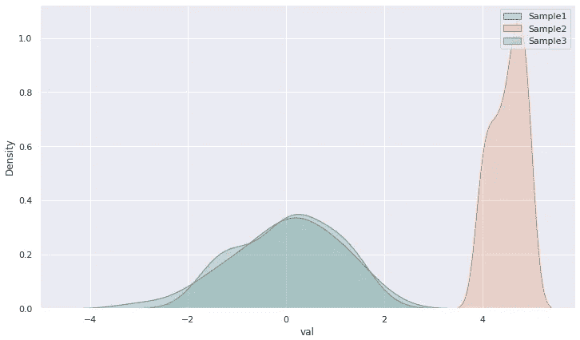
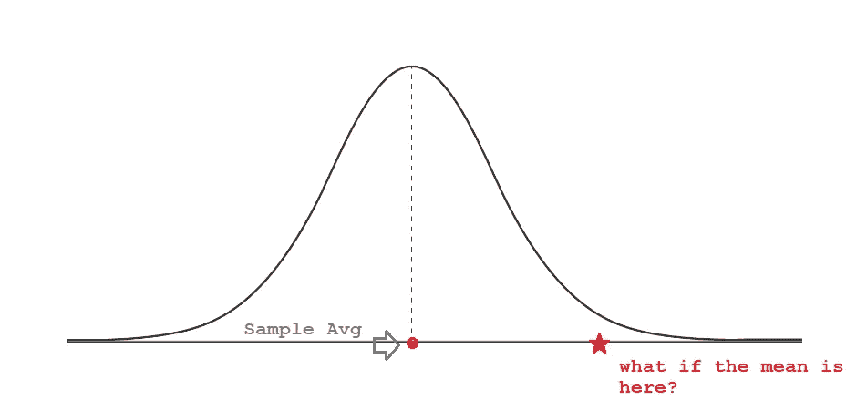
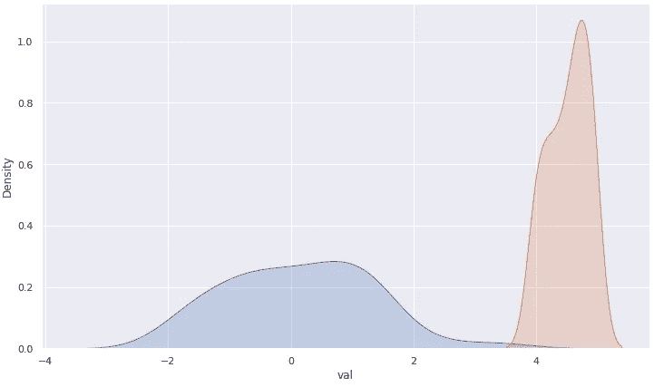
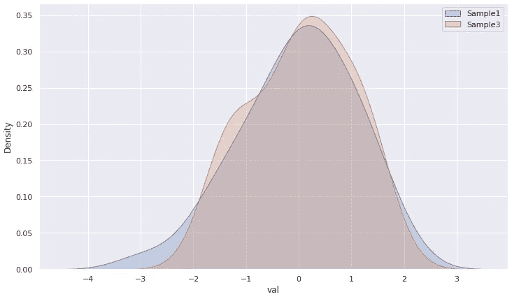

# 假设检验的图解说明

> 原文：<https://towardsdatascience.com/an-illustrated-explanation-of-hypothesis-tests-3594ffff34dc>

## 一劳永逸地学会什么是假设检验。Python 中的代码。



正态分布。图片作者 bby。

声明:*嘿，先把事情说清楚，这不是一个赞助的帖子。我非常喜欢这本书。*

## 假设检验

我最近读了这本好书[统计学的卡通介绍](https://www.amazon.com/Cartoon-Introduction-Statistics-Grady-Klein/dp/0809033593/ref=sr_1_1?keywords=cartoon+introduction+to+statistics&qid=1654655051&sprefix=cartoon+introdu%2Caps%2C116&sr=8-1)。它带来了对基本统计概念的有趣而流畅的介绍，所有介绍都像一本漫画书。

引起我注意的一点，也是我今天要揭示的一点，是作者 Grady Klein 如何解释假设检验的概念。用他的话说…

> 假设检验是一个有趣的名称，用于猜测总体平均值，并将该猜测与我们已有的样本平均值进行比较。



样本均值和我们的新猜测。我们来测试一下。图片由作者提供。

现在，假设我们收集了另一个样本，我们不知道该样本是否来自我们的分布。我们能做什么？我们通过计算在“星形”点上具有平均值的样本与在“圆形”点上具有平均值的样本来自同一个总体的概率值(也称为 *p 值*)来检验它们都来自同一个分布(总体)的假设。

在我们的测试中，*每个人都是无辜的，除非另有证明*。也就是说，测试将假设样本 1 和样本 2 来自同一总体，并将该假设称为零假设(Ho)。但如果我们错了，他们不是来自同一个人群，这种假设就被命名为替代假设(Ha)。

让我们确定一个测试的门槛。在这种情况下，5%是经验法则。如果两个样本来自同一人群的概率(p 值)小于 5%，那么我们可能是错的，所以我们有强有力的证据拒绝 Ho。但如果我们的 p 值高于 5%，我们的机会告诉我们没有足够的证据来拒绝 Ho，所以我们保持样本来自同一人群的假设。也许这只是一个奇怪的样本，有着奇怪的平均值。

```
# Imports
import pandas as pd
import numpy as np
import seaborn as sns
import matplotlib.pyplot as plt
from scipy.stats import f_oneway
from statsmodels.stats.weightstats import ztest# Create df
df = pd.DataFrame({'id': np.arange(1,51),'val': np.random.randn(50)})# Mean
df.val.mean()
**[OUT] -0.054089553629615886**#----# Create df2
df2 = pd.DataFrame({'id': np.arange(1,51),
'val': np.random.randint(40,50, size=50)/10})# Mean 2
df2.val.mean()
**[OUT] 4.513333333333334**# Test
"Can a distribution with mean sample 2 come from the same population as sample 1?
Ho : p-value >= 0.05 == Yes, same population
Ha : p-value < 0.05 == No, different population"
sample1 = df.val
mean_sample2 = df2.val.mean()# Z-test
stat, p = ztest(sample1, value=mean_sample2)
print(f'Test statistics: {stat}')
print(f'p-Value: {p}')**[OUT]
Test statistics: -26.21106515561983 p-Value: 1.9876587424280803e-151**
```

正如我们所看到的，零假设(Ho)被拒绝，因此我们有强有力的证据得出结论，两个样本来自不同的人群。
实际上，这意味着，如果我们认为真实总体平均值为-0.054(与样本 1 相同)，那么*很难找到平均值为 4.51 的样本。实际上，它被发现的几率几乎为零。*



这是我们刚刚测试过的。橙色样品几乎没有接触到蓝色样品。图片由作者提供。

## 来自同一群人

让我们试试另一个测试。现在我将从样本 1 中抽取一个样本 3，并测试它们来自同一人群的概率是真是假。

```
# Create df3
df3 = pd.DataFrame({'id': np.arange(1,31),'val': np.random.choice(df['val'].values, size=30)})# Mean 3
df3.val.mean()
**[OUT] 0.04843756603887838**
```

酷，均值更接近样本 1 均值( **-0.054** )。这是个好兆头。

```
sample1 = df.val
mean_sample3 = df3.val.mean()stat, p = ztest(sample1, value=mean_sample3)
print(f'Test statistics: {stat}')
print(f'p-Value: {p}')**[OUT]** 
**Test statistics: -0.3488669147011808 p-Value: 0.727189224747824**
```

哇！这两个随机正态样本来自同一总体的概率为 72%。有道理。3 是从 1 中提取的！

```
# Plot
sns.kdeplot(data=df, x='val', fill=True)
sns.kdeplot(data=df3, x='val', fill=True)
plt.legend(['Sample1', 'Sample3']);
```



两种分布重叠很多！图片由作者提供。

## 在你走之前

我想创建这个快速的帖子来展示假设检验背后的东西。我们实际测试的是什么。这是这里的目标，所以你可以围绕这个重要的统计概念建立你的直觉。

1.  我们有一个平均值为-0.05 的样本
2.  我们有一个平均值为 4.51 的样本 2
3.  **假设检验:**考虑到真实总体均值为-0.05 或非常接近，是否有可能两个样本来自同一个总体？
4.  我们开始假设，是的，他们来自同一个群体。然后我们计算 p 值，或概率值。
5.  如果概率小于 5%,我们拒绝它，支持 Ha，说统计证据表明这两个样本来自不同的分布。如果超过 5%，那么我们没有统计证据表明他们不是来自同一人群，因此我们假设他们是。

GitHub 代码:【https://tinyurl.com/3csp5ejm 

如果你喜欢这个内容，请关注我的博客。

[](https://gustavorsantos.medium.com/) [## 古斯塔沃·桑托斯-中等

### 阅读古斯塔夫·桑托斯在媒介上的作品。数据科学家。我从数据中提取见解，以帮助个人和公司…

gustavorsantos.medium.com](https://gustavorsantos.medium.com/) [](https://en.wikipedia.org/wiki/Statistical_hypothesis_testing) [## 统计假设检验-维基百科

### 统计假设检验是一种统计推断方法，用于决定手头的数据是否充分…

en.wikipedia.org](https://en.wikipedia.org/wiki/Statistical_hypothesis_testing)