# 回归分析中使用的方差-协方差矩阵图解指南

> 原文：<https://towardsdatascience.com/an-illustrated-guide-to-the-variance-covariance-matrices-used-in-regression-analysis-3eb5a5dd2cff>

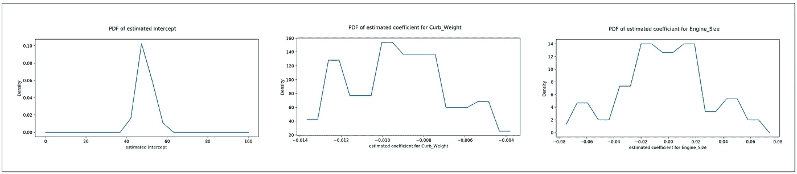

系数估计的概率分布(图片由作者提供)

## 使用真实世界的数据集，说明回归建模的基础工件是如何构建的

**方差-协方差矩阵**形成了回归模型的梯形失真。回归模型误差的方差-协方差矩阵用于确定模型的误差项是否为 [**【同方差】**](/heteroscedasticity-is-nothing-to-be-afraid-of-730dd3f7ca1f) (常方差)[](/the-intuition-behind-correlation-62ca11a3c4a)**。拟合回归模型系数的方差-协方差矩阵用于导出拟合模型系数估计值的**标准误差**和**置信区间**。两个矩阵都用于形成模型预测的**预测区间**。**

**方差-协方差矩阵是一个方阵，即它具有相同数量的行和列。沿着矩阵主对角线的元素，即从左上到右下的元素，包含方差，而所有其他元素包含协方差。因此，回归模型的拟合系数的方差-协方差矩阵包含拟合模型的系数估计的方差和系数估计之间的成对协方差。**

**类似地，回归模型的误差项的方差-协方差矩阵包含每个误差项沿其主对角线的方差以及所有误差项对之间的协方差。**

**话虽如此，为什么拟合模型的系数或误差项首先会有方差，以及这些矩阵在回归建模中扮演什么角色是我们将在本文中深入探讨的主题。**

**我们将使用经典的线性回归模型作为我们的范例模型。我们将学习的概念同样适用于各种常用的回归模型。**

**本文是以下两部分系列的第 1 部分:**

****第 1 部分:回归分析中使用的方差-协方差矩阵的图解指南**
第 2 部分:深入探究经典线性回归模型的方差-协方差矩阵**

# **汽车数据集作为我们的样本数据集**

**以下数据包含 205 辆汽车的规格，摘自 1985 年版的沃德汽车年鉴。每行包含一组 26 个关于单个车辆的规格。**

****

**汽车数据集(来源:[加州大学欧文分校](https://archive.ics.uci.edu/ml/datasets/automobile))**

**我们将考虑这个数据集的一个子集，它只包含三个变量:
City _ MPG
Engine _ Size
Curb _ Weight**

**三变量版本可从这里 下载 [**。**](https://gist.github.com/sachinsdate/fd97d74979c4febf6746c153ea1b7668)**

**以下是三个变量数据集的前几行:**

****

**汽车数据集的子集(来源:[加州大学欧文分校](https://archive.ics.uci.edu/ml/datasets/automobile))**

## **回归目标**

**我们的回归目标是使用**线性回归模型**回归**发动机尺寸**和**整备质量**的**城市行驶里程**。模型方程为:**

***city _ mpg =β_ 1****+****β_ 2 *发动机 _ 尺寸+β_ 3 *整备 _ 重量+ ϵ***

**其中 *ϵ* 是模型的误差项。回归模型的误差项 *ϵ* 代表建模者没有或不能测量的所有因素的影响。**

**上述方程的矩阵形式如下:**

*****y****=****xβ****+****ϵ*****

***凡，***

*   *****y*** 是一个*【n×1】*大小的列向量，包含 *City_MPG 的观测值。我们假设***
*   ***是一个*【3×1】*大小的回归模型系数列向量 *β_1、β_2、β_3* 对应的*截距、*引擎 _ 大小和*整备 _ 重量。****
*   ****是一个*【n×3】*大小的矩阵，包含回归变量的值。该矩阵的第一列是一列 1，它充当截距 *β_1 的占位符。*****
*   *****是模型的回归误差的一个*【n×1】*大小的列向量。*****

****当模型拟合在尺寸为 *n* 的样本上时，拟合模型的方程可以写成:****

*******y****=****xβ_ cap****+****e*******

****在哪里，****

*   *******y*** 和 ***X*** 的含义与之前相同。****
*   *******β_cap*** 是一个*【3×1】*大小的列向量，包含了回归模型的系数 *β_1，β_2，β_3 的*估计值*。* ***β_cap*** 有时被称为拟合系数。****
*   ******e*** 是拟合模型的**残差**的*【n×1】*大小的列向量。残差是 ***y*** 的观测值与预测值之差。***e****=****y****——****xβ_ cap******

## ***回归策略***

***通常，我们会在 75–85%的数据集上训练这个模型，并在剩下的 15–25%的数据集上测试它。因此，给定的数据集可能是从一个大得多(理论上无限大小)的群体中抽取的样本。***

***为了说明方差-协方差矩阵是如何构建的，我们将遵循一个稍微不同的策略，称为**自举**。我们将假设 205 辆车的数据集是*人口*，我们将遵循以下回归策略:***

1.  ***我们将从该人群中随机抽取 100 辆大小为 50 的车辆，*替换*。“替换”意味着在使用样本后，我们将把它放回总体中，以便在进行下一次抽取时可以使用这些数据。with-replacement 策略在许多现实环境中可能不太现实，但是它使数学变得非常简单，并且在汽车数据集的情况下不会导致任何实际困难。***
2.  ***我们将使用 OLS 技术对这 50 个车辆样本中的每一个样本训练(也称为拟合)一个线性回归模型。这种模型被称为副**O**L 东 **S** 方 **R** 出( **OLSR** )模型。***
3.  ***在对每个样本进行训练后，我们将记下拟合模型的系数值 *β_0_cap、β_1_cap 和β_2_cap。**‘cap’*表示这些是相应系数的总体水平值的*估计值*。***
4.  ***我们还将为每个样本记下回归的残差' ***e*** '。回归的残差是因变量( *City_MPG* )的观测值与拟合回归模型预测值之差。***

***下面是实现上述**自举算法**的 Python 代码:***

***让我们来看看我们的引导实验的结果。***

# ***培训结果***

***让我们打印出使用上述程序对 100 个数据样本运行 OLSR 模型得出的回归系数表(包括截距)。***

```
***print**(df_sample_beta)*
```

***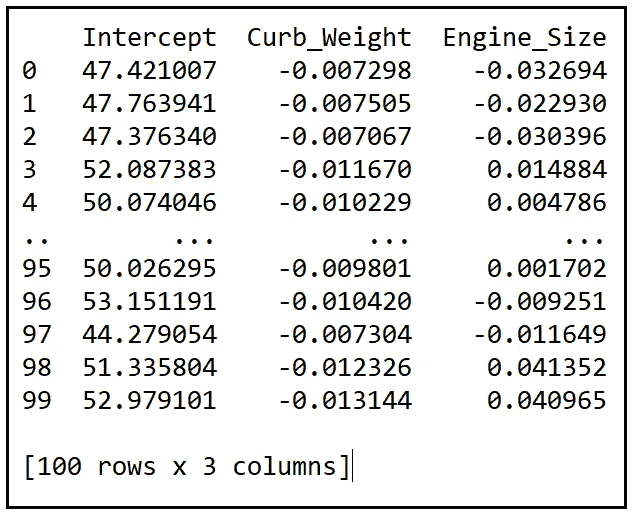***

***拟合 OLSR 模型的回归系数表，对模型进行 100 次拟合，每次对随机选择的 50 辆车进行采样(图片由作者提供)***

***该表中的每一行都对应于回归系数的拟合值，这些回归系数是通过在随机选择的 50 辆汽车样本上拟合 OLSR 模型而获得的。***

***从该表可以看出，拟合模型的回归系数表现得像随机变量。的确，它们*是*随机变量。每个估计的系数遵循某种概率分布，它有一个**均值**和**方差**。***

***使用上表中的数据，让我们画出三个回归系数的概率密度函数。下面是它的 Python 代码:***

```
***def** draw_pdf(data, min_X, max_X, var_name):
    hist = np.histogram(data)
    hist_dist = scipy.stats.rv_histogram(hist)
    X = np.linspace(min_X, max_X, 20)
    fig = plt.figure()
    fig.suptitle(**'PDF of '** + var_name)
    plt.plot(X, hist_dist.pdf(X), label=**'PDF'**)
    plt.xlabel(var_name)
    plt.ylabel(**'Density'**)
    plt.show()*#Plot the PDFs of the three coefficient estimates* draw_pdf(df_sample_beta[**'Intercept'**], 0, 100, **'estimated Intercept '**)data=df_sample_beta[**'Curb_Weight'**]
draw_pdf(data, min(data)*0.9, max(data)*1.1, **'estimated coefficient for Curb_Weight'**)data=df_sample_beta[**'Engine_Size'**]
draw_pdf(data, min(data)*0.9, max(data)*1.1, **'estimated coefficient for Engine_Size'**)*
```

***我们得到以下三幅图:***

***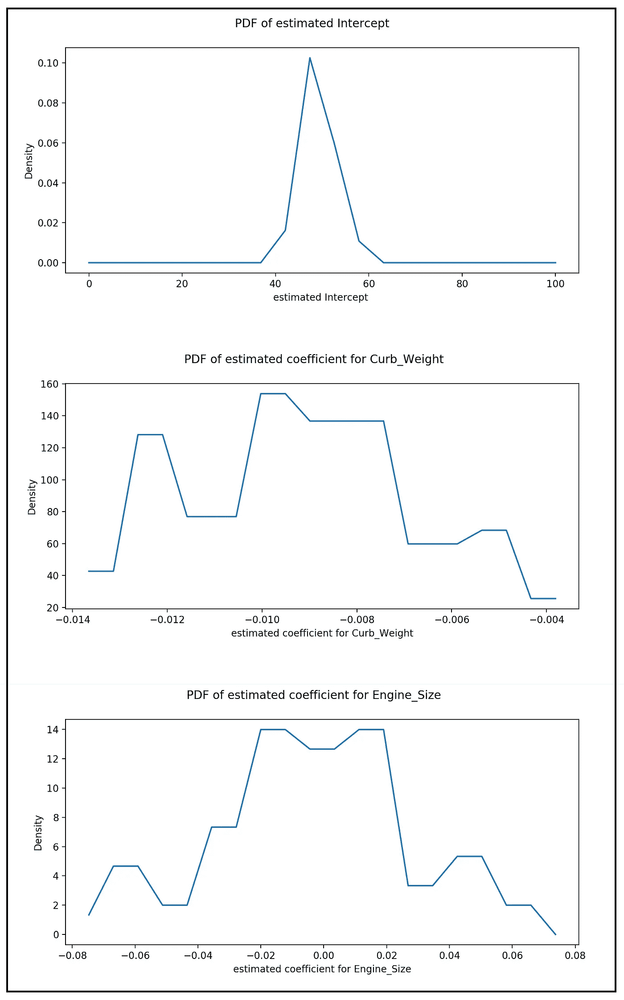***

***回归系数估计值的 pdf(图片由作者提供)***

# ***构建回归系数的方差-协方差矩阵***

***我们可以使用回归系数值表来计算每个系数的方差以及三个系数的成对协方差。***

***让我们回忆一下方差和协方差的公式。***

***给定在大小为 *n* 的样本上实现的随机变量 ***x*** ，以下 ***x*** 的样本方差形成了对 a ***x*** 的总体方差的无偏估计:***

***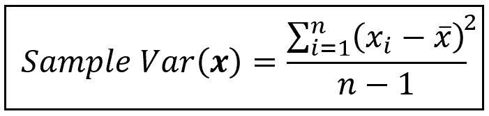***

***随机变量的总体方差的无偏估计量 ***x*** *(图片由作者提供)****

***这里， *x_bar* 是 ***x*** 的均值，分母中的 *-1* 代表因包含均值而损失的单自由度。***

***两个随机变量 ***x*** 和 ***z*** 之间总体水平协方差的类似无偏估计量如下:***

***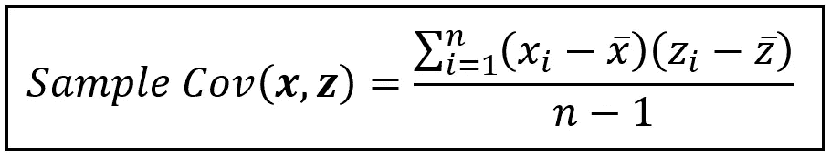***

***总体的无偏估计量**随机变量的协方差 ***x*** *和* ***z*** *(图片由作者提供)******

***使用这些公式，我们将计算回归系数值的方差和成对协方差。***

***系数的含义如下:***

***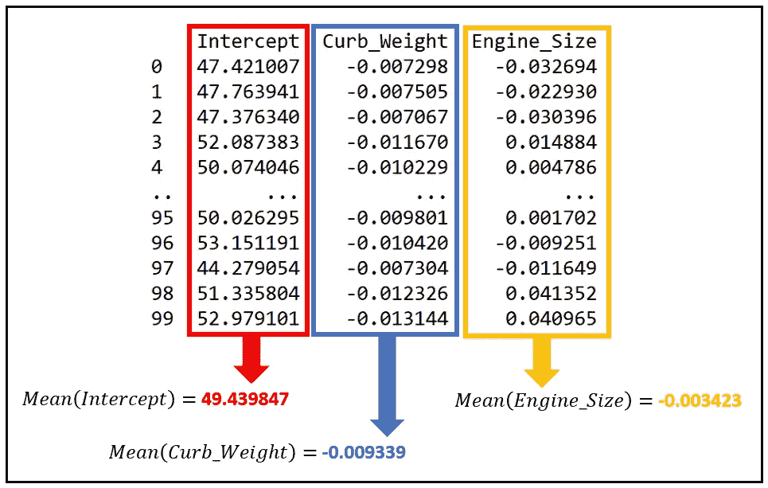***

***回归模型系数的平均估计值(图片由作者提供)***

***方差和协方差如下:***

***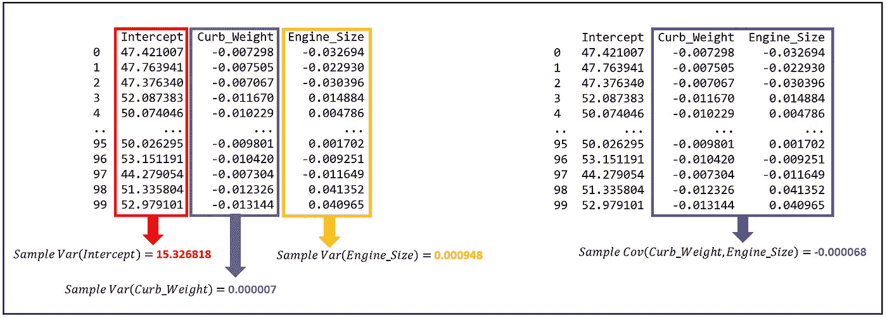***

***回归系数的方差和协方差(图片由作者提供)***

***以下 Python 代码可用于计算系数估计值的平均值和回归系数的方差-协方差矩阵:***

```
****#Calculate the mean estimate for each coefficient***coeff_means = df_sample_beta.**mean**()

***#Calculate the variance-covariance matrix for each coefficient***coeff_covs = df_sample_beta.**cov**()*
```

***我们会把它们打印出来:***

```
*print(coeff_means)*
```

***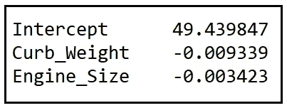***

***系数的平均估计值(图片由作者提供)***

```
***print**(coeff_covs)*
```

***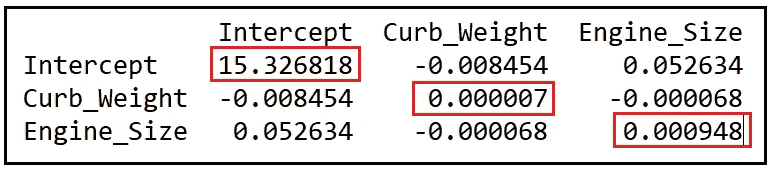***

***回归系数的方差-协方差矩阵(图片由作者提供)***

***在上面的矩阵中，由红框指示的沿主对角线的元素包含相应系数估计的方差，而非对角线元素包含成对协方差。***

***发动机尺寸和整备质量之间的负系数可能看起来是反直觉的，但是这个值是如此之小，以至于人们应该忽略这个符号。事实上，考虑到抽样技术的性质，每次我们进行 1000 个样本的实验时，我们将得到方差和协方差的稍微不同的值。***

***上述推导模型系数协方差矩阵的过程被称为 **bootstrap** 技术。重要的是要记住，回归系数的协方差是相应真实总体水平协方差的有限样本估计值(通常假设未知)。***

***当使用 bootstrap 技术时，当抽取次数很少时，需要使用因子(D+1)/D 向上调整估计的协方差，其中 D 是抽取次数。在我们的实验中，D=100，这个调整因子只有 1.01，可以忽略不计。***

# ***模型系数的标准误差***

***系数估计值的标准误差就是代表系数估计值的随机变量的标准偏差。***

***符号方面，***

****SE(****【β_ cap | X】****= STDEV(****β_ cap | X)=****SQRT(Var(****β_ cap****|****X****)****

***回想一下方差-协方差矩阵的对角元素包含系数的方差。因此，每个系数的标准误差可以通过取协方差矩阵的相应对角元素的平方根来计算。***

***让我们计算并打印出标准偏差:***

```
*coeff_std_errors = np.**sqrt**(coeff_covs)
**print**(coeff_std_errors)*
```

***以下是红框中显示的三个系数的标准误差:***

***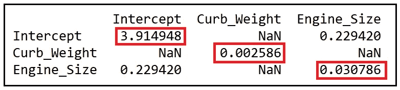***

***使用 bootstrapping 技术计算的系数估计的标准误差(图片由作者提供)***

***上述计算系数标准误差的技术被称为标准误差的**自举**，并且如此获得的标准误差被称为系数估计的**自举标准误差**。***

## ***模型系数的置信区间***

***使用以下公式计算每个系数的(1-α)*100%置信区间:***

******

***回归系数置信区间公式(图片由作者提供)***

***在上面的公式中:***

*   ****β_cap_i* 是模型对数据样本拟合后上报的第 I 个系数的拟合值。***
*   ***方括号内的 *t* 值是从具有 *(n-k)* 自由度的双边 *t* 分布返回的临界值，其中 *n* 是样本大小， *k* 是包括截距在内的回归系数的数量。***
*   ****se_i_i* 是 ***β_cap*** 的方差-协方差矩阵中第*个*对角元素的平方根。***

***为了计算置信区间，我们需要在随机抽取的 50 个样本上拟合 OLSR 模型:***

```
****# Select a random sample of size SAMPLE_SIZE***df_sample = df.**sample**(**n**=SAMPLE_SIZE)***# carve out the X and y matrices using Patsy***y_train, X_train = **dmatrices**(model_expr, df_sample, **return_type**=**'**dataframe**'**)***# Build an OLS regression model using Statsmodels***olsr_model = sm.**OLS**(**endog**=y_train, **exog**=X_train)***# Fit the model on (y, X)*** olsr_results = olsr_model.**fit**()***#Print the training summary of the fitted model* print**(olsr_results.**summary**())*
```

***我们得到以下培训总结输出:***

******

***OLSR 模式的培训总结(图片由作者提供)***

***拟合系数 ***β_cap*** 如下:***

```
***print**(olsr_results.params)**Intercept** 49.987734
**Curb_Weight** -0.009330
**Engine_Size** -0.001189*
```

***样本量 *n* 为 50，包括截距在内有 3 个回归变量。所以，*(n-k)= 50–3 = 47*。在 *α=0.05* 处的双边 *t 值*为 2.012。***

****整备质量的*系数估计值的 95%置信区间计算如下:***

****整备质量的 95%置信区间
=(-0.009330)+/-(2.012 * 0.002586)
=(-0.009330)+/-(0.005203032)
=****[-0.014533032，-0.004126968】******

***这与 statsmodels 在培训总结中报告的*整备质量*的 95%置信区间非常接近:***

***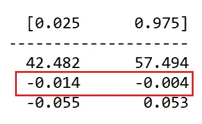***

***95%的 CI 由 Statsmodels 报告(图片由作者提供)***

***让我们也比较一下 Statsmodels 报告的标准误差和我们使用 Bootstrapping 技术计算的相应误差:***

***以下是 Statsmodels 报道的几个:***

******

***Statsmodels 报告的标准误差(图片由作者提供)***

***以下是我们已经引导的一些:***

******

***使用 bootstrapping 技术计算的系数估计的标准误差(图片由作者提供)***

***我们可以看到，虽然*整备质量*和*发动机尺寸*的标准误差与 Statsmodels 报告的误差非常接近，但是*截距*的标准误差相差很小(3.731 比 3.915)。那么我们应该使用自举的标准误差还是应该使用统计软件包报告的误差呢？毕竟，如果方差-协方差矩阵未指定，系数估计的标准误差将是不正确的，置信区间也将是不正确的。***

***我将在下周的**第 2 部分中解决这个重要的问题:深入探究经典线性回归模型的方差-协方差矩阵。*****

***敬请期待，造型快乐！***

# ***参考文献、引文和版权***

## ***数据集***

***[**汽车数据集**](https://archive.ics.uci.edu/ml/datasets/automobile) **引用:** Dua，d .和 Graff，C. (2019)。UCI 机器学习知识库[http://archive . ics . UCI . edu/ml]。加州欧文:加州大学信息与计算机科学学院。 [**下载链接**](https://gist.github.com/sachinsdate/fd97d74979c4febf6746c153ea1b7668)***

****如果您喜欢这篇文章，请关注我的*[***Sachin Date***](https://timeseriesreasoning.medium.com)*以获得关于回归、时间序列分析和预测主题的提示、操作方法和编程建议。****