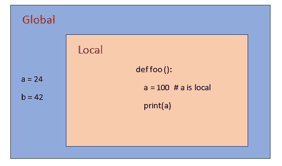
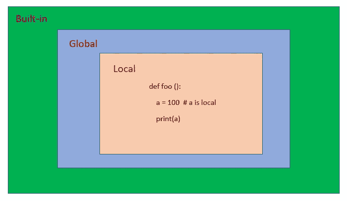
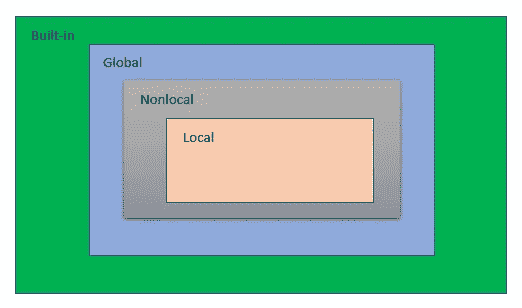

# 一个深入的 Python 装饰者教程，你可以实际使用

> 原文：<https://towardsdatascience.com/an-in-depth-tutorial-to-python-decorators-that-you-can-actually-use-1e34d3d2d305>

## 深入 Python 的内部


照片由[菲奥娜艺术](https://www.pexels.com/photo/colorful-abstract-wallpaper-5022849/)

## 介绍

使用 Python 和许多其他语言可以做的一件神奇的事情是修饰函数。装饰者可以修改函数的输入、输出以及函数本身的行为。最棒的是，您只需一行代码就可以完成所有这些操作，根本不需要修改函数语法！

要了解 decoratorss 如何工作以及如何为自己创建一个 decorator，您需要了解一些重要的 Python 概念。

因此，在我们开始编写 decorators 之前，我们将深入学习一些 Python 的内部知识，比如作用域和闭包。如果你熟悉这些概念，请跳过它们，到第 5 部分，所有的乐趣开始了！

[](https://ibexorigin.medium.com/membership)  

获得由强大的 AI-Alpha 信号选择和总结的最佳和最新的 ML 和 AI 论文:

[](https://alphasignal.ai/?referrer=Bex)  

## 函数是对象

您喜欢 Python 的一个原因是它能够将任何东西表示为对象，函数也不例外。对于第一次阅读这篇文章的人来说，将一个函数作为参数传递给另一个函数可能看起来很奇怪，但是这样做是完全合法的:

作为对象，函数与以下内容完全相同:

*   用线串
*   整数和浮点数
*   熊猫数据帧
*   列表、元组、字典
*   像`os`、`datatime`、`numpy`这样的模块

您可以将函数赋给新变量，并使用它来调用函数:

```
>>> new_func = my_func
>>> new_func()
Printing the function's argument
```

现在这个变量也包含了函数的属性:

您还可以将每个函数存储在其他对象中，如列表和字典，并调用它们:

## 范围

考虑鲍勃和约伯之间的对话:

*   鲍勃:“乔恩，你昨天为什么没来上课？”
*   乔恩:“我感冒了……”

不是最好的故事，但当鲍勃问乔恩昨天缺席的原因时，我们知道他指的是站在他旁边的乔恩，而不是某个在另一个国家的随机乔恩。作为人类不难注意到这一点，但是编程语言使用一种叫做 **scope** 的东西来告诉我们在程序中引用的是哪个名字。

在 Python 中，名字可以是变量、函数、模块名等。

考虑这两个变量:

```
>>> a = 24
>>> b = 42
>>> print(a)
24
```

在这里，`print`毫不费力地告诉我们，我们指的是我们刚刚定义的`a`。现在考虑一下这个:

```
>>> def foo():
...     a = 100
...     print(a)
```

如果我们运行`foo`，你认为会发生什么？它会印 24 张还是 100 张？

```
>>> foo()
100
```

Python 如何区分我们在函数开头定义的`a`？这就是作用域变得有趣的地方，因为我们引入了不同的作用域层:



作者图片

上图显示了这个小脚本的范围:

全局范围是您的脚本/程序的整体范围。与`a`和`b`具有相同缩进级别的变量、函数、模块将在全局范围内。例如，`foo`函数在全局范围内，但是它的变量`a`在`foo`的局部范围内。

在一个全局范围内，可以有许多局部范围。例如,`for`循环和列表理解和函数中的变量在它们的代码块中是局部的，不能从全局范围访问。

在`global`之外还有一个更大的范围级别:



作者图片

内置范围包含您用`Python`、`pip`或`conda`安装的所有模块和包。

现在，让我们探讨另一种情况。在我们的`foo`函数中，我们想要修改全局`a`的值。我们希望它是一个字符串，但是如果我们在`foo`里面写`a = 'some text'`，Python 将会创建一个新的变量而不改变全局`a`。

Python 为我们提供了一个关键字，让我们指定我们引用的是`global`范围内的名称:

编写`global <name>`将让我们修改`global`范围内名称的值。

顺便说一句，坏消息😁上图中，我省略了一个级别的范围。在`global`和`local`之间，还有一层我们没有覆盖:



作者图片

当我们有嵌套函数时，作用域开始发挥作用:

在嵌套函数`outer`中，我们首先创建一个名为`my_var`的变量，并将其赋给字符串`Python`。然后我们决定创建一个新的`inner`函数，并想给`my_var`赋一个新值——`Data Science`，并打印出来。但是如果我们运行它，我们会看到`my_var`仍然被分配给‘Python’。我们不能使用`global`关键字，因为`my_var`不在全局范围内。

对于这种情况，您可以使用`nonlocal`关键字来访问外部函数(非本地)范围内的所有名称，而不是`global`:

总之，作用域告诉 Python 解释器在程序中何处寻找名字。在单个脚本/程序中可以有四个级别的范围:

*   内置:Python 安装的所有包名，`pip`和`conda`
*   全局:一般范围，脚本中没有缩进的所有名称
*   Local:包含代码块中的局部变量，如函数、循环、列表理解等。
*   非局部:在嵌套函数的情况下，在`global`和`local`之间的一个额外的范围级别

## 关闭

在我解释装饰者是如何工作的之前，我们还需要谈谈闭包。让我们从一个例子开始:

我们在`foo`中创建一个嵌套函数`bar`并返回它。`bar`尝试打印数值`of` x:

当我们写`var = foo()`的时候，我们把`bar`的功能分配给了`var`。现在`var`可以用来调用`bar`。当我们调用它时，它打印出 42。

```
>>> var()
42
```

但是等一下，`var`怎么会知道`x`的事情呢？`x`是定义在`foo`的范围内，而不是`bar`的范围内，你会认为`x`在`foo`的范围外是无法访问的。这就是闭包的由来。

> 闭包是一个函数的内置内存，它包含函数运行所需的所有非本地名称(在一个元组中)!

所以，当`foo`返回`bar`时，它附加了所有非本地变量`bar`需要在`foo`的范围之外运行。您可以使用`.__closure__`属性访问函数的闭包:

一旦您以元组的形式访问函数的闭包，它将包含名为`cells`的元素，该元素具有单个非局部参数的值。闭包内可以有函数需要的任意多个单元格:

在上面的例子中，变量`x, y, z`是`child`的非局部变量，所以它们被添加到函数的闭包中。任何其他名字如`value`和`outside`都不在闭包中，因为它们不在非局部范围内。

现在，考虑这个更棘手的例子:

我们创建一个`parent`函数，它接受一个参数和一个嵌套函数`child`，后者打印传递给`parent`的任何值。我们用`var`(‘dummy’)调用`parent`，并将结果赋给`func`。如果我们称之为:

```
>>> func()
dummy
```

不出所料，它打印出了‘dummy’。现在让我们删除`var`并再次调用`func`:

```
>>> # Delete 'var'
>>> del var>>> # call func again
>>> func()
dummy
```

它仍然打印出“dummy”。为什么？

你猜对了，它被添加到闭包里了！因此，当一个来自作用域外层的值被添加到闭包时，它将保持不变，即使我们删除了原始值！

```
>>> func.__closure__[0].cell_contents‘dummy’
```

如果我们不删除`var`并改变它的值，闭包仍将包含它的旧值:

当我们在下一节讨论装饰者时，这个概念将会很重要。

让我们回顾一些概念，以确保您理解:

*   闭包是嵌套函数的内部内存，它包含存储在元组中的所有非局部变量。
*   一旦一个值存储在闭包中，它就可以被访问，但是如果原始值被删除或修改，它就不能被覆盖
*   嵌套函数是在另一个函数中定义的函数，遵循以下一般模式:

```
>>> def parent(arg):

...     def child():
...        print(arg)
...    
...    return child
```

## 最后，装修工

> 装饰器是修改另一个函数的函数。他们可以改变函数的输入、输出甚至行为。

让我们从一个非常简单的装饰开始:

现在，我们创建一个函数，它对传递的任何参数求平方，我们用`add_one`来修饰它。`add_one`将传递函数的参数加 1:

要将函数用作装饰器，只需将`@ symbol`放在函数定义的正上方，后面跟着装饰函数的名称。当我们将 5 传递给修饰过的`square`函数时，它没有返回 25，而是产生了 36，因为`add_one`接受了`square`的参数，即 5，并给它加 1，然后将其插回`square`:

```
>>> square(10)
121
```

现在，让我们仔细看看`add_one.`

首先，让我们从`add_one`开始，它只返回传递给它的函数:

为了让我们的装饰器返回一个修改过的函数，定义一个嵌套函数来返回通常是有帮助的:

我们的装潢师仍然无所事事。在`add_one`内部，我们定义了一个嵌套的`child`函数。`child`只接受一个参数并调用传递给`add_one`的任何函数。然后，`add_one`返回`child`。

> 在这个嵌套的`*child*`函数的例子中，我们假设传递给`*add_one*`的`*func*`与`*child*`的参数数量完全相同。

现在，我们可以让所有的魔法都发生在`child`函数内部。我们不是简单地调用`func`，而是想修改它的参数，给它们加 1:

通知`func(a + 1)`？它调用传递给`add_one`的任何参数，并在参数中加 1。这一次，我们将覆盖`square`，而不是创建一个新变量来存储`child`:

```
>>> square = add_one(square)
>>> square(5)
36
```

现在，当我们经过 5 时，它返回 36 而不是 25。

即使我们覆盖了它，它如何使用`square`功能？好在我们学习了闭包，因为旧的`square`现在在`child`的闭包里面:

```
>>> square.__closure__[0].cell_contents
<function __main__.square(a)>
```

至此，我们的`add_one`函数已经可以用作装饰器了。我们可以把`@add_one`放在`square`的正上方，看看神奇的事情发生了:

## 装饰者的真实例子

我想如果我不向你展示如何创建一个`timer`装饰器，那将是一个遗憾:

这一次，注意我们是如何使用`*args`和`**kwargs`的。当我们不知道函数中位置参数和关键字参数的确切数目时，就使用它们，这种情况下很好，因为我们可以在任何类型的函数上使用`timer`。

现在，您可以在任何函数上使用这个装饰器来确定它运行多长时间。无重码！

下一个非常有用的装饰器是缓存装饰器。缓存装饰器对于计算量大的函数非常有用，你可能会用相同的参数多次调用这些函数。缓存闭包中每个函数调用的结果将使我们能够在修饰函数被调用时立即返回结果:

在 main，`cache`函数中，我们希望创建一个字典，将元组中的所有参数存储为键及其结果。缓存字典将如下所示:

```
cache = {
    (arg1, arg2, arg3): func(arg1, arg2, arg3)
}
```

我们可以使用参数元组作为键，因为元组是不可变的对象。

现在，让我们看看如果我们用`cache`和`timer`装饰我们的睡眠功能会发生什么:

首先，让我们试着睡 10 秒钟:

```
>>> sleep(10)
sleep took 10.0001 seconds to run!
```

不出所料，运行了 10 秒。现在，如果我们再次以 10 作为参数运行`sleep`,你认为会发生什么:

```
>>> sleep(10)
sleep took 0.0 seconds to run!
```

用了 0 秒！我们的缓存装饰工程！

## 接受参数的装饰者

到目前为止，我们对装饰师的了解相当扎实。然而，当你让装饰者接受参数时，他们的真正力量就来了。

考虑这个装饰器，它检查函数的结果是否是类型`str`:

我们在一个虚拟函数上调用它来检查它是否工作:

它正在工作。然而，如果我们有办法检查任何数据类型的函数的返回类型，这不是很酷吗？来，看看这个:

使用这种类型的修饰器，您可以为所有的函数编写数据类型检查。让我们一起从头开始建造它。

首先，让我们创建一个简单的装饰器，它调用传递给它的任何函数:

我们如何调整这段代码，使它也接受自定义数据类型并对`func`的结果进行检查？我们不能添加额外的参数`decorator`,因为 decorators 应该只接受一个函数作为参数。

我们定义了一个更大的父函数，它返回一个**装饰器来解决这个问题**。这样，我们可以将任何参数传递给父函数，而父函数又可以在装饰器中使用:

注意我们是如何将装饰器包装在一个更大的父函数中的？它将一个数据类型作为参数，传递给我们的装饰器，然后返回它。在`wrapper`中，我们写了`type(result) == dtype`，不管数据类型是否匹配，它都计算为`True`或`False`。现在，您可以使用此函数对任何函数执行类型检查:

## 保留修饰函数的元数据

在这之前，我们从来没有检查过一件事——被修饰的函数是否以所有方式被保留？例如，让我们回到我们的`sleep`函数，我们用`timer`来修饰它:

让我们调用它并检查它的元数据:

我们检查函数的三个元数据属性。前两个回归了`None`，不过应该是出了点什么。我的意思是，`sleep`有一个长 docstring 和一个等于 5 的默认参数。他们去哪里了？我们在调用`__name__`得到函数名`wrapper`时得到了答案。

如果我们研究一下`timer`的定义:

我们可以看到，我们实际上并没有返回传递的函数，而是在`wrapper`内部返回它。显然`wrapper`没有 docstring 或者任何默认参数，这就是为什么我们得到了上面的`None`。

为了解决这个问题，Python 为我们提供了一个来自`functools`模块的有用函数:

在`wrapper`函数上使用`wraps`让我们保留所有附加到`func`的元数据。注意我们是如何在函数定义上方将`func`传递给`wraps`的。

如果我们使用`timer`的这个修改版本，我们会看到它如预期的那样工作:

使用`wraps(func)`对于编写装饰者来说是一个很好的实践，所以把它添加到我们今天定义的所有装饰者中吧！

## 结论

看完这个帖子，你对打造装修工有了很强的认识。更重要的是，你知道它们是如何工作的，以及它们工作的方式。

作为最后一点，我建议每当你有重复的代码在你的函数上执行类似的任务时，就使用 decorators。装饰者可以是使你的代码变得枯燥的另一个步骤(不要重复你自己)。

感谢您的阅读！

[](https://ibexorigin.medium.com/membership)  [](https://ibexorigin.medium.com/subscribe)  

阅读更多我的故事:

[](https://ibexorigin.medium.com/6-sklearn-mistakes-that-silently-tell-you-are-rookie-f1fe44779a4d)  [](/comprehensive-guide-to-writing-python-functions-others-can-use-2fa186c6be71)  [](/the-easiest-way-to-deploy-your-ml-dl-models-in-2022-streamlit-bentoml-dagshub-ccf29c901dac)  [](/complete-guide-to-experiment-tracking-with-mlflow-and-dagshub-a0439479e0b9) 