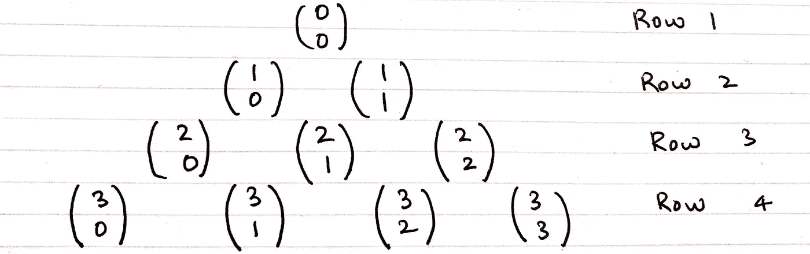
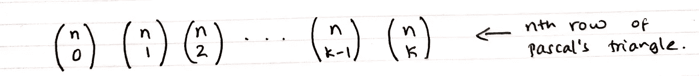
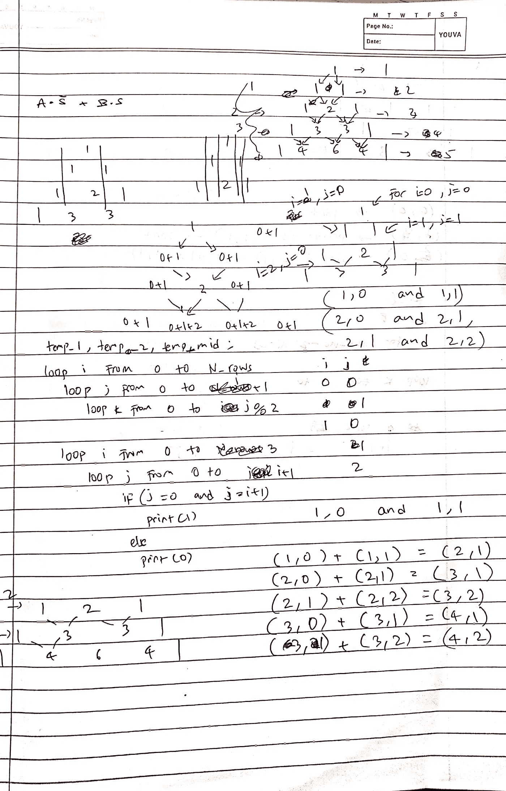
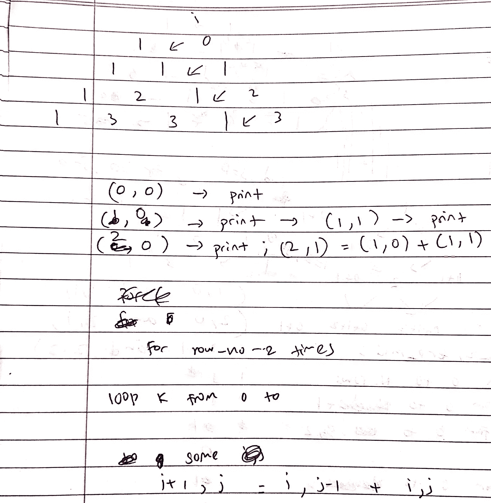
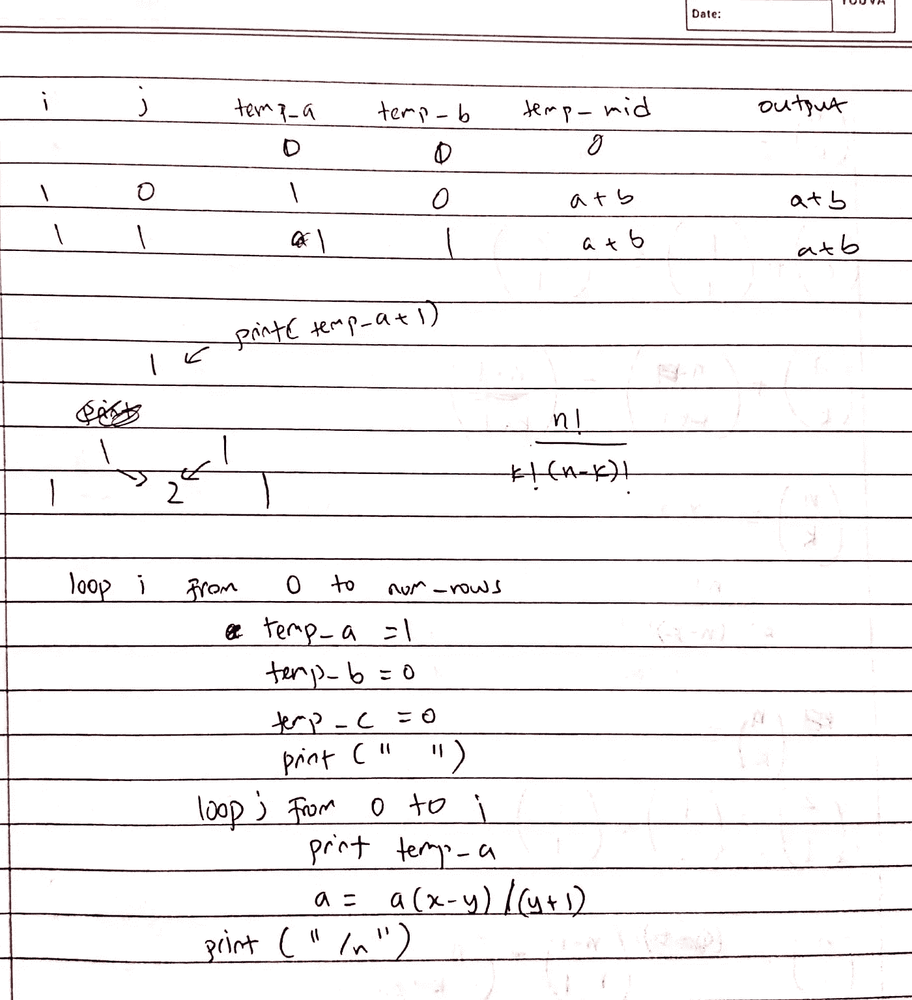
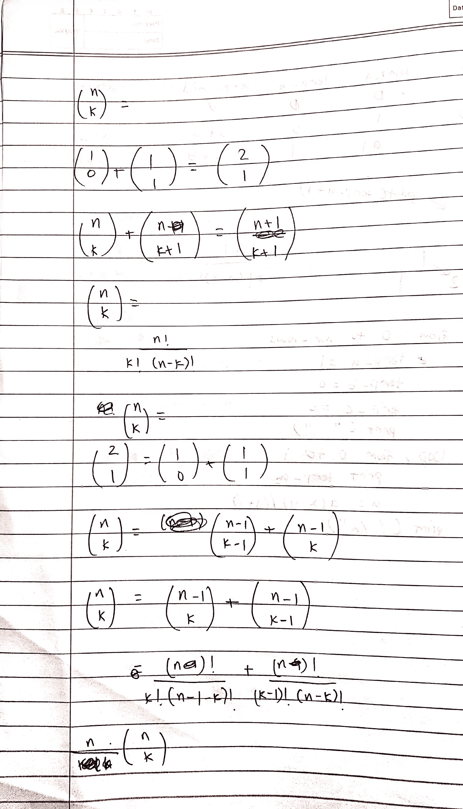
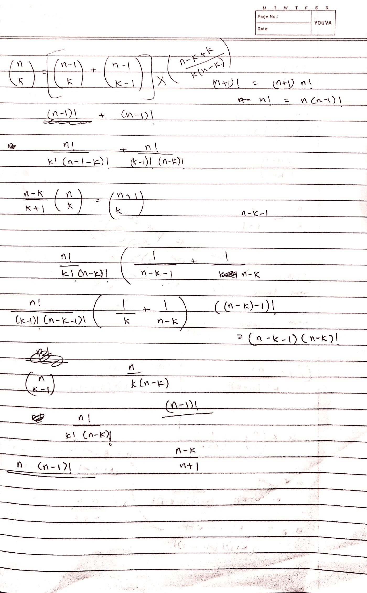
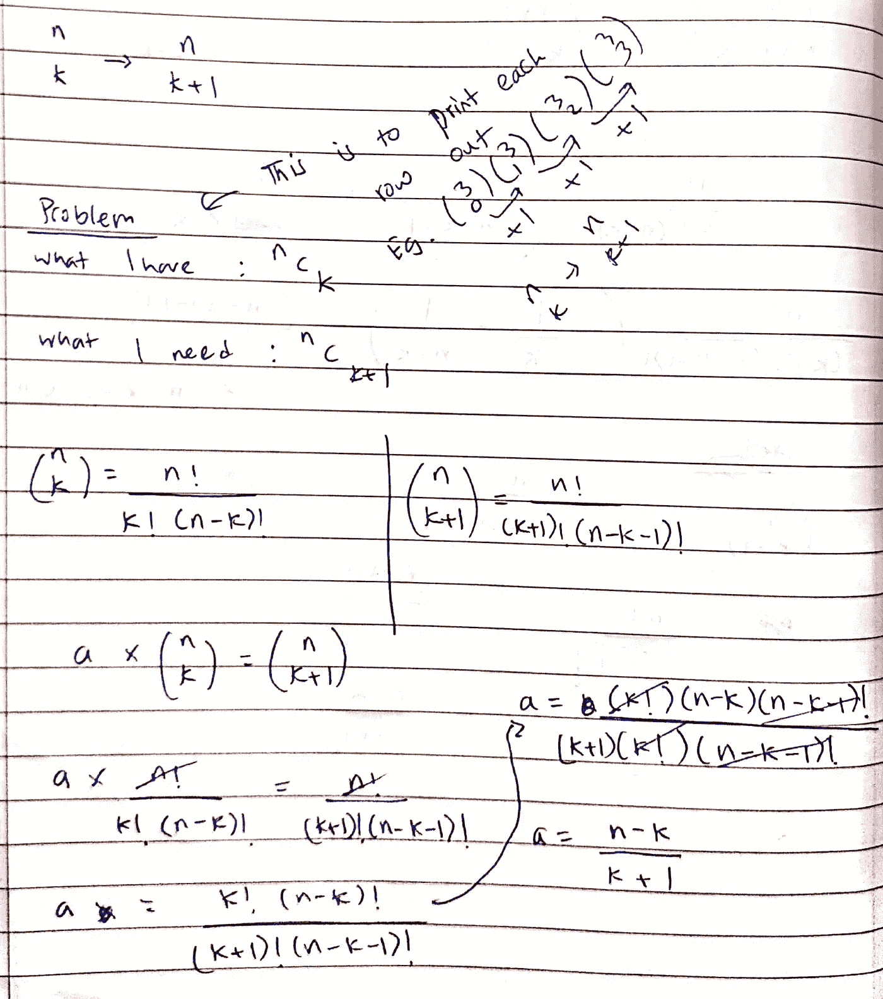
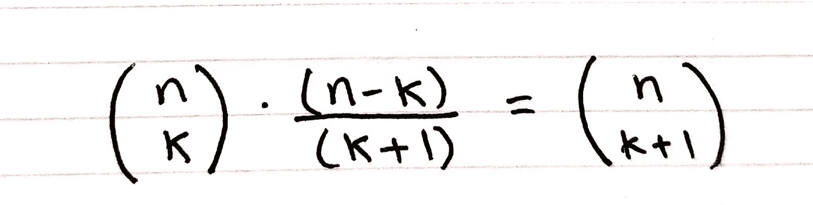

# 帕斯卡三角形:一种方法

> 原文：<https://towardsdatascience.com/an-interesting-approach-a78941855ffe>

## 利用数学概念用 C 语言打印出帕斯卡三角形。

老实说，关于编程语言，我不喜欢用 C 写代码。然而，由于一个大学模块(在 C 中)，一个练习是实现将打印出 Pascal 的第 n 行的代码。

尽管 C 对更大的整数(例如，20！)，我决定实现一组计算的简单版本。在尝试使用组合学之前，我已经经历了各种方法:临时变量和加法，2D 数组等。所有这些我都不知道如何实际实现。因此，我知道组合学可能是获得答案的最快方法。

# **组合:是什么？**

计数可能是一个非常琐碎的任务。手里拿着 4 块巧克力，你数 1，2，3，4。然而，一旦选择元素的子集。

假设你是一名足球教练，正在挑选一支 11 人的球队。你有 40 个感兴趣的申请人，你想用不同的组合测试他们(让我们忽略这个演示的形式)。

自然地，你会有 40 个选择给第一个玩家，39 个给第二个，38 个给第三个，以此类推，直到你填满了测试队的 11 个位置。以同样的方式，你最终又选择了 11 个人，(所以剩下的 18 个人还没有被选择)。然而，即使你重复这个过程，你会观察到有一组确定的球员没有发挥彼此和/或对彼此。

因此，为了避免这种错误计数，您需要使用组合的概念。帕斯卡三角形中显示的数字就是建立在这个概念上的。

# **帕斯卡三角:简介**

前一行中的两个元素递归相加形成下一行的一个元素，从而形成一个模式。同样，每行也有一个模式。就是给定行中的每个元素都可以写成“n 选 k”的形式(如图 1)。

数学上，“n 选择 k”用下面给出的公式描述。(在本文中，我不会深入讨论证明的细节，但是，它可以用数学归纳法来展示)

图 1: n 选 k(图片由作者提供)

使用 nCk 的概念及其数学公式，我们可以继续计算给定行的单个元素。

图 2:帕斯卡三角形样本(第 1-4 行)(图片由作者提供)

回头看看第一、二、三、四排。可以看出，在每一行中都有一个图案(不仅在各行之间，而且在各行之间)。此外，可以看到 k 的值(如果元素以 n 选择 k 的形式书写)从 0 增加到比行数少 1。例如，如果查看第 4 行，则第 4 行中的最后一个元素是 3C3。由此，看到了另一个细节；n 的值(在 n 中选择 k)比行号小 1。

这可以推广到第 n 行(n 选择 k)

图 3:帕斯卡三角形的第 n 行

# 重温问题:用 C 打印三角形

最初，我尝试了简单的方法，将第 n 行的公式直接实现到 c 中。我进行了一些测试，一切都很好，直到我尝试计算阶乘(12)。剧透提醒:这是一个巨大的数字；很自然地，代码出现了溢出错误，并开始打印出对我来说毫无意义的数字。我还尝试使用十几个临时变量，认为递归地重复加法过程就可以完成这项工作(不幸的是没有成功)。以下是我在找到有效方法之前对这个问题的尝试。

作者图片

作者图片

作者图片

作者图片

作者图片

好吧…这些都没用，但是有一个用了。

在这些尝试之后，我改变了对三角形整体的看法。相反，我注意到每一行都是在受控环境中产生的模式。这样，我可以避免内存分配和内存泄漏。

以这种方式思考，我探索了同一行中两个连续数字之间的关系。我试着看看是否有一个 nCk + b = nC(k+1)没有让我去任何地方。经过尝试，nCk * b = nC(k+1)让我发现了一些非常有用的结果。

作者图片

下面是我的结果的(更清晰的)总结

作者图片

# 结束语

我成功地打印出了 20 行帕斯卡三角形。虽然在这种情况下，我使用了上面的公式来避免溢出错误，但是同样的公式也可以在其他语言中实现，比如 Python，它不会为更大的数字返回溢出错误。在这种情况下，这可以被视为打印帕斯卡三角形的内存优化方法。