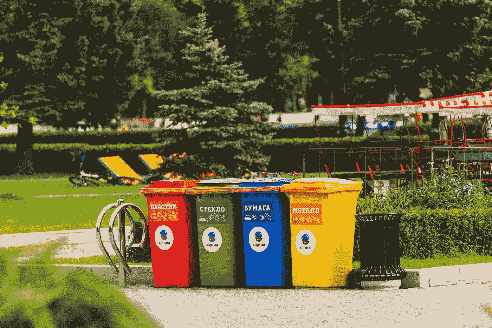
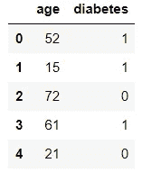
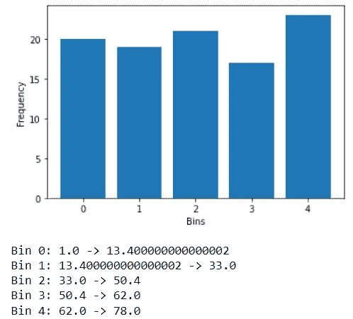
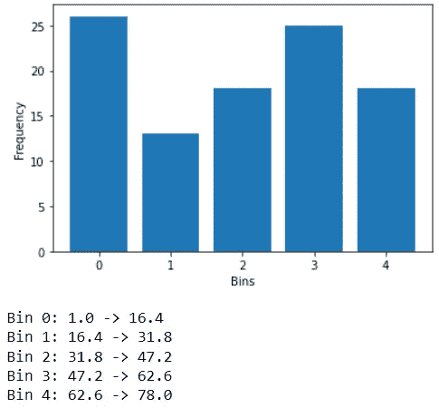
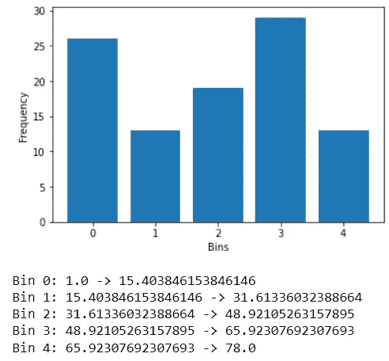
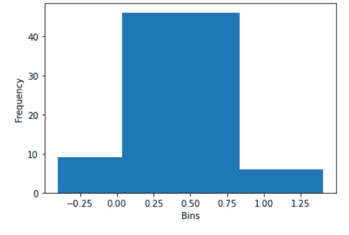
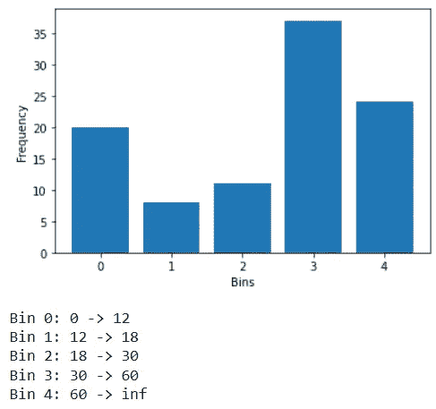

# 机器学习的离散化技术介绍

> 原文：<https://towardsdatascience.com/an-intro-to-discretization-techniques-for-machine-learning-93dce1198e68>

## 概述和 Python 实现

照片由 Vladislav Vasnetsov 拍摄:[https://www . pexels . com/photo/mished-color-plastic-trash-bins-2682683/](https://www.pexels.com/photo/assorted-color-plastic-trash-bins-2682683/)

许多机器学习算法在用离散变量训练时表现更好。因此，特征工程程序通常会包含离散化。你可能会发现，机器学习竞赛中的许多获奖作品都利用了这一技术。

不要被 5 音节词吓倒。离散化只需要将连续值转换成离散的类别。这是统计学中的一个常见概念，通常被称为“宁滨”或“木桶理论”。

离散化在机器学习中有许多优点，并且在 Python 中易于执行，这将详细解释。

## 利益

乍一看，将连续变量转换成离散变量的概念似乎是不必要的，但将这一步骤包括在特征工程过程中有许多好处。

1.  **降低噪音**

连续变量倾向于存储具有微小波动的信息，这对感兴趣的机器学习任务没有提供附加值。处理这样的值将导致模型产生大量噪声，这不可避免地会影响性能。

离散化解决了这一问题，使用户能够通过创建包含更少唯一值的分布来限制这种噪声。

**2。提供直观的功能**

根据不同的用例，离散变量可能比连续变量更直观。

例如，如果要建立一个比较年轻人和老年人的因果模型，可能值得将年龄记录为离散变量(例如，“儿童”、“成人”和“老年人”)，而不是连续变量。

这将使模型的结果更容易解释，因为特性是为应用程序定制的。

**3。最小化异常影响**

最后，离散化减轻了离群值的影响。无论异常值对值分布的倾斜程度如何，在转换后，它都将被转换为较高或较低的组。

## 缺点

尽管有很多好处，离散化有一个明显的缺点:信息丢失。

当然，这是特征工程中许多转换的特征。像归一化和主成分分析(PCA)这样的技术自然会导致一些信息损失。

总的来说，离散化中的信息损失不一定很大，但是在考虑转换后应该有多少个离散值时，值得记住。

## 离散化的类型

有许多方法可以在 Python 中实现离散化。

可以促进这种转换的两个最突出的 Python 包是: [scikit-learn](https://scikit-learn.org/) 和 [feature_engine](https://feature-engine.readthedocs.io/en/latest/) 。

为了展示这些包提供的一些转换器，让我们使用下面的虚构数据，这些数据由预测特征“年龄”和目标标签“糖尿病”组成。

代码输出(由作者创建)

目标是使用各种可用的离散化方法将年龄特征中的值转换成 5 个离散组。

我们将使用以下函数来可视化转换，并突出显示每种方法的特性。

**1。等频离散化**

等频率离散化需要将连续数据转换成箱，每个箱具有相同(或相似)数量的记录。

为了在 Python 中实现这个方法，我们可以使用 scikit-learn 包的 [KBinsDiscretizer](https://scikit-learn.org/stable/modules/generated/sklearn.preprocessing.KBinsDiscretizer.html) ，其中的`strategy`超参数被设置为“分位数”。

代码输出(由作者创建)

就观察数量而言，这 5 个箱相对接近。然而，为了获得这种均匀性，每个箱的宽度必须是不均匀的。

我们也可以用 feature_engine 包中的[equalfrequencydiscreditser](https://feature-engine.readthedocs.io/en/0.6.x_a/discretisers/EqualFrequencyDiscretiser.html)来执行这个转换。

**2。等宽离散化**

顾名思义，等宽离散化将数据转换为具有相同宽度的条块。与等频率离散化非常相似，我们可以将这种技术与 sci-kit learn 包的 KBinsDiscretizer 一起使用。但是，`strategy`超参数应设置为“统一”。

代码输出(由作者创建)

如输出所示，所有创建的条块的宽度为 15.4。

我们也可以通过使用 feature_engine 包的 [EqualWidthDiscretiser](https://feature-engine.readthedocs.io/en/0.6.x_a/discretisers/EqualWidthDiscretiser.html) 来执行这个转换。

**3。k-均值离散化**

k-均值离散化需要使用 k-均值聚类算法将数据点分配给箱。

也可以用 scikit-learn 包的 KBinsDiscretizer 来执行，其中的`strategy`超参数被设置为‘k means’。

代码输出(由作者创建)

**4。决策树离散化**

决策树离散化与之前的方法不同，它是一种*监督的*学习技术，这意味着它需要使用目标标签来转换连续变量。

顾名思义，它使用决策树算法寻找理想的分割点来分割观察值。

我们可以用 feature_engine 包中的[decision tree discrete ser](https://feature-engine.readthedocs.io/en/1.0.x/discretisation/DecisionTreeDiscretiser.html)来实现这一技术。

代码输出(由作者创建)

**5。自定义离散化**

最后，用户可以选择根据自定义规则将其连续变量转换为离散值。具有一定领域知识的用户可以受益于创建具有预定义宽度的箱子。

在我们的示例中，假设我们希望将年龄特征转换为预定义的组，包括年龄组“1–12”、“13–18”、“19–30”、“31–60”和“60–80”。

我们可以用 Python 中的 feature_engine 包的[arbitrary discretizer](https://feature-engine.readthedocs.io/en/1.2.x/user_guide/discretisation/ArbitraryDiscretiser.html)来实现这一点。

代码输出(由作者创建)

## 关于 feature_engine 包的说明

值得注意的是，feature_engine 转换器与 scikit-learn 工具兼容，这意味着它们可以与其他转换器一起用于无缝的特征工程过程。

为了展示这一点，我们可以将 feature_engine 包的 EqualWidthDiscretiser 合并到 sci-kit 学习管道中，以生成预测作为示例。

## 结论

照片由 [Prateek Katyal](https://unsplash.com/@prateekkatyal?utm_source=medium&utm_medium=referral) 在 [Unsplash](https://unsplash.com?utm_source=medium&utm_medium=referral) 上拍摄

有时候，最简单的转换比最复杂的机器学习算法能获得更多的好处。

像噪声和极值这样的因素在数据集中普遍存在，很难通过增加模型的复杂性来克服。

长期以来，离散化被证明是一种将数据转换为更易于管理的有效方法，从而改善了任何后续建模的结果。这就是为什么这种技术通常包含在机器学习竞赛的获奖作品中。

我祝你在数据科学的努力中好运！