# R 中的情感分析介绍 Twitter 对贝克·梅菲尔德有何看法？

> 原文：<https://towardsdatascience.com/an-intro-to-sentiment-analysis-in-r-how-does-twitter-feel-about-baker-mayfield-cda513ed0b78>

# R 中的情感分析介绍 Twitter 对贝克·梅菲尔德有何看法？

## 使用 Twitter 开发者 API 和 R 库分析受众情绪

全国的体育迷定期讨论他们喜欢的球队、球员、教练等。贯穿每个运动赛季。毕竟，共同的热情将人们联系在一起——而体育运动经常将人们聚集在一起。不同的球队有如此多的观点，如果我们想更好地了解某个球队、教练、比赛或球员的情绪会怎么样呢？

一些 R 包使我们能够进行情感分析，以确定社交媒体帖子是积极的、消极的还是中立的。当我们将这些与 Twitter 开发人员 API(或用于数据提取的 Netlytic)结合起来时，我们能够解析我们选择的主题的数千条推文。


桑德罗·舒赫在 [Unsplash](https://unsplash.com?utm_source=medium&utm_medium=referral) 上的照片

在本赛季的大部分时间里，继上赛季季后赛之后，克利夫兰·布朗队的四分卫贝克·梅菲尔德受到了来自许多不同角度和观点的巨大批评。随着早期过多的伤病和受欢迎的布朗队球员家属在社交媒体上的批评，本赛季对于崭露头角的布朗队来说无疑是一个巨大的调整。然而，在 1 月 3 日对阵匹兹堡钢人队的糟糕表现(单场比赛连续 10 次未完成比赛和 9 次助攻)之后，在 Twitter 上与当地媒体记者接触，并在本赛季剩余时间里因急需的手术而缺席，许多人在 Twitter 上表达了他们对自 1999 年以来围绕布朗队第 31 位四分卫的争议的看法。

使用 R，我们可以执行情感分析来回答问题， ***“那么，人们对贝克·梅菲尔德的真实感受是什么？”***

## 使用 Twitter API 进行数据拉取

首先，我们需要引入一些 R 库来帮助我们进行文本清理、可视化和情感分析。

```
library(rtweet)
library(stopwords) 
library(dplyr) 
library(tidyr) 
library(tidytext) 
library(wordcloud)
library(devtools)
library(tidyverse)      
library(stringr)
library(textdata)
```

有各种各样的选项可用于提取社交媒体数据，如 Netlytic(基于云的文本分析器和社交网络可视化工具，包括数据导出)和 Twitter 开发人员 API。对于我们的用例，我们将使用 Twitter API 来提取包含各种关键字的推文。(注意:此 API 仅允许我们提取前 6–9 天的数据)。

你可以在这里阅读更多关于创建开发者帐户、使用 Twitter API 以及创建供你使用的访问令牌的信息:[https://cran . r-project . org/web/packages/rtweet/vignettes/auth . html](https://cran.r-project.org/web/packages/rtweet/vignettes/auth.html)。完成后，您可以从您的开发者门户访问更多信息。

一旦您有了应用程序密钥、消费者密钥和访问令牌，您就可以使用 create_token()来生成授权令牌，这样您就可以将您的推文拉过来。

```
create_token(app = app_name, 
 consumer_key = consumer_key, 
 consumer_secret = consumer_secret, 
 access_token = access_token, 
 access_secret = access_secret)
```

现在，您已经准备好开始提取数据了！使用 rtweets 库中的 search_tweets()，我们可以使用一些关键字。在使用布尔运算符时，我们可以搜索任何包含至少 1 个给定搜索词的推文。默认情况下，这只返回 100 条 tweets，最大限制为 18，000 条。但是，您可以设置一个参数，在“retryonratelimit”设置为 true 的情况下返回更多推文(基于您的帐户访问级别，您可以拉取的推文总数是有限制的，所以我建议只在访问级别较高的情况下使用该参数)。还有其他选项来抓取最受欢迎的推文或混合最近和受欢迎的推文，而默认设置是返回最近的推文。出于一般情绪分析和时间的目的，我选择不包括转发。

有关查询格式/灵活性/选项的更多信息可在此处获得:[https://www . rdocumentation . org/packages/rtweet/versions/0 . 7 . 0/topics/search _ tweets](https://www.rdocumentation.org/packages/rtweet/versions/0.7.0/topics/search_tweets)

```
tweets_data <- search_tweets('Baker Mayfield OR Mayfield OR Cleveland Browns OR Stefanski', include_rts = FALSE, lang = 'en', n = 18000)
```

观察返回的推文数量

```
nrow(tweets_data) 
```

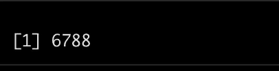

照片由陈伶俐·林恩(右输出)

Twitter API 返回许多关于 Tweets 的详细信息，包括标签长度、url 模式等。出于分析的目的，我们感兴趣的是前 16 列的信息，范围从 user_id 到 reply_count。

```
tweets_data <- tweets_data[,1:16]
summary(tweets_data)
```

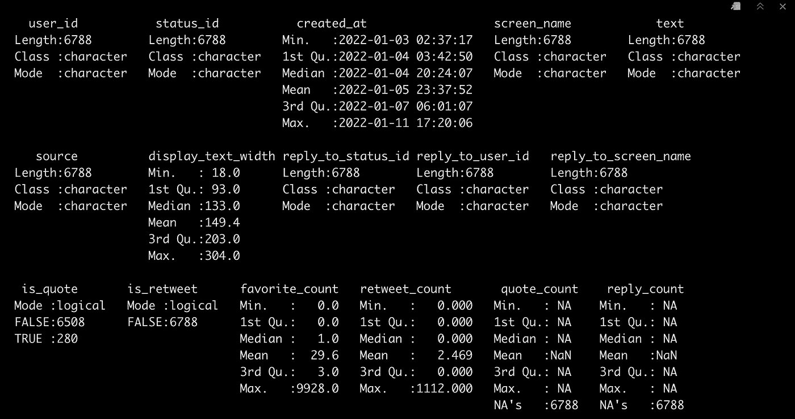

照片由陈伶俐·林恩(右输出)

现在，我们可以看看一些推文及其内容…

```
head(tweets_data$text)
```

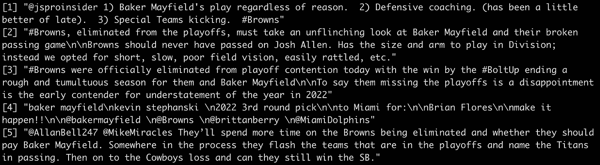

照片由陈伶俐·林恩(右输出)

我们还可以观察哪一天关于我们的话题的推文最多。

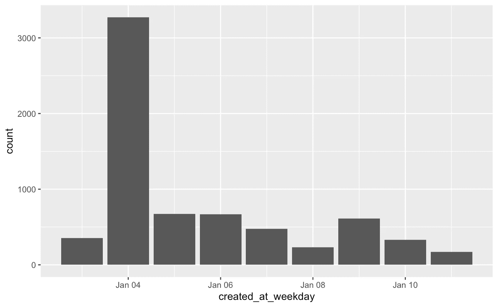

照片由陈伶俐·林恩(右输出)

我们现在可以看到，绝大多数推文发生在 1 月 4 日星期二，这是布朗队对钢人队比赛(也是梅菲尔德本赛季最后一场比赛)后的一天。在我们继续分析时，记住这一点很重要，因为这可能会影响我们数据中的情绪。

## 一些初步探索和数据预处理

我们可以使用 tidytext 库中的 unnest_tokens()函数将我们的 tweets 扩展为单个单词，将单词格式化为小写，并删除任何标点符号，然后过滤掉不需要的单词(the、to、and、is 等)。)使用预定义的停用词进行分析。

```
words_data <- tweets_data %>% select(text)  %>% 
              unnest_tokens(word, text)words_data %>% count(word, sort = TRUE)
```

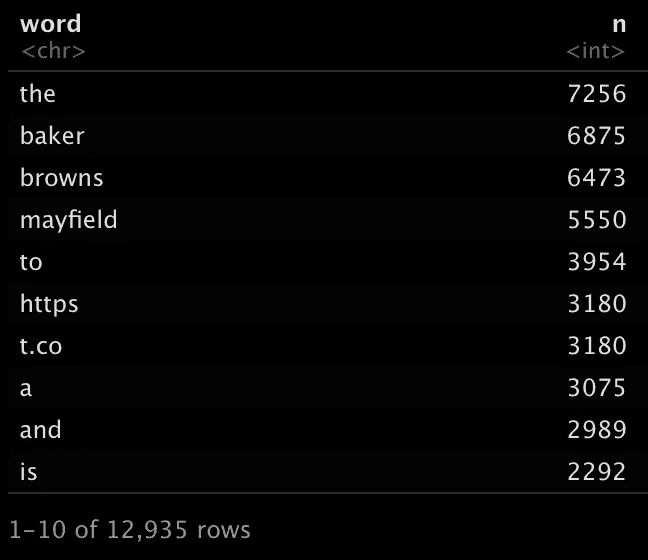

照片由陈伶俐·林恩拍摄(R 输出——我们数据中的热门词汇)

在删除停用词之前，使用 anti_join(stop_words)，我们可以看到一些最常见的词将出现在停用词中，如 https 和 t.co，因此我们可以过滤掉这些词，过滤掉停用词，然后再次检查。

```
words_data <- words_data %>% filter(!word %in% c('https', 't.co', 'he\'s', 'i\'m', 'it\'s'))words_data2 <- words_data %>%
  anti_join(stop_words) %>%
  count(word, sort = TRUE)head(words_data2, n = 10)
```

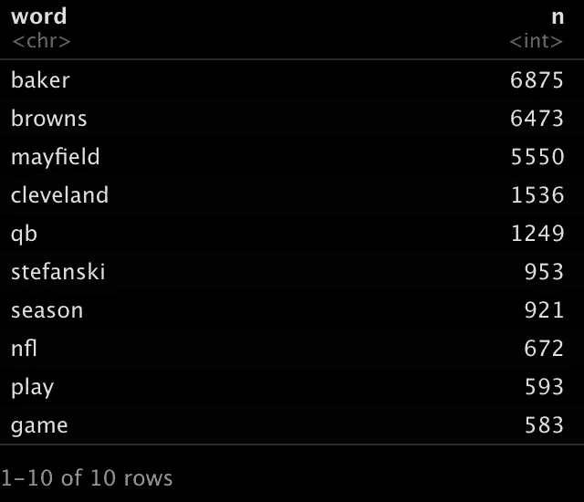

陈伶俐·林恩拍摄的照片(R 输出—清洗后数据中的热门词汇)

现在，我们可以看到我们的单词变得更干净了，我们可以在检查情感之前在单词云中检查我们清理过的数据。

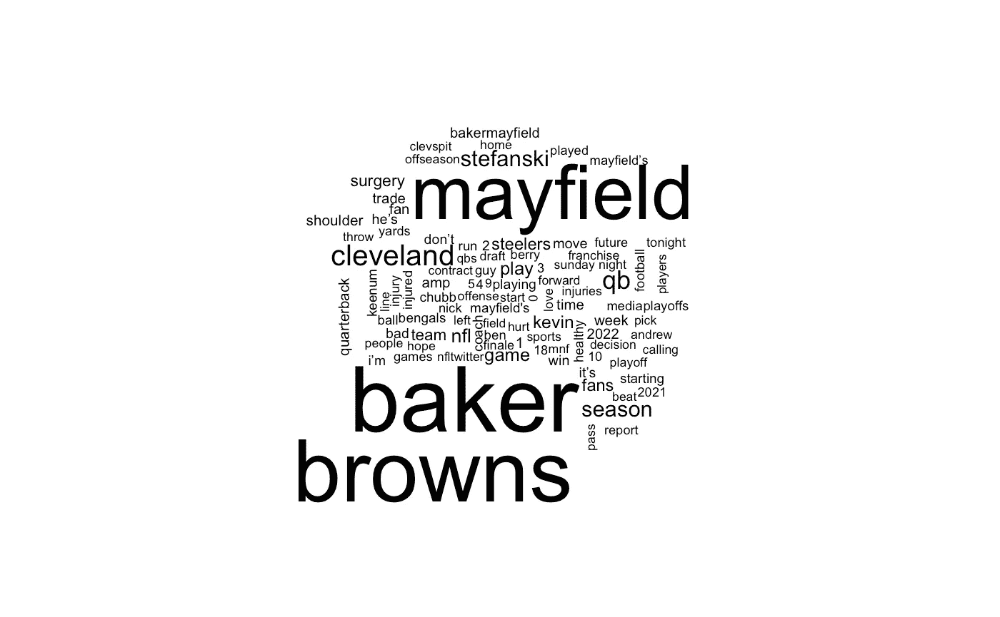

照片由陈伶俐·林恩拍摄

## 基于 Bing 词典的词级情感分析

```
words_data2 %>%
      inner_join(get_sentiments("bing")) %>%
      count(sentiment, sort = TRUE)
```


照片由陈伶俐·林恩拍摄(R 输出用于单词级情感分析)

我们可以看到，大多数单词被认为是负面的。如果我们想知道数据中的哪些词被归类为正面或负面，我们可以使用比较词云(并使用 sentimentr 库排除任何亵渎的词)来获取峰值。

```
profanity_list <- unique(tolower(lexicon::profanity_alvarez))words_data %>% filter(!word %in% c('https', 't.co', 'he\'s', 'i\'m', 'it\'s', profanity_list)) %>%
    inner_join(get_sentiments("bing")) %>%
    count(word, sentiment, sort = TRUE) %>%
    acast(word ~ sentiment, value.var = "n", fill = 0) %>%
    comparison.cloud(colors = c("red", "blue"),
                     max.words = 50)
```

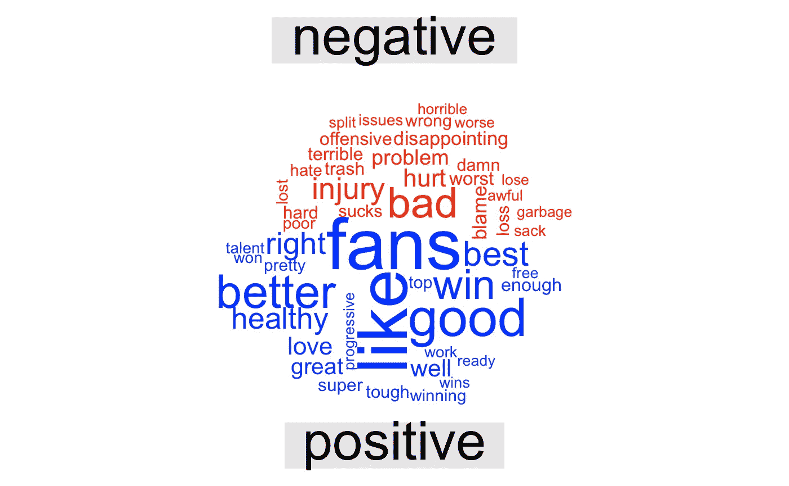

照片由陈伶俐·林恩拍摄

这让我们对我们的类别有了更深入的了解。我们可以看到像“更好”、“粉丝”、“赢”和“最好”这样的词是积极的，而像“冒犯”、“伤害”、“糟糕”或“问题”这样的词是消极的。然而，根据上下文，使用 bing 词典，一些单词可能同时适用于负面情绪和正面情绪。积极分类的“进步”一词可能是指四分卫的一系列进步广告，而消极分类的“损失”可能只是指布朗队输给钢人队。如果没有进一步的检查，这些词的分类可能会被误解，因为它可能取决于完整推文或句子的上下文。

## 使用 Sentimentr 在完整 Tweet 级别进行情感分析

使用 sentimentr 库，我们可以分析完整的推文，并检查平均情绪得分，而不是逐字分类。

```
library(sentimentr)
tweet_sentences_data <- sentiment(get_sentences(tweets_data$text)) %>% 
  group_by(element_id) %>% 
  summarize(meanSentiment = mean(sentiment))head(tweet_sentences_data)
```

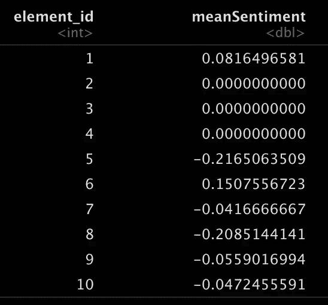

照片由陈伶俐·林恩拍摄(R 输出每条推文的情感评分)

平均情绪告诉我们情绪是积极的还是消极的。如果是正数，则为正面情绪，反之为负面情绪。如果是 0，那简直就是神经。

我们还可以观察最积极的推文相对于最消极的推文有多积极，我们可以在每组中进行计数。有了这些计数，我们可以使用可视化来可视化我们数据中的情感平衡！*(谁不喜欢好的 viz)*

```
print(paste0("Most negative tweets sentiment: ", min(tweet_sentences_data$meanSentiment)))
print(paste0("Most positive tweets sentiment: ", max(tweet_sentences_data$meanSentiment)))print(paste0("# of Negative Tweets: ", sum(tweet_sentences_data$meanSentiment < 0)))
print(paste0("# of Neutral Tweets: ", sum(tweet_sentences_data$meanSentiment == 0)))
print(paste0("# of Positive Tweets: ", sum(tweet_sentences_data$meanSentiment > 0)))
```

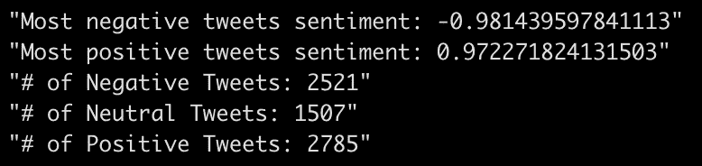

照片由陈伶俐·林恩(右输出)

我们可以看到，我们最负面的推文实际上是非常负面的，接近-1，反之亦然。为了更有力地展示我们的发现，我们可以使用我们的情感计数来创建一个显示每个情感平衡的可视化。

```
slices <- c(sum(tweet_sentences_data$meanSentiment < 0), sum(tweet_sentences_data$meanSentiment == 0),
            sum(tweet_sentences_data$meanSentiment > 0))
labels <- c("Negative Tweets: ", "Neutral Tweets: ", "Positive Tweets: ")pct <- round(slices/sum(slices)*100)
labels <- paste(labels, pct, "%", sep = "") #customize labeling#add in appropriate colors for positive, neutral, negative
pie(slices, labels = labels, col=c('red', 'yellow', 'green'), 
   main="Tweet Sentiment Percentages")
```

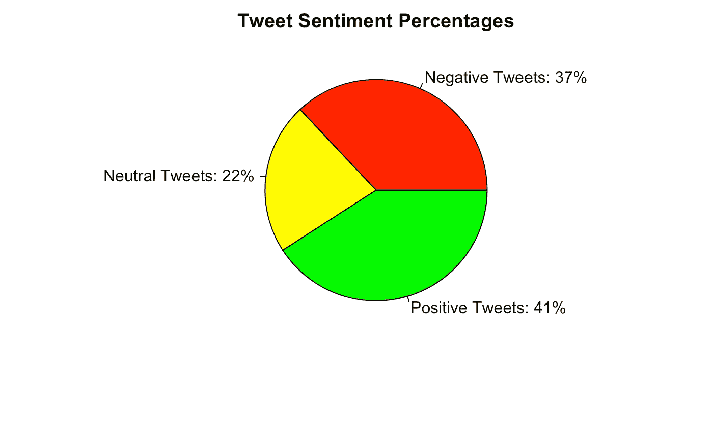

照片由陈伶俐·林恩(右输出)

在推文层面，我们可以看到我们推文中的观点比文字层面更加平衡。

## 用户层面的情感分析

这种分析的另一个有趣的扩展是显示每个用户的情绪，因为一些用户可能有多个情绪不同的推文。然而，我们的数据集中有超过 4000 个用户。为了一个更清晰的视觉和更容易的初步探索，我们将我们的数据限制在前 50 个最受欢迎的推文及其各自的用户。

```
n_distinct(tweets_data$user_id)
```

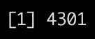

照片由陈伶俐·林恩(右输出)

```
#selecting top 50 tweets by favorites
user_sentiment <- tweets_data %>% select(user_id, text, favorite_count) %>% arrange(desc(favorite_count)) %>% slice(1:50)
head(user_sentiment)
```

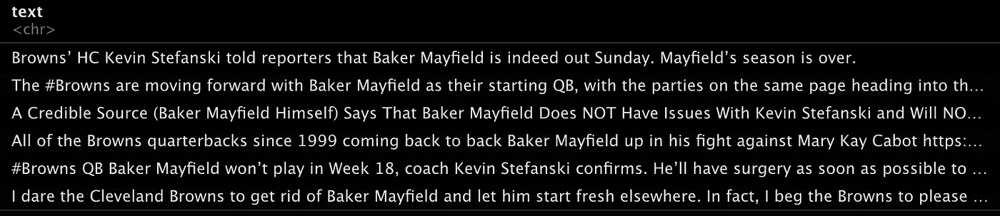

照片由陈伶俐·林恩拍摄(R 输出-热门推文的文本内容)

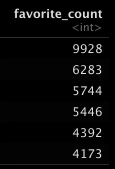

陈伶俐·林恩的照片(R 输出——热门推文的“收藏夹”数量)

现在，我们已经将数据按收藏数量降序排列，并限制在前 50 条推文中，我们可以轻松地对每个用户的情绪进行分组，并再次使用 sentimentr 库中的 sentiment_by()更好地了解这些用户的情绪。

```
out <- sentiment_by(get_sentences(user_sentiment$text), 
                    list(user_sentiment$user_id))plot(out)
```

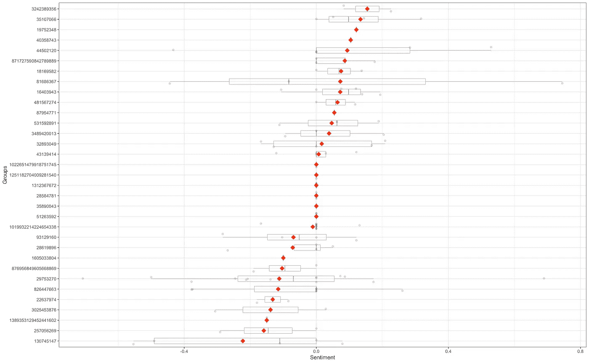

照片由陈伶俐·林恩拍摄(R 用户级情感输出)

这使我们能够更好地了解每个用户的情绪，因为一些用户在其所有推文中有广泛的情绪评分，而其他用户则完全中立(可能只有一条推文或多条完全中立的推文)。

..现在你知道了！情绪分析是一种非常有用的方法，可以通过社交媒体数据、调查数据、书籍等更好地了解公众的看法或情绪。然而，我们也必须意识到这种方法的局限性。使用来自 Twitter 的社交媒体数据，我们在使用的数据方面受到限制，因为可能是这样的情况，当人们有负面情绪时，他们更有可能发推特，而不是中性或积极的情绪。此外，使用 bing 词典，一些单词可能同时适用于消极情绪和积极情绪，因此探索您的数据以观察类似这些情况并在必要时做笔记是有用的。最重要的是，在探索数据和进行情感分析时，永远记得提出越来越多的问题，我建议在开始学习时使用你感兴趣的数据。

## 使用社交媒体数据进行体育情感分析的潜在扩展

在这种情况下，体育数据情感分析还有许多其他应用，您可以进一步扩展您的分析。直接从顶级/受欢迎的体育分析师那里收集推文，并根据他们对每个团队的社交媒体输入进行情绪分析，并进一步分析任何偏袒/偏见，这可能是有趣的。在一个给定的赛季进行情绪分析，并衡量情绪如何随着每场比赛或组织的变化而变化，这可能是很有趣的。可能性无穷无尽，感兴趣的话花时间去探索吧！


照片由[妮可·沃尔夫](https://unsplash.com/@joeel56?utm_source=medium&utm_medium=referral)在 [Unsplash](https://unsplash.com?utm_source=medium&utm_medium=referral) 拍摄