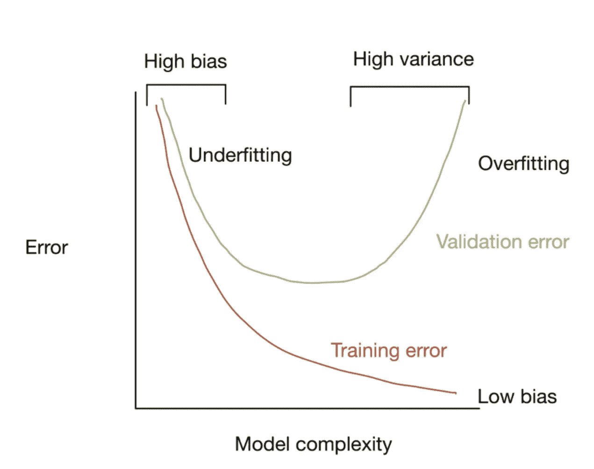
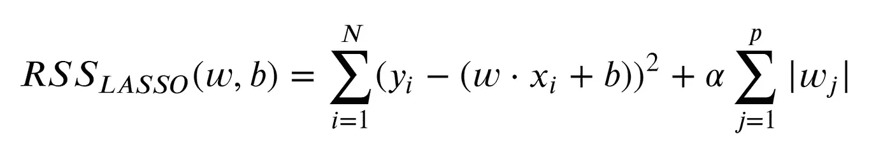
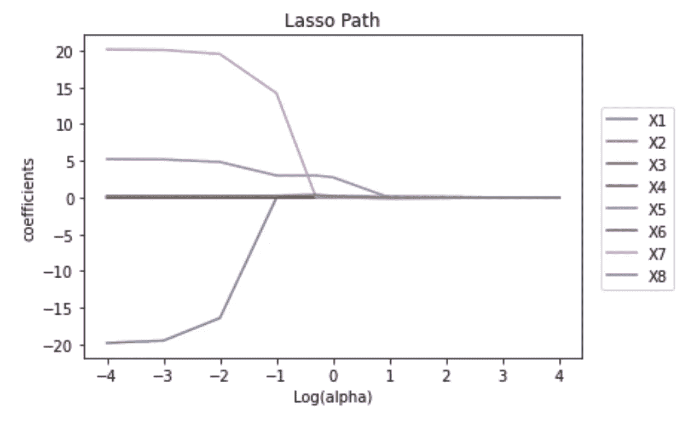
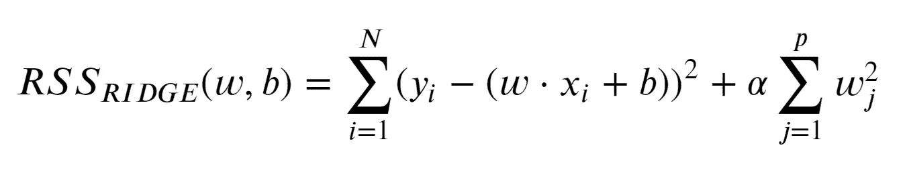

# 使用 scitkit-learn 介绍套索和岭回归

> 原文：<https://towardsdatascience.com/an-introduction-lasso-and-ridge-regression-using-scitkit-learn-d3427700679c>

## UCL 数据科学学会 12a 研讨会:偏差-方差权衡、套索实施、山脊实施及其差异


迈克·考克斯在 [Unsplash](https://unsplash.com?utm_source=medium&utm_medium=referral) 上的照片

今年，作为 UCL 数据科学学会的科学负责人，该学会将在整个学年举办一系列 20 场研讨会，涵盖的主题包括数据科学家工具包 Python 和机器学习方法简介。每个人的目标是创建一系列的小博客文章，这些文章将概述主要观点，并为任何希望跟进的人提供完整研讨会的链接。所有这些都可以在我们的 [GitHub](https://github.com/UCL-DSS) 资源库中找到，并将在全年更新新的研讨会和挑战。

本系列的第十二次研讨会是对高级回归方法的介绍，包括 Lasso 和 Ridge 回归的理解和实现。虽然亮点将在这篇博文中呈现，但完整的研讨会可以在我们的 GitHub 账户[这里找到。](https://github.com/UCL-DSS/advanced-regression)

如果您错过了之前的任何研讨会，可以在这里找到:

</introduction-to-logistic-regression-predicting-diabetes-bc3a88f1e60e>  </linear-regression-in-python-for-data-scientists-16caef003012>  </an-introduction-to-sql-for-data-scientists-e3bb539decdf>  

## **偏差与方差的权衡**

在建模阶段，有必要在您创建的模型中尽可能多地决定[偏差和方差](/bias-and-variance-for-machine-learning-in-3-minutes-4e5770e4bf1b)的水平。当构建监督机器学习模型时，目标是实现最准确预测的低偏差和方差。这意味着在处理训练数据时，我们必须处理欠拟合和过拟合的问题。

我们可以认为偏差是模型的精确度(即与目标的接近程度)，而方差是预测与目标的相关程度。我们的目标是同时具有低偏差(即准确)和低方差(即始终准确)，但在训练模型时，这两者之间往往存在权衡。例如，在过度拟合的情况下，我们可能对训练数据非常准确，因此具有较低的偏差，但我们可能对看不见的数据具有较高的方差，因为它已经过度拟合。因此，两者之间存在一定程度的权衡，我们可以这样设想:



作者图片

在建模中，我们试图在新数据集上实现尽可能低的验证误差的中间点，而不会过度接近与过度拟合相关联的低训练误差。就回归而言，可以对此进行控制的两个模型是 Lasso 和 Ridge 回归，如下所示。

## 套索回归

Lasso regression 是**最小绝对收缩和选择运算符**的缩写，是一种执行方差选择和正则化的回归方法，能够提高回归模型的预测准确性和可解释性。

早期的线性[回归研讨会](/linear-regression-in-python-for-data-scientists-16caef003012)展示了什么是方差选择，在这种情况下，我们根据变量之间的相关性或它们在回归中缺乏显著性来移除变量。这样做的目的是通过仅使用对目标变量重要的变量来提高模型的有效性，并从模型中去除噪声。因此，这可以提高模型的有效性和效率。

相反，正则化试图通过引入惩罚或约束来解决过度拟合的问题，以避免模型过度拟合训练数据。拉索回归能够做到这一点使用“L1 正则化”。这里，将罚项添加到普通最小二乘回归目标(减少平方和)，使得回归目标变为:



作者图片

这里引入的惩罚，由等式的第二部分给出，相当于系数绝对值的**和**。这意味着系数的子集被强制为零，充当自动特征选择。因此，只有最重要特征的子集在模型中具有非零权重，从而更容易解释。

模型中这种正则化的程度由𝛼参数控制，这意味着我们可以控制欠拟合和过拟合之间的权衡，以找到一个舒适的中间地带。这是因为随着𝛼增加，它会降低系数值并减少方差(过拟合)，但是在某个点之后，模型开始失去对数据的重要理解，并导致偏差增加(导致欠拟合)。因此，应使用超参数调整或交叉验证技术仔细选择𝛼的值。

现在，我们可以以类似于基本回归的方式实现一个简单的套索回归。为此，我们使用了来自 [UCI 机器学习数据库](https://archive.ics.uci.edu/ml/datasets/energy+efficiency)的关于建筑能效的数据集。这在训练数据集上实现如下:

```
#import the linear model class
from sklearn import linear_model#initiate the model with an alpha = 0.1
lasso_model = linear_model.Lasso(alpha = 0.1)#fit the model to the data
lasso_model.fit(X=X_train, y=y_train)
```

我们在这里可以看到，实现 lasso 回归模型遵循了与实现线性回归模型几乎相同的语法。主要区别在于，我们必须为实现指定 alpha 值(默认值为 0.1)，这会影响应用于系数的惩罚。

在这种情况下，如前所述，我们可以通过从模型实现中提取系数来检查模型中的系数，如下所示:

```
#extract the coefficients
df_coef_lasso = pd.DataFrame({"var": X_train.columns.values, 
                              "coef":lasso_model.coef_})#show the dataframe
df_coef_lasso#out:
   var   coef
0  X1    -0.000000
1  X2    0.001935
2  X3    0.050211
3  X4    -0.000000
4  X5    4.823518
5  X6    -0.000000 
6  X7    14.491866
7  X8    0.291431
```

由此我们可以看到，这些系数似乎与原始回归系数略有不同，其中一些系数实际上已经减少到 0。这意味着引入的惩罚意味着 X1、X4 和 X6 在回归方程中不再重要。

考虑到这一点，即模型旨在降低模型的复杂性以避免过度拟合，我们可以检查模型在训练数据集上的得分:

```
lasso_model.score(X_train, y_train)#out:
0.9068673512124443
```

这个分数低于原始模型，但是它已经设法用模型中更少的显式变量实现了这个分数。在某些情况下，由于降低了达到相同预测能力水平所需的模型复杂性，这可能导致改进的调整后 R。

像以前一样，我们可以使用模型来预测测试数据集，并查看它在那里的表现:

```
#extract model predictions
model_predictions = lasso_model.predict(X_test)#R2 score on test data
lasso_model.score(X=X_test, y=y_test)#out:
0.9036176174398927
```

虽然在这种情况下，与线性回归模型相比，该模型没有提高测试数据的 R，但我们可以开始看到，当我们在未来处理更复杂的数据集时，该模型可能会做得更好。当我们有彼此相关的独立方差或者我们有大量的独立变量要处理时，尤其如此。

另一件重要的事情是，我们最初选择的`alpha = 0.1`不一定是最佳值。我们可以使用交叉验证或超参数调整来检查这一点，但就我们的目的而言，我们可以简单地看到惩罚如何改变变量的重要性，例如随着 alpha 增加，越来越多的系数减少到 0，如下所示:

```
#import the necessary modules
from itertools import cycle
from sklearn.linear_model import lasso_path
import numpy as np
import matplotlib.pyplot as plt#run the lasso path
alphas_lasso, coefs_lasso, _ = lasso_path(X_train, y_train.values.reshape(-1),
                                          alphas = [.0001, .001, .01,.1, .5, 1, 10, 100, 1000, 10000], 
                                          fit_intercept=False)#plot the coefficients over the path
log_alphas_lasso = np.log10(alphas_lasso)
for index, coef_l in enumerate(coefs_lasso):
    l1 = plt.plot(log_alphas_lasso, coef_l,
                 label = X_train.columns.values[index])#add labels
plt.xlabel('Log(alpha)')
plt.ylabel('coefficients')
plt.title('Lasso Path')
plt.axis('tight')plt.legend(bbox_to_anchor = (0.7, 0.3, 0.5, 0.5))
#sho the model
plt.show()
```



作者图片

这显示了模型的系数如何在可能的 alpha 值范围内变化，由此小的 alpha 值意味着几个变量仍然对模型有影响，而当它增加时，较少的变量对模型有影响。

## 里脊回归

岭回归还能够对数据集执行正则化，以便能够控制模型中的过拟合和欠拟合。这通过使用以下等式来实现:



作者图片

岭回归的强大之处在于，它通过强制降低系数来最小化残差平方和(RSS )(实际上引入了一种惩罚),但它不会强制系数为零(如上面的 lasso 回归)。这种惩罚的效果实际上是系数幅度的**平方。这利用了被称为 L2 正规化的另一种正规化形式。**

这又留下了𝛼的选择，它可以用几种方法来完成。更传统的统计方法是选择𝛼，这样可以减少一些信息标准，如 AIC 或 BIC。备选方案是对𝛼值执行交叉验证和选择，这将最小化交叉验证的残差平方和(或一些其他度量)。虽然前一种方法强调模型对数据的拟合，但后一种方法更关注其预测性能。

我们可以用和以前几乎一样的语法实现岭回归:

```
from sklearn.linear_model import Ridgeridge_model = Ridge(alpha = 1.0)
ridge_model.fit(X_train, y_train)
```

然后，我们可以用与之前类似的方式检查系数，如下所示:

```
df_coef_ridge = pd.DataFrame({"var": X_train.columns,
                              "coef":ridge_model.coef_[0]})
df_coef_ridge#out:
   var   coef
0  X1    -3.648339
1  X2     0.012609
2  X3     0.035442
3  X4     -0.011416
4  X5     5.307185 
5  X6     -0.008634
6  X7     18.218816
7  X8     0.269722
```

由此我们可以看出岭回归和原始套索回归之间的主要区别是，尽管一些系数接近于 0，但它们实际上并没有达到 0。这是因为惩罚不会完全减少它们，事实上也永远不会。因此，尽管引入了惩罚，但是在该模型中没有执行完整的特征选择。

然后，我们可以看到模型在测试数据集上的表现:

```
ridge_model.score(X_train, y_train)#out:
0.9128636836305432
```

我们可以看到，该模型比 Lasso 回归表现得更好，但仍然比基本线性回归表现得更差(至少在这个度量方面)。

当然，重要的是它能够在看不见的数据上执行得如何，我们可以检查:

```
ridge_predictions = ridge_model.predict(X_test)print(ridge_model.score(X_test, y_test))#out:
0.9085287497226727
```

其中，像以前一样，知道模型正在处理看不见的数据，模型的性能下降，尽管这是可以预料的。

然而，我们知道我们只为原始模型选择了一个单一的 alpha 值，而我们可以使用`RidgeCV`找到最佳的 alpha 值。这是通过执行留一交叉验证来实现的，以确保我们通过一系列值获得模型的最佳 alpha 值。这要求我们输入一系列的值来训练它，我们可以这样实现它:

```
#import the model
from sklearn.linear_model import RidgeCV#create the model
ridgeCV_model = RidgeCV(alphas = np.logspace(-6, 6, 13))
#implement it on training data
ridgeCV_model.fit(X_train, y_train)
```

我们可以通过以下方法提取最佳 alpha 值:

```
optimal_alpha = ridgeCV_model.alpha_
print(optimal_alpha)#out:
0.001
```

在这种情况下，我们可以重做模型，看看性能如何变化:

```
#implement the model with the new alpha
ridge_model = Ridge(alpha = 0.001)
#fit the model
ridge_model.fit(X_train, y_train)#check the score on the original data
print(ridge_model.score(X_train, y_train))#check the score with the new data
print(ridge_model.score(X_test, y_test))#out:
0.9173454869664193
0.9128137902284486
```

我们现在可以看到，使用 R 度量，具有最佳 alpha 的训练岭模型现在实际上优于基本回归模型(至少只是略微)。因此，某种程度的惩罚提高了模型的通用性，以确保模型中过拟合的机会或程度更小。

## 拉索 v 型山脊

重要的问题是，在什么情况下应该使用套索或岭回归。这将从根本上取决于所讨论的数据，因为:

1.  Lasso 通过将一些系数设置为零来执行有效的变量选择，而在岭回归中并非如此。
2.  如果有少量独立特征或重要参数(仅当少数预测因素影响响应时)，Lasso 的性能会更好。
3.  如果有大量独立特征或重要参数(当大多数预测器影响反应时)，岭很好地工作。
4.  通常最好通过交叉验证来使用这两种模型，以选择最适合该案例的模型。

这就是脊和套索回归的介绍，以及如何在您的数据上实现它们！

如果您想了解我们协会的更多信息，请随时关注我们的社交网站:

https://www.facebook.com/ucldata

insta gram:【https://www.instagram.com/ucl.datasci/ 

领英:【https://www.linkedin.com/company/ucldata/ 

如果你想了解 UCL 数据科学协会和其他优秀作者的最新信息，请使用我下面的推荐代码注册 medium。

<https://philip-wilkinson.medium.com/membership>  

或者看看我写的其他故事:

</git-and-github-basics-for-data-scientists-b9fd96f8a02a>  </multi-variate-outlier-detection-in-python-e900a338da10>  </london-convenience-store-classification-using-k-means-clustering-70c82899c61f> 