# H2O 波表介绍

> 原文：<https://towardsdatascience.com/an-introduction-of-h2o-wave-table-95a91da3672e>

## 互动。简单。有用。


克里斯·格拉夫顿在 [Unsplash](https://unsplash.com?utm_source=medium&utm_medium=referral) 上拍摄的照片

> [H2O Wave](https://wave.h2o.ai) 是一个 Python 包，用于为各种数据科学工作流和行业用例创建实时 ML/AI 应用。

数据科学家以表格形式查看大量数据。运行 SQL 查询、在 Excel 中旋转数据或分割熊猫数据框架是非常基本的任务。

随着低代码工具的使用越来越多，拥有一个表格组件是必不可少的。H2O Wave 的[表格组件](https://wave.h2o.ai/docs/examples/table)有一些奇妙的功能，如原生过滤、降价单元格、行触发器、分页甚至实时搜索，这使得 Wave 应用程序对用户来说非常有用，交互&现代。

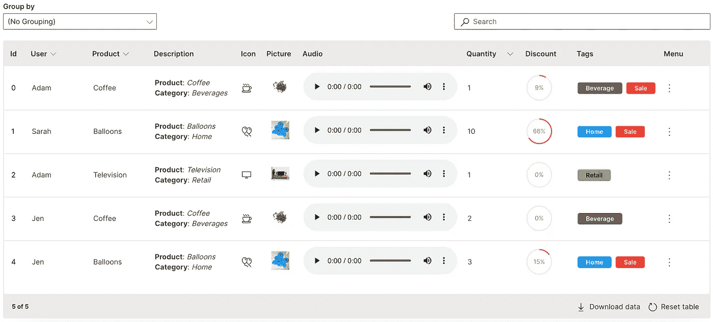

H2O 波表

让我们看看其中的一些特性及其相应的实现。下表提供了一个简单的 Wave 应用程序结构:

`app.py`可以在[安装 H2O 波](https://wave.h2o.ai/docs/installation)后使用`wave run app.py`运行，并在 [http://localhost:10101](http://localhost:10101) 上查看

**P.S.** 作为 [WaveTon 系列](https://github.com/vopani/waveton)的一部分，还可提供一个全面应用的[桌面展示柜](https://github.com/vopani/waveton/tree/main/apps/skeleton_apps/table_showcase)。

# 创造

创建表包括定义数据的列和行。

`ui.table`用于定义表格元素。

`ui.table_column`用于定义每一列的数据。
`ui.table_row`用于定义数据中每行的内容。

```
**ui.table(
    name='table_name',
    columns=[
        ui.table_column(name='id', label='Id'),
        ui.table_column(name='user', label='User'),
        ui.table_column(name='product', label='Product')
    ],
    rows=[
        ui.table_row(name='0', cells=['0', 'Adam', 'Coffee']),
        ui.table_row(name='1', cells=['1', 'Sarah', 'Balloons'])
    ]
)**
```

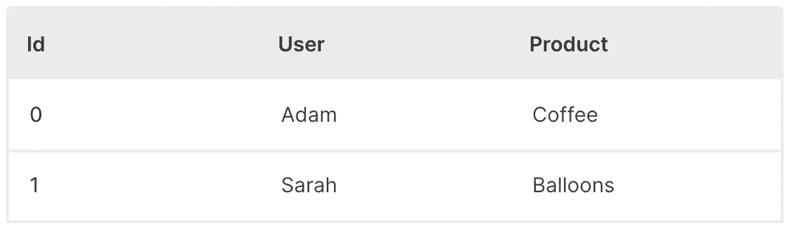

波表(创建)

在一个`csv`文件中有数据是很常见的，表的创建可以扩展到从一个上传的文件中创建。

来自 [WaveTon 系列](https://github.com/vopani/waveton)的示例 [CSV 加载器应用](https://github.com/vopani/waveton/tree/main/apps/skeleton_apps/csv_loader)展示了这是如何实现的。

# 大小

可以通过多种方式调整表格的大小，以充分利用空间。

`width`用于设置表格的总宽度。
`height`用于设置表格的总高度。
它们可以设置为像素值、百分比或自定义计算。

`min_width`用于设置一列的最小宽度。
`max_width`用于设置一列的最大宽度。
列宽也可以直接在表格上交互调整。

```
ui.table(
    name='table_name',
    columns=[
        ui.table_column(
            name='id',
            label='Id',
            **min_width='20px'**
        ),
        ui.table_column(
            name='user',
            label='User',
            **min_width='100px',
            max_width='200px'
**        ),
        ui.table_column(
            name='product',
            label='Product',
            **min_width='100px'**
        )
    ],
    **width='100%',**
    **height='calc(100vh - 60px)',** ...)
```

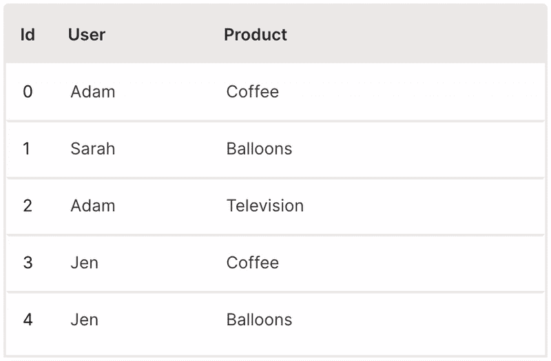

波表(尺寸)

# 类型

每列的默认列类型为`string`。

`data_type`用于改变一列的类型。
当使用`numeric`列正确处理排序和/或使用`timestamp`列显示简洁的日期/时间格式时，必须进行设置。

```
ui.table(
    name='table_name',
    columns=[
        ui.table_column(
            name='id',
            label='Id',
            **data_type='number'**
        ),
        ...,
        ui.table_column(
            name='quantity',
            label='Quantity',
            **data_type='number'**
        )
    ],
    ...
)
```

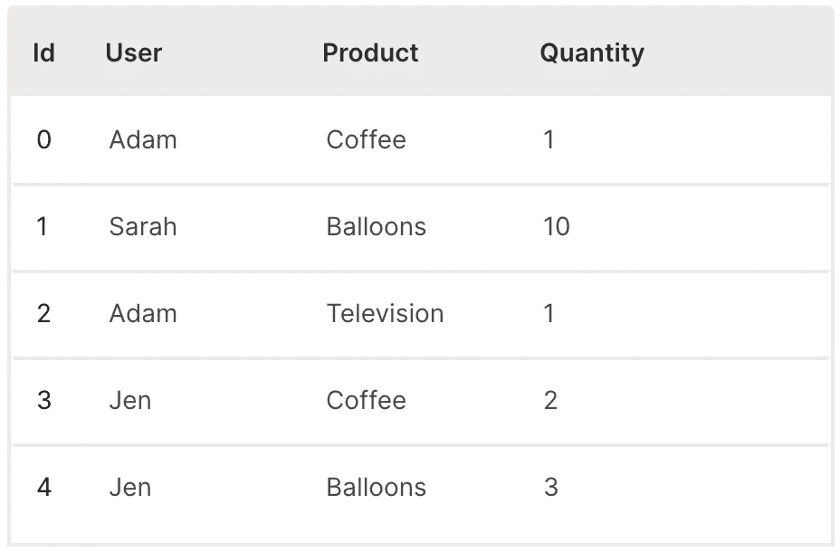

波表(类型)

# 分类

通过单击表格标题，可以对表格进行排序。

`sortable`用于启用一列的排序。

提供`resettable`选项将表格恢复到原始状态非常有用。

```
ui.table(
    name='table_name',
    columns=[
        ...,
        ui.table_column(
            name='user',
            label='User',
            **sortable=True**
        ),
        ui.table_column(
            name='product',
            label='Product',
            **sortable=True**
        ),
        ui.table_column(
            name='quantity',
            label='Quantity'
            **sortable=True**
        )
    ],
    **resettable=True,**
    ...
)
```

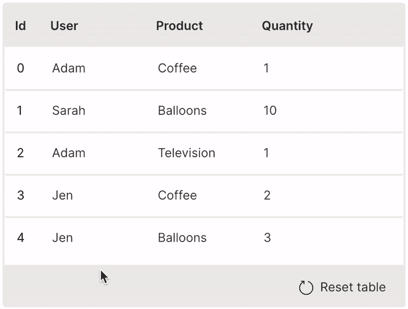

波表(排序)

# 过滤器

可以通过从表格标题中选择值来过滤表格。

`filterable`用于启用对某一列的过滤。

提供`resettable`选项将表格恢复到原始状态非常有用。

```
ui.table(
    name='table_name',
    columns=[
        ...,
        ui.table_column(
            name='user',
            label='User'
            **filterable=True**
        ),
        ui.table_column(
            name='product',
            label='Product'
            **filterable=True**
        ),
        ...
    ],
    **resettable=True,**
    ...
)
```

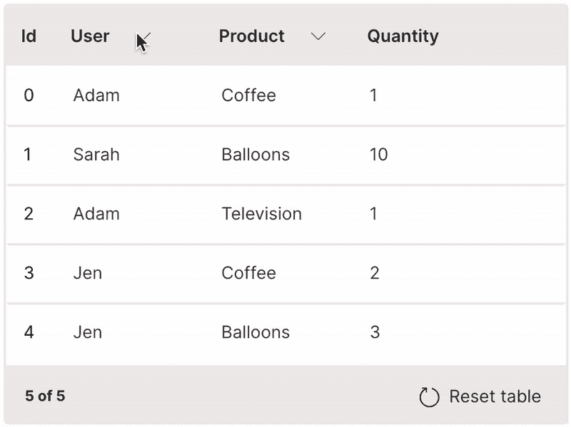

波表(过滤器)

# 组

表可以被视为特定列的组。

`groupable`用于启用表格的分组。

提供`resettable`选项将表格恢复到原始状态非常有用。

```
ui.table(
    name='table_name',
    columns=[
        ...
    ],
    **groupable=True,**
    **resettable=True,**
    ...
)
```

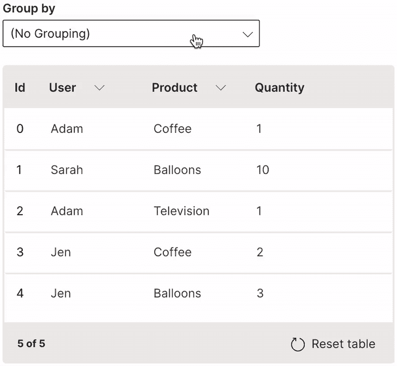

波表(组)

# 搜索

可以基于全部或部分关键字搜索来过滤表格。

`searchable`用于启用对列的搜索。当在搜索栏中输入文本时，将显示至少在一个可搜索列中包含匹配项的每一行。

```
ui.table(
    name='table_name',
    columns=[
        ...,
        ui.table_column(
            name='user',
            label='User',
            **searchable=True**
        ),
        ui.table_column(
            name='product',
            label='Product',
            **searchable=True**
        ),
        ...
    ],
    ...
)
```

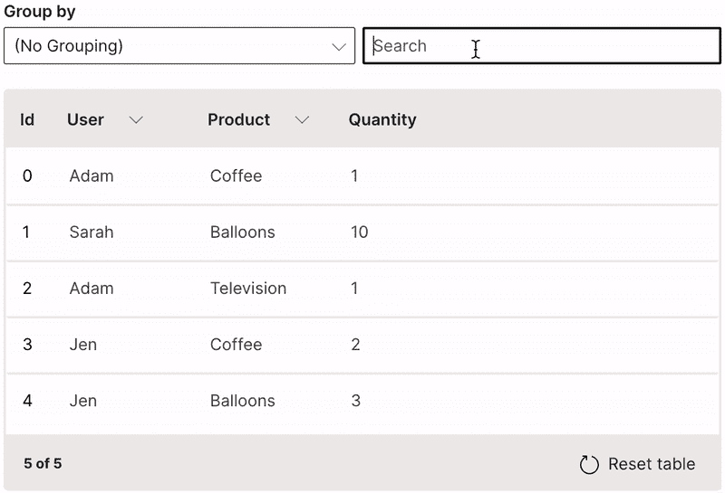

波表(搜索)

# 图标

可以将一列图标添加到表格中。

`cell_type`用于用`ui.icon_table_cell_type`定义图标列。

```
ui.table(
    name='table_name',
    columns=[
        ...,
        **ui.table_column(
            name='icon',
            label='Icon',
            cell_type=ui.icon_table_cell_type(),
            min_width='30px'
        ),**
        ...
    ],
    rows=[
        ui.table_row(name='0', cells=[..., **'CoffeeScript'**, ...]),
        ui.table_row(name='1', cells=[..., **'Balloons'**, ...]),
        ui.table_row(name='2', cells=[..., **'TVMonitor'**, ...]),
        ui.table_row(name='3', cells=[..., **'CoffeeScript'**, ...]),
        ui.table_row(name='4', cells=[..., **'Balloons'**, ...])
    ],
    ...
)
```

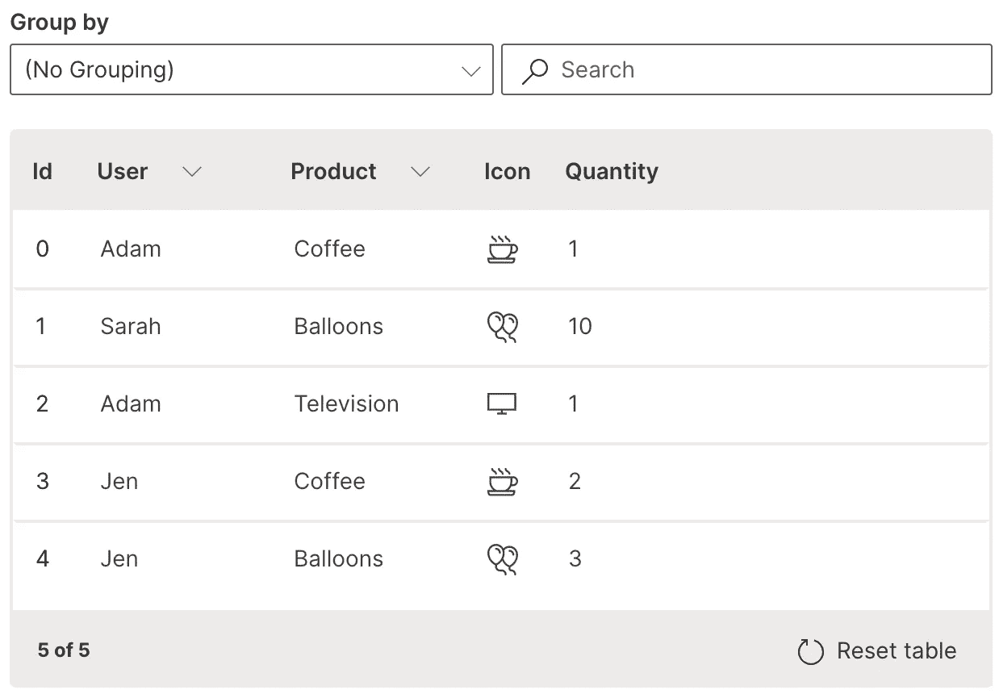

波表(图标)

支持的图标列表可在[此处](https://developer.microsoft.com/en-us/fluentui#/styles/web/icons)获得。

# 百分率

百分比列可以以循环进度图标的形式添加到表格中。

`cell_type`用于用`ui.progress_table_cell_type`定义百分比栏。

```
ui.table(
    name='table_name',
    columns=[
        ...,
        **ui.table_column(
            name='discount',
            label='Discount',
            cell_type=ui.progress_table_cell_type(),
            sortable=True,
            min_width='80px'
        )
**    ],
    rows=[
        ui.table_row(name='0', cells=[..., **'0.09'**]),
        ui.table_row(name='1', cells=[..., **'0.66'**]),
        ui.table_row(name='2', cells=[..., **'0'**]),
        ui.table_row(name='3', cells=[..., **'0'**]),
        ui.table_row(name='4', cells=[..., **'0.15'**])
    ],
    ...
)
```

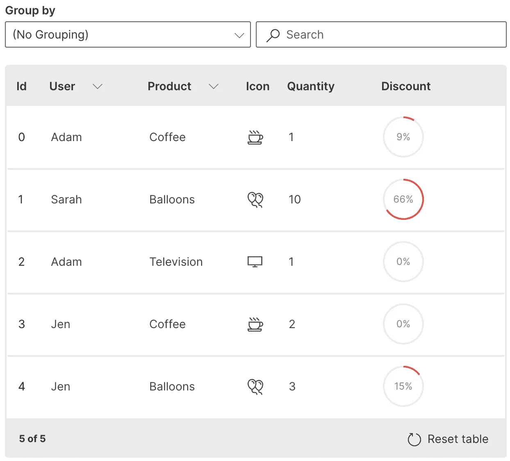

波表(百分比)

# 标签

可以将一列单个或多个标签添加到表中。

`cell_type`用于定义标签列，用`ui.tag_table_cell_type`定义标签列表。

```
ui.table(
    name='table_name',
    columns=[
        ...,
        **ui.table_column(
            name='tags',
            label='Tags,
            cell_type=ui.tag_table_cell_type(
                name='',
                tags=[
                    ui.tag(label='Beverage', color='$brown'),
                    ui.tag(label='Home', color='$blue'),
                    ui.tag(label='Retail', color='$green'),
                    ui.tag(label='Sale', color='$red')
                ]
            )
        )
**    ],
    rows=[
        ui.table_row(name='0', cells=[..., **'Beverage,Sale'**]),
        ui.table_row(name='1', cells=[..., **'Home,Sale'**]),
        ui.table_row(name='2', cells=[..., **'Retail'**]),
        ui.table_row(name='3', cells=[..., **'Beverage'**]),
        ui.table_row(name='4', cells=[..., **'Home,Sale'**])
    ],
    ...
)
```

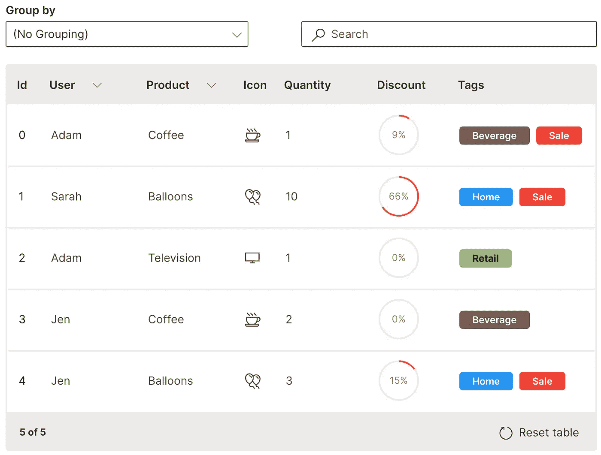

波表(标签)

# 降价

列可以被格式化为表格中的标记文本。

`cell_type`用于通过`ui.markdown_table_cell_type`定义降价列。

```
ui.table(
    name='table_name',
    columns=[
        ...,
        **ui.table_column(
            name='description',
            label='Description',
            cell_type=ui.markdown_table_cell_type(),
            searchable=True
        ),**
        ...
    ],
    rows=[
        ui.table_row(name='0', cells=[..., **'**Product**: *Coffee*\n**Category**: *Beverages*'**, ...]),
        ui.table_row(name='1', cells=[..., **'**Product**: *Balloons*\n**Category**: *Home*'**, ...]),
        ui.table_row(name='2', cells=[..., **'**Product**: *Television*\n**Category**: *Retail*'**, ...]),
        ui.table_row(name='3', cells=[..., **'**Product**: *Coffee*\n**Category**: *Beverages*'**, ...]),
        ui.table_row(name='4', cells=[..., **'**Product**: *Balloons*\n**Category**: *Home*'**, ...])
    ],
    ...
)
```

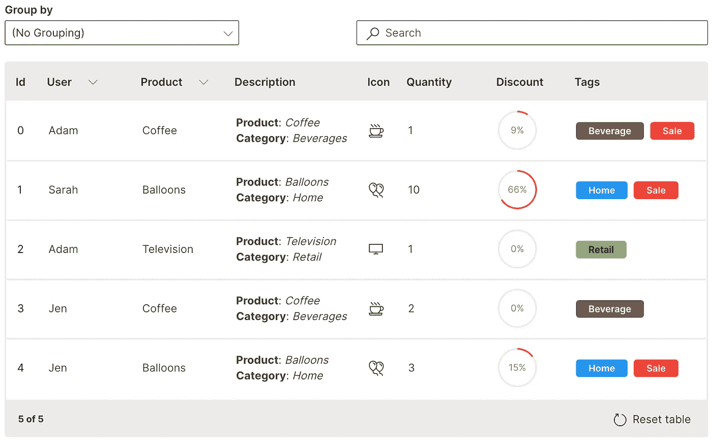

波表(降价)

# 图像

减价格式可以扩展到表格中的图像列。

`cell_type`用于用`ui.markdown_table_cell_type`定义图像列。

```
ui.table(
    name='table_name',
    columns=[
        ...,
        **ui.table_column(
            name='picture',
            label='Picture',
            cell_type=ui.markdown_table_cell_type(),
            searchable=True
        ),**
        ...
    ],
    rows=[
        ui.table_row(name='0', cells=[..., **'<center>'**, ...]),
        ui.table_row(name='1', cells=[..., **'<center>'**, ...]),
        ui.table_row(name='2', cells=[..., **'<center>'**, ...]),
        ui.table_row(name='3', cells=[..., **'<center>'**, ...]),
        ui.table_row(name='4', cells=[..., **'<center>'**, ...])
    ],
    ...
)
```

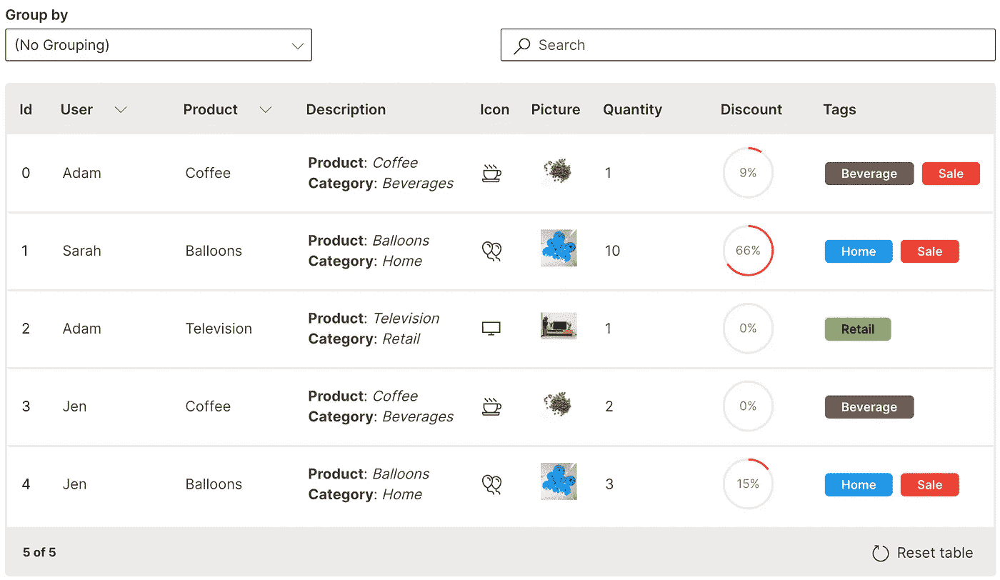

波表(图像)

# 声音的

减价格式可以被扩展到表格中的音频列，在该音频列中可以播放嵌入的音频文件。

`cell_type`用于用`ui.markdown_table_cell_type`定义图像列。

```
ui.table(
    name='table_name',
    columns=[
        ...,
        **ui.table_column(
            name='audio',
            label='Audio',
            cell_type=ui.markdown_table_cell_type(),
            searchable=True
        ),**
        ...
    ],
    rows=[
        ui.table_row(name='0', cells=[..., **'<center><audio controls><source src="https://media.merriam-webster.com/audio/prons/en/us/mp3/c/coffee01.mp3" type="audio/wav">'**, ...]),
        ui.table_row(name='1', cells=[..., **'<center><audio controls><source src="https://media.merriam-webster.com/audio/prons/en/us/mp3/b/balloo01.mp3" type="audio/wav">'**, ...]),
        ui.table_row(name='2', cells=[..., **'<center><audio controls><source src="https://media.merriam-webster.com/audio/prons/en/us/mp3/t/televi03.mp3" type="audio/wav">'**, ...]),
        ui.table_row(name='3', cells=[..., **'<center><audio controls><source src="https://media.merriam-webster.com/audio/prons/en/us/mp3/c/coffee01.mp3" type="audio/wav">'**, ...]),
        ui.table_row(name='4', cells=[..., **'<center><audio controls><source src="https://media.merriam-webster.com/audio/prons/en/us/mp3/b/balloo01.mp3" type="audio/wav">'**, ...])
    ],
    ...
)
```

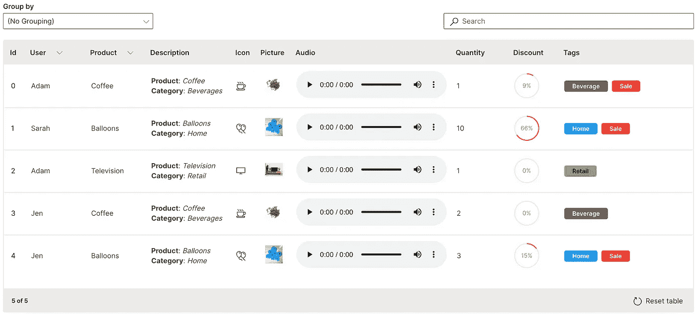

波表(音频)

# 菜单

可以在表格的一行上执行多个自定义操作。

`ui.menu`用于提供动作列表。

```
ui.table(
    name='table_name',
    columns=[
        ...,
        **ui.table_column(
            name='menu',
            label='Menu',
            cell_type=ui.menu_table_cell_type(
                commands=[
                    ui.command(name='view_transaction', label='View Transaction', icon='Shop'),
                    ui.command(name='view_image', label='View Image', icon='ImageSearch')**
                **]
            )
        )**
    ],
    ...
)
```

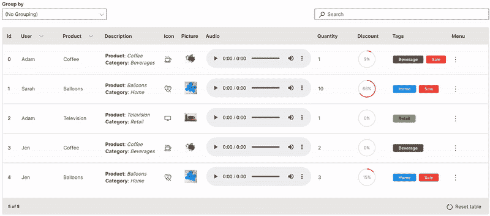

波表(菜单)

# 引发

可以将行触发器设置为对表中的一行执行单个操作。

`link`用于定义触发列。对于要单击的触发器，只能启用一列(通常是 id 或 key 列)。双击一行中的任意位置也会触发对该行的相同操作。

```
ui.table(
    name='table_name',
    columns=[
        ui.table_column(
            name='id',
            label='Id',
            **link=True**
        ),
        ...
    ],
    ...
)
```

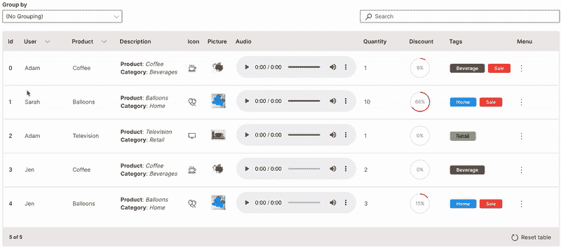

波表(触发器)

# 多选

可以对表中的多行同时执行操作。

`multiple`用于表中行的多选。

```
ui.table(
    name='table_name',
    columns=[
        ...
    ],
    **multiple=True,**
    ...
)
```

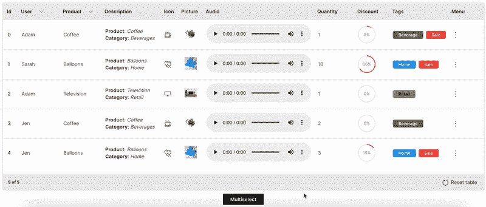

波表(多选)

# 标页数

通过对表进行分页，可以有效地处理大型数据集。

`pagination`用于定义要分页的行数。`rows`需要根据`page_change`事件进行过滤。

```
ui.table(
    name='table_name',
    columns=[
        ...
    ],
    **rows=[
        ...
    ],**
    **pagination=ui.table_pagination(total_rows=5, rows_per_page=2),
    events=['page_change']**
    ...
)
```

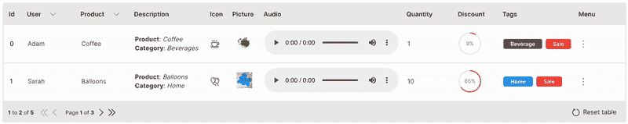

波表(分页)

# [计] 下载

可以下载`csv`格式的表格。

`downloadable`用于下载表格。

```
ui.table(
    name='table_name',
    columns=[
        ...
    ],
    **downloadable=True,**
    ...
)
```

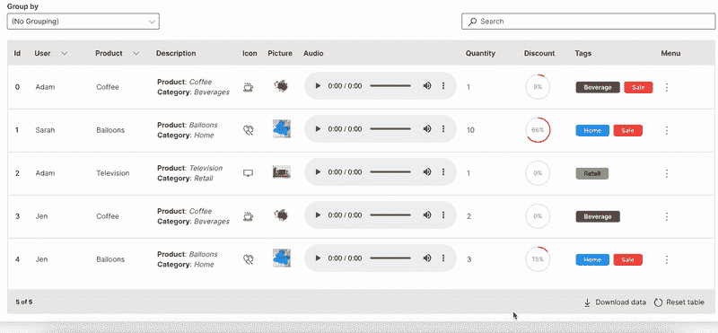

波表(下载)

你可以做很多与 H2O 波的表组件！它使数据科学家和分析师能够构建更具生产力和效率的东西。
这些代码片段有助于开始为不同的数据集和用例扩展它。

# 桌面陈列柜

作为 [WaveTon 系列](https://github.com/vopani/waveton)的一部分，一个成熟的综合应用[表格展示](https://github.com/vopani/waveton/tree/main/apps/skeleton_apps/table_showcase)也是可用的，该系列还提供了处理交互的附带代码，建议作为定制表格的起点。


桌面陈列柜

# 资源和参考

*   [H2O 波](https://wave.h2o.ai)
*   [H2O 波:表组件](https://wave.h2o.ai/docs/examples/table)
*   [H2O 摇表示例](https://wave.h2o.ai/docs/examples/tags#table)
*   [韦弗顿](https://github.com/vopani/waveton)
*   [韦弗顿:桌面陈列柜](https://github.com/vopani/waveton/tree/main/apps/skeleton_apps/table_showcase)