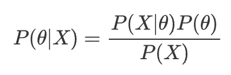
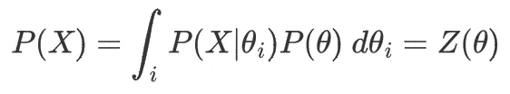
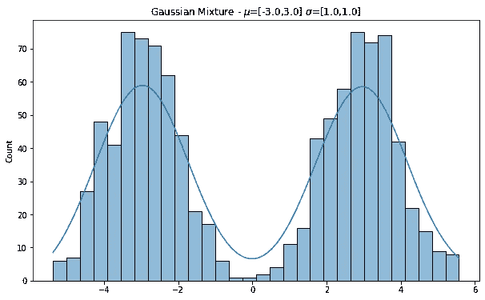
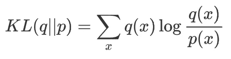
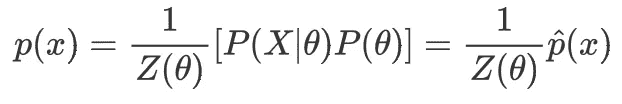
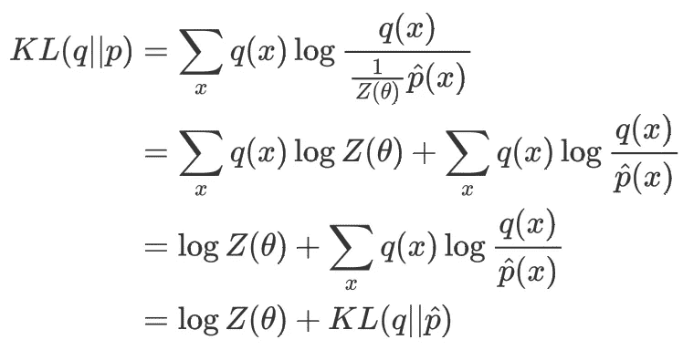
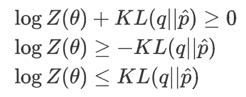
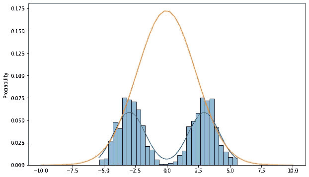
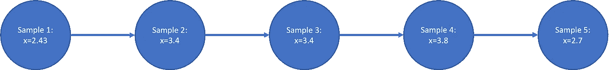
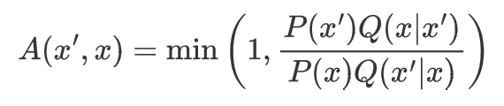

# 贝叶斯推理导论

> 原文：<https://towardsdatascience.com/an-introduction-to-bayesian-inference-2cee9416504c>

## 贝叶斯推理方法的数学+代码介绍-马尔可夫链蒙特卡罗和变分推理。


[斯科特·格雷厄姆](https://unsplash.com/@homajob?utm_source=medium&utm_medium=referral)在 [Unsplash](https://unsplash.com?utm_source=medium&utm_medium=referral) 上拍照

在之前的[博客文章](/an-introductory-primer-to-bayesian-statistics-3415ffa28488)中，我介绍了贝叶斯统计的世界。它检查了贝叶斯统计如何提出一种方法，将证据纳入我们的模型，以获得更好的模型。这个过程被称为推理，这是获得/逼近后验概率的一种奇特的数学说法。

然而，贝叶斯统计的一个大问题是，除了最简单的模型，通常不可能找到分析或精确的解决方案。因此，更常用的近似推断方法侧重于寻找后验估计值。在这篇博文中，我将介绍两种方法:**变分推理**和**马尔可夫链蒙特卡罗**。

# **问题**

让我们首先用贝叶斯推理来重新审视这个问题。



贝叶斯公式告诉我们如何将似然性 P(X|θ)与先验 P(θ)相结合以获得后验。P(X)观察到 X 的概率被称为**证据**，可以通过对所有可能的θ值取一个期望值来计算。这将导致必须计算多个变量的积分或总和，这是非常困难的。



这两种方法不是计算 P(X ),而是变分推理和 MCMC 使用来自分子的信息来直接估计后验概率，完全绕过这个积分。

让我们看看这两种方法在一个玩具示例的上下文中是如何工作的:对 2-混合高斯分布建模。



目标分布-按作者分类的图像

# 变分推理

变分推理(VI)是一种逼近特定概率分布的技术。VI 通过从尽可能接近目标分布 *p* 的分布族 *Q* 中找到概率分布 *q* 来实现这一点。



KL 散度公式

这是通过使用 Kullber-Lieback 散度(KL-Divergence)作为我们的损失函数来实现的。KL 散度是一个量化两个分布之间差异的函数。由于函数是可微的，我们可以使用基于梯度的方法来优化函数。执行这种优化将返回后验分布的局部最优值。

> 尽管 KL 散度衡量两个分布之间的差异，但它不是距离度量。KL(q||p) ≠ KL(p||q)除非 p=q 其中 KL 散度= 0

然而，我们仍然面临一个大问题，首先获得后验 p(x)的函数！假设我们可以找到一个函数 *p^* ，它与 *p* 非常相似，具有相同的最小值。如果是这样的话，我们可以使用梯度下降来优化 KL(*q*|*p^*)，并且我们的近似 *q* 应该是对 *p* 的最佳可能估计。

这个函数 *p^* 就是原始贝叶斯公式中的 p(x |θ)\乘以 P(θ)。这本质上是后验的，没有难以计算的归一化常数/证据。两个函数 p(x)和 p^(x 通过下面的等式相关。



让我们看看当我们取 KL-散度(q||p)时会发生什么



> ∑ q(x)和 Z(θ)是与 x 无关的常数

KL( *q* || *p* )和 KL( *q* || *p^* )之差是一个常数 ***log* Z(θ)** ，两个函数将具有相同的最小值。

这允许通过调整 *q* 的参数使用梯度下降的优化程序，以最小化 KL 损失。

既然我们知道 KL-散度 KL(*q*|*P*)总是≥0，我们就可以推导出 ***log* Z(θ)** 或证据 P(X)的附加性质。



如上所述，KL(*q*|*p^*)将总是大于 ***log* Z(θ)** ，这也是来自等式 2 的 ***log* P(X)** 。具体地，这种损失可以被解释为证据 P(X)的下限。正因为如此，之前我们描述为 KL(*q*|*p^*)的函数也被称为证据下界(ELBO)。我们的函数代表对数似然 ***对数* P(X)** 的下界。最大化这将意味着**增加在所有可能的θ值上看到数据**的可能性。

## **代码实现**

Pyro 和 Tensorflow Probability 是两个可以相对快速地执行变分推理的包，但是对于本教程，我们将使用 JAX 来执行一个实现。JAX 本质上是具有自动微分的 numpy，它将帮助我们更好地理解在我们简单的玩具例子上执行 VI 时在引擎盖下发生了什么。

本质上，JAX 允许对给定函数的梯度进行数值计算。为了使用它，我们只需要定义返回 KL 散度损失的函数。我们的函数有 3 个参数，数据(X)以及我们试图拟合的高斯分布的均值和标准差参数。

获得 KL 散度的函数

一旦写好函数，我们就可以使用`jax.grad`自动获得梯度。`argnums`参数告诉 Jax 我们想要哪个参数的梯度。由此，我们创建了两个函数`mu_grad_kl`和`sigma_grad_kl`，它们将给出各自的梯度更新。

变分推理梯度下降

之后，我们可以使用简单的梯度下降算法来获得拟合分布的参数。注意，由于 KL 散度函数不是凸的，所以所获得的参数只能保证是局部最优，而不是全局最优。



双高斯目标的单高斯拟合—作者提供的图像

正如所料，估计并不完美，仅仅是因为我们的变分模型(单高斯分布)对于目标(混合分布)来说不是一个好的模型。使用混合分布模型作为拟合，我们将能够更好地估计目标。在更复杂的情况下，找到一个好的变分模型是非常困难的。

# **MCMC**

一种替代方法是从分布中取样，而不是用变分推断来近似分布。如果我们可以很容易地从后验分布中抽取无偏样本，我们就可以获得均值和方差，并使用这些信息进行估计。

## **为什么直接取样不起作用？**

不幸的是，对复杂且未知的分布进行采样并不总是那么容易。因为我们有一个非标准化的概率分布，普通分布(指数，高斯)的抽样算法不起作用。因此，我们求助于使用其他方法。

马尔可夫链蒙特卡罗(MCMC)描述了一组特定的采样方法，用于在没有精确概率密度函数的情况下逼近分布**。在深入研究细节之前，让我们首先了解 MCMC 算法的两个组成部分。**

算法的**蒙特卡罗**部分简单地指随机抽样。蒙特卡罗方法是一类基于重复随机抽样的方法。假设我们有一枚硬币，想估计它正面朝上的概率。蒙特卡罗方法是抛硬币很多次，并使用观察结果来预测参数。

马尔可夫链是一种控制一系列事件之间行为的数学模型。链中的每个节点代表一个状态，并通过链接连接在一起，链接是状态之间的转移概率。马尔可夫链的独特之处在于，链中的下一个状态只取决于前一个状态。



来自马尔可夫链的样本—作者图片

在我们的例子中，马尔可夫链中的每个节点都是一个样本。每个样本仅依赖于它之前的样本，并且**转移概率**告诉我们如何从链中导出样本，并且重复进行(蒙特卡罗)以逼近目标分布。

给定正确的转移概率，可以证明当样本数量接近无穷大时，样本的分布将是我们从中采样的目标分布。

> 捷径解释:所有的 MCMC 算法都建立了一个平稳分布为后验的马尔可夫链。给定足够的时间，马尔可夫链将收敛到这个平稳分布，并产生无偏样本。

因为它只有在一段时间后才能达到正确的估计值，所以在使用 MCMC 时，我们必须执行额外的步骤。通常，我们看样本的痕迹，观察它们如何随时间变化。理想情况下，样本应该停止波动，并开始向某个值/范围收敛。

随后，我们在开始时丢弃一部分样本。第一组样本是“预烧”期，在此期间，算法尚未向稳定分布收敛。

## **大都会黑斯廷斯算法**

现在，我们对 MCMC 如何工作有了一些简单的直觉，让我们看看如何才能得到“正确的跃迁概率”。一种常见的 MCMC 算法 Metropolis Hastings 算法被用作例子。

为此我们要做两件事。非标准化概率密度(P)和转移函数(Q)。p 返回一个描述状态概率的值，而 Q 描述到达一个新状态 x '的概率，假设我们处于前一个状态 x。



Metropolis-Hastings 算法的接受概率

这个转移函数可以是简单对称的，就像正态分布一样。 **Q(x'|x) ~ N(x，3)** 。本质上，在每个实例中，我们从一个法线(0，3)采样，我们得到的值被加到 *x* 以获得下一个点。

由于正态分布是对称的，转移函数项 **Q(x|x')** 和 **Q(x'|x)** 将在我们的接受概率中抵消。

这样我们就可以为 MH 算法构造伪代码了

## **算法:**

```
1\. Start from random sample poiint
2\. Sample from Transtion function to get next point
3\. Evaluate the function at th new point
4\. Use the criteria to accept/reject the sample
   a. If accept: Add new sample
   b. Else: Add previous sample
5\. Reject earlier samples for the burn-in period.
```

接受概率有助于算法调整获得的样本。仍将获得来自较低概率密度的样本，但是与高概率样本相比，速率较低。

Metropolis Hastings 算法的代码实现

一旦收集了所有的样本，可以丢弃其中的一半作为老化期，以获得下面的样本

# **比较两种方法**

从所示的两个例子来看，MCMC 似乎是更好的推断方法

*   不需要任何关于后验的事先假设
*   可以收敛到全局最优
*   算法很简单

然而，MCMC 背后的一个大缺点是，对于大量的维度，它的性能比 VI 差。虽然可以保证收敛到最佳分布，但这可能需要非常长的时间。当使用 MCMC 训练大型贝叶斯网络时，这可能是一个巨大的问题，其中变量的数量可以是几百/几千。

另一方面，变分推理使用梯度下降进行训练，并可以利用现代深度学习框架来使用 GPU 并行化计算。此外，寻找全局最优可以被认为是不必要的，因为大多数最先进的神经网络在没有达到全局最优的情况下表现得非常好。

如果你喜欢这篇文章，请在 Medium 上关注我！
在 LinkedIn 上连接:[https://www.linkedin.com/in/reo-neo/](https://www.linkedin.com/in/reo-neo/)