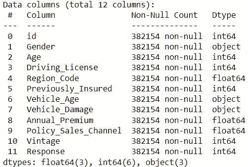
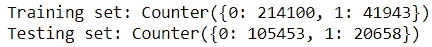
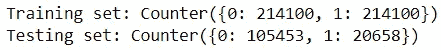

# 数据泄漏介绍

> 原文：<https://towardsdatascience.com/an-introduction-to-data-leakage-f1c58f7c1d64>

## 对数据的粗心处理会破坏你的机器学习模型

来自[佩克斯](https://www.pexels.com/photo/photo-of-gray-faucet-2339722/?utm_content=attributionCopyText&utm_medium=referral&utm_source=pexels)的[路易斯·金特罗](https://www.pexels.com/@jibarofoto?utm_content=attributionCopyText&utm_medium=referral&utm_source=pexels)的照片

在执行机器学习任务时，维护数据卫生至关重要。

人们对这个话题给予了很多关注，重点放在处理过时、不完整或不正确的数据的重要性上。毕竟，忽视数据的整洁会毁掉你建立可靠模型的机会。

然而，尽管对这一主题进行了大量的报道，却缺乏对数据卫生的一个巨大威胁的认识:数据泄漏。

在这里，我们探讨什么是数据泄漏，它是如何发生的，以及如何防止它。

## 数据泄露

首先，让我们快速回顾一下训练集和测试集之间的关系。

**训练集**是用于训练机器学习模型的数据子集，而**测试集**是用于测试模型的数据子集。简单吧？

对这种关系强调不够的是，训练数据需要完全独立于测试数据。测试集中的值应该与训练集中的值无关。

**数据泄露**是使用训练数据以外的信息训练模型时出现的现象。它本质上违反了训练数据的独立性，并允许它被来自外部来源的信息所改变。

反过来，这可以通过提供误导性的评估指标来掩盖模型性能中的缺陷。如果您在这种情况下未能识别数据泄漏，您可能会误以为您的模型是健壮的，但在部署后发现它完全不可靠。

因此，确保在处理数据时不会无意中导致任何数据泄漏是非常重要的。

## 数据泄露的例子

就像厨师小心处理肉类和农产品以避免交叉污染一样，数据科学家必须正确处理他们的培训和测试集以避免数据泄露。

好消息是，只要你小心谨慎，数据泄露是很容易避免的。消除它不需要编写额外的代码行。

坏消息是，您可能会犯一些看似无关紧要的错误，从而使您的项目暴露在数据泄露的风险之下。您的模型不会通知您此类错误，因此您需要保持警惕以避免它们。

让我们来介绍几个可能导致数据泄露的错误。

## 1.不删除重复项

这是从一开始就危及你的项目的一个相当简单的方法。

如果包含重复项，您将冒在定型集和测试集中出现相同记录的风险，从而消除两个数据子集之间的独立关系。

一个简单的解决方法是在将数据分成训练集和测试集之前删除重复的记录。

## 2.分割数据前的要素缩放

特征缩放是预处理中的一个重要步骤，因为它可以确保模型不会偏向于某个特定的特征。

不幸的是，在将数据分成训练集和测试集之前，有时会错误地应用诸如标准化和规范化之类的特征缩放技术。这是一个错误，因为它允许测试数据的值影响训练数据的缩放方式。

特征缩放需要在数据被分割后的发生*。在适当的特征缩放中，需要仅基于训练集中的值来缩放训练数据。之后，需要基于用于缩放训练数据的参数来缩放测试集。*

## 3.拆分数据前的数据扩充

数据扩充是解决数据不平衡和增强模型性能的一种好方法。

但是，它的有效性取决于您在训练模型时如何应用它。

数据增强不只是凭空创造数据；它依靠真实数据和某些算法来生成人工记录。

如果你对算法如何被用来创建合成数据感到好奇，请查看我的文章，其中我给出了 SMOTE 的概要，这是一种更流行的数据增强方法。

 [## 用 SMOTE 创建人工数据

### 如何利用简单的算法来弥补数据的不足

towardsdatascience.com](/create-artificial-data-with-smote-2a31ee855904) 

自然，创建的人工数据的类型取决于输入这种算法的数据。在这个步骤中包括来自测试集的数据将不可避免地影响添加到训练集中的数据。

因此，数据扩充只能在拆分数据后*进行。为了正确执行数据扩充，您为训练模型而生成的人工数据必须仅来自训练数据。*

## 个案研究

为了巩固到目前为止所学的一切，让我们通过一个快速的案例研究来应用我们所学的一切。我们将使用一个提供保险公司客户信息的数据集(无版权)。数据可以在[这里](https://www.kaggle.com/arashnic/imbalanced-data-practice)获得。

这是数据集的预览。

代码输出(由作者创建)

目标变量是“响应”，它代表一个客户是否有兴趣申请保险。

首先，我们可以删除所有缺失值的记录，并用 one-hot-encoding 对分类变量进行编码。

接下来，我们可以用 drop_duplicates()方法删除任何重复项，这样所有的客户机都是惟一的。请注意，这一步是在将数据分成训练集和测试集之前进行的。

既然已经处理了重复数据，我们可以将数据分成训练集和测试集。

接下来，我们可以使用 sklearn 的 [MinMaxScaler](https://scikit-learn.org/stable/modules/generated/sklearn.preprocessing.MinMaxScaler.html) 通过归一化来缩放特征。为了避免数据泄漏，最小最大缩放器应该首先转换训练数据，然后基于用于缩放训练数据的参数来转换测试数据。

最后，我们可以通过应用 SMOTE 来处理任何数据不平衡。在此之前，让我们看看当前的训练集和测试集有多不平衡。

代码输出(由作者创建)

在训练集和测试集中有相当大的不平衡。

这可以通过使用 SMOTE 为训练数据生成人工记录来解决。

让我们看看现在的训练集和测试集有多不平衡。

代码输出(由作者创建)

由于该步骤是在训练测试分割后*执行的，SMOTE 仅使用训练数据创建人工数据。测试集在整个过程中未被触及，并且保持不平衡。*

自始至终，我们对数据集应用了许多技术。然而，由于对训练集和测试集的小心处理，我们能够避免任何数据泄漏。

## 结论

照片由[普拉蒂克·卡蒂亚尔](https://unsplash.com/@prateekkatyal?utm_source=medium&utm_medium=referral)在 [Unsplash](https://unsplash.com?utm_source=medium&utm_medium=referral) 拍摄

最后，避免数据泄露是非常简单的。

如果您注意到了，所有提供的示例都演示了当一个步骤在错误的时间执行时，而不是一起执行时，数据泄漏是如何发生的。

与其随意执行预处理步骤而不注意顺序，不如事先规划好管道。这将使您能够检查每个步骤，并确保在整个过程中训练数据独立于测试数据。

我祝你在数据科学的努力中好运！

## 参考

1.  莫比乌斯。(2022).从不平衡的保险数据中学习，第 4 版。2022 年 2 月 13 日从[https://www.kaggle.com/arashnic/imbalanced-data-practice.](https://www.kaggle.com/arashnic/imbalanced-data-practice.)检索