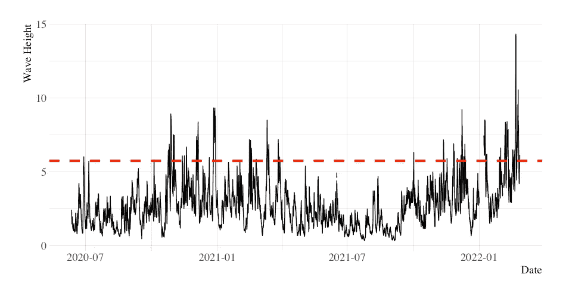
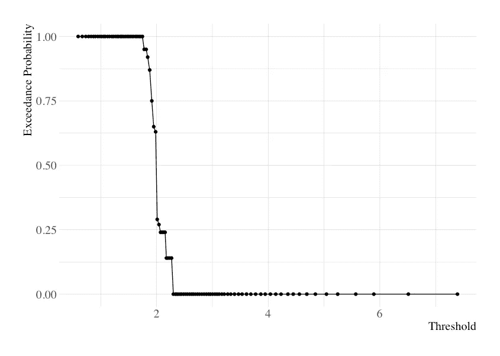

# 超越概率预测导论

> 原文：<https://towardsdatascience.com/an-introduction-to-exceedance-probability-forecasting-4c96c0e7772c>

## 用 Python 预测时间序列中极值出现的概率

让-丹尼尔·卡拉姆在 [Unsplash](https://unsplash.com?utm_source=medium&utm_medium=referral) 上拍摄的照片

**超越概率预测**是估计一个时间序列在预定义的未来时期内超过预定义阈值的概率的问题。

在前一篇[文章](https://vcerq.medium.com/6-time-series-predictive-tasks-you-should-know-about-b899fb83b6bf)中，我简要描述了时间序列数据出现的 6 个问题，包括超越概率预测。在这里，我将更深入地研究这项任务。在一些基本的定义之后，我将解释为什么这个问题很重要，以及如何使用 Python 在你自己的时间序列中应用它。

图 1:海浪高度时间序列。预测它是否超过预定义的阈值(红色虚线)对于确保海上作业的安全非常重要。图片作者。

超越概率预测与许多领域相关，例如经济学。央行依赖于对通胀率是否会超过某个阈值的估计。如果这种可能性很高，那么央行可能会通过提高利率来应对。

**本质上，这个问题在极端值(即分布的尾部)高度相关的情况下很重要。**另一个例子如图 1 所示，与海洋数据分析相关。短期预测海浪高度对于估算发电量非常重要。但是大浪会对海上作业的安全造成威胁(例如船只的安全通行)，因此预测大浪非常重要。

**概率输出是可取的，因为它携带更多的信息来支持决策，特别是当风险很高时。虽然很可能不会下雨，但预报“有 10%的可能性会下雨”比简单地说“不会下雨”更能提供信息。厌恶风险的人可能热衷于拿一把雨伞。**

# 把手放在某物或者某人身上

有两种主要方法可用于解决超越概率问题:二元分类或预测集合。让我们对这两个选项进行概述和编码。

## 二元分类

超越与二元事件有关。因此，**模拟超越概率最自然的方法是将问题框架化为二元分类**问题。解释变量代表最近过去的观察，以及你可能有的任何额外变量。目标变量是二进制的，指示事件是否发生，即是否超过阈值。然后，我们可以使用概率分类器(如逻辑回归)来估计超标概率。

这里有一个 Python 模型可以做到这一点。我将使用一个与波高相关的时间序列，你可以在这里得到。您可以在图 1 中看到部分时间序列。为了简洁起见，我将跳过基本的时间序列预处理。

脚本 1:为超标概率预测创建二元分类模型的代码模型

我们从读取数据和转换 *pd 的时间序列开始。Series* type)转换成一组我们可以输入学习算法的观察值(第 8-21 行)。然后，我们将数据分为训练和测试(第 24 行)，并将阈值设置为第 95 个*百分点(第 27 行)。我们任意设置阈值，但是这个值强烈依赖于数据集。使用阈值创建二元响应变量(第 30-31 行)，然后训练分类器(第 34-35 行)。最后，我们在第 38 行中检索检验观测值的超越概率。*

## 预测集合

照片由 [kazuend](https://unsplash.com/@kazuend?utm_source=medium&utm_medium=referral) 在 [Unsplash](https://unsplash.com?utm_source=medium&utm_medium=referral) 上拍摄

分类方法的替代方法是使用预测集合。本质上，我们训练几个预测模型来预测时间序列的未来值。然后，**我们可以通过计算预测值超过阈值的模型的比率来估计超过概率。**

基于集合的方法在与环境科学相关的领域中很常见，例如气象学或水文学。在这些领域中，通过改变初始条件来建立不同的模型。在机器学习中，我们可以做到这一点，例如，通过使用不同的学习算法或不同的训练集。

下面是一个创建预测集合的模型。在这种情况下，我们将使用随机森林，它在不同的训练集上训练几个决策树。这是上一个脚本的延续，所以我将直接开始创建模型。

剧本 2:剧本 1 的延续。为超越概率预测创建回归预测集合的代码模型

首先，我们创建预测集合(第 1-8 行)。请注意，我们现在使用数字响应变量来表示序列的下一个值。然后(第 11-12 行)，我们检索每个系综成员的数值预测(在这种情况下，是一棵树)。最后，在第 15 行计算超越概率。

## 评估预测

我们可以使用 AUC(ROC 曲线下面积)或 Brier 评分等指标来评估每种方法。这些衡量概率预测的准确性。请看下面的脚本。

脚本 3:评估概率预测的准确性

# 每种方法的优缺点

根据输入数据集，这些方法中的一种可能会执行得更好。但是，除了性能之外，还有其他方面需要考虑，使这些策略中的一个相对于另一个更可取。

相对于分类器，通过集成采用回归方法具有两个主要优点。第一个是**集成模型**,因为集合的预测不仅可以用于估计超越概率，还可以用于估计时间序列的未来值。第二个优点是**阈值** **灵活性**因为这个参数不是事先固定的。分类方法在训练期间固定阈值，并且不能为了推断而改变。另一方面，回归模型遵循关于阈值的懒惰方法。因此，在给定时刻，我们可以使用相同的模型来估计不同阈值的超越概率。这使我们能够绘制如图 2 所示的超越概率曲线。

图 2:超越概率曲线，给出了不同阈值的超越概率。图片作者。

另一方面，众所周知，集成方法的计算量**很大**，这阻碍了它们在许多领域的应用。

# 扩展ˌ扩张

## 峰值超过阈值(POT)

超越概率预测的一个相关问题是峰值超过阈值分析。但是，峰值超过阈值方法的目标不是试图预测超出事件，而是研究超出阈值的观测值的统计特性。

## 超越一个门槛

虽然超越概率预测通常指二元事件(无论超越是否发生)，但也可以定义多个阈值。

这方面的一个例子是在定量交易中使用的三重屏障方法。股票市场交易者可能对根据价格变动预测买入、卖出或持有信号感兴趣。在预测价格回报方面超过正阈值可以用作买入信号；相反(预测价格回报低于负阈值)可以代表卖出触发。如果没有一个阈值被满足，那么交易者应该持有当前的头寸。

# 外卖

*   超越概率预测是估计一个时间序列在一个预先定义的未来时期内超越一个预先定义的阈值的概率的过程；
*   这个问题与极端值对预测很重要的情况有关；
*   解决这一任务有两种主要方法:二元分类模型或预测集合。各有利弊。

## 进一步阅读

[1]泰勒、詹姆斯·w .和余克明。"利用自回归 logit 模型预测金融风险管理的超越概率."*《英国皇家统计学会杂志:A 辑(社会中的统计学)*179.4(2016):1069–1092。

[2] Méndez，Fernando J .等人，“使用与时间相关的峰值超过阈值(pot)模型对极端显著波高的长期可变性进行估计。”*地球物理研究杂志:海洋* 111。C7 (2006 年)。