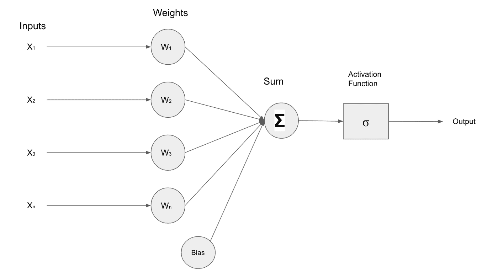
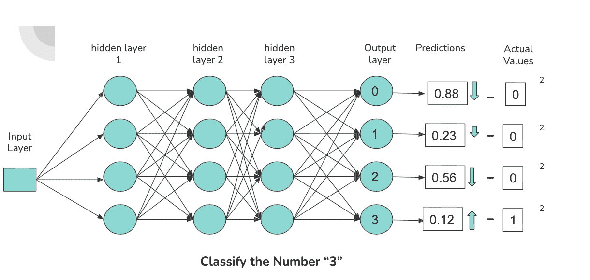
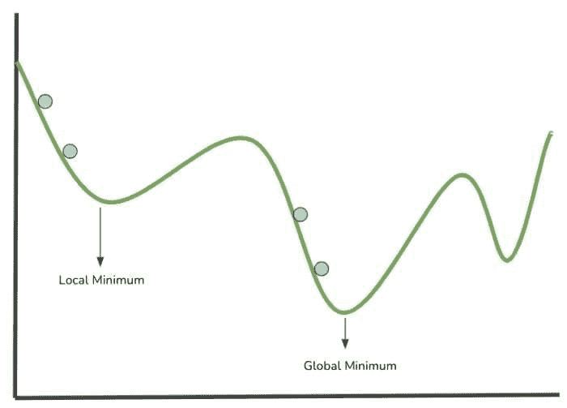
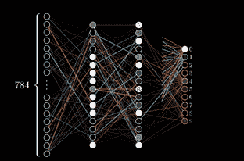

# 机器学习算法中的梯度下降和反向传播导论

> 原文：<https://towardsdatascience.com/an-introduction-to-gradient-descent-and-backpropagation-in-machine-learning-algorithms-a14727be70e9>

## 机器学习算法利用反向传播和梯度下降算法来模拟学习。理解神经网络中学习的计算模拟所涉及的算法和过程的基本原理。

照片由 Unsplash 上的 ThisisEngineering RAEng 拍摄

[人工神经网络](https://developer.nvidia.com/discover/artificial-neural-network) (ANN)是[人工智能](https://www.nvidia.com/en-us/glossary/data-science/artificial-intelligence/)技术的基本构件。人工神经网络是[机器学习](https://www.nvidia.com/en-us/glossary/data-science/machine-learning/)模型的基础；它们模拟了和人脑一样的学习过程。简而言之，人工神经网络赋予机器在特定任务中完成类似人类(甚至更高)表现的能力。本文旨在为数据科学家提供基本的高级知识，帮助他们理解在训练人工神经网络时调用的函数和方法中涉及的低级操作。

作为数据科学家，我们的目标是通过揭示数据中的模式来解决业务问题。通常，这是通过使用机器学习算法来识别模式和表示为模型的预测来完成的。为特定用例选择正确的模型，并适当地调整参数，需要对问题和底层算法有透彻的理解。考虑对问题域和算法的理解，以确保我们恰当地使用模型，并正确地解释结果。

本文介绍和解释梯度下降和反向传播算法。这些算法有助于人工神经网络从数据集学习，特别是在涉及数据点和神经网络预测的操作导致网络参数值发生修改的情况下。

# 建立直觉

在我们进入这篇文章的技术细节之前，让我们看看人类是如何学习的。

人类大脑的学习过程是复杂的，研究几乎没有触及人类如何学习的表面。然而，我们所知道的一点点对构建模型是有价值和有帮助的。与机器不同，人类不需要大量数据来理解如何解决问题或进行逻辑预测；相反，我们从经验和错误中学习。

人类通过突触可塑性的过程来学习。突触可塑性是一个术语，用来描述在获得新信息后，新的神经连接是如何形成和加强的。与我们经历新事件时大脑中的连接被加强和形成的方式相同，我们通过计算神经网络预测的误差，并根据这些误差加强或削弱神经元之间的内部连接，来训练人工神经网络。

# 梯度下降

梯度下降是一种标准的优化算法。它经常是引入来训练机器学习的第一个优化算法。让我们剖析一下术语“梯度下降”，以便更好地理解它与机器学习算法的关系。

梯度是对直线或曲线的陡度进行量化的度量。数学上，它详细描述了直线上升或下降的方向。

下降是向下的动作。因此，梯度下降算法基于这些短语的两个简单定义来量化向下运动。

为了训练机器学习算法，你努力识别网络中的权重和偏差，这将帮助你解决正在考虑的问题。例如，您可能有一个分类问题。当查看图像时，您想要确定图像是猫还是狗。要构建模型，您需要使用带有正确标记的猫狗图像数据样本的训练数据来训练您的算法。

虽然上述示例是分类，但问题可能是定位或检测。尽管如此，一个神经网络对一个问题的表现如何被建模为一个函数，更具体地说，是一个成本函数；成本或有时被称为损失函数，衡量一个模型的错误程度。成本函数的偏导数影响最终模型的权重和选择的偏差。

**梯度下降是一种便于搜索参数值的算法，该算法使成本函数朝着局部最小值或最佳精度最小化。**

# 神经网络中的成本函数、梯度下降和反向传播

神经网络令人印象深刻。同样令人印象深刻的是，计算程序能够在没有被明确告知要检测什么特征的情况下，区分图像和图像中的对象。

将神经网络视为接受输入(数据)以产生输出预测的函数是有帮助的。这个函数的变量是神经元的参数或权重。

**因此，解决提交给神经网络的任务的关键任务将是以接近或最好地代表数据集的方式调整权重和偏差的值。**

下图描绘了一个接收输入(X1，X2，X3，Xn)的简单神经网络，这些输入被前馈到包含权重(W1，W2，W3，Wn)的层内的神经元。输入和权重经过乘法运算，结果由加法器()相加，激活函数调节该层的最终输出。

图 1:作者创建的浅层神经网络图像

为了评估神经网络的性能，需要一种用于量化神经网络预测和实际数据样本值之间的差异或差距的机制，产生影响神经网络内的权重和偏差的修改的因子的计算。

通过**成本函数**来促进神经网络的预测值和数据样本的实际值之间的误差差距。

图 2:描绘的神经网络内部连接和预测

上图展示了一个由密集连接的神经元组成的简单神经网络架构，它对包含数字 0-3 的图像进行分类。输出层中的每个神经元对应一个数字。神经元连接的激活程度越高，神经元输出的概率就越高。该概率对应于通过网络前馈的数字与激活的神经元相关联的可能性。

当一个“3”通过网络被前馈时，我们期望负责分类“3”的连接(由图中的箭头表示)具有更高的激活，这导致与数字“3”相关联的输出神经元的概率更高。

几个组件负责神经元的激活，即偏置、权重和先前层激活。对于神经网络，这些指定的组件必须被迭代地修改，以在特定数据集上最佳地执行。

通过利用诸如“均方误差”的成本函数，我们获得与网络误差相关的信息，该信息用于通过网络的权重和偏差向后传播更新。

**为了完整起见，下面是机器学习中使用的成本函数的例子:**

*   均方误差
*   范畴交叉熵
*   二元交叉熵
*   对数损失

我们已经介绍了如何通过测量网络预测的技术来提高神经网络的性能。本文的其余内容集中在梯度下降、反向传播和成本函数之间的关系。

图 3 中的图像展示了一个绘制在 x 轴和 y 轴上的成本函数，该函数的参数空间中包含值。让我们来看看神经网络如何通过将成本函数可视化为在可能的权重/参数值的参数空间内的图表上绘制的不平坦表面来学习。

图 3:梯度下降可视化

上图中的蓝点表示搜索局部最小值的一个步骤(将参数值评估到成本函数中)。建模成本函数的最低点对应于导致成本函数最低值的权重值的位置。成本函数越小，神经网络的性能越好。因此，可以根据收集的信息修改网络的权重。

梯度下降是一种算法，用于引导在每一步选择的值对向最小值移动。

*   局部最小值:在成本函数的指定范围或扇区内的最小参数值。
*   全局最小值:这是整个成本函数域内的最小参数值。

梯度下降算法通过计算可微函数的梯度并沿梯度的相反方向移动，来指导在局部/全局最小值处最小化函数的值的搜索。

让我们换个话题，回顾一下反向传播。

反向传播是迭代调整神经元输出(偏差、权重、激活)以降低成本函数的方法。在神经网络架构中，神经元的输入(包括与前一层中的神经元的所有先前连接)决定其输出。

嵌入在反向传播中的迭代数学过程计算成本函数相对于权重、偏差和先前层激活的偏导数，以识别哪些值影响成本函数的梯度。

通过计算梯度最小化成本函数导致局部最小值。在每个迭代或训练步骤中，网络中的权重通过计算的梯度以及*学习速率*进行调整，学习速率控制对权重值进行修改的因子。在神经网络的训练阶段，对要采取的每一步重复该过程，目标是在每一步之后更接近局部最小值。

图 4:错误的向后传播(反向传播)。Gif 来源:3Blue1Brown，第三章，深度学习

“反向传播”这个名字来源于这个过程的字面意思，即“错误的反向传播”梯度的偏导数量化了误差。通过在网络中反向传播误差，最后一层(离输出层最近的层)的梯度的偏导数用于计算第二层到最后一层的梯度。

误差通过各层传播，并且在当前层中利用来自前一层的梯度的偏导数，直到到达网络中的第一层(最接近输入层的层)。

# 梯度下降算法的类型

神经网络预测的成本是通过评估训练集中的预期结果和数据样本来确定的。使用反向传播和梯度下降将数据传送到神经网络以进行权重修改采取了各种形式。

本节介绍了基于训练数据和训练数据集中的数据样本计算梯度下降的三种常用方法。

*   **批量梯度下降(BGD)**
*   **随机梯度下降法**
*   **小批量梯度下降**

## 批量梯度下降

我们了解梯度下降是如何工作的，现在可以将其应用于我们的训练数据。梯度下降算法对训练数据的应用有多种形式。一种形式叫做**批量梯度下降(BGD)** 。

在图 3 中，我们朝着局部最小值的方向前进。当使用 BGD 时，我们应用每一个训练数据来决定我们朝最小的方向走了多远。在每个阶段，我们都会利用所有的训练数据。

对于大量数据，训练时间可能会延长。尽管如此，它在计算上是高效的，因为我们不像其他梯度下降变体那样频繁地修改我们的模型参数。因为在训练模型时我们需要所有的数据集，所以 BGD 不是内存高效的。

## 随机梯度下降

随机梯度下降(SGD)的工作方式是从训练集中选取单个数据点，并基于该单个数据点计算梯度，而不是遍历训练集中的每一个数据，然后移向局部最小值。

在 BGD 和随机梯度下降之间，后者明显更快，因为您是在计算单个数据实例的梯度，而不是整个数据集。这有什么影响？

随机梯度下降的缺点在于，当利用梯度下降时，参数空间内的更新可能有噪声。当从训练集中选择数据点来计算每一步的梯度时，SGD 的随机性质使它变得有噪声。

为了适应随机梯度下降的噪声并保证我们达到最佳参数值，我们必须对训练数据迭代特定次数，并确保训练数据在梯度下降开始时被混洗。

噪声导致求解成本函数的模糊参数值。然而，给定足够的时间，随机梯度下降将收敛于局部最小值。随机梯度下降的噪声和随机性也是有利的。当算法变得“停滞”时，这对于摆脱不是全局最小值的局部最小值是有用的

与 BGD 相比，SGD 在每一步分配参数值时，由于其随机和不稳定的特性，具有避开局部最小值和找到全局最小值的优点。

在每一步分配参数值时，随机梯度下降的随机和不可预测的性质使其在避免局部最小值和定位全局最小值方面优于 BGD。

但是与随机梯度下降相比，BGD 参数值更接近全局最小值和最优值。当在梯度下降算法的两个变型之间进行选择时，在速度和最优性之间有一个折衷。

## 小批量梯度下降

考虑采取一种独特的方法来结合新加坡和 BGD 的优势。

**小批量梯度下降**算法使用从训练集中随机选择的多个数据样本计算梯度，就像 SGD 一样。然而，当计算梯度时，它不包括整个数据集，所以它不完全是 BGD。你可以把它描述为两种方法的混合。

与 BGD 相比，Mini Batch GD 在计算梯度时使用最少量的数据；但是，比 SGD 慢。

与 SGD 相比，小批量 GD 的一个关键优势是小批量梯度下降减少了参数空间中的噪音。因此，与单批次 GD 相比，使用小批次梯度下降可获得更可行的最佳参数值。

# 摘要

这只是梯度下降和反向传播主题的初级读本。有一整个世界的数学和微积分与梯度下降的话题。

诸如 [TensorFlow](https://www.nvidia.com/en-us/glossary/data-science/tensorflow/) 、 [SciKit-Learn](https://www.nvidia.com/en-us/glossary/data-science/scikit-learn/) 、 [PyTorch](https://www.nvidia.com/en-us/glossary/data-science/pytorch/) 之类的软件包通常会抽象出实现训练和优化算法的复杂性。然而，这并没有解除数据科学家和 ML 从业者理解这些智能“黑盒”背后发生的事情的需求

想探索更多与反向传播相关的数学吗？以下是一些有助于您探索的资源:

*   [神经网络:利用反向传播进行训练](https://www.jeremyjordan.me/neural-networks-training/)
*   [反向传播](https://brilliant.org/wiki/backpropagation/)
*   [反向传播算法如何工作](http://neuralnetworksanddeeplearning.com/chap2.html)

通过探索 [Nvidia 深度学习学院](https://www.nvidia.com/en-in/training/online/#:~:text=DEEP-,LEARNING,-ACCELERATED%20COMPUTING)提供的各种课程和实践教程，深入深度学习的世界。

*感谢阅读。*

[本文最初发表于 Nvidia AI 博客](https://developer.nvidia.com/blog/a-data-scientists-guide-to-gradient-descent-and-backpropagation-algorithms/)

## 我希望这篇文章对你有用。

要联系我或找到更多类似本文的内容，请执行以下操作:

1.  [**成为推荐媒介会员，支持我的写作**](https://richmondalake.medium.com/membership)
2.  订阅我的 [**YouTube 频道**](https://www.youtube.com/channel/UCNNYpuGCrihz_YsEpZjo8TA) 获取 AI 播客和即将推出的内容。
3.  订阅我的 [**邮件列表**](https://richmond-alake.ck.page/c8e63294ee) 获取我的简讯