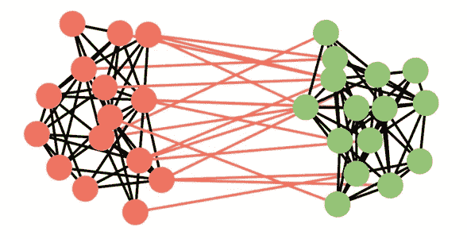
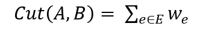
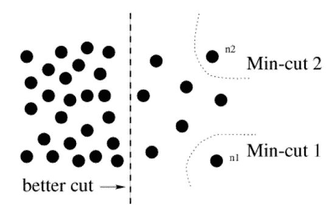
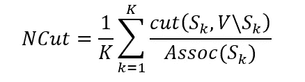
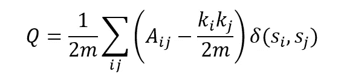
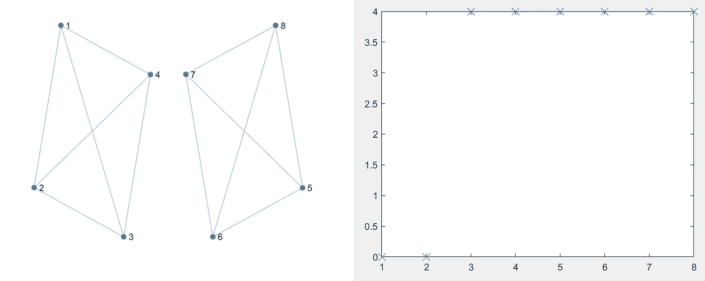
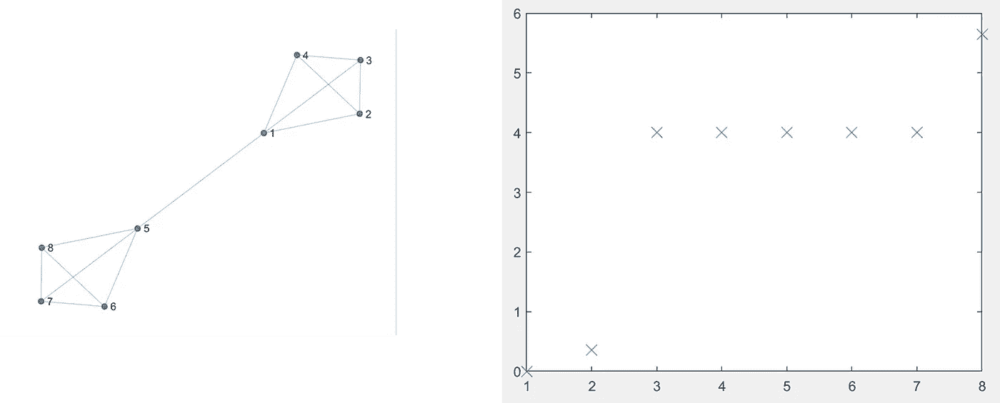
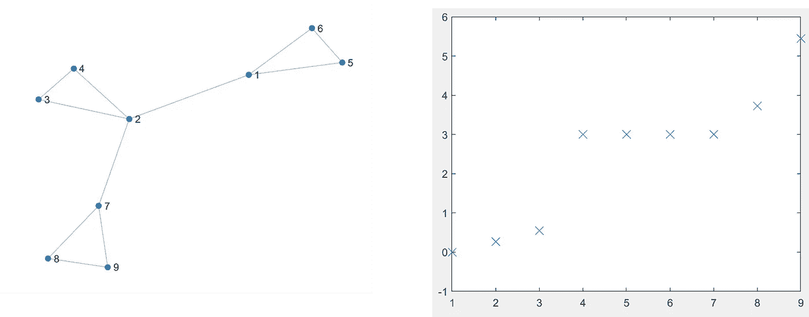
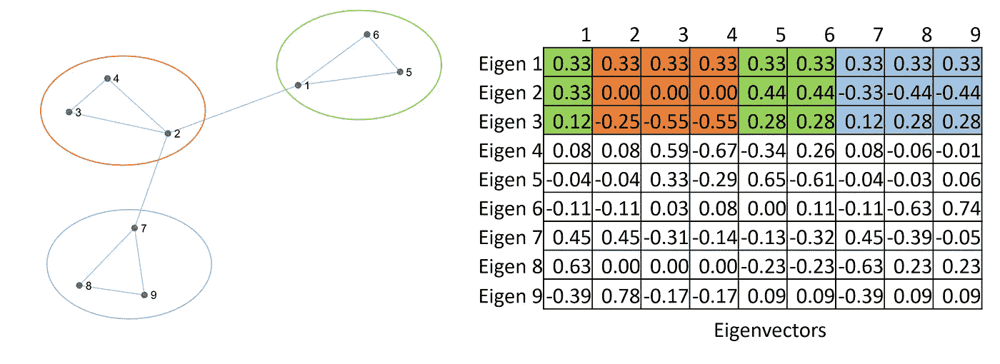

# 图划分算法和社区检测简介

> 原文：<https://towardsdatascience.com/an-introduction-to-graph-partitioning-algorithms-and-community-detection-29e7c962d10e>


[D 锦鲤](https://unsplash.com/@dkoi?utm_source=medium&utm_medium=referral)在 [Unsplash](https://unsplash.com?utm_source=medium&utm_medium=referral) 上的照片

图划分是一个长期存在的问题，有着广泛的应用。这篇文章分享了图划分的方法，包括一些流行的图划分算法的理论解释和 python 代码的实际实现。

## 澄清

*“聚类”在不同的语境下可能会令人混淆。在本文中，集群意味着节点集群，即将图划分为集群(或社区)。我们交替使用图划分、(节点)聚类和社区检测。换句话说，我们在本文中没有考虑重叠社区。(请注意，社区检测的更广泛定义可以包括重叠社区)*

# 三言两语…

图划分通常是一个无监督的过程，我们定义期望的质量度量，即聚类评估度量，然后我们采用一些算法来基于定义的评估度量找到最佳划分解决方案。在余下的内容中，我们将首先介绍两个最常用的评估指标。然后，我们介绍两种方法，可以有效地找到每个评估指标的(近似)解决方案。

# 聚类评估指标

由于聚类通常是一项无人监督的任务，因此重要的是要有一个质量度量或目标函数来评估聚类解决方案。其他领域中的聚类通常在数据点上使用不同的基于距离的函数来测量聚类的质量。然而，由于图是非欧几里得数据，并且数据点的距离远不如图中的连接重要，所以我们需要对图中的聚类进行不同的测量。换句话说，质量度量需要在图的连通性上定义。

## 切割和规格化切割

通常，如果一部分节点和边彼此紧密连接，则它们被认为是一个社区(或一个集群)，否则被认为是不同的社区。因此，很自然地对图进行聚类，使得节点在一个聚类中具有最大边，而在不同的聚类中具有最小边。跨越不同聚类的边的权重之和被定义为图的“切割”。换句话说，“切割”是为了将图完全分离成单独的子图而移除的边的总权重。



切割的简单说明。作者图片

在数学上，将图 G‘切割’成两个不相交的集合 A 和 B 可以计算为:



求图 G 聚类的最佳方式，问题等价于求“割”的最小值，即 *min-cut* 。然而，也不难看出，最小割的一种可能的退化解决方案是从整个图中切掉少量节点，从而产生仅移除几条边的平凡聚类。一种退化的解决方案如所示



由 *min-cut 提供的琐碎解决方案示例。图来自*【1】。

为了克服这个问题，[1]提出了一种方法来归一化每个聚类内的边的体积的测量的切割，定义为关联(Assoc)。



*归一化切割(n-切割)*有效地惩罚了*最小切割中的退化解，*使其在包括图像分割和图形社区检测在内的许多应用中成为一种鲁棒且流行的聚类度量。

## 模块性

图模块性是在[2]中作为一个质量函数引入的，用于评估社区的紧密性。模块化 *Q* 定义为:



其中 *2m* 是边的体积， *A* 是图邻接矩阵， *k_i 和 k_j* 是节点 *i* 和节点 *j* 的度，s_i 和 s_j 是社区指示器。

图形模块性的解释:

A_ij 是每两个节点之间的实际边数，因为图的邻接矩阵定义了图的连通性。并且表达式( *k_i*k_j)/2m* 给出了每两个节点之间的期望边数(假设随机放置边)，或者换句话说，节点 *i* 和节点 *j* 之间存在边的概率(如果随机放置边)。

因此，模块性可以解释为一个社区(或一个集群)中每对节点的实际边数与期望边数(假设边是随机放置的)之差。

模块性取[-0.5，1]之间的值，并且当社区与图的剩余部分断开时最大，当社区包含完全断开的节点时最小。

# 图划分算法

我们可以很容易地使用前面提到的两个评估指标来测试一个图划分解决方案。然而，寻找(最佳)图划分解决方案是 NP 完全的。换句话说，没有已知的有效算法能比暴力算法更有效地解决这个问题。通俗地说，**保证**得到**最佳**解决方案的唯一可能方式是尝试每一种可能的组合……由于图形的大小，它几乎对图形聚类解决方案的所有组合进行了详尽的测试(例如强力测试)。因此，多年来，已经提出了不同的有效算法来寻找图聚类的**近似**解。

## 谱聚类

众所周知，*最小割*问题可以通过 Ford-Fulkerson 算法高效解决。然而，当施加尺寸平衡条件(即*规格化切割*)时，这个问题就变成了 NP 完全问题。谱聚类是一种在归一化的图拉普拉斯上逼近归一化的特征值/特征向量分解的解的方法。

*   通过下式获得图拉普拉斯算子:L=D-A
*   执行图拉普拉斯的特征分解。Lv=λv
*   将图形投影到对应于 k 个最小特征值的特征向量，每列投影的特征向量是每个节点的特征特征
*   对本征特征执行 k-均值聚类

特征值表示图的连通性。当我们向下遍历一个图时，图拉普拉斯的特征值给我们洞察变化。最小的特征值总是零。零特征值的数量表示图中连通分量的数量。从下面的例子可以看出这一点。



具有两个相连组件的图形(左)。相应的特征值(右)。作者图片



有一个连通分量的图形(左)。相应的特征值(右)。作者图片

如果你仔细观察特征值，你会注意到光谱中有一个突然的变化。我通常称之为“本征能隙”(尽管我注意到对此有不同的定义)。间隙表示图中自然存在的簇的数量。这可以从下面的例子中观察到:



有三个自然集群的图表(左)。相应的特征值(右)。作者图片


具有两个自然集群的图形(左)。相应的特征值(右)。作者图片

请注意,“间隙”出现的位置从“3”变为“2 ”,正好对应于图中的聚类数。

这种观察为我们提供了使用特征值来查找图中聚类数的直觉，特别是当我们不知道数据中实际或预期的聚类数时(这通常是真实世界的用例)。

接下来，我们需要做的就是将特征向量投影到图的每个节点上。在下面的示例中，我们之前已经在特征值图中确定了三个集群。因此，我们只取最小的三个特征值对应的前三个特征向量。注意，每个特征向量正好包含 N 个数字，其中 N 是图中节点的数量。我们将前三个特征向量投影到每个节点，每列作为特征特征。执行 K-means 聚类(或您喜欢的对数据点的任何其他聚类方法)来基于本征特征找到聚类。以下示例中的颜色表示已识别的分类。注意，在计算中仅使用了前三行(即前三个特征向量)。您可以通过查看每个聚类中本征特征的距离来进行快速验证。请注意，我特意在图中的一个集群中制作了{1，5，6}，以表明节点索引无关紧要。



特征向量聚类的图示。作者图片

好了，这就是谱聚类背后的数学。在真实的情况下，除非您是一名研究人员或者您想要完全理解您正在做的事情，否则您并不真的需要经历所有这些复杂的实现。使用谱聚类的一个更简单的方法是使用 *sklearn* 库中的实现。下面的代码块中显示了一个示例:

```
import networkx as nx
from sklearn.cluster import SpectralClustering
from sklearn.metrics.cluster import normalized_mutual_info_score
import numpy as np# Here, we create a stochastic block model with 4 clusters for evaluation
sizes = [150, 150, 150, 150]        
probs = [[0.20, 0.05, 0.02, 0.03], [0.05, 0.30, 0.07, 0.02],                 [0.02, 0.07, 0.30, 0.05], [0.03, 0.02, 0.05, 0.50]]G = nx.stochastic_block_model(sizes, probs, seed=0)adj = nx.adjacency_matrix(G)
n_clusters = 4
node_labels = [G.nodes[n]['block'] for n in np.sort(G.nodes)]spectral_clusters = SpectralClustering(n_clusters=n_clusters, assign_labels="discretize", affinity='precomputed').fit_predict(adj)# Get the result
nmi = normalized_mutual_info_score(spectral_clusters, node_labels)
print("nmi:", nmi)
```

**限制:**

1.  大型矩阵的特征分解在计算上非常昂贵。这展示了谱聚类在大型图上的应用。
2.  谱聚类只是最佳聚类解决方案的一种近似。

## 鲁文聚类

Louvain 的方法[3]是一种快速的图模块优化算法。它在两阶段迭代过程中优化了图的模块性。在阶段 1 中，首先为图中的每个节点分配一个单独的社区。在那之后，对于每个节点 *i* ，当:

1.  节点 *i* 从其原始团体中移除
2.  节点 *i* 被插入到其相邻节点 *j* 的社区中

重复阶段 1，直到模块性没有增加并且达到局部最大值。

在阶段 2 期间，通过替换相同社区中的所有节点来创建新的图，将所有节点合并成代表社区的单个节点。社区内的边由到节点的自环代替，社区外的边由到其他节点的加权边代替。一旦创建了新图，它就在新图上重复阶段 1。

我们将使用 *sknetwork* 中的实现来测试 Louvain 的方法。下面的代码块中显示了一个示例:

```
import networkx as nx
from sknetwork.clustering import Louvain
from sklearn.metrics.cluster import normalized_mutual_info_score
import numpy as np# Here, we create a stochastic block model with 4 clusters for evaluation
sizes = [150, 150, 150, 150]        
probs = [[0.20, 0.05, 0.02, 0.03], [0.05, 0.30, 0.07, 0.02],                 [0.02, 0.07, 0.30, 0.05], [0.03, 0.02, 0.05, 0.50]]G = nx.stochastic_block_model(sizes, probs, seed=0)adj = nx.adjacency_matrix(G)
n_clusters = 4
node_labels = [G.nodes[n]['block'] for n in np.sort(G.nodes)]louvain = Louvain()    
clusters = louvain.fit_transform(adj)# Get the result
nmi = normalized_mutual_info_score(clusters, node_labels)
print("nmi:", nmi)
```

# 结论

在本文中，我们简要介绍了图划分、图划分的两个评估指标，以及分别优化 *n-cut* 和图模块化的两种算法。这些算法是早期的方法，可以追溯到 2000 年代，但由于其巨大的效率和可行性，仍然广泛用于许多图划分应用程序。

然而，在最近的应用中，图通常在节点特征中包含丰富的信息。因此，尽管这些方法功能强大且高效，但它们越来越不适用于现代图形应用程序。这些方法的局限性在于，它们仅基于图的连通性来划分图，而没有考虑节点特征中的任何信息。尽管已经做了一些工作将部分节点特征编码到边权重中并在加权图上进行划分，但是边权重所能表示的信息量仍然有限。最近有使用 [**图神经网络**](/an-introduction-to-graph-neural-network-gnn-for-analysing-structured-data-afce79f4cfdc) 进行图划分的方法，该方法可以联合考虑图的连通性和节点特征来检测图中的社区。

# 参考资料:

[1] J. Shi 和 J. Malik，“归一化切割和图像分割”， *IEEE 模式分析和机器智能汇刊，*第 22 卷第 8 期，第 888–905 页，2000 年。

[2] [M. E. J .纽曼](https://www.pnas.org/doi/10.1073/pnas.0601602103#con)，《网络中的模块化与社区结构》，Phy。2006 年修订版

[3] [布隆德尔，文森特 D.](https://ui.adsabs.harvard.edu/search/q=author:%22Blondel%2C+Vincent+D.%22&sort=date%20desc,%20bibcode%20desc) ，[纪尧姆，让-卢普](https://ui.adsabs.harvard.edu/search/q=author:%22Guillaume%2C+Jean-Loup%22&sort=date%20desc,%20bibcode%20desc)，[朗比奥特，雷诺](https://ui.adsabs.harvard.edu/search/q=author:%22Lambiotte%2C+Renaud%22&sort=date%20desc,%20bibcode%20desc)，[列斐伏尔，艾蒂安](https://ui.adsabs.harvard.edu/search/q=author:%22Lefebvre%2C+Etienne%22&sort=date%20desc,%20bibcode%20desc)，《大网络中社区的快速展开》，统计力学杂志，2008