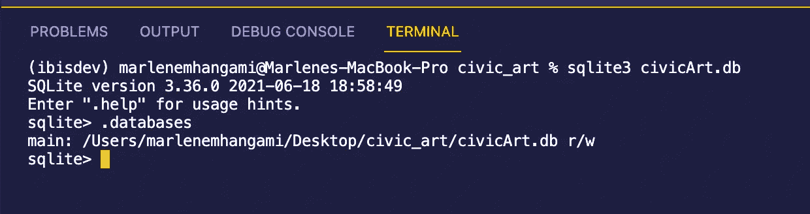
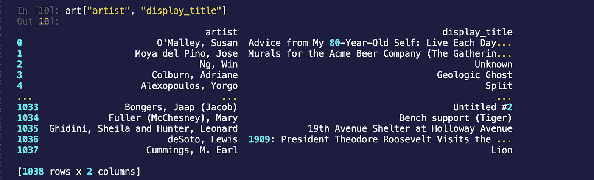
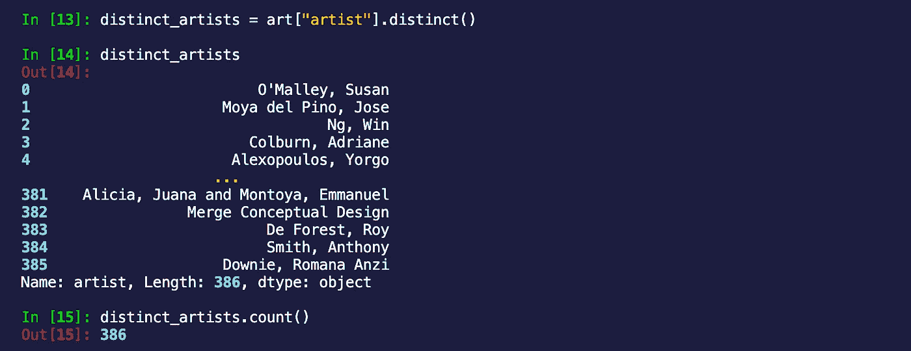
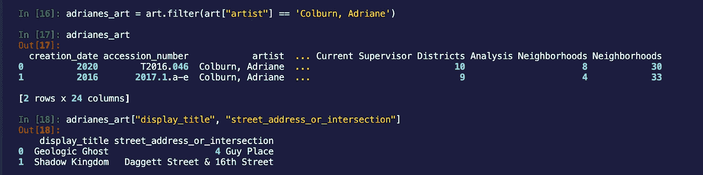
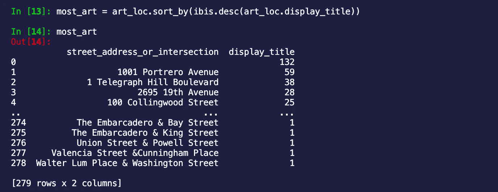
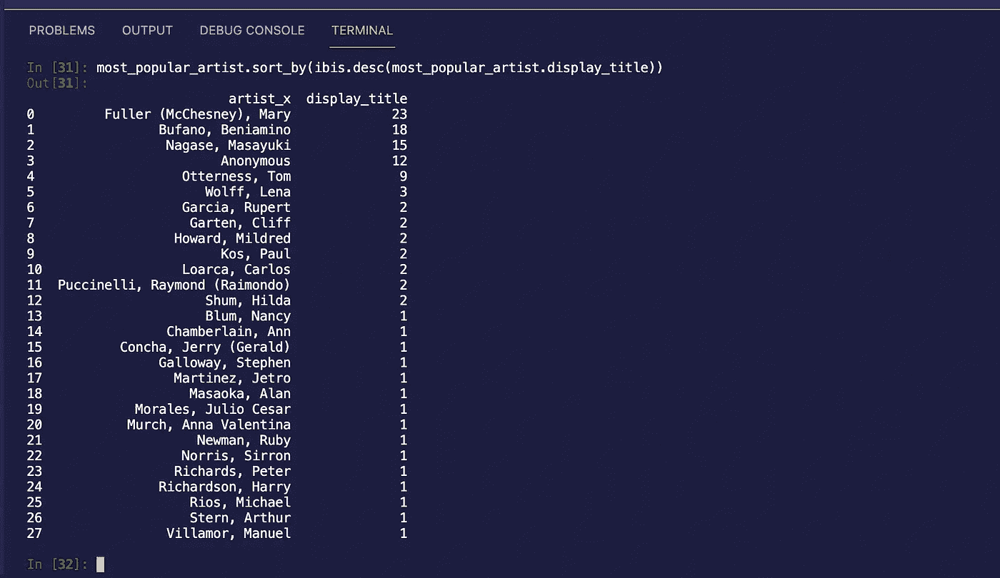

# Python 程序员的 Ibis 介绍

> 原文：<https://towardsdatascience.com/an-introduction-to-ibis-for-python-programmers-2112ea32370d>

## 更 Pythonic 化的处理数据库的方式

照片来自[图片编辑](https://photostockeditor.com/image-rf/elephant-and-egrit-174825883)

几周前，我正致力于建立一个关系数据库，以探索来自 [DataSF 的公民艺术收藏](https://data.sfgov.org/Culture-and-Recreation/Civic-Art-Collection/r7bn-7v9c)的记录。每当我参加一个技术会议，我都会试着花一两天的时间在这个城市看看它的文化场景，所以这看起来像是有用的信息！我决定使用 MySQL 作为我的数据库引擎。作为一个熊猫出身的人，我对自己编写原始 SQL 查询时的低效和受限感到惊讶。我还花了大量时间来解决查询中的错误，这些错误适用于一种风格的 SQL，但不适用于 MySQL。在整个过程中，我一直在想，如果有一个更 Pythonic 式的方法就好了！！！几周后，我被介绍给了[宜必思](https://ibis-project.org/)。在这篇文章中，我将向您简要介绍 Ibis，并带您浏览一些代码示例，展示 Ibis 如何为我的问题提供解决方案。

Ibis 提供了一种更 Pythonic 化的方式来与多个数据库引擎进行交互。对于我们这些喜欢在 SQL 字符串上写 python 代码的人来说，这尤其有用。可以在 select 语句中编写的任何东西都可以在 Ibis 中编写。在我自己的冒险中，我总是遇到栖息在大象身上的朱鹭(鸟类版本)。如果你在现实生活中从未见过大象，我可以肯定它们是巨大而复杂的生物。这是我站在两个人旁边的照片。

作者图片

一只小鸟坐在一只大象上的图像隐喻了 Ibis 如何为用户提供一种不太复杂、更具性能的方式来与多个大数据引擎进行交互。事实上，数据越大越复杂，使用 Ibis 的争议就越大。它简化了您的工作流程，消除了对复杂 SQL 查询的需求。相反，你可以编写类似熊猫的代码，无论你想扩大规模还是缩小规模，代码都保持不变。

比方说，您已经开始在 jupyter 笔记本中编写访问 SQLite 数据库的代码。如果您决定扩大规模并使用 Dask，您可以在同一个笔记本中用一行代码实现这一点。如果需要，Ibis 可以让您自由地切换后端，并在相同的上下文中使用更强大的引擎继续工作。这意味着你的工作保持在一个地方，不容易出错，你的认知负荷也减少了。

目前，Ibis 支持相当多的后端，包括:

**传统 DBMS:**PostgreSQL、MySQL、SQLite
分析 DBMS:OmniSciDB、ClickHouse、Datafusion
**分布式 DBMS:**Impala、PySpark、BigQuery
**内存分析:** pandas、Dask

无论您想要与 SQL 数据库还是分布式 DBMSs 进行交互，Ibis 都可以让您用 Python 来实现。对于 Python 程序员来说，Ibis 提供了一种用 Python 编写 SQL 的方法，允许对特定查询引擎(例如 BigQuery)进行单元测试、可组合性和抽象！你可以用一种熟悉的、类似熊猫的语法对你的数据进行连接、过滤和其他操作。

在这篇文章中，我将带你了解使用 SQLite 后端的一些基本知识，但是如果你想尝试其他的，请查看 Ibis 后端页面的例子。Ibis 目前支持超过 12 个后端，其中一些编译成 SQL，一些直接执行。

让我们使用我之前提到的[公民艺术收藏数据集](https://data.sfgov.org/Culture-and-Recreation/Civic-Art-Collection/r7bn-7v9c)，看看 Ibis 能做什么！

# 装置

可以用 Pip，Conda 或者 Mamba 安装 Ibis。

为了安全起见，我建议建立一个虚拟环境。您可以将这些命令复制并粘贴到您的终端中，以安装带有 Pip 或 Conda 的 Ibis。

## Pip:

如果您使用 pip 来安装 Ibis，您将需要运行`pip install 'ibis-framework[sqlite]'`而不是通常的`pip install ibis-framework`来运行 sqlite。如果您喜欢使用另一个后端，请在 [Ibis 文档](https://ibis-project.org/backends/)中查找具体的命令。

Mac:

窗口:

## 康达:

如果你正在使用 Conda，你可以使用下面的命令，sqlite 框架将默认包含在内。

# 用 SQLite 创建数据库

接下来，我们将创建一个数据库和一个表，其中包含来自 DataSF 的关于旧金山周围艺术的数据。这些数据是开源的，所以你可以直接从网站下载 [CSV 文件](https://data.sfgov.org/Culture-and-Recreation/Civic-Art-Collection/r7bn-7v9c)。Ibis 还不支持将 CSV 文件加载到 SQL 表中，所以我们将按照这些命令来创建一个 SQLite 数据库和一个包含我们的数据的表。

**创建一个名为 civic_art 的文件夹**

为了使接下来的步骤更容易，我将 CSV 文件从我的下载文件夹移动到我们刚刚创建的 civic_art 文件夹中。当我们在 civic_art 文件夹中时，我们用下面的命令创建一个新的数据库。

**创建一个名为 civicArt.db 的数据库**

这个命令应该可以在命令行中打开 SQLite。您可以键入`.databases`来再次检查数据库是否被正确创建。这是我看到的照片。

太好了！数据库已成功创建！SQLite 已经在`civicArt database`中打开了，所以我们接下来要做的是创建一个表，并将 CSV 文件中的数据加载到其中。

**在** `**civicArt.db**`中创建一个表**名为** `**civicArtTable**`

**检查表格是否已按预期创建**

如果您的表已经按预期创建，您现在可以通过键入`.quit`退出 SQLite。这将带您回到命令行。我们现在准备开始用 Ibis 探索我们的数据！

# 连接到数据库

Ibis 的优势之一是它允许您使用自己最熟悉的工具工作。我喜欢用 IPython 编写 Python 代码，但是您也可以使用 jupyter 笔记本或任何您喜欢的 Python shell。无论您选择什么，我们都将使用相同的命令连接到我们之前创建的 civicArt 数据库。

**连接到我们的数据库**(我们将使用 Ibis 的交互模式进行惰性评估)

这里需要注意的是， [pandas.read_sql](https://pandas.pydata.org/docs/reference/api/pandas.read_sql.html) 将数据加载到内存中并自己执行计算。 **Ibis 不会加载数据或执行任何计算**。相反，它将数据留在数据库中，并要求后端在那里执行计算。这意味着您可以以后端的速度执行，而不是本地计算机的速度。思考这个问题的一个好方法是回到我们的大象比喻。如果你需要一些重物，与朱鹭相比，让大象来做可能是个好主意。我们优雅的 Ibis 可以将较重的工作传递给较大的数据库引擎，并观察工作完成的速度比它本身快得多。

照片由[存放照片](https://focusedcollection.com/199821762/stock-photo-botswana-chobe-national-park-game.html)

如果一切顺利，你应该连接到数据库。接下来我们来看看我们的数据！

# 查看表格详细信息

让我们使用 Ibis 来查看一下 civicArt 数据库中的表。

**列出数据库中的所有表格**

**为表格指定一个更易读的名称，并列出其中的列**

# 与 Ibis 争论数据

现在让我们使用 Ibis 在数据集上执行一些常见的 SQL 命令，并在这个过程中找到一些关于旧金山艺术的有用信息。

## 询问

**您可以在 SELECT 语句中编写的任何内容都可以在 Ibis** 中编写。让我们来测试一下！我将使用下面的代码来找出哪些艺术家的作品目前在这个城市展出，以及他们的作品的标题是什么。

**从表格中选择列**

太好了！如果您以前使用过 Pandas，这应该感觉类似于从 Pandas 数据框架中获取列。但是请记住，数据库正在为我们做所有的工作，所以这样效率更高！

我也很好奇总共有多少艺术家展出他们的作品。为了找出答案，让我们找出不同的艺术家，然后计算他们的数量。

## 独特和计数

您应该已经在表格底部看到了列表的长度，但是为了向您展示计数方法，我们确认在旧金山展出一件或多件作品的艺术家数量为 386 位！

## 过滤数据

接下来让我们挑选一位艺术家，并找出他们所有的艺术作品的确切位置。阿德里安·科尔伯恩斯的展览标题《地质幽灵》引起了我的注意，所以让我们选择它们吧！我使用以下命令来完成这项工作。

**按艺人名称过滤**

原来 Adriane 有两件展品，一件在 4 Guy Place，另一件在 Dagget 街& 16 街。这太好了，我们已经有一些地方可以添加到我们的旅游行程中了！

## 分组依据

会议结束后，我通常不会在一个城市停留超过一两天。为了在最短的时间内做最多的事情，知道哪些地方展出的艺术品最多可能是件好事。我们将使用下面的`groupby`表达式来获取我们需要的信息。

**获取旧金山最具艺术气息的地点！**

第一站是 Potrero 大街 1001 号，这里展出了 59 本书！！

出于好奇，我搜索了波特雷罗大道 1001 号，以了解更多关于我所期望的艺术画廊的信息。令人惊讶的是，它竟然是扎克伯格旧金山总医院。他们显然在艺术上投入了大量资金，并拥有令人难以置信的收藏。数据能让你大吃一惊！艺术品数量第二多的地方是位于电报山大道 1 号的 Coit Tower。它不是医院，看起来是一个探索的好地方！

照片来源 [Flikr](https://www.flickr.com/photos/runner310/532799970/)

## 连接

非常好。在这一点上，我们知道，下次我们在旧金山参加技术会议时，我们有一些很好的选择。现在我们知道去哪里了。下一步是什么？

嗯，通常美术馆里都是潮人，他们可能会问你展出的艺术家的情况。好在我们可以提前做好这方面的准备！让我们使用一个内部连接来帮助我们找到哪些艺术家有最多的艺术展示，这样我们就可以查找他们，并通过良好的响应感到很酷；)

**使用 inner_join 查找最受欢迎的艺术家**

( **I** [**bis 版本 2.1.1**](https://ibis-project.org/) 有时会遇到视图注释被具体化，然后在连接操作中具体化不解析列名的问题。以下代码片段仅适用于版本 2.1.1，并使用 mutate()函数来更改其中一个列标题和 materialize()，以确保可以显示创建的视图。这个应该是在[**3 . 0 . 0**](https://ibis-project.org/)**版本中修复的。**)

**使用 inner_join** 查找当地最受欢迎的艺术家

太棒了。我们现在知道 Mary (McChesney) Fuller 在 Potrero 大道 1001 号展出的艺术品最多，可以在网上搜索了解更多！在我看来，我们已经做好了探索科幻艺术的准备！

我们在相对较短的时间内学到了很多信息。如果你喜欢 Python 代码，这可能比写出原始的 SQL 字符串更有效。这也意味着如果你在 IPython 或 jupyter 笔记本上开始你的工作流程，你可以留在那里。这应该感觉更顺畅，并有望提高生产率。使用有助于提高效率的工具意味着你有更多的时间在工作中进行创新和探索！感谢你的阅读，希望我能在世界各地的某个美术馆里看到你看大象。

另外，我还做了一个 jupyter 笔记本，里面有这篇文章中列出的所有命令！这里可以找到[。](https://github.com/marlenezw/ibis-tutorial)