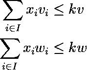
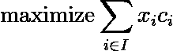

# 混合整数线性规划导论:背包问题

> 原文：<https://towardsdatascience.com/an-introduction-to-mixed-integer-linear-programming-the-knapsack-problem-1445452a9fe9>

## 了解如何使用 scipy 和 *pyomo* 解决 Python 中的优化问题


照片由[丹尼斯·莱昂](https://unsplash.com/es/@denisseleon?utm_source=medium&utm_medium=referral)在 [Unsplash](https://unsplash.com?utm_source=medium&utm_medium=referral) 上拍摄

背包问题可能是学习整数规划、最优化或运筹学时首先面临的问题之一。在这个问题中，从给定的一组物品中，人们必须选择最有价值的组合，以适合特定容量(重量、体积或两者)的背包。

在整篇文章中，我们将使用 *scipy* 实现背包问题的多维变体，使用 *pyomo* 和 *GLPK* 解算器实现整数形式。学习如何使用这两个框架对将来解决更复杂的问题有很大帮助，背包问题是一个惊人的开始。

多维背包是经典问题的变体，其中考虑了一个以上的约束。它增加了复杂性，这有助于探索连续域和离散域结果之间的差异，如下一节所述。

感兴趣的人可以跟随本[示例笔记本](https://github.com/bruscalia/optimization-demo-files/blob/47e1371e9cf4bb04c05b0b31e7f497c3a4b94e62/mip/knapsack/notebooks/simple_knapsack.ipynb)中的完整代码。

# 线性规划和松弛公式

当公式化优化问题时，必须定义一个目标，该目标是向量决策变量 ***x*** 的函数，并且可能受到一些等式和不等式约束，这些约束也是 ***x*** 的函数。该目标通常在*最小化*意义上定义，因此目标是在遵守约束的同时找到其最低值。最大化目标可以通过简单地将相应的最小化目标乘以-1 来表达。在公式中， ***x*** 的每个分量的上下边界可能是明确的，这减少了搜索空间。按照惯例，由于求解技术的原因，决策变量的下限通常默认等于零。

由于线性问题的目标和约束都是其决策变量的线性组合，因此该问题可以表述如下。


线性问题。(图片由作者提供)。

当定义一个*宽松的*公式时，意味着原始问题有一些整数决策变量，宽松的形式将这些变量转换成连续变量。这正是第一部分将要发生的事情。因此，让我们首先定义背包问题的要素。

**决策变量:**

*   ***x*:****C*添加到背包中的各物品数量的列向量。在这个例子中，它将以[0，1]为界。*

***固定参数:***

*   ****c* :** 与每个决策变量相关的成本(其值为负)。*
*   ****一个* _{ub}:** 矩阵的不等式约束条件。*
*   ****a* _{1，i}:** 物品单位重量 *i* 。*
*   ****a* _{2，i}:** 项目单位体积 *i* 。*
*   ****b* _{ub}:** 带有背包重量和体积容量的列向量。*

*让我们用 Python 创建这些元素。首先，使用字典，这将在后面的 *pyomo* 中有用。在这里，我使用一个固定的随机种子来获得相同的结果。*

```
*# Import numpy
import numpy as np

# Set of items
I = set(range(1, 11))

# Random seed
np.random.seed(12)

# Weight associated with each item
w = dict(zip(I, np.random.normal(loc=5.0, scale=1.0, size=10).clip(0.5, 10.0)))

# Volume associated with each item
v = dict(zip(I, np.random.normal(loc=6.0, scale=2.0, size=10).clip(0.5, 10.0)))

# Price associated with each item
price = dict(zip(I, np.random.normal(loc=10.0, scale=1.0, size=10).clip(0.5, 20.0)))

# knapsack capacity
kw, kv = 21.0, 22.0*
```

*然后在 *numpy* 样式中使用 *scipy* 。*

```
*# Costs
c = -np.array(list(price.values()))

# Inequality constraints matrix
A_ub = np.array([
    np.array(list(w.values())),
    np.array(list(v.values()))
])

# Upper bounds for linear inequality constraints
b_ub = np.array([kw, kv])

# Bounds (one quantity of each item)
bounds = [(0, 1),] * 10*
```

*现在我们已经拥有了使用来自 *scipy* 的 *linprog* 来解决这个问题的所有必要元素。*

```
*from scipy.optimize import linprog

# Obtain solution
sol = linprog(c, A_ub=A_ub, b_ub=b_ub, bounds=bounds)

print(sol)*
```

*它返回以下内容。*

```
*con: array([], dtype=float64)
fun: -44.817244893700625
message: 'Optimization terminated successfully.'
nit: 6
slack: array([-1.68047194e-08, -2.36582025e-08])
status: 0
success: True
x: array([9.99999999e-01, 8.65571091e-01, 7.40355899e-10, 1.00000000e+00, 2.62434803e-10, 2.98795062e-09, 2.33299681e-10, 8.80512141e-01, 9.99999997e-01, 2.05849974e-10])*
```

*注意 ***x*** 中的一些项目是分数，这在某些情况下是不可能的。因此，对于这些情况，我们必须找到一种方法，使用决策变量的整数值来找到最佳可行解。*

*从版本 1.9.0 开始， *scipy* 有了一个混合整数线性规划解算器。因此，我们可以通过将*完整性*关键字参数解析为 *linprog* 来将松弛背包问题转化为整数版本。全整数变量应该被赋予 1，而连续变量应该被赋予 0，其形状与决策变量向量相同。*

```
*# Assign ones to integer variables
integrality_vector = np.full(c.shape[0], 1)

# Obtain solution
sol_int = linprog(c, A_ub=A_ub, b_ub=b_ub, bounds=bounds, integrality=integrality_vector)*
```

*有些问题用矩阵形式表述更复杂，因为它们包含几组在大集合上定义的约束和决策变量。在这些情况下，数学建模语言有利于创建和转换求解器可以成功解释的代数表达式。在下一节中，我们将看到如何使用数学建模 Python 包 *pyomo* 将背包问题公式化。*

# *整数背包问题*

*为了使用整数变量来表述这个问题，我们将使用 *pyomo* 来创建代数整数线性模型，这些模型可以由通常的代数优化解算器来解释。所以让我们从进口 *pyomo* 开始。*

```
*import pyomo.environ as pyo*
```

*在 *pyomo* 中有两种建模方法:*抽象*和*具体*模型。在第一种方法中，问题的代数表达式是在提供一些数据值之前定义的，而在第二种方法中，模型实例是在定义其元素时立即创建的。你可以在[库文档](https://pyomo.readthedocs.io/en/stable/pyomo_overview/abstract_concrete.html)或者拜纳姆等人的书(2021)中找到更多关于这些方法的信息。贯穿本文，我们将采用*具体的*模型表述。*

```
*model = pyo.ConcreteModel()*
```

*在代数数学优化语句中，通常在*集合*上定义变量和/或表达式。在背包问题中，我们有与每个项目相关的决策变量和参数。因此，我们将创建一个*项目集*，每个项目都有一个相关的键。*

```
*# Set of items (previously defined)
I = set(range(1, 11))

# As an attribute of the problem
model.I = pyo.Set(initialize=I)*
```

*第二步，我们将定义这个问题的一些固定参数。下面列出了它们。*

*   ****kw:*** 背包的重量容量。*
*   ****kv:*** 背包的体积容量。*
*   ****w _*I*:***集合 *I* 中每个项目 *i* 关联的权重。*
*   ****v _*I*:***与集合 *I* 中每一项 *i* 关联的体积。*
*   ****c _*I*:***集合 *I* 中每一项 *i* 关联的成本(值)。*

*与背包相关联的参数是固定标量。因此，我们可以通过下面的代码实例化它们。*

```
*# knapsack capacity
kw, kv = 21.0, 22.0

# Parameters of the knapsack
model.kw = pyo.Param(initialize=kw)
model.kv = pyo.Param(initialize=kv)*
```

*然而，必须为集合 *I* 中的每个元素定义与每个项目相关的参数。这可以通过将集合作为第一个参数在 *pyo 中传递来实现。参数*定义。如果定义的元素(变量、参数、表达式或约束)由多个集合索引，则可以在此语句中传递多个集合。这个定义是 Python **args* 风格的。*

```
*# Parameters of the items
model.v = pyo.Param(model.I, initialize=v)
model.w = pyo.Param(model.I, initialize=w)
model.c = pyo.Param(model.I, initialize=price)*
```

*记住 *v* 、 *w* 和 *price* 是之前定义的 Python 字典，其中 key 是 *I* 中的元素。*

*现在让我们来定义这个问题的决策变量:对于集合 *I* 中的每个物品，添加到背包中的物品数量。请注意，我在[0，1]中定义了宽松公式的界限。因此，另一种说法可能是在 *pyo 中定义这些变量。二进制*。*

```
*model.x = pyo.Var(model.I, within=pyo.Integers, bounds=(0, 1))*
```

*太好了！现在我们已经定义了决策变量和固定参数，我们可以定义问题的约束和目标。*

*这些约束可以用下面的等式来表示。*

**

*背包问题的约束。(图片由作者提供)。*

*Python 中的意思是。*

```
*def weight_constraint(model):
    return sum(model.x[i] * model.w[i] for i in model.I) \
        <= model.kw

model.weight_constraint = pyo.Constraint(rule=weight_constraint)

def volume_constraint(model):
    return sum(model.x[i] * model.v[i] for i in model.I) \
        <= model.kv

model.volume_constraint = pyo.Constraint(rule=volume_constraint)*
```

*注意，在创建与每个约束相关的函数时，*模型*是一个强制参数。当我们将它传递给函数时，我们可以引用之前定义的属性 *x* 、 *w* 、 *v* 、 *kw* 、 *kv* 和 *I* 。*

*现在，让我们定义目标函数。由于 *c* 被定义为与每个物品相关联的正值，我们的目标将是最大化背包中运输的价值。*

**

*背包问题的目标函数。(图片由作者提供)。*

*Python 中是这样的。*

```
*def obj_function(model):
    return sum(model.x[i] * model.c[i] for i in model.I)

model.objective = pyo.Objective(rule=obj_function, sense=pyo.maximize)*
```

*为了解决这个问题，我们必须实例化一个求解器。在这个例子中，我将使用 *GLPK* ，它是开源的，因此任何用户都可以下载并执行。在“您的 _ 路径 _ 到 _GLPK”字段中，添加到*glpsol.exe*文件的路径。例如，我的路径是“C:\\glpk-4.65\\w64\\glpsol.exe”。*

*最新可用的 *GLPK* 版本可在[这里](http://ftp.gnu.org/gnu/glpk/)找到，Windows 可执行文件可在[这里](https://sourceforge.net/projects/winglpk/)找到。*

```
*opt = pyo.SolverFactory('glpk', executable=YOUR_PATH_TO_GLPK)

# You can add a time limit by using the following command line
opt.options['tmlim'] = 120

solution = opt.solve(model)*
```

*现在，我们可以使用*显示*方法来检查模型的元素。对于目标函数，请参见下面的代码。*

```
*model.objective.display()*
```

*它应该返回以下输出。*

```
*objective : Size=1, Index=None, Active=True
Key  : Active : Value
None :   True : 39.88187183116921*
```

*因此，人们可能会注意到我们的整数解(39.88)比使用*松弛*公式(44.82)得到的结果更差。这发生在整数问题中，因为与*松弛*问题中的相应空间相比，决策空间必然减少。*

*通过研究决策变量的差异，人们可能会注意到:*

*   *在两种情况下都添加了项目 1。*
*   *仅在放松问题中部分添加了第 2 项—值 0.87。*
*   *仅在整数题中增加了第 3 项。*
*   *在两种情况下都添加了第 4 项。*
*   *第 5 项在任何情况下都没有添加。*
*   *第 6 项在任何情况下都没有添加。*
*   *第 7 项在任何情况下都没有添加。*
*   *第 8 项在松弛问题中被部分添加—值 0.88 —但在整数版本中被完全添加。*
*   *第 9 项仅在放松问题中完全添加。*
*   *在任何情况下都没有添加项目 10。*

# *进一步阅读*

*对*线性规划*的更多细节感兴趣的可以参考 luen Berger&Ye(2008)；整数规划见 Wolsey(2020)；对于运筹学，温斯顿&戈德堡(2004)。*

*只有一个约束和二元变量的整数规划问题通常被称为*背包问题* (Winston & Goldberg，2004)。这些问题可以通过动态编程有效地解决，这可能是另一篇文章的重点。*

*在另一个[示例](https://github.com/bruscalia/optimization-demo-files/blob/47e1371e9cf4bb04c05b0b31e7f497c3a4b94e62/mip/knapsack/notebooks/multiple_knapsacks.ipynb)笔记本中可以找到带有多个背包和一些附加规则的背包问题的扩展公式。*

*分枝定界算法是整数和混合整数问题求解中最常用的算法。对其机制的介绍感兴趣的人可以参考我的另一篇文章:*

*[](/a-gentle-introduction-to-branch-bound-d00a4ee1cad) [## 分支和绑定的简单介绍

### 用 Python 解释的最基本的整数和混合整数编程算法

towardsdatascience.com](/a-gentle-introduction-to-branch-bound-d00a4ee1cad)* 

# *结论*

*在本文中，我们看到了混合整数线性规划的介绍。使用 *scipy* 获得多维背包问题的松弛形式的解，使用 *pyomo* 和 *GLPK* 解算器获得整数形式的解。这些示例中使用的[完整代码](https://github.com/bruscalia/optimization-demo-files/blob/47e1371e9cf4bb04c05b0b31e7f497c3a4b94e62/mip/knapsack/notebooks/simple_knapsack.ipynb)可供进一步使用。*

# *参考*

*拜纳姆，马丁等人，2021。*pyo mo-python 中的优化建模。*斯普林格。*

*卢恩伯格，D. G .和叶，2008 年。*线性和非线性规划。第三版。斯坦福:斯普林格。**

*温斯顿，W. L .和戈德堡，J. B .，2004 年。运筹学:应用与算法。4 版。加州贝尔蒙特:汤姆森布鲁克斯/科尔贝尔蒙特。*

*2020 年洛杉矶沃尔西。*整数编程。*第二版。约翰·威利的儿子们。*