# Matplotlib 用户的 Plotly 介绍

> 原文：<https://towardsdatascience.com/an-introduction-to-plotly-for-matplotlib-users-9f4f0d2113bc>

## Python 科学绘图

## 使用类似于 matplotlib 的自定义功能，轻松地将交互性构建到您的绘图中


[KOBU 机构](https://unsplash.com/@kobuagency?utm_source=medium&utm_medium=referral)在 [Unsplash](https://unsplash.com?utm_source=medium&utm_medium=referral) 上拍摄的照片

我在这个平台上写的第一批文章是一系列关于`matplotlib`的教程，这是一个令人难以置信的 Python 可视化库，我在研究生院广泛使用，可以无限定制以创建美丽的图形。作为一名数据可视化爱好者，我一直在寻找更好的方法来创建图形和信息图，随着时间的推移，我越来越多地遇到了`plotly`。`plotly`最吸引人的特点是交互性是最重要的——虽然与`matplotlib`的交互性肯定是可能的(事实上，我有[另一篇关于这个主题的文章](https://medium.com/towards-data-science/intro-to-dynamic-visualization-with-python-animations-and-interactive-plots-f72a7fb69245)),来自`plotly`的数字可以直接导出到 HTML 和 Javascript，web 浏览器的自然语言，使我们的交互式可视化易于与他人共享。

这篇文章的目的是从一个重度`matplotlib`用户的心态出发，给出在`plotly`中开始探索可视化的工具。希望在本教程结束时，你已经可以制作漂亮的交互式图表了！

# **安装 Plotly**

首先也是最重要的，我们需要确保我们已经安装了`plotly`——我们可以用`pip`非常简单地做到这一点:

```
pip install plotly
```

# Plotly Express 与 Plotly Graph 对象

在`plotly`中有几个开发图的接口——最简单的是使用`plotly.express`。使用`plotly.express`的好处是你可以用最少的代码行从一个数据帧到一个图表。一个例子如下:

```
**# Import plotly express** import plotly.express as px
import pandas as pd**# Import iris dataset**
iris = pd.read_csv("[https://raw.githubusercontent.com/mwaskom/seaborn-data/master/iris.csv](https://raw.githubusercontent.com/mwaskom/seaborn-data/master/iris.csv)")**# Plot with plotly.express**
fig = px.scatter(iris, x="sepal_length", y="sepal_width", color="species", height=600, width=600)
fig.show()
```

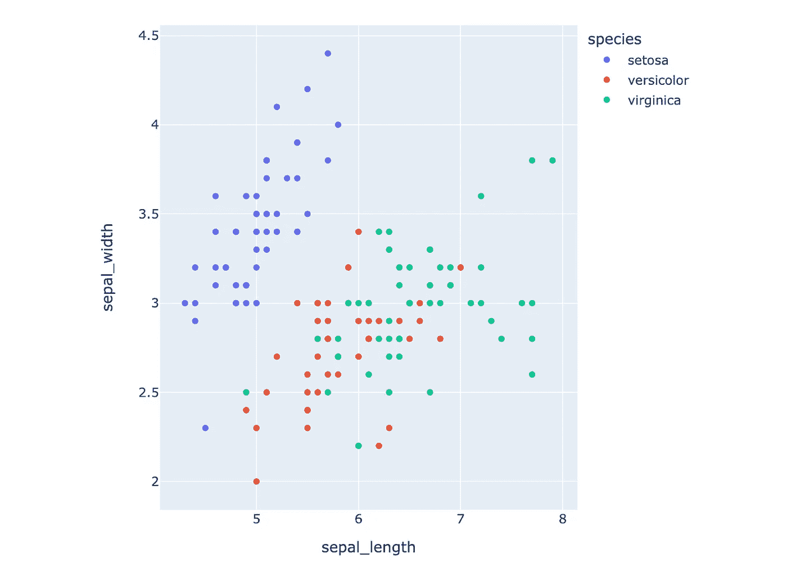

plotly express 的输出—由作者生成的图形

正如我们所看到的，`px.scatter()`可以直接接收一个数据帧，如果需要，您可以使用`color`参数来选择如何分割数据(在这种情况下，我们为`species`的每个唯一值指定不同的散点图颜色)以立即生成多系列散点图。我们只需要使用一行代码就可以做到这一点！

另一方面，Plotly 图形对象要求您一条一条地构建图形。不过对我来说，来自`matplotlib`，这感觉更自然，所以**我个人喜欢用** `**graph_objects**` **API 来生成我的** `**plotly**` **人物。**

`plotly`中的主要构建模块与`matplotlib`中的非常相似，是一个`Figure()`。我们从创造我们的形象开始:

```
**# Import plotly graph objects** import plotly.graph_objects as go**# Create figure**
fig = go.Figure()
```

现在，我们可以为数据框架中的每个物种添加踪迹。此外，我们可以使用`fig.update_layout()`固定高度和宽度(我们将在后面更详细地讨论):

```
**# Add traces** for species, group in iris.groupby("species"):
    fig.add_trace(
        go.Scatter(
            x=group["sepal_length"],
            y=group["sepal_width"],
            name=species,
            mode="markers"
        )
    )fig.update_layout(height=600, width=600)
fig.show()
```

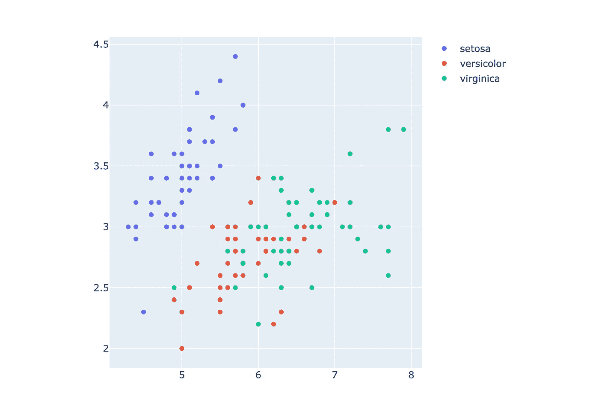

plotly 图形对象的输出—由作者生成的图形

您会注意到的第一件事是没有轴标签或图例标题——当我们使用`plotly.graph_objects`时，因为我们没有为`x`或`y`传递列名，所以没有列名用作轴标签的默认值(同样也没有列名用作图例标题)。虽然这会导致代码稍微多一点，但我认为将轴标签保留为`sepal_length`和`sepal_width`看起来也不太好，尤其是如果这个图要出版的话。因此，无论如何您都必须进行更新，所以让我们现在就做:

```
fig.update_layout(
    xaxis_title_text="Sepal Length",
    yaxis_title_text="Sepal Width",
    legend_title_text="Species"  
)
```

您会注意到的另一件事是，悬停文本在`plotly.express`和`plotly.graph_objects`的结果之间是不同的，如下所示。后者只有每个分散点的(x，y)坐标，而前者有特征的标签。这是因为我们在调用`plotly.express`时传递了列名。

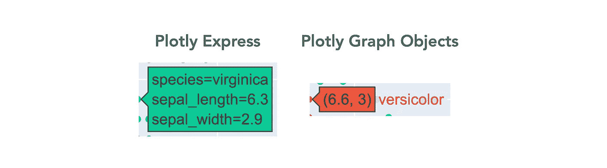

默认悬停文本的差异—由作者制作的图形

再一次，我认为默认的悬停文本看起来仍然不太好，所以无论如何我都会重新做，所以我不介意在我们的`plotly.graph_objects`实现中添加一些额外的代码来做得更好。我们可以使用 HTML 来定义悬停工具提示的格式——我将把物种名称加粗，然后在下面的单独行中显示萼片长度和萼片宽度。要访问数据点值，我们可以使用`%{x}`和`%{y}`(因为我使用的是 f 字符串，所以我需要通过将它们加倍来避开花括号)。最后，为了删除对比色中包含物种名称的额外文本(上图中的`versicolor`，我们使用 HTML `<extra>`标签并将其留空。

```
**# Add traces** for species, group in iris.groupby("species"):
    fig.add_trace(
        go.Scatter(
            x=group["sepal_length"],
            y=group["sepal_width"],
            name=species.title(),
            mode="markers",
            hovertemplate=f"<b>{species.title()}</b><br>Sepal Length: %{{x}}<br>Sepal Width: %{{y}}<extra></extra>"
        )
    )
```

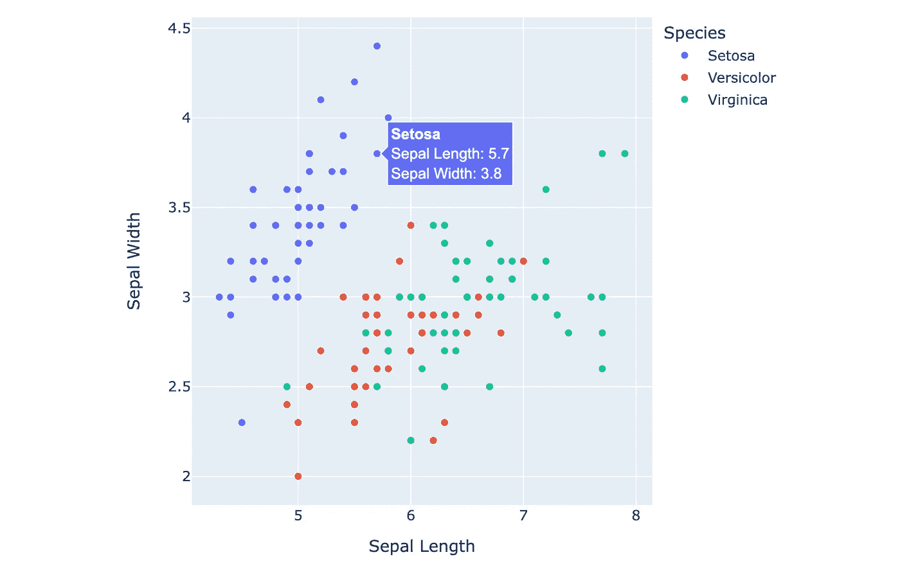

格式化的最终 plottly plot—作者制作的图形

我们走吧！轴标签格式正确，我们现在有了一个图例标题，我们的悬停工具提示看起来比默认的`plotly.express`要好很多。在我看来，额外的几行代码是一种非常值得的权衡。

# **剧情定制**

由`plotly`生成的默认图形看起来已经很不错了，但是我们也可以像在`matplotlib`中一样对它们进行高度定制。与我们如何使用`plt.rcParams["key"] = value`定制`matplotlib`图形类似，在`plotly`中，我们将使用以下内容:

```
fig.update_layout(
    key1=val1,
    key2=val2,
    keyn=valn
)
```

首先，让我们从绘图中删除所有默认样式，这可以通过在创建 figure 对象时将`layout_template`设置为`None`来实现。

```
fig = go.Figure(layout_template=None)
fig.update_layout(height=600, width=600)
fig.show()
```

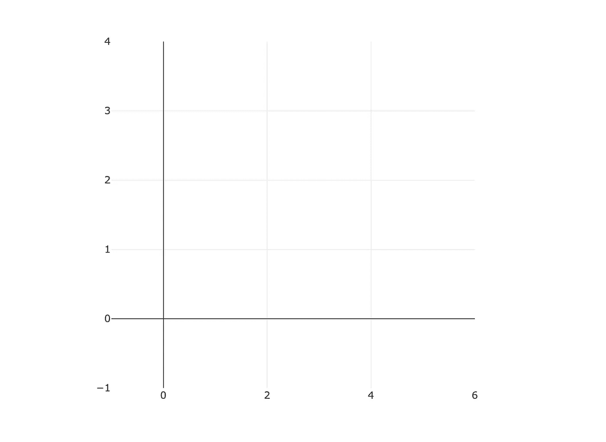

没有布局模板的无样式打印图形-由作者制作的图形

我们现在有了一个空白画布，可以在上面添加我们自己的样式定制。让我们首先使用 Python 中的 Yahoo Finance 包加载一些财务数据，然后在我们的非样式轴上绘制这些数据。注意— `go.Scatter()`通过使用`mode`关键字参数用于**散点图和折线图:**

```
**# Import packages** import yfinance as yf**# Load stock data** aapl = yf.Ticker("AAPL").history(period="3mo")
aapl["ticker"] = "AAPL"msft = yf.Ticker("MSFT").history(period="3mo")
msft["ticker"] = "MSFT"nvda = yf.Ticker("NVDA").history(period="3mo")
nvda["ticker"] = "NVDA"df = aapl.append(msft).append(nvda).reset_index()**# Plot data** fig = go.Figure(layout_template=None)
for ticker, group in df.groupby("ticker"):
    fig.add_trace(
        go.Scatter(
            x=group["Date"],
            y=group["Close"],
            name=ticker,
            mode="lines",
            hovertemplate=f"{ticker}<br>%{{x}}<br>$%{{y}}<extra></extra>"
        )
    )fig.update_layout(height=600, width=600)
fig.show()
```

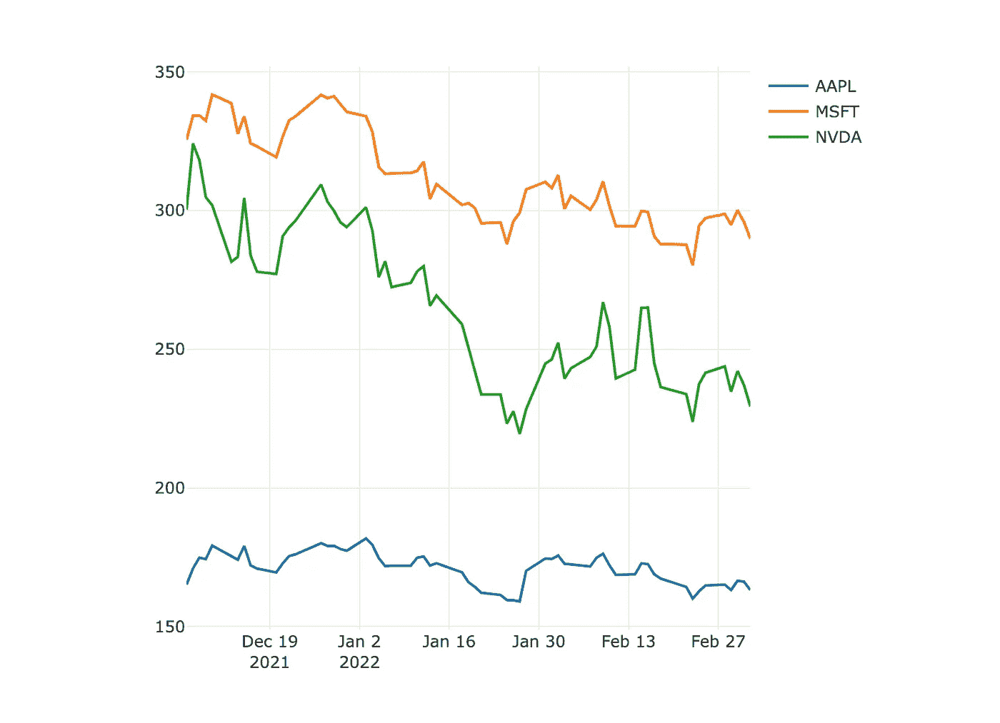

未定型的财务情节——作者制作的图表

现在，让我们进行一些定制——在本文中，我将创建一个以学术为主题的情节风格，并从《金融时报》的一些情节中获得灵感。

## **学院派剧情**

你在学术论文中发现的一个典型特征是，轴线出现在所有四个面上。做这个的相关布局参数是`showline`和`mirror`，我们可以分别用`linewidth`和`linecolor`调整线宽和颜色。注意，这些都是由 JSON 对象表示的，因此您有两个选项来输入布局参数:嵌套字典或由下划线分隔的键。例如，如果我们想在 x 轴上显示这条线，我们可以执行以下任一操作(我更喜欢后者):

```
fig.update_layout(
    {"xaxis": {"showline": True}}
)fig.update_layout(
    xaxis_showline=True
)
```

现在，让我们围绕我们的图创建一个方框——`ticks`的`mirror`选项值将轴线和刻度镜像到图的另一侧:

```
fig.update_layout(
    xaxis_showline=True,
    xaxis_mirror="ticks",
    xaxis_linewidth=2,
    yaxis_showline=True,
    yaxis_mirror="ticks",
    yaxis_linewidth=2
)
```

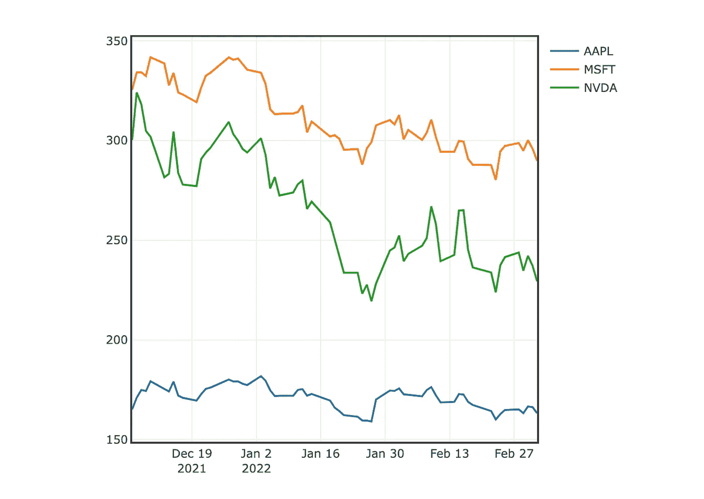

地块周围的方框—作者制作的图形

从上面的图中，我们仍然缺少记号，缺省情况下不显示。我们可以使用`ticks`键选择将刻度置于图的内部或外部，并分别使用`tickwidth`和`ticklen`键设置刻度的宽度和长度。

```
fig.update_layout(
    xaxis_ticks="inside",
    xaxis_ticklen=8,
    xaxis_tickwidth=2,
    yaxis_ticks="inside",
    yaxis_ticklen=8,
    yaxis_tickwidth=2
)
```

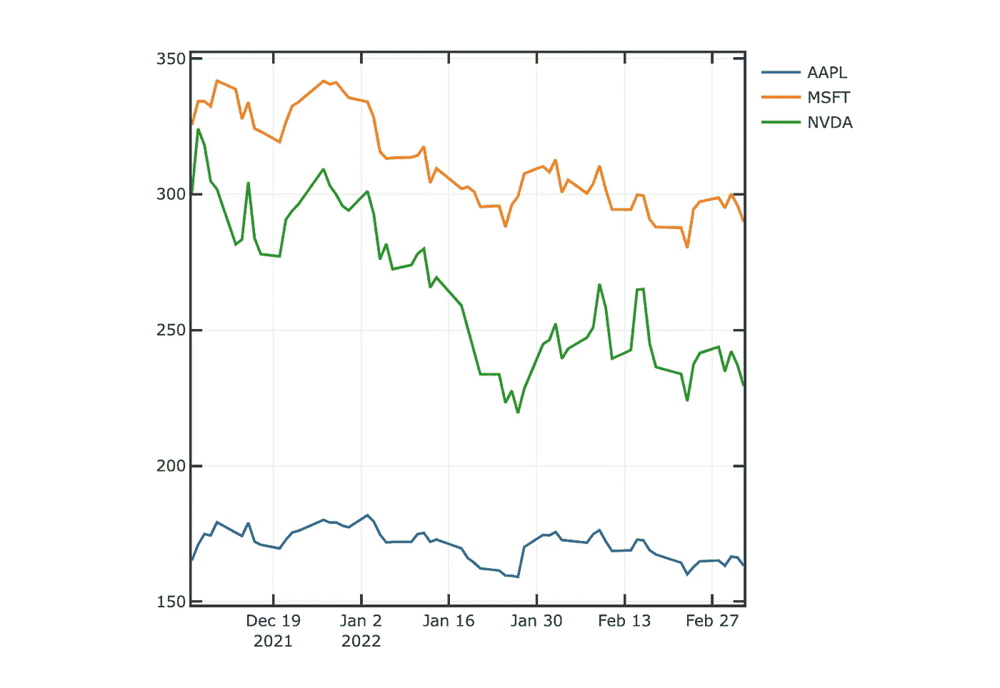

作者制作的图

开始看起来更像我们在研究论文中看到的一般学术风格的情节！我们要做的最后一些修饰性的改变是移除网格，添加轴标签，改变字体和字体大小。

```
fig.update_layout(
    font_family="Avenir",
    hoverlabel_font_family="Avenir",
    xaxis_title_text="Date",
    xaxis_title_font_size=18,
    xaxis_tickfont_size=16,
    xaxis_showgrid=False,
    yaxis_title_text="Closing Price ($)",
    yaxis_title_font_size=18,
    yaxis_tickfont_size=16,
    yaxis_showgrid=False
)
```

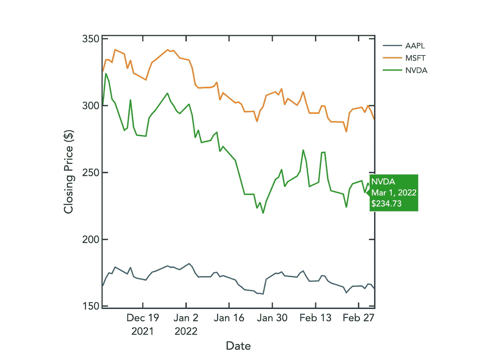

最终学术风格图—作者制作的图形

看起来棒极了！最后一项簿记工作——注意我们如何在`update_layout()`的关键输入中反复使用`xaxis`和`yaxis`？这是我会考虑使用嵌套字典的时候之一。我们可以更有效地写出所有的布局更改，如下所示:

```
fig.update_layout(
    font_family="Avenir",
    hoverlabel_font_family="Avenir",
    xaxis=dict(
        showline=True,
        mirror="ticks",
        linewidth=2,
        ticks="inside",
        ticklen=8,
        tickwidth=2,
        title_text="Date",
        title_font_size=18,
        tickfont_size=16,
        showgrid=False
    ),
    yaxis=dict(
        showline=True,
        mirror="ticks",
        linewidth=2,
        ticks="inside",
        ticklen=8,
        tickwidth=2,
        title_text="Closing Price ($)",
        title_font_size=18,
        tickfont_size=16,
        showgrid=False
    ),
    height=600,
    width=600
)
```

## **金融时报启发的情节**

我们现在可以做一个与上面类似的练习，制作一个类似于[金融时报](https://ig.ft.com/coronavirus-chart/)的图表。从刚才检查的情节来看，下面是我们需要做的一系列事情:

1.  更改网格、脊线、绘图背景和文本的颜色
2.  在底部添加 x 轴脊椎
3.  把字体改成类似的
4.  为线条的终点添加标记，并为每个股票代码添加文本注释，而不是图例

让我们逐一实现这些步骤。我们将从完全未定型的身材开始。

**改变颜色**

使用谷歌 Chrome 众多颜色选择器扩展中的一个，我能够从图中获得重要的颜色，它们如下:

**网格颜色:** #E6D86D

**X 轴书脊颜色:** #66605B

**剧情背景颜色:** #FFF0E4

**文本颜色:** #66605B

```
fig.update_layout(
    xaxis=dict(
        zeroline=False,
        gridcolor="#e6d8cd",
        tickfont_size=16,
        tickfont_color="#66605b"
    ),
    yaxis=dict(
        zeroline=False,
        gridcolor="#e6d8cd",
        tickfont_size=16,
        tickfont_color="#66605b"
    ),
    plot_bgcolor="#fff0e4",
    paper_bgcolor="#fff0e4",
    height=600,
    width=800
)
```

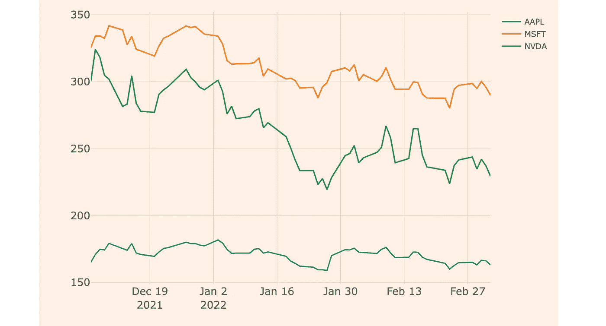

作者制作的图

**添加 X 轴脊椎**

我们通过将 x 轴的`showline`设置为`True`并改变线的颜色来反映我们的示例图。

```
fig.update_layout(
    xaxis=dict(
        showline=True,
        linecolor="#66605b"
    )
)
```

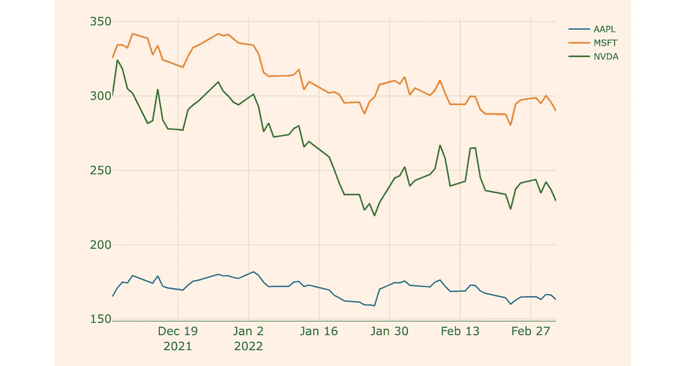

作者制作的图

**改变字体**

在这个例子中，我将使用一种叫做 [Metric](https://en.bestfonts.pro/font/metric) 的字体，它看起来与 FT 使用的字体相似。我们可以将它添加到我们的绘图和悬停信息中，如下所示:

```
fig.update_layout(
    font_family="Metric",
    hoverlabel_font_family="Metric"
)
```

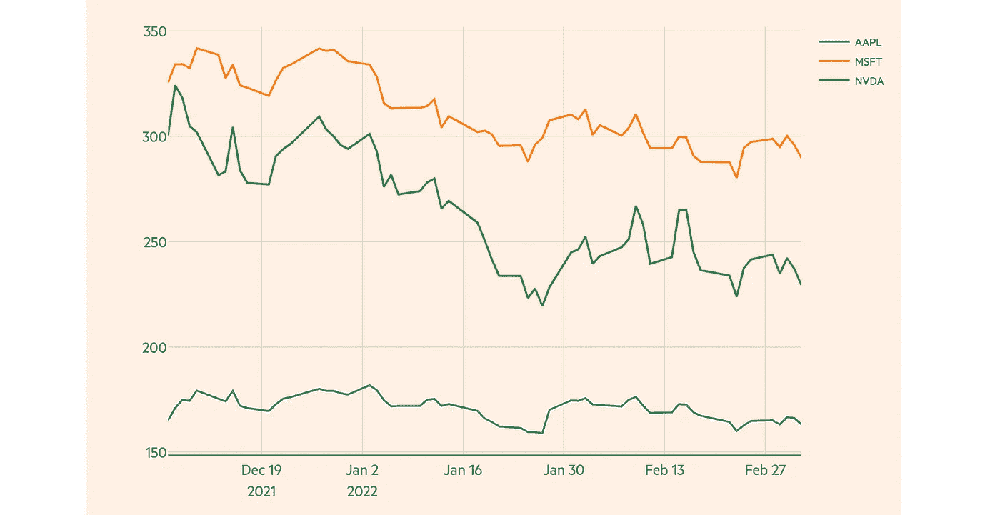

作者制作的图

**添加标记和文本注释**

这是最复杂的更改—为了在最终点创建标记，我们将添加另一个散布追踪，其中只有一个点对应于最终值。此外，我将根据 FT 绘图示例中的颜色定义 3 种颜色，并将其用于三条轨迹。最后，我们可以向这些分散点添加文本注释。注意，我们还必须确保隐藏这些分散点的悬停信息，这样我们就不会对同一个点有两个悬停工具提示。

```
colors = ["#7f042e", "#2090ce", "#eb5e8d"]i = 0
for ticker, group in df.groupby("ticker"):
    fig.add_trace(
        go.Scatter(
            x=[group["Date"].iloc[-1]],
            y=[group["Close"].iloc[-1]],
            mode="markers+text",
            marker_color=colors[i],
            marker_size=8,
            hoverinfo="skip",
            text=ticker,
            textposition="middle right",
            textfont = dict(color=colors[i], size=16)
        )
    )
    fig.add_trace(
        go.Scatter(
            x=group["Date"], 
            y=group["Close"], 
            name=ticker, 
            mode="lines",
            line_color=colors[i],
            hovertemplate=f"<b>{ticker}</b><br>Date: %{{x}}<br>Closing Price: $%{{y}}<extra></extra>"
        )
    )
    i+=1
```

现在，我们只需要删除图例，我们将手动添加一个 x 轴范围，以确保我们的注释在稍微偏离图表区域时不会被剪切。我们还可以在我们的情节顶部添加一个标题。

```
fig.update_layout(
    xaxis=dict(range=["2021-12-01", "2022-03-15"]),
    showlegend=False,
    title="Stock Prices in the Past Three Months",
    title_font_size=24,
    title_x=0.1,
    title_xanchor="left",
)
```

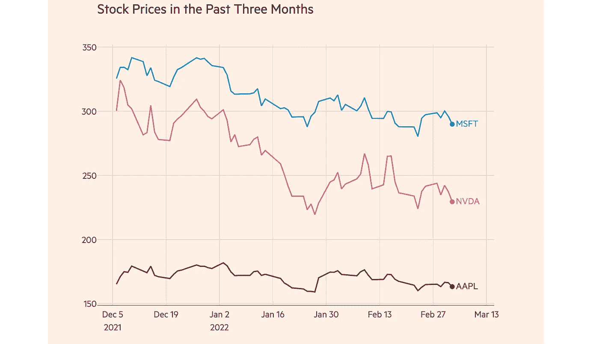

《金融时报》风格的最终股票走势图——由作者制作

非常酷！现在你可以看到默认的`plotly`图表的可定制程度。

# 保存和加载布局

最后，一旦你完成调整你的地块到它的最终形式，你可能想要保存你的布局，以便你可以很容易地加载和重用它在未来。最简单的方法是保存代表绘图布局的 JSON 对象。我们可以这样做:

```
**# Import JSON package** import json**# Get layout JSON from figure** layout = fig.layout.to_plotly_json()**# Save layout**
with open("layout.json", "w", encoding="utf-8") as f:
    json.dump(layout, f, ensure_ascii=False, indent=4)
f.close()
```

现在，稍后，添加我们保存的布局很简单，加载 JSON 文件并用它更新布局。

```
**# Load layout** layout = json.load(open("layout.json"))**# Add layout**
fig.update_layout(layout)
```

# **输出地块**

我们可以用两种方式导出最终的图形——像我们在`matplotlib`中做的那样导出光栅化或矢量化的图像，或者导出为保持交互性的 HTML 文件。为了保存图像，我们需要安装一个名为`kaleido`的依赖项:

```
pip install kaleido
```

一旦我们这样做了，我们可以用`fig.write_image()`保存一个光栅图。我们可以保存为各种格式，如 JPEG、PNG 或 PDF，还可以提供一个`scale`值，以确保我们的应用程序在最终图像中有足够的 DPI。

```
fig.write_image("plot.png", scale=2)
```

现在，如果我们想保存交互情节，我们需要导出到 HTML。我们可以使用`fig.write_html()`来做到这一点——这个函数的一个可选参数是`include_plotlyjs`，它设置是否在 HTML 文件本身中包含整个 Plotly javascript。这通常会增加大约 3.5 MB 的整体文件大小，因此如果您希望收件人只使用 CDN 来获取 Plotly JS，而不是将其包含在文件中，您可以在此处设置。

```
fig.write_html("plot.html", include_plotlyjs="cdn")
```

# 结论

这是使用`plotly`创建和定制交互式人物的基本介绍。你可以进入`plotly` [布局文档](https://plotly.com/python-api-reference/generated/plotly.graph_objects.Layout.html)查看使用`fig.update_layout()`时的所有可能性。本文中的`plotly.ipynb`笔记本将在这个 [Github 资源库](https://github.com/venkatesannaveen/python-science-tutorial)中提供。

感谢您的阅读！我感谢任何反馈，你可以在 [Twitter](https://twitter.com/naveenv_92) 上找到我，并在 [LinkedIn](https://www.linkedin.com/in/naveenvenkatesan/) 上与我联系，以获取更多更新和文章。