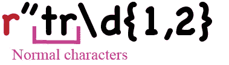
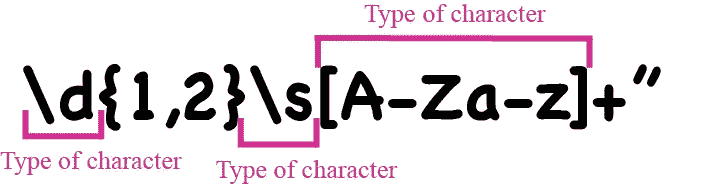
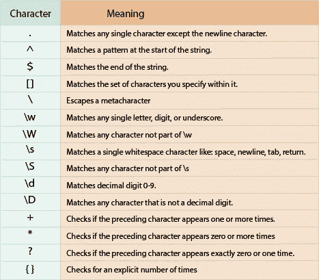

# Python 中正则表达式的介绍

> 原文：<https://towardsdatascience.com/an-introduction-to-regular-expressions-in-python-23baebfa3ac>


照片由 [Unsplash](https://unsplash.com/?utm_source=unsplash&utm_medium=referral&utm_content=creditCopyText) 上的[尼克·费因斯](https://unsplash.com/@jannerboy62?utm_source=unsplash&utm_medium=referral&utm_content=creditCopyText)拍摄

## PYTHON 基础

## 探索 Python 中正则表达式的基本概念

"*……这本书是关于什么的？*”——我问

他告诉我

”*什么？我从来没有听说过他们”——我困惑地回答*

他说:“哦，如果你读了这本书，你会发现它们非常有用。”

我打开书，翻了翻索引，直接到了 *Python 部分*。

我必须承认。我当时超级迷茫。我一点也不明白这本书在说什么。所以我关了它。

在那之后的某个时候，我正在做一个与自然语言处理相关的项目。我必须解析 pdf 文件，这简直成了一场噩梦。

我绝望地看着我的书柜，我看到那本书就在那里。我告诉自己，我必须试一试。所以我再次打开它，决心理解正则表达式。

我花在学习它们上的每一分钟都是值得的！

正则表达式非常强大和快速。一旦你掌握了这个概念，一个新的世界就展现在你面前。它们允许你搜索复杂的模式，否则很难找到。

*注:除特别注明外，所有图片均为作者所有。*

# 基础知识

正则表达式(Regex)是包含普通字符和特殊字符组合的字符串，用于描述在文本中查找文本的模式。

什么？？？这听起来很复杂…*让我们分解一下，以便更好地理解。*


正则表达式(Regex)。所有图像，除非另有说明

上图展示了正则表达式的样子。在 Python 中，开头的 **r** 表示一个**原始字符串**。不强制使用，但建议使用。



正则表达式包含匹配自身的普通字符。tr 匹配一个 t 后跟一个 r

我们说过一个正则表达式包含普通字符，或者换句话说，我们已经知道的文字字符。正常字符匹配自己。在图中所示的情况下， **tr** 与后面跟有 **r** 的 **t** 完全匹配。


正则表达式包含匹配字符类型、位置或数量的元字符

正则表达式也包含**元字符。**这些**特殊字符**本身不匹配。相反，它们是在正则表达式中具有“特殊含义”的字符。特别地，它们可以代表:

**1。字符类型**



在这种情况下，元字符表示字符类或特殊序列。例如， **\d** 代表一个数字， **\s** 表示空格，**【A-Za-Z】**从 A 到 Z，或 A 到 Z 的任何字母。

**2** 。想法，如**位置**或**重复**

元字符可以指示位置。此外，它们还可以充当量词**来指定位于其左侧的字符需要匹配多少次。**


在本例中，花括号中的 *1 和 2 表示紧邻左侧的字符，在本例中为/d，应该出现 1 到 2 次。此外，*加号* (+)表示从 A 到 Z 或 A 到 Z 的任何字母应该出现 1 次或更多次。*

在表中，我们可以看到一个支持的元字符及其含义的列表。



下表显示了 Python 支持的一些最常见的元字符。改编自 [Python 正则表达式教程。](https://www.datacamp.com/tutorial/python-regular-expression-tutorial#summary-table)

我们说过正则表达式描述了一种模式。**模式**是映射到单词或标点符号的一系列字符。

数据科学家或软件工程师使用模式匹配来查找和替换特定的文本。它们的用例非常广泛，从验证字符串(如密码或电子邮件地址)、解析文档、执行数据预处理到帮助进行 web 抓取或数据提取。

为什么**正则表达式**？他们非常强大和快速。它们允许我们搜索复杂的模式，否则很难找到。

# `re`模块

Python 有一个有用的库，`re` [模块](https://docs.python.org/3/library/re.html)，用来处理 regex。

```
import re
```

这个库为我们提供了几个使模式匹配更容易的函数。让我们看看其中的一些。

为了在**中搜索**一个模式，我们可以使用`.search()`功能。它接受正则表达式和字符串。该函数扫描整个字符串，寻找正则表达式给出匹配的第一个位置。如果字符串中没有与模式匹配的位置，则返回 match 或`None`。

```
> re.**search**('\w{4}\d{4}', 'My password is abcd1234.')<re.Match object; span=(15, 23), match='abcd1234'>
```

在代码中，我们希望找到一个重复四次的单词字符，然后是一个重复四次的数字。`.search()`函数找到匹配:`abcd1234`。

另一个帮助我们找到模式匹配的函数是`.match()`。它还接受正则表达式和字符串。

*我们已经有了* `.search()` *，为什么还需要另一个函数？*

`.match()`函数锚定在字符串的开头。这意味着只有在字符串的开头找到模式匹配，它才会返回相应的匹配。

```
> re.**match**('\w{4}\d{4}', 'My password is abcd1234.')
```

在前面的例子中，我们将使用`.match()`而不是`.search()`。我们会发现没有匹配，因为在字符串的开头没有一个单词字符重复了四次，后跟一个重复了四次的数字。

```
> re.**match**('\w{4}\d{4}', 'abcd1234 is my password.')<re.Match object; span=(0, 8), match='abcd1234'>
```

让我们改变我们的字符串。我们在开头使用一个带有我们的模式的字符串。现在，`.match()`函数能够找到匹配。

为了**找到一个模式的所有匹配**，我们可以使用`.findall()`函数。它有两个参数:正则表达式和字符串。

```
> re.**findall**(r'\d{1,3}', 'My 3 cats have 15 kittens')['3', '15']
```

在代码中，我们希望找到在指定字符串中重复 1 到 3 次的任何数字的所有匹配。`findall()`函数返回找到的两个匹配项的列表:“3”和“15”。

*注意，不一定是同一个数字，只是“数字类”要重复 1 到 3 次*。

要用另一串替换**任何模式**匹配，我们可以使用`sub()`功能。它有三个参数:正则表达式、替换和字符串。****

```
> re.**sub**('\d', ' ', 'My1house2has3white4walls')'My house has white walls'
```

在这个例子中，我们用空格替换了十进制数字的每一个匹配。

# 正则表达式在运行

现在我们已经介绍了正则表达式的基本概念，让我们看看正则表达式的实际应用。

想象一下，我们正在清理一些从网络上提取的文本。我们遇到一些字符串(例如:我的名字是#约翰·史密斯。I%live$in#London) 包含不应该出现的符号。我们如何清理这些琴弦？

我们将使用正则表达式和`.sub()`函数。我们如何构建正则表达式？

我们将表明我们想要搜索符号`#`、`$`、`%`、`&`，并将它们放在方括号`[#$%&]`中。这将表明*方括号之间的任何单个字符都可以匹配*。我们将把它们替换为空白区域`“ “`。因此代码如下所示:

```
> my_string = "My&name&is#John Smith. I%live$in#London."
> re.sub(r"[#$%&]", " ", my_string)'My name is John Smith. I live in London.'
```

现在，假设我们想要验证一个密码。该密码需要满足某些要求。因此，让我们编写正则表达式来帮助我们验证它们:

1.  它必须以最少 4 个但最多 8 个数字开头:`\d{4, 8}.`因为我们必须匹配开头，所以我们使用`.match()`
2.  数字后面必须有最少 2 个最多 6 个字母，大写或小写`[a-zA-Z]{2,}`。
3.  之后可以包含任意字符`.*`。
4.  它不能以下列符号结尾！，@，$，%，&: `[^!@$%&]$`。注意这里我们在方括号中使用`^`来否定符号的出现。`$`将模式锚定到字符串的末尾。

所以我们定义了一个函数来验证密码:

```
> def validate_password(password): 
>     if re.match(r"\d{4,8}[a-zA-Z]{2,}.*[^!@$%&]$", password):
>         print(f"Valid Password {password}")
>     else:
>         print(f"Invalid Password {password}")
```

我们可以使用一个无效的密码来测试它:4390Abac！以一个符号结尾。

```
> validate_password("4390Abac!")Invalid Password 4390Abac!
```

还有 4390Abac！1 符合要求。

```
> validate_password("4390Abac!1")Valid Password 4390Abac!1
```

最后，假设我们必须从文档中提取日期。人们写日期的方式非常不同。月份可以与数字或名称一起出现。这一天可能在一个月之后，也可能在一个月之前。如此等等。

在下面的例子中，我们需要将日期提取为:`*ordinal_number* of *month_name* *year* *hh:mm.*` 所以让我们构建正则表达式:

1.  序数可以有 1 或 2 位数。后面是 st，th，或者 rd (so 2 小字母):`\d{1,2}[a-z]{2}`。在那之后我们有空白:`\s`然后是单词`of`和空白:`\s`
2.  然后，我们将表明我们想要匹配任何字母(大写或小写)至少一次:`[a-zA-Z]+`。然后，空格:`\s`。
3.  然后，必须跟随一个 4 位数:`\d{4}`和空格:`\s`
4.  然后，我们希望匹配一个 1 或 2 位数的小时数`\d{1,2}`，后跟一个冒号`:`和一个两位数的分钟数`\d{2}`

最后，我们将有下面的正则表达式:

`r”\d{1,2}[a-z]{2}\sof\s[a-zA-Z]+\s\d{4}\s\d{1,2}:\d{2}”`

因此，我们的代码和输出将如下所示:

```
> my_date = 'Your appointment has been confirmed for 1st of september 2022 18:30'
> regex = r"\d{1,2}[a-z]{2}\sof\s[a-zA-Z]+\s\d{4}\s\d{1,2}:\d{2}"> re.findall(regex, my_date)['1st september 2022 18:30']
```

一个强大的工具，对吗？

在本文中，我们了解到正则表达式可以匹配普通或文字字符，以及可以表示字符类、数量或位置的元字符。我们探索了`re`模块，它允许我们在字符串中查找、匹配、搜索和替换模式。最后，我们看到了一些如何使用正则表达式提取数据或验证表达式的例子。

然而，我们只是讨论了正则表达式的基本概念。而且还有更多！

如果你想了解更多关于如何掌握 Python 中的 Regex，可以点击图片，看看我的课程。

此外，查看这些有助于理解和测试正则表达式的资源:

*   [https://www . data camp . com/courses/regular-expressions-in-python](https://www.datacamp.com/courses/regular-expressions-in-python)
*   [https://www.regular-expressions.info/](https://www.regular-expressions.info/)
*   [https://regex101.com/](https://regex101.com/)
*   [https://regexr.com/](https://regexr.com/)