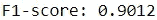
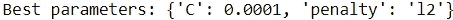
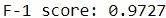

# 正规化介绍

> 原文：<https://towardsdatascience.com/an-introduction-to-regularization-ec14a269018c>

## 这就是让你训练的模型实际可用的原因

Nicholas Githiri 摄:[https://www . pexels . com/photo/person-holding-volume-knob-1345630/](https://www.pexels.com/photo/person-holding-volume-knob-1345630/)

过度拟合是任何数据科学家的克星。

没有什么比精心构建一个在训练数据上得分很高的模型更令人沮丧的了，因为它在测试数据上使用时表现不佳。

用户可以通过使用正则化来避免这种结果，正则化是阻止过度拟合的最有效的技术之一。

在这里，我们深入研究正则化做了什么，以及如何利用它来训练模型在高水平上执行。

## 过度拟合问题

在讨论正则化之前，值得讨论一下过度拟合以及它在机器学习项目中如此不受欢迎的原因。

过度拟合是一个术语，用于描述过度适应训练数据的模型，从而使其无法在看不见的数据上表现良好，尽管在训练数据上表现良好。

这乍听起来可能很奇怪。一个模型从训练数据中“学到太多”意味着什么？

答案在于，这些模型通过使用损失函数来衡量性能来学习，损失函数量化了模型的预测值与训练数据中的实际值之间的差异。自然，损失函数的目标是最小化这种差异。

然而，仅仅最小化损失并不一定对应于更好的模型性能。

毕竟，一个只关心训练数据的实际值和预测值之间的差异的模型也会考虑噪声等不需要的元素，因此会增加对看不见的数据不适用的复杂性。

用这种安排训练的模型不能一般化，并且将不能针对看不见的数据充分地执行，这是模型的全部目的。

## 正规化

那么，正则化如何帮助避免令人讨厌的过度拟合问题呢？

简单来说，它给损失函数增加了一个“惩罚”。

正则化确保损失函数不仅考虑预测值和实际值之间的差异，还考虑赋予特征的重要性。

通过这种技术，用户可以限制模型的复杂性，并训练模型使用看不见的数据做出准确的预测。

当然，有多种方法来惩罚一个包含太多复杂性的模型。

两种主要的正则化技术是套索正则化(也称为 L1 正则化)和岭正则化(也称为 L2 正则化)。

总体而言，Lasso 正则化基于模型要素系数的大小对模型进行惩罚，而 Ridge 正则化基于模型要素系数的平方值对模型进行惩罚。

## 实施正规化

既然我们已经探索了正则化的好处，我们如何在我们的机器学习模型中利用这种技术呢？

嗯，Python 的机器学习包里很多算法已经默认实现正则化了。例如，如果用户没有明确指定正则化技术，Scikit-learn 模块中的线性分类器使用 L2 正则化。

那么，既然正则化已经是机器学习算法中的一个嵌入特性，那么用户是否正确地利用了这项技术呢？

简短的回答是:可能不会。

这是因为分配给模型参数的默认值很少是最佳的。

毕竟，不同的机器学习任务在正则化的类型和强度方面有所不同，正则化是确保训练好的模型在看不见的数据上表现良好所需的。

这就引出了一个问题:在用感兴趣的数据训练模型时，如何确定最佳的正则化类型？

## 个案研究

为了演示用户如何确定和实现最有效的正则化方法，我们可以使用 Scikit-learn 模块中的玩具数据集构建一个线性分类器。

首先，我们准备数据，创建训练集和测试集。

Scikit-learn 模块中的大多数线性分类器允许用户使用`penalty`和`C`参数修改正则化技术。

`penalty`参数指的是算法包含的正则化技术。

`C`参数定义分类器使用的正则化强度。分配给该参数的值与正则化的强度成反比。换句话说，C 的值越大，正则化越弱。

对于这个案例研究，我们将使用 [LinearSVC](https://scikit-learn.org/stable/modules/generated/sklearn.svm.LinearSVC.html) 类构建一个模型。

默认情况下，模型分别给`penalty`和`C`参数赋值‘L2’和 1。让我们看看一个基线模型在测试集上的表现如何，这些测试集是基于 f1 分数度量的。

代码输出(由作者创建)

基线模型相对于测试集产生大约 0.9012 的 f-1 分数。正则化的使用在使模型相对于测试数据表现良好方面发挥了重要作用。

也就是说，分配给模型超参数的默认值可能不是给定数据集的最佳值。不同类型或强度的正则化可能会产生更好的性能。

因此，通过考虑`penalty`和`C`参数值的其他组合并识别产生最佳性能的组合来微调模型将是有益的。这可以通过执行超参数调谐程序来实现。

对于这种情况，Scikit-learn 模块提供了 [GridSearchCV](https://scikit-learn.org/stable/modules/generated/sklearn.model_selection.GridSearchCV.html) 类，允许用户测试超参数的不同组合。该工具最好的特性之一是其内置的交叉验证分割策略，进一步降低了过度拟合的可能性。

让我们使用 GridSearchCV 来确定模型的最佳超参数。

代码输出(由作者创建)

优化的模型仍然使用 L2 正则化。但是，它也为`C`参数赋值 0.0001。这意味着当使用比基线模型强度更高的正则化时，模型性能提高。

让我们看看具有这些参数的模型在测试集上的表现。

代码输出(由作者创建)

优化后的模型对数据集的 f-1 得分为 0.9727，比基线模型有了相当大的改进。

## 关键要点

照片由 [Prateek Katyal](https://unsplash.com/@prateekkatyal?utm_source=medium&utm_medium=referral) 在 [Unsplash](https://unsplash.com?utm_source=medium&utm_medium=referral) 上拍摄

正则化通过限制模型的复杂性来帮助克服过度拟合。

用户可以通过了解他们的模型的特征来充分利用这种技术，这些特征允许他们选择最佳的正则化方法。

如果您不确定是否在机器学习任务中充分利用了正则化，请随意浏览感兴趣模型的文档，并查看提供了哪些关于优化正则化的工具。

我祝你在数据科学的努力中好运！