# SageMaker 管道简介

> 原文：<https://towardsdatascience.com/an-introduction-to-sagemaker-pipelines-4018a819352d>

## 如何在 Amazon SageMaker 上开始您的 MLOps 之旅

图片来自 [Unsplash](https://unsplash.com/photos/4XvAZN8_WHo) 作者 [JJ 英](https://unsplash.com/@jjying)

[MLOps](https://medium.com/sciforce/mlops-comprehensive-beginners-guide-c235c77f407f) 是生产过程中经常被忽视的一个重要途径。很容易分离出您想要训练和部署的单一模型。在现实中，将会有大量的模型供您使用。您需要确保您有适当的基础设施来管理培训、模型跟踪和部署。MLOps 有助于将这些过程构建并简化为一个清晰的工作流，为机器学习量身定制。

[SageMaker Pipelines](https://aws.amazon.com/sagemaker/pipelines/) 是亚马逊 SageMaker 支持的首要 MLOps 特性。使用管道，您可以创建和管理大规模的端到端 ML 工作流。在今天的文章中，我们将介绍如何设置 SageMaker 管道。

**注意**:对于 AWS 的新用户，如果你想跟进，请确保在下面的 [**链接**](https://aws.amazon.com/console/) 中注册账户。**本文将假设一个新手对 AWS 和 SageMaker 有中级的了解。**

# 目录

1.  SageMaker 管道是如何工作的？
2.  SageMaker 项目设置
3.  可视化 SageMaker 管道
4.  其他资源和结论

## 1.SageMaker 管道是如何工作的？

在高层次上，SageMaker 管道是通过一系列协调的 [**步骤**](https://docs.aws.amazon.com/sagemaker/latest/dg/build-and-manage-steps.html) 构建的。您可以定义不同的步骤类型，如 [**训练步骤**](https://docs.aws.amazon.com/sagemaker/latest/dg/build-and-manage-steps.html#step-type-training) 或 [**注册模型步骤**](https://docs.aws.amazon.com/sagemaker/latest/dg/build-and-manage-steps.html#step-type-register-model) 。使用 SageMaker SDK，您可以在 Python 中构建这些步骤，一旦执行，就会创建一个显示您的工作流的可视化 DAG。

SageMaker 管道的另一个关键部分是 [**管道参数**](https://docs.aws.amazon.com/sagemaker/latest/dg/build-and-manage-parameters.html) 。通过参数，您可以将变量注入到管道中。通过变量，我们可以从实例类型到实例计数等等。使用这些，您可以在工作流程的不同部分调用这些参数。

## 2.设置

SageMaker Pipelines 是由 [SageMaker 工作室](https://aws.amazon.com/sagemaker/studio/)最有效地编排的。SageMaker Studio 是由 SageMaker 提供的一个 IDE，在这里你可以在一个与 JupyterLab 非常相似的环境中工作，但是拥有 SageMaker 的所有功能。您应该能够在 SageMaker 控制台的左侧访问 Studio。

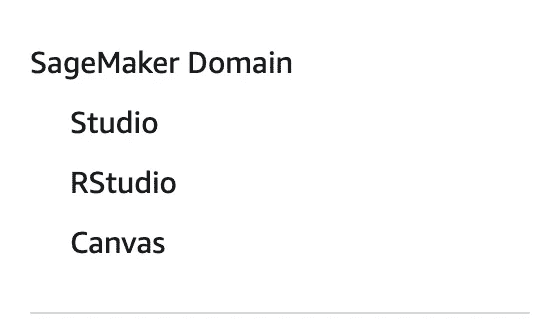

SageMaker 工作室(作者截图)

在 Studio 控制台上，你应该可以点击**添加用户**，在这里你可以创建一个 [SageMaker 域](https://docs.aws.amazon.com/sagemaker/latest/dg/gs-studio-onboard.html)。在你点击了你已经创建的用户之后，你应该能够启动一个工作室应用程序。在这里，您应该能够看到开始使用 Studio 的一般设置。

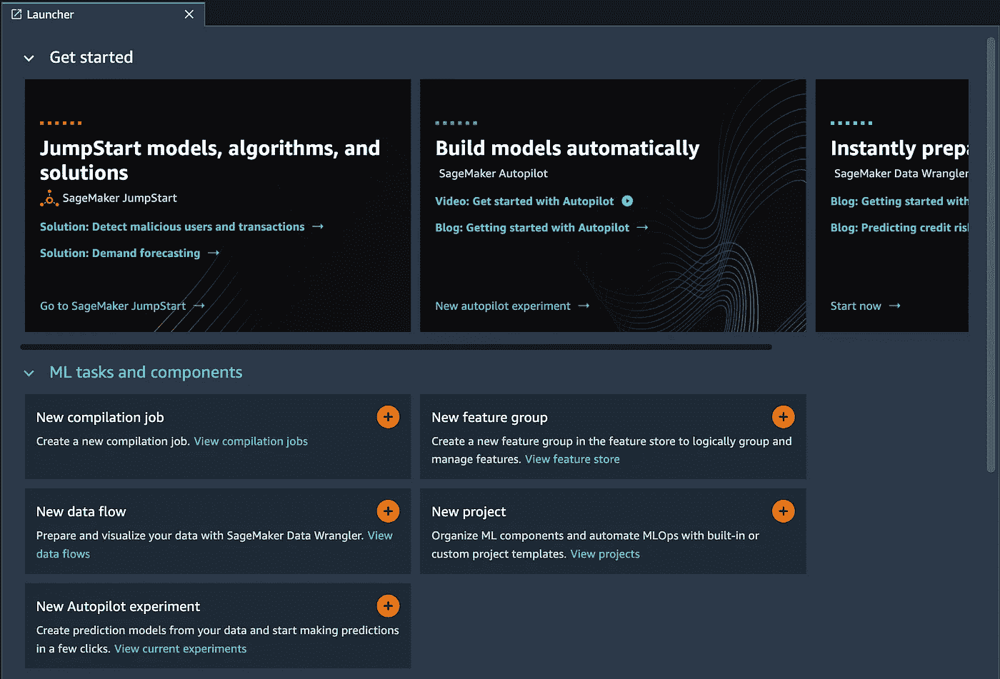

工作室(作者截图)

现在我们可以立即开始工作，使用 [SageMaker Python SDK](https://sagemaker.readthedocs.io/en/stable/) 从头开始构建管道。然而**从头开始建立一个管道可能是一件乏味的事情**并且许多基础设置可以自动化。 [SageMaker 项目](https://docs.aws.amazon.com/sagemaker/latest/dg/sagemaker-projects-whatis.html)帮助提供**现成的模板**，您可以根据自己的特定 ML 用例进行修改和构建。我们可以在 SageMaker Studio UI 中找到项目。

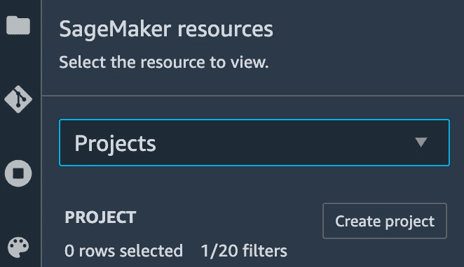

创建 SageMaker 项目(作者截图)

如果我们点击**创建项目**，我们可以看到提供的不同模板。

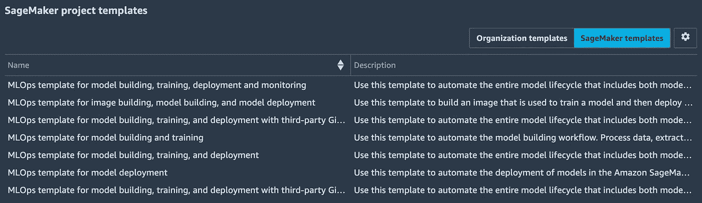

项目模板(作者截图)

在这里，我们可以从简单的模型构建和培训模板开始。选择后，我们可以命名和创建项目，此过程需要几分钟时间。

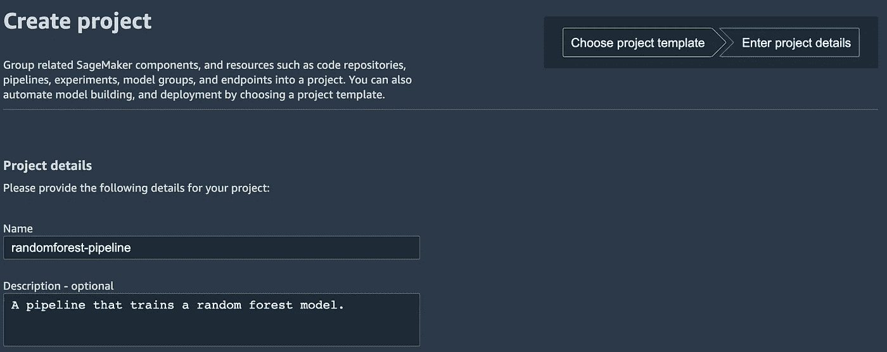

创建项目(作者截图)

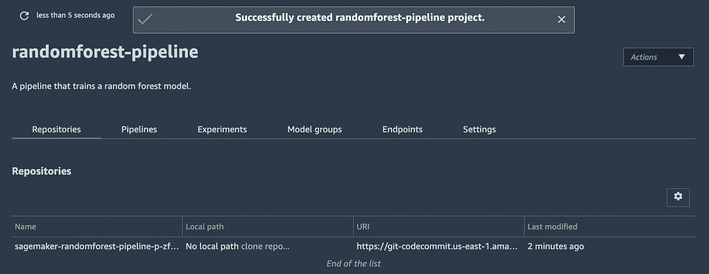

项目已创建(作者截图)

现在我们可以更深入地了解管道实际上是由什么组成的。

## 3.可视化 SageMaker 管道

在 Repositories 选项卡的右边，您应该能够看到 Pipelines 选项卡。在这里，我们可以看到我们的项目模板已经为我们创建了一个预构建的管道。如果我们点击管道，我们应该能够看到正在进行的执行。

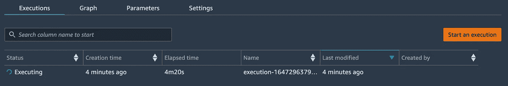

管道正在执行(作者截图)

为了理解工作流程，如果我们单击“Graph ”,我们可以看到构建此管道的不同步骤。

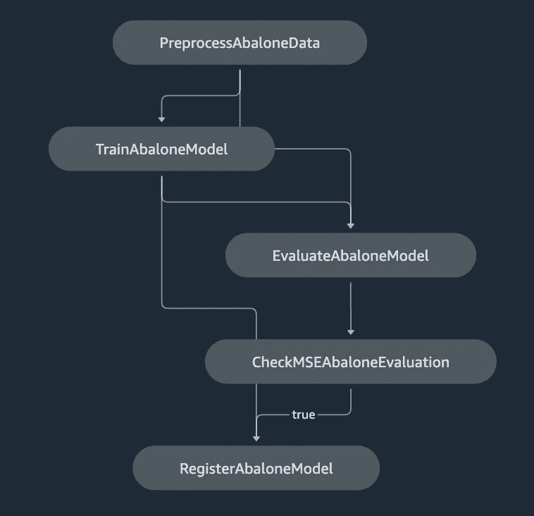

DAG(作者截图)

我们讨论的另一个主要部分是我们注入到管道中的参数或变量。这在右侧的参数选项卡中可见。

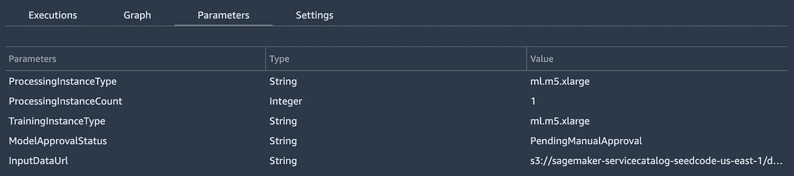

参数(作者截图)

现在你可以在哪里编辑这条管道后面的代码呢？如果我们返回到 randomforest-pipeline 项目的 SageMaker 项目选项卡，您应该能够克隆此存储库，并且它将在 Studio IDE 中本地显示。

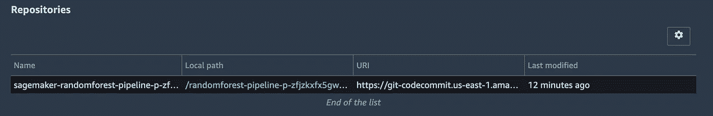

克隆项目回购(作者截图)

如果您单击显示的本地路径，那么您应该能够看到用于编排和构建该管道的代码。

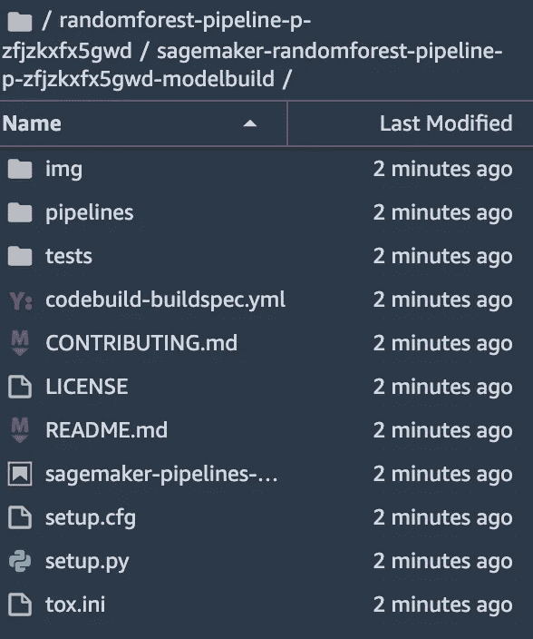

管道代码(作者截图)

默认情况下，Pipelines 使用鲍鱼数据集构建一个示例，但是您可以为您想要构建/训练的数据和模型编辑该代码。如果我们转到 Pipelines 目录，您应该能够看到许多可以用来构建的样板代码。根目录下还有一个笔记本，帮助执行您在 pipelines 目录中提供的 Python 脚本。

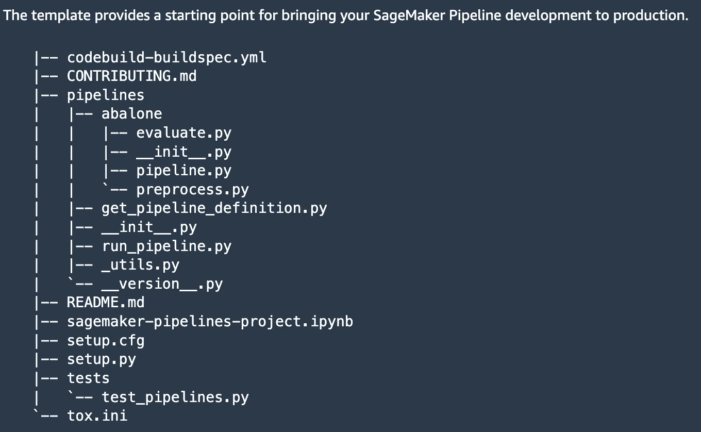

管道设置(作者截图)

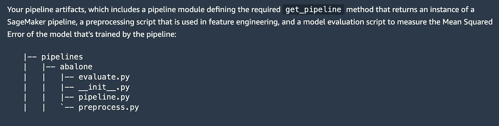

定义管道的 Python 脚本(作者截图)

您应该关注的主要 Python 脚本是 **pipeline.py** 。这是一个脚本，它将您的所有步骤打包在一起，并捕获您定义的整个工作流。您可以在 Python 文件的末尾看到这一点。

然后，这些脚本会在已经为您预先准备好的笔记本单元中执行。

执行管道

## 4.其他资源和结论

这是一个关于如何利用 SageMaker 管道进行 MLOps 之旅的温和介绍。利用项目，您可以获得预构建的模板，您可以根据自己的用例轻松调整这些模板。管道提供了大量的步骤和可能性，以及 SageMaker 作为一个整体提供的计算规模和能力。

## 额外资源

[SageMaker 管道端到端示例](https://sagemaker-examples.readthedocs.io/en/latest/sagemaker-pipelines/tabular/tensorflow2-california-housing-sagemaker-pipelines-deploy-endpoint/tensorflow2-california-housing-sagemaker-pipelines-deploy-endpoint.html)

[管道 Youtube 演示](https://www.youtube.com/watch?v=Hvz2GGU3Z8g)

[带 SageMaker 的 MLOps】](https://aws.amazon.com/sagemaker/mlops/)

*如果你喜欢这篇文章，请在* [*LinkedIn*](https://www.linkedin.com/in/ram-vegiraju-81272b162/) *上与我联系，并订阅我的媒体* [*简讯*](https://ram-vegiraju.medium.com/subscribe) *。如果你是新手，使用我的* [*会员推荐*](https://ram-vegiraju.medium.com/membership) *报名。*