# 使用 REST APIs 和 Python 在 LinkedIn 上共享内容的介绍

> 原文：<https://towardsdatascience.com/an-introduction-to-sharing-content-on-linkedin-using-rest-apis-and-python-d82355a06178>

## 了解如何使用 REST APIs 在 LinkedIn 上共享内容

来自[像素](https://images.pexels.com/photos/2115217/pexels-photo-2115217.jpeg)的图像

[LinkedIn](https://www.linkedin.com/) 是一个受欢迎的社交媒体平台，允许用户相互联系并维护一个职业网络。您可以管理您的个人资料，也可以为您的组织创建公司个人资料。LinkedIn 的一个有趣的功能是能够在你的订阅源或你的组织的订阅源上分享帖子。你可以在帖子中嵌入网址，提供标签和表情符号，还可以分享图片和视频。虽然在 LinkedIn 上分享内容的主要方式是使用 web 应用程序，但是您也可以使用 LinkedIn 提供的[REST API](https://docs.microsoft.com/en-us/linkedin/)和您选择的编程语言以编程方式来完成。

在本文中，我们将学习如何使用[LinkedIn REST API](https://docs.microsoft.com/en-us/linkedin/)并分享来自您的个人档案以及您管理的组织档案的内容。如果你没有组织，不要担心，因为我会从头开始指导你。

# 先决条件

为了更进一步，我们需要具备以下先决条件。

1.  **LinkedIn 账户** —你需要一个 LinkedIn 账户，如果你还没有，请前往[https://www.linkedin.com/](https://www.linkedin.com/)创建一个。
2.  **REST API**—使用 REST API 的一些基础知识。
3.  **python** —使用 Python 和在 Python 中使用 REST APIs 的一般编程知识。

除了上面提到的，我将创建代码库，并使用 GitHub 使其可用。在任何时间点，你都可以选择参考来自微软的 LinkedIn 的官方文档，然而，我将尝试用简单的术语解释这个过程。

假设您已经创建了 LinkedIn 帐户，现在我们将创建以下两项资产。

1.  [LinkedIn 公司页面](https://business.linkedin.com/marketing-solutions/linkedin-pages) —也可以称为公司页面，我们需要使用您的个人帐户创建它。您将成为您创建的公司页面的管理员。
2.  [开发人员门户上的应用程序](https://developer.linkedin.com/) —为了访问 LinkedIn REST APIs，我们需要创建一个应用程序，它将代表我们获得权限，并在您的个人资料或组织的个人资料上共享内容。

# 创建 LinkedIn 公司页面。

让我们从您的 LinkedIn 帐户创建一个公司页面。你可以为你的公司想出任何一个假名来继续发展。我将把我的公司作为“ *DataScholar* ”。

***第一步*** :开通 LinkedIn 账户。点击**工作**并选择**创建公司页面**。点击**公司**并输入详细信息，点击**创建页面**。

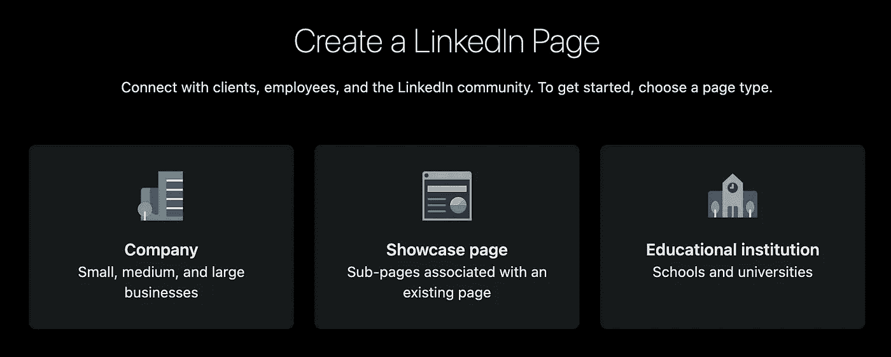

*图 1 —创建 LinkedIn 公司页面*

***第二步*** :您需要为您要创建的公司页面提供以下详细信息。

1.  **名称** —贵公司的名称。我正在使用*数据选择器*。
2.  **公司** **网址** —贵公司的 LinkedIn 用户名。
3.  **网站** —贵公司所在的网站。我准备用“[*”https://thedatascholar.com*](https://thedatascholar.com)”。
4.  **行业** —选择为*软件*。
5.  **公司**
6.  **徽标** —您公司徽标的任何自定义图像。
7.  **标语**——对贵公司的简短描述。

一旦您提供了所有这些详细信息，您的 LinkedIn 公司页面就创建好了。

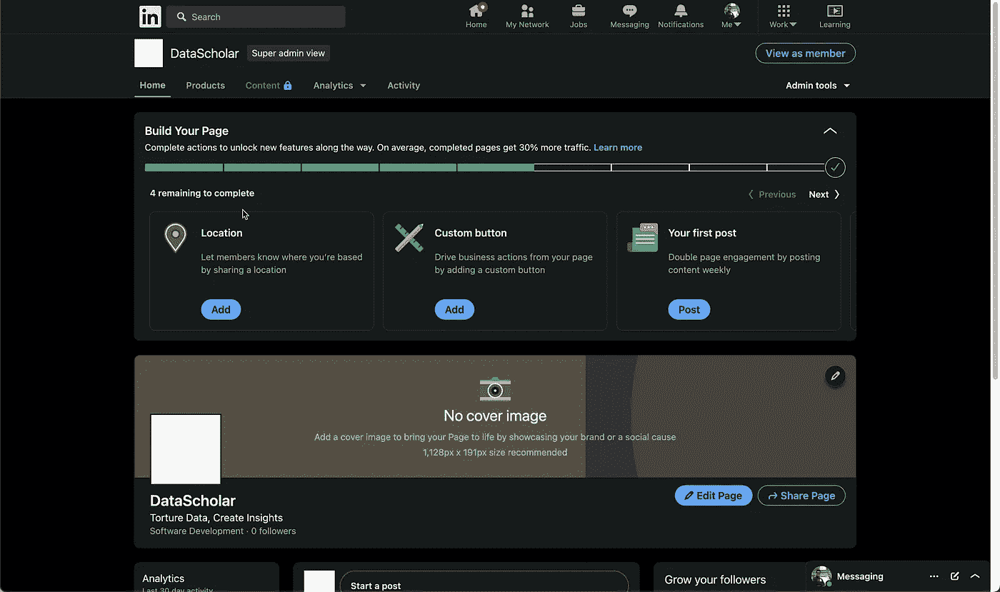

*图 2 — LinkedIn 公司页面*

# 在开发者门户中创建 LinkedIn 应用程序。

在本节中，我们将深入探讨并在 LinkedIn Developer 平台上创建一个应用程序，它将允许我们以编程方式与 LinkedIn 资产进行交互。

***第一步*** :导航到[https://developer.linkedin.com/](https://developer.linkedin.com/)。点击**我的应用**，然后选择**创建应用**。输入申请的详细信息。

1.  **应用程序名称** —应用程序的名称。您可以使用与您公司相同的名称。
2.  **LinkedIn 页面** —应用程序将关联的公司页面。
3.  **隐私政策 URL** —可选字段。
4.  **应用徽标** —为您的应用上传一个徽标。

同意条款，然后点击**创建应用**。

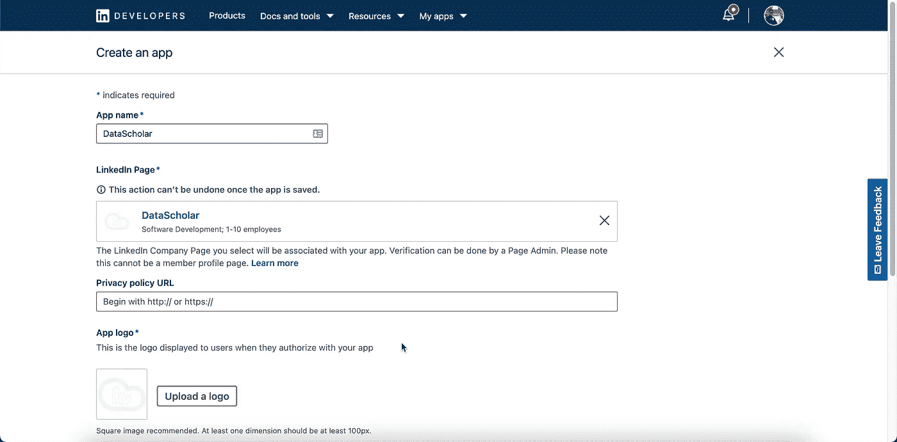

*图 3——创建 LinkedIn 应用*

***第二步*** :点击**验证**验证您的申请。

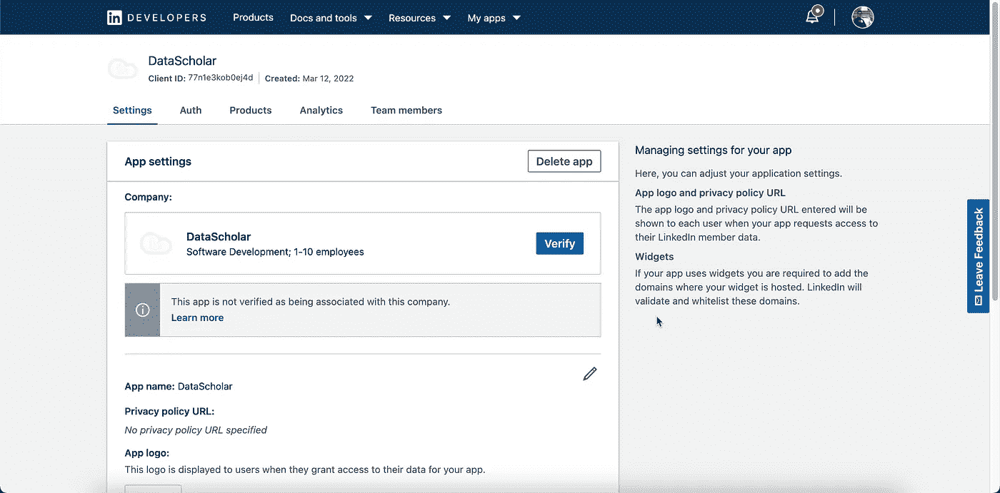

*图 4 —验证 LinkedIn 应用程序*

***第三步*** :点击**生成网址**复制网址后点击**我完成**。

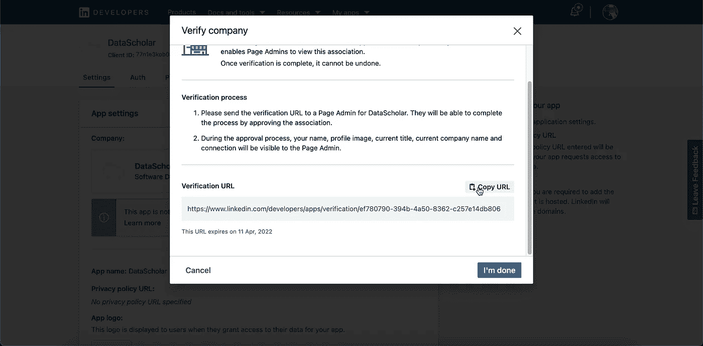

*图 5 —为 LinkedIn 应用程序生成验证 URL*

***第四步*** :在浏览器上复制并点击网址。它会要求您验证页面的应用程序。

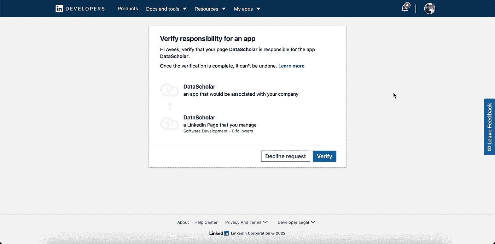

*图 6 —验证 LinkedIn 应用程序和公司关联*

***第五步*** :点击**验证**。

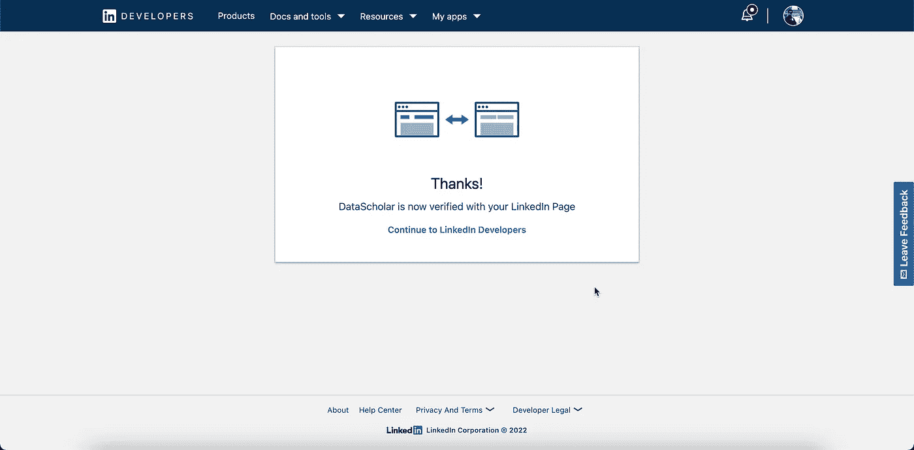

*图 7- LinkedIn 应用程序和公司协会已验证*

太好了！现在，您已经成功地创建了一个 LinkedIn 公司页面，还创建了一个使用 REST APIs 与 LinkedIn 交互的应用程序。

让我们配置我们在上一节中创建的 LinkedIn 应用程序。我们将添加访问 LinkedIn REST APIs 和存储应用凭证所需的产品。

# 为您的 LinkedIn 应用程序添加产品。

一旦你创建了 LinkedIn 应用程序，你需要定义你的应用程序将使用什么产品。基于此，将为您的应用程序提供您需要的必要权限。有三种产品可供选择。

1.  **在 LinkedIn 上分享** —这允许您发布个人资料中的内容。
2.  **使用 LinkedIn 登录** —这允许您在网页上使用 LinkedIn 社交登录。
3.  **营销开发者平台**——这允许你发布你页面上的内容。

作为本文的一部分，我将把这三个产品都添加到我的应用程序中。

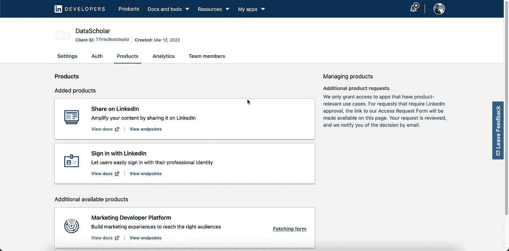

*图 8 —向 LinkedIn 应用添加产品*

**市场开发人员平台**需要额外的访问权限。你会收到一份表格。填写表格并等待批准(2 个工作日)。点击**查看访问表单**并填写相关详细信息。

*图 9 —填写市场开发平台评审表*

提交表格后，可能需要 2 个工作日才能通过电子邮件获得答复。然后，您会注意到该应用程序已添加到您的产品列表中。

> 💡 ***营销开发人员平台*** 允许您发布公司页面上的内容。不添加它，你仍然可以从你的个人 LinkedIn 档案发布内容。

# 获取并存储应用凭据。

***第一步*** :在你的 LinkedIn app 上，点击 **Auth** 标签。您可以找到稍后需要的**客户端 ID** 和**客户端机密**。

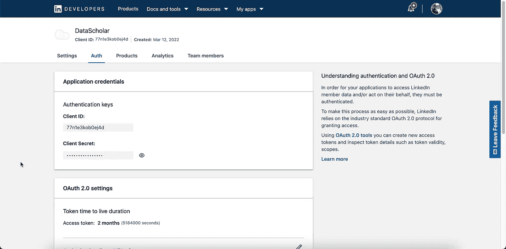

*图 10 —存储 LinkedIn 应用程序凭据*

***第二步*** :为你的 App 添加重定向网址。这可以仅仅是你的网页网址加上“*/auth/LinkedIn/callback*”。

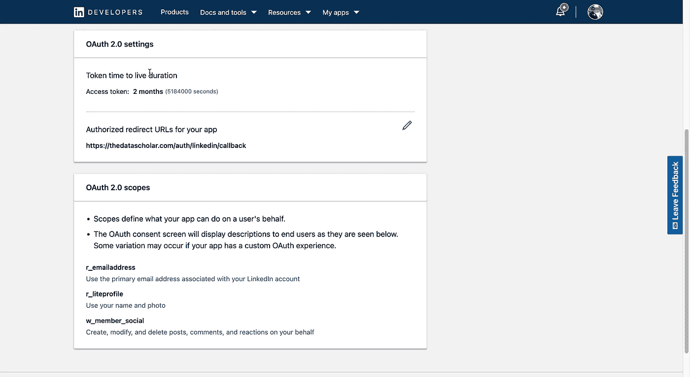

*图 11 —设置应用程序重定向 URI*

***第三步*** :从公司 URL 获取**组织 ID** 。

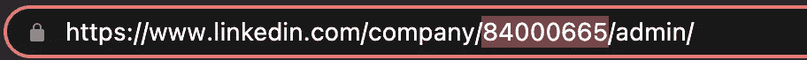

*图 12 —获取组织 ID*

现在让我们开始构建允许我们与 LinkedIn REST APIs 交互的 python 程序。

# 设置静态变量和库

为了在 python 中使用 REST APIs，我们将利用`requests`库。您可以使用 python `pip`管理器来安装它。除此之外，我们还将创建变量来存储我们在上一节中获得的`client_id`、`client_secret`和`organization_id`。

在接下来的步骤中，我们需要获得一个访问令牌，用于共享 LinkedIn 概要文件中的内容。访问令牌可以通过以下两个步骤获得。

1.  一个 **GET** 请求，将要求用户允许你的应用程序获得所需的权限，并将你重定向到一个新的 URL。从这个 URL 中，您需要提取参数代码中的值。
2.  一个 **POST** 请求将返回你的全新访问令牌。

# 创建 GET 请求以获取验证码

设置以下详细信息以构建 URL。

*   `base_url`:LinkedIn 端点获取授权码。
*   `redirect_uri`:您在创建应用程序时设置的重定向 URL。
*   `scope`:发布个人资料内容所需的范围。
*   `state`:授权后会返回给您的随机文本。这允许您验证来自 CSRF 攻击的响应。为了简单起见，我们现在不要太在意它。

当您运行上述代码时，它将在您的控制台上打印 URL。复制网址并在你的浏览器中点击。您将被要求使用 LinkedIn 凭据登录。一旦您的登录被验证，它会将您重定向到`redirect_uri`中提到的地址。在这个 URL 中，您还会收到两个参数，`code`和`state`。复制`code`的值并存储，以处理下一个请求。

> 💡要从您的公司页面发布内容，您需要在您的范围内拥有更多权限。一旦您收到 LinkedIn 团队对**营销开发人员平台**的验证，您就可以获得此信息。

# 创建 POST 请求以获取访问令牌

现在已经获得了验证码，我们可以通过向 LinkedIn 发送 POST 请求来获得访问令牌。您需要在 POST 请求中提供以下内容作为有效负载。

*   `grant_type`:授权类型应为'*授权 _ 代码*'。
*   `code`:上一步获取的授权码。
*   `redirect_uri`:你的应用的重定向 URI。
*   `client_id`:我们之前存储的客户端 ID。
*   `client_secret`:我们之前存储的客户端秘密。

如果 POST 请求成功，您将收到一个包含`access_token`的 JSON 响应。我把它提取出来并存储在一个单独的变量中。

# 获取您的 LinkedIn 个人资料 ID

为了从您的 LinkedIn 个人资料发布内容，您需要获取您的个人资料 ID。这可以通过直接查询 LinkedIn REST API 来实现。

请注意，我已经在授权头中将`access_token`作为不记名令牌进行了传递。此外，我已经将 LinkedIn 概要 ID 存储在一个名为`person_id`的变量中。

# 分享 LinkedIn 个人资料中的内容

让我们从 LinkedIn 个人资料中准备想要分享的内容。我从 Redhat 中随机选择了一篇文章来分享。此外，我想给共享的内容添加一个缩略图。为此，您可以选择任何公开可用的图像。请注意，有效负载包含键`owner`，其值是我们在前面的步骤中获得的概要文件 ID。此值决定是从个人资料还是从公司页面共享帖子。

如果你想更深入的了解有效载荷，请参考[官方文档](https://docs.microsoft.com/en-us/linkedin/marketing/integrations/community-management/shares/share-api?tabs=http#post-shares)。有效载荷中的每个字段都有清晰的解释。请求成功后，内容将从您的个人资料中共享，并出现在 feed 中，如下所示。

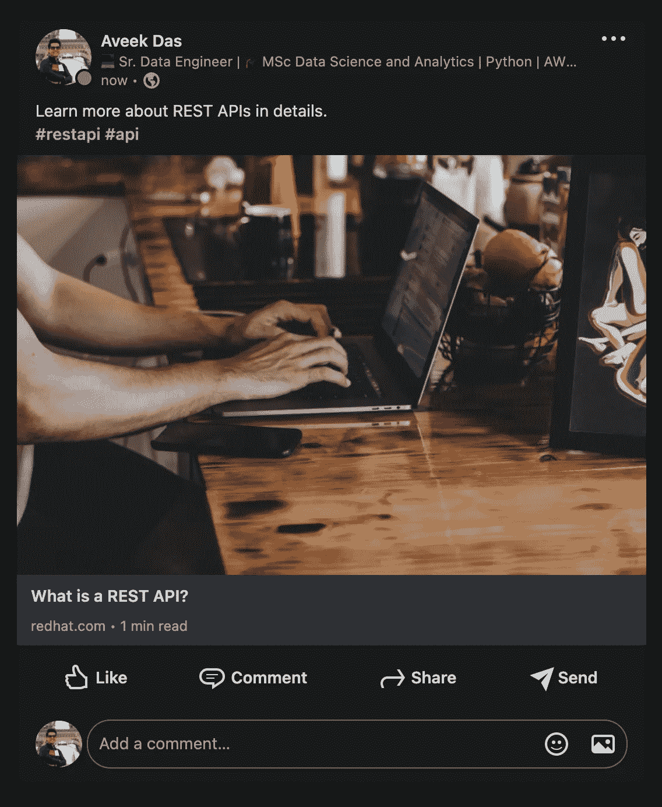

*图 13——LinkedIn 上个人资料中分享的帖子*

# 分享 LinkedIn 公司页面的内容

从组织页面共享内容与从个人简档共享内容非常相似。决定帖子内容是否从个人或组织的个人资料中共享的唯一关键是`owner`。以下值可用于`owner`键。

*   **个人简介** : `urn:li:person:{person_id}`
*   **组织** : `urn:li:organization:{organization_id}`

您可以从公司页面的 URL 获取 organization_id。有了它，现在可以从组织的个人资料中修改有效负载和共享内容。

这将发布您组织的个人资料中的内容，并且您将在订阅源中看到这些内容。

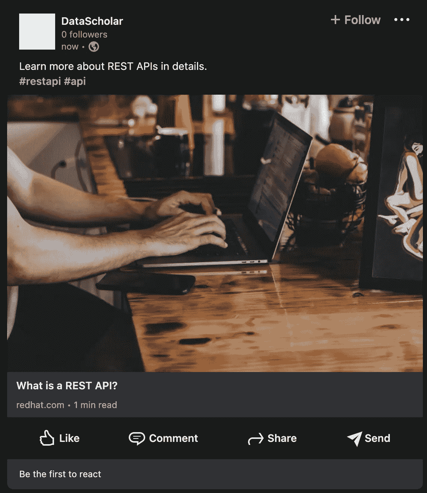

*图 14 —从 LinkedIn 上的组织档案中分享的帖子*

> 💡要从组织的个人资料中发布内容，您需要等到收到 LinkedIn 的电子邮件，这可能需要 2 个工作日。

# 结论

在本文中，我们重点讨论了如何使用 LinkedIn REST APIs，以及如何从个人档案和组织档案中共享内容。这只是使用 LinkedIn REST APIs 的初级介绍。除了分享内容，你还可以使用其他[产品](https://developer.linkedin.com/product-catalog)与 LinkedIn 广告和活动管理工具互动。

## 资源

如果你想了解更多关于 LinkedIn REST APIs 的知识，我推荐你阅读下面的内容。

*   [https://docs . Microsoft . com/en-us/LinkedIn/shared/authentic ation/authentic ation](https://docs.microsoft.com/en-us/linkedin/shared/authentication/authentication)
*   [https://docs . Microsoft . com/en-us/LinkedIn/marketing/integrations/community-management/shares/share-API](https://docs.microsoft.com/en-us/linkedin/marketing/integrations/community-management/shares/share-api)
*   [https://developer.linkedin.com/product-catalog](https://developer.linkedin.com/product-catalog)

*原载于 2022 年 3 月 13 日*[*【https://datacloudmag.com】*](https://datacloudmag.com/linkedin-rest-api-python/)*。*