# 随机过程导论(2)

> 原文：<https://towardsdatascience.com/an-introduction-to-stochastic-processes-2-bdcb894aeeef>

## 概率测度的连续性、Radon-Nikodym 导数和 Girsanov 定理

图片来自 [Unsplash](https://unsplash.com/photos/dQf7RZhMOJU)

Girsanov 定理和 Radon-Nikodym 定理在金融数学中经常用于金融衍生品的定价。而且他们关系很深。这些定理的用法也可以在机器学习中找到(尽管非常理论化)。文献[9]中给出了一个例子，其中 Girsanov 的理论被应用于一种用于强化学习的新策略梯度算法中。

然而，那些定理远非直观的(甚至是符号)。因此，这个帖子试图向他们提供一个清晰的解释，这是很难找到的。为了正确理解它们，我们需要首先理解概率分布的不同类型的连续性，这就是为什么这个主题也包括在内，并占了这篇文章的很大一部分。

另外，注意这篇文章是[这个](/an-introduction-to-stochatic-processes-8c0b51ca73a9)的延续，比如过滤、鞅、itprocesses 等等。已经讨论过了。所以如果有不清楚的地方，可以参考那个帖子，或者我另外两个关于测度论和概率论的帖子，或者给我留言。

# 对概率论的再认识

## 随机变量和分布

随机变量是概率论中一个非常基本的概念，也是理解随机过程的基础。随机变量在我关于测度论和概率的其他文章中略有提及，但在这里我们将更严格地看待它。首先，我们在测度论的背景下给出了随机变量的形式定义:

给定一个概率三元组*(ω，𝓕，P)* ，一个随机变量是从ω到实数 *ℝ* 的函数 x，这样

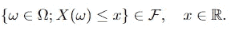

Cond。1.1

我们可以看到*ω*是 *X* 的定义域，条件 1.1 与说 *X⁻ ((-∞，x))∈𝓕.相同*还有，我们知道，如果设 *A ={(-∞，x]；x ∈ ℝ}* ，那么 *σ(A) = 𝓑* ，其中 *𝓑* 是 Borel*σ*-代数。(这一点很容易证明，利用*σ*-代数的性质证明 *σ(A)* 包含所有区间。)因此，对于所有的 *B ∈ 𝓑* ，条件 1.1 也与 *X⁻ (B) ∈ 𝓕* 相同。[1]

概率三元组*(ω，𝓕，P)* 上随机变量的**分布**是 p(回想一下它是定义在上的函数)，概率空间的度量。分布由定义(或者换句话说，概率由随机变量定义)

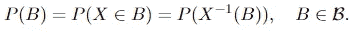

随机变量 x 的分布。

注意，有时候你也能看到一个随机变量的术语“概率定律”或“定律”，但它们是一回事。

## 连续性

我们已经知道，随机变量或分布可以是离散的，连续的，或两者的结合。但是仍然缺少一些东西，在这一节中，我们将回顾我们已经知道的东西并填补空白。

(1)离散:如果一个概率测度 *μ* 的所有质量都在每个单独的点上，那么它就是离散的。最简单的例子是掷硬币，其图形如下所示:

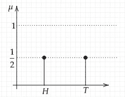

图 1.2 离散随机变量的一个例子。(抛硬币)

(2)绝对连续:这个性质既可以指随机变量，也可以指测度，定义不同。然而，它们有着内在的联系，所以我们将在这里讨论这两个问题，记住概率测度和随机变量之间的联系是很重要的。

a.首先我们看一下**措施**的案例。它是相对于作为参考的另一个度量来定义的。我们说ν相对于 *μ* 绝对连续，如果 *ν(A)* = 0 对于任意 *A ∈ 𝓑* 使得 *μ(A) = 0* 。 *ν* 和 *μ* 之间的这种关系通常用 *ν ≪ μ* 来表示。[2]我们也可以说 *μ* 支配 *ν。*如果适用于 *ν ≪ μ* 和 *μ ≪ ν* ，那么我们说这两个测度是等价的，通常记为 *ν ~ μ* 。更直观的说，我们可以把 *ν* 看作一个更“精致”的测度，如果 *μ* 告诉我们一个集合的测度为零，那么 *ν* 就不会输出更大的结果。

b.在**随机变量**的情况下，随机变量*x:ω→ℝ*是**绝对连续的**如果存在一个可积的非负函数 *fₓ: ℝ → ℝ⁺* (这是概率密度函数)使得对于所有 x *∈ ℝ，*

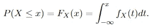

绝对连续随机变量的条件。

有时我们也可以看到 *fₓ* 在所有任何 Borel 集合上是可积的(元素在 *𝓑* 中)，根据我们在*随机变量*一节中所讨论的，这两个版本的定义是相同的*。*

出现了两个问题:1 .「连续性」和「绝对连续性」有什么关系？2.连续性和度量有什么关系？(现在我们只说随机变量)

首先我们来回答第二个问题:如这里所讨论的，如果 *P(X = x) = 0* ，对于所有的 *x ∈ ℝ，*那么 *X* 是一个连续变量。(直观上，当随机变量连续时，它可以取实直线上的任何值，在这种情况下，测度给了我们“点的长度”)。现在我们来看第一个问题:从绝对连续性的定义，我们可以推导出

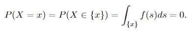

情商。1.3

为什么等式 1.3 适用是显而易见的:对单例集的积分为零。因为我们有 *P(X = x) = 0* 对于所有的 *x ∈ ℝ* ，如上所述，x 是连续的。因此，我们有这样的说法:

> 任何绝对连续的随机变量也是连续的。

而下面的事实在**绝对**连续性和度量之间架起了桥梁:

> 一个随机变量是绝对连续的当且仅当每个零测度集的概率为零。

(3)奇异连续:这里又有“奇异连续测度”和“奇异连续分布”，又有联系。并且实际上比之前的情况(连续性)彼此更加接近。我们将首先看一下这两个概念的定义，然后给出一个具体的例子。这是一个话题，很少包括在本科学习材料中。但是在我们了解这些之后，所有类型的概率分布都包括在内了。

如果你只是想理解吉尔萨诺夫定理，就没有必要去研究奇异连续性的细节，因为“绝对连续性”是非常重要的。然而，我相信学习概率论对理解所有这些类型的分布是有帮助的。

a.**ℝ*ⁿ*上的一个**奇异连续分布是集中在一个勒贝格测度零的集合上的概率分布，但这个集合中每一点的测度也是零。

b.并且一个测度 *μ* 关于测度 *λ* 是**奇异连续的如果 *μ{x} = 0* 对于所有的 *x ∈ ℝ，*但是有 s 个⊆ *ℝ* 其中 *λ(S) = 0* 和 *μ(S* ᶜ *) = 0，*这意味着【T34 也可以遇到另一个名称，奇异测量，并且可以看起来具有稍微不同的定义，但是这里为了简单和清楚，我们使用[1]中的版本，并且将避免术语“奇异测量”。**

一些例子对于理解奇异连续性是有用的。在一维情况下(涉及一个随机变量)，一个例子是康托尔函数。由于其形状，它也被称为“魔鬼楼梯”。(见图 1.4)这样的累积分布函数(CDF)是连续的但几乎处处零导数(这个词[我们在](/lebesgue-measure-and-integration-64f5c45d7888)之前就见过了)。离奇的是，它不是按导数增长，而是确实按构造增长。

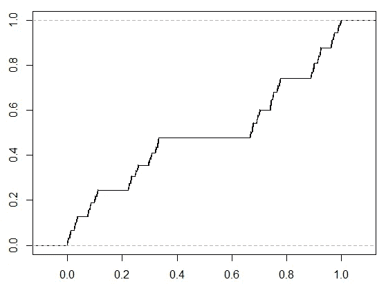

图 1.4 康托尔函数。(图片来自[交叉验证](https://stats.stackexchange.com/questions/229556/how-to-sample-from-cantor-distribution)。)

较少病态的例子存在于**更高维度**(想想这个:我们要构造一个勒贝格测度为零的集合，在集合中，每一个点也会有测度为零——自然，这将是类似于“一条线的面积”或者“一个平面的体积”的东西，在一维空间中是找不到的。)，这里会考虑几个随机变量的联合分布。这里我们将展示一个例子，其中两个随机变量取自[4]:

> 有两个设备，它们产生从 0 到 1 的随机数。但是，其中一个坏了，总是给 0。统计学家连续两天每天使用其中一个。他从这两个设备中随机选择(当然，有可能他两天都使用同一个设备)。设 X 表示第一天获得的数量，Y 表示第二天获得的数量。X 和 Y 的联合分布是什么？

我们很容易看出，这种分布既不是绝对连续的，也不是离散的，因为好器件的输出分布是均匀的，而坏器件的输出分布是离散的。为了分析它实际上是什么，我们也将通过这个例子来讨论概率分布的分解。

为了更直观的理解，我在这里提供了一个蹩脚的分布函数:

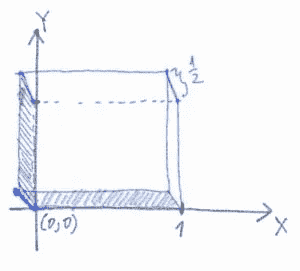

图 1.5 和 y 的联合概率密度函数(图片由作者提供。)

注意 f(0，0) = 1/2，这意味着一半的质量集中在点(0，0)上。它对应的事件是，在这两天，统计学家得到的输出为零。而另一半质量均匀地分布在一个接一个的单位正方形上(体积为 1 × 1 × 1/2 = 1/2)。我们还可以在 CDF 中找到奇异分量。不失一般性，我们先试着算出 X 的累积分布。根据[勒贝格分解定理](https://en.wikipedia.org/wiki/Lebesgue%27s_decomposition_theorem)，任何概率测度 *μ* 都可以分解为

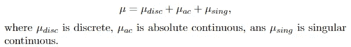

等式 1.6 测度分解。

由于 CDF 唯一确定随机变量的分布(考虑定义)，我们也可以将 CDF 分解为等式 1.6 给出的形式，即

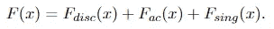

方程 1.7 CDF 的分解。

X 的 CDF 没有任何奇异部分。并且可以容易地确定离散部分和绝对连续部分:

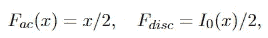

方程 1.8，1.9 x 的 CDF 的离散部分和绝对连续部分。

其中 Iᵣ(x)表示以下函数

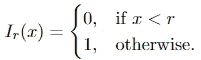

因此，我们有

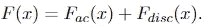

方程 1.10 的 CDF。

根据我们之前讨论过的独立同分布(i.i.d .)假设，Y 与 X 具有完全相同的 CDF，由等式 1.10 给出。此外，由于 i.i.d .假设，X 和 Y 的 CDF 简单地为 F(x，y) = F(x)F(y)，这样我们就得到

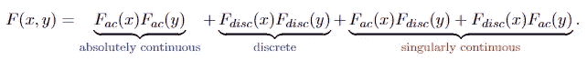

方程 1.11 和 y 的联合 CDF。

X 和 Y 的联合 CDF 具有预期的所有三个部分。奇异连续部分对应的是其中一个器件坏了而另一个器件好的事件，对应的是图 1.5 中给出的 X 和 Y 的联合概率密度函数图中的阴影区域——它们在三维空间中有勒贝格测度零，在这个空间上定义的测度对应的是方程 1.11 中的奇异连续部分。但是在这个区域里，每个点的测度都是零。

现在我们回头看看奇异连续测度的定义，显然，我们可以称阴影区域上的测度为 *μ* ₁(假设其中一个器件坏了——子样本空间),另一个为 3d 空间(原始样本空间)中的 *μ* ₂，我们很容易看到 *μ* ₁相对于 *μ* ₂.是奇异的

# Radon-Nikodym 定理和测度变换

## Radon-Nikodym 衍生物

Radon-Nikodym 导数实际上是两个度量的比值，与实分析中的“导数”无关，因为实分析中的导数描述了函数变化的速度，但 Radon-Nikodym 导数与此完全不同。然而，它们确实有一些相似之处。我们可以从 Radon-Nikodym 导数的以下性质看出这一点:设 *ν* 是测度空间*(ω，𝓕)*【7】上的*σ-有限的*测度，(t14)ν是*σ-有限的意思是*ω*是具有有限测度的集合的可数并)*

*(1)若μ是测度， *μ ≪ ν* 且 *f ≥ 0* 是 *μ* 可积函数，则*

*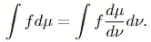*

*右侧的 dν不知何故“取消”了。*

*(2)如果 *μᵢ，i= 1，2* 都是测度并且 *μᵢ ≪ ν* ，那么 *μ₁ + μ₂ ≪ ν* 和*

*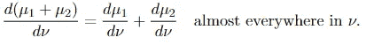*

*(3)(链式法则)如果𝜏是测度， *μ* 是*σ*-有限测度， *𝜏 ≪ μ ≪ ν* ，那么*

*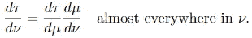*

*链式法则。*

*如果 *μ* 和 *ν* 相等，则*

*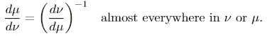*

## *氡-尼科代姆钍射气*

*Radon-Nikodym 定理展示了一种通过某种线性算子用另一个度量来表示一个度量的方法。在这种情况下，表示是通过积分算子(积分器——这个术语在这里使用)。Radon-Nikodym 定理说*

*给定一个可测空间*(ω，𝓕)* ，若*(ω，𝓕)* 上的σ-有限测度ν相对于*(ω，𝓕)* 上的σ-有限测度μ绝对连续，则*ω*上存在一个非负可测函数 f，使得*

**

*对于任何可测集 e。*

*为什么这个定理很重要？一点是可以用来说明条件期望的存在性。在我们给出条件期望的定义之前，我们需要知道这样一个事实，即给定σ代数𝓕，用 E[X | 𝓕]表示的随机变量 x 的条件期望本身是一个(𝓕-measurable) *随机变量*。定义如下:*

*我们称随机变量 y 为 x 的条件期望，即 Y = E[X | 𝓕].需要满足两个条件*

*①*y*是𝓕-measurable.*

*②对于所有的 *A ∈ 𝓕* ，我们有*

*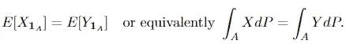*

*1_A 表示[字符(指示器)功能](https://en.wikipedia.org/wiki/Indicator_function)。更直观的说，这意味着给定信息 *𝓕* (参考[这个](/an-introduction-to-stochatic-processes-8c0b51ca73a9)看为什么叫“信息”和什么意思)， *Y* 是 *X* 的最佳预测。并且可以使用 Radon-Nikodym 定理证明的以下定理显示了条件期望的存在性和唯一性:*

*考虑一个概率空间(*ω，𝓕，P* )，其上的一个随机变量 *X* ，以及一个子σ代数𝓖 ⊆ *𝓕.*如果 *E[X]* 是明确定义的，那么存在一个𝓖-measurable 函数*e[x|𝓖】*对于*p-零集合*是唯一的(度量 *P* 在那些集合上给出零)，使得*

*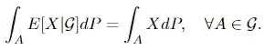*

*我们在这里提到 Radon-Nikodym 定理的最重要的原因是，它与度量的变化密切相关，而度量的变化是 Girsanov 定理中的基础。现在我们提出下面的定理:*

*如果 *P* 和 *Q* 是等价的概率测度，并且 *X(t)* 是一个 *𝓕ₜ* 适应的过程，设 *dQ/dP* 是 Radon-Nikodym 导数并且*l(s)=eₚ[dq/dp|𝓕ₛ*，那么对于 *s < t**

*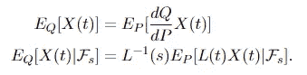*

*第二个等式很难证明，所以这里不包括它，但是第一个等式非常容易用 Radon-Nikodym 导数的性质(1)来表示:*

*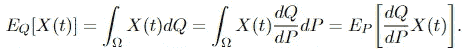*

*并且 Radon-Nikodym 定理保证 Radon-Nikodym 导数 *dQ/dP* 存在，也就是所谓的 *X* 的*密度*。*

# *吉尔萨诺夫定理*

*首先，我们简要介绍什么是维纳测度，因为下面我们将讨论维纳过程和带有漂移的维纳过程。维纳测度是定义在维纳空间上的测度，维纳空间是区间*【0，1】*上连续实值函数 x 的空间*C【0，1】*。我们可以用σ代数和测度来构造一个可测空间。而**维纳测度**是这个空间上的唯一测度，它给每一个*有限*路径分配一个概率。[5]直观上，集合的维纳测度是维纳过程轨迹是该集合的成员的概率。*

*Girsanov 定理描述了随机过程如何随着度量的变化而变化。更准确地说，它通过给出它们之间的似然比(Radon-Nikodym 导数)的显式公式，将 Wiener 测度 *P* 与连续路径空间上的不同测度 *Q* 联系起来。还需要应用的是 *P* 和 *Q* 是等价的，这在*连续性*一节中讨论。以及更多的洞察力:*

> *Girsanov 定理指出，具有不同漂移的新过程可以从具有等效度量的过程中构造出来——随机过程的漂移变化不会导致度量的剧烈变化。事实上，度量值如何变化，可以明确地计算出来。*

*Girsanov 定理的一个稍微不同的版本指出，可以为随机过程找到一个新的表示，该随机过程具有不同的漂移和测量。*

*吉尔萨诺夫定理还有一个相反的版本，它陈述了如果我们有一个带有测度 *P* 的过程 *X(t)* ，和另一个带有测度 *Q* 的过程 *Y(t)* ，其中 *Q ~ P* 。那么 *X(t)* 和 *Y(t)* 可以用漂移变化的相互关系来表示。我们将在本节中介绍这三个版本。[6]*

## *吉尔萨诺夫定理 I*

*设 W(t)是滤波概率空间上的维纳过程*

*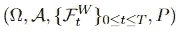*

*Exp。3.0 维纳过程的过滤概率空间。*

*设 *Y(t) ∈ ℝⁿ* 为形式的 n 维[itprocess](/an-introduction-to-stochatic-processes-8c0b51ca73a9)*

*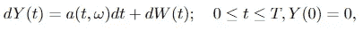*

*其中 *T ≤ ∞* 为常数 *W(t)* 为 n 维维纳过程。让我们测量*

**

*等式 3.1 测量值的变化。*

*假设 *a(s，ω)* 满足诺维科夫条件，这是过程 *M(t)* 为鞅 *:* 的充分条件*

*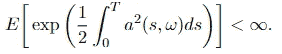*

*诺维科夫的情况。*

*其中 *E = Eₚ* 是关于 p 的期望。定义概率空间 *Y(t)* ，*(ω，𝓕_T)* 上的测度 q，通过*

*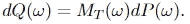*

*方程 3.2 测度的 Girsanov 变换。*

*那么 *Y(t)* 是关于概率测度 *Q* 的 n 维维纳过程，对于 *t ≤ T* 。*

*在这个定理中， *Y(t)* 是维纳过程的漂移移动后的新过程。我们可以看到， *a(t，ω)* 就是漂移，它随时间变化。 *Y(t)* 的度量是通过经由等式 3.2 中给出的过程 Girsanov 变换来变换原始度量(维纳度量) *P* 而给出的。等式 3.1 给出的*M(t)*是过程 *W(t)* 和 *Y(t)* 之间的度量变化的显式公式，这意味着它允许我们直接计算 Radon-Nikodym 导数。我们可以从等式 3.2 中看出这一点:*

*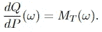*

## *吉尔萨诺夫定理 II*

*这个版本的 Girsanov 定理的公式非常冗长，因为它对于证明是有用的。但是这篇文章并没有给出证明，因为文章的目的是为了理解 Girsanov 定理(如此多不同的公式)是怎么回事，这已经够难的了。第二个版本显示了当过程的漂移改变时(或者我们如何找到过程的不同表示，如我们之前提到的),度量如何改变，给出如下:*

*设 *Y(t) ∈ ℝⁿ* 是形式的一个过程*

*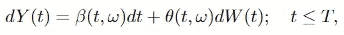*

*其中 *W(t) ∈ ℝᵐ* ， *β ∈ ℝⁿ* 和 *θ ∈ ℝⁿˣᵐ* 。假设存在过程 *u(t，ω)* 和 *α(t，ω)* 使得*

*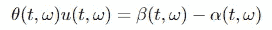*

*并假设 *u(t，ω)* 满足诺维科夫条件*

*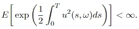*

*情商。3.3*

*让*

*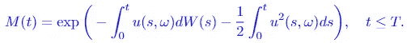*

*等式 3.4*

*度量值 *P* 和 *Q* 的定义与吉尔萨诺夫定理 I 中的定义相同，这意味着等式 3.3 中的 *E = Eₚ* ，等式 3.2 也适用。然后*

*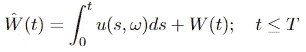*

*等式 3.5*

*是关于测量值 *Q* 的维纳过程，并且过程 *Y(t)* 具有关于 *W_hat(t)* 的另一种表示*

*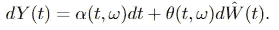*

*在吉尔萨诺夫定理 II 中，我们可以看到 *Y(t)* 的漂移从 *β(t，ω)* 变为 *α(t，ω)* 。此外，作为旁注，进程 *u(t，ω)* 和 *α(t，ω)* 应该满足某些条件，这里省略这些条件是为了使大图清晰。*

## *吉尔萨诺夫定理的逆定理*

*在逻辑中，陈述 *p → q* 的逆命题是 *q → p* 。在吉拉诺夫定理中，简单来说， *p* 是新的测度， *q* 是新的过程。然后，相反的情况被公式化(关于 Girsanov I，因为它更简单)为:*

*设 p 是维纳过程的维纳测度 *W(t)* 设 *Q~P* 是*(ω，𝓐)* 上的等价测度。然后，存在一个随机过程 *α(t，ω) ∈ ℝⁿ* ， *0 ≤ t ≤ T* ，根据 *W(t)* 的历史进行调整(见表达式 3.0)，使得*

*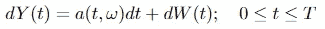*

*是概率空间上的维纳过程*(ω，𝓐，Q)* 。并且相应的 Radon-Nikodym 由等式 3.1 给出。为了方便参考和这个公式的重要性，我们再次粘贴到这里*

**

*Radon-Nikodym 导数。*

*摘要*

*在这篇文章中，我们从概率分布的连续性开始——离散、绝对连续和奇异连续。然后介绍了 Radon-Nikodym 导数和理论，这是 Girsanov 定理的基础。最后一节介绍了 Girsanov 定理。Girsanov 定理的两个公式被包括，一个是从 Wiener 测度到另一个测度的变化，另一个是在两个不同的测度之间切换。最后，我们证明了 Girsanov 定理的逆定理。Girsanov 定理的一个非常有趣和有用的应用是用 Black-Scholes 公式鞅来建模资产价格。这篇文章不包括它，因为它已经够长了。我们将在即将发布的关于金融衍生品和布莱克-斯科尔斯公式的文章中看到它。:)*

*参考资料:*

*[1]罗森塔尔，J. S. (2006 年)。*先看严谨的概率论，一个*。世界科学出版公司。*

*[绝对连续措施](https://encyclopediaofmath.org/wiki/Absolutely_continuous_measures)。*数学百科全书。**

*[3]戴夫·纽霍夫， [*连续和绝对连续随机变量*](https://www.eecs.umich.edu/courses/eecs501/abs.cont.pdf) (2003)。2022 年 7 月 2 日访问。*

*[4]库普曼斯，L. H. (1983 年)。 [*给本科生讲授奇异分布*](https://www.tandfonline.com/doi/abs/10.1080/00031305.1983.10483128) 。*美国统计学家*， *37* (4a)，313–316。*

*[5] [维纳测度](https://planetmath.org/wienermeasure) (2013)。2022 年 7 月 5 日访问。*

*[6]ksen dal，B. (2003 年)。<https://link.springer.com/chapter/10.1007/978-3-642-14394-6_5?noAccess=true>*随机微分方程。在*随机微分方程*(第 65–84 页)。斯普林格，柏林，海德堡。**

**[7]谢尔·多克萨姆。(2008). [Radon-Nikodym 衍生物](https://pages.stat.wisc.edu/~doksum/STAT709/n709-5.pdf)。于 2022 年 7 月 9 日访问。**

**[8] [拉东-尼科代姆定理](https://www.maperez.net/documents/The_Radon-Nikodym_Theorem.pdf) (2010)。于 2022 年 7 月 9 日访问。**

**[9]e . a .泽奥多洛和 e .托多洛夫[基于 Girsanov 的直接政策梯度方法](http://citeseerx.ist.psu.edu/viewdoc/download?doi=10.1.1.296.8261&rep=rep1&type=pdf)。**

****更改日志****

1.  **条件 1.1 下的文字右:我写的不是“*ω*是 *X* 的定义域”，而是“ω是 X 的像”。**