# 随机过程导论(1)

> 原文：<https://towardsdatascience.com/an-introduction-to-stochatic-processes-8c0b51ca73a9>

## 伊托引理:定义和应用

在这篇文章中，主要话题是 ITM 引理，它在金融数学中起着重要的作用，并且是处理随机过程的有用工具。可以找到很多关于这个话题的文章和文献，但是很少包括背景的介绍，比如维纳过程，滤波等等。他们通常假设读者已经熟悉这些概念。当然，搜索相关的上下文是很容易的，但是把所有的东西放在一起要花相当长的时间。这就是这篇文章试图帮助解决的问题——将 ITM 引理与随机过程的相关概念联系起来。

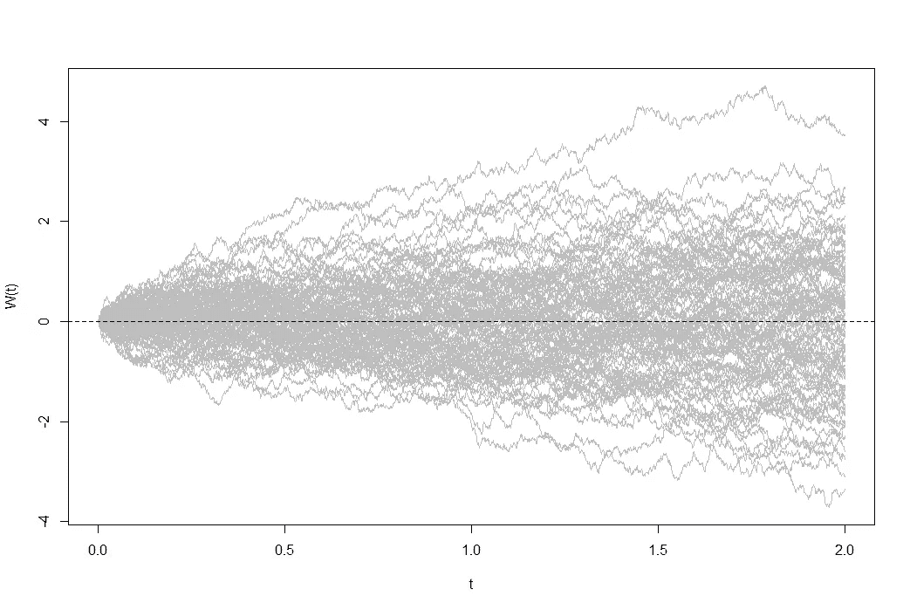

维纳过程的 100 个模拟轨迹(图片由作者提供)

# 先决条件

## 维纳过程

我们引入的第一个重要概念是维纳过程，它是 it4 过程的一部分(我们将看到，在 it4 过程中，它充当积分器)。它被定义为一个*随机过程*(或随机过程，由一个指数集[4]排序的随机变量的集合)，具有以下四个性质:

1.  初始值 *W(0) = 0* 。
2.  维纳过程**几乎必然**连续(但不可微):以概率 *1* ，函数 *t → W(t)* 在 *t* 连续。(我们说“几乎”，因为可以有一组 *t* 的勒贝格测度为 *0* ，在此处函数不连续。)它适用于绝对连续性意味着几乎肯定的连续性。关于几乎肯定是连续但不是连续的维纳过程的例子，参见这个 [StackExchange 答案](https://quant.stackexchange.com/questions/16693/why-is-brownian-motion-merely-almost-surely-continuous)。
3.  进程 *{W(t)}* ₜ≥₀ 具有固定的、独立的增量。
4.  增量 *W(t+s)-W(s)* 具有正态分布 *N(0，s)* (我们用这个来表示均值 *μ=0* 方差 *σ =t* 的正态分布)。重要的是要注意增量是独立的，只有当它们*不与*重叠时。并且可以很平凡的推导出一个维纳过程 *W(t)* (从 *W(0)* 开始)的分布是 *N(0，t)* 。

## 过滤和鞅

**过滤**的定义非常直观。考虑一个概率空间*(ω，𝓕，P)* (参见[此处](https://medium.com/towards-data-science/measure-theory-in-probability-c8aaf1dea87c)，关于概率空间的基础知识和符号的意义)*过滤*是一个σ-代数*的序列，𝓕₀，，…，𝓕ₙ，*具有性质 *𝓕₀ ⊂ 𝓕₁ ⊂ … ⊂ 𝓕ₙ* 。但是，好像很抽象。直观地说，过滤包含到时间 *t* 为止的所有信息。为了更好地理解它，我们可以使用下面的例子(它很长，但绝对值得一读，因为不理解什么是过滤，就不可能理解基于它的其他定义):

我们掷两个骰子，设 *S = {1，2，3，4，5，6}* ，设样本空间为*ω= S×S*，这是两次投掷所有可能结果的集合(每个结果都是有序对)。在时间零点，我们不掷任何骰子，σ-代数是𝓕₀={∅，ω}，因为，在这种状态下，没有额外的信息(单词“信息”指的是在这一步“可能发生的事情”)被添加到 *σ-* 代数中，我们只知道 **(1)** 任何结果都是可能的——*ω∈𝓕₀*，其中*ω*是事件(我们知道事件是中的一个元素 **(2)** 无一胜负——*，这是*ω*的补数(我们知道在一个 *σ-* 代数中如果*a∈ω*，那么*ā∈ω*)。因为如果掷骰子，肯定会有一些结果，事件∅的概率为零， *P(∅) = 0* 。*

*在第一次投掷时，第一次投掷的信息将被添加到包含第一次投掷后所有可能事件的 *σ-* 代数-*𝓕₁*中。比如 *{2，4，6}×S ∈ 𝓕₁* ，因为可能是第一次抛的结果是偶数，对应事件 *{2，4，6}* ，至于第二次抛，可以是 *S* 中的任何东西。同理，也是 *{1，3，5}×S ∈ 𝓕* ₁，在这种情况下，第一次抛硬币的结果是奇数，对应事件 *{1，3，5}* 。同理可以得出结论，*𝓕₁=**𝒫(s)×s*(*2⁶*元素)*，*其中 *𝒫(S)* 表示 s 的幂集，表示第一次抛的所有可能事件。*

*在第二次投掷时，第一和第二个脚趾上都有信息。𝓕₂包含了第二次投掷后所有可能的事件。这就意味着*𝓕₁=**𝒫(s×s)*(*2⁶*元素) ***。***【5】*

*与随机过程 *X(t)* 相关的**自然过滤**或生成过滤是一种过滤，使得在每个时间 t，随机过程 X(t)是 *𝓕* ₜ-measurable.形式上，*

*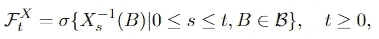*

**𝓕1.0 道具* ₜ-measurable*

*这里使用 Borel 代数，因为随机过程的状态参数通常是实数线，其 *σ* 代数是 Borel 代数。并且我们说随机过程 X(t)是**适应**过滤 *𝓕* ˣ.一个重要的事实是*

> *随机过程 X 总是适应其自然过滤。*

*此外， *𝓕* ₜ是最小的*σ*-代数，从而满足性质 1.0。直观上， *𝓕* ₜ代表了 t 时刻的所有可用信息，这意味着过滤 *𝓕* ˣ代表了随机过程的信息(这已经通过上面的例子说明了)随时间的演化， *X(t)* 的值只取决于在 *t* 之前的演化。*

*既然我们知道了什么是过滤和适应过程，现在就很容易理解什么是鞅了。考虑一个适应的随机过程 X(t)，0 ≤ t≤ T，过程 X(t)是一个**鞅**如果它没有上升或下降的趋势。形式上，*

*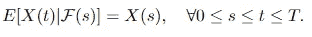*

*等式 1.1 鞅*

*我们有如下观察结果:*

> *维纳过程是关于其自然过滤的鞅。*

*这可以显示如下*

*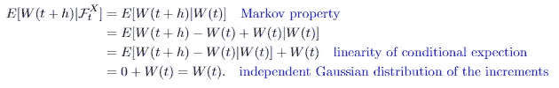*

*维纳过程是鞅的证明。*

*证明过程是鞅的另一种可能方式是通过 ITT 引理，我们将在后面讨论 ITT 引理的应用时看到这一点。*

## *二次变分*

*二次变化是随机过程的一种变化(不同变化的一个例子是线性变化)。设 *X(t)* 为任意过程，则 *X(t)* 的二次变化又为随机过程，定义为*

*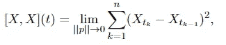*

*等式 1.2 二次变差。*

*其中*p ={0=t₀<t₁<…<tₙ= t }*是一个分区，其范围超过时间间隔*【0，t】*的分区，并且 *||p||* 表示该分区中最大间隔的网格:*

*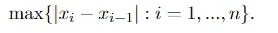*

*Def 1.3 目。*

*可以证明维纳过程的二次变差 *[W，W](t) = t* 几乎必然。*

# *It 积分*

*首先，我们将介绍什么是“积分”以及它是如何构造的。它就像正态积分一样，但是积分是随机的。它推广了 *Riemann-Stieltjes 积分*，后者是 *Riemann 积分的推广。**

*更确切的说:黎曼积分的推广发生在“积分器”被一个函数代替的方式，这个函数原本是一个无穷小的数(我其实没见过“积分器”这个术语被用在黎曼积分的上下文中，但图 2.1 会把事情说清楚)；it0 积分是黎曼-斯蒂杰斯积分的随机推广。*

*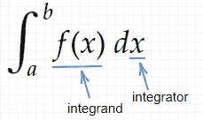*

*图 2.1 被积函数和积分器。*

## *积分的定义*

*积分实际上是什么，如下定义所示:*

*设 *f ∈ 𝒱(S，T)* 。那么 *f* 的 it0 积分(从 *S* 到 *T* )定义为*

**

*情商。2.2 积分的定义。*

*其中 *{ϕₙ}* 是一系列简单函数**使得***

*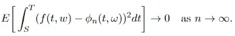*

*Exp。2.3 等式中应满足的{ϕₙ}的性质。2.1.*

*注意，表示维纳过程的 Wₜ有时被表示布朗运动的 Bₜ所代替。[1]我们不需要担心这个，因为它们是一回事。在本文的其余部分，我们将采用 *S=0* ，这是通常的情况—该过程从 *t=0* 开始。本文中提到的简单函数，有时也被称为“初等函数”。简单函数的定义在[2]中给出:*

*一个函数 *ϕ∈ 𝒱* 被称为简单，如果它具有以下形式*

*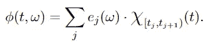*

*Def 2.4 初等函数。*

**χ* 表示特性(指标)功能。不完全清楚，“简单函数”和“初等函数”是否相同。根据[3]，它们是同一个东西；根据[这个](https://unapologetic.wordpress.com/2010/05/11/simple-and-elementary-functions/)对于初等函数来说，集合上的条件更宽松，在集合上定义 *χ* :有可数无穷多个，但对于简单函数来说，只能有有限个。但这并没有给我们带来任何麻烦，因为在 Def 2.4 中，有可数无穷多的集合*【tⱼ，tⱼ₊₁】*两个术语都可以，我们将坚持使用“简单函数”。*

*定义中的 *𝒱* 代表函数类*

*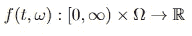*

*满足以下条件:*

1.  **(t，ω) → f(t，ω)* 是 *𝓑×𝓕-measurable，*其中 *𝓑* 表示 *[0，∞)* 上的 Borelσ-代数。*
2.  **f(t，ω)* 是*𝓕ₜ*-适应的。*
3.  **f(t，ω)* 是一个*L*-函数:它是平方可积的，积分是无穷的。*

*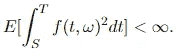*

**f(t，ω)* 应该是一个 *L* 函数*

*表达式 2.3 可能看起来很奇怪，但它直观地意味着 *{ϕₙ}* 是对 *f(t，* ω *)* —想象 *ϕₙ* 是一个阶跃函数，当阶跃变得无穷小时， *ϕₙ* 与 *f(t，* ω *相同。*数学上，表达式 2.3 意味着*it4 积分定义为简单函数的 it4 积分序列的 L 极限。**

# **it4 过程和扩散过程**

**过程或随机积分是(ω，𝓕，p)上适应于𝓕ₜ的随机过程，可以写成以下形式**

**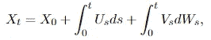**

**情商。3.1 It 流程。**

**其中函数 *U，V ∈ 𝓛₂* 。我们可以看到第一部分——函数 *U* 的积分是确定性的。这是一个黎曼积分。第二部分——函数 *V* 的积分是随机的，并且是过程 *Xₜ* 中唯一的噪声源，它是一个*it4 积分。***

***等式 3.1 也可以根据随机微分以简化形式书写:***

***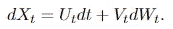***

***情商。3.2 随机微分过程。***

***随机过程 *X(t)* 的**随机微分方程** (SDE)由下式给出***

**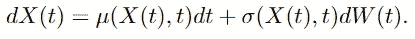**

**方程 3.3 随机微分方程的公式。**

**以方程 3.3 的形式给出的 SDE 被称为 It 型 SDE。(当然也有其他不同类型的 SDE，如 SDE。)并且这种 SDE 的解决方案被称为 it**扩散**，它是**扩散过程**的一个特例。一个过程是一个扩散过程，如果**

1.  **时间变量 t 是连续的。通常我们假设 *t* 是为所有非负实数定义的。**
2.  **它是一个具有转移累积分布函数的马尔可夫过程**

**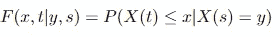**

**方程 3.3.1 过渡累积分布函数。**

**和转移概率密度，其被定义为等式 3.3.1 的偏导数(如果存在)**

**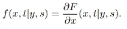**

**方程 3.3.2 转移概率密度函数。**

**3. *Xₜ* 是 *t* 的连续函数。**

**扩散过程的性质完全由两个特征决定:无穷小均值和无穷小方差，以及可能的边界条件。无穷小平均值定义如下**

**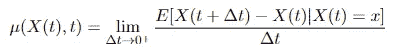**

**方程 3.3.3 无穷小均值(第一个无穷小矩)**

**无穷小方差定义为**

**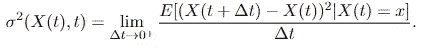**

**等式 3.3.4 无穷小方差(第二个无穷小矩)。**

**这两个特性都可以从公式 3.3 中直接读出。**

## **SDE 的例子**

**SDE 的一个非常重要的例子如下**

**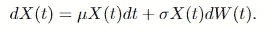**

**方程 3.4 几何布朗运动的公式。**

**方程 3.4 给出的 *X(t)* 的解是**几何布朗运动**。它是由 ITT 引理解决的，这将在 ITT 引理应用的第二个例子中说明。具有初始条件 *X(0) = x₀* 的方程 3.4 的解由下式给出**

**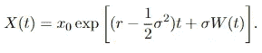**

**方程 3.5 几何布朗运动的显式表达。**

**SDE 的另一个重要例子是**奥恩斯坦-乌伦贝克过程**，由下式给出**

**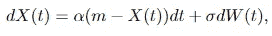**

**奥恩斯坦-乌勒贝克过程的方程 3.5.1 SDE。**

**其中 *m，α，σ*∈ℝ是一些常数。方程 3.6 的直观物理意义是一个质点的运动，该质点随着强度 *σ的噪声向 m 级漂移。*当 *Xₜ >米*时漂移为正，当 *Xₜ <米*时漂移为负。由于这个特征，Ornstein-Uhlebeck 过程也是均值回复过程。在金融中，奥恩斯坦-乌勒贝克过程用于瞬时利率的瓦西切克模型，其中 *σ* 是波动率， *α* 是逆转速度， *m* 是长期平均水平。解决方法是**

**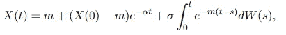**

**方程 3 . 5 . 2 O-U 过程的解。**

**假设过程从 *t=0* 开始。**

## **It 等距图**

**itô integral 定义的思想是首先使用一个简单的函数类来定义积分，然后将其扩展到整个类 *𝒱* 。为此，我们可以使用等距法。**

**ITO 等距的引理表述如下:如果 *ϕ(t，* ω *)* 是简单函数且有界**

**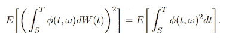**

**等式 3.6 是等距图。**

**构造的步骤在[2]中有详细的论述，但这里我们只说明证明的思路:我们要证明简单函数的随机积分序列**

**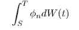**

**简单函数的随机积分序列**

**在具有有限二阶矩的随机变量的 L-空间中形成一个**柯西序列**(随着序列的进行，元素变得彼此任意接近)。由于 L-空间是**完备的**(我们提到这一点是因为，在一个完备的度量空间中，每个柯西序列收敛于那个度量空间中的一个元素)，方程 3.7 给出的序列收敛于 L-空间中的一个随机变量。现在我们试图证明极限是柯西的:**

**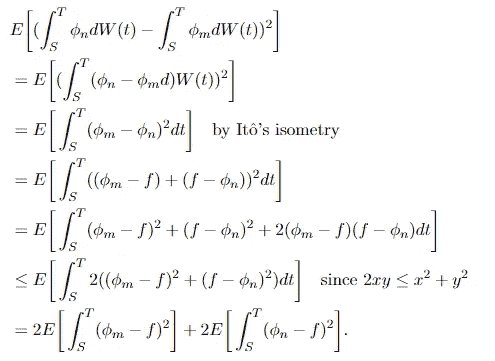**

**等式 3.8**

**从这里，财产**

**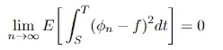**

**我们可以立即看到**

**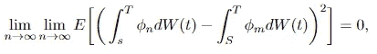**

**等式 3.9**

**结合方程 3.8 和方程 3.9，证明了方程 3.7 给出的序列是柯西序列。[7]**

**等角变换的另一个重要应用是计算随机变量的方差，它以积分的形式给出。我们将在这里展示一个例子:求下列过程的方差:**

**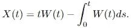**

**等式 3.10 这个的方差是多少？**

**利用维纳过程的性质，很容易看出方程 3.10 给出的 *X(t)* 的期望值为零。注意，因为我们在计算每次 *t* 的方差， *t* 在这里被认为是一个常数。使用“等距”计算差异，如下所示:**

**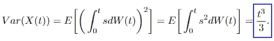**

**结果。**

# **伊托引理**

**it’s 引理给了我们一种寻找随机方程的微分的方法(注意我们用“微分”代替“导数”是因为随机过程是不可微的)，在一些文献中，我们可以看到它被描述为“微积分中链式法则的随机对应物”。动机是对于时间的非随机合成函数 *u = f ∘ g = f(g(t))* ， *t ≥ 0* ，其中 *f* 和 *g* 可微，计算 u 的导数很容易，我们只需要应用链式法则:**

**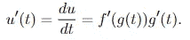**

**情商。4.1 链式法则。**

**然而，这对随机方程不起作用。在这种情况下，我们需要的是 It 的引理，其给出如下:**

**设 *{X(t)}* 为随机微分方程(SDE)方程 3.2 给出的 it4 过程。设 *g(t，x):[0，∞)×ℝ****→****ℝ*为两次连续可微函数。然后随机过程**

**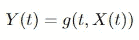**

**是一个具有随机微分的 it4 过程**

**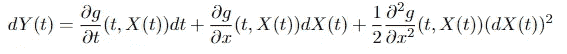**

**情商。Y(t)的 4，2 SDE 表示**

**以下规则适用:**

**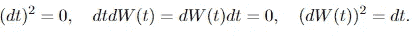**

**在等式 4.2 中，前两项来自普通链式法则，如果 *X(t)* 是二阶可微函数，则该法则适用。同时，最后一项是修正项，是随机过程的新项， *(dX(t))* 是过程 *X(t)* 的二次变量。**

## **应用伊托引理的例子**

**为了理解 ITM 引理是如何工作的，我们可以看看下面的例子。**

1.  **寻找随机过程的 SDE。考虑随机过程**

**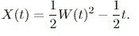**

**求导非随机函数的方法是行不通的。我们需要在这里应用它的引理。我们怎么做呢？第一步，构造辅助函数(这是一个很不正式的术语) *g(X(t)，t)* 。这里我们使用**

**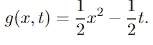**

**情商。4.2“助手功能”。**

**我们写 *g(x，t)* 而不是 *g(X(t)，t)* ，只是为了看起来更好，因为当我们计算 *g(x，t)* 的偏导数时，我们认为它是一个包含两个变量 X 和 t 的函数，并暂时忘记了 X 是 t 的函数这一事实。下一步如下**

**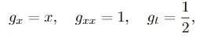**

**方程 4.2 的导数。**

**其中 gₓ表示 *g(x，t)* 关于参数 x 的一阶导数，gₓₓ是 *g(x，t)* 关于 x 的二阶导数，以此类推。而在这种情况下，x 扮演的角色实际上是 *W(t)* 。将导数代入方程 4.2，我们很容易得到**

**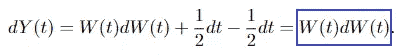**

**ITT 的公式。**

**这意味着**

**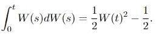**

**2.将一个 It 流程转变为另一个流程。这个例子比上一个稍微复杂一点，因为我们需要做一些替换。假设股票价格 *S(t)* 遵循几何布朗运动:**

**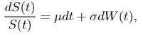**

**Eq 4.3 股票价格模型**

**找到 Sₜ 的*的 SDE。***

**这里我们应该选择哪个辅助函数是显而易见的，我们让 *g(x，t) = ln x* 并计算必要的导数**

**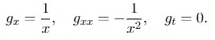**

**应用 ITT 的引理，我们得到**

**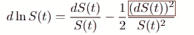**

**方程 4.4 在将伊托引理应用于方程 4.3 之后**

**我们可以用 *dS(t)* 来处理红色方块中的部分。从方程 4.3 我们可以很容易地得到**

**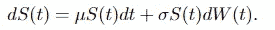**

**等式 4.5**

**将等式 4.5 代入等式 4.4，我们关注红色方块中的部分:我们将其展开，然后可以使用 ITM 引理中陈述的规则:**

**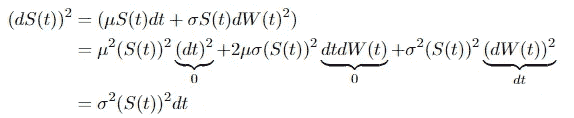**

**将这个表达式代入方程 4.4，我们得到**

**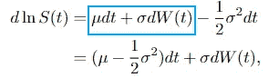**

**等式 4.6 结果。**

**其中蓝色方块中的表达式直接来自等式 4.3。(这种替代的一些步骤被简化了)。在积分方程 4.6 的两边之后，我们得到几何布朗运动的解。此外，根据等式 4.3，假设初始股票价格为 S₀，则我们有**

**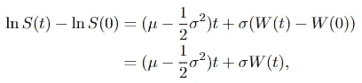**

**等式 4.7**

**其中 *d* ln *S(t)* 由时间 t 处的对数返回和初始值之间的差值代替。(回想一下“ *d* ”的意思是不同。)我们可以看到，一个几何布朗运动的对数是一个**带漂移的维纳过程**。等式 4.7 告诉我们对数收益的条件分布(在初始价格的条件下)是正态的。利用维纳过程的性质，我们可以很容易地读出分布的条件均值和方差**

**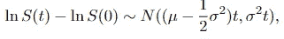**

**等式 4.8 对数收益的条件分布。**

**这意味着收益服从对数正态分布。**

**3.利用 ITM 引理识别鞅。考虑过程**

**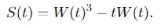**

**等式 4.9**

**S(t)是鞅吗？第一步是找到 SDE 和它的积分形式。这里的辅助函数是**

**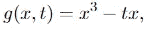**

**其具有与 S(t)相同的形式，并且是一个直接的选择。然后，我们计算必要的导数，并插入公式:**

**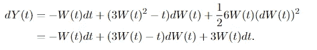**

**方程 4.10 方程 4.9 的 SDE**

**积分形式是**

**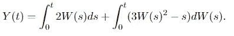**

**方程 4.11 方程 4.10 的积分形式。**

**方程 4.11 中，右边的积分是鞅，左边的不是(原因见[此处](https://quant.stackexchange.com/questions/29504/integral-of-brownian-motion-w-r-t-time))。因此随机过程 S(t)不可能是鞅。**

***总结***

**在这篇文章中，我们展示了 ITT 引理的定义和上下文:ITT 积分，ITT 过程，随机微分方程，以及一些先决条件，如过滤，适应过程，鞅和二次变差。最后给出了引理的三个应用:1 .寻找随机过程的 SDE；2.将一个随机过程转换成另一个随机过程；3.检验随机过程是否是鞅。**

***参考文献***

**[1]埃瑟里奇和巴克斯特(2002 年)。金融微积分课程。剑桥大学出版社。**

**[2]ksen dal，B. (2003 年)。[随机微分方程](https://link.springer.com/chapter/10.1007/978-3-642-14394-6_5?noAccess=true) 。在*随机微分方程*(第 65–84 页)中。斯普林格，柏林，海德堡。**

**[3]弗洛雷斯库本人(2014 年)。 [*概率与随机过程*](https://books.google.cz/books?id=Z5xEBQAAQBAJ&pg=PA125&lpg=PA125&dq=simple+function+vs+elementary+function+probability&source=bl&ots=kwsCZLuMyZ&sig=ACfU3U01s8gxIOIWXyNGhLG-FLAEkt2i4w&hl=cs&sa=X&ved=2ahUKEwidmPyPp7z3AhVjhP0HHQD0COEQ6AF6BAg4EAM#v=onepage&q=simple%20function%20vs%20elementary%20function%20probability&f=false) 。约翰·威利的儿子们。**

**[*【4】随机过程及其分类*](https://www.lkouniv.ac.in/site/writereaddata/siteContent/202003241550010566rajeev_pandey_Stoch_Process.pdf) 。2022 年 5 月 20 日访问。**

**[*概率论中过滤的例子*](https://math.stackexchange.com/questions/2279205/example-of-filtration-in-probability-theory) 。2022 年 6 月 12 日访问。**

**[6]惠特，W. (2007 年)。 [*随机微积分快速入门*](http://www.columbia.edu/~ww2040/4701Sum07/lec0813.pdf) 。2022 年 6 月 13 日访问。**

**【7】*[*克森达本*](https://math.stackexchange.com/questions/1712378/construction-of-the-it%c3%b4-integral-in-%c3%98ksendals-book-why-is-this-sequence-a-cauch) 中的 It“积分”的构造。2022 年 6 月 16 日访问。***

***【8】扩散理论。6 月 18 日访问。***

****随机积分。6 月 19 日访问。****