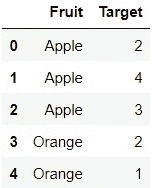
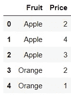
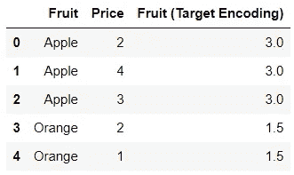
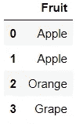
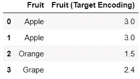

# 监督编码方法介绍

> 原文：<https://towardsdatascience.com/an-introduction-to-supervised-encoding-methods-add83390686f>

## 探索使用标记数据转换分类特征

luis gomes 的照片:[https://www . pexels . com/photo/close-up-photo-of-programming-of-codes-546819/](https://www.pexels.com/photo/close-up-photo-of-programming-of-codes-546819/)

像 one hot 编码和 ordinal 编码这样的编码技术目前主导着数据科学领域。它们是无监督的方法，这意味着它们仅基于分类特征的值来转换分类特征。

也就是说，还有一个不太知名的编码方法分支:**监督编码方法**。监督编码方法需要使用目标标签来导出分类数据的数字表示。

目前有大量的文献支持某些监督编码方法，因此值得掌握使用目标标签对分类特征进行编码的概念。

## 使用目标标注对要素进行编码

对于那些习惯于只使用像一个热编码这样的无监督编码方法的人来说，使用目标标签来编码值可能看起来像一个陌生的概念。

作为介绍，我们可以进行一种最简单的监督编码方法:**目标编码**。目标编码需要用相应目标标签的平均值来表示类别。

让我们使用下面的虚拟数据。

由作者创建

在这里，每种水果都有相应的目标。在这种情况下，我们将数据按水果分组，并找出每种水果的平均价格。这些平均值将用于表示水果类别。

由作者创建

## 利益

使用标记数据对分类特征进行编码的优势一目了然。

首先，编码方法直观且易于执行。

它还使用户能够在不增加数据集中列数的情况下转换分类特征。在这方面，监督编码方法优于像热编码这样的方法，热编码容易受到维数灾难的影响。

## 缺点

像任何技术一样，监督编码方法也有自己的缺点。

首先，用这种方法建立的模型容易过度拟合。毕竟，分配给分类特征的数值完全取决于目标标签在训练集中的分布，因此存在用此数据训练的模型不能用看不见的数据正确概括的风险。

其次，监督编码方法可能不足以代表少数类别。

最后，如果监督编码方法执行不当，随后的模型将遭受数据泄漏，这可能发生在数据被分割之前的*应用变换时。*

## 潜在的解决方案

自然，那些寻求解决监督编码方法风险的人有许多工具和技术可供他们使用。

用户可以将某种形式的正则化合并到他们的转换中。他们可以应用平滑技术，这需要在类别平均值和全局平均值之间指定一个值。另一种选择是将高斯噪声添加到训练数据中，以减轻模型过拟合。

用户也可以选择使用更复杂的编码方法。毕竟，像目标编码这样的技术是建立在过于简单的逻辑之上的，可能不适合编码特性。替代目标编码的一个例子是**留一个编码**，这需要取除当前行之外的所有行的目标标签的平均值。

## Python 中的监督编码

现在的大问题是:我们如何将监督编码方法纳入我们的特征工程程序？

对于 Python 用户来说， [category_encoders](https://contrib.scikit-learn.org/category_encoders/) 包提供了各种监督和非监督转换器，可用于对分类特征进行编码。

此外，该包中的变压器与 Scikit Learn 管道兼容，因此它们可以与其他功能工程工具结合使用！

总的来说，这个包是那些希望使用监督编码方法来转换分类特征的人的天赐之物。

现在，我们将使用他们的一个转换器来执行目标编码。让我们使用相同的虚拟数据。

由作者创建

首先，我们可以创建一个`TargetEncoder`对象。

注意`smoothing`超参数当前设置为 0。这意味着在变换中不会应用平滑。

然后，我们可以使用这个对象来转换虚拟数据。

代码输出(由作者创建)

现在，我们可以使用这个转换器为看不见的数据编码。假设我们正在使用下面的测试集。

由作者创建)

`TargetEncoder`对象可以使用来自训练数据的参数为测试数据中的每个类别分配数值。

代码输出(由作者创建)

请注意,“Apple”和“Orange”类别的赋值与它们在训练数据中的赋值相同，而“Grape”类别的赋值是目标标签的全局平均值。

## 结论

照片由 [Prateek Katyal](https://unsplash.com/@prateekkatyal?utm_source=medium&utm_medium=referral) 在 [Unsplash](https://unsplash.com?utm_source=medium&utm_medium=referral) 上拍摄

虽然本文没有探索监督编码方法的能力，但是它已经让您熟悉了使用目标标签来转换分类特征的想法。

最终，像热编码这样的无监督技术可以完成这项工作，但它们并不总是理想的选择。一般来说，最好不要依赖某些技术，总是愿意探索相同问题的新解决方案。

我祝你在数据科学的努力中好运！