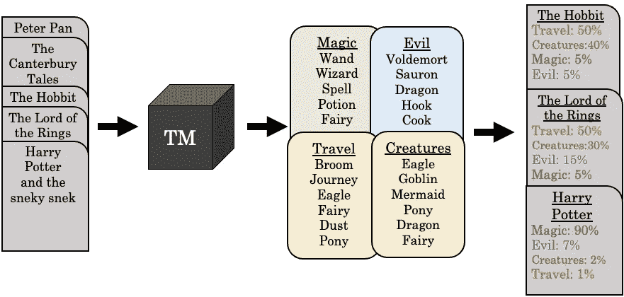
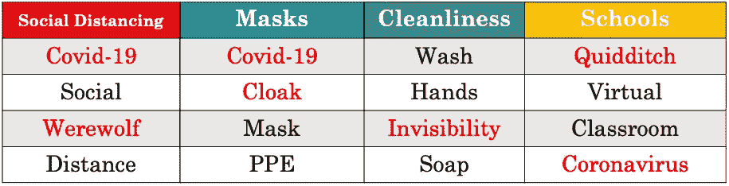
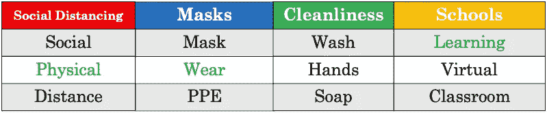
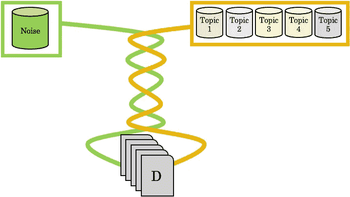
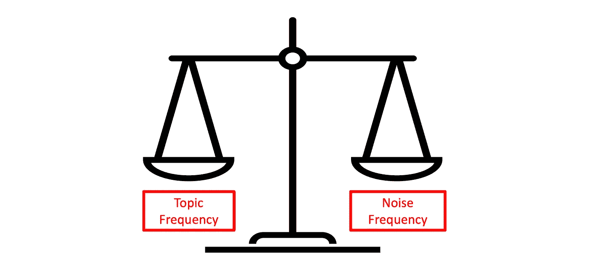
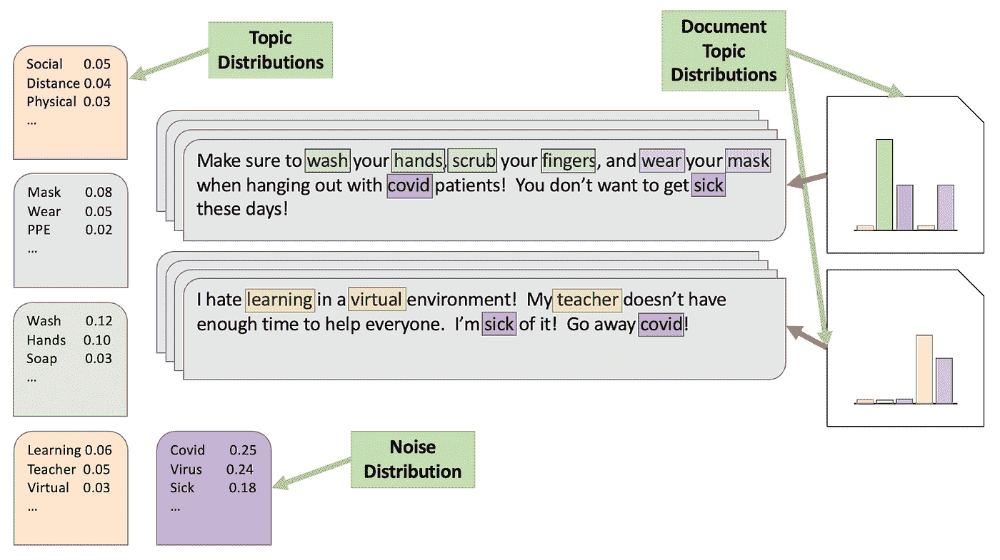
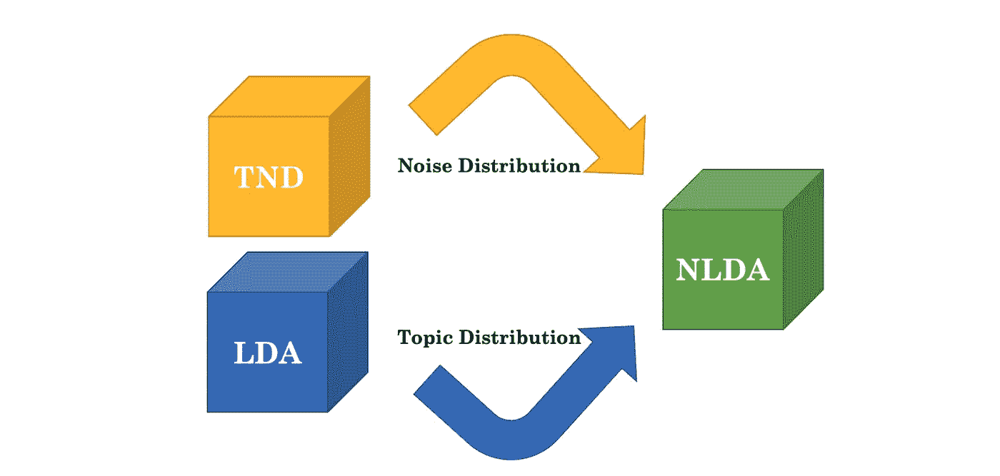
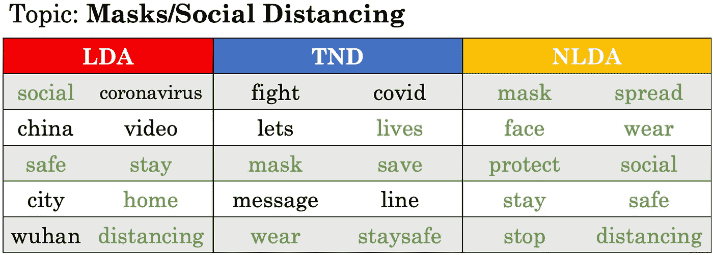
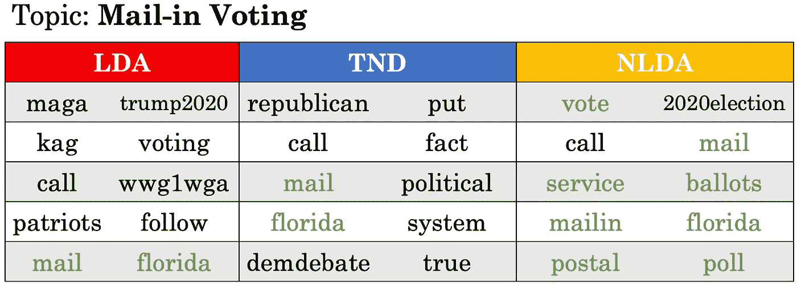

# 话题噪音模型介绍

> 原文：<https://towardsdatascience.com/an-introduction-to-topic-noise-models-c48fe77e32a6>

## 学习如何使用话题噪音模型(1/3)


秩序问题。如今，很难从噪音中找到最重要的词。在这一系列文章中，我们将介绍一种新的模型——话题噪音模型，并向您展示如何在社交媒体文本数据集上使用这些模型来生成更多可解释的话题。社交媒体数据可以以多种不同的形式出现，例如文本、音频、图像和视频等。在本文中，当我们使用短语社交媒体数据时，我们指的是在帖子和/或个人资料中找到的文本数据。本文解释了主题噪声模型与传统主题模型的不同之处。然后介绍了 *gdtm* python 包，并展示了如何使用原始主题噪声模型、主题噪声鉴别器(TND)和无噪声潜在狄利克雷分配(NLDA)的例子。本系列的第二篇和第三篇文章介绍了主题噪声模型的半监督和时间变体，并展示了如何有效地将它们与社交媒体数据集结合使用，以构建更高质量的主题。

> 注意:本系列旨在对主题噪声模型进行高层次的解释，并演示如何在实践中使用它们。对于所有的事实细节，你可以在这里阅读研究论文。

# 介绍

在社交媒体数据集，特别是与新冠肺炎或 2020 年总统选举有关的特定领域数据集，大多数传统的话题模型都难以有效地过滤话题中的噪音。虽然很容易预处理掉停用词(常见的词，如“if、ands 和 buts”)和其他常见类型的干扰，但我们必须依赖底层模型来消除不太明显的干扰类型，如不属于该领域的词(垃圾邮件词)，或在该领域中太常见的词(泛滥词)。传统的主题模型，如潜在的狄利克雷分配(LDA) [Blei et al .，2003]，很难消除社交媒体数据中固有的噪音。因此，生成的主题通常是不连贯的，换句话说，人类很难理解。

发明主题-噪音模型是为了在使用来自社交媒体等噪音领域的文本时，产生比传统主题模型更连贯、更可解释的主题。话题-噪声鉴别器(TND) [Churchill 和 Singh，2021 (2)]是最初的话题-噪声模型。TND 联合近似数据集上的主题和噪声分布，以允许更准确的噪声去除和更连贯的主题。它可以作为一个独立的模型来产生主题，或者与其他模型相结合来创建基于其他主题分布的主题。我们提倡将 TND 与你最喜欢的主题模型结合起来，因为经验表明，TND 与更传统的主题模型结合时效果最佳。在这一系列文章中，我们将描述我们如何集成 TND 和 LDA 来创建一个称为无噪声潜在狄利克雷分配(NLDA)的模型，我们将向您展示如何有效地使用它。

# 什么是主题模型？

在我们描述主题噪声模型之前，我们应该对什么是主题模型有相同的理解。图 1 显示了在非常高的层次上确定文档主题的过程。一个**主题模型**(黑盒)取一组文档(最左边)，返回一组总结文档(最右边)的 *k* 主题(图 1 中四个)。一个**题目**是一组相关的单词。在图 1 中，我们看到我们的示例数据集由奇幻类书籍组成。我们说数据集的**域**是奇幻书籍。对于这些文章的其余部分，我们将处理特定于领域的数据集，即由引用相同广泛主题领域的文档/帖子组成的数据集。



图一。什么是主题模型？

由黑框表示的主题模型依次扫描文档，找到在同一上下文中重复出现的单词。主题模型通过观察哪些单词在同一文档中频繁出现来工作。当单词一起出现在同一文档中时，它们出现在同一主题中的概率会增加。在观察了数以千计(或更多)的文档后，该模型收敛到一组主题，每个主题都以高概率分配给频繁出现在一起的单词。关于主题模型更完整的解释，请参考*主题建模的演变*【Churchill and Singh，2021 (3)】。

在图 1 中，主题模型分别返回关于*魔法*、*邪恶*、*旅行*和*生物*的四个主题。通常话题不会像这里一样有标题。研究人员需要自行确定这些主题类别。大多数主题模型还提供了文档集合中每个单词的概率。在图 1 中，我们向您展示了每个主题中出现概率最高的单词。比如*魔杖*在*魔法*题目中概率最高。这些主题可以由人类来解释，以更好地理解整个数据集，或者它们可以用于根据最可能的主题对文档进行分类，如图 1 的最右侧所示。在这个例子中，我们看到*旅行*是*霍比特人*和*指环王*的主导话题，而不是*哈利波特*。一般来说，主题模型非常擅长识别传统文档中的主题，如书籍、报纸文章和研究论文，因为它们的噪音更少。

# 主题模型有什么问题？

社交媒体文档(帖子)比书籍短得多。因此，当主题模型寻找在文档内和文档间连续出现的重复单词时，它找不到。推文特别短，由于发布到 Twitter 上很容易，推文经常编辑得很差。单词在十个单词的文档中不能像在书中一样重复出现。社交媒体文档对主题模型提出了独特的挑战。属于同一主题的单词经常没有足够的重复来区分主题单词和干扰单词。同样，关于同一主题的两篇文章可能根本不包含任何相同的单词。考虑两句话，“这不是火箭科学，清洁你的手指和手掌，以避免感染冠状病毒，”和“这就像魔术一样！Covid 可以通过洗手来遏制！”两者表面上都是关于新冠肺炎清洁的相同话题，但包含的内容却完全不同。

这个问题表现在话题嘈杂，难以解读(语无伦次)。为了证明这一点，我们创建了一个由虚构的推特组成的虚假数据集，这些推特是从哈利·波特人物的角度写的，关于新冠肺炎·疫情(这里的域是新冠肺炎·疫情)。这个虚假数据集中的一个文件的例子是，“冠状病毒爆发导致霍格沃茨魁地奇赛季取消。”使用这些虚构的 tweets 生成主题后(图 2)，我们可以看到特定领域的噪声如何影响主题。在图 2 中，每一列都是一个主题。



图二。嘈杂的话题。

首先，我们可以看到其中三个主题包含了单词*新冠肺炎*的变体。这些词属于该领域，但它们在该领域内是如此普遍，以至于它们无助于主题之间的描述。如果每个话题都包含同一个词，那么我们就更难理解如何区分每个话题。第二，题目里有一堆和哈利波特有关的词(*狼人*、*斗篷*、*隐身*、*魁地奇*)。虽然这些词可能是奇幻书籍领域的相关主题词，但它们不会增加我们对疫情的了解(除非我们有一个不寻常的社交媒体数据集)。



图 3。更好的话题。

图 3 显示了主题的一个更好的版本，其中干扰词被过滤掉，并替换为更有意义的主题词。在图 3 中，每个主题是一个列。主题噪声模型的目标是识别和去除主题中的噪声词。关于图 3 中的主题的另一个有趣的观察是，一些单词实际上是预期短语或 ngram 的一部分。例如，*社交距离*、*戴面具*和*虚拟学习*都是与新冠肺炎疫情相关的常见短语。这些短语和其他类似的短语可以直接合并到主题模型中，但是由于短文档中的稀疏性问题，关注单个词并不罕见。两个单词的短语在文档集合中出现的频率往往低于单个单词。这意味着当你有一个包含 unigrams 和 ngrams 的主题模型时，ngrams 自然不会上升到主题单词列表的顶部。

让我们回头看看来自我们的假数据集的示例 tweets，看看短文档的最后一个重要方面。

> "这不是火箭科学，清洁你的手指和手掌以避免感染冠状病毒."
> 
> “这就像魔法一样！Covid 可以通过洗手来遏制！”

因为社交媒体文档比传统文本短得多，所以它们很少包含主题集中的所有主题。第二条虚构的推文包含的词主要指的是新冠肺炎清洁话题，其中一个词( *magic* )可能指的是另一个话题。给定一个更大的文档集，我们可能能够找到其他经常与 magic 一起出现的单词，并围绕它形成一个主题。现在让我们看看主题噪声鉴别器是如何从主题中去除噪声的。

# 话题噪音鉴别器(TND)

主题-干扰词模型不是仅仅从一组文档中生成主题，而是试图通过生成过程从概率上分离主题和干扰词。主题噪音鉴别器(TND)通过概率性地将每个文档中的每个单词分配给主题或噪音分布，基于单词在每个分布中的先验概率。结果是一个全局噪声分布，它近似于一个词成为噪声词的可能性，以及一个主题-词分布，它近似于每个词出现在每个主题中的概率。图 4 显示了我们如何看待 TND 的建设。



图 4。主题-噪声模型沿着主题分布生成噪声分布。

当我们最终确定主题时，我们会单独查看每个主题，并决定每个单词是属于该主题还是噪音。我们根据一个词在主题中的出现频率和噪音分布来决定。我们可以把它想象成一个标尺，一边用话题频率加权，一边用噪音频率加权。图 5 显示了规模类比。一边的频率越高，意味着我们更有可能将这个词归类到一边的权重。



图 5。TND 的天平。

我们已经描述了主题噪音鉴别器的新的重要方面是如何工作的，但是它们是如何一起产生主题和噪音分布的呢？让我们来看看高级算法:

> 给定文档和超参数 k、α、β₀和β₁:的数据集 d
> 
> 对于 D 中的每个文档 *d* :
> 
> 1.从 *d* 的话题分布中概率性地选择一个话题 *zᵢ*
> 
> 2.对于 *d* 中的每个单词 *w* ，根据 *zᵢ* 和 *H* 中 *w* 的概率，将 *w* 赋值给 *zᵢ* 或噪声分布 *H* (图 5)。
> 
> 3.给定新的主题词分配，重新近似 *d* 的主题分布
> 
> 重复上述 X 次迭代(实践中通常是 500 或 1000 次)

超参数 *k* 定义了主题集合中主题的数量。超参数α控制每个文档有多少主题。较高的α设置允许每个文档中有更多的主题。在社交媒体文档中，我们将α设置为一个较低的值，因为文档的大小很少允许每个文档有多个主题。超参数β₀控制一个词可以有多少个主题。我们把β₀定得越高，一个词可以传播的话题就越多。最后一个超参数，β₁，控制单词向主题的倾斜(远离噪声分布)。我们设置的β₁越高，任何给定的词就越有可能是主题词而不是干扰词。你可以认为β₁ 在图 5 的天平的*主题频率*一侧增加了额外的重量。

经过大量的迭代，每个单词都有可能成为主题单词，也有可能成为干扰词。然后，我们可以看看主题和噪声分布，以更好地理解我们的数据。

图 6 描述了一旦我们知道了主题和噪声分布，我们如何查看一些社交媒体文档。我们可以在图 6 中看到每个文档中的单词如何影响该文档的主题分布。第一个文档由绿色和蓝色主题组成，带有一些杂色(紫色)，而第二个文档由黄色主题和一些杂色组成。如果干扰词出现在主题中，而不是出现在它们自己的分布中，我们可能会将这两个文档归类为由相同的通用主题组成，从而导致更难解释的主题和文档分类。



图 6。社交媒体文档中主题和噪音之间的相互作用。

# 无声的潜在狄利克雷分配(NLDA)

虽然 TND 识别高度一致的主题，但从质量上讲，它的主题并不总是像使用其他主题模型生成的主题那样直观。因此，我们建议将来自 TND 的噪声信息与传统的主题模型相结合。通过这种方式，TND 提供了准确的噪声消除，同时保持了人们对用于更传统的文档集合的最新主题模型所期望的相同的主题质量和性能。我们创建了无声的潜在狄利克雷分配(NLDA)，TND 和 LDA 的集合，以证明这种类型的方法的有效性。我们采用 TND 的噪声分布、LDA 的主题分布，并将它们结合起来，以创建比单独使用 TND 或 LDA 更连贯、更可解释的主题(图 7)。



图 7。NLDA 乐团。

我们组合 TND 和 LDA，就像我们选择一个词是属于噪声分布还是属于 TND 本身的一个主题一样。在 NLDA，我们使用图 5 所示的相同标度方法，将 TND 噪声分布中的单词频率与 LDA 主题分布中的单词频率进行比较。缩放参数 *φ* 允许通过将基础频率缩放到相关值来比较噪声和主题分布，即使它们不是使用相同数量的主题 *k* 生成的。

# 主题-运行中的噪声模型

既然我们已经更好地理解了什么是主题模型，为什么需要改进它们，以及主题-噪音模型如何解释社交媒体数据的噪音性质，现在是时候使用它们了。在本节中，我们将介绍乔治敦数据实验室主题模型包( *gdtm* )，并启动和运行 LDA、TND 和 NLDA！

## 数据集

我们认为展示模型在不同数据集上的表现非常重要。如果只对示例数据集有效，那还有什么意义？在本文的其余部分，我们将把基于哈利·波特的数据集的神奇世界抛在脑后，专注于两个真实世界的数据集——一个关于新冠肺炎·疫情，另一个关于 2020 年美国总统大选。这些数据集分别是在 2020 年 3 月至 2021 年 3 月之间，以及 2020 年 1 月至 2020 年 11 月之间，使用与各自领域相关的关键词，使用 Twitter 的 API 收集的。它们分别包含 100 万和 120 万个文档，这对于主题模型标准来说是相当大的。我们对新冠肺炎和选举数据集进行了以下预处理:标记化、URL 删除、标点删除、小写和停用词删除。关于社交媒体预处理的更多细节，我们建议您参考 textPrep [Churchill and Singh，2021 (5)]。

由于 Twitter 的隐私政策，这两个数据集是不公开的，所以对于您自己的实验，我们提供了一个由 196 条预处理推文组成的[小样本数据集](https://github.com/GU-DataLab/topic-modeling-topic-noise-models/tree/main/data)，这些推文取自上面的选举数据集(为了遵守 Twitter 的政策，元数据被删除)，以及一个链接，链接到由 Kaggle 提供的更大的[公共领域数据集](https://www.kaggle.com/datasets/manchunhui/us-election-2020-tweets?select=hashtag_donaldtrump.csv)，该数据集涵盖了与之前的选举数据集略有不同的时间段内的 2020 年选举。

## 安装

首先，让我们确保我们有正确的代码。主题噪声模型是用 Java 实现的(基于 LDA 的[mallet](http://mallet.cs.umass.edu)【McCallum，2002】实现【Blei 等人，2003】，我们认为这是可用的最好的主题模型实现)，但是为了简单起见，我们基于 Gensim 的旧 mallet LDA【řehůřek 和索伊卡，2010】构建了 Python 包装器。

> 注意:gdtm 适用于 Python 3.6 及更高版本。我们还没有在旧版本的 Python 上测试它。本教程假设您使用的是 MacOS 或 Linux。

在您的终端中导航到您的工作目录，启用您计划使用的任何一个[虚拟环境](https://docs.python.org/3/library/venv.html)，然后 pip 安装 gdtm [包](https://github.com/GU-DataLab/gdtm)。你可以在 gdtm 的[文档](https://gu-datalab.github.io/gdtm/)中找到你需要了解的一切。

```
> pip install gdtm
```

一旦安装了 Python 包，您所需要的就是您将要使用的任何主题噪声模型的 Mallet (Java)实现。您可以在 [Topic-Noise Models Source](https://github.com/GU-DataLab/topic-noise-models-source) 资源库中找到 TND 的实现。从存储库中下载 mallet-tnd 文件夹，并记下它的路径，无论它在您的计算机上的最终位置是哪里(path/to/tnd)。Mallet LDA 可以在[这里](http://mallet.cs.umass.edu)找到，但是我们也在我们的源代码[库](https://github.com/GU-DataLab/topic-noise-models-source)的 mallet-lda 文件夹中提供了一个精简版本。从任一位置下载它，并记下它在计算机上的路径(path/to/lda)。现在我们已经有了所有需要的代码，我们可以开始玩主题噪音模型了！

## 加载数据集

选择并下载您的数据集进行实验。您可以使用自己的一个，或者上面的*数据集*小节中提供的两个选项之一。

> 注意:主题噪音模型最适用于数万或数十万条推文或其他社交媒体帖子的数据集。噪声分布的训练是使用随机算法完成的。对于较小的数据集，TND 并不总是能够得到准确的噪声分布，所以不要期望在样本数据集上看到很好的结果！如果您想使用更大的数据集来查看其真实效果，我们建议使用我们上面描述的 [Kaggle](https://www.kaggle.com/datasets/manchunhui/us-election-2020-tweets?select=hashtag_donaldtrump.csv) 数据集。美国选举 2020 Kaggle 数据集包含 172 万条关于 2020 年 10 月 15 日至 2020 年 11 月 8 日之间选举的推文，这些推文是使用 Twitter API 收集的。它被发布到公共领域，这意味着你可以随意使用它。在将更大的数据集放入模型之前，您需要做一些预处理和数据争论。我们建议从更大的数据集中的几十万条推文的子集开始。

数据集可以以您认为方便的任何方式加载，但是传递到模型中的最终数据结构应该由一个文档列表组成，其中每个文档本身就是一个单词列表。

您可以使用 gdtm 的内置函数加载样本数据集:

图 8。使用内置函数加载数据

样本数据集是一个由空格分隔的 CSV 文件。如果您自己制作这种类型的文件，不要意外地包含多余的空格，这一点很重要。正如您在图 8 中看到的，有一个参数传递您喜欢的分隔符，因此您可以在自己的数据集中使用您喜欢的任何一个。

## 管理 TND 和 NLDA

既然我们已经将数据加载到适当的格式中，我们就可以运行我们的模型并生成主题，只需要几行代码。在下面的要点中，我们在第 4 行指定 Java 实现的路径，在第 7 行实例化并运行模型，在第 9 行和第 10 行获得我们的主题和噪声。我们所要担心的是为我们的数据选择正确的参数。

> 注意:对于特定领域的社交媒体数据，`*k*`应始终至少为`*20*`，`*beta1*`应介于`*9*`和`*25*`之间。我们喜欢用`*k = 30*`和`*beta1 = 25*`表示 Twitter，用`*beta1 = 9*`或`*16*`表示 Reddit 评论。当数据集更嘈杂时，我们增加`*beta1*`来试图在真正属于那里的主题中保留更多的单词。有关该参数的完整解释，请参见[研究论文](https://ieeexplore.ieee.org/document/9679037)(第 IV.B 节)。

图 9。在我们的样本数据集上运行 TND。

运行 NLDA 类似于运行 TND，除了这一次我们运行两个模型的集合，TND 和 LDA。谢天谢地，我们不用担心自己做任何组装。gdtm 帮我们搞定。我们只是提供到 TND 和 LDA 的路径，并指定我们的参数。得到最终的题目和噪音是一样的。

图 10。在我们的样本数据集上运行 NLDA

## 保存结果

现在，当我们调用`get_topics()`和`get_noise_distribution()`时，我们实际得到了什么？

正如我们所料，`get_topics()`返回每个主题最可能出现的单词。我们传递给`NLDA`和`TND`的`top_words`参数决定了每个主题返回多少个单词。

`get_noise_distribution()`功能类似。它获取噪声分布中最有可能的噪声词，并在一个列表中返回它们，从最有可能到最不可能排序。每个单词都在一个元组中，其频率在噪声分布中`(word, frequency)`。来自`TND`(或来自 NLDA 的`tnd_noise_words_max`)的`noise_words_max`参数决定了应该从分布中返回多少个单词。

`top_words`和`noise_words_max`参数是必需的，因为主题词和噪声分布是词汇表中所有词的分布。这些参数纯粹是为了方便，并在分析结果时节省一点时间。

我们可以使用`gdtm`轻松地将主题保存到 CSV 文件中。

图 11。使用 gdtm 保存主题很简单。

## 解释结果

现在我们已经保存了我们的主题，让我们最后来看看它们。以下主题来自 2020 年完整的选举数据集，样本推文来自该数据集。在 CSV 中，每一行都是一个主题(主题没有标题，由用户决定如何称呼它们)。

图 12。使用 NLDA 在关于 2020 年选举的大型推特语料库上发现的话题。每行都是一个主题。

为了简洁和篇幅的原因，我们展示了题目集中前七个题目的前十个单词。我们可以看到，大多数主题都相当连贯。主题包括 G *联合国暴力*(第 1 行)*政党*(第 2 行)，一个一般的推特话题(第 3 行)*新冠肺炎*(第 4 行)*，亲拜登的短语和标签*(第 5 行)*民主党选民*(第 6 行)，以及*亲特朗普的短语和标签*(第 7 行)。

判断主题模型的方法有很多种，它们并不总是彼此一致。像*困惑*和*主题连贯*这样的一些方法依靠纯数学来确定主题是良构的，而其他的则依靠人类的判断。我们发现，就我们而言，主题连贯性和基于人类判断的方法是主题质量的更好指标。虽然这些方法在本文中没有涉及，但是你可以在*主题建模的发展*【Churchill and Singh，2021 (3)】中找到更多的细节。

这些主题当然不是完美的和包罗万象的。然而，大多数是高度可解释的，主题的趋势很容易识别。在第三行，包含一般 Twitter 单词的主题还包含干扰词，如 *lets、you 和 hey* 。这些词太笼统，不能考虑作为话题词，而是漏入话题集中最笼统的话题。更具体的话题如*和*枪支暴力*包含很少的噪音，如果有的话。主题噪声模型的噪声过滤特性要感谢这种可解释性和连贯性。*

## *主题噪声模型与传统主题模型的比较*

*作为本文的总结，我们将看看几个使用 LDA、TND 和 NLDA 在新冠肺炎和选举数据集上生成的主题示例。如果你还记得，这些是我们在 2020 年和 2021 年不同时期收集的大型 Twitter 数据集。我们喜欢在不同的数据集上展示模型的性能，以证明这些模型在不同的领域是一致的。*

*如图 13 所示，第一个主题来自新冠肺炎数据集。这个话题是关于*面具和社会距离*，并且是基于关于新冠肺炎·疫情的一百万条推文的数据集产生的。绿色单词是我们认为属于该主题的单词。*

> *注意:主题是主观的。我们所看到的好的和坏的主题词，以及你所看到的好的和坏的主题词，将会根据我们在领域内的经验和我们的观点而有所不同。你可以不同意我们对以上或以下主题的分析。*

**

*图 13。题目是由 LDA，TND 和 NLDA 发现的。域:新冠肺炎*

*正如我们所看到的，LDA 包括像*中国*、*城市*和*武汉*这样的词，它们中的每一个都可能属于领域中的主题，但是它们不属于这个主题中的*。TND 包含像*战斗*、*让*和*消息*这样的词。这些词可能属于这个主题，但是我们觉得它们太笼统了，在这个上下文中不是好的主题词。正如我们所看到的，NLDA 的主题包含了更直观的符合主题的单词。**

*最后，让我们看一个由 LDA、TND 和 NLDA 在选举数据集上产生的话题。图 14 显示了主题，关于*邮件投票。*由于许多州都实施了疫情措施，这个话题与此次选举尤为相关。正如我们所看到的，LDA 和 TND 都有合理的话，但对于多个主题结合起来。这些词中有许多在该领域内很常见，但并不专门与*邮寄投票*相关，如 *maga、trump2020、kag、republican、*和 *political* 。然而，NLDA 再一次给了我们一个更容易理解，更连贯的话题。虽然有些词是噪音，但我们看到许多词是指邮寄投票系统以及与该系统在不同州的实施相关的戏剧(佛罗里达是邮寄投票最受热议的州之一)。一般来说，大多数单词都与一个主题相关。*

**

*图 14。题目是由 LDA，TND 和 NLDA 发现的。域:选举 2020*

*对两个不同领域的主题的简要评估强调了不同的单词集合可以代表特定的主题。没有一个正确的答案。因此，从数量和质量上评估题目的质量是很重要的。*

# *结论*

*在本文中，我们了解了主题模型如何工作，主题噪音模型如何工作，以及它们如何提高我们从社交媒体数据中获得的主题的质量。我们学习了如何设置我们的编码环境来使用 gdtm 包中的主题噪声模型，如何运行主题噪声模型，以及如何保存和解释我们的结果。我们展示了我们可以用话题噪音模型生成的话题的质量，并且我们展示了由 NLDA 和 TND 生成的话题与由 LDA 生成的话题的比较。*

*在下一篇文章中，我们将研究一个半监督的主题噪声模型，该模型允许用户通过利用用户先前的领域知识将模型引导到一组更好的主题。*

*本文由乔治敦大学计算机科学教授兼海量数据研究所所长 Lisa Singh 合著。*

> *除非另有说明，所有图片均为作者所有。*

# *参考*

*[1] D. Blei，A. Ng 和 M. Jordan，[潜在狄利克雷分配](https://www.jmlr.org/papers/volume3/blei03a/blei03a.pdf) (2003)，机器学习研究杂志 3，993–1022。*

*[2] R. Churchill 和 L. Singh，[话题-噪声模型:对社交媒体帖子集合中的话题和噪声分布进行建模](https://www.churchill.io/papers/topic_noise_models.pdf) (2021)，数据挖掘国际会议(ICDM)，71–80。*

*[3] A.K. McCallum，MALLET:一个用于语言的机器学习工具包(2002 年)，[http://mallet.cs.umass.edu](http://mallet.cs.umass.edu)。*

*[4] R. Řehůřek 和 p .索伊卡，[利用大型语料库进行主题建模的软件框架](https://radimrehurek.com/gensim/) (2010)，LREC 2010 年关于 NLP 框架新挑战的研讨会。45–50.*

*[5] R. Churchill 和 L. Singh， [textPrep:用于社交媒体数据主题建模的文本预处理工具包](https://www.churchill.io/papers/textprep.pdf) (2021)，数据科学、技术和应用国际会议。*

*[6] R. Churchill 和 L. Singh，[主题建模的演变](https://www.churchill.io/papers/evolution_of_topic_modeling.pdf) (2021)，ACM Comput。Surv。(CSURV)*