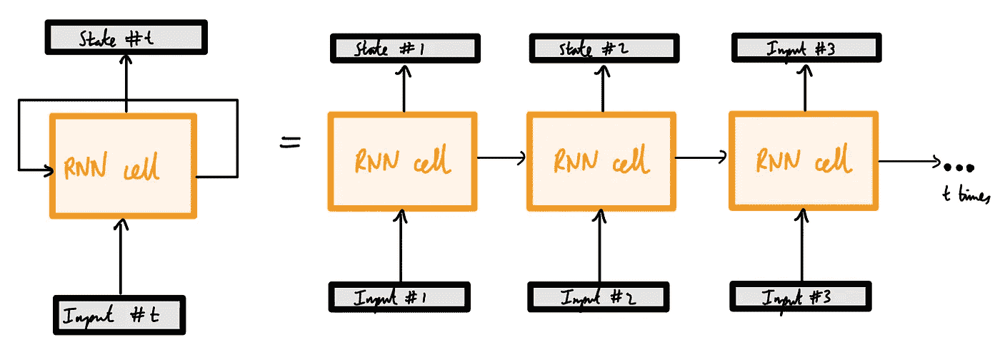
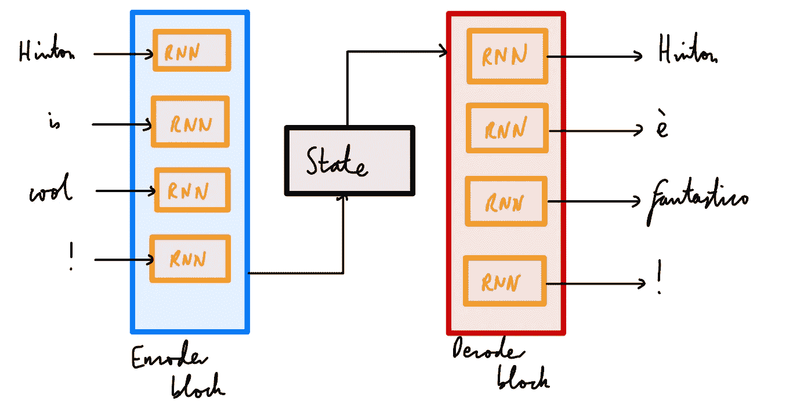
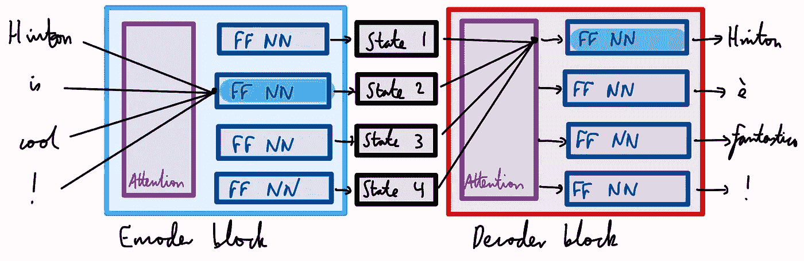
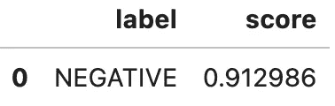
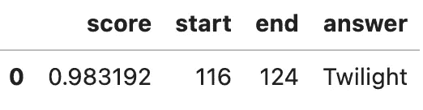
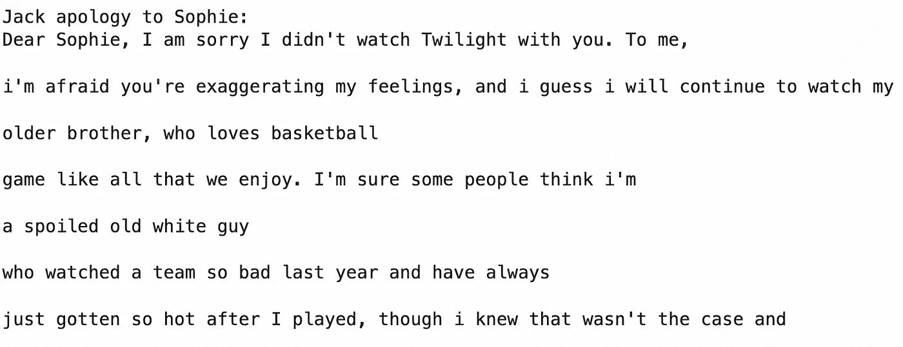

# 变形金刚和拥抱脸介绍

> 原文：<https://towardsdatascience.com/an-introduction-to-transformers-and-hugging-face-13052ec9d72d>

## 从自上而下的方法利用 NLP 的力量

Joshua Hoehne 在 [Unsplash](https://unsplash.com?utm_source=medium&utm_medium=referral) 上拍摄的照片

虽然大多数机器学习的灌输都是从简单的计算机视觉或表格数据问题开始的(我们现在都熟悉 MNIST 和 iris 数据集)，但深度学习的最新发展已经将焦点转移到基于自然语言的问题上。虽然这可能看起来只是 ML 应用的另一个子集，但我相信变压器的出现及其几乎不可避免地扩展到许多应用领域，应该是该领域有抱负的参与者的首要关注点之一。

# 从 rnn 到变压器

NLP 的大部分进展都是通过广泛应用架构实现的。以下是用于自然语言任务的模型的一些主要发展:

*   展开的 rnn
*   编码器-解码器
*   RNNs 的注意机制
*   第一变压器架构

自然语言中使用的原始模型是*循环的*:它们在每一步都保持着某种状态，这种状态随着新的输入被输入到模型的下一部分。你可以在很多地方读到这些 rnn 和 LSTMs，尤其是在 [fastai book](https://github.com/fastai/fastbook/blob/master/12_nlp_dive.ipynb) 的第 12 章。关键在于，在每一步都保持这种“状态”,可以让模型记住许多步骤之前的信息，并将其用于预测。如果我们展开香草 RNN，这就更有意义了。

及时展开 RNN(图片由作者提供)。

然后聪明的人把 rnn 用于机器翻译。这是一个特别复杂的问题，因为将一种语言中的单词映射到另一种语言涉及将任意长度的序列映射到另一个任意长度的序列。编码器-解码器架构就是针对这类问题开发的。随着新的输入被馈入，编码器更新状态，直到最后的输入，在最后的输入，最后的隐藏状态被用数字表示。解码器被馈送这个表示，并使用它来产生输出序列。想象一下解码器逐渐“压缩”每个输入，直到每个输入都整齐地处于最终隐藏状态。然后解码器“解包”，一次一个输出字。

具有一对 rnn 的编码器-解码器架构(图片由作者提供)。

尽管这无疑是朝着正确方向迈出的一步，但是由于只使用一个隐藏状态而导致的*信息瓶颈*是一个问题；解码器只能访问非常简化的序列表示。这对于长文本来说尤其成问题，因为在压缩到最终表示时，序列中很久以前的记忆和表示信息可能会丢失。结果，实践者开始让解码器访问编码器的所有隐藏状态。这就是所谓的*注意力。*

您可能想知道解码器是如何处理所有这些输入的。这就是注意力这个名字的由来；它提出了一些方法来区分编码器正在查看的状态的优先级。聪明的解决方案是在每个时间步长为每个编码器状态分配可学习的参数(或权重，或注意力)。在训练过程中，解码器了解在每个时间步长对每个输出的关注程度。这个过程如下所示。

一种具有针对一对 rnn 的注意机制的编码器-解码器架构(图片由作者提供)。

然而，即使这样也有一个问题:顺序计算，要求一次输入一个，阻止了输入序列的并行化。有几个原因可以解释为什么这不太理想，但其中一个原因是它太慢了。为了解决这个问题，*的变形金刚*向自由形式的注意力模型又迈进了一步。为了做到这一点，它删除了循环网络块，并允许关注网络同一层中的所有状态**。这就是所谓的自我关注，如下图所示。这两个模块都有自我关注机制，允许它们查看所有状态，并将它们馈送到常规的神经网络模块。这比以前的注意力机制(就训练而言)要快得多，并且是许多现代 NLP 实践的基础。**

原始转换器的编码器-解码器架构(图片由作者提供)。

# 自然语言处理中的迁移学习

迁移学习在 NLP 中是一件大事。有两个主要原因:(1)组装一个大的文本语料库进行训练通常是困难的(我们通常只有几个例子)；(2)我们没有足够强大的 GPU(除非我们是 OpenAI 这样的人)来训练这些模型。迁移学习包括采用一个具有预训练权重的模型(其他人已经为我们完成了繁重的工作)并根据新数据对其进行微调。也就是说，我们采用旧模型的**主体**，根据我们的特定任务数据训练**头部**，并将它们拼接在一起。主体负责广泛的一般知识表示，模型的负责人根据实际任务和特定领域的数据对预测进行细微的调整。这意味着我们实际上可以用最少的数据和一个普通的 CPU 产生有用的语言模型。

> 迁移学习类似于计算机视觉，其中模型在大规模数据集上进行预训练，以教授模型视觉的基本特征。然后，我们对特定的数据集进行微调，比如对杂草的类型进行分类。与我们只是根据杂草数据从零开始训练模型相比，使用这种微调模型几乎总能获得更好的结果。

NLP 中的一个关键迁移学习方法是 ULMFiT:用于文本分类的通用语言模型微调。这个想法很简单:预训练一个模型来预测给定单词序列的下一个单词，你可能已经注意到，这不需要标记数据。在这种无监督的预训练之后，对你的特定数据进行相同的训练(预测下一个单词)。最后，在分类任务上训练这个新模型的头。

这一突破孕育了两个结合了自我注意和迁移学习的变形金刚:GPT 和伯特。两者都在许多 NLP 基准测试任务上取得了最先进的结果。

## 为什么需要拥抱脸？

为了标准化训练和使用语言模型的所有步骤，拥抱脸应运而生。他们正在通过构建一个允许轻松访问预训练模型、数据集和标记化步骤的 API 来民主化 NLP。下面，我们将用最少的代码，在最高的抽象层次上演示拥抱脸如何让任何程序员能够立即将 NLP 的前沿应用到他们自己的数据上。

# 展示变形金刚

Transformers 有一个分层的 API，允许程序员在不同的抽象层次上使用这个库。这些层中最抽象的是`pipeline`，它为我们处理一切，即将原始文本转换为来自微调模型的一组预测。

在这次演示中，我们将模拟杰克的女朋友发来的一条短信。(这个例子很好地反映了使用变形金刚的[自然语言处理中对变形金刚的介绍，这是该领域的一本很好的参考手册。)她对他拒绝在周末陪她看《暮光之城》感到不满:](https://learning.oreilly.com/library/view/natural-language-processing/9781098103231/ch01.html#idm46238728685200)

## 情感分类

在 HF Transformers 中，我们通过调用`pipeline()`函数并提供我们感兴趣的任务的名称来实例化管道。在这里，我们也提供模型；不要太担心这个，因为如果你没有传入一个模型，高频变压器将默认为你给它的任务的一个合理的模型。

现在我们有了自己的管道，让我们来做一些预测吧！每个管道接受一个文本字符串(或字符串列表)作为输入，并返回一个预测列表。每个预测都是一个 Python 字典，所以我们可以使用熊猫来很好地将它们显示为一个`Data⁠Frame`:

这给了我们以下情绪预测:

该模型已经非常有把握地预测到索菲的文本消息是负面的。这很好——她显然对杰克和他拒绝看好电影感到沮丧。

## 命名实体识别

情感分类是很好的第一步，但挑选出索菲谈论的特定事物会很有帮助。NLP 中对象的另一个词是*命名实体。*从原始文本中提取这些的过程是*命名实体识别*。同样，我们在这里需要做的就是将我们的任务加载到`pipeline()`函数中，并向它提供我们的文本消息:

图片作者。

我们可以看到，管道检测到了实体，并为它们分配了一个类别，例如`PER`表示人，等等。它也可以使用其他类别如`LOC`进行定位。分数代表模型对预测实体的信心。

## 问题回答

这个任务包括向模型输入我们的文本(称为*上下文*)以及我们希望模型回答的问题。我们来问问模特索菲想让杰克看什么电影(以防他自己还没想明白):

图片作者。

模特很自信杰克没看的电影是*暮光之城*。希望杰克也意识到了这一点。

## 总结

总结的目的是显而易见的:我们想从文本中提取意义并浓缩它。这个任务显然比前面的任务更复杂:它不仅需要提取或映射到一个数字，还需要生成文本*。这是 NLP 神奇的一部分，我们的模型不仅学习解释文本，而且产生文本。就像我们免费获得额外的功能一样。*

*您会注意到，我们已经开始向这些管道传递一些参数，以便更好地控制输出。学习拥抱脸是关于向下移动抽象层次，直到我们进入代码的深度。*

## *文本生成*

*假设杰克是一个糟糕的男朋友，并且刚刚发现拥抱脸。假设他想使用一个转换器来处理对 Sophie 文本的响应，因为他懒得自己动手。(在过去的几年里，文本生成肯定比写道歉文本要花费更多的精力。非常值得注意的是，在拥抱脸中生成一些文本可能真的比键入回复花费更少的时间。)*

**

*图片作者。*

*听着，我不认为这会让索菲感觉更好，但仍然值得注意的是，在大约一分钟内，我们根据一些上下文和提示对短信做出了(某种)连贯的响应。*

# *结论*

*阅读完这篇文章后，显而易见的下一步是探索拥抱脸生态系统，它允许你做三件主要的事情:*

*   **模特:*HF Hub 拥有超过 20，000 名预先训练好体重的免费模特。*
*   **记号化器:*每条管道都由一个称为记号化的预处理步骤驱动，该步骤将原始文本分割成常见的记号，然后将这些记号映射成数字表示用于训练。由于这一步非常重要(还有一些子步骤，如标准化输入和将模型输出从标记转换回文本)，HF 提供了[标记化器](https://github.com/huggingface/transformers)来为我们做这件事。*
*   **数据集:*大多数自然语言处理数据集都很大——大到笔记本电脑的内存都装不下。HF 为数据集提供了一个标准接口，并使用智能缓存和内存映射来避免 RAM 限制。*

*要获得更多资源，一个很好的起点是[拥抱脸文档](https://huggingface.co/docs)。打开笔记本，写下你自己的示例文本，重新创建上面生成的 NLP 应用程序。祝你的 NLP 之旅好运！*

## *参考*

*[1] L. Tunstall、L. Werra 和 T. Wolf，[用转换器进行自然语言处理](https://learning.oreilly.com/library/view/natural-language-processing/9781098103231/copyright-page01.html) s (2022)，奥赖利媒体*

*[2] J. Howard 和 S. Ruder，[面向文本分类的通用语言模型微调](https://arxiv.org/pdf/1801.06146.pdf) (2018)，arxiv*

*[3] A. Vaswani 等人，[注意力是你所需要的全部](https://arxiv.org/pdf/1706.03762.pdf) (2017)，谷歌大脑*